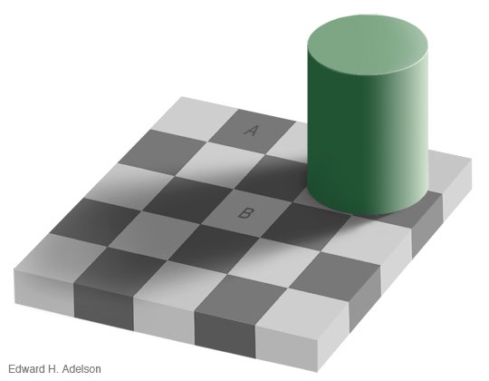
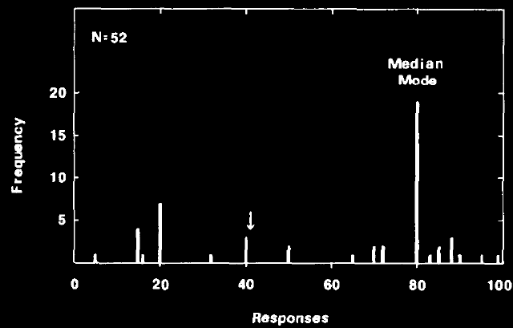

<!-- _class: title -->
<!-- _paginate: false -->
<!-- _footer: "" -->


# Human and<br>Machine Learning

<p class="subtitle">Week 1 &mdash; Introduction and Basic Bayes</p>

<div class="meta">
  Spring 2026 <span class="sep">/</span> Apr 17 <span class="sep">/</span> Prof. Joseph Austerweil
</div>

---

<!-- _class: divider -->

<div class="eyebrow">Block 1 · 5 minutes</div>

# Welcome

---

## Today

- Who you are, what you're hoping to get out of the course
- Why this course exists &mdash; inductive inference under uncertainty
- Basic probability and Bayes' rule
- Two worked examples: sick friend, Kahneman-Tversky cab problem
- What is GenJAX, and how will we use it?
- Logistics and homework

---

<!-- _class: divider -->

<div class="eyebrow">Block 2 · 25 minutes</div>

# Why This Course Exists

### Inductive inference

---

## Deduction vs. induction

<div class="cols">
<div>

**Deduction**

$$1 + 4 = \,?$$

Preserves truth. One answer.

</div>
<div>

**Induction**

$$? + ? = 5$$

Underdetermined. Many plausible answers.

</div>
</div>

<br>

The problems that people excel at &mdash; where we outperform machines &mdash; are **inductive**.

They feel easy. They are not.

---

<!-- _class: centered -->

# Three inductive problems

*(... that the mind solves constantly)*

---

## 1. Perception



Which square is darker &mdash; **A** or **B**?

<br>

The visual system solves
`square color + shadow = intensity`
for square color, using priors about how retinal images are generated.

You are literally looking at an inductive inference right now.

---

## 2. Mental states

**Data:** other people's behavior (motion, speech, gaze).
**Hypotheses:** their goals and beliefs.

*Heider & Simmel (1944) &mdash; animated geometric shapes.*

<br>

**Watch ~90 seconds, then describe what happened:**

https://www.youtube.com/watch?v=VTNmLt7QX8E

---

## 2. Mental states &mdash; debrief

Everyone spontaneously narrates the shapes as agents with intentions, grudges, fears.

**Those intentions were never in the video.** Shapes moved on a plane.

<br>

- **Data:** 2D motion trajectories.
- **Hidden:** goals, beliefs, relationships.

Your mind solved the inverse problem &mdash; *behavior &rarr; mental states* &mdash; without you noticing.

---

## 3. Word learning

You're in the Australian outback. Someone points at a hopping animal and says **"jumbuck."**

What does *jumbuck* mean?

- the animal itself?
- undetached kangaroo-parts?
- kangaroo temporal-stages?
- any mammal?
- dinner?

<br>

All consistent with the data. Children pick one &mdash; *fast.*
They bring strong prior expectations about what words mean.

---

<!-- _class: checkin -->

#### Check-in

**What's the common structure across these three problems?**

<br>

- Hidden variable we care about: $h$
- Noisy / sparse data we observe: $d$
- Prior knowledge we bring to bear

$$P(h \mid d) \propto P(d \mid h) \cdot P(h)$$

*(We'll unpack every symbol in the next hour.)*

---

<!-- _class: divider -->

<div class="eyebrow">Block 3 · 25 minutes</div>

# Basic Bayes

### Foundations, compactly but rigorously

---

## Outcomes, events, event space

Flip two coins.

- **Outcome set:** $S = \{HH, HT, TH, TT\}$ &nbsp; &nbsp; $|S| = 4$
- **Event:** any subset of $S$.
  - e.g., "at least one head" $= \{HH, HT, TH\}$
- **Event space:** the set of events (the powerset of $S$, when $S$ is finite).

For continuous $S$, the math gets trickier &mdash; we'll come back to it next week.

---

## Random variables

A random variable is a **function** from the outcome space to some value space.

$$Y: S \to \{T, F\}, \quad Y(s) = \text{"does } s \text{ have at least one H?"}$$

$$Y(HH) = T, \quad Y(HT) = T, \quad Y(TH) = T, \quad Y(TT) = F.$$

<br>

The word *random* is about the input, not the mapping. The function itself is deterministic.

---

## Probability

$$P(Y = T) = \frac{|\{s \in S : Y(s) = T\}|}{|S|} = \frac{3}{4}$$

Count the outcomes where $Y$ takes the value you care about. Divide by total outcomes.

---

## Joint probability

$$P(\text{first} = H,\, \text{second} = T) = P(\{HT\}) = \tfrac{1}{4}$$

Joint = "both of these at once."

---

## Conditional probability &mdash; set restriction

<div class="cols">
<div>

**Question.**
What is $P(\text{first} = H \mid \text{at least one } H)$?

Many people's first answer: **3/4**.

That's wrong.

</div>
<div>

Conditioning = **restricting the universe** to outcomes where the condition holds.

New universe: $\{HH, HT, TH\}$ (3 outcomes).

Of those, 2 have first $= H$.

$$P(\text{first} = H \mid \geq 1\,H) = \tfrac{2}{3}$$

</div>
</div>

---

## The ratio definition

$$P(A \mid B) = \frac{P(A \cap B)}{P(B)}$$

Same answer:

$$P(\text{first}=H \mid \geq 1\,H) = \frac{P(\{HH\})}{P(\{HH, HT, TH\})} = \frac{2/4}{3/4} = \frac{2}{3} \checkmark$$

---

## Marginalization

$$P(X) = \sum_c P(X, C=c)$$

Sum the joint over the values of whatever you want to get rid of.

---

## Bayes' rule &mdash; one line

From the product rule, both directions:

$$P(A \mid B)\,P(B) = P(A, B) = P(B \mid A)\,P(A)$$

Divide:

$$\boxed{\,P(A \mid B) = \frac{P(B \mid A)\,P(A)}{P(B)}\,}$$

That's it. The rest of the course is understanding what this *means*.

---

<!-- _class: checkin -->

#### Check-in

For the problem I'm about to give you &mdash; **the cab problem** &mdash;

- What's $d$ (the data, the observation)?
- What's $h$ (the hidden variable)?

---

<!-- _class: divider -->

<div class="eyebrow">Block 4 · 35 minutes</div>

# Bayes in Action

### Sick friend · Cab problem · Synthesis

---

## Sick friend

Your 50-year-old friend has been a chain smoker since 18.
There's a nasty cold going around.
You go over to their house. You hear them cough.

Three possibilities:

- **Cold** &nbsp;&nbsp;&nbsp; · &nbsp;&nbsp;&nbsp; **Stomach virus** &nbsp;&nbsp;&nbsp; · &nbsp;&nbsp;&nbsp; **Lung cancer**

How likely is each?

---

## First pass &mdash; qualitatively

<table class="posterior-table">
<thead>
<tr><th></th><th>Prior</th><th>P(cough | d)</th><th>Prior × Likelihood</th></tr>
</thead>
<tbody>
<tr><td class="row-label">Cold</td><td>high</td><td>high</td><td>high</td></tr>
<tr><td class="row-label">Stomach virus</td><td>medium</td><td>low</td><td>low</td></tr>
<tr><td class="row-label">Lung cancer</td><td>medium</td><td>high</td><td>medium</td></tr>
</tbody>
</table>

<br>

Before any math: **cold is most likely.**

---

## With numbers

<table class="posterior-table">
<thead>
<tr><th></th><th>$P(h)$</th><th>$P(\text{cough} \mid h)$</th><th>Numerator</th><th>Posterior</th></tr>
</thead>
<tbody>
<tr><td class="row-label">Cold</td><td>0.45</td><td>0.9</td><td>0.405</td><td class="winner">0.750</td></tr>
<tr><td class="row-label">Stomach virus</td><td>0.10</td><td>0.45</td><td>0.045</td><td>0.083</td></tr>
<tr><td class="row-label">Lung cancer</td><td>0.10</td><td>0.9</td><td>0.090</td><td>0.167</td></tr>
</tbody>
</table>

<br>

Sum of numerators: $0.405 + 0.045 + 0.090 = 0.540$.
Divide each numerator by the sum to normalize.

---

## The pedagogical punchline

$$P(\text{cold} \mid \text{cough}) = \frac{0.9 \cdot 0.45}{0.9 \cdot 0.45 + 0.45 \cdot 0.10 + 0.9 \cdot 0.10} = \frac{0.405}{0.540} = 0.75$$

Even with a chain-smoking friend, $P(\text{lung cancer} \mid \text{cough}) \approx 17\%$ &mdash; not dominant.

The cold wins because:

1. **Priors matter:** colds are going around; lung cancer is rare in any given week, even for smokers. Cold has a ~4.5× higher prior.
2. **Likelihoods matter:** a cough is more likely from a cold (0.9) than a stomach virus (0.45).
3. **Neither alone is enough.** You need the whole rule.

---

<!-- _class: divider -->

# The Kahneman–Tversky cab problem

---

## Setup

- A city has two cab companies: **Blue** and **Green**.
- **85%** of cabs are Green. **15%** are Blue.
- At night, a hit-and-run happens. A witness says the cab was **Blue**.
- The witness correctly identifies cab colors at night **80%** of the time.

<br>

**What is the probability the cab was actually Blue?**

<br>

*(Commit to a number before we compute.)*

---

## Pass 2 &mdash; the area diagram

Imagine 100 cabs.

- **Blue cabs:** 15. Witness correctly says "blue" on 80% of them → **12**.
- **Green cabs:** 85. Witness incorrectly says "blue" on 20% of them → **17**.

Total "blue" reports: $12 + 17 = 29$.

$$P(\text{Blue} \mid \text{witness says Blue}) = \frac{12}{29} \approx 0.41$$

<br>

**Below 50%.** The witness is *more likely wrong than right*, despite being 80% accurate.

---

## Pass 3 &mdash; formal Bayes

Hypotheses $h \in \{B, G\}$. &nbsp; Observation $o$ = "witness says Blue."

$$P(B \mid o) = \frac{P(o \mid B)\,P(B)}{P(o \mid B)\,P(B) + P(o \mid G)\,P(G)}$$

$$= \frac{0.80 \cdot 0.15}{0.80 \cdot 0.15 + 0.20 \cdot 0.85} = \frac{0.12}{0.12 + 0.17} = \frac{0.12}{0.29} \approx 0.41$$

<br>

Same number as the area diagram. The equation and the counting are the same calculation.

---

## Base-rate neglect



Most people report something close to 80%.
They anchor on the likelihood and ignore the prior.

Kahneman & Tversky (1972); Bar-Hillel (1980).

Medical doctors fail this too, even for diagnoses *(Casscells, Schoenberger, Grayboys, 1978)*.

---

## Heuristics and biases

<div class="cols">
<div>

**Heuristic**
A rule-of-thumb. Usually works. Cheap to apply.

**Bias**
Systematic error introduced when a heuristic is misapplied.

</div>
<div>

Kahneman & Tversky argued that the mind is full of heuristics &mdash; good enough for most everyday inference but **wrong in predictable ways** when base rates are extreme, evidence is unfamiliar, or causal structure is unusual.

This is a running theme for the semester.

</div>
</div>

---

## Synthesis &mdash; the 5-step recipe

**This is the course's method.**

1. **Formalize the problem** people face.
2. **Formalize the knowledge** they bring to it.
3. **Apply Bayes' rule** &mdash; compute what an ideal learner would infer.
4. **Characterize the ideal learner's behavior.**
5. **Identify what knowledge and constraints** must be assumed for model and human behavior to match.

Every week we pick a different cognitive domain and run this loop.

---

<!-- _class: divider -->

<div class="eyebrow">Block 5 · 20 minutes</div>

# GenJAX, Admin, Homework

---

## What is GenJAX?

Bayes' rule is easy to write. Enumerating hypothesis spaces by hand is **not**.

For continuous distributions you can't enumerate at all.

**GenJAX** is a probabilistic programming language.
You write the generative process as code. The machine does the enumeration and counting.

---

## GenJAX by example

```python
import genjax
from genjax import gen, flip

@gen
def chibany_day():
    lunch = flip(0.5) @ "lunch"
    dinner = flip(0.5) @ "dinner"
    return (lunch, dinner)
```

- `@gen` &mdash; this is a generative model, not a regular function.
- `flip(0.5)` &mdash; a Bernoulli random variable.
- `@ "lunch"` &mdash; name the random choice so we can condition on it later.

**This function IS the outcome space $\Omega$ from Block 3.** Every call samples a point.

---

## Preemptive callouts

- Use `flip(p)`, **not** `bernoulli(p)`. `bernoulli` takes a logit, not a probability.
- The `@` operator here is **not** matrix multiplication. GenJAX overloads it.
- Output displays as `Array(0, dtype=int32)`. Treat these as 0s and 1s.
- Everything runs in **Google Colab.** No local installation.

---

## Admin &mdash; grading

<table class="data-table">
<thead>
<tr><th>Component</th><th>Weight</th></tr>
</thead>
<tbody>
<tr><td>Final project</td><td><strong>50%</strong> &nbsp;<span class="tag">proposal 5% · talk 7.5% · paper 37.5%</span></td></tr>
<tr><td>Programming assignments (4)</td><td><strong>30%</strong> &nbsp;<span class="tag">Clusters 7.5% · Gen 7.5% · MC 10.5% · RL 4.5%</span></td></tr>
<tr><td>Weekly written reflections</td><td><strong>15%</strong> &nbsp;<span class="tag">~200 words · 8 of 13 · pass/fail</span></td></tr>
<tr><td>Participation</td><td><strong>5%</strong></td></tr>
<tr><td>Quizzes</td><td><strong>0%</strong> &nbsp;<span class="tag">self-check only</span></td></tr>
</tbody>
</table>

<br>

All four assignments are completed in **GenJAX**. Weekly discussion posts and a single paper presentation per student — right-sized for a small seminar.

---

## Admin &mdash; the rest

- **Textbook:** *A Narrative Introduction to Probability* &mdash; https://josephausterweil.github.io/probintro/
- **Tooling:** Google Colab, GenJAX. No local setup.
- **Office hours:** TBD &mdash; I'll poll.
- **Email:** best-effort 36h response (48h on weekends).
- **AI tools:** welcome as a technical resource; must cite; **not** for quiz/assignment answers.
- **Full syllabus** on the course website *(coming up)*.

---

## Homework for Week 2

1. **Textbook T1 Ch 1-3** &mdash; reinforces everything from Block 3.
   `intro/01_goals.md` · `02_hungry.md` · `03_prob_count.md`

2. **Textbook T2 Ch 0-1** &mdash; gets GenJAX running in Colab.
   `genjax/00_getting_started.md` · `01_python_basics.md`

3. Start thinking about a final-project topic. We'll talk Week 2.

Week 2 has a short optional self-check quiz (Intro Probability Theory 1).

---

<!-- _class: centered -->

# Questions?

<br>

*Thanks &mdash; see you next Friday.*
