::: {.notes}
Crisp start. Today's backbone is the second half: continuous probability, Gaussian, and the Gaussian-Gaussian update. Marr is a 7-min frame; Chibany meets us at the top.
:::

## [Agenda]{.lang-en}[アジェンダ]{.lang-ja} {.agenda}

- [[Welcome + meet Chibany]{.lang-en}[ようこそ + チバニー紹介]{.lang-ja}]{.highlight} [0:00]{.time}
- [Marr's three levels]{.lang-en}[Marr の3つのレベル]{.lang-ja} [0:08]{.time}
- [Notation lock-in]{.lang-en}[記法の確認]{.lang-ja} [0:15]{.time}
- [Joint, marginal, conditional, independence]{.lang-en}[同時・周辺・条件付き・独立]{.lang-ja} [0:18]{.time}
- [Expected value + discrete]{.lang-en}[期待値 + 離散分布]{.lang-ja} [0:30]{.time}
- [Continuous prob + Gaussian]{.lang-en}[連続確率 + ガウス分布]{.lang-ja} [0:45]{.time}
- [Break]{.lang-en}[休憩]{.lang-ja} [1:05]{.time}
- [Gaussian-Gaussian update]{.lang-en}[ガウス-ガウス更新]{.lang-ja} [1:10]{.time}
- [Paper presentations]{.lang-en}[論文発表]{.lang-ja} [1:35]{.time}
- [Admin + Week 3]{.lang-en}[事務連絡 + 第3週]{.lang-ja} [1:45]{.time}

## [Welcome back + meet Chibany]{.lang-en}[おかえりなさい + チバニー紹介]{.lang-ja} {.section-break background-image="../../sds-reveal/sds_frame.png" background-size="cover"}


::: {.notes}
~8 min. First 3 min: syllabus updates + Week 1 pulse. Next 5 min: introduce Chibany and the bento scenario properly, so the rest of the session has a narrative it can actually lean on.
:::

## [Two changes since Week 1]{.lang-en}[第1週からの2つの変更点]{.lang-ja}

::: {.lang-en}

**Paper presentations are in.**

[Each of you presents one reading once. More at 1:40.]{.dim}


**Reflections: 6 of 12, not 8 of 13.**

[Class is now 2 h × 12 weeks. More at 1:50.]{.dim}

:::

::: {.lang-ja}

**論文発表を導入します。**

[各自、1回だけ論文を発表してもらいます。詳しくは1:40に。]{.dim}


**リフレクション：13回中8回ではなく、12回中6回。**

[授業は2時間×12週になりました。詳しくは1:50に。]{.dim}

:::


::: {.notes}
State the two facts, move on. If a student asks for detail, say 'I'll get to that at 1:40 / 1:50.' ~1 min.
:::

## [Meet Chibany]{.lang-en}[チバニーを紹介します]{.lang-ja}

::: {.lang-en}

Chibany is the Chiba Tech mascot. They hang out at the cafeteria.

Students bring them two bentos a day — lunch and dinner — as offerings.

[Chibany loves tonkatsu.]{.yellow}


[Chibany is the protagonist of our textbook,]{.dim}

["A Narrative Introduction to Probability" — Tutorial 3 Ch 1.]{.dim}

:::

::: {.lang-ja}

チバニーは千葉工業大学のマスコットキャラクターです。学食でよく見かけます。

学生たちは毎日2つのお弁当 — 昼食と夕食 — をお供えとして持っていきます。

[チバニーはとんかつが大好きです。]{.yellow}


[チバニーは私たちの教科書の主人公でもあります。]{.dim}

[『確率論への物語的入門』 — チュートリアル3 第1章。]{.dim}

:::


::: {.notes}
Slide 1: 'Before we do math, meet Chibany — the Chiba Tech mascot, our worked example all semester. They hang out at the cafeteria; students offer bentos in the hope Chibany favors them on upcoming tests. Two bentos a day, from two different students — one at lunch, one at dinner. Crucially: Chibany LOVES tonkatsu, which is why meal identity matters. Also the protagonist of the textbook, so T3 Ch 1 tonight tops this up.'
:::

## [Meet Chibany (2/2)]{.lang-en}[チバニーを紹介します (2/2)]{.lang-ja}

::: {.lang-en}

Chibany is the Chiba Tech mascot. Students offer them two bentos a day.

[Chibany loves tonkatsu.]{.yellow}

[Textbook pointer: T3 Ch 1 — "A Narrative Introduction to Probability."]{.dim}


**What Chibany knows  (from last week's transparent bentos):**

&nbsp;&nbsp;&nbsp;[• Tonkatsu bentos weigh about 500 g]{.accent}

&nbsp;&nbsp;&nbsp;[• Hamburger bentos weigh about 350 g]{.accent}

&nbsp;&nbsp;&nbsp;[• About 70% of offerings are tonkatsu]{.accent}

&nbsp;&nbsp;&nbsp;&nbsp;&nbsp;[(overheard two students chatting)]{.dim}

:::

::: {.lang-ja}

チバニーは千葉工業大学のマスコット。学生たちは毎日2つのお弁当をお供えします。

[チバニーはとんかつが大好きです。]{.yellow}

[教科書の参照：チュートリアル3 第1章『確率論への物語的入門』。]{.dim}


**チバニーが知っていること（先週の透明なお弁当から）：**

&nbsp;&nbsp;&nbsp;[• とんかつ弁当は約500グラム]{.accent}

&nbsp;&nbsp;&nbsp;[• ハンバーグ弁当は約350グラム]{.accent}

&nbsp;&nbsp;&nbsp;[• お供えのおよそ70%はとんかつ]{.accent}

&nbsp;&nbsp;&nbsp;&nbsp;&nbsp;[（2人の学生の会話をたまたま聞いた）]{.dim}

:::


::: {.notes}
Slide 2: 'Ambient background knowledge — last week the bentos were transparent, so Chibany has clean weights for each meal (~500g tonkatsu, ~350g hamburger), and the 70/30 prior comes from overheard students. We are NOT yet in an inference problem — this is just what Chibany knows walking in. The opaque-bento hidden-variable setup arrives in Block 6 when we need it for the Gaussian likelihood.'
:::

## [Agenda]{.lang-en}[アジェンダ]{.lang-ja} {.agenda}

- [Welcome + meet Chibany]{.lang-en}[ようこそ + チバニー紹介]{.lang-ja} [0:00]{.time}
- [[Marr's three levels]{.lang-en}[Marr の3つのレベル]{.lang-ja}]{.highlight} [0:08]{.time}
- [Notation lock-in]{.lang-en}[記法の確認]{.lang-ja} [0:15]{.time}
- [Joint, marginal, conditional, independence]{.lang-en}[同時・周辺・条件付き・独立]{.lang-ja} [0:18]{.time}
- [Expected value + discrete]{.lang-en}[期待値 + 離散分布]{.lang-ja} [0:30]{.time}
- [Continuous prob + Gaussian]{.lang-en}[連続確率 + ガウス分布]{.lang-ja} [0:45]{.time}
- [Break]{.lang-en}[休憩]{.lang-ja} [1:05]{.time}
- [Gaussian-Gaussian update]{.lang-en}[ガウス-ガウス更新]{.lang-ja} [1:10]{.time}
- [Paper presentations]{.lang-en}[論文発表]{.lang-ja} [1:35]{.time}
- [Admin + Week 3]{.lang-en}[事務連絡 + 第3週]{.lang-ja} [1:45]{.time}

## [Marr's three levels — frame for the whole course]{.lang-en}[Marr の3つのレベル — コース全体の枠組み]{.lang-ja} {.section-break background-image="../../sds-reveal/sds_frame.png" background-size="cover"}


::: {.notes}
7 min hard cap. Trimmed from the earlier draft to free time for Gaussian visualization. 3 slides (one per level) + check-in. Do NOT let this expand.
:::

## [Marr L1 — what problem is being solved?]{.lang-en}[Marr L1 — どんな問題を解いているのか？]{.lang-ja}

::: {.lang-en}

[**For Chibany:   Compute  P(meal | weight).**]{.accent}


[L1 specifies the CORRECT computation — not how to do it,]{.dim}

[not how Chibany's brain actually does it.]{.dim}


**Different goal  ⇒  different L1  ⇒  different normative answer.**

:::

::: {.lang-ja}

[**チバニーにとって:   $P(\text{食事} \mid \text{重さ})$ を計算する。**]{.accent}


[L1は「正しい計算」を規定する — 「どう計算するか」ではなく、]{.dim}

[チバニーの脳が実際にどう計算するか、でもない。]{.dim}


**目的が違えば  ⇒  L1も違う  ⇒  規範的な答えも違う。**

:::


::: {.notes}
~2 min. Bayes is the normative answer for 'combine prior + evidence.' Counterfactual: if the goal were 'minimize reaction time,' L1 differs. Choosing L1 IS a modeling move.
:::

## [Marr L2 — what algorithm?]{.lang-en}[Marr L2 — どんなアルゴリズム？]{.lang-ja}

::: {.lang-en}

**Same L1 — multiple algorithms:**


&nbsp;&nbsp;• Enumerate  (today: 2 hypotheses, sum-and-normalize)

&nbsp;&nbsp;• Sample  (Week 7 Monte Carlo)

&nbsp;&nbsp;[• "Always guess tonkatsu"  —  an algorithm. A BAD one.]{.red}


[**Bayes is L1. Algorithms are L2.**]{.accent}

:::

::: {.lang-ja}

**同じL1に対して  —  複数のアルゴリズム：**


&nbsp;&nbsp;• 列挙する  （今日：2つの仮説、合計して正規化）

&nbsp;&nbsp;• サンプリングする  （第7週：モンテカルロ法）

&nbsp;&nbsp;[• 「いつもとんかつと当てる」  —  これもアルゴリズム。悪いけれど。]{.red}


[**ベイズはL1。アルゴリズムはL2。**]{.accent}

:::


::: {.notes}
~2 min. The bad-algorithm point is important: "always guess tonkatsu" is 70% accurate because of the prior — it's still a well-defined L2, just one that ignores the observation.
:::

## [Marr L3 — what implementation?]{.lang-en}[Marr L3 — どんな実装？]{.lang-ja}

::: {.lang-en}

Chibany:  neurons, synapses, cortical circuits.

Our simulation:  JAX arrays, floating-point math, Colab.


**Three levels — mostly independent.**

[Right L1 + wrong L2 → systematic human biases.]{.accent}

[*Are deep NNs an L3 model of the brain?  Controversial.*]{.dim}

[*Exact backprop and transformer attention aren't what cortex does,*]{.dim}

[*but biologically plausible approximations  (feedback alignment,*]{.dim}

[*predictive coding, dendritic credit assignment)  are an active*]{.dim}

[*research program — not settled. Week 11 revisits.*]{.dim}

:::

::: {.lang-ja}

チバニー：ニューロン、シナプス、皮質の回路。

私たちのシミュレーション：JAXの配列、浮動小数点演算、Colab。


**3つのレベルは  —  ほぼ独立している。**

[正しいL1 ＋ 間違ったL2  →  人間の系統的なバイアス。]{.accent}

[*深層ニューラルネットは脳のL3モデルか？  議論の余地あり。*]{.dim}

[*正確な誤差逆伝播法もTransformerのAttentionも皮質のやり方ではないが、*]{.dim}

[*生物学的に妥当な近似手法（フィードバックアラインメント、*]{.dim}

[*予測符号化、樹状突起による誤差分配）は活発な研究テーマ  —*]{.dim}

[*まだ決着はついていない。第11週で再訪する。*]{.dim}

:::


::: {.notes}
~2 min. FAST. Land the independence point. Nuance on the NN-as-L3 question: it's genuinely controversial, not a rejected position. The consensus is that exact backprop + standard transformer attention aren't implemented in cortex, but a live research program (Lillicrap et al 2020 Nat Rev Neurosci "Backprop and the brain"; NeuroAI manifesto Zador et al 2023 Nat Commun; Whittington & Bogacz 2017 predictive-coding approximation) argues biologically plausible approximations may realize backprop-like credit assignment. Skeptical counter: Bowers et al 2023 BBS "Deep problems with NN models of human vision." Transformer attention specifically has one L3-ish proposal — Whittington, Warren & Behrens 2022 ICLR — but that is hippocampal, not neocortical. Bottom line for students: a deep NN that fits behavior or neural responses is usually read as an L1/L2 candidate or an engineering tool; whether any part of it maps to L3 is an open question, not a closed one. Week 11 picks up the substrate-and-limits thread.
:::

## [Check-in — the cab problem]{.lang-en}[確認 — タクシー問題]{.lang-ja}

::: {.lang-en}

Last week: witness says "blue"; 15% blue cabs;

witness accurate 80%.  Most of you guessed ~80%.


[**At which level was the mistake?**]{.yellow}


[*Target: L1 = P(blue | report). Actual L1 answer ≈ 0.41.*]{.dim}

[*80% is a wrong-L2 claim  (ignore the base rate).*]{.dim}

:::

::: {.lang-ja}

先週の問題：目撃者は「青」と言った。街の15%が青いタクシー。

目撃者の正確さは80%。ほとんどの人が約80%と答えた。


[**間違いはどのレベルで起きた？**]{.yellow}


[*本来の答え：L1 = P(青 | 報告)。正しいL1の答えは約0.41。*]{.dim}

[*80%という答えはL2の間違い  （基準率を無視している）。*]{.dim}

:::


::: {.notes}
~1 min. Fast — elicit the answer. Bridge: "humans systematically use a non-Bayesian L2 on this problem; that gap between L1 and L2 is behavioral economics."
:::

## [Agenda]{.lang-en}[アジェンダ]{.lang-ja} {.agenda}

- [Welcome + meet Chibany]{.lang-en}[ようこそ + チバニー紹介]{.lang-ja} [0:00]{.time}
- [Marr's three levels]{.lang-en}[Marr の3つのレベル]{.lang-ja} [0:08]{.time}
- [[Notation lock-in]{.lang-en}[記法の確認]{.lang-ja}]{.highlight} [0:15]{.time}
- [Joint, marginal, conditional, independence]{.lang-en}[同時・周辺・条件付き・独立]{.lang-ja} [0:18]{.time}
- [Expected value + discrete]{.lang-en}[期待値 + 離散分布]{.lang-ja} [0:30]{.time}
- [Continuous prob + Gaussian]{.lang-en}[連続確率 + ガウス分布]{.lang-ja} [0:45]{.time}
- [Break]{.lang-en}[休憩]{.lang-ja} [1:05]{.time}
- [Gaussian-Gaussian update]{.lang-en}[ガウス-ガウス更新]{.lang-ja} [1:10]{.time}
- [Paper presentations]{.lang-en}[論文発表]{.lang-ja} [1:35]{.time}
- [Admin + Week 3]{.lang-en}[事務連絡 + 第3週]{.lang-ja} [1:45]{.time}

## [Notation lock-in]{.lang-en}[記法の確認]{.lang-ja} {.section-break background-image="../../sds-reveal/sds_frame.png" background-size="cover"}


::: {.notes}
3 min. Quick. No theatrical apology.
:::

## [Notation — one rule, starting today]{.lang-en}[記法 — 今日から1つのルール]{.lang-ja}

::: {.lang-en}

[From today:]{.dim}


[**H = hypothesis  (hidden — what we want to know)**]{.yellow}

[**D = data  (observed — what we see)**]{.yellow}


[For Chibany:   H = meal,   D = today's observation.]{.accent}

:::

::: {.lang-ja}

[本日から：]{.dim}


[**H = 仮説  （隠れている — 知りたいこと）**]{.yellow}

[**D = データ  （観測された — 見えるもの）**]{.yellow}


[チバニーの場合：   H = 食事、   D = 今日の観測。]{.accent}

:::


::: {.notes}
Slide 1: 'H = hypothesis, D = data. For Chibany, H is the meal — what we want to know. D is whatever we observe today; later that\'ll be the bento\'s weight, but for the next block it\'ll just be the other meal.'
:::

## [Notation — one rule, starting today (2/3)]{.lang-en}[記法 — 今日から1つのルール (2/3)]{.lang-ja}

::: {.lang-en}

[From today:]{.dim}


[**H = hypothesis  (hidden — what we want to know)**]{.yellow}

[**D = data  (observed — what we see)**]{.yellow}


[For Chibany:   H = meal,   D = today's observation.]{.accent}

:::

::: {.lang-ja}

[本日から：]{.dim}


[**H = 仮説  （隠れている — 知りたいこと）**]{.yellow}

[**D = データ  （観測された — 見えるもの）**]{.yellow}


[チバニーの場合：   H = 食事、   D = 今日の観測。]{.accent}

:::


$$P(H = h \mid D = d) \;=\; \frac{P(D = d \mid H = h) \; P(H = h)}{P(D = d)}$$


::: {.notes}
Slide 2: 'The formula you saw last week. Same one.'
:::

## [Notation — one rule, starting today (3/3)]{.lang-en}[記法 — 今日から1つのルール (3/3)]{.lang-ja}

::: {.lang-en}

[From today:]{.dim}


[**H = hypothesis  (hidden — what we want to know)**]{.yellow}

[**D = data  (observed — what we see)**]{.yellow}


[For Chibany:   H = meal,   D = today's observation.]{.accent}

:::

::: {.lang-ja}

[本日から：]{.dim}


[**H = 仮説  （隠れている — 知りたいこと）**]{.yellow}

[**D = データ  （観測された — 見えるもの）**]{.yellow}


[チバニーの場合：   H = 食事、   D = 今日の観測。]{.accent}

:::


$$P(H = h \mid D = d) \;=\; \frac{P(D = d \mid H = h) \; P(H = h)}{P(D = d)}$$


::: {.lang-en}
&nbsp;&nbsp;[posterior     =      likelihood     ·    prior    /   evidence]{.dim}
:::

::: {.lang-ja}
&nbsp;&nbsp;[事後確率     =      尤度     ·    事前確率    /   証拠]{.dim}
:::


::: {.notes}
Slide 3: 'Name the four pieces. You\'ll see these names the rest of the semester. Next slide: quick poll to check the names landed, then the Bayes flow diagram.'
:::

## [Quick poll — the posterior is…]{.lang-en}[クイック投票 — 事後確率とは…]{.lang-ja}

::: {.lang-en}

[**What is the posterior probability of an event?**]{.yellow}

&nbsp;&nbsp;&nbsp;A) the probability of the event

&nbsp;&nbsp;&nbsp;B) the probability of the event **given observations**

&nbsp;&nbsp;&nbsp;C) the probability of the observations given the event

&nbsp;&nbsp;&nbsp;D) the prior, after being multiplied by the likelihood

[*Hands up when you've picked one. 15 seconds.*]{.dim}

:::

::: {.lang-ja}

[**「事後確率」とは何ですか？**]{.yellow}

&nbsp;&nbsp;&nbsp;A) 事象そのものの確率

&nbsp;&nbsp;&nbsp;B) **観測された後の**事象の確率

&nbsp;&nbsp;&nbsp;C) 事象が起きたという条件下での観測の確率

&nbsp;&nbsp;&nbsp;D) 事前確率に尤度を掛けたもの

[*答えを決めたら手を挙げてください。15秒。*]{.dim}

:::


::: {.notes}
Fast poll. Answer: B. Common wrong picks: D (reasonable but it\'s the unnormalized numerator, not the posterior) and C (that\'s the likelihood). Don\'t reveal yet — make them commit before the next slide.
:::

## [Quick poll — reveal]{.lang-en}[クイック投票 — 答え合わせ]{.lang-ja}

::: {.lang-en}

[**B)   the probability of the event given observations.**]{.yellow}

&nbsp;&nbsp;&nbsp;$P(H \mid D)$     — hypothesis, conditioned on what we saw.


[*(D) — prior × likelihood — is the numerator, not the posterior.*]{.dim}

[*The division by evidence $P(D)$ is what turns the numerator into a valid probability.*]{.dim}

[*(C) is the likelihood, not the posterior.*]{.dim}

:::

::: {.lang-ja}

[**B)   観測された後の事象の確率。**]{.yellow}

&nbsp;&nbsp;&nbsp;$P(H \mid D)$     — 仮説を、見たものに基づいて条件づけしたもの。


[*(D) — 事前確率 × 尤度 — は分子であって、事後確率ではない。*]{.dim}

[*証拠 $P(D)$ で割ることで初めて、正しい確率になる。*]{.dim}

[*(C) は尤度であって、事後確率ではない。*]{.dim}

:::


::: {.notes}
Reveal. B. The other three options each correspond to a different piece of Bayes\' rule — and students who picked (D) already understand that the posterior is proportional to prior × likelihood, they just haven\'t internalized that normalization is the step that makes it a probability. Good bridge into the next slide (the Bayes flow diagram), which makes the "normalize by P(D)" step visual.
:::

## [The Bayes flow — one diagram, three times today]{.lang-en}[ベイズの流れ — 1つの図を今日3回]{.lang-ja}

$$P(H \mid D) \;=\; \frac{P(H)\,P(D \mid H)}{P(D)}$$

::: {.lang-en}
```{mermaid}
%%| fig-align: center
flowchart LR
  Prior["<b>prior</b><br/>P(H)"]
  Lik["<b>likelihood</b><br/>P(D | H)"]
  Num["<b>numerator</b><br/>P(H) · P(D | H)"]
  Post["<b>posterior</b><br/>P(H | D)"]
  Prior --> Num
  Lik --> Num
  Num -->|"<b>normalize</b><br/>÷ P(D)<br/><i>evidence</i>"| Post
  classDef in fill:#1A1A2E,stroke:#64B5F6,stroke-width:2px,color:#fff
  classDef mid fill:#1A1A2E,stroke:#FFA726,stroke-width:2px,color:#fff
  classDef out fill:#1A1A2E,stroke:#66BB6A,stroke-width:3px,color:#fff
  class Prior,Lik in
  class Num mid
  class Post out
```
:::

::: {.lang-ja}
```{mermaid}
%%| fig-align: center
flowchart LR
  Prior["<b>事前分布</b><br/>P(H)"]
  Lik["<b>尤度</b><br/>P(D | H)"]
  Num["<b>分子</b><br/>P(H) · P(D | H)"]
  Post["<b>事後分布</b><br/>P(H | D)"]
  Prior --> Num
  Lik --> Num
  Num -->|"<b>正規化</b><br/>÷ P(D)<br/><i>証拠</i>"| Post
  classDef in fill:#1A1A2E,stroke:#64B5F6,stroke-width:2px,color:#fff
  classDef mid fill:#1A1A2E,stroke:#FFA726,stroke-width:2px,color:#fff
  classDef out fill:#1A1A2E,stroke:#66BB6A,stroke-width:3px,color:#fff
  class Prior,Lik in
  class Num mid
  class Post out
```
:::

::: {.lang-en}

[*You'll see this exact shape three times:  discrete–discrete (sick friend, bento joint),*]{.dim}

[*discrete-prior–continuous-likelihood (bento weight), continuous–continuous (Gaussian-Gaussian).*]{.dim}

:::

::: {.lang-ja}

[*この同じ形を今日3回見ます:  離散–離散（風邪の友人、お弁当の同時分布）、*]{.dim}

[*離散的事前分布–連続的尤度（お弁当の重さ）、連続–連続（ガウス–ガウス）。*]{.dim}

:::


::: {.notes}
~1 min. The reusable pattern. Every Bayesian inference we do today — and for the rest of the semester — is this same diagram, with different objects plugged into the boxes. Discrete or continuous H, discrete or continuous D, different shapes of P and f — the flow is invariant. Call this out explicitly.
:::

## [Agenda]{.lang-en}[アジェンダ]{.lang-ja} {.agenda}

- [Welcome + meet Chibany]{.lang-en}[ようこそ + チバニー紹介]{.lang-ja} [0:00]{.time}
- [Marr's three levels]{.lang-en}[Marr の3つのレベル]{.lang-ja} [0:08]{.time}
- [Notation lock-in]{.lang-en}[記法の確認]{.lang-ja} [0:15]{.time}
- [[Joint, marginal, conditional, independence]{.lang-en}[同時・周辺・条件付き・独立]{.lang-ja}]{.highlight} [0:18]{.time}
- [Expected value + discrete]{.lang-en}[期待値 + 離散分布]{.lang-ja} [0:30]{.time}
- [Continuous prob + Gaussian]{.lang-en}[連続確率 + ガウス分布]{.lang-ja} [0:45]{.time}
- [Break]{.lang-en}[休憩]{.lang-ja} [1:05]{.time}
- [Gaussian-Gaussian update]{.lang-en}[ガウス-ガウス更新]{.lang-ja} [1:10]{.time}
- [Paper presentations]{.lang-en}[論文発表]{.lang-ja} [1:35]{.time}
- [Admin + Week 3]{.lang-en}[事務連絡 + 第3週]{.lang-ja} [1:45]{.time}

## [Joint, marginalization, conditional, independence]{.lang-en}[同時・周辺化・条件付き・独立]{.lang-ja} {.section-break background-image="../../sds-reveal/sds_frame.png" background-size="cover"}


::: {.notes}
~14 min. Build the joint for Chibany\'s two meals, then run the four moves: joint → marginal → conditional → independence check. Same Ω = {HH, HT, TH, TT} from Week 1, now with real weighted probabilities. Still fully discrete — weight appears in Block 6.
:::

## [Last week's sick-friend problem, in H/D notation]{.lang-en}[先週の病気の友人問題を H/D 記法で]{.lang-ja}

::: {.lang-en}
[Last week:   smoker friend, cough heard, three hypotheses.]{.dim}

In the new notation:     H ∈ { cold, stomach virus, lung cancer },    D = cough.
:::

::: {.lang-ja}
[先週の問題：   喫煙者の友人、咳が聞こえた、3つの仮説。]{.dim}

新しい記法で：     H ∈ {風邪, 胃腸風邪, 肺がん}、    D = 咳。
:::

::: {.lang-en}
|                             | **cold** | **stomach virus** | **lung cancer** |
|:----------------------------|:--------:|:-----------------:|:---------------:|
| Prior  P(H)                 |    ?     |         ?         |        ?        |
| Likelihood  P(D ∣ H)        |    ?     |         ?         |        ?        |
| Numerator  P(H) · P(D ∣ H)  |    ?     |         ?         |        ?        |
| Posterior  P(H ∣ D)         |    ?     |         ?         |        ?        |
:::

::: {.lang-ja}
|                             | **風邪** | **胃腸風邪** | **肺がん** |
|:----------------------------|:--------:|:------------:|:----------:|
| 事前分布  P(H)              |    ?     |      ?       |     ?      |
| 尤度  P(D ∣ H)              |    ?     |      ?       |     ?      |
| 分子  P(H) · P(D ∣ H)       |    ?     |      ?       |     ?      |
| 事後分布  P(H ∣ D)          |    ?     |      ?       |     ?      |
:::


::: {.notes}
Slide 1: 'Re-cast in notation. Three disease hypotheses as columns. Four rows — prior, likelihood, numerator, posterior — fill in one row at a time on the next slides. Same problem, new layout.'
:::

## [Last week's sick-friend problem, in H/D notation (2/3)]{.lang-en}[先週の病気の友人問題を H/D 記法で (2/3)]{.lang-ja}

::: {.lang-en}
[Last week:   smoker friend, cough heard, three hypotheses.]{.dim}

In the new notation:     H ∈ { cold, stomach virus, lung cancer },    D = cough.
:::

::: {.lang-ja}
[先週の問題：   喫煙者の友人、咳が聞こえた、3つの仮説。]{.dim}

新しい記法で：     H ∈ {風邪, 胃腸風邪, 肺がん}、    D = 咳。
:::

::: {.lang-en}
|                             | **cold** | **stomach virus** | **lung cancer** |
|:----------------------------|:--------:|:-----------------:|:---------------:|
| Prior  P(H)                 |   0.45   |       0.10        |      0.10       |
| Likelihood  P(D ∣ H)        |   0.90   |       0.45        |      0.90       |
| Numerator  P(H) · P(D ∣ H)  |  0.405   |       0.045       |      0.090      |
| Posterior  P(H ∣ D)         |    ?     |         ?         |        ?        |
:::

::: {.lang-ja}
|                             | **風邪** | **胃腸風邪** | **肺がん** |
|:----------------------------|:--------:|:------------:|:----------:|
| 事前分布  P(H)              |   0.45   |     0.10     |    0.10    |
| 尤度  P(D ∣ H)              |   0.90   |     0.45     |    0.90    |
| 分子  P(H) · P(D ∣ H)       |  0.405   |    0.045     |   0.090    |
| 事後分布  P(H ∣ D)          |    ?     |      ?       |     ?      |
:::


::: {.lang-en}
[**Evidence  P(D) = 0.405 + 0.045 + 0.090 = 0.540**]{.accent}
:::

::: {.lang-ja}
[**証拠  P(D) = 0.405 + 0.045 + 0.090 = 0.540**]{.accent}
:::


::: {.notes}
Slide 2: 'Fill in prior, likelihood, and their product (numerator of Bayes). Evidence is the sum of numerators. Numerators don\'t sum to 1 yet — that\'s what dividing by the evidence fixes. Note: even though smoking-related lung cancer has same likelihood as cold (0.90), cold dominates because its prior is 4.5× higher.'
:::

## [Last week's sick-friend problem, in H/D notation (3/3)]{.lang-en}[先週の病気の友人問題を H/D 記法で (3/3)]{.lang-ja}

::: {.lang-en}
[Last week:   smoker friend, cough heard, three hypotheses.]{.dim}

In the new notation:     H ∈ { cold, stomach virus, lung cancer },    D = cough.
:::

::: {.lang-ja}
[先週の問題：   喫煙者の友人、咳が聞こえた、3つの仮説。]{.dim}

新しい記法で：     H ∈ {風邪, 胃腸風邪, 肺がん}、    D = 咳。
:::

::: {.lang-en}
|                             | **cold** | **stomach virus** | **lung cancer** |
|:----------------------------|:--------:|:-----------------:|:---------------:|
| Prior  P(H)                 |   0.45   |       0.10        |      0.10       |
| Likelihood  P(D ∣ H)        |   0.90   |       0.45        |      0.90       |
| Numerator  P(H) · P(D ∣ H)  |  0.405   |       0.045       |      0.090      |
| [**Posterior  P(H ∣ D)**]{.accent} | [**0.75**]{.accent} | [**0.083**]{.accent} | [**0.167**]{.accent} |
:::

::: {.lang-ja}
|                             | **風邪** | **胃腸風邪** | **肺がん** |
|:----------------------------|:--------:|:------------:|:----------:|
| 事前分布  P(H)              |   0.45   |     0.10     |    0.10    |
| 尤度  P(D ∣ H)              |   0.90   |     0.45     |    0.90    |
| 分子  P(H) · P(D ∣ H)       |  0.405   |    0.045     |   0.090    |
| [**事後分布  P(H ∣ D)**]{.accent} | [**0.75**]{.accent} | [**0.083**]{.accent} | [**0.167**]{.accent} |
:::


::: {.lang-en}
[**Evidence  P(D) = 0.540**     →     posteriors  =  numerators / evidence.]{.dim}

[Same answer as last week. Same rule. New layout.]{.yellow}

[Everything we do today uses this SAME structure.]{.dim}
:::

::: {.lang-ja}
[**証拠  P(D) = 0.540**     →     事後確率  =  分子 / 証拠。]{.dim}

[先週と同じ答え。同じルール。レイアウトだけが新しい。]{.yellow}

[今日扱う全ては、この同じ構造を使う。]{.dim}
:::


::: {.notes}
Slide 3: 'Divide every numerator by the evidence (0.540) to get the posterior row. Cold wins despite smoking — 0.75 posterior. Priors matter, likelihoods matter, neither alone is enough. Now today: same structure, but with Chibany.'
:::

## [Setup — two meals, two variables]{.lang-en}[設定 — 2つの食事、2つの変数]{.lang-ja}

::: {.lang-en}

Today Chibany gets two bentos: one for lunch, one for dinner.


&nbsp;&nbsp;&nbsp;A  =  lunch meal,    A ∈ {tonkatsu, hamburger}

&nbsp;&nbsp;&nbsp;B  =  dinner meal,   B ∈ {tonkatsu, hamburger}


[*Same outcome space as Week 1's two-coin-flip grid:* Ω = {HH, HT, TH, TT}.]{.dim}

[*Now the "coin" has a biased and asymmetric joint.*]{.dim}

:::

::: {.lang-ja}

今日、チバニーはお弁当を2つもらいます：昼食用と夕食用。


&nbsp;&nbsp;&nbsp;A  =  昼食のメニュー、    A ∈ {とんかつ, ハンバーグ}

&nbsp;&nbsp;&nbsp;B  =  夕食のメニュー、   B ∈ {とんかつ, ハンバーグ}


[*第1週の「2回のコイン投げ」と同じ標本空間：* Ω = {HH, HT, TH, TT}。]{.dim}

[*ただし今回は「コイン」に偏りがあり、同時分布も非対称。*]{.dim}

:::


::: {.notes}
~1 min. We deliberately stay DISCRETE. Two meals, each in {H, T}. Same Ω as Week 1's grid. Weight doesn't appear until Block 6 — today we're building the operations (joint, marginal, conditional) and the independence/dependence concept on ground students already understand.
:::

## [The joint  P(A, B)  — build the 2×2 table]{.lang-en}[同時分布  P(A, B)  — 2×2の表を作る]{.lang-ja}

::: {.lang-en}

Tanaka-san tells Chibany that students coordinate:  they try to bring

at least one tonkatsu, but not two (to keep it special).

:::

::: {.lang-ja}

田中さんから聞いた話：学生たちは互いに示し合わせて、

少なくとも1つはとんかつを用意する  — ただし2つは揃えない（特別感を保つため）。

:::


|             | B = H | B = T |
|-------------|:-----:|:-----:|
| **A = H**   |   ?   |   ?   |
| **A = T**   |   ?   |   ?   |


::: {.notes}
Slide 1: 'Four combinations of (lunch, dinner). We want the joint probability of each. The narrative: students coordinate — this is the grid from textbook T3 Ch 4, the weighted-possibilities example.'
:::

## [The joint  P(A, B)  — build the 2×2 table (2/3)]{.lang-en}[同時分布  P(A, B)  — 2×2の表を作る (2/3)]{.lang-ja}

::: {.lang-en}
Tanaka-san tells Chibany that students coordinate:  they try to bring

at least one tonkatsu, but not two (to keep it special).
:::

::: {.lang-ja}
田中さんから聞いた話：学生たちは互いに示し合わせて、

少なくとも1つはとんかつを用意する  — ただし2つは揃えない（特別感を保つため）。
:::

|             | B = H | B = T |
|-------------|:-----:|:-----:|
| **A = H**   | 0.04  | 0.43  |
| **A = T**   | 0.43  | 0.10  |


::: {.lang-en}
[*HH is rare  (both offerings hamburger).*]{.dim}

[*HT and TH are common  (exactly one tonkatsu).*]{.dim}

[*TT is moderate  (students avoid giving two tonkatsu in a row).*]{.dim}
:::

::: {.lang-ja}
[*HH は稀（両方ハンバーグ）。*]{.dim}

[*HT と TH は多い（ちょうど1つがとんかつ）。*]{.dim}

[*TT は中くらい（学生は2つともとんかつにするのを避ける）。*]{.dim}
:::


::: {.notes}
Slide 2: 'The weighted joint from textbook Ch 4. HH 4%, HT 43%, TH 43%, TT 10%. Students coordinate to give at least one T, but not two. NOT derived from P(A) times P(B|A) — we\'re given the whole joint from the start, because it isn\'t a product of a prior and a likelihood. This is KEY for the next move: independence.'
:::

## [The joint  P(A, B)  — build the 2×2 table (3/3)]{.lang-en}[同時分布  P(A, B)  — 2×2の表を作る (3/3)]{.lang-ja}

::: {.lang-en}
Tanaka-san tells Chibany that students coordinate:  they try to bring

at least one tonkatsu, but not two (to keep it special).
:::

::: {.lang-ja}
田中さんから聞いた話：学生たちは互いに示し合わせて、

少なくとも1つはとんかつを用意する  — ただし2つは揃えない。
:::

|             | B = H | B = T |
|-------------|:-----:|:-----:|
| **A = H**   | 0.04  | 0.43  |
| **A = T**   | 0.43  | 0.10  |


::: {.lang-en}
[**Sanity check:   0.04 + 0.43 + 0.43 + 0.10  =  1.00  ✓**]{.green}

[*Recognize the shape?  Week 1's 2-coin-flip grid had 4 cells too.*]{.dim}

[*Different numbers, same structure.*]{.dim}
:::

::: {.lang-ja}
[**確認：   0.04 + 0.43 + 0.43 + 0.10  =  1.00  ✓**]{.green}

[*形に見覚えは？  第1週の2回コイン投げのマス目も4セルだった。*]{.dim}

[*数値は違うが、構造は同じ。*]{.dim}
:::


::: {.notes}
Slide 3: 'Sanity check sums to 1. Analogy to last week\'s {HH, HT, TH, TT} — same Ω, now with real probabilities attached. Transition: now we have a joint — what can we DO with it?'
:::

## [Marginalization — sum over what you don't care about]{.lang-en}[周辺化 — 興味のない変数を足し上げる]{.lang-ja}

::: {.lang-en}

**P(A = T)  =  ?**

Sum the joint over B:

&nbsp;&nbsp;&nbsp;P(A = T)  =  P(A = T, B = H)  +  P(A = T, B = T)

&nbsp;&nbsp;&nbsp;&nbsp;&nbsp;&nbsp;&nbsp;&nbsp;&nbsp;&nbsp;&nbsp;&nbsp;&nbsp;&nbsp;&nbsp;&nbsp;[**=  0.43  +  0.10   =   0.53**]{.accent}

:::

::: {.lang-ja}

**P(A = T)  =  ?**

同時分布をBについて合計する：

&nbsp;&nbsp;&nbsp;P(A = T)  =  P(A = T, B = H)  +  P(A = T, B = T)

&nbsp;&nbsp;&nbsp;&nbsp;&nbsp;&nbsp;&nbsp;&nbsp;&nbsp;&nbsp;&nbsp;&nbsp;&nbsp;&nbsp;&nbsp;&nbsp;[**=  0.43  +  0.10   =   0.53**]{.accent}

:::


::: {.notes}
Slide 1: 'What\'s P(A = T) unconditionally? Chibany gets tonkatsu for lunch either paired with a hamburger dinner OR with a tonkatsu dinner. Sum across B.'
:::

## [Marginalization — sum over what you don't care about (2/3)]{.lang-en}[周辺化 — 興味のない変数を足し上げる (2/3)]{.lang-ja}

::: {.lang-en}
**P(A = T)  =  ?**

Sum the joint over B:

&nbsp;&nbsp;&nbsp;P(A = T)  =  P(A = T, B = H)  +  P(A = T, B = T)

&nbsp;&nbsp;&nbsp;&nbsp;&nbsp;&nbsp;&nbsp;&nbsp;&nbsp;&nbsp;&nbsp;&nbsp;&nbsp;&nbsp;&nbsp;&nbsp;[**=  0.43  +  0.10   =   0.53**]{.accent}

[**P(A = H)  =  0.04 + 0.43  =  0.47**]{.accent}

&nbsp;&nbsp;&nbsp;[0.53 + 0.47 = 1 ✓]{.dim}
:::

::: {.lang-ja}
**P(A = T)  =  ?**

同時分布をBについて合計する：

&nbsp;&nbsp;&nbsp;P(A = T)  =  P(A = T, B = H)  +  P(A = T, B = T)

&nbsp;&nbsp;&nbsp;&nbsp;&nbsp;&nbsp;&nbsp;&nbsp;&nbsp;&nbsp;&nbsp;&nbsp;&nbsp;&nbsp;&nbsp;&nbsp;[**=  0.43  +  0.10   =   0.53**]{.accent}

[**P(A = H)  =  0.04 + 0.43  =  0.47**]{.accent}

&nbsp;&nbsp;&nbsp;[0.53 + 0.47 = 1 ✓]{.dim}
:::


::: {.notes}
Slide 2: 'And P(A = H). Check the marginal sums to 1.'
:::

## [Marginalization — sum over what you don't care about (3/3)]{.lang-en}[周辺化 — 興味のない変数を足し上げる (3/3)]{.lang-ja}

::: {.lang-en}
**P(A = T)  =  ?**

Sum the joint over B:

&nbsp;&nbsp;&nbsp;P(A = T)  =  P(A = T, B = H)  +  P(A = T, B = T)

&nbsp;&nbsp;&nbsp;&nbsp;&nbsp;&nbsp;&nbsp;&nbsp;&nbsp;&nbsp;&nbsp;&nbsp;&nbsp;&nbsp;&nbsp;&nbsp;[**=  0.43  +  0.10   =   0.53**]{.accent}

[**P(A = H)  =  0.04 + 0.43  =  0.47**]{.accent}

&nbsp;&nbsp;&nbsp;[0.53 + 0.47 = 1 ✓]{.dim}

[**The named move:  MARGINALIZATION   (a.k.a. the sum rule).**]{.yellow}
:::

::: {.lang-ja}
**P(A = T)  =  ?**

同時分布をBについて合計する：

&nbsp;&nbsp;&nbsp;P(A = T)  =  P(A = T, B = H)  +  P(A = T, B = T)

&nbsp;&nbsp;&nbsp;&nbsp;&nbsp;&nbsp;&nbsp;&nbsp;&nbsp;&nbsp;&nbsp;&nbsp;&nbsp;&nbsp;&nbsp;&nbsp;[**=  0.43  +  0.10   =   0.53**]{.accent}

[**P(A = H)  =  0.04 + 0.43  =  0.47**]{.accent}

&nbsp;&nbsp;&nbsp;[0.53 + 0.47 = 1 ✓]{.dim}

[**この操作の名前：  周辺化（MARGINALIZATION）   （別名：和の法則）。**]{.yellow}
:::

$$P(A) \;=\; \sum_{b} P(A, B = b)\qquad\text{for ANY two random variables  } A, B.$$

::: {.lang-en}
[*The $\sum$ symbol means "add up one term for each value of the index."*]{.dim}

[*Here $\sum_b$ ranges over the two values of $B$: $\sum_b P(A,B{=}b) = P(A,B{=}H) + P(A,B{=}T)$.*]{.dim}

[*Intuition:  "A happened" means A happened paired with SOME value of B.*]{.accent}

[*The values of B partition the world; summing over them adds up to "A, no matter what B."*]{.dim}
:::

::: {.lang-ja}
[*$\sum$ 記号は「インデックスの各値について1項ずつ足し上げる」という意味。*]{.dim}

[*ここで $\sum_b$ は $B$ の2つの値にわたって合計する：$\sum_b P(A,B{=}b) = P(A,B{=}H) + P(A,B{=}T)$。*]{.dim}

[*直感：  「A が起きた」とは、「A が何らかの B の値とペアで起きた」こと。*]{.accent}

[*$B$ の値が世界を分割している；それらを足し合わせれば「$B$ が何であれ $A$」になる。*]{.dim}
:::


::: {.notes}
Slide 3: 'Named: marginalization — also called the sum rule. Give them both names; they\'ll see "sum rule" in the textbook and in most probability references.

CRITICAL: this holds for ANY two random variables A, B — not just today\'s meals. No independence assumption, no shared support, no special structure. The rule is a direct consequence of two facts: (1) the values of B form a partition of the sample space — every outcome has exactly one B value; (2) "A = a" is the disjoint union over b of "A = a AND B = b." Probabilities of disjoint events add. So P(A = a) = sum over b of P(A = a, B = b). Worth saying out loud: it\'s just the event "A = a" rewritten as a disjoint union, then probability-of-a-union becoming a sum. No new axiom.

For continuous B the sum becomes an integral, same logic — shows up after the break. For more than two variables, marginalize variables one at a time or all at once: P(A) = sum over b, c, d, ... of P(A, B, C, D, ...).

Next move: conditional — then we use marginal + conditional together to define INDEPENDENCE.'
:::

## [Conditional — restrict the possibility space]{.lang-en}[条件付き分布 — 可能性の空間を制限する]{.lang-ja}

::: {.lang-en}

[Chibany learns:   today's DINNER was tonkatsu  (B = T).]{.yellow}

**What's  P(A | B = T)?     What should Chibany now believe about lunch?**


[*Same move as Week 1's $\Omega = \{HH, HT, TH, TT\}$:*]{.dim}

[*"Knowing $B = T$ means $HH$ and $TH$ are impossible. The new possibility*]{.dim}

[*space is $\{HT, TT\}$. Recompute within that restricted space."*]{.dim}

:::

::: {.lang-ja}

[チバニーは知る：   今日の夕食はとんかつだった  (B = T)。]{.yellow}

**$P(A \mid B = T)$  はいくら？     昼食について、チバニーはどう信じるべき？**


[*第1週の $\Omega = \{HH, HT, TH, TT\}$ と同じ動き：*]{.dim}

[*「$B = T$ と分かったので、$HH$ と $TH$ はもう起こり得ない。*]{.dim}

[*新しい可能性の空間は $\{HT, TT\}$。その限定された空間の中で計算し直す。」*]{.dim}

:::


::: {.notes}
Slide 1: 'The outcome space was Ω = {HH, HT, TH, TT}. When Chibany learns the dinner was tonkatsu (B=T), two outcomes become impossible — the ones where B=H. So the NEW outcome space is {HT, TT}. Conditioning is NOT a trick about tables — it\'s a change in what\'s possible. Everything else follows from that.'
:::

## [Conditional — restrict the possibility space (2/3)]{.lang-en}[条件付き分布 — 可能性の空間を制限する (2/3)]{.lang-ja}

::: {.lang-en}
[Chibany learns:   today's DINNER was tonkatsu  (B = T).]{.yellow}

**What's  P(A | B = T)?     What should Chibany now believe about lunch?**

[*"Knowing $B = T$ means $HH$ and $TH$ are impossible.*]{.dim}

[*The new possibility space is $\{HT, TT\}$."*]{.dim}

Step 1:   shrink $\Omega$ to the outcomes consistent with $B = T$:

&nbsp;&nbsp;&nbsp;[$\Omega' = \{HT, TT\}$       with weights $0.43$ and $0.10$]{.accent}

Step 2:   the weights inside $\Omega'$ no longer sum to 1.  Rescale by $P(B = T) = 0.53$.
:::

::: {.lang-ja}
[チバニーは知る：   今日の夕食はとんかつだった  (B = T)。]{.yellow}

**$P(A \mid B = T)$  はいくら？     昼食について、チバニーはどう信じるべき？**

[*「$B = T$ と分かったので、$HH$ と $TH$ はもう起こり得ない。*]{.dim}

[*新しい可能性の空間は $\{HT, TT\}$。」*]{.dim}

ステップ1：  $\Omega$ を $B = T$ と整合的な結果に縮小する：

&nbsp;&nbsp;&nbsp;[$\Omega' = \{HT, TT\}$       重みは $0.43$ と $0.10$]{.accent}

ステップ2：  $\Omega'$ の中の重みは合計が1にならない。  $P(B = T) = 0.53$ で再スケーリング。
:::


::: {.notes}
Slide 2: 'Two steps. ONE: the new possibility space Ω\' contains only outcomes consistent with what we learned. Its weights — 0.43 and 0.10 — are inherited from the original joint but they now total 0.53, not 1. TWO: rescale so it IS a probability distribution over Ω\'. The rescaler is just the marginal P(B=T).'
:::

## [Conditional — restrict the possibility space (3/3)]{.lang-en}[条件付き分布 — 可能性の空間を制限する (3/3)]{.lang-ja}

::: {.lang-en}
[Chibany learns:   today's DINNER was tonkatsu  (B = T).]{.yellow}

**What's  P(A | B = T)?     What should Chibany now believe about lunch?**

[*"Knowing $B = T$ means $HH$ and $TH$ are impossible.*]{.dim}

[*The new possibility space is $\{HT, TT\}$."*]{.dim}

Step 1:   shrink $\Omega$ to the outcomes consistent with $B = T$:

&nbsp;&nbsp;&nbsp;[$\Omega' = \{HT, TT\}$       with weights $0.43$ and $0.10$]{.accent}

Step 2:   rescale by $P(B = T) = 0.53$ so the weights over $\Omega'$ sum to 1.

[**$P(A = H \mid B = T) = 0.43 / 0.53 \approx 0.811$**]{.green}

[**$P(A = T \mid B = T) = 0.10 / 0.53 \approx 0.189$**]{.green}

[*Learning dinner was tonkatsu made Chibany MORE confident lunch was hamburger.*]{.yellow}

[*Makes sense — students avoid two tonkatsu in a row.*]{.dim}
:::

::: {.lang-ja}
[チバニーは知る：   今日の夕食はとんかつだった  (B = T)。]{.yellow}

**$P(A \mid B = T)$  はいくら？     昼食について、チバニーはどう信じるべき？**

[*「$B = T$ と分かったので、$HH$ と $TH$ はもう起こり得ない。*]{.dim}

[*新しい可能性の空間は $\{HT, TT\}$。」*]{.dim}

ステップ1：  $\Omega$ を $B = T$ と整合的な結果に縮小する：

&nbsp;&nbsp;&nbsp;[$\Omega' = \{HT, TT\}$       重みは $0.43$ と $0.10$]{.accent}

ステップ2：  $P(B = T) = 0.53$ で再スケーリングして、$\Omega'$ 上の重みの合計を1にする。

[**$P(A = H \mid B = T) = 0.43 / 0.53 \approx 0.811$**]{.green}

[**$P(A = T \mid B = T) = 0.10 / 0.53 \approx 0.189$**]{.green}

[*夕食がとんかつだったと知って、チバニーは「昼食はハンバーグ」への確信を強めた。*]{.yellow}

[*納得できる — 学生はとんかつを2つ続けない。*]{.dim}
:::


::: {.notes}
Slide 3: 'Posterior over lunch. Learning dinner was T swings belief about lunch toward H, from 47% up to 81%. The observation about one meal changed beliefs about the OTHER meal. That\'s a clue — set up the next move: are A and B independent?'
:::

## [Independence — definition]{.lang-en}[独立 — 定義]{.lang-ja}

::: {.lang-en}

A and B are **independent**    ( written  A ⊥ B )    iff:


[**P(A | B)  =  P(A)        for every value of A and every value of B with P(B) > 0**]{.accent}


[*"Learning B doesn't change what I believe about A."*]{.yellow}


Equivalently:     **P(A, B)  =  P(A) · P(B)**

[*The joint factors into the product of marginals.*]{.dim}

:::

::: {.lang-ja}

$A$ と $B$ が**独立**（$A \perp B$ と書く）であるとは、次を満たすこと：


[**$P(A \mid B)  =  P(A)$        $A, B$ の全ての値について（ただし $P(B) > 0$）**]{.accent}


[*「$B$ を知っても、$A$ についての信念は変わらない。」*]{.yellow}


同値な表現：     **$P(A, B)  =  P(A) \cdot P(B)$**

[*同時分布が周辺分布の積に分解される。*]{.dim}

:::


::: {.notes}
~1 min. Two equivalent definitions. Conditional-equals-marginal is the intuitive one ("knowing one tells you nothing about the other"). The product-of-marginals form is the one we USE in practice — it\'s how we check independence on a joint table.
:::

## [Independence — check today's joint]{.lang-en}[独立 — 今日の同時分布を確認]{.lang-ja}

::: {.lang-en}
[Are A (lunch) and B (dinner) independent?]{.dim}

Marginal:        [**P(A = T)   =   0.53**]{.accent}

Conditional:     [**P(A = T | B = T)   ≈   0.189**]{.accent}

[**0.189  ≠  0.53.    A and B are DEPENDENT:   not ( A ⊥ B ).**]{.yellow}

[*If students acted independently — flipping a coin each meal for T with some p —*]{.dim}

[*the joint would FACTOR:   P(A, B) = P(A) · P(B).   It doesn't.*]{.dim}

[*The coordination IS the dependence.*]{.dim}
:::

::: {.lang-ja}
[A（昼食）と B（夕食）は独立か？]{.dim}

周辺分布：        [**P(A = T)   =   0.53**]{.accent}

条件付き分布：  [**P(A = T | B = T)   ≈   0.189**]{.accent}

[**0.189  ≠  0.53。    A と B は**従属**：   not ( A ⊥ B )。**]{.yellow}

[*もし学生たちが独立に行動していれば — 各食事ごとに確率 p でとんかつのコインを投げるなら —*]{.dim}

[*同時分布は分解される：   P(A, B) = P(A) · P(B)。   しかし、そうなっていない。*]{.dim}

[*示し合わせる行動こそが、従属性の正体。*]{.dim}
:::


::: {.notes}
Slide 2: 'Concrete check. Marginal says A is T about half the time. Conditional on B=T says A is T only ~19% of the time. Very different — so dependent. Explain WHY: students coordinate (avoid two T, aim for at least one T). Dependence in the data = structure in the world. In an alternative world where students flipped independent Bernoullis, the joint would factor exactly. We\'ll use independence a lot in Weeks 6–8 (conditional independence in PGMs, i.i.d. assumptions in likelihoods).'
:::

## [Summary — four moves]{.lang-en}[まとめ — 4つの操作]{.lang-ja}

::: {.lang-en}

Joint                  =  weights over the full possibility space $\Omega$.   All cells sum to 1.

Marginal            =  sum out the variable you don't care about.

Conditional         =  learning $B$ restricts $\Omega$ to the consistent outcomes; rescale to a probability.

Independence   =  $P(A, B) = P(A) \cdot P(B)$    (equivalently, $P(A \mid B) = P(A)$).


[**Same Bayes as last week. Everything today is a move on the possibility space.**]{.accent}

:::

::: {.lang-ja}

同時分布                  =  可能性の空間 $\Omega$ 全体に対する重み。 セルの合計は1。

周辺分布（周辺化）    =  興味のない変数について合計する。

条件付き分布            =  $B$ を知ることで $\Omega$ を整合的な結果に制限し、確率として再正規化する。

独立                       =  $P(A, B) = P(A) \cdot P(B)$    （同値に $P(A \mid B) = P(A)$）。


[**ベイズは先週と同じ。今日の内容はすべて、可能性の空間に対する操作。**]{.accent}

:::


::: {.notes}
~1 min. The unifying idea is that we have a probability distribution over a possibility space Ω, and the three operations are: (a) sum out a variable, (b) restrict Ω to what we just learned, (c) check whether variables factor. Independence is a property of the joint; the other three are moves on it. Everything today — and Week 3, RL, PGMs — is operations on a possibility space. The "table" was just a visualization of the joint for a finite discrete Ω; when Ω is continuous, the same moves still apply (densities instead of cells).
:::

## [Agenda]{.lang-en}[アジェンダ]{.lang-ja} {.agenda}

- [Welcome + meet Chibany]{.lang-en}[ようこそ + チバニー紹介]{.lang-ja} [0:00]{.time}
- [Marr's three levels]{.lang-en}[Marr の3つのレベル]{.lang-ja} [0:08]{.time}
- [Notation lock-in]{.lang-en}[記法の確認]{.lang-ja} [0:15]{.time}
- [Joint, marginal, conditional, independence]{.lang-en}[同時・周辺・条件付き・独立]{.lang-ja} [0:18]{.time}
- [[Expected value + discrete]{.lang-en}[期待値 + 離散分布]{.lang-ja}]{.highlight} [0:30]{.time}
- [Continuous prob + Gaussian]{.lang-en}[連続確率 + ガウス分布]{.lang-ja} [0:45]{.time}
- [Break]{.lang-en}[休憩]{.lang-ja} [1:05]{.time}
- [Gaussian-Gaussian update]{.lang-en}[ガウス-ガウス更新]{.lang-ja} [1:10]{.time}
- [Paper presentations]{.lang-en}[論文発表]{.lang-ja} [1:35]{.time}
- [Admin + Week 3]{.lang-en}[事務連絡 + 第3週]{.lang-ja} [1:45]{.time}

## [Expected value + discrete distributions]{.lang-en}[期待値 + 離散分布]{.lang-ja} {.section-break background-image="../../sds-reveal/sds_frame.png" background-size="cover"}


::: {.notes}
15 min. E[X] (4 slides), Bernoulli (3 slides), Binomial (4 slides + 1 real PMF image). Bernoulli IS the meal draw; Binomial IS a week.
:::

## [Expected value  E[X]]{.lang-en}[期待値  E[X]]{.lang-ja}

::: {.lang-en}

For a discrete RV X with values {xᵢ} and probabilities {pᵢ}:


$$\mathbb{E}[X] \;=\; \sum_i x_i \, p_i$$


[*"Weight each value by its probability, then add."*]{.dim}

:::

::: {.lang-ja}

値 $\{x_i\}$ と確率 $\{p_i\}$ を持つ離散確率変数 $X$ に対して：


$$\mathbb{E}[X] \;=\; \sum_i x_i \, p_i$$


[*「各値をその確率で重み付けして、合計する。」*]{.dim}

:::


::: {.notes}
Slide 1: 'Expected value. Weighted average. The formula is what you\'d naïvely call an average — but weighted by probability instead of counted equally.'
:::

## [Expected value  E[X] (2/4)]{.lang-en}[期待値  E[X] (2/4)]{.lang-ja}

::: {.lang-en}
For a discrete RV X with values {xᵢ} and probabilities {pᵢ}:

$$\mathbb{E}[X] \;=\; \sum_i x_i \, p_i$$

[*"Weight each value by its probability, then add."*]{.dim}

Chibany's idealized bento weight:  500 g if tonkatsu, 350 g if hamburger.

$$\mathbb{E}[\text{weight}] \;=\; 500 \cdot 0.7 \;+\; 350 \cdot 0.3 \;=\; 455 \text{ g}$$

[*Average weight over many days — not the weight of any single bento.*]{.dim}
:::

::: {.lang-ja}
値 $\{x_i\}$ と確率 $\{p_i\}$ を持つ離散確率変数 $X$ に対して：

$$\mathbb{E}[X] \;=\; \sum_i x_i \, p_i$$

[*「各値をその確率で重み付けして、合計する。」*]{.dim}

チバニーのお弁当の理想的な重量：  とんかつなら500 g、ハンバーグなら350 g。

$$\mathbb{E}[\text{重さ}] \;=\; 500 \cdot 0.7 \;+\; 350 \cdot 0.3 \;=\; 455 \text{ g}$$

[*多くの日を平均した重さ — どれか1つのお弁当の重さではない。*]{.dim}
:::


::: {.notes}
Slide 2: 'Expected value of bento weight. 455 g is the long-run average — not a bento that actually shows up (no bento weighs 455 g in this idealization). That\'s the whole point of E[X]: a summary statistic of the distribution, not a realized value.'
:::

## [Expected value  E[X] (3/4)]{.lang-en}[期待値  E[X] (3/4)]{.lang-ja}

::: {.lang-en}
For a discrete RV X with values {xᵢ} and probabilities {pᵢ}:

$$\mathbb{E}[X] \;=\; \sum_i x_i \, p_i$$

[*"Weight each value by its probability, then add."*]{.dim}

Chibany's idealized bento weight:  500 g if tonkatsu, 350 g if hamburger.

$$\mathbb{E}[\text{weight}] \;=\; 500 \cdot 0.7 \;+\; 350 \cdot 0.3 \;=\; 455 \text{ g}$$

Variance:     $\mathrm{Var}[X] \;=\; \mathbb{E}\!\left[(X - \mathbb{E}[X])^2\right] \;=\; \mathbb{E}[X^2] - \mathbb{E}[X]^2$

**Bento weight:   Var = $(500 - 455)^2 \cdot 0.7 + (350 - 455)^2 \cdot 0.3 = 4725\; \text{g}^2,\;\;\sigma \approx 68.7$ g**
:::

::: {.lang-ja}
値 $\{x_i\}$ と確率 $\{p_i\}$ を持つ離散確率変数 $X$ に対して：

$$\mathbb{E}[X] \;=\; \sum_i x_i \, p_i$$

[*「各値をその確率で重み付けして、合計する。」*]{.dim}

チバニーのお弁当の理想的な重量：  とんかつなら500 g、ハンバーグなら350 g。

$$\mathbb{E}[\text{重さ}] \;=\; 500 \cdot 0.7 \;+\; 350 \cdot 0.3 \;=\; 455 \text{ g}$$

分散：     $\mathrm{Var}[X] \;=\; \mathbb{E}\!\left[(X - \mathbb{E}[X])^2\right] \;=\; \mathbb{E}[X^2] - \mathbb{E}[X]^2$

**お弁当の重さ：   分散 = $(500 - 455)^2 \cdot 0.7 + (350 - 455)^2 \cdot 0.3 = 4725\; \text{g}^2$、  $\sigma \approx 68.7$ g**
:::


::: {.notes}
Slide 3: 'Variance is the expected squared deviation from the mean. Units are squared; standard deviation (sigma) puts us back in grams. The 68.7 g number is the spread you\'d see flipping between tonkatsu and hamburger days — it\'s not the within-meal weight noise we\'ll add in Block 6 (that\'s the Gaussian sigma = 30g). Different sources of variability.'
:::

## [Expected value  E[X] (4/4)]{.lang-en}[期待値  E[X] (4/4)]{.lang-ja}

::: {.lang-en}
For a discrete RV X with values {xᵢ} and probabilities {pᵢ}:

$$\mathbb{E}[X] \;=\; \sum_i x_i \, p_i$$

[*"Weight each value by its probability, then add."*]{.dim}

Chibany's idealized bento weight:  500 g if tonkatsu, 350 g if hamburger.

$$\mathbb{E}[\text{weight}] \;=\; 500 \cdot 0.7 \;+\; 350 \cdot 0.3 \;=\; 455 \text{ g}$$

Variance:     $\mathrm{Var}[X] \;=\; \mathbb{E}\!\left[(X - \mathbb{E}[X])^2\right] \;=\; \mathbb{E}[X^2] - \mathbb{E}[X]^2$

**Bento weight:   Var $\approx 4725\; \text{g}^2,\;\;\sigma \approx 68.7$ g**

[**$\mathbb{E}[X]$  =  center of mass.      $\mathrm{Var}[X]$  =  spread.**]{.accent}

[Two numbers that summarize a lot. Used everywhere downstream.]{.dim}
:::

::: {.lang-ja}
値 $\{x_i\}$ と確率 $\{p_i\}$ を持つ離散確率変数 $X$ に対して：

$$\mathbb{E}[X] \;=\; \sum_i x_i \, p_i$$

[*「各値をその確率で重み付けして、合計する。」*]{.dim}

チバニーのお弁当の理想的な重量：  とんかつなら500 g、ハンバーグなら350 g。

$$\mathbb{E}[\text{重さ}] \;=\; 500 \cdot 0.7 \;+\; 350 \cdot 0.3 \;=\; 455 \text{ g}$$

分散：     $\mathrm{Var}[X] \;=\; \mathbb{E}\!\left[(X - \mathbb{E}[X])^2\right] \;=\; \mathbb{E}[X^2] - \mathbb{E}[X]^2$

**お弁当の重さ：   分散 $\approx 4725\; \text{g}^2,\;\;\sigma \approx 68.7$ g**

[**$\mathbb{E}[X]$  =  重心。      $\mathrm{Var}[X]$  =  広がり。**]{.accent}

[この2つの数字が多くを要約する。この後もずっと使う。]{.dim}
:::


::: {.notes}
Slide 4: 'Mental model: mean = balance point, variance = width. These two numbers summarize an enormous amount. Every distribution we meet has them. Gaussians are defined by exactly these two numbers.'
:::

## [Bernoulli distribution]{.lang-en}[ベルヌーイ分布]{.lang-ja}

::: {.lang-en}

$X \sim \mathrm{Bernoulli}(p)$     means:

[**$P(X = 1) = p, \quad P(X = 0) = 1 - p$**]{.accent}


[One flip of a weighted coin. One parameter: p.]{.dim}

[*Shift of focus:  last block was about today's LUNCH-and-DINNER (coordinated — dependent).*]{.dim}

[*From here on, one meal at a time — each meal is its own independent Bernoulli(0.7) draw.*]{.dim}

:::

::: {.lang-ja}

$X \sim \mathrm{Bernoulli}(p)$     の意味：

[**$P(X = 1) = p, \quad P(X = 0) = 1 - p$**]{.accent}


[偏ったコインを1回振る。パラメータは1つ：$p$。]{.dim}

[*視点の転換：  前のブロックは、今日の昼食と夕食（互いに関係する — 依存）についてだった。*]{.dim}

[*ここから先は、お弁当を1つずつ扱う — 各お弁当は独立に $\mathrm{Bernoulli}(0.7)$ から引かれる。*]{.dim}

:::


::: {.notes}
Slide 1: 'Bernoulli. One parameter.'
:::

## [Bernoulli distribution (2/3)]{.lang-en}[ベルヌーイ分布 (2/3)]{.lang-ja}

::: {.lang-en}
$X \sim \mathrm{Bernoulli}(p)$     means:

[**$P(X = 1) = p, \quad P(X = 0) = 1 - p$**]{.accent}

[One flip of a weighted coin. One parameter: p.]{.dim}

[*Shift of focus:  last block was about today's LUNCH-and-DINNER (coordinated — dependent).*]{.dim}

[*From here on, one meal at a time — each meal is its own independent Bernoulli(0.7) draw.*]{.dim}

**Chibany:  $\text{meal}_{\text{today}} \sim \mathrm{Bernoulli}(0.7)$.**

&nbsp;&nbsp;&nbsp;&nbsp;P(meal_today = tonkatsu) = 0.7

&nbsp;&nbsp;&nbsp;&nbsp;P(meal_today = hamburger) = 0.3
:::

::: {.lang-ja}
$X \sim \mathrm{Bernoulli}(p)$     の意味：

[**$P(X = 1) = p, \quad P(X = 0) = 1 - p$**]{.accent}

[偏ったコインを1回振る。パラメータは1つ：$p$。]{.dim}

[*視点の転換：  前のブロックは、今日の昼食と夕食（互いに関係する — 依存）についてだった。*]{.dim}

[*ここから先は、お弁当を1つずつ扱う — 各お弁当は独立に $\mathrm{Bernoulli}(0.7)$ から引かれる。*]{.dim}

**チバニー：  $\text{食事}_{\text{今日}} \sim \mathrm{Bernoulli}(0.7)$。**

&nbsp;&nbsp;&nbsp;&nbsp;P(今日の食事 = とんかつ) = 0.7

&nbsp;&nbsp;&nbsp;&nbsp;P(今日の食事 = ハンバーグ) = 0.3
:::


::: {.notes}
Slide 2: 'The bento meal is Bernoulli(0.7). Every day, a weighted flip.'
:::

## [Bernoulli distribution (3/3)]{.lang-en}[ベルヌーイ分布 (3/3)]{.lang-ja}

::: {.lang-en}
$X \sim \mathrm{Bernoulli}(p)$     means:

[**$P(X = 1) = p, \quad P(X = 0) = 1 - p$**]{.accent}

**The indicator of an event  $E$:**

$$\mathbb{1}\{E\} \;=\; \begin{cases} 1 & \text{if } E \text{ happens} \\ 0 & \text{otherwise} \end{cases}$$

So  $\mathbb{1}\{\text{meal} = \text{tonkatsu}\} \;\sim\; \mathrm{Bernoulli}(0.7)$.

[**$\mathbb{E}\!\left[\mathbb{1}\{E\}\right] \;=\; 1 \cdot P(E) + 0 \cdot P(\text{not } E) \;=\; P(E)$**]{.yellow}

[The expected value of an indicator IS the probability of the event.]{.dim}

[Used constantly downstream — RL rewards, hypothesis testing, loss functions.]{.dim}
:::

::: {.lang-ja}
$X \sim \mathrm{Bernoulli}(p)$     の意味：

[**$P(X = 1) = p, \quad P(X = 0) = 1 - p$**]{.accent}

**事象 $E$ の指示変数：**

$$\mathbb{1}\{E\} \;=\; \begin{cases} 1 & E \text{ が起きたら} \\ 0 & \text{それ以外} \end{cases}$$

よって  $\mathbb{1}\{\text{食事} = \text{とんかつ}\} \;\sim\; \mathrm{Bernoulli}(0.7)$。

[**$\mathbb{E}\!\left[\mathbb{1}\{E\}\right] \;=\; 1 \cdot P(E) + 0 \cdot P(E \text{ でない}) \;=\; P(E)$**]{.yellow}

[指示変数の期待値は、その事象の確率に等しい。]{.dim}

[この後もずっと使う — RL の報酬、仮説検定、損失関数など。]{.dim}
:::


::: {.notes}
Slide 3: 'Define indicator explicitly: a 1/0 random variable tied to an event. Show the indicator of "meal is tonkatsu" is exactly a Bernoulli(0.7) — because the event has probability 0.7. Then the punchline: E[indicator] = P(event). That identity is the bridge between expectations and probabilities that we\'ll use constantly — it\'s how "expected reward" in RL reduces to "probability of goal," how 0/1 loss gives you the error rate, and how hypothesis testing and calibration both become E-of-indicator calculations. Next slide / week: where does p = 0.7 come from? Week 3 puts a prior on p and infers it from counts — the conjugate prior is the Beta distribution.'
:::

## [Binomial distribution]{.lang-en}[二項分布]{.lang-ja}

::: {.lang-en}

Chibany counts tonkatsu across 5 days.

Each day:  $\mathrm{Bernoulli}(0.7)$, independent.

[**Let $Y$ = total tonkatsu in 5 days.    $Y \sim \mathrm{Binomial}(5, 0.7)$.**]{.accent}

:::

::: {.lang-ja}

チバニーは5日間でとんかつが何回出たかを数える。

各日は独立に  $\mathrm{Bernoulli}(0.7)$。

[**$Y$ = 5日間のとんかつの合計回数と定める。    $Y \sim \mathrm{Binomial}(5, 0.7)$。**]{.accent}

:::


::: {.notes}
Slide 1: 'Zoom out. A single bento is Bernoulli. A WEEK is Binomial. Y counts successes.'
:::

## [Binomial distribution (2/3)]{.lang-en}[二項分布 (2/3)]{.lang-ja}

::: {.lang-en}
Chibany counts tonkatsu across 5 days.

Each day:  $\mathrm{Bernoulli}(0.7)$, independent.

[**Let $Y$ = total tonkatsu in 5 days.    $Y \sim \mathrm{Binomial}(5, 0.7)$.**]{.accent}
:::

::: {.lang-ja}
チバニーは5日間でとんかつが何回出たかを数える。

各日は独立に  $\mathrm{Bernoulli}(0.7)$。

[**$Y$ = 5日間のとんかつの合計回数と定める。    $Y \sim \mathrm{Binomial}(5, 0.7)$。**]{.accent}
:::


$$P(Y = k) = \binom{n}{k} \, p^{k} \, (1-p)^{n-k}$$


::: {.lang-en}
&nbsp;&nbsp;&nbsp;[n = 5      (trials)]{.dim}

&nbsp;&nbsp;&nbsp;[k          (count of successes)]{.dim}

&nbsp;&nbsp;&nbsp;[p = 0.7   (per-trial success prob)]{.dim}

[$\displaystyle \binom{n}{k} \;=\; \frac{n!}{k!\,(n-k)!} \;=\;$ "$n$ choose $k$" $\;=\;$ number of ways to pick $k$ items from $n$.]{.dim}

[*Example:  $\binom{5}{2} = \frac{5!}{2!\,3!} = \frac{120}{2 \cdot 6} = 10$ — ten distinct orderings of 2 successes among 5 trials.*]{.dim}
:::

::: {.lang-ja}
&nbsp;&nbsp;&nbsp;[n = 5      （試行数）]{.dim}

&nbsp;&nbsp;&nbsp;[k          （成功の回数）]{.dim}

&nbsp;&nbsp;&nbsp;[p = 0.7   （1回あたりの成功確率）]{.dim}

[$\displaystyle \binom{n}{k} \;=\; \frac{n!}{k!\,(n-k)!} \;=\;$ 「$n$ 個から $k$ 個を選ぶ」 $\;=\;$ $n$ 個から $k$ 個を取り出す場合の数。]{.dim}

[*例：  $\binom{5}{2} = \frac{5!}{2!\,3!} = \frac{120}{2 \cdot 6} = 10$ — 5回の試行中に2回成功する並び方が10通り。*]{.dim}
:::


::: {.notes}
Slide 2: 'Binomial formula. Name each piece. Binomial coefficient n-choose-k counts orderings of k successes among n trials — the factorial formula is just "pick k slots from n, divide out the k! orderings of the successes themselves and the (n-k)! orderings of the failures." Alternative notation you\'ll see: C(n,k) or ^n C_k. Work one example out loud — 5-choose-2 = 10 — so the notation is not a black box.'
:::

## [Binomial distribution (3/3)]{.lang-en}[二項分布 (3/3)]{.lang-ja}

::: {.lang-en}
[**$Y \sim \mathrm{Binomial}(5, 0.7)$:   plug in a few values of $k$.**]{.accent}
:::

::: {.lang-ja}
[**$Y \sim \mathrm{Binomial}(5, 0.7)$:   $k$ にいくつかの値を代入してみる。**]{.accent}
:::

::: {.lang-en}
| $k$ | $\binom{5}{k}$ | $0.7^{k}\,(1-0.7)^{5-k}$ | $P(Y = k)$ |
|:-:|:-:|:-:|:-:|
| 5 | 1  | $0.7^{5}$         | $\approx 0.168$ |
| **4** | **5**  | **$0.7^{4}\cdot 0.3$**   | **$\approx 0.360$  ← MODE** |
| 3 | 10 | $0.7^{3}\cdot 0.3^{2}$ | $\approx 0.309$ |
:::

::: {.lang-ja}
| $k$ | $\binom{5}{k}$ | $0.7^{k}\,(1-0.7)^{5-k}$ | $P(Y = k)$ |
|:-:|:-:|:-:|:-:|
| 5 | 1  | $0.7^{5}$         | $\approx 0.168$ |
| **4** | **5**  | **$0.7^{4}\cdot 0.3$**   | **$\approx 0.360$  ← 最頻値** |
| 3 | 10 | $0.7^{3}\cdot 0.3^{2}$ | $\approx 0.309$ |
:::

::: {.lang-en}
[**Why is $k{=}4$ more likely than $k{=}5$,  even though $p = 0.7$?**]{.yellow}

[*There are 5 orderings for 4 tonkatsu in 5 days, but only 1 for all 5.*]{.dim}
[*The orderings outweigh the extra factor of $0.7$.*]{.dim}
:::

::: {.lang-ja}
[**なぜ $p = 0.7$ なのに $k{=}4$ の方が $k{=}5$ より確率が高い？**]{.yellow}

[*5日中4回とんかつになる並び方は5通りあるが、5回全部になるのは1通りだけ。*]{.dim}
[*並び方の多さが、$0.7$ の因子1つ分の差を上回る。*]{.dim}
:::


::: {.notes}
Slide 3: 'Work the table row-by-row. The MODE is k=4, not k=5 — this surprises students who expect the most-probable count to be np=3.5 rounded up. Answer: 5 orderings for k=4 vs 1 ordering for k=5. Combinatorics wins over the extra factor of 0.7. This tiny combinatorial-vs-probabilistic tradeoff drives the whole shape of the Binomial.'
:::

## [Binomial(5, 0.7) — full PMF]{.lang-en}[Binomial(5, 0.7) — 完全な PMF]{.lang-ja}

::: {.lang-en}
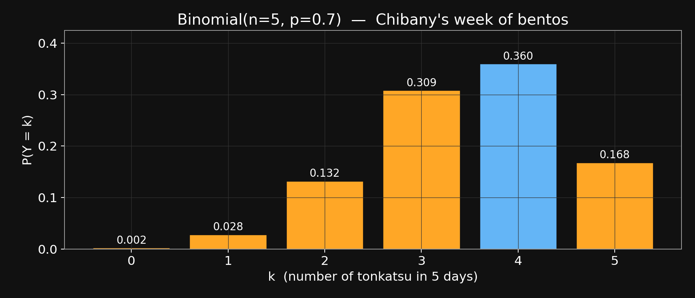{fig-align="center" width="75%"}
:::

::: {.lang-ja}
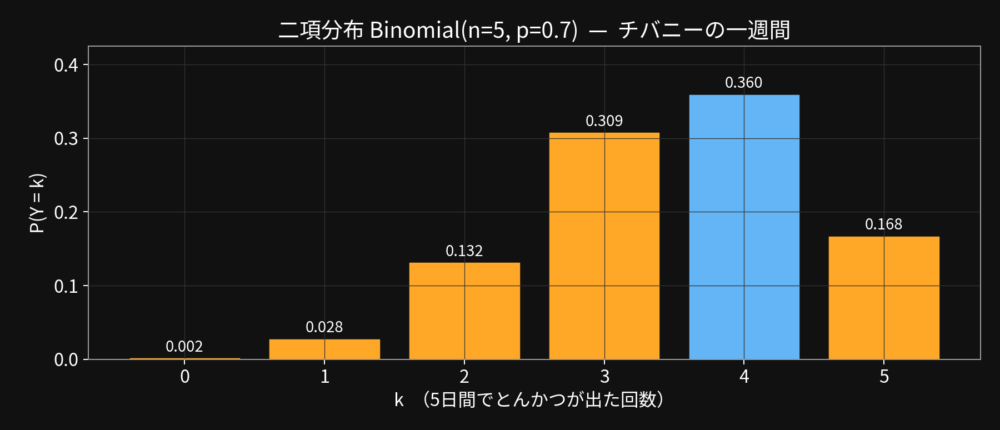{fig-align="center" width="75%"}
:::

::: {.lang-en}
Mode at k=4 (0.360). In Week 3 this PMF becomes the LIKELIHOOD

[*for inferring  p  from observed counts. Beta × Binomial = Beta.*]{.dim}
:::

::: {.lang-ja}
最頻値は k=4（0.360）。第3週では、この PMF が**尤度**になり、

[*観測したカウントから  p  を推定する際に使う。Beta × Binomial = Beta。*]{.dim}
:::


::: {.notes}
~1 min. Real bar chart. Let it sit — students can see the shape. Flag the Week-3 connection: when we don\'t KNOW p, this PMF with an unknown p becomes a function of p, and Beta conjugates nicely with it.
:::

## [Agenda]{.lang-en}[アジェンダ]{.lang-ja} {.agenda}

- [Welcome + meet Chibany]{.lang-en}[ようこそ + チバニー紹介]{.lang-ja} [0:00]{.time}
- [Marr's three levels]{.lang-en}[Marr の3つのレベル]{.lang-ja} [0:08]{.time}
- [Notation lock-in]{.lang-en}[記法の確認]{.lang-ja} [0:15]{.time}
- [Joint, marginal, conditional, independence]{.lang-en}[同時・周辺・条件付き・独立]{.lang-ja} [0:18]{.time}
- [Expected value + discrete]{.lang-en}[期待値 + 離散分布]{.lang-ja} [0:30]{.time}
- [[Continuous prob + Gaussian]{.lang-en}[連続確率 + ガウス分布]{.lang-ja}]{.highlight} [0:45]{.time}
- [Break]{.lang-en}[休憩]{.lang-ja} [1:05]{.time}
- [Gaussian-Gaussian update]{.lang-en}[ガウス-ガウス更新]{.lang-ja} [1:10]{.time}
- [Paper presentations]{.lang-en}[論文発表]{.lang-ja} [1:35]{.time}
- [Admin + Week 3]{.lang-en}[事務連絡 + 第3週]{.lang-ja} [1:45]{.time}

## [Continuous probability + the Gaussian]{.lang-en}[連続確率 + ガウス分布]{.lang-ja} {.section-break background-image="../../sds-reveal/sds_frame.png" background-size="cover"}


::: {.notes}
20 min. Build: opaque-bento reveal (1 slide), PMF→PDF (4 text + 1 image), Gaussian formula (5 text + 1 image), continuous-Bayes worked (6 text + 1 image). The images are the payoff — do NOT speak over them; pause.
:::

## [The catch today — bentos are opaque]{.lang-en}[今日の仕掛け — お弁当が不透明]{.lang-ja}

::: {.lang-en}
[**This week the bento boxes are OPAQUE.**]{.yellow}

Chibany can't peek — and it would be rude to open one while the student watches.

[**So Chibany's plan:   WEIGH THE BENTO.**]{.accent}

[*"The weight won't tell me for sure if it's tonkatsu,*]{.accent}

&nbsp;[*but it will UPDATE my belief about today's meal."*]{.accent}

[That update is Bayes' rule — now with a continuous observation.]{.dim}
:::

::: {.lang-ja}
[**今週のお弁当箱は**不透明**。**]{.yellow}

チバニーは中を覗けない — そして学生の前で開けるのも失礼。

[**そこでチバニーの作戦：   お弁当の重さを量る。**]{.accent}

[*「重さだけでとんかつだと確実にわかるわけではない。*]{.accent}

&nbsp;[*でも、今日の食事についての信念を**更新**できる。」*]{.accent}

[この更新こそがベイズの規則 — 今回は連続的な観測で。]{.dim}
:::


::: {.notes}
Opaque-bento reveal — deliberately placed here, not in the morning intro. Up to now the meal was observable (Block 4 joint tables used A, B directly). The inference problem only kicks in once we hide the meal and leave weight as the observable. This is the hidden-variable pivot — everything after this needs a likelihood p(weight | meal), which is the next four slides (PMF→PDF).
:::

## [Notation checkpoint — PMF & PDF]{.lang-en}[記法の確認 — PMF と PDF]{.lang-ja}

::: {.lang-en}
[*Two acronyms we\'ll use constantly from here on:*]{.dim}

[**PMF  —  Probability Mass Function.**]{.yellow}

&nbsp;&nbsp;&nbsp;For a discrete RV:   $p(x) = P(X = x)$.   Think: heights of bars.

&nbsp;&nbsp;&nbsp;$\sum_x p(x) = 1$.    Each $p(x) \in [0, 1]$ — a real probability.

[**PDF  —  Probability Density Function.**]{.yellow}

&nbsp;&nbsp;&nbsp;For a continuous RV:   $f(x)$ — probability PER UNIT of $x$.

&nbsp;&nbsp;&nbsp;$\int f(x)\,dx = 1$.    $f(x)$ can exceed 1 — it\'s a density, not a probability.

[*PMFs give bars; PDFs give a smooth curve. We\'ll see how to get from one to the other next.*]{.dim}
:::

::: {.lang-ja}
[*この後ずっと使う2つの略語：*]{.dim}

[**PMF  —  確率質量関数（Probability Mass Function）。**]{.yellow}

&nbsp;&nbsp;&nbsp;離散確率変数の場合：   $p(x) = P(X = x)$。   棒の高さだと思えばよい。

&nbsp;&nbsp;&nbsp;$\sum_x p(x) = 1$。    各 $p(x) \in [0, 1]$ — これは確率そのもの。

[**PDF  —  確率密度関数（Probability Density Function）。**]{.yellow}

&nbsp;&nbsp;&nbsp;連続確率変数の場合：   $f(x)$ — $x$ の**単位あたり**の確率。

&nbsp;&nbsp;&nbsp;$\int f(x)\,dx = 1$。    $f(x)$ は1を超えることもある — これは密度であって、確率ではない。

[*PMF は棒、PDF は滑らかな曲線。次のスライドで、片方からもう片方への移り方を見る。*]{.dim}
:::


::: {.notes}
Lock in both acronyms before we use them. PMF = bars (discrete, heights sum to 1); PDF = curve (continuous, area sums to 1, heights are density — units of probability per unit of x). Common student trap: "why can a PDF exceed 1?" — because density × width = probability, and if width is small, density can be large. e.g. N(0, 0.01) has density ~40 at zero. Integrating gives probability back.
:::

## [From PMF to PDF — going continuous]{.lang-en}[PMF から PDF へ — 連続への移行]{.lang-ja}

::: {.lang-en}
Chibany's bentos come in all weights — not a finite menu of values, a real number.

[**So the PMF (bars over discrete values) won\'t work — we need a PDF.**]{.accent}

[*How do we GET from bars to a smooth density? Bin the data and shrink the bins.*]{.dim}
:::

::: {.lang-ja}
チバニーのお弁当の重さはあらゆる値を取る — 有限のメニューではなく、実数。

[**だから離散値に対する PMF は使えない — PDF が必要。**]{.accent}

[*棒から滑らかな密度にどうやって移るか？  データを区間に分けて、その区間を縮めていく。*]{.dim}
:::


::: {.notes}
Slide 1: 'Weight is continuous. No finite outcome space. We need a new object — the PDF. Build: the next 3 slides shrink bins of a histogram until the outline becomes a smooth curve.'
:::

## [From PMF to PDF — going continuous (2/4)]{.lang-en}[PMF から PDF へ — 連続への移行 (2/4)]{.lang-ja}

::: {.lang-en}
[**Start coarse — 30g bins. A PMF over bins.**]{.accent}
:::

::: {.lang-ja}
[**まずは粗く — 30g の区間。区間に対する PMF。**]{.accent}
:::

::: {.lang-en}
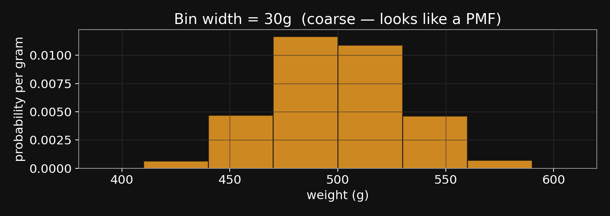{fig-align="center" width="70%"}
:::

::: {.lang-ja}
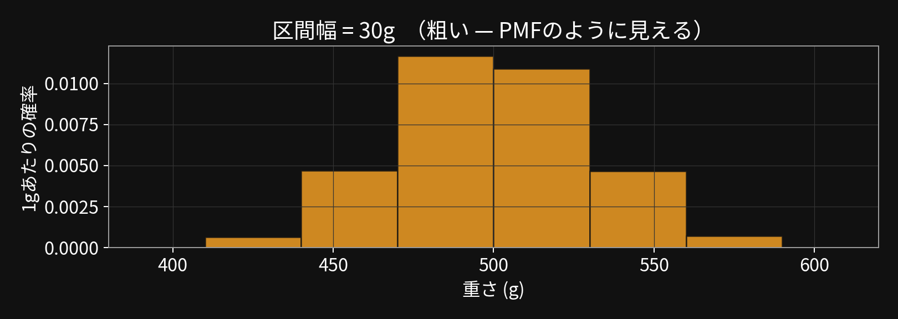{fig-align="center" width="70%"}
:::

::: {.lang-en}
[*Bar heights give probability per gram — each bar\'s AREA is the probability of landing in its bin.*]{.dim}
:::

::: {.lang-ja}
[*棒の高さは1グラムあたりの確率 — 各棒の**面積**が、その区間に入る確率。*]{.dim}
:::


::: {.notes}
Slide 2: 'Bin at 30g. Legit PMF over bins — finite number of bars, heights sum in an area-weighted way to 1. Pause: point out that what we\'re plotting is probability PER GRAM (the y-axis label). The area of each bar is the probability the weight falls in that bin.'
:::

## [From PMF to PDF — going continuous (3/4)]{.lang-en}[PMF から PDF へ — 連続への移行 (3/4)]{.lang-ja}

::: {.lang-en}
[**Shrink to 10g bins — still a PMF, but the outline is smoother.**]{.accent}
:::

::: {.lang-ja}
[**10g の区間まで縮める — まだ PMF だが、輪郭がより滑らかに。**]{.accent}
:::

::: {.lang-en}
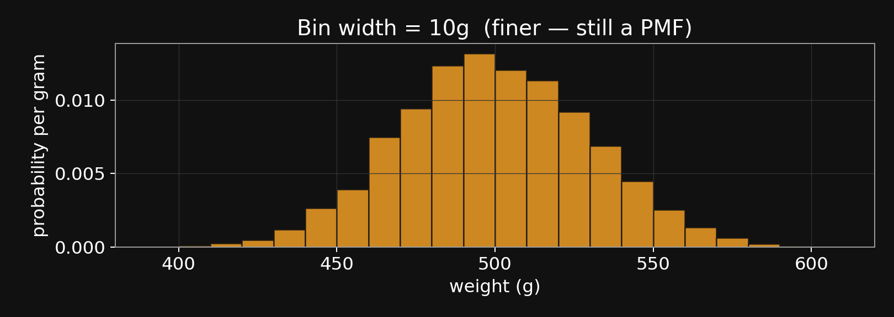{fig-align="center" width="70%"}
:::

::: {.lang-ja}
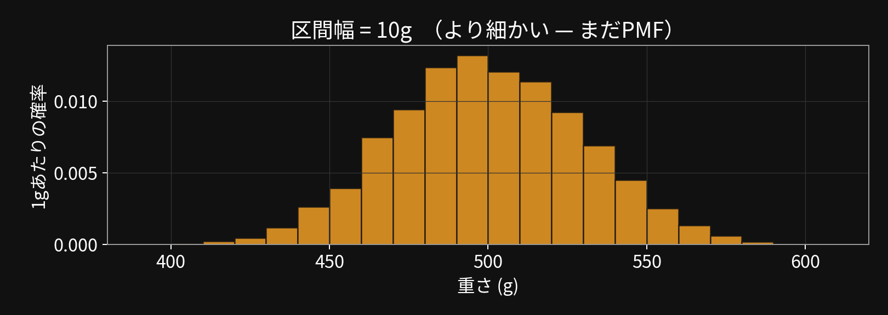{fig-align="center" width="70%"}
:::

::: {.lang-en}
[*Same data. Three times as many bins, each one-third the width.*]{.dim}
:::

::: {.lang-ja}
[*同じデータ。区間は3倍の数で、幅は3分の1。*]{.dim}
:::


::: {.notes}
Slide 3: 'Same 5000 samples, bin width down to 10g. The envelope of the bars is getting smoother. The y-axis stays in the same units (probability per gram) — only the bars are changing.'
:::

## [Quick poll — Derek's density]{.lang-en}[クイック投票 — デレクの密度]{.lang-ja}

::: {.lang-en}
[*Derek is implementing a model with a continuous variable.*]{.dim}

[*While debugging, he notices  $f(x)$  sometimes returns a value > 1.*]{.dim}

[**Should Derek be concerned?**]{.yellow}

&nbsp;&nbsp;&nbsp;A) Yes — probabilities cannot be greater than 1.

&nbsp;&nbsp;&nbsp;B) Maybe — it's OK as long as $f$ still integrates to 1.

&nbsp;&nbsp;&nbsp;C) No — density values are always OK to be > 1.

&nbsp;&nbsp;&nbsp;D) No — it's only a problem if $f$ is negative.

[*Commit before the reveal. 15 seconds.*]{.dim}
:::

::: {.lang-ja}
[*デレクは連続変数を使うモデルを実装している。*]{.dim}

[*デバッグ中に $f(x)$ が時々 1 より大きな値を返すことに気づいた。*]{.dim}

[**デレクは心配すべき？**]{.yellow}

&nbsp;&nbsp;&nbsp;A) はい — 確率は1を超えてはいけない。

&nbsp;&nbsp;&nbsp;B) 条件付きで大丈夫 — $f$ の積分が1であれば OK。

&nbsp;&nbsp;&nbsp;C) いいえ — 密度の値は1を超えてもいつでも大丈夫。

&nbsp;&nbsp;&nbsp;D) いいえ — $f$ が負になるときだけ問題。

[*正解発表の前に答えを決めて。15秒。*]{.dim}
:::


::: {.notes}
Answer: B. This is the single biggest density-vs-probability confusion — the poll forces them to commit before we collapse it to the punchline on the next slide.
:::

## [From PMF to PDF — going continuous (4/4)]{.lang-en}[PMF から PDF へ — 連続への移行 (4/4)]{.lang-ja}

::: {.lang-en}
[**Shrink to 2g bins — in the limit, bars become a smooth PDF.**]{.accent}
:::

::: {.lang-ja}
[**2g の区間まで縮める — 極限で、棒は滑らかな PDF になる。**]{.accent}
:::

::: {.lang-en}
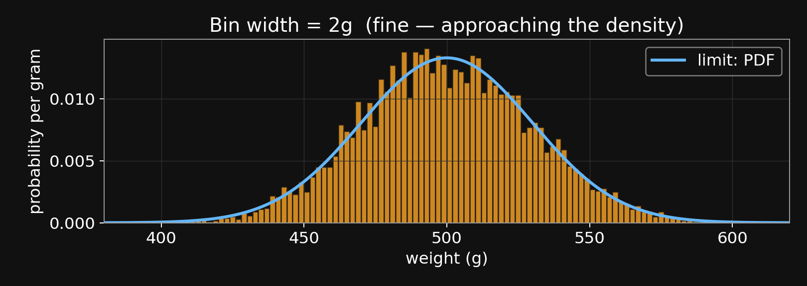{fig-align="center" width="70%"}
:::

::: {.lang-ja}
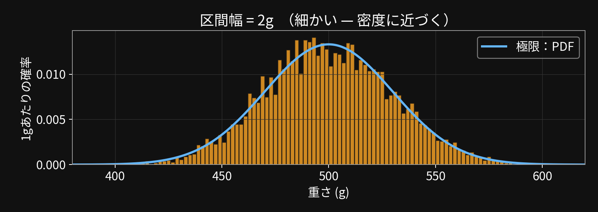{fig-align="center" width="70%"}
:::

$$P(X \in [a, b]) \;=\; \int_a^b f(x)\, dx \qquad \text{``area under the density''}$$

::: {.lang-en}
[**Derek's question:  B — density can exceed 1, as long as it integrates to 1.**]{.green}

[*bin width → 0: PMF becomes PDF. The blue curve is the PDF; the bars approach it.*]{.dim}
:::

::: {.lang-ja}
[**デレクの問題の答え：  B — 密度は1を超えてよい、積分が1である限り。**]{.green}

[*区間の幅 → 0：  PMF が PDF になる。青い曲線が PDF で、棒はそれに近づいていく。*]{.dim}
:::


::: {.notes}
Slide 4 + Derek-poll reveal: 'Bin width 2g. In the limit, the bars ARE the PDF. Poll answer B: a density is probability PER UNIT — if the unit (bin width) shrinks, heights rise to compensate, and can easily exceed 1. The N(500, 30²) plotted here peaks around 0.013 per gram, but N(0, 0.01) peaks around 40. Area (integral) is what must sum to 1, not height.
\
Why P(X = exactly 450) = 0 for continuous X: integrate a density over a single point, you get 0. But P(X in [449.5, 450.5]) ≈ f(450) × 1 — density times interval width.'
:::

## [The Gaussian (normal) distribution]{.lang-en}[ガウス分布（正規分布）]{.lang-ja}

::: {.lang-en}
Chibany's bento weights vary — even within one meal type.

[Tonkatsu weight is roughly  N(500, 30²)  —  centered at 500, spread ≈ 30g.]{.accent}
:::

::: {.lang-ja}
チバニーのお弁当の重さはばらつく — 同じメニュー同士でも。

[とんかつの重さはおおよそ  N(500, 30²)  —  中心 500、広がり ≈ 30g。]{.accent}
:::


::: {.notes}
Slide 1: 'Real bentos vary. Not every tonkatsu is exactly 500g. The natural distribution for that variation is the Gaussian.'
:::

## [The Gaussian (normal) distribution (2/5)]{.lang-en}[ガウス分布（正規分布） (2/5)]{.lang-ja}

::: {.lang-en}
Chibany's bento weights vary — even within one meal type.

[Tonkatsu weight is roughly  N(500, 30²)  —  centered at 500, spread ≈ 30g.]{.accent}
:::

::: {.lang-ja}
チバニーのお弁当の重さはばらつく — 同じメニュー同士でも。

[とんかつの重さはおおよそ  N(500, 30²)  —  中心 500、広がり ≈ 30g。]{.accent}
:::


$$N(x \mid \mu, \sigma^2) \;=\; \frac{1}{\sqrt{2\pi\sigma^2}} \; \exp\!\left(-\frac{(x-\mu)^2}{2\sigma^2}\right)$$


::: {.notes}
Slide 2: 'The formula. Don\'t try to hold the whole thing at once — we\'ll name each piece now.'
:::

## [The Gaussian (normal) distribution (3/5)]{.lang-en}[ガウス分布（正規分布） (3/5)]{.lang-ja}

::: {.lang-en}
Chibany's bento weights vary — even within one meal type.

[Tonkatsu weight is roughly  N(500, 30²)  —  centered at 500, spread ≈ 30g.]{.accent}
:::

::: {.lang-ja}
チバニーのお弁当の重さはばらつく — 同じメニュー同士でも。

[とんかつの重さはおおよそ  N(500, 30²)  —  中心 500、広がり ≈ 30g。]{.accent}
:::


$$N(x \mid \mu, \sigma^2) \;=\; \frac{1}{\sqrt{2\pi\sigma^2}} \; \exp\!\left(-\frac{(x-\mu)^2}{2\sigma^2}\right)$$


::: {.lang-en}
Name each piece:

&nbsp;&nbsp;&nbsp;[μ       mean — where the curve peaks]{.dim}

&nbsp;&nbsp;&nbsp;[σ²      variance — how wide the curve is  (σ = std dev)]{.dim}

&nbsp;&nbsp;&nbsp;[exp(−(x−μ)²/(2σ²))    peaks at μ, falls off fast outside ±σ]{.dim}

&nbsp;&nbsp;&nbsp;[1/√(2π σ²)                the normalizer — makes total area = 1]{.dim}
:::

::: {.lang-ja}
各部品の名前：

&nbsp;&nbsp;&nbsp;[μ       平均 — 曲線のピークの位置]{.dim}

&nbsp;&nbsp;&nbsp;[σ²      分散 — 曲線の広がり  （σ = 標準偏差）]{.dim}

&nbsp;&nbsp;&nbsp;[exp(−(x−μ)²/(2σ²))    μ でピークを取り、±σ の外ではすぐ減衰する]{.dim}

&nbsp;&nbsp;&nbsp;[1/√(2π σ²)                正規化定数 — 全体の面積を1にする]{.dim}
:::


::: {.notes}
Slide 3: 'Four pieces. Mean, variance, the exponential (which does the peaking), and the normalizer (which makes the area equal 1 — 'required of any PDF).'
:::

## [The Gaussian (normal) distribution (4/5)]{.lang-en}[ガウス分布（正規分布） (4/5)]{.lang-ja}

::: {.lang-en}
Chibany's bento weights vary — even within one meal type.

[Tonkatsu weight is roughly  N(500, 30²)  —  centered at 500, spread ≈ 30g.]{.accent}
:::

::: {.lang-ja}
チバニーのお弁当の重さはばらつく — 同じメニュー同士でも。

[とんかつの重さはおおよそ  N(500, 30²)  —  中心 500、広がり ≈ 30g。]{.accent}
:::


$$N(x \mid \mu, \sigma^2) \;=\; \frac{1}{\sqrt{2\pi\sigma^2}} \; \exp\!\left(-\frac{(x-\mu)^2}{2\sigma^2}\right)$$


::: {.lang-en}
Name each piece:

&nbsp;&nbsp;&nbsp;[μ       mean — where the curve peaks]{.dim}

&nbsp;&nbsp;&nbsp;[σ²      variance — how wide the curve is  (σ = std dev)]{.dim}

&nbsp;&nbsp;&nbsp;[exp(−(x−μ)²/(2σ²))    peaks at μ, falls off fast outside ±σ]{.dim}

&nbsp;&nbsp;&nbsp;[1/√(2π σ²)                the normalizer — makes total area = 1]{.dim}

**Shape facts:**

&nbsp;&nbsp;&nbsp;• symmetric around μ

&nbsp;&nbsp;&nbsp;• peak height = 1/√(2π σ²) — sharper curves are TALLER

&nbsp;&nbsp;&nbsp;• ~68% of mass within  μ ± σ;    ~95% within  μ ± 2σ
:::

::: {.lang-ja}
各部品の名前：

&nbsp;&nbsp;&nbsp;[μ       平均 — 曲線のピークの位置]{.dim}

&nbsp;&nbsp;&nbsp;[σ²      分散 — 曲線の広がり  （σ = 標準偏差）]{.dim}

&nbsp;&nbsp;&nbsp;[exp(−(x−μ)²/(2σ²))    μ でピークを取り、±σ の外ではすぐ減衰]{.dim}

&nbsp;&nbsp;&nbsp;[1/√(2π σ²)                正規化定数 — 全体の面積を1にする]{.dim}

**形状の事実：**

&nbsp;&nbsp;&nbsp;• μ を中心に左右対称

&nbsp;&nbsp;&nbsp;• ピークの高さ = 1/√(2π σ²) — より鋭い曲線は**より背が高い**

&nbsp;&nbsp;&nbsp;• 質量の ~68% は  μ ± σ の中；  ~95% は  μ ± 2σ の中
:::


::: {.notes}
Slide 4: 'Shape. Symmetric around μ. SHARPER (smaller σ) → TALLER peak. The 68-95-99.7 rule — most mass within 1, 2, 3 sigma.'
:::

## [The Gaussian (normal) distribution (5/5)]{.lang-en}[ガウス分布（正規分布） (5/5)]{.lang-ja}

::: {.lang-en}
Chibany's bento weights vary — even within one meal type.

[Tonkatsu weight is roughly  N(500, 30²)  —  centered at 500, spread ≈ 30g.]{.accent}
:::

::: {.lang-ja}
チバニーのお弁当の重さはばらつく — 同じメニュー同士でも。

[とんかつの重さはおおよそ  N(500, 30²)  —  中心 500、広がり ≈ 30g。]{.accent}
:::


$$N(x \mid \mu, \sigma^2) \;=\; \frac{1}{\sqrt{2\pi\sigma^2}} \; \exp\!\left(-\frac{(x-\mu)^2}{2\sigma^2}\right)$$


::: {.lang-en}
Name each piece:

&nbsp;&nbsp;&nbsp;[μ       mean — where the curve peaks]{.dim}

&nbsp;&nbsp;&nbsp;[σ²      variance — how wide the curve is  (σ = std dev)]{.dim}

&nbsp;&nbsp;&nbsp;[exp(−(x−μ)²/(2σ²))    peaks at μ, falls off fast outside ±σ]{.dim}

&nbsp;&nbsp;&nbsp;[1/√(2π σ²)                the normalizer — makes total area = 1]{.dim}

**Shape facts:**

&nbsp;&nbsp;&nbsp;• symmetric around μ

&nbsp;&nbsp;&nbsp;• peak height = 1/√(2π σ²) — sharper curves are TALLER

&nbsp;&nbsp;&nbsp;• ~68% of mass within  μ ± σ;    ~95% within  μ ± 2σ

**Chibany's two bento-weight distributions:**

&nbsp;&nbsp;&nbsp;[tonkatsu weight     ~   N(500, 30²)]{.accent}

&nbsp;&nbsp;&nbsp;[hamburger weight  ~   N(350, 30²)]{.accent}

[*Two bell curves. They overlap in the middle — that's where 450g lives.*]{.dim}
:::

::: {.lang-ja}
各部品の名前：

&nbsp;&nbsp;&nbsp;[μ       平均 — 曲線のピークの位置]{.dim}

&nbsp;&nbsp;&nbsp;[σ²      分散 — 曲線の広がり  （σ = 標準偏差）]{.dim}

&nbsp;&nbsp;&nbsp;[exp(−(x−μ)²/(2σ²))    μ でピークを取り、±σ の外ではすぐ減衰]{.dim}

&nbsp;&nbsp;&nbsp;[1/√(2π σ²)                正規化定数 — 全体の面積を1にする]{.dim}

**形状の事実：**

&nbsp;&nbsp;&nbsp;• μ を中心に左右対称

&nbsp;&nbsp;&nbsp;• ピークの高さ = 1/√(2π σ²) — より鋭い曲線は**より背が高い**

&nbsp;&nbsp;&nbsp;• 質量の ~68% は  μ ± σ の中；  ~95% は  μ ± 2σ の中

**チバニーの2つのお弁当重量の分布：**

&nbsp;&nbsp;&nbsp;[とんかつの重さ     ~   N(500, 30²)]{.accent}

&nbsp;&nbsp;&nbsp;[ハンバーグの重さ  ~   N(350, 30²)]{.accent}

[*ベルカーブが2つ。真ん中あたりで重なる — そこが 450g のあたり。*]{.dim}
:::


::: {.notes}
Slide 5: 'Two Gaussians for Chibany. They overlap in the 380-470 range. Next slide: picture.'
:::

## [The Gaussian — shape and the 68-95 rule]{.lang-en}[ガウス分布 — 形状と 68-95 ルール]{.lang-ja}

::: {.lang-en}
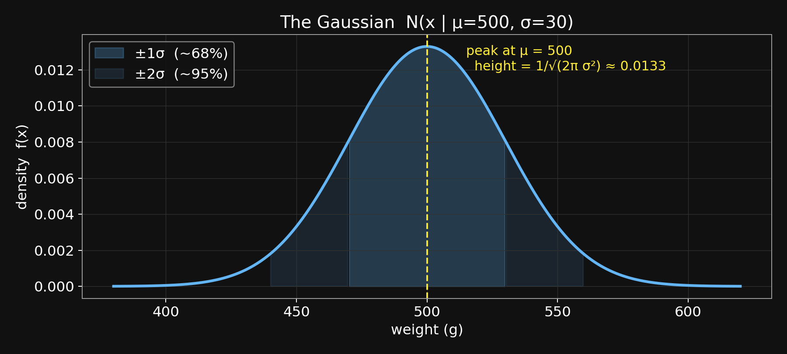{fig-align="center" width="75%"}
:::

::: {.lang-ja}
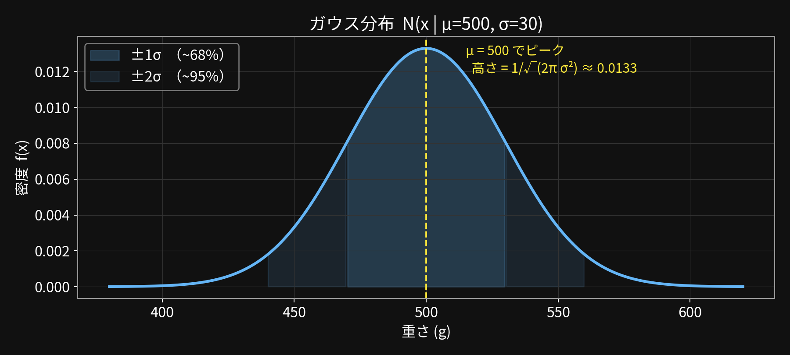{fig-align="center" width="75%"}
:::

::: {.lang-en}
[Dark fill: ±1σ (~68%). Light fill: ±2σ (~95%).]{.dim}
:::

::: {.lang-ja}
[濃い色：±1σ（~68%）。薄い色：±2σ（~95%）。]{.dim}
:::


::: {.notes}
Pause. Let them trace the curve and see the shaded bands. The peak height formula 1/√(2πσ²) ≈ 0.013 for σ=30 — visible at the top.
:::

## [Chibany's two bento-weight likelihoods]{.lang-en}[チバニーの2つのお弁当重量の尤度]{.lang-ja}

::: {.lang-en}
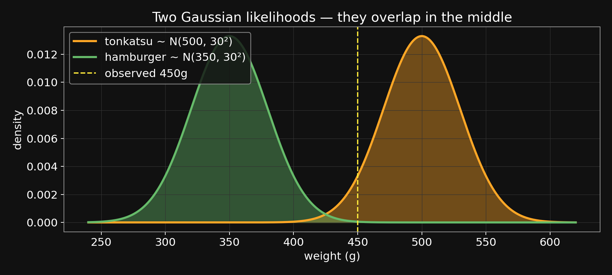{fig-align="center" width="75%"}
:::

::: {.lang-ja}
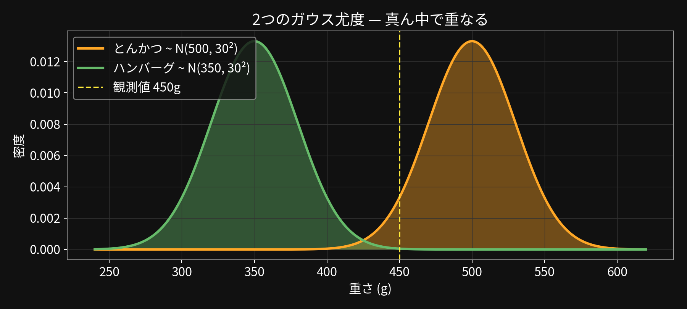{fig-align="center" width="75%"}
:::

::: {.lang-en}
[Yellow line: observed 450g. Closer to tonkatsu, but within hamburger tail.]{.dim}
:::

::: {.lang-ja}
[黄色い線：観測値 450g。とんかつに近いが、ハンバーグの裾の範囲にも入っている。]{.dim}
:::


::: {.notes}
Key setup image for the continuous-Bayes worked example that follows. 450g sits squarely in the tonkatsu Gaussian, far in the right tail of hamburger. The next slide computes the densities.
:::

## [The Bayes flow — now with a density]{.lang-en}[ベイズの流れ — 密度を使って]{.lang-ja}

$$P(H \mid D) \;=\; \frac{P(H)\,P(D \mid H)}{P(D)}$$

::: {.lang-en}
```{mermaid}
%%| fig-align: center
flowchart LR
  Prior["<b>prior</b><br/>P(meal)<br/>discrete"]
  Lik["<b>likelihood</b><br/>f(weight | meal)<br/><i>Gaussian density</i>"]
  Num["<b>numerator</b><br/>P(meal) · f(weight | meal)"]
  Post["<b>posterior</b><br/>P(meal | weight)"]
  Prior --> Num
  Lik --> Num
  Num -->|"<b>normalize</b><br/>÷ P(D)<br/><i>evidence</i>"| Post
  classDef in fill:#1A1A2E,stroke:#64B5F6,stroke-width:2px,color:#fff
  classDef mid fill:#1A1A2E,stroke:#FFA726,stroke-width:2px,color:#fff
  classDef highlight fill:#1A1A2E,stroke:#FFEB3B,stroke-width:3px,color:#fff
  classDef out fill:#1A1A2E,stroke:#66BB6A,stroke-width:3px,color:#fff
  class Prior in
  class Lik highlight
  class Num mid
  class Post out
```
:::

::: {.lang-ja}
```{mermaid}
%%| fig-align: center
flowchart LR
  Prior["<b>事前分布</b><br/>P(食事)<br/>離散"]
  Lik["<b>尤度</b><br/>f(重さ | 食事)<br/><i>ガウス密度</i>"]
  Num["<b>分子</b><br/>P(食事) · f(重さ | 食事)"]
  Post["<b>事後分布</b><br/>P(食事 | 重さ)"]
  Prior --> Num
  Lik --> Num
  Num -->|"<b>正規化</b><br/>÷ P(D)<br/><i>証拠</i>"| Post
  classDef in fill:#1A1A2E,stroke:#64B5F6,stroke-width:2px,color:#fff
  classDef mid fill:#1A1A2E,stroke:#FFA726,stroke-width:2px,color:#fff
  classDef highlight fill:#1A1A2E,stroke:#FFEB3B,stroke-width:3px,color:#fff
  classDef out fill:#1A1A2E,stroke:#66BB6A,stroke-width:3px,color:#fff
  class Prior in
  class Lik highlight
  class Num mid
  class Post out
```
:::

::: {.lang-en}
[*Same flow.  Only the likelihood box changed:*]{.dim}    [*a discrete probability became a Gaussian density evaluated at $D$.*]{.yellow}
:::

::: {.lang-ja}
[*同じ流れ。尤度のボックスだけが変わった：*]{.dim}    [*離散確率が、$D$ で評価したガウス密度になった。*]{.yellow}
:::


::: {.notes}
~45 sec. Pause and point: it\'s the same diagram. The prior box is still a discrete distribution over meal (tonkatsu / hamburger). The posterior box is still a discrete distribution over meal. ONLY the likelihood changed — we evaluate a Gaussian density at the observed weight. Bayes\' rule doesn\'t care whether the likelihood is a probability or a density — the multiply-and-normalize move works identically.
:::

## [Bayes with a continuous likelihood — worked]{.lang-en}[連続尤度でのベイズ — 計算例]{.lang-ja}

::: {.lang-en}
[**Today's observation:    $D = \text{weight} = 450$ g.**]{.yellow}

**What's $P(\text{meal} \mid \text{weight} = 450)$?**
:::

::: {.lang-ja}
[**今日の観測：    $D = \text{重さ} = 450$ g。**]{.yellow}

**$P(\text{食事} \mid \text{重さ} = 450)$  はいくら？**
:::


::: {.lang-en}
|                                     |  **tonkatsu**  |  **hamburger**  |
|-------------------------------------|:--------------:|:---------------:|
| Prior  $P(H)$                       |     $0.7$      |      $0.3$      |
| Likelihood  $f(D \mid H)$           |       ?        |        ?        |
| Numerator                           |       ?        |        ?        |
| Posterior  $P(H \mid D)$            |       ?        |        ?        |
:::

::: {.lang-ja}
|                                     |  **とんかつ**  |  **ハンバーグ**  |
|-------------------------------------|:--------------:|:----------------:|
| 事前分布  $P(H)$                    |     $0.7$      |      $0.3$       |
| 尤度  $f(D \mid H)$                 |       ?        |        ?         |
| 分子                                |       ?        |        ?         |
| 事後分布  $P(H \mid D)$             |       ?        |        ?         |
:::


::: {.lang-en}
[*Same 4-row Bayes table as the sick-friend problem — but the likelihood row is now a density value.*]{.dim}
:::

::: {.lang-ja}
[*風邪の友人の問題と同じ4行のベイズ表 — ただし尤度の行は密度の値。*]{.dim}
:::


::: {.notes}
Slide 1: 'Structural mirror of the sick-friend problem from Block 4. Four rows, one column per hypothesis. The ONLY difference: the likelihood row used to be a probability (e.g., 0.90 for cold + cough). Now it\'s a Gaussian density value. Everything else is the same.'
:::

## [Bayes with a continuous likelihood — worked (2/4)]{.lang-en}[連続尤度でのベイズ — 計算例 (2/4)]{.lang-ja}

::: {.lang-en}
[**Today's observation:    $D = \text{weight} = 450$ g.**]{.yellow}

**What's $P(\text{meal} \mid \text{weight} = 450)$?**
:::

::: {.lang-ja}
[**今日の観測：    $D = \text{重さ} = 450$ g。**]{.yellow}

**$P(\text{食事} \mid \text{重さ} = 450)$  はいくら？**
:::


::: {.lang-en}
|                                     |  **tonkatsu**  |  **hamburger**  |
|-------------------------------------|:--------------:|:---------------:|
| Prior  $P(H)$                       |     $0.7$      |      $0.3$      |
| Likelihood  $f(D \mid H)$           |  **$0.00332$** |  **$0.00044$**  |
| Numerator                           |       ?        |        ?        |
| Posterior  $P(H \mid D)$            |       ?        |        ?        |
:::

::: {.lang-ja}
|                                     |  **とんかつ**  |  **ハンバーグ**  |
|-------------------------------------|:--------------:|:----------------:|
| 事前分布  $P(H)$                    |     $0.7$      |      $0.3$       |
| 尤度  $f(D \mid H)$                 |  **$0.00332$** |  **$0.00044$**   |
| 分子                                |       ?        |        ?         |
| 事後分布  $P(H \mid D)$             |       ?        |        ?         |
:::


::: {.lang-en}
[$f_T = N(450 \mid 500, 30^2) \;\approx\; 0.00332$     [(close to the tonkatsu mean of 500)]{.dim}]{.accent}

[$f_H = N(450 \mid 350, 30^2) \;\approx\; 0.00044$     [(100 g above the hamburger mean of 350)]{.dim}]{.accent}

[*Density values, not probabilities.   $f_T / f_H \approx 7.5$ — the observation is ~7.5× more consistent with tonkatsu.*]{.dim}
:::

::: {.lang-ja}
[$f_T = N(450 \mid 500, 30^2) \;\approx\; 0.00332$     [（とんかつの平均 500 に近い）]{.dim}]{.accent}

[$f_H = N(450 \mid 350, 30^2) \;\approx\; 0.00044$     [（ハンバーグの平均 350 より 100g 上）]{.dim}]{.accent}

[*これは密度の値で、確率ではない。   $f_T / f_H \approx 7.5$ — 観測値はとんかつと ~7.5倍整合的。*]{.dim}
:::


::: {.notes}
Slide 2: 'Fill the likelihood row with Gaussian density values. Show the RATIO explicitly: f_T/f_H ≈ 7.5, meaning 450g is ~7.5× more consistent with the tonkatsu model than the hamburger model — even though 450 is closer to the hamburger mean (350) than to the tonkatsu mean (500)! That counter-intuition (closer mean ≠ higher likelihood when widths differ, and both widths are the same here so it IS distance-based) is worth calling out. Here both σ are 30, so the tighter-to-tonkatsu explanation wins.'
:::

## [Bayes with a continuous likelihood — worked (3/4)]{.lang-en}[連続尤度でのベイズ — 計算例 (3/4)]{.lang-ja}

::: {.lang-en}
[**Today's observation:    $D = \text{weight} = 450$ g.**]{.yellow}

**What's $P(\text{meal} \mid \text{weight} = 450)$?**
:::

::: {.lang-ja}
[**今日の観測：    $D = \text{重さ} = 450$ g。**]{.yellow}

**$P(\text{食事} \mid \text{重さ} = 450)$  はいくら？**
:::


::: {.lang-en}
|                                     |   **tonkatsu**   |  **hamburger**   |
|-------------------------------------|:----------------:|:----------------:|
| Prior  $P(H)$                       |      $0.7$       |      $0.3$       |
| Likelihood  $f(D \mid H)$           |    $0.00332$     |    $0.00044$     |
| **Numerator  $P(H) \cdot f(D \mid H)$** | **$0.00232$** | **$0.000132$** |
| Posterior  $P(H \mid D)$            |        ?         |        ?         |
:::

::: {.lang-ja}
|                                     |   **とんかつ**   |  **ハンバーグ**  |
|-------------------------------------|:----------------:|:----------------:|
| 事前分布  $P(H)$                    |      $0.7$       |      $0.3$       |
| 尤度  $f(D \mid H)$                 |    $0.00332$     |    $0.00044$     |
| **分子  $P(H) \cdot f(D \mid H)$**  | **$0.00232$**    | **$0.000132$**   |
| 事後分布  $P(H \mid D)$             |        ?         |        ?         |
:::


::: {.lang-en}
[**Evidence  $=$  sum of numerators  $=$  $0.00232 + 0.000132$  $=$  $0.00246$**]{.accent}
:::

::: {.lang-ja}
[**証拠  $=$  分子の合計  $=$  $0.00232 + 0.000132$  $=$  $0.00246$**]{.accent}
:::


::: {.notes}
Slide 3: 'Multiply the prior and likelihood columns. Sum for the evidence. Same move as the sick-friend problem.'
:::

## [Bayes with a continuous likelihood — worked (4/4)]{.lang-en}[連続尤度でのベイズ — 計算例 (4/4)]{.lang-ja} {.smaller}

::: {.lang-en}
[**Today's observation:    $D = \text{weight} = 450$ g.**]{.yellow}

**What's $P(\text{meal} \mid \text{weight} = 450)$?**
:::

::: {.lang-ja}
[**今日の観測：    $D = \text{重さ} = 450$ g。**]{.yellow}

**$P(\text{食事} \mid \text{重さ} = 450)$  はいくら？**
:::


::: {.lang-en}
|                                     |   **tonkatsu**   |  **hamburger**   |
|-------------------------------------|:----------------:|:----------------:|
| Prior  $P(H)$                       |      $0.7$       |      $0.3$       |
| Likelihood  $f(D \mid H)$           |    $0.00332$     |    $0.00044$     |
| Numerator  $P(H) \cdot f(D \mid H)$ |    $0.00232$     |    $0.000132$    |
| [**Posterior  $P(H \mid D)$**]{.green} | [**$\approx 0.946$**]{.green} | [**$\approx 0.054$**]{.green} |
:::

::: {.lang-ja}
|                                     |   **とんかつ**   |  **ハンバーグ**  |
|-------------------------------------|:----------------:|:----------------:|
| 事前分布  $P(H)$                    |      $0.7$       |      $0.3$       |
| 尤度  $f(D \mid H)$                 |    $0.00332$     |    $0.00044$     |
| 分子  $P(H) \cdot f(D \mid H)$      |    $0.00232$     |    $0.000132$    |
| [**事後分布  $P(H \mid D)$**]{.green} | [**$\approx 0.946$**]{.green} | [**$\approx 0.054$**]{.green} |
:::


::: {.lang-en}
[**Prior $\to$ Posterior:**      $0.70 \to 0.946$  (tonkatsu),    $0.30 \to 0.054$  (hamburger).]{.yellow}

[*The prior already favored tonkatsu.  The observation moved belief even further that way — not because 450g is closer to 500 (it isn't), but because it's more consistent with the tonkatsu distribution than the hamburger distribution.*]{.dim}
:::

::: {.lang-ja}
[**事前確率 $\to$ 事後確率：**      $0.70 \to 0.946$  （とんかつ）、    $0.30 \to 0.054$  （ハンバーグ）。]{.yellow}

[*事前確率は既にとんかつに傾いていた。  観測によってさらにその方向に動いた — 450g が 500 に近いから（近くない）ではなく、とんかつの分布との方がハンバーグの分布より整合的だから。*]{.dim}
:::


::: {.notes}
Slide 4: 'Divide each numerator by the evidence. Posterior 0.95/0.05. Punchline: notice we did the SAME four-row table as the sick-friend problem in Block 4. The only difference: the likelihood row\'s values come from a Gaussian density evaluated at D instead of a discrete probability P(D|H). Bayes\' rule itself doesn\'t care whether the likelihood is a probability or a density — the same multiply-and-normalize moves work.'
:::

## [Break — 5 minutes]{.lang-en}[休憩 — 5分]{.lang-ja} {.section-break background-image="../../sds-reveal/sds_frame.png" background-size="cover"}

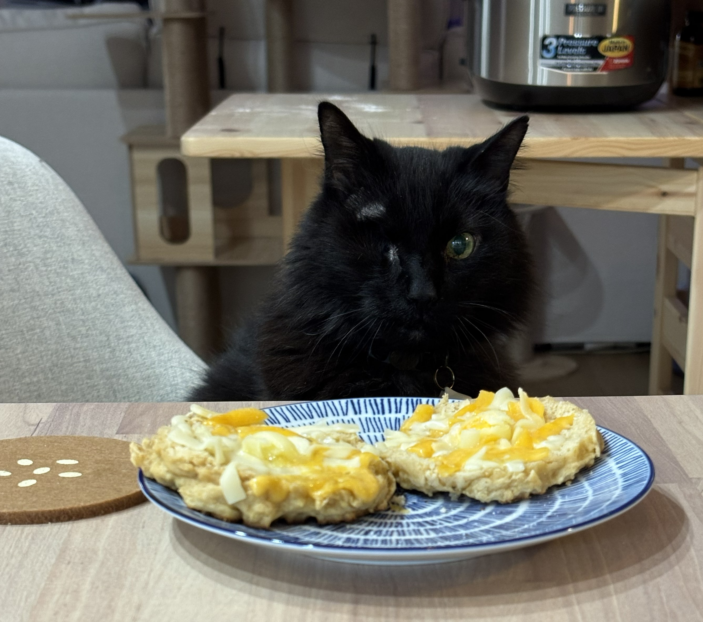{fig-align="center" width="30%" style="max-height: 50vh; margin-top: 2.2em;"}


::: {.notes}
Hard 5 minutes. Come back sharp — the Gaussian-Gaussian update is the highest-stakes block of the session. Double-check the tonk_hamb.png loaded correctly on the projector.
:::

## [Agenda]{.lang-en}[アジェンダ]{.lang-ja} {.agenda}

- [Welcome + meet Chibany]{.lang-en}[ようこそ + チバニー紹介]{.lang-ja} [0:00]{.time}
- [Marr's three levels]{.lang-en}[Marr の3つのレベル]{.lang-ja} [0:08]{.time}
- [Notation lock-in]{.lang-en}[記法の確認]{.lang-ja} [0:15]{.time}
- [Joint, marginal, conditional, independence]{.lang-en}[同時・周辺・条件付き・独立]{.lang-ja} [0:18]{.time}
- [Expected value + discrete]{.lang-en}[期待値 + 離散分布]{.lang-ja} [0:30]{.time}
- [Continuous prob + Gaussian]{.lang-en}[連続確率 + ガウス分布]{.lang-ja} [0:45]{.time}
- [Break]{.lang-en}[休憩]{.lang-ja} [1:05]{.time}
- [[Gaussian-Gaussian update]{.lang-en}[ガウス-ガウス更新]{.lang-ja}]{.highlight} [1:15]{.time}
- [Paper presentations]{.lang-en}[論文発表]{.lang-ja} [1:35]{.time}
- [Admin + Week 3]{.lang-en}[事務連絡 + 第3週]{.lang-ja} [1:45]{.time}

## [Gaussian-Gaussian update — launching Week 3]{.lang-en}[ガウス-ガウス更新 — 第3週への橋渡し]{.lang-ja} {.section-break background-image="../../sds-reveal/sds_frame.png" background-size="cover"}


::: {.notes}
25 min. THE block of the session. Now with: (a) a shift-in-what's-hidden pivot, (b) explicit motivation for inferring μ, (c) a derivation SKETCH (complete the square), (d) a real posterior-curve picture, (e) precision visualized, (f) N-observation generalization given its own build-up.
:::

## [Shift in what's hidden]{.lang-en}[隠れた変数の転換]{.lang-ja}

::: {.lang-en}

| &nbsp; | **Before** | **Now** |
|:---|:---:|:---:|
| Hidden  $H$       | which meal today?  (tonkatsu / hamburger) | what's the tonkatsu mean weight  $\mu$? |
| Type              | discrete category                    | continuous parameter |
| Data  $D$         | 450 g                                | 510 g  (and more to come) |
| Prior  $P(H)$     | 0.7 / 0.3                            | $N(\mu_0, \sigma_0^2)$ |
| Goal              | classify this one meal               | learn Chibany's model of the world |


[*Bayes' rule doesn't change.  The OBJECTS plugged into it do.*]{.yellow}

[*This is the pivot to "learning parameters from data" — the foundation of everything in Weeks 3, 4, and 7.*]{.dim}

:::

::: {.lang-ja}

| &nbsp; | **これまで** | **これから** |
|:---|:---:|:---:|
| 隠れた変数  $H$   | 今日の食事は？（とんかつ / ハンバーグ） | とんかつの平均重量 $\mu$ は？ |
| 型              | 離散的なカテゴリ                     | 連続的なパラメータ |
| データ  $D$      | 450 g                                | 510 g （これからもっと観測する） |
| 事前分布  $P(H)$ | 0.7 / 0.3                            | $N(\mu_0, \sigma_0^2)$ |
| 目標            | 今日の食事を分類する                  | チバニーの世界モデルを学習する |


[*ベイズの式自体は変わらない。  プラグインする対象が変わっただけ。*]{.yellow}

[*これが「データからパラメータを学習する」への転換点 — 第3週、第4週、第7週の土台。*]{.dim}

:::


::: {.notes}
~1 min. CRITICAL slide. Students have spent the whole morning inferring "which meal". Now we shift to inferring "the mean weight OF the tonkatsu model". This is the central conceptual leap from classification to parameter estimation — the foundation of everything coming in Weeks 3 (conjugate Bayes), 4 (hierarchical), 7 (MC approx). Pause here. Let them see the table before introducing μ.
:::

## [Why would Chibany want to infer μ ?]{.lang-en}[なぜチバニーは μ を推論したい？]{.lang-ja}

::: {.lang-en}
So far Chibany asks:  "what's in TODAY's bento?"

&nbsp;&nbsp;&nbsp;[Today's weight, 450g  →  posterior over today's meal.]{.dim}
:::

::: {.lang-ja}
これまでチバニーが問うてきたのは：  「今日のお弁当は何？」

&nbsp;&nbsp;&nbsp;[今日の重さ 450g  →  今日の食事についての事後確率。]{.dim}
:::


::: {.notes}
Slide 1: 'Up to now, the question has been about today\'s meal. A discrete hypothesis.'
:::

## [Why would Chibany want to infer μ ? (2/3)]{.lang-en}[なぜチバニーは μ を推論したい？ (2/3)]{.lang-ja}

::: {.lang-en}
So far Chibany asks:  "what's in TODAY's bento?"

&nbsp;&nbsp;&nbsp;[Today's weight, 450g  →  posterior over today's meal.]{.dim}

**But to DO that well, Chibany needs to know:**

&nbsp;&nbsp;&nbsp;[How much DO tonkatsu bentos typically weigh?]{.yellow}

&nbsp;&nbsp;&nbsp;[*(We wrote "500" as if it were known. But is it?)*]{.dim}
:::

::: {.lang-ja}
これまでチバニーが問うてきたのは：  「今日のお弁当は何？」

&nbsp;&nbsp;&nbsp;[今日の重さ 450g  →  今日の食事についての事後確率。]{.dim}

**でも、それを**うまく**やるには、チバニーは知る必要がある：**

&nbsp;&nbsp;&nbsp;[とんかつのお弁当は**実際**どれくらいの重さ？]{.yellow}

&nbsp;&nbsp;&nbsp;[*（「500」と書いたが、本当にわかっている？）*]{.dim}
:::


::: {.notes}
Slide 2: 'But we wrote 500g as if we KNEW it. We don\'t really. This term is an unknown PARAMETER. Call it μ.'
:::

## [Why would Chibany want to infer μ ? (3/3)]{.lang-en}[なぜチバニーは μ を推論したい？ (3/3)]{.lang-ja}

::: {.lang-en}
So far Chibany asks:  "what's in TODAY's bento?"

&nbsp;&nbsp;&nbsp;[Today's weight, 450g  →  posterior over today's meal.]{.dim}

**But to DO that well, Chibany needs to know:**

&nbsp;&nbsp;&nbsp;[How much DO tonkatsu bentos typically weigh?]{.yellow}

&nbsp;&nbsp;&nbsp;[*(We wrote "500" as if it were known. But is it?)*]{.dim}

**Shift in perspective:**

&nbsp;&nbsp;&nbsp;• Yesterday's Bayes:   H = today's MEAL  (discrete hypothesis)

&nbsp;&nbsp;&nbsp;[• Today's Bayes:        H = tonkatsu's MEAN WEIGHT μ  (continuous parameter)]{.accent}

*Why Bayesian inference on μ instead of just averaging?*

&nbsp;&nbsp;[Because Chibany has PRIOR knowledge (last week), plus LIMITED data.]{.dim}

&nbsp;&nbsp;[Averaging throws the prior away. Bayes combines both.]{.dim}
:::

::: {.lang-ja}
これまでチバニーが問うてきたのは：  「今日のお弁当は何？」

&nbsp;&nbsp;&nbsp;[今日の重さ 450g  →  今日の食事についての事後確率。]{.dim}

**でも、それを**うまく**やるには、チバニーは知る必要がある：**

&nbsp;&nbsp;&nbsp;[とんかつのお弁当は**実際**どれくらいの重さ？]{.yellow}

&nbsp;&nbsp;&nbsp;[*（「500」と書いたが、本当にわかっている？）*]{.dim}

**視点の転換：**

&nbsp;&nbsp;&nbsp;• 昨日までのベイズ：   H = 今日の**食事**  （離散的な仮説）

&nbsp;&nbsp;&nbsp;[• 今日からのベイズ：    H = とんかつの**平均重量** μ  （連続的なパラメータ）]{.accent}

*なぜ単なる平均ではなく、μ のベイズ推論？*

&nbsp;&nbsp;[チバニーには**事前**知識（先週分）がある上に、データが**限られている**から。]{.dim}

&nbsp;&nbsp;[平均は事前知識を捨ててしまう。ベイズは両方を組み合わせる。]{.dim}
:::


::: {.notes}
Slide 3: 'So now Bayesian inference is shifting: H = μ, a continuous parameter, not a discrete category. Why not just average the weights? Because Chibany has prior knowledge from past experience, and early in the semester they have very few data points. Averaging is what a frequentist would do and it discards the prior. 'Bayes keeps both.'
:::

## [Step 1 — the prior  μ ~ N(μ₀, σ₀²)]{.lang-en}[ステップ1 — 事前分布  μ ~ N(μ₀, σ₀²)]{.lang-ja}

::: {.lang-en}
Chibany's belief about μ BEFORE observing any new weights:

[**$\mu \;\sim\; N(\mu_0, \sigma_0^2)$**]{.accent}

[*"I think μ is around μ₀, give or take σ₀."*]{.dim}
:::

::: {.lang-ja}
新しい重さを観測する**前**のチバニーの μ についての信念：

[**$\mu \;\sim\; N(\mu_0, \sigma_0^2)$**]{.accent}

[*「μ はだいたい μ₀ くらい、誤差は σ₀ くらい。」*]{.dim}
:::


::: {.notes}
Slide 1: 'Prior is a Gaussian over μ. Two hyperparameters: μ₀ and σ₀.'
:::

## [Step 1 — the prior  μ ~ N(μ₀, σ₀²) (2/3)]{.lang-en}[ステップ1 — 事前分布  μ ~ N(μ₀, σ₀²) (2/3)]{.lang-ja}

::: {.lang-en}
Chibany's belief about μ BEFORE observing any new weights:

[**$\mu \;\sim\; N(\mu_0, \sigma_0^2)$**]{.accent}

[*"I think μ is around μ₀, give or take σ₀."*]{.dim}

From last week's memory:

**$\mu_0 = 500$  (best guess)     $\sigma_0 = 20$  (uncertainty)**

[**Prior:   μ  ~  N(500, 20²)**]{.accent}
:::

::: {.lang-ja}
新しい重さを観測する**前**のチバニーの μ についての信念：

[**$\mu \;\sim\; N(\mu_0, \sigma_0^2)$**]{.accent}

[*「μ はだいたい μ₀ くらい、誤差は σ₀ くらい。」*]{.dim}

先週の記憶から：

**$\mu_0 = 500$  （最良の推定）     $\sigma_0 = 20$  （不確実性）**

[**事前分布：   μ  ~  N(500, 20²)**]{.accent}
:::


::: {.notes}
Slide 2: 'Chibany\'s best guess 500, uncertainty 20. Prior = N(500, 400).'
:::

## [Step 1 — the prior  μ ~ N(μ₀, σ₀²) (3/3)]{.lang-en}[ステップ1 — 事前分布  μ ~ N(μ₀, σ₀²) (3/3)]{.lang-ja}

::: {.lang-en}
Chibany's belief about μ BEFORE observing any new weights:

[**$\mu \;\sim\; N(\mu_0, \sigma_0^2)$**]{.accent}

[*"I think μ is around μ₀, give or take σ₀."*]{.dim}

From last week's memory:

**$\mu_0 = 500$  (best guess)     $\sigma_0 = 20$  (uncertainty)**

[**Prior:   μ  ~  N(500, 20²)**]{.accent}

[**The conceptual leap:   priors over PARAMETERS.**]{.yellow}

The Gaussian is NOT over weights now. It's over μ.

A prior is a distribution over anything hidden —

[**including parameters of OTHER distributions.**]{.accent}
:::

::: {.lang-ja}
新しい重さを観測する**前**のチバニーの μ についての信念：

[**$\mu \;\sim\; N(\mu_0, \sigma_0^2)$**]{.accent}

[*「μ はだいたい μ₀ くらい、誤差は σ₀ くらい。」*]{.dim}

先週の記憶から：

**$\mu_0 = 500$  （最良の推定）     $\sigma_0 = 20$  （不確実性）**

[**事前分布：   μ  ~  N(500, 20²)**]{.accent}

[**概念的な跳躍：   **パラメータ**についての事前分布。**]{.yellow}

このガウス分布は、もはや重さについてのものではない。μ についてのもの。

事前分布は、**隠れているもの全て**に対する分布 —

[**他の分布のパラメータも含めて。**]{.accent}
:::


::: {.notes}
Slide 3: 'THIS IS THE BIG MOVE. The density isn\'t over weights now. 'It\'s over the unknown parameter μ. Priors can live on parameters. In Week 4 we\'ll even put a prior on the PRIOR — hierarchical Bayes.'
:::

## [Step 2 — the likelihood]{.lang-en}[ステップ2 — 尤度]{.lang-ja}

::: {.lang-en}
[**Chibany weighs one bento:   D₁ = 510g.**]{.yellow}

[(Assume σ = 30 is known — we infer μ only.)]{.dim}
:::

::: {.lang-ja}
[**チバニーがお弁当を1つ量る：   D₁ = 510g。**]{.yellow}

[(σ = 30 は既知とする — μ だけを推論する。)]{.dim}
:::


::: {.notes}
Slide 1: 'One observation. 510g. We pretend σ is known — only μ is unknown. Week 3 will relax this.'
:::

## [Step 2 — the likelihood (2/3)]{.lang-en}[ステップ2 — 尤度 (2/3)]{.lang-ja}

::: {.lang-en}
[**Chibany weighs one bento:   D₁ = 510g.**]{.yellow}

[(Assume σ = 30 is known — we infer μ only.)]{.dim}

Likelihood:

&nbsp;&nbsp;&nbsp;[**P(D₁ = 510 | μ)   =   N(510 | μ, 30²)**]{.accent}
:::

::: {.lang-ja}
[**チバニーがお弁当を1つ量る：   D₁ = 510g。**]{.yellow}

[(σ = 30 は既知とする — μ だけを推論する。)]{.dim}

尤度：

&nbsp;&nbsp;&nbsp;[**P(D₁ = 510 | μ)   =   N(510 | μ, 30²)**]{.accent}
:::


::: {.notes}
Slide 2: 'Likelihood is the Gaussian density evaluated at the 'observed weight, as a function of μ.'
:::

## [Step 2 — the likelihood (3/3)]{.lang-en}[ステップ2 — 尤度 (3/3)]{.lang-ja}

::: {.lang-en}
[**Chibany weighs one bento:   D₁ = 510g.**]{.yellow}

[(Assume σ = 30 is known — we infer μ only.)]{.dim}

Likelihood:

&nbsp;&nbsp;&nbsp;[**P(D₁ = 510 | μ)   =   N(510 | μ, 30²)**]{.accent}

**As a function of  μ,  this is ALSO a Gaussian —**

**peaked at  μ = 510,  width σ = 30.**

[So we have two Gaussian functions of μ:]{.accent}

&nbsp;&nbsp;&nbsp;prior          (peaked at 500, tight)

&nbsp;&nbsp;&nbsp;likelihood   (peaked at 510, broader)
:::

::: {.lang-ja}
[**チバニーがお弁当を1つ量る：   D₁ = 510g。**]{.yellow}

[(σ = 30 は既知とする — μ だけを推論する。)]{.dim}

尤度：

&nbsp;&nbsp;&nbsp;[**P(D₁ = 510 | μ)   =   N(510 | μ, 30²)**]{.accent}

**μ の関数として見ても、これは**やはり**ガウス分布 —**

**μ = 510 にピークを持ち、幅 σ = 30。**

[つまり μ の関数としてのガウス分布が2つある：]{.accent}

&nbsp;&nbsp;&nbsp;事前分布      （500 でピーク、狭い）

&nbsp;&nbsp;&nbsp;尤度          （510 でピーク、より広い）
:::


::: {.notes}
Slide 3: 'Here\'s the trick: when you treat the likelihood N(D|μ,σ²) as a function of μ for fixed D, it\'s STILL a Gaussian shape — peaked where μ=D. So we have two Gaussians in μ. Multiplying them is the Bayes step.'
:::

## [The Bayes flow — now everything is a density]{.lang-en}[ベイズの流れ — すべてが密度になった]{.lang-ja}

$$P(H \mid D) \;=\; \frac{P(H)\,P(D \mid H)}{P(D)}$$

::: {.lang-en}
```{mermaid}
%%| fig-align: center
flowchart LR
  Prior["<b>prior</b><br/>P(μ)<br/><i>Gaussian density</i>"]
  Lik["<b>likelihood</b><br/>f(D | μ)<br/><i>Gaussian density</i>"]
  Num["<b>numerator</b><br/>P(μ) · f(D | μ)"]
  Post["<b>posterior</b><br/>P(μ | D)<br/><i>Gaussian density</i>"]
  Prior --> Num
  Lik --> Num
  Num -->|"<b>normalize</b><br/>÷ P(D)<br/><i>evidence</i>"| Post
  classDef highlight fill:#1A1A2E,stroke:#FFEB3B,stroke-width:3px,color:#fff
  classDef mid fill:#1A1A2E,stroke:#FFA726,stroke-width:2px,color:#fff
  classDef out fill:#1A1A2E,stroke:#66BB6A,stroke-width:3px,color:#fff
  class Prior,Lik highlight
  class Num mid
  class Post out
```
:::

::: {.lang-ja}
```{mermaid}
%%| fig-align: center
flowchart LR
  Prior["<b>事前分布</b><br/>P(μ)<br/><i>ガウス密度</i>"]
  Lik["<b>尤度</b><br/>f(D | μ)<br/><i>ガウス密度</i>"]
  Num["<b>分子</b><br/>P(μ) · f(D | μ)"]
  Post["<b>事後分布</b><br/>P(μ | D)<br/><i>ガウス密度</i>"]
  Prior --> Num
  Lik --> Num
  Num -->|"<b>正規化</b><br/>÷ P(D)<br/><i>証拠</i>"| Post
  classDef highlight fill:#1A1A2E,stroke:#FFEB3B,stroke-width:3px,color:#fff
  classDef mid fill:#1A1A2E,stroke:#FFA726,stroke-width:2px,color:#fff
  classDef out fill:#1A1A2E,stroke:#66BB6A,stroke-width:3px,color:#fff
  class Prior,Lik highlight
  class Num mid
  class Post out
```
:::

::: {.lang-en}
[*Same flow.  Both boxes are densities now.   Every arrow still works.*]{.yellow}

[*The "magic" next is that multiplying TWO Gaussians gives a Gaussian — so the posterior box stays in the same family. That's conjugacy.*]{.dim}
:::

::: {.lang-ja}
[*同じ流れ。両方のボックスが今や密度。矢印はすべて同じように機能する。*]{.yellow}

[*次の「マジック」は、**2つの**ガウス分布を掛け合わせるとまたガウス分布になる — だから事後分布のボックスも同じファミリーに留まる。それが**共役**。*]{.dim}
:::


::: {.notes}
~45 sec. Third appearance of the diagram. Now BOTH the prior and the likelihood are Gaussian densities. The moves are unchanged. The new fact we\'re about to prove: multiplying two Gaussian densities gives a third Gaussian density (up to normalizer). So the posterior lives in the same family as the prior — conjugacy. That\'s the result; the derivation is next.
:::

## [Quick poll — Jamal's posterior]{.lang-en}[クイック投票 — ジャマルの事後分布]{.lang-ja}

::: {.lang-en}
[*Deriving a posterior in μ, Jamal notices the μ-dependent terms*]{.dim}

[*in his numerator have the same functional form as a known distribution.*]{.dim}

[*He drops the constant (in μ) terms and writes down that distribution as his posterior.*]{.dim}

[**Is that OK?**]{.yellow}

&nbsp;&nbsp;&nbsp;A) No — he dropped terms that need to be in the posterior.

&nbsp;&nbsp;&nbsp;B) Only if he multiplies his answer by the terms he dropped.

&nbsp;&nbsp;&nbsp;C) **Yes** — the dropped terms are part of the normalization constant.

&nbsp;&nbsp;&nbsp;D) Yes — you can always drop any terms you want.
:::

::: {.lang-ja}
[*μ についての事後分布を導出中、ジャマルは分子の μ に依存する項が*]{.dim}

[*既知の分布と同じ関数形になっていることに気づく。*]{.dim}

[*彼は（μ について）定数の項を切り落として、その分布を事後分布として書き下す。*]{.dim}

[**これは大丈夫？**]{.yellow}

&nbsp;&nbsp;&nbsp;A) いいえ — 事後分布に必要な項を落としてしまった。

&nbsp;&nbsp;&nbsp;B) 落とした項を後で掛け直すならOK。

&nbsp;&nbsp;&nbsp;C) **はい** — 落とした項は正規化定数の一部。

&nbsp;&nbsp;&nbsp;D) はい — どんな項でもいつでも落としてよい。
:::


::: {.notes}
Answer: C. This IS the trick that makes the next 4-slide Gaussian × Gaussian derivation work — we drop anything constant in μ because it\'s absorbed into the 1/P(D) normalizer, match the functional form, and read off the posterior. The poll primes them to expect that move.
:::

## [Why Gaussian × Gaussian = Gaussian  (derivation sketch)]{.lang-en}[なぜ Gaussian × Gaussian = Gaussian  （導出スケッチ）]{.lang-ja}

::: {.lang-en}
[**Poll answer: C — dropped terms are absorbed into the normalization constant.**]{.green}

Multiply the two densities (drop the normalizers — collect at end):
:::

::: {.lang-ja}
[**ポール回答: C — 落とした項は正規化定数に吸収される。**]{.green}

2つの密度を掛け合わせる（正規化定数は最後にまとめる）：
:::


$$P(\mu \mid D) \;\propto\; \exp\!\left(-\frac{(\mu - \mu_0)^2}{2\sigma_0^2}\right) \cdot \exp\!\left(-\frac{(D - \mu)^2}{2\sigma^2}\right)$$

::: {.lang-en}
[*The $\propto$ is exactly Jamal's move:  anything constant in $\mu$ is absorbed into the evidence $P(D)$ at the end.*]{.dim}
:::

::: {.lang-ja}
[*$\propto$ の記号こそがジャマルがやったこと：  $\mu$ について定数のものは、最後に証拠 $P(D)$ に吸収される。*]{.dim}
:::


::: {.notes}
Slide 1 + poll reveal: 'C is right — dropped terms (the 1/√(2πσ²) normalizers of both Gaussians, plus the denominator P(D)) are all constant in μ. We write ∝ instead of = to track that we\'ll renormalize at the end. Now watch the derivation — every line is this move, applied iteratively until we hit a recognizable Gaussian shape in μ.'
:::

## [Why Gaussian × Gaussian = Gaussian  (derivation sketch) (2/4)]{.lang-en}[なぜ Gaussian × Gaussian = Gaussian  （導出スケッチ） (2/4)]{.lang-ja}

::: {.lang-en}
Multiply the two densities (drop the normalizers — collect at end):
:::

::: {.lang-ja}
2つの密度を掛け合わせる（正規化定数は最後にまとめる）：
:::


$$P(\mu \mid D) \;\propto\; \exp\!\left(-\frac{(\mu - \mu_0)^2}{2\sigma_0^2}\right) \cdot \exp\!\left(-\frac{(D - \mu)^2}{2\sigma^2}\right)$$


::: {.lang-en}
Combine exponents:
:::

::: {.lang-ja}
指数部を合体させる：
:::


$$\propto \; \exp\!\left(-\left[ \frac{(\mu - \mu_0)^2}{2\sigma_0^2} \;+\; \frac{(D - \mu)^2}{2\sigma^2} \right]\right)$$


::: {.lang-en}
[The thing in brackets is a quadratic in $\mu$ — $A \mu^2 - 2B\mu + \text{const}$.]{.dim}
:::

::: {.lang-ja}
[角カッコの中身は $\mu$ についての2次式 — $A \mu^2 - 2B\mu + \text{const}$。]{.dim}
:::


::: {.notes}
Slide 2: 'Expand the squared terms and combine. You get a quadratic in μ. Form: Aμ² − 2Bμ + constants.'
:::

## [Why Gaussian × Gaussian = Gaussian  (derivation sketch) (3/4)]{.lang-en}[なぜ Gaussian × Gaussian = Gaussian  （導出スケッチ） (3/4)]{.lang-ja} {.smaller}

::: {.lang-en}
Multiply the two densities (drop the normalizers — collect at end):
:::

::: {.lang-ja}
2つの密度を掛け合わせる（正規化定数は最後にまとめる）：
:::


$$P(\mu \mid D) \;\propto\; \exp\!\left(-\frac{(\mu - \mu_0)^2}{2\sigma_0^2}\right) \cdot \exp\!\left(-\frac{(D - \mu)^2}{2\sigma^2}\right)$$


::: {.lang-en}
Combine exponents:
:::

::: {.lang-ja}
指数部を合体させる：
:::


$$\propto \; \exp\!\left(-\left[ \frac{(\mu - \mu_0)^2}{2\sigma_0^2} \;+\; \frac{(D - \mu)^2}{2\sigma^2} \right]\right)$$


::: {.lang-en}
[The thing in brackets is a quadratic in $\mu$ — $A \mu^2 - 2B\mu + \text{const}$.]{.dim}
:::

::: {.lang-ja}
[角カッコの中身は $\mu$ についての2次式 — $A \mu^2 - 2B\mu + \text{const}$。]{.dim}
:::


$$\text{Complete the square} \;\longrightarrow\; \exp\!\left(-\frac{(\mu - \mu_{\text{post}})^2}{2\sigma^2_{\text{post}}}\right) \;+\; \text{const.}$$


::: {.lang-en}
[**That's the kernel of a Gaussian in μ.  Posterior is Gaussian.**]{.green}
:::

::: {.lang-ja}
[**これは μ についてのガウス分布のカーネル。  事後分布はガウス分布。**]{.green}
:::


::: {.notes}
Slide 3: 'Complete the square — just like in high school algebra. A quadratic in μ inside an exp is the kernel of a Gaussian. So the posterior IS Gaussian. Not magic — algebra.'
:::

## [Why Gaussian × Gaussian = Gaussian  (derivation sketch) (4/4)]{.lang-en}[なぜ Gaussian × Gaussian = Gaussian  （導出スケッチ） (4/4)]{.lang-ja} {.smaller}

::: {.lang-en}
Multiply the two densities (drop the normalizers — collect at end):
:::

::: {.lang-ja}
2つの密度を掛け合わせる（正規化定数は最後にまとめる）：
:::


$$P(\mu \mid D) \;\propto\; \exp\!\left(-\frac{(\mu - \mu_0)^2}{2\sigma_0^2}\right) \cdot \exp\!\left(-\frac{(D - \mu)^2}{2\sigma^2}\right)$$


::: {.lang-en}
Combine exponents:
:::

::: {.lang-ja}
指数部を合体させる：
:::


$$\propto \; \exp\!\left(-\left[ \frac{(\mu - \mu_0)^2}{2\sigma_0^2} \;+\; \frac{(D - \mu)^2}{2\sigma^2} \right]\right)$$


::: {.lang-en}
[The thing in brackets is a quadratic in $\mu$ — $A \mu^2 - 2B\mu + \text{const}$.]{.dim}
:::

::: {.lang-ja}
[角カッコの中身は $\mu$ についての2次式 — $A \mu^2 - 2B\mu + \text{const}$。]{.dim}
:::


$$\text{Complete the square} \;\longrightarrow\; \exp\!\left(-\frac{(\mu - \mu_{\text{post}})^2}{2\sigma^2_{\text{post}}}\right) \;+\; \text{const.}$$


::: {.lang-en}
[**That's the kernel of a Gaussian in μ.  Posterior is Gaussian.**]{.green}

The new mean and variance come from matching coefficients:
:::

::: {.lang-ja}
[**これは μ についてのガウス分布のカーネル。  事後分布はガウス分布。**]{.green}

新しい平均と分散は、係数を合わせることから得られる：
:::


$$\frac{1}{\sigma^2_{\text{post}}} \;=\; \frac{1}{\sigma_0^2} + \frac{1}{\sigma^2} \qquad \text{(coefficient of } \mu^2 \text{)}$$

$$\mu_{\text{post}} \;=\; \sigma^2_{\text{post}} \left( \frac{\mu_0}{\sigma_0^2} + \frac{D}{\sigma^2} \right) \qquad \text{(coefficient of } \mu \text{)}$$


::: {.lang-en}
[*Full derivation: textbook T3 Ch 4 — read this week.*]{.dim}
:::

::: {.lang-ja}
[*完全な導出：教科書 T3 第4章 — 今週読んでおく。*]{.dim}
:::


::: {.notes}
Slide 4: 'The new μ and σ come from matching coefficients. A (coefficient of μ²) gives you 1/σ²_post. B/A (the minimum of the quadratic) gives you μ_post. Full derivation in T3 Ch 4 — read it.'
:::

## [Precision  =  1 / variance  =  "how sharp I am"]{.lang-en}[精度  =  1 / 分散  =  「どれくらい鋭いか」]{.lang-ja}

::: {.lang-en}
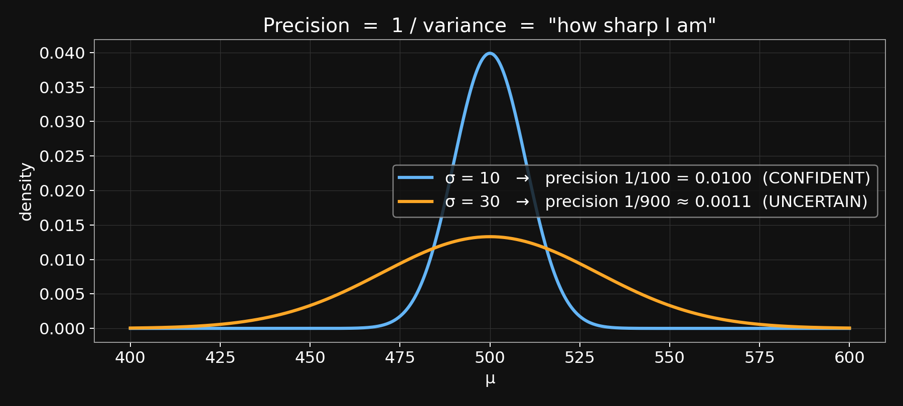{fig-align="center" width="75%"}
:::

::: {.lang-ja}
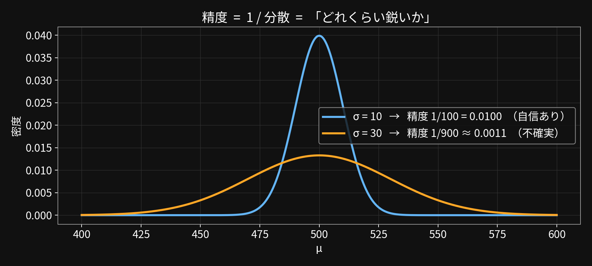{fig-align="center" width="75%"}
:::

::: {.lang-en}
[Sharper curve = higher precision = more confident (more weight in the update).]{.dim}
:::

::: {.lang-ja}
[鋭い曲線 = 高い精度 = 自信が強い（更新時により大きな重み）。]{.dim}
:::


::: {.notes}
Pause. Two Gaussians, same mean, different widths. The sharp one is more precise — if you\'re that sharp, you\'re very sure, and in a Bayesian update your view gets more weight. Intuition for the precision-sum formula on the next slide.
:::

## [Plug in the numbers  —  posterior  =  prior × likelihood, rescaled]{.lang-en}[数値を代入  —  事後 = 事前 × 尤度、再スケール]{.lang-ja}

::: {.lang-en}
**The update formulas  (from the derivation):**
:::

::: {.lang-ja}
**更新式（導出からの結果）：**
:::


$$\frac{1}{\sigma^2_{\text{post}}} \;=\; \frac{1}{\sigma_0^2} + \frac{1}{\sigma^2} \qquad\qquad \mu_{\text{post}} \;=\; \sigma^2_{\text{post}} \left( \frac{\mu_0}{\sigma_0^2} + \frac{D}{\sigma^2} \right)$$


::: {.lang-en}
[*Intuition:   precisions add.  $\mu_{\text{post}}$ = precision-weighted average.*]{.yellow}
:::

::: {.lang-ja}
[*直感：   精度は足し算。  $\mu_{\text{post}}$ = 精度で重み付けした平均。*]{.yellow}
:::


::: {.notes}
Slide 1: 'The formulas. Precisions add. Posterior mean is precision-weighted average.'
:::

## [Plug in the numbers  —  posterior  =  prior × likelihood, rescaled (2/4)]{.lang-en}[数値を代入  —  事後 = 事前 × 尤度、再スケール (2/4)]{.lang-ja}

::: {.lang-en}
**The update formulas  (from the derivation):**
:::

::: {.lang-ja}
**更新式（導出からの結果）：**
:::


$$\frac{1}{\sigma^2_{\text{post}}} \;=\; \frac{1}{\sigma_0^2} + \frac{1}{\sigma^2} \qquad\qquad \mu_{\text{post}} \;=\; \sigma^2_{\text{post}} \left( \frac{\mu_0}{\sigma_0^2} + \frac{D}{\sigma^2} \right)$$


::: {.lang-en}
[*Intuition:   precisions add.  $\mu_{\text{post}}$ = precision-weighted average.*]{.yellow}

Numbers:

$\sigma_0^2 = 400$ (prior),   $\sigma^2 = 900$ (data),   $\mu_0 = 500$,   $D = 510$
:::

::: {.lang-ja}
[*直感：   精度は足し算。  $\mu_{\text{post}}$ = 精度で重み付けした平均。*]{.yellow}

数値：

$\sigma_0^2 = 400$ （事前分布）、   $\sigma^2 = 900$ （データ）、   $\mu_0 = 500$、   $D = 510$
:::


::: {.notes}
Slide 2: 'The inputs.'
:::

## [Plug in the numbers  —  posterior  =  prior × likelihood, rescaled (3/4)]{.lang-en}[数値を代入  —  事後 = 事前 × 尤度、再スケール (3/4)]{.lang-ja} {.smaller}

::: {.lang-en}
**The update formulas  (from the derivation):**
:::

::: {.lang-ja}
**更新式（導出からの結果）：**
:::


$$\frac{1}{\sigma^2_{\text{post}}} \;=\; \frac{1}{\sigma_0^2} + \frac{1}{\sigma^2} \qquad\qquad \mu_{\text{post}} \;=\; \sigma^2_{\text{post}} \left( \frac{\mu_0}{\sigma_0^2} + \frac{D}{\sigma^2} \right)$$


::: {.lang-en}
[*Intuition:   precisions add.  $\mu_{\text{post}}$ = precision-weighted average.*]{.yellow}

Numbers:

$\sigma_0^2 = 400$ (prior),   $\sigma^2 = 900$ (data),   $\mu_0 = 500$,   $D = 510$
:::

::: {.lang-ja}
[*直感：   精度は足し算。  $\mu_{\text{post}}$ = 精度で重み付けした平均。*]{.yellow}

数値：

$\sigma_0^2 = 400$ （事前分布）、   $\sigma^2 = 900$ （データ）、   $\mu_0 = 500$、   $D = 510$
:::


::: {.lang-en}
Posterior variance:
:::

::: {.lang-ja}
事後分散：
:::


$$\frac{1}{\sigma^2_{\text{post}}} \;=\; \frac{1}{400} + \frac{1}{900} \;=\; \frac{9}{3600} + \frac{4}{3600} \;=\; \frac{13}{3600}$$


::: {.lang-en}
[**$\sigma^2_{\text{post}} \approx 277$,     $\sigma_{\text{post}} \approx 16.6$**]{.accent}

[*Tighter than both inputs (20 and 30). Adding precisions REDUCES uncertainty.*]{.green}
:::

::: {.lang-ja}
[**$\sigma^2_{\text{post}} \approx 277$、     $\sigma_{\text{post}} \approx 16.6$**]{.accent}

[*両方の入力（20 と 30）より狭い。精度を足し合わせることで不確実性が**減る**。*]{.green}
:::


::: {.notes}
Slide 3: 'Posterior variance. 1/400 + 1/900 combines on 3600. Gets you 13/3600, so σ²_post ≈ 277, σ_post ≈ 16.6. TIGHTER than either input. Combining information reduces uncertainty — that\'s the whole point of Bayesian updating.'
:::

## [Plug in the numbers  —  posterior  =  prior × likelihood, rescaled (4/4)]{.lang-en}[数値を代入  —  事後 = 事前 × 尤度、再スケール (4/4)]{.lang-ja} {.smaller}

::: {.lang-en}
**The update formulas  (from the derivation):**
:::

::: {.lang-ja}
**更新式（導出からの結果）：**
:::


$$\frac{1}{\sigma^2_{\text{post}}} \;=\; \frac{1}{\sigma_0^2} + \frac{1}{\sigma^2} \qquad\qquad \mu_{\text{post}} \;=\; \sigma^2_{\text{post}} \left( \frac{\mu_0}{\sigma_0^2} + \frac{D}{\sigma^2} \right)$$


::: {.lang-en}
[*Intuition:   precisions add.  $\mu_{\text{post}}$ = precision-weighted average.*]{.yellow}

Numbers:

$\sigma_0^2 = 400$ (prior),   $\sigma^2 = 900$ (data),   $\mu_0 = 500$,   $D = 510$

Posterior variance:
:::

::: {.lang-ja}
[*直感：   精度は足し算。  $\mu_{\text{post}}$ = 精度で重み付けした平均。*]{.yellow}

数値：

$\sigma_0^2 = 400$ （事前分布）、   $\sigma^2 = 900$ （データ）、   $\mu_0 = 500$、   $D = 510$

事後分散：
:::


$$\frac{1}{\sigma^2_{\text{post}}} \;=\; \frac{1}{400} + \frac{1}{900} \;=\; \frac{9}{3600} + \frac{4}{3600} \;=\; \frac{13}{3600}$$


::: {.lang-en}
[**$\sigma^2_{\text{post}} \approx 277$,     $\sigma_{\text{post}} \approx 16.6$**]{.accent}

[*Tighter than both inputs (20 and 30). Adding precisions REDUCES uncertainty.*]{.green}

Posterior mean:
:::

::: {.lang-ja}
[**$\sigma^2_{\text{post}} \approx 277$、     $\sigma_{\text{post}} \approx 16.6$**]{.accent}

[*両方の入力（20 と 30）より狭い。精度を足し合わせることで不確実性が**減る**。*]{.green}

事後平均：
:::


$$\mu_{\text{post}} \;=\; 277 \cdot \left( \frac{500}{400} + \frac{510}{900} \right) \;=\; 277 \cdot (1.250 + 0.567)$$


::: {.lang-en}
[**$\;=\; 277 \cdot 1.817 \;\approx\; 503.1$**]{.accent}

[*Moved from prior (500) toward data (510), but stayed closer to prior*]{.dim}

[*— because prior precision (1/400) > data precision (1/900).*]{.dim}
:::

::: {.lang-ja}
[**$\;=\; 277 \cdot 1.817 \;\approx\; 503.1$**]{.accent}

[*事前分布（500）からデータ（510）の方向に動いたが、事前分布寄りに留まった*]{.dim}

[*— 事前分布の精度 (1/400) > データの精度 (1/900) だから。*]{.dim}
:::


::: {.notes}
Slide 4: 'Posterior mean ≈ 503.1. Moved from 500 toward 510 but mostly stayed near the prior. Because the prior was more precise (σ₀=20 vs data σ=30). The more precise source wins.'
:::

## [Prior × Likelihood = Posterior]{.lang-en}[事前 × 尤度 = 事後]{.lang-ja}

::: {.lang-en}
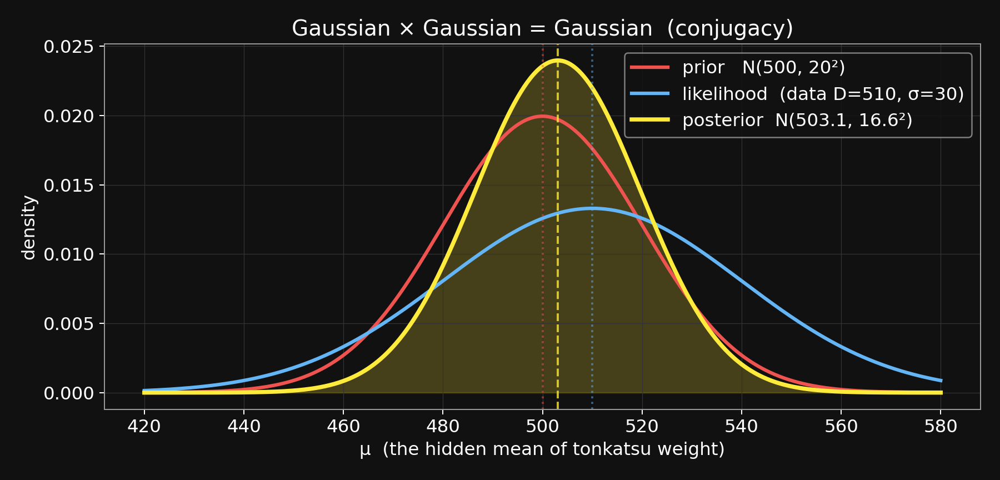{fig-align="center" width="75%"}
:::

::: {.lang-ja}
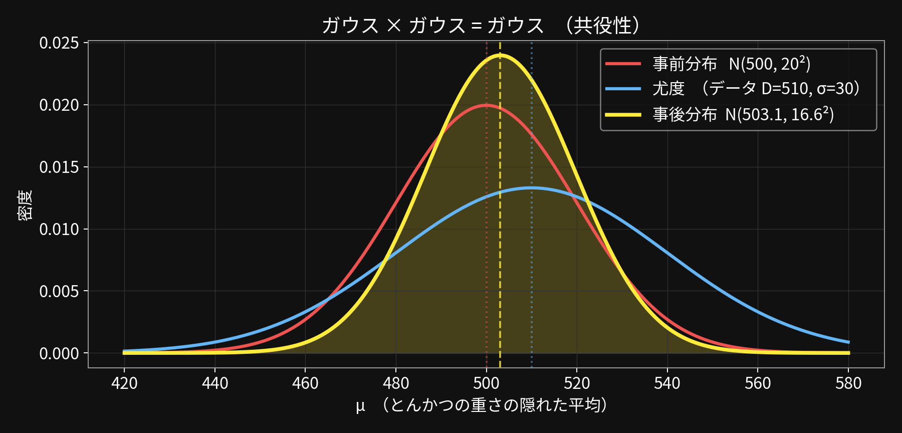{fig-align="center" width="75%"}
:::

::: {.lang-en}
[Red = prior. Blue = likelihood. Yellow = posterior (tighter; between both).]{.dim}
:::

::: {.lang-ja}
[赤 = 事前分布。青 = 尤度。黄色 = 事後分布（狭く、両者の間）。]{.dim}
:::


::: {.notes}
THE payoff visual. Pause. Red prior, blue likelihood, yellow posterior. The posterior IS tighter than both inputs and lives between them — closer to the prior because the prior is tighter. This one picture replaces 20 minutes of algebra in students\' memory.
:::

## [Bridge to Week 3 — N observations, precisions keep adding]{.lang-en}[第3週への橋  — N 回の観測、精度が足し上がる]{.lang-ja}

::: {.lang-en}
One observation:   precision added $= 1/\sigma^2$.

Two observations: precision added $= 2/\sigma^2$.

[**N observations:    precision added $= N/\sigma^2$.**]{.accent}
:::

::: {.lang-ja}
観測1回：   加わる精度 $= 1/\sigma^2$。

観測2回：   加わる精度 $= 2/\sigma^2$。

[**観測N回：    加わる精度 $= N/\sigma^2$。**]{.accent}
:::


::: {.notes}
Slide 1: 'Each independent observation adds precision 1/σ². Two observations = 2/σ² added. N observations = N/σ². This is the key property of conjugate updates.'
:::

## [Bridge to Week 3 — N observations, precisions keep adding (2/3)]{.lang-en}[第3週への橋  — N 回の観測、精度が足し上がる (2/3)]{.lang-ja}

::: {.lang-en}
One observation:   precision added $= 1/\sigma^2$.

Two observations: precision added $= 2/\sigma^2$.

[**N observations:    precision added $= N/\sigma^2$.**]{.accent}
:::

::: {.lang-ja}
観測1回：   加わる精度 $= 1/\sigma^2$。

観測2回：   加わる精度 $= 2/\sigma^2$。

[**観測N回：    加わる精度 $= N/\sigma^2$。**]{.accent}
:::


$$\frac{1}{\sigma^2_{\text{post}}} \;=\; \frac{1}{\sigma_0^2} + \frac{N}{\sigma^2} \qquad\qquad \mu_{\text{post}} \;=\; \sigma^2_{\text{post}} \left( \frac{\mu_0}{\sigma_0^2} + \frac{\sum_i D_i}{\sigma^2} \right)$$


::: {.notes}
Slide 2: 'The general formulas. Σ_i D_i is the sum of observed weights.'
:::

## [Bridge to Week 3 — N observations, precisions keep adding (3/3)]{.lang-en}[第3週への橋  — N 回の観測、精度が足し上がる (3/3)]{.lang-ja}

::: {.lang-en}
One observation:   precision added $= 1/\sigma^2$.

Two observations: precision added $= 2/\sigma^2$.

[**N observations:    precision added $= N/\sigma^2$.**]{.accent}
:::

::: {.lang-ja}
観測1回：   加わる精度 $= 1/\sigma^2$。

観測2回：   加わる精度 $= 2/\sigma^2$。

[**観測N回：    加わる精度 $= N/\sigma^2$。**]{.accent}
:::


$$\frac{1}{\sigma^2_{\text{post}}} \;=\; \frac{1}{\sigma_0^2} + \frac{N}{\sigma^2} \qquad\qquad \mu_{\text{post}} \;=\; \sigma^2_{\text{post}} \left( \frac{\mu_0}{\sigma_0^2} + \frac{\sum_i D_i}{\sigma^2} \right)$$


::: {.lang-en}
As N grows:

- $1/\sigma^2_{\text{post}} \;\to\; \infty$     (posterior gets sharp)
- $\mu_{\text{post}} \;\to\;$ mean of observed weights     (data dominates)

[**More data  →  sharper posterior, pulled toward sample mean.**]{.yellow}

[*This single formula underlies much of Weeks 3 and 4.*]{.dim}
:::

::: {.lang-ja}
N が大きくなるにつれて：

- $1/\sigma^2_{\text{post}} \;\to\; \infty$     （事後分布が鋭くなる）
- $\mu_{\text{post}} \;\to\;$ 観測値の平均     （データが支配する）

[**データが増える  →  事後分布が鋭くなり、サンプル平均に引き寄せられる。**]{.yellow}

[*この1つの式が、第3週と第4週の大部分を支える。*]{.dim}
:::


::: {.notes}
Slide 3: 'Asymptotic behavior: as N grows, the prior term becomes negligible and the posterior mean approaches the sample mean. You recover the frequentist answer in the limit of much data — but with a Bayesian path there, and a well-calibrated posterior variance 'along the way. This formula IS the skeleton of Week 3\'s conjugate updates and Week 4\'s hierarchical models.'
:::

## [Closing the arc — same flow, three specializations]{.lang-en}[弧を閉じる  — 同じ流れ、3つの特殊化]{.lang-ja} {.smaller}

::: {.lang-en}
|  | **prior** | **likelihood** | **which slide** |
|:---|:---:|:---:|:---:|
| Discrete joint  (sick friend, bento lunch & dinner) | discrete  $P(H)$ | discrete  $P(D \mid H)$ | Block: sick-friend table, bento 2×2 |
| Discrete-prior continuous-likelihood  (today's bento weight) | discrete  $P(H)$ | [**Gaussian density**  $f(D \mid H)$]{.yellow} | Block: 450 g worked example |
| Continuous everywhere  (Gaussian-Gaussian) | [**Gaussian density**  $P(\mu)$]{.yellow} | [**Gaussian density**  $f(D \mid \mu)$]{.yellow} | Block: this just-ended block |

[**Same Bayes flow throughout.  The boxes stuffed with different objects.**]{.accent}

[**Named payoff:**  $\text{Gaussian} \times \text{Gaussian} = \text{Gaussian}$    →   the posterior stays in the prior's family.   This is **conjugacy**.]{.yellow}

[*Week 3 does the same trick on the discrete side:   Beta × Binomial, Dirichlet × Multinomial.*]{.dim}
:::

::: {.lang-ja}
|  | **事前分布** | **尤度** | **該当スライド** |
|:---|:---:|:---:|:---:|
| 離散の同時分布  （風邪の友人、昼食と夕食のお弁当） | 離散  $P(H)$ | 離散  $P(D \mid H)$ | ブロック: 風邪の表、お弁当 2×2 |
| 離散事前・連続尤度  （今日のお弁当の重さ） | 離散  $P(H)$ | [**ガウス密度**  $f(D \mid H)$]{.yellow} | ブロック: 450g の計算例 |
| すべてが連続  （ガウス-ガウス） | [**ガウス密度**  $P(\mu)$]{.yellow} | [**ガウス密度**  $f(D \mid \mu)$]{.yellow} | ブロック: 今終わったばかりのもの |

[**ずっと同じベイズの流れ。箱に入る中身が変わっただけ。**]{.accent}

[**名前付きの成果物：**  $\text{Gaussian} \times \text{Gaussian} = \text{Gaussian}$    →   事後分布が事前分布と同じファミリーに留まる。   これが**共役性**。]{.yellow}

[*第3週には離散側で同じトリックをやる：   Beta × Binomial、Dirichlet × Multinomial。*]{.dim}
:::


::: {.notes}
~2 min. One consolidated closing slide. The three-flavor comparison as a table (easier to parse than three stacked paragraphs). The conjugacy payoff + Week 3 preview fold in without a second slide. Students see the invariant (the flow) once more. Transition from here directly into Block 8 (paper presentations).
:::

## [Agenda]{.lang-en}[アジェンダ]{.lang-ja} {.agenda}

- [Welcome + meet Chibany]{.lang-en}[ようこそ + チバニー紹介]{.lang-ja} [0:00]{.time}
- [Marr's three levels]{.lang-en}[Marr の3つのレベル]{.lang-ja} [0:08]{.time}
- [Notation lock-in]{.lang-en}[記法の確認]{.lang-ja} [0:15]{.time}
- [Joint, marginal, conditional, independence]{.lang-en}[同時・周辺・条件付き・独立]{.lang-ja} [0:18]{.time}
- [Expected value + discrete]{.lang-en}[期待値 + 離散分布]{.lang-ja} [0:30]{.time}
- [Continuous prob + Gaussian]{.lang-en}[連続確率 + ガウス分布]{.lang-ja} [0:45]{.time}
- [Break]{.lang-en}[休憩]{.lang-ja} [1:05]{.time}
- [Gaussian-Gaussian update]{.lang-en}[ガウス-ガウス更新]{.lang-ja} [1:10]{.time}
- [[Paper presentations]{.lang-en}[論文発表]{.lang-ja}]{.highlight} [1:40]{.time}
- [Admin + Week 3]{.lang-en}[事務連絡 + 第3週]{.lang-ja} [1:45]{.time}

## [Paper presentations — rubric + signup]{.lang-en}[論文発表 — 評価基準 + 申し込み]{.lang-ja} {.section-break background-image="../../sds-reveal/sds_frame.png" background-size="cover"}


::: {.notes}
10 min tight.
:::

## [Presentations — why and what]{.lang-en}[発表について — 目的と内容]{.lang-ja}

::: {.lang-en}
**Each of you presents ONCE during the semester.**

20 min presentation + 10-15 min discussion you facilitate.

[7.5% of grade.  Reflections dropped 15% → 12.5% to make room.]{.dim}

[**Meet with me in office hours the week before your slot.**]{.accent}
:::

::: {.lang-ja}
**各自、学期中に1回発表します。**

20分の発表 + 10–15分のディスカッション（発表者が進行役）。

[成績の7.5%。リフレクションを15%→12.5%に減らして枠を作った。]{.dim}

[**発表の前の週にオフィスアワーで相談しに来てください。**]{.accent}
:::


::: {.notes}
~2 min.
:::

## [Rubric — 5 points]{.lang-en}[評価基準 — 5点満点]{.lang-ja}

::: {.lang-en}
Understanding of the paper              1.5

Covering key aspects                      1.5

Presentation clarity                         1.0

Discussion questions (at least 3)        0.5

Appropriate use of time                    0.5

[*Focus: how the math connects to cognitive science.*]{.dim}

[Full guidelines:  resources/classPresentationGuidelines.pdf  (emailed today).]{.dim}
:::

::: {.lang-ja}
論文の理解度                                         1.5

主要な論点のカバー                                 1.5

発表の明瞭さ                                          1.0

ディスカッションの質問（最低3つ）            0.5

時間の適切な使い方                                 0.5

[*焦点：数学と認知科学との結びつき方。*]{.dim}

[ガイドライン全文：  resources/classPresentationGuidelines.pdf  （本日メール送信）。]{.dim}
:::


::: {.notes}
~2 min. Email the PDF.
:::

## [Signup — a tour of the semester]{.lang-en}[申し込み — 学期の見どころツアー]{.lang-ja} {.smaller}

::: {.lang-en}
[Pick your top-3 weeks on Slack #hml-2026 by Wed May 13.  Papers below are ONE candidate per week — full list on the readings page.]{.dim}

|  | **week + topic** | **a paper you might present** |
|:---|:---|:---|
| W4 (May 22) | Generalization + hierarchical Bayes | **Tenenbaum & Griffiths 2001** — Bayesian generalization: the canonical one |
| W5 (May 29) | Bayes nets + causal Bayes nets | **Gerstenberg et al 2015** — causal judgments as counterfactuals |
| W6 (Jun  5) | Markov chains + networks | **Abbott, Austerweil & Griffiths 2012** — memory as random walk |
| W7 (Jun 12) | Monte Carlo | **Vul et al 2009** — one-and-done sampling in cognition |
| W8 (Jun 19) | SDT / MDP / RL | **Daw et al 2005** — model-based vs. model-free RL |
| W9 (Jun 26) | Inverse RL + social cognition | **Baker, Saxe & Tenenbaum 2009** — action understanding as inverse planning |
| W10 (Jul  3) | Bayesian nonparametrics | **Austerweil & Griffiths 2013** — IBP for feature learning |
| W11 (Jul 10) | Deep NNs + LLMs | **Lake et al 2017** — building machines that learn like people |
| W12 (Jul 17) | Ethics + adversarial ML | **Caliskan et al 2017** — human-like bias in word embeddings |

[*Each week has 2–4 candidate papers on the site.  You pick one once assigned.*]{.dim}
:::

::: {.lang-ja}
[Slack #hml-2026 で希望週の上位3つを5月13日（水）までに選ぶ。下の論文は各週1つの候補例 — 完全版は readings ページに。]{.dim}

|  | **週 + 話題** | **発表候補の一例** |
|:---|:---|:---|
| 第4週 (5/22) | 一般化 + 階層ベイズ | **Tenenbaum & Griffiths 2001** — ベイズ的一般化の定番 |
| 第5週 (5/29) | ベイジアンネット + 因果ベイジアンネット | **Gerstenberg et al 2015** — 反事実としての因果判断 |
| 第6週 (6/5) | マルコフ連鎖 + ネットワーク | **Abbott, Austerweil & Griffiths 2012** — ランダムウォークとしての記憶 |
| 第7週 (6/12) | モンテカルロ | **Vul et al 2009** — 認知における「1回きりのサンプリング」 |
| 第8週 (6/19) | SDT / MDP / RL | **Daw et al 2005** — モデルベース vs. モデルフリーの強化学習 |
| 第9週 (6/26) | 逆強化学習 + 社会的認知 | **Baker, Saxe & Tenenbaum 2009** — 行動理解を逆プランニングとして |
| 第10週 (7/3) | ベイジアンノンパラメトリクス | **Austerweil & Griffiths 2013** — IBP による特徴学習 |
| 第11週 (7/10) | 深層ニューラルネット + LLM | **Lake et al 2017** — 人間のように学習する機械を作る |
| 第12週 (7/17) | 倫理 + 敵対的機械学習 | **Caliskan et al 2017** — 単語埋め込みに現れる人間的バイアス |

[*各週には2–4つの候補論文がサイトに掲載されている。  割り当てが決まったら、その中から1つ選ぶ。*]{.dim}
:::


::: {.notes}
~6 min. Walk through the tour so students can anchor their ranking. For each week say ONE sentence on what the paper does and why it's in this week. Then signups on the board; transcribe into readings_map.yml after class. Remind: there are 2–4 candidates per week, and the assigned presenter picks one.
:::

## [Agenda]{.lang-en}[アジェンダ]{.lang-ja} {.agenda}

- [Welcome + meet Chibany]{.lang-en}[ようこそ + チバニー紹介]{.lang-ja} [0:00]{.time}
- [Marr's three levels]{.lang-en}[Marr の3つのレベル]{.lang-ja} [0:08]{.time}
- [Notation lock-in]{.lang-en}[記法の確認]{.lang-ja} [0:15]{.time}
- [Joint, marginal, conditional, independence]{.lang-en}[同時・周辺・条件付き・独立]{.lang-ja} [0:18]{.time}
- [Expected value + discrete]{.lang-en}[期待値 + 離散分布]{.lang-ja} [0:30]{.time}
- [Continuous prob + Gaussian]{.lang-en}[連続確率 + ガウス分布]{.lang-ja} [0:45]{.time}
- [Break]{.lang-en}[休憩]{.lang-ja} [1:05]{.time}
- [Gaussian-Gaussian update]{.lang-en}[ガウス-ガウス更新]{.lang-ja} [1:10]{.time}
- [Paper presentations]{.lang-en}[論文発表]{.lang-ja} [1:35]{.time}
- [[Admin + Week 3]{.lang-en}[事務連絡 + 第3週]{.lang-ja}]{.highlight} [1:50]{.time}

## [Admin + Week 3 homework]{.lang-en}[事務連絡 + 第3週の宿題]{.lang-ja} {.section-break background-image="../../sds-reveal/sds_frame.png" background-size="cover"}


::: {.notes}
10 min.
:::

## [Syllabus — three things changed]{.lang-en}[シラバス — 変更点3つ]{.lang-ja}

::: {.lang-en}
**① 12 sessions, not 13.**

&nbsp;&nbsp;&nbsp;&nbsp;[No class May 1 AND May 8. Week 3 is Friday May 15.]{.dim}

**② Reflections: 6 of 12, not 8 of 13.**

&nbsp;&nbsp;&nbsp;&nbsp;[~200 words, pre-class, pass/fail.]{.dim}

**③ Paper presentations exist → 7.5%.**

&nbsp;&nbsp;&nbsp;&nbsp;[Reflections dropped 15% → 12.5% to make room.]{.dim}
:::

::: {.lang-ja}
**① セッションは13回ではなく12回。**

&nbsp;&nbsp;&nbsp;&nbsp;[5月1日と5月8日は休講。第3週は5月15日（金）から。]{.dim}

**② リフレクション：13回中8回ではなく、12回中6回。**

&nbsp;&nbsp;&nbsp;&nbsp;[~200語、授業前、合否のみ。]{.dim}

**③ 論文発表を導入 → 7.5%。**

&nbsp;&nbsp;&nbsp;&nbsp;[その分、リフレクションを15%→12.5%に減らした。]{.dim}
:::


::: {.notes}
~3 min.
:::

## [Week 3 — readings + homework]{.lang-en}[第3週 — 読み物 + 宿題]{.lang-ja}

::: {.lang-en}
Next class:   Friday May 15  —  Week 3: Conjugate Bayes + Topics.

**Required reading:**

&nbsp;&nbsp;• Textbook T3 Ch 1   (Chibany's mystery bentos — the full story)

&nbsp;&nbsp;• Textbook T3 Ch 4   (Bayesian learning with Gaussians)

&nbsp;&nbsp;&nbsp;&nbsp;&nbsp;[*— formalizes today's Gaussian-Gaussian update.*]{.dim}

[Ungraded self-check: "Intro Probability Theory 1" quiz.]{.dim}
:::

::: {.lang-ja}
次回の授業：   5月15日（金）  —  第3週：共役ベイズ + トピックモデル。

**必読：**

&nbsp;&nbsp;• 教科書 T3 第1章   （チバニーの謎のお弁当 — 話の全容）

&nbsp;&nbsp;• 教科書 T3 第4章   （ガウス分布でのベイズ学習）

&nbsp;&nbsp;&nbsp;&nbsp;&nbsp;[*— 今日のガウス-ガウス更新を正式化する。*]{.dim}

[成績外の自己確認：「Intro Probability Theory 1」クイズ。]{.dim}
:::


::: {.notes}
~4 min. T3 Ch 1 is added so Chibany\'s backstory is reinforced; T3 Ch 4 derives what we sketched in Block 7.
:::

## [Preview — the arc from here]{.lang-en}[先取り — ここから先の流れ]{.lang-ja}

::: {.lang-en}
Week 3:  Conjugacy proper.  Beta-Binomial + Gaussian-Gaussian.

Week 4:  Hierarchical Bayes.  Chibany's distribution of tonkatsu rates.

Week 5:  Bayes nets + causal.

[Weeks 6-7:  Markov chains, Monte Carlo  (sampling-based L2).]{.dim}

[Weeks 8-10:  Decision, RL, IRL, nonparametrics.]{.dim}

[Weeks 11-12:  Deep NNs, ethics  —  contemporary ML.]{.dim}

[**Thanks — see you May 15.**]{.accent}
:::

::: {.lang-ja}
第3週：  共役性をきちんと。  ベータ-二項 + ガウス-ガウス。

第4週：  階層ベイズ。  チバニーのとんかつ率の分布。

第5週：  ベイジアンネット + 因果。

[第6-7週：  マルコフ連鎖、モンテカルロ  （サンプリングベースのL2）。]{.dim}

[第8-10週：  決定理論、RL、逆RL、ノンパラメトリクス。]{.dim}

[第11-12週：  深層NN、倫理  —  現代の機械学習。]{.dim}

[**ありがとう — 5月15日に会いましょう。**]{.accent}
:::


::: {.notes}
~3 min. Close warm.
:::

