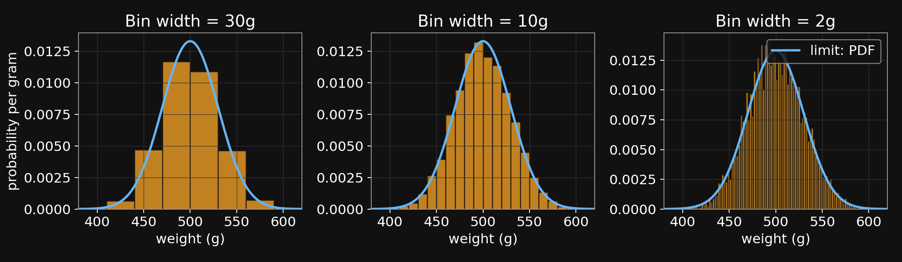

::: {.notes}
Crisp start. Today's backbone is the second half: continuous probability, Gaussian, and the Gaussian-Gaussian update. Marr is a 7-min frame; Chibany meets us at the top.
:::

## Agenda {.agenda}

- [Welcome + meet Chibany]{.highlight} [0:00]{.time}
- Marr's three levels [0:08]{.time}
- Notation lock-in [0:15]{.time}
- Joint, marginal, conditional, independence [0:18]{.time}
- Expected value + discrete [0:30]{.time}
- Continuous prob + Gaussian [0:45]{.time}
- Break [1:05]{.time}
- Gaussian-Gaussian update [1:15]{.time}
- Paper presentations [1:40]{.time}
- Admin + Week 3 [1:50]{.time}

## Welcome back + meet Chibany {.section-break background-image="../../sds-reveal/sds_frame.png" background-size="cover"}

::: {.notes}
~8 min. First 3 min: syllabus updates + Week 1 pulse. Next 5 min: introduce Chibany and the bento scenario properly, so the rest of the session has a narrative it can actually lean on.
:::

## Two changes since Week 1

**Paper presentations are in.**

[Each of you presents one reading once. More at 1:40.]{.dim}

**Reflections: 6 of 12, not 8 of 13.**

[Class is now 2 h × 12 weeks. More at 1:50.]{.dim}

::: {.notes}
State the two facts, move on. If a student asks for detail, say 'I'll get to that at 1:40 / 1:50.' ~1 min.
:::

## Meet Chibany

Chibany is the Chiba Tech mascot. They hang out at the cafeteria.

Students bring them two bentos a day — lunch and dinner — as offerings.

[Chibany loves tonkatsu.]{.yellow}

[Chibany is the protagonist of our textbook,]{.dim}

["A Narrative Introduction to Probability" — Tutorial 3 Ch 1.]{.dim}

::: {.notes}
Slide 1: 'Before we do math, meet Chibany — the Chiba Tech mascot, our worked example all semester. They hang out at the cafeteria; students offer bentos in the hope Chibany favors them on upcoming tests. Two bentos a day, from two different students — one at lunch, one at dinner. Crucially: Chibany LOVES tonkatsu, which is why meal identity matters. Also the protagonist of the textbook, so T3 Ch 1 tonight tops this up.'
:::

## Meet Chibany (2/4)

Chibany is the Chiba Tech mascot. They hang out at the cafeteria.

Students bring them two bentos a day — lunch and dinner — as offerings.

[Chibany loves tonkatsu.]{.yellow}

[Chibany is the protagonist of our textbook,]{.dim}

["A Narrative Introduction to Probability" — Tutorial 3 Ch 1.]{.dim}

[**The catch this week:   the bento boxes are OPAQUE.**]{.yellow}

Chibany can't peek — and it would be rude to open one while the student watches.

::: {.notes}
Slide 2: 'The hook: opaque bentos. Last week the boxes were transparent — Chibany could just see the meal. This week, students switched to opaque boxes. Chibany is curious and wants to know if today is a tonkatsu day, but can\'t open it while the student is there. Classic hidden-variable setup — Week 1\'s checkershadow and Heider-Simmel are the same kind of inference-under-incomplete-information move.'
:::

## Meet Chibany (3/4)

Chibany is the Chiba Tech mascot. Students offer them two bentos a day.

[Chibany loves tonkatsu.]{.yellow}

[Textbook pointer: T3 Ch 1 — "A Narrative Introduction to Probability."]{.dim}

[**The catch this week:   the bento boxes are OPAQUE.**]{.yellow}

Chibany can't peek — and it would be rude to open one while the student watches.

**What Chibany knows  (from last week's transparent bentos):**

&nbsp;&nbsp;&nbsp;[• Tonkatsu bentos weigh about 500 g]{.accent}

&nbsp;&nbsp;&nbsp;[• Hamburger bentos weigh about 350 g]{.accent}

&nbsp;&nbsp;&nbsp;[• About 70% of offerings are tonkatsu]{.accent}

&nbsp;&nbsp;&nbsp;&nbsp;&nbsp;[(overheard two students chatting)]{.dim}

::: {.notes}
Slide 3: 'Prior knowledge comes from two sources: (a) last week the bentos were transparent, so Chibany has clean weights for each meal — ~500g tonkatsu, ~350g hamburger; (b) the 70/30 prior is from the overheard-student conversation in T3 Ch 1. Priors come from somewhere — they are knowledge about the world, not guesses out of nowhere.'
:::

## Meet Chibany (4/4) {.smaller}

Chibany is the Chiba Tech mascot. Students offer them two bentos a day.

[Chibany loves tonkatsu.]{.yellow}

[Textbook pointer: T3 Ch 1 — "A Narrative Introduction to Probability."]{.dim}

[**The catch this week:   the bento boxes are OPAQUE.**]{.yellow}

Chibany can't peek — and it would be rude to open one while the student watches.

**What Chibany knows  (from last week's transparent bentos):**

&nbsp;&nbsp;&nbsp;[• Tonkatsu bentos weigh about 500 g]{.accent}

&nbsp;&nbsp;&nbsp;[• Hamburger bentos weigh about 350 g]{.accent}

&nbsp;&nbsp;&nbsp;[• About 70% of offerings are tonkatsu]{.accent}

&nbsp;&nbsp;&nbsp;&nbsp;&nbsp;[(overheard two students chatting)]{.dim}

[**Chibany's plan:   WEIGH THE BENTO.**]{.yellow}

[*"The weight won't tell me for sure if it's tonkatsu,*]{.accent}

&nbsp;[*but it will UPDATE my belief about today's meal."*]{.accent}

[That update is Bayes' rule. Same rule as last week — new anchor.]{.dim}

::: {.notes}
Slide 4: 'Chibany\'s strategy: weigh the bento and update. They care most about "is today tonkatsu?" — their favorite. Same Bayesian move as Week 1\'s sick-friend, just with a bento instead of a patient. Prior belief, observation, posterior. Same rule. New anchor.'
:::

## Agenda {.agenda}

- Welcome + meet Chibany [0:00]{.time}
- [Marr's three levels]{.highlight} [0:08]{.time}
- Notation lock-in [0:15]{.time}
- Joint, marginal, conditional, independence [0:18]{.time}
- Expected value + discrete [0:30]{.time}
- Continuous prob + Gaussian [0:45]{.time}
- Break [1:05]{.time}
- Gaussian-Gaussian update [1:15]{.time}
- Paper presentations [1:40]{.time}
- Admin + Week 3 [1:50]{.time}

## Marr's three levels — frame for the whole course {.section-break background-image="../../sds-reveal/sds_frame.png" background-size="cover"}

::: {.notes}
7 min hard cap. Trimmed from the earlier draft to free time for Gaussian visualization. 3 slides (one per level) + check-in. Do NOT let this expand.
:::

## Marr L1 — what problem is being solved?

[**For Chibany:   Compute  P(meal | weight).**]{.accent}

[L1 specifies the CORRECT computation — not how to do it,]{.dim}

[not how Chibany's brain actually does it.]{.dim}

**Different goal  ⇒  different L1  ⇒  different normative answer.**

::: {.notes}
~2 min. Bayes is the normative answer for 'combine prior + evidence.' Counterfactual: if the goal were 'minimize reaction time,' L1 differs. Choosing L1 IS a modeling move.
:::

## Marr L2 — what algorithm?

**Same L1 — multiple algorithms:**

&nbsp;&nbsp;• Enumerate  (today: 2 hypotheses, sum-and-normalize)

&nbsp;&nbsp;• Sample  (Week 7 Monte Carlo)

&nbsp;&nbsp;[• "Always guess tonkatsu"  —  an algorithm. A BAD one.]{.red}

[**Bayes is L1. Algorithms are L2.**]{.accent}

::: {.notes}
~2 min. The bad-algorithm point is important: "always guess tonkatsu" is 70% accurate because of the prior — it's still a well-defined L2, just one that ignores the observation.
:::

## Marr L3 — what implementation?

Chibany:  neurons, experience, gut feeling.

Our simulation:  JAX arrays, floating-point math, Colab.

**Three levels — mostly independent.**

[Right L1 + wrong L2 → systematic human biases.]{.accent}

[*(Full L3 treatment: Week 11, Deep NNs.)*]{.dim}

::: {.notes}
~2 min. FAST. Land the independence point — this is the thread for the rest of the course.
:::

## Check-in — the cab problem

Last week: witness says "blue"; 15% blue cabs;

witness accurate 80%.  Most of you guessed ~80%.

[**At which level was the mistake?**]{.yellow}

[*Target: L1 = P(blue | report). Actual L1 answer ≈ 0.41.*]{.dim}

[*80% is a wrong-L2 claim  (ignore the base rate).*]{.dim}

::: {.notes}
~1 min. Fast — elicit the answer. Bridge: "humans systematically use a non-Bayesian L2 on this problem; that gap between L1 and L2 is behavioral economics."
:::

## Agenda {.agenda}

- Welcome + meet Chibany [0:00]{.time}
- Marr's three levels [0:08]{.time}
- [Notation lock-in]{.highlight} [0:15]{.time}
- Joint, marginal, conditional, independence [0:18]{.time}
- Expected value + discrete [0:30]{.time}
- Continuous prob + Gaussian [0:45]{.time}
- Break [1:05]{.time}
- Gaussian-Gaussian update [1:15]{.time}
- Paper presentations [1:40]{.time}
- Admin + Week 3 [1:50]{.time}

## Notation lock-in {.section-break background-image="../../sds-reveal/sds_frame.png" background-size="cover"}

::: {.notes}
3 min. Quick. No theatrical apology.
:::

## Notation — one rule, starting today

[From today:]{.dim}

[**H = hypothesis  (hidden — what we want to know)**]{.yellow}

[**D = data  (observed — what we see)**]{.yellow}

[For Chibany:   H = meal,   D = today's observation.]{.accent}

::: {.notes}
Slide 1: 'H = hypothesis, D = data. For Chibany, H is the meal — what we want to know. D is whatever we observe today; later that\'ll be the bento\'s weight, but for the next block it\'ll just be the other meal.'
:::

## Notation — one rule, starting today (2/3)

[From today:]{.dim}

[**H = hypothesis  (hidden — what we want to know)**]{.yellow}

[**D = data  (observed — what we see)**]{.yellow}

[For Chibany:   H = meal,   D = today's observation.]{.accent}

$$P(H = h \mid D = d) \;=\; \frac{P(D = d \mid H = h) \; P(H = h)}{P(D = d)}$$

::: {.notes}
Slide 2: 'The formula you saw last week. Same one.'
:::

## Notation — one rule, starting today (3/3)

[From today:]{.dim}

[**H = hypothesis  (hidden — what we want to know)**]{.yellow}

[**D = data  (observed — what we see)**]{.yellow}

[For Chibany:   H = meal,   D = today's observation.]{.accent}

$$P(H = h \mid D = d) \;=\; \frac{P(D = d \mid H = h) \; P(H = h)}{P(D = d)}$$

&nbsp;&nbsp;[posterior     =      likelihood     ·    prior    /   evidence]{.dim}

::: {.notes}
Slide 3: 'Name the four pieces. You\'ll see these names the rest of the semester.'
:::

## Agenda {.agenda}

- Welcome + meet Chibany [0:00]{.time}
- Marr's three levels [0:08]{.time}
- Notation lock-in [0:15]{.time}
- [Joint, marginal, conditional, independence]{.highlight} [0:18]{.time}
- Expected value + discrete [0:30]{.time}
- Continuous prob + Gaussian [0:45]{.time}
- Break [1:05]{.time}
- Gaussian-Gaussian update [1:15]{.time}
- Paper presentations [1:40]{.time}
- Admin + Week 3 [1:50]{.time}

## Joint, marginalization, conditional, independence {.section-break background-image="../../sds-reveal/sds_frame.png" background-size="cover"}

::: {.notes}
~14 min. Build the joint for Chibany\'s two meals, then run the four moves: joint → marginal → conditional → independence check. Same Ω = {HH, HT, TH, TT} from Week 1, now with real weighted probabilities. Still fully discrete — weight appears in Block 6.
:::

## Last week's sick-friend problem, in H/D notation

[Last week:   smoker friend, cough heard, three hypotheses.]{.dim}

In the new notation:     H ∈ { cold, stomach virus, lung cancer },    D = cough.

|                             | **cold** | **stomach virus** | **lung cancer** |
|:----------------------------|:--------:|:-----------------:|:---------------:|
| Prior  P(H)                 |    ?     |         ?         |        ?        |
| Likelihood  P(D ∣ H)        |    ?     |         ?         |        ?        |
| Numerator  P(H) · P(D ∣ H)  |    ?     |         ?         |        ?        |
| Posterior  P(H ∣ D)         |    ?     |         ?         |        ?        |

::: {.notes}
Slide 1: 'Re-cast in notation. Three disease hypotheses as columns. Four rows — prior, likelihood, numerator, posterior — fill in one row at a time on the next slides. Same problem, new layout.'
:::

## Last week's sick-friend problem, in H/D notation (2/3)

[Last week:   smoker friend, cough heard, three hypotheses.]{.dim}

In the new notation:     H ∈ { cold, stomach virus, lung cancer },    D = cough.

|                             | **cold** | **stomach virus** | **lung cancer** |
|:----------------------------|:--------:|:-----------------:|:---------------:|
| Prior  P(H)                 |   0.45   |       0.10        |      0.10       |
| Likelihood  P(D ∣ H)        |   0.90   |       0.45        |      0.90       |
| Numerator  P(H) · P(D ∣ H)  |  0.405   |       0.045       |      0.090      |
| Posterior  P(H ∣ D)         |    ?     |         ?         |        ?        |

[**Evidence  P(D) = 0.405 + 0.045 + 0.090 = 0.540**]{.accent}

::: {.notes}
Slide 2: 'Fill in prior, likelihood, and their product (numerator of Bayes). Evidence is the sum of numerators. Numerators don\'t sum to 1 yet — that\'s what dividing by the evidence fixes. Note: even though smoking-related lung cancer has same likelihood as cold (0.90), cold dominates because its prior is 4.5× higher.'
:::

## Last week's sick-friend problem, in H/D notation (3/3)

[Last week:   smoker friend, cough heard, three hypotheses.]{.dim}

In the new notation:     H ∈ { cold, stomach virus, lung cancer },    D = cough.

|                             | **cold** | **stomach virus** | **lung cancer** |
|:----------------------------|:--------:|:-----------------:|:---------------:|
| Prior  P(H)                 |   0.45   |       0.10        |      0.10       |
| Likelihood  P(D ∣ H)        |   0.90   |       0.45        |      0.90       |
| Numerator  P(H) · P(D ∣ H)  |  0.405   |       0.045       |      0.090      |
| [**Posterior  P(H ∣ D)**]{.accent} | [**0.75**]{.accent} | [**0.083**]{.accent} | [**0.167**]{.accent} |

[**Evidence  P(D) = 0.540**     →     posteriors  =  numerators / evidence.]{.dim}

[Same answer as last week. Same rule. New layout.]{.yellow}

[Everything we do today uses this SAME structure.]{.dim}

::: {.notes}
Slide 3: 'Divide every numerator by the evidence (0.540) to get the posterior row. Cold wins despite smoking — 0.75 posterior. Priors matter, likelihoods matter, neither alone is enough. Now today: same structure, but with Chibany.'
:::

## Setup — two meals, two variables

Today Chibany gets two bentos: one for lunch, one for dinner.

&nbsp;&nbsp;&nbsp;A  =  lunch meal,    A ∈ {tonkatsu, hamburger}

&nbsp;&nbsp;&nbsp;B  =  dinner meal,   B ∈ {tonkatsu, hamburger}

[*Same outcome space as Week 1's two-coin-flip grid:* Ω = {HH, HT, TH, TT}.]{.dim}

[*Now the "coin" has a biased and asymmetric joint.*]{.dim}

::: {.notes}
~1 min. We deliberately stay DISCRETE. Two meals, each in {H, T}. Same Ω as Week 1's grid. Weight doesn't appear until Block 6 — today we're building the operations (joint, marginal, conditional) and the independence/dependence concept on ground students already understand.
:::

## The joint  P(A, B)  — build the 2×2 table

Tanaka-san tells Chibany that students coordinate:  they try to bring

at least one tonkatsu, but not two (to keep it special).

|             | B = H | B = T |
|-------------|:-----:|:-----:|
| **A = H**   |   ?   |   ?   |
| **A = T**   |   ?   |   ?   |

::: {.notes}
Slide 1: 'Four combinations of (lunch, dinner). We want the joint probability of each. The narrative: students coordinate — this is the grid from textbook T3 Ch 4, the weighted-possibilities example.'
:::

## The joint  P(A, B)  — build the 2×2 table (2/3)

Tanaka-san tells Chibany that students coordinate:  they try to bring

at least one tonkatsu, but not two (to keep it special).

|             | B = H | B = T |
|-------------|:-----:|:-----:|
| **A = H**   | 0.04  | 0.43  |
| **A = T**   | 0.43  | 0.10  |

[*HH is rare  (both offerings hamburger).*]{.dim}

[*HT and TH are common  (exactly one tonkatsu).*]{.dim}

[*TT is moderate  (students avoid giving two tonkatsu in a row).*]{.dim}

::: {.notes}
Slide 2: 'The weighted joint from textbook Ch 4. HH 4%, HT 43%, TH 43%, TT 10%. Students coordinate to give at least one T, but not two. NOT derived from P(A) times P(B|A) — we\'re given the whole joint from the start, because it isn\'t a product of a prior and a likelihood. This is KEY for the next move: independence.'
:::

## The joint  P(A, B)  — build the 2×2 table (3/3)

Tanaka-san tells Chibany that students coordinate:  they try to bring

at least one tonkatsu, but not two (to keep it special).

|             | B = H | B = T |
|-------------|:-----:|:-----:|
| **A = H**   | 0.04  | 0.43  |
| **A = T**   | 0.43  | 0.10  |

[**Sanity check:   0.04 + 0.43 + 0.43 + 0.10  =  1.00  ✓**]{.green}

[*Recognize the shape?  Week 1's 2-coin-flip grid had 4 cells too.*]{.dim}

[*Different numbers, same structure.*]{.dim}

::: {.notes}
Slide 3: 'Sanity check sums to 1. Analogy to last week\'s {HH, HT, TH, TT} — same Ω, now with real probabilities attached. Transition: now we have a joint — what can we DO with it?'
:::

## Marginalization — sum over what you don't care about

**P(A = T)  =  ?**

Sum the joint over B:

&nbsp;&nbsp;&nbsp;P(A = T)  =  P(A = T, B = H)  +  P(A = T, B = T)

&nbsp;&nbsp;&nbsp;&nbsp;&nbsp;&nbsp;&nbsp;&nbsp;&nbsp;&nbsp;&nbsp;&nbsp;&nbsp;&nbsp;&nbsp;&nbsp;[**=  0.43  +  0.10   =   0.53**]{.accent}

::: {.notes}
Slide 1: 'What\'s P(A = T) unconditionally? Chibany gets tonkatsu for lunch either paired with a hamburger dinner OR with a tonkatsu dinner. Sum across B.'
:::

## Marginalization — sum over what you don't care about (2/3)

**P(A = T)  =  ?**

Sum the joint over B:

&nbsp;&nbsp;&nbsp;P(A = T)  =  P(A = T, B = H)  +  P(A = T, B = T)

&nbsp;&nbsp;&nbsp;&nbsp;&nbsp;&nbsp;&nbsp;&nbsp;&nbsp;&nbsp;&nbsp;&nbsp;&nbsp;&nbsp;&nbsp;&nbsp;[**=  0.43  +  0.10   =   0.53**]{.accent}

[**P(A = H)  =  0.04 + 0.43  =  0.47**]{.accent}

&nbsp;&nbsp;&nbsp;[0.53 + 0.47 = 1 ✓]{.dim}

::: {.notes}
Slide 2: 'And P(A = H). Check the marginal sums to 1.'
:::

## Marginalization — sum over what you don't care about (3/3)

**P(A = T)  =  ?**

Sum the joint over B:

&nbsp;&nbsp;&nbsp;P(A = T)  =  P(A = T, B = H)  +  P(A = T, B = T)

&nbsp;&nbsp;&nbsp;&nbsp;&nbsp;&nbsp;&nbsp;&nbsp;&nbsp;&nbsp;&nbsp;&nbsp;&nbsp;&nbsp;&nbsp;&nbsp;[**=  0.43  +  0.10   =   0.53**]{.accent}

[**P(A = H)  =  0.04 + 0.43  =  0.47**]{.accent}

&nbsp;&nbsp;&nbsp;[0.53 + 0.47 = 1 ✓]{.dim}

[**The named move:  MARGINALIZATION.**]{.yellow}

Given the joint, sum over the variable you're not asking about.

[Week 1 called this the sum rule.]{.dim}

::: {.notes}
Slide 3: 'Named: marginalization. Sum rule. Same move as last week. Next move: conditional — then we use marginal + conditional together to define INDEPENDENCE.'
:::

## Conditional — restrict and renormalize

[Chibany learns:   today's DINNER was tonkatsu  (B = T).]{.yellow}

**What's  P(A | B = T)?     What should Chibany now believe about lunch?**

[Same move as Week 1's 2×2 coin-flip grid:]{.dim}

[*"Restrict to the slice where the observation is true; renormalize."*]{.dim}

::: {.notes}
Slide 1: 'Observation arrives about dinner. Ask the conditional question about lunch. Same move as last week\'s coin-flip grid — restrict and renormalize.'
:::

## Conditional — restrict and renormalize (2/3)

[Chibany learns:   today's DINNER was tonkatsu  (B = T).]{.yellow}

**What's  P(A | B = T)?     What should Chibany now believe about lunch?**

[Same move as Week 1's 2×2 coin-flip grid:]{.dim}

[*"Restrict to the slice where the observation is true; renormalize."*]{.dim}

Step 1:   keep only the "B = T" column of the joint.

&nbsp;&nbsp;&nbsp;[P(A = H, B = T) = 0.43        P(A = T, B = T) = 0.10]{.accent}

Step 2:   renormalize by P(B = T) = 0.53.

::: {.notes}
Slide 2: 'Two steps. Slice the joint to keep only the column consistent with the observation; renormalize by the marginal of what was observed.'
:::

## Conditional — restrict and renormalize (3/3)

[Chibany learns:   today's DINNER was tonkatsu  (B = T).]{.yellow}

**What's  P(A | B = T)?     What should Chibany now believe about lunch?**

[Same move as Week 1's 2×2 coin-flip grid:]{.dim}

[*"Restrict to the slice where the observation is true; renormalize."*]{.dim}

Step 1:   keep only the "B = T" column of the joint.

&nbsp;&nbsp;&nbsp;[P(A = H, B = T) = 0.43        P(A = T, B = T) = 0.10]{.accent}

Step 2:   renormalize by P(B = T) = 0.53.

&nbsp;&nbsp;&nbsp;[**P(A = H | B = T)   =  0.43 / 0.53  ≈  0.811**]{.green}

&nbsp;&nbsp;&nbsp;[**P(A = T | B = T)   =  0.10 / 0.53  ≈  0.189**]{.green}

[*Learning dinner was tonkatsu made Chibany MORE confident lunch was hamburger.*]{.yellow}

[*Makes sense — students avoid two tonkatsu in a row.*]{.dim}

::: {.notes}
Slide 3: 'Posterior over lunch. Learning dinner was T swings belief about lunch toward H, from 47% up to 81%. The observation about one meal changed beliefs about the OTHER meal. That\'s a clue — set up the next move: are A and B independent?'
:::

## Independence — definition

A and B are **independent**    ( written  A ⊥ B )    iff:

[**P(A | B)  =  P(A)        for every value of A and every value of B with P(B) > 0**]{.accent}

[*"Learning B doesn't change what I believe about A."*]{.yellow}

Equivalently:     **P(A, B)  =  P(A) · P(B)**

[*The joint factors into the product of marginals.*]{.dim}

::: {.notes}
~1 min. Two equivalent definitions. Conditional-equals-marginal is the intuitive one ("knowing one tells you nothing about the other"). The product-of-marginals form is the one we USE in practice — it\'s how we check independence on a joint table.
:::

## Independence — check today's joint

[Are A (lunch) and B (dinner) independent?]{.dim}

Marginal:        [**P(A = T)   =   0.53**]{.accent}

Conditional:     [**P(A = T | B = T)   ≈   0.189**]{.accent}

[**0.189  ≠  0.53.    A and B are DEPENDENT:   not ( A ⊥ B ).**]{.yellow}

[*If students acted independently — flipping a coin each meal for T with some p —*]{.dim}

[*the joint would FACTOR:   P(A, B) = P(A) · P(B).   It doesn't.*]{.dim}

[*The coordination IS the dependence.*]{.dim}

::: {.notes}
Slide 2: 'Concrete check. Marginal says A is T about half the time. Conditional on B=T says A is T only ~19% of the time. Very different — so dependent. Explain WHY: students coordinate (avoid two T, aim for at least one T). Dependence in the data = structure in the world. In an alternative world where students flipped independent Bernoullis, the joint would factor exactly. We\'ll use independence a lot in Weeks 6–8 (conditional independence in PGMs, i.i.d. assumptions in likelihoods).'
:::

## Summary — four operations on the joint

Joint                  =  full picture, P(A, B). All cells sum to 1.

Marginal            =  sum the joint over the thing you don't care about.

Conditional         =  slice on your observation, renormalize.

Independence   =  check if  P(A, B)  =  P(A) · P(B)     (equivalently, P(A|B) = P(A)).

[**Same Bayes as last week. Now you can SEE it as a table operation.**]{.accent}

::: {.notes}
~1 min. Mental model to carry forward. Four moves on the joint: build it, marginalize, condition, check independence. Everything today (and Week 3, and RL, and PGMs later) is operations on this table — just with more variables and eventually infinitely many cells (continuous).
:::

## Agenda {.agenda}

- Welcome + meet Chibany [0:00]{.time}
- Marr's three levels [0:08]{.time}
- Notation lock-in [0:15]{.time}
- Joint, marginal, conditional, independence [0:18]{.time}
- [Expected value + discrete]{.highlight} [0:30]{.time}
- Continuous prob + Gaussian [0:45]{.time}
- Break [1:05]{.time}
- Gaussian-Gaussian update [1:15]{.time}
- Paper presentations [1:40]{.time}
- Admin + Week 3 [1:50]{.time}

## Expected value + discrete distributions {.section-break background-image="../../sds-reveal/sds_frame.png" background-size="cover"}

::: {.notes}
15 min. E[X] (4 slides), Bernoulli (3 slides), Binomial (4 slides + 1 real PMF image). Bernoulli IS the meal draw; Binomial IS a week.
:::

## Expected value  E[X]

For a discrete RV X with values {xᵢ} and probabilities {pᵢ}:

$$\mathbb{E}[X] \;=\; \sum_i x_i \, p_i$$

[*"Weight each value by its probability, then add."*]{.dim}

::: {.notes}
Slide 1: 'Expected value. Weighted average. The formula is what you\'d naïvely call an average — but weighted by probability instead of counted equally.'
:::

## Expected value  E[X] (2/4)

For a discrete RV X with values {xᵢ} and probabilities {pᵢ}:

$$\mathbb{E}[X] \;=\; \sum_i x_i \, p_i$$

[*"Weight each value by its probability, then add."*]{.dim}

Chibany: encode meal numerically.  tonkatsu = 1, hamburger = 0.

$$\mathbb{E}[\text{meal}] \;=\; 1 \cdot 0.7 \;+\; 0 \cdot 0.3 \;=\; 0.7$$

[The expected value of an indicator IS the probability.]{.yellow}

::: {.notes}
Slide 2: 'Encode meal as 1/0. Then E[meal] equals the probability. Key trick — we use it constantly in RL and in hypothesis testing.'
:::

## Expected value  E[X] (3/4)

For a discrete RV X with values {xᵢ} and probabilities {pᵢ}:

$$\mathbb{E}[X] \;=\; \sum_i x_i \, p_i$$

[*"Weight each value by its probability, then add."*]{.dim}

Chibany: encode meal numerically.  tonkatsu = 1, hamburger = 0.

$$\mathbb{E}[\text{meal}] \;=\; 1 \cdot 0.7 \;+\; 0 \cdot 0.3 \;=\; 0.7$$

[The expected value of an indicator IS the probability.]{.yellow}

Variance:     $\mathrm{Var}[X] \;=\; \mathbb{E}\!\left[(X - \mathbb{E}[X])^2\right] \;=\; \mathbb{E}[X^2] - \mathbb{E}[X]^2$

For $\mathrm{Bernoulli}(p)$:     $\mathrm{Var} = p(1-p)$

**Bento meal:   Var = 0.21,   σ ≈ 0.46**

::: {.notes}
Slide 3: 'Variance. Spread. For Bernoulli(p), it simplifies to p(1-p). Maxed at p=0.5; smaller at the extremes.'
:::

## Expected value  E[X] (4/4)

For a discrete RV X with values {xᵢ} and probabilities {pᵢ}:

$$\mathbb{E}[X] \;=\; \sum_i x_i \, p_i$$

[*"Weight each value by its probability, then add."*]{.dim}

Chibany: encode meal numerically.  tonkatsu = 1, hamburger = 0.

$$\mathbb{E}[\text{meal}] \;=\; 1 \cdot 0.7 \;+\; 0 \cdot 0.3 \;=\; 0.7$$

[The expected value of an indicator IS the probability.]{.yellow}

Variance:     $\mathrm{Var}[X] \;=\; \mathbb{E}\!\left[(X - \mathbb{E}[X])^2\right] \;=\; \mathbb{E}[X^2] - \mathbb{E}[X]^2$

For $\mathrm{Bernoulli}(p)$:     $\mathrm{Var} = p(1-p)$

**Bento meal:   Var = 0.21,   σ ≈ 0.46**

[**$\mathbb{E}[X]$  =  center of mass.      $\mathrm{Var}[X]$  =  spread.**]{.accent}

[Two numbers that summarize a lot. Used everywhere downstream.]{.dim}

::: {.notes}
Slide 4: 'Mental model: mean = balance point, variance = width.'
:::

## Bernoulli distribution

$X \sim \mathrm{Bernoulli}(p)$     means:

[**$P(X = 1) = p, \quad P(X = 0) = 1 - p$**]{.accent}

[One flip of a weighted coin. One parameter: p.]{.dim}

::: {.notes}
Slide 1: 'Bernoulli. One parameter.'
:::

## Bernoulli distribution (2/3)

$X \sim \mathrm{Bernoulli}(p)$     means:

[**$P(X = 1) = p, \quad P(X = 0) = 1 - p$**]{.accent}

[One flip of a weighted coin. One parameter: p.]{.dim}

**Chibany:  $\text{meal}_{\text{today}} \sim \mathrm{Bernoulli}(0.7)$.**

&nbsp;&nbsp;&nbsp;&nbsp;P(meal_today = tonkatsu) = 0.7

&nbsp;&nbsp;&nbsp;&nbsp;P(meal_today = hamburger) = 0.3

::: {.notes}
Slide 2: 'The bento meal is Bernoulli(0.7). Every day, a weighted flip.'
:::

## Bernoulli distribution (3/3)

$X \sim \mathrm{Bernoulli}(p)$     means:

[**$P(X = 1) = p, \quad P(X = 0) = 1 - p$**]{.accent}

[One flip of a weighted coin. One parameter: p.]{.dim}

**Chibany:  $\text{meal}_{\text{today}} \sim \mathrm{Bernoulli}(0.7)$.**

&nbsp;&nbsp;&nbsp;&nbsp;P(meal_today = tonkatsu) = 0.7

&nbsp;&nbsp;&nbsp;&nbsp;P(meal_today = hamburger) = 0.3

[Today we treat  p = 0.7  as GIVEN.]{.dim}

[**Next week: we ask where p comes from, and infer it from data.**]{.accent}

[The conjugate prior on p is the Beta distribution — Week 3.]{.dim}

::: {.notes}
Slide 3: 'Flag: in Week 3 we shift gears and INFER p from observed counts. That\'s what conjugacy enables — we\'ll put a prior on p '(Beta distribution) and use Bayes to update.'
:::

## Binomial distribution

Chibany counts tonkatsu across 5 days.

Each day:  $\mathrm{Bernoulli}(0.7)$, independent.

[**Let $Y$ = total tonkatsu in 5 days.    $Y \sim \mathrm{Binomial}(5, 0.7)$.**]{.accent}

::: {.notes}
Slide 1: 'Zoom out. A single bento is Bernoulli. A WEEK is Binomial. Y counts successes.'
:::

## Binomial distribution (2/3)

Chibany counts tonkatsu across 5 days.

Each day:  $\mathrm{Bernoulli}(0.7)$, independent.

[**Let $Y$ = total tonkatsu in 5 days.    $Y \sim \mathrm{Binomial}(5, 0.7)$.**]{.accent}

$$P(Y = k) = \binom{n}{k} \, p^{k} \, (1-p)^{n-k}$$

&nbsp;&nbsp;&nbsp;[n = 5      (trials)]{.dim}

&nbsp;&nbsp;&nbsp;[k          (count of successes)]{.dim}

&nbsp;&nbsp;&nbsp;[p = 0.7   (per-trial success prob)]{.dim}

&nbsp;&nbsp;&nbsp;[C(n, k)   counts orderings of k successes among n trials]{.dim}

::: {.notes}
Slide 2: 'Binomial formula. Name each piece. Binomial coefficient C(n,k) = "n choose k" = count of orderings.'
:::

## Binomial distribution (3/3) {.smaller}

Chibany counts tonkatsu across 5 days.

Each day:  $\mathrm{Bernoulli}(0.7)$, independent.

[**Let $Y$ = total tonkatsu in 5 days.    $Y \sim \mathrm{Binomial}(5, 0.7)$.**]{.accent}

$$P(Y = k) = \binom{n}{k} \, p^{k} \, (1-p)^{n-k}$$

&nbsp;&nbsp;&nbsp;[n = 5      (trials)]{.dim}

&nbsp;&nbsp;&nbsp;[k          (count of successes)]{.dim}

&nbsp;&nbsp;&nbsp;[p = 0.7   (per-trial success prob)]{.dim}

&nbsp;&nbsp;&nbsp;[C(n, k)   counts orderings of k successes among n trials]{.dim}

P(Y = 5)  =  1 · 0.7⁵ · 1         ≈  0.168

[**P(Y = 4)  =  5 · 0.7⁴ · 0.3     ≈  0.360        ← the MODE**]{.yellow}

P(Y = 3)  =  10 · 0.7³ · 0.3²   ≈  0.309

[**Why is k=4 more likely than k=5,  even though p = 0.7?**]{.accent}

&nbsp;&nbsp;&nbsp;[*There are 5 ways to get 4 tonkatsu in 5 days, but only 1 way to get all 5.*]{.dim}

&nbsp;&nbsp;&nbsp;[*The extra orderings outweigh the smaller (0.7·0.3) factor.*]{.dim}

::: {.notes}
Slide 3: 'Plug in for k=3, 4, 5. The mode is k=4 — this surprises students who expect k=5 because p=0.7 > 0.5. The answer: 5 orderings for k=4 vs 1 ordering for k=5. The combinatorics wins over the extra factor of 0.7.'
:::

## Binomial(5, 0.7) — full PMF

{fig-align="center" width="75%"}

Mode at k=4 (0.360). In Week 3 this PMF becomes the LIKELIHOOD

[*for inferring  p  from observed counts. Beta × Binomial = Beta.*]{.dim}

::: {.notes}
~1 min. Real bar chart. Let it sit — students can see the shape. Flag the Week-3 connection: when we don\'t KNOW p, this PMF with an unknown p becomes a function of p, and Beta conjugates nicely with it.
:::

## Agenda {.agenda}

- Welcome + meet Chibany [0:00]{.time}
- Marr's three levels [0:08]{.time}
- Notation lock-in [0:15]{.time}
- Joint, marginal, conditional, independence [0:18]{.time}
- Expected value + discrete [0:30]{.time}
- [Continuous prob + Gaussian]{.highlight} [0:45]{.time}
- Break [1:05]{.time}
- Gaussian-Gaussian update [1:15]{.time}
- Paper presentations [1:40]{.time}
- Admin + Week 3 [1:50]{.time}

## Continuous probability + the Gaussian {.section-break background-image="../../sds-reveal/sds_frame.png" background-size="cover"}

::: {.notes}
20 min. Build: PMF→PDF (4 text + 1 image), Gaussian formula (5 text + 1 image), continuous-Bayes worked (6 text + 1 image). The images are the payoff — do NOT speak over them; pause.
:::

## From PMF to PDF — going continuous

Chibany's bentos come in all weights — not a finite menu of values, a real number.

[**We need a different object — a probability DENSITY.**]{.accent}

::: {.notes}
Slide 1: 'Weight is continuous. No finite outcome space. We need a new object — the PDF.'
:::

## From PMF to PDF — going continuous (2/4)

Chibany's bentos come in all weights — not a finite menu of values, a real number.

[**We need a different object — a probability DENSITY.**]{.accent}

Thought experiment — shrink the bins:

&nbsp;&nbsp;&nbsp;&nbsp;[30g bins:   coarse histogram, PMF over bins]{.dim}

&nbsp;&nbsp;&nbsp;&nbsp;[10g bins:   finer, still PMF]{.dim}

&nbsp;&nbsp;&nbsp;&nbsp;&nbsp;[2g bins:   finer still]{.dim}

&nbsp;&nbsp;&nbsp;&nbsp;[**bin → 0:   PMF → PDF**]{.accent}

::: {.notes}
Slide 2: 'Binning thought experiment. Bin the weights. Shrink bins. In the limit: a smooth curve. That curve is the density.'
:::

## From PMF to PDF — going continuous (3/4)

Chibany's bentos come in all weights — not a finite menu of values, a real number.

[**We need a different object — a probability DENSITY.**]{.accent}

Thought experiment — shrink the bins:

&nbsp;&nbsp;&nbsp;&nbsp;[30g bins:   coarse histogram, PMF over bins]{.dim}

&nbsp;&nbsp;&nbsp;&nbsp;[10g bins:   finer, still PMF]{.dim}

&nbsp;&nbsp;&nbsp;&nbsp;&nbsp;[2g bins:   finer still]{.dim}

&nbsp;&nbsp;&nbsp;&nbsp;[**bin → 0:   PMF → PDF**]{.accent}

**The density  f(x)  is NOT a probability — it's probability PER UNIT.**

$$P(X \in [a, b]) \;=\; \int_a^b f(x)\, dx \qquad \text{``area under the density''}$$

[PDF values can exceed 1. Probabilities cannot.]{.dim}

::: {.notes}
Slide 3: 'Density ≠ probability. This trips students up. Density is 'probability PER UNIT. You integrate to get a probability. Density values can be > 1 (density of N(0, 0.01) at 0 is ~40).'
:::

## From PMF to PDF — going continuous (4/4)

Chibany's bentos come in all weights — not a finite menu of values, a real number.

[**We need a different object — a probability DENSITY.**]{.accent}

Thought experiment — shrink the bins:

&nbsp;&nbsp;&nbsp;&nbsp;[30g bins:   coarse histogram, PMF over bins]{.dim}

&nbsp;&nbsp;&nbsp;&nbsp;[10g bins:   finer, still PMF]{.dim}

&nbsp;&nbsp;&nbsp;&nbsp;&nbsp;[2g bins:   finer still]{.dim}

&nbsp;&nbsp;&nbsp;&nbsp;[**bin → 0:   PMF → PDF**]{.accent}

**The density  f(x)  is NOT a probability — it's probability PER UNIT.**

$$P(X \in [a, b]) \;=\; \int_a^b f(x)\, dx \qquad \text{``area under the density''}$$

[PDF values can exceed 1. Probabilities cannot.]{.dim}

Why  P(X = exactly 450g)  =  0   for continuous X:

[$\int_{450}^{450} f(x)\, dx = 0$     (integrate over a single point)]{.dim}

[**But  P(X ∈ [449.5, 450.5])  ≈  f(450) · 1**]{.green}

[*"density × interval width = probability."*]{.dim}

::: {.notes}
Slide 4: 'Corollary: probability of ANY exact value is 0 for a continuous RV. But probability of being near any value is f(x) × (small interval). Intuitive and mathematically honest.'
:::

## Shrinking bins → PDF as the limit

{fig-align="center" width="75%"}

[Same underlying data, three bin widths. Blue curve: limit (PDF).]{.dim}

::: {.notes}
Pause 10 seconds. Let them see the histograms smoothing into the PDF. The blue curve is the same Gaussian in all three panels — the histograms are approaching it from above and below.
:::

## The Gaussian (normal) distribution

Chibany's bento weights vary — even within one meal type.

[Tonkatsu weight is roughly  N(500, 30²)  —  centered at 500, spread ≈ 30g.]{.accent}

::: {.notes}
Slide 1: 'Real bentos vary. Not every tonkatsu is exactly 500g. The natural distribution for that variation is the Gaussian.'
:::

## The Gaussian (normal) distribution (2/5)

Chibany's bento weights vary — even within one meal type.

[Tonkatsu weight is roughly  N(500, 30²)  —  centered at 500, spread ≈ 30g.]{.accent}

$$N(x \mid \mu, \sigma^2) \;=\; \frac{1}{\sqrt{2\pi\sigma^2}} \; \exp\!\left(-\frac{(x-\mu)^2}{2\sigma^2}\right)$$

::: {.notes}
Slide 2: 'The formula. Don\'t try to hold the whole thing at once — we\'ll name each piece now.'
:::

## The Gaussian (normal) distribution (3/5)

Chibany's bento weights vary — even within one meal type.

[Tonkatsu weight is roughly  N(500, 30²)  —  centered at 500, spread ≈ 30g.]{.accent}

$$N(x \mid \mu, \sigma^2) \;=\; \frac{1}{\sqrt{2\pi\sigma^2}} \; \exp\!\left(-\frac{(x-\mu)^2}{2\sigma^2}\right)$$

Name each piece:

&nbsp;&nbsp;&nbsp;[μ       mean — where the curve peaks]{.dim}

&nbsp;&nbsp;&nbsp;[σ²      variance — how wide the curve is  (σ = std dev)]{.dim}

&nbsp;&nbsp;&nbsp;[exp(−(x−μ)²/(2σ²))    peaks at μ, falls off fast outside ±σ]{.dim}

&nbsp;&nbsp;&nbsp;[1/√(2π σ²)                the normalizer — makes total area = 1]{.dim}

::: {.notes}
Slide 3: 'Four pieces. Mean, variance, the exponential (which does the peaking), and the normalizer (which makes the area equal 1 — 'required of any PDF).'
:::

## The Gaussian (normal) distribution (4/5)

Chibany's bento weights vary — even within one meal type.

[Tonkatsu weight is roughly  N(500, 30²)  —  centered at 500, spread ≈ 30g.]{.accent}

$$N(x \mid \mu, \sigma^2) \;=\; \frac{1}{\sqrt{2\pi\sigma^2}} \; \exp\!\left(-\frac{(x-\mu)^2}{2\sigma^2}\right)$$

Name each piece:

&nbsp;&nbsp;&nbsp;[μ       mean — where the curve peaks]{.dim}

&nbsp;&nbsp;&nbsp;[σ²      variance — how wide the curve is  (σ = std dev)]{.dim}

&nbsp;&nbsp;&nbsp;[exp(−(x−μ)²/(2σ²))    peaks at μ, falls off fast outside ±σ]{.dim}

&nbsp;&nbsp;&nbsp;[1/√(2π σ²)                the normalizer — makes total area = 1]{.dim}

**Shape facts:**

&nbsp;&nbsp;&nbsp;• symmetric around μ

&nbsp;&nbsp;&nbsp;• peak height = 1/√(2π σ²) — sharper curves are TALLER

&nbsp;&nbsp;&nbsp;• ~68% of mass within  μ ± σ;    ~95% within  μ ± 2σ

::: {.notes}
Slide 4: 'Shape. Symmetric around μ. SHARPER (smaller σ) → TALLER peak. The 68-95-99.7 rule — most mass within 1, 2, 3 sigma.'
:::

## The Gaussian (normal) distribution (5/5)

Chibany's bento weights vary — even within one meal type.

[Tonkatsu weight is roughly  N(500, 30²)  —  centered at 500, spread ≈ 30g.]{.accent}

$$N(x \mid \mu, \sigma^2) \;=\; \frac{1}{\sqrt{2\pi\sigma^2}} \; \exp\!\left(-\frac{(x-\mu)^2}{2\sigma^2}\right)$$

Name each piece:

&nbsp;&nbsp;&nbsp;[μ       mean — where the curve peaks]{.dim}

&nbsp;&nbsp;&nbsp;[σ²      variance — how wide the curve is  (σ = std dev)]{.dim}

&nbsp;&nbsp;&nbsp;[exp(−(x−μ)²/(2σ²))    peaks at μ, falls off fast outside ±σ]{.dim}

&nbsp;&nbsp;&nbsp;[1/√(2π σ²)                the normalizer — makes total area = 1]{.dim}

**Shape facts:**

&nbsp;&nbsp;&nbsp;• symmetric around μ

&nbsp;&nbsp;&nbsp;• peak height = 1/√(2π σ²) — sharper curves are TALLER

&nbsp;&nbsp;&nbsp;• ~68% of mass within  μ ± σ;    ~95% within  μ ± 2σ

**Chibany's two bento-weight distributions:**

&nbsp;&nbsp;&nbsp;[tonkatsu weight     ~   N(500, 30²)]{.accent}

&nbsp;&nbsp;&nbsp;[hamburger weight  ~   N(350, 30²)]{.accent}

[*Two bell curves. They overlap in the middle — that's where 450g lives.*]{.dim}

::: {.notes}
Slide 5: 'Two Gaussians for Chibany. They overlap in the 380-470 range. Next slide: picture.'
:::

## The Gaussian — shape and the 68-95 rule

{fig-align="center" width="75%"}

[Dark fill: ±1σ (~68%). Light fill: ±2σ (~95%).]{.dim}

::: {.notes}
Pause. Let them trace the curve and see the shaded bands. The peak height formula 1/√(2πσ²) ≈ 0.013 for σ=30 — visible at the top.
:::

## Chibany's two bento-weight likelihoods

{fig-align="center" width="75%"}

[Yellow line: observed 450g. Closer to tonkatsu, but within hamburger tail.]{.dim}

::: {.notes}
Key setup image for the continuous-Bayes worked example that follows. 450g sits squarely in the tonkatsu Gaussian, far in the right tail of hamburger. The next slide computes the densities.
:::

## Bayes with a continuous likelihood — worked

[**Today's observation:   D  =  weight  =  450g.**]{.yellow}

What's  P(meal | weight = 450g) ?

::: {.notes}
Slide 1: 'New observation: actual weight, 450g. Same Bayesian question.'
:::

## Bayes with a continuous likelihood — worked (2/6)

[**Today's observation:   D  =  weight  =  450g.**]{.yellow}

What's  P(meal | weight = 450g) ?

Prior stays discrete:    P(tonkatsu) = 0.7,   P(hamburger) = 0.3

::: {.notes}
Slide 2: 'Prior unchanged — still 0.7/0.3 on meal.'
:::

## Bayes with a continuous likelihood — worked (3/6)

[**Today's observation:   D  =  weight  =  450g.**]{.yellow}

What's  P(meal | weight = 450g) ?

Prior stays discrete:    P(tonkatsu) = 0.7,   P(hamburger) = 0.3

Likelihood is a Gaussian density:

$f_T = N(450 \mid 500, 30^2)$

[$\hphantom{f_T}\;=\; \dfrac{1}{\sqrt{2\pi \cdot 900}} \cdot \exp\!\left(-\dfrac{(-50)^2}{1800}\right)$]{.dim}

[**$\hphantom{f_T}\;=\; 0.01330 \cdot \exp(-1.389) \;\approx\; 0.00332$**]{.accent}

[**$f_H = N(450 \mid 350, 30^2) \;\approx\; 0.00044$**]{.accent}

[*Density values, not probabilities. (Integral → probability.)*]{.dim}

::: {.notes}
Slide 3: 'The work: compute each Gaussian density value. I\'m showing the arithmetic for f_T: the normalizer coefficient ≈ 0.0133, the exponent is −(−50)²/1800 = −1.389, exp of that is 0.249, product ≈ 0.00332. f_H comes out to 0.00044 — much smaller because 450 is far from 350.'
:::

## Bayes with a continuous likelihood — worked (4/6) {.smaller}

[**Today's observation:   D  =  weight  =  450g.**]{.yellow}

What's  P(meal | weight = 450g) ?

Prior stays discrete:    P(tonkatsu) = 0.7,   P(hamburger) = 0.3

Likelihood is a Gaussian density:

$f_T = N(450 \mid 500, 30^2)$

[$\hphantom{f_T}\;=\; \dfrac{1}{\sqrt{2\pi \cdot 900}} \cdot \exp\!\left(-\dfrac{(-50)^2}{1800}\right)$]{.dim}

[**$\hphantom{f_T}\;=\; 0.01330 \cdot \exp(-1.389) \;\approx\; 0.00332$**]{.accent}

[**$f_H = N(450 \mid 350, 30^2) \;\approx\; 0.00044$**]{.accent}

[*Density values, not probabilities. (Integral → probability.)*]{.dim}

Numerator   =   prior $\cdot$ likelihood:

[tonkatsu:       $0.7 \cdot 0.00332 \;=\; 0.00232$]{}

[hamburger:  $0.3 \cdot 0.00044 \;=\; 0.000132$]{}

[**Evidence   =   sum   =   $0.00246$**]{.accent}

::: {.notes}
Slide 4: 'Multiply prior by likelihood. Sum for the evidence.'
:::

## Bayes with a continuous likelihood — worked (5/6) {.smaller}

[**Today's observation:   D  =  weight  =  450g.**]{.yellow}

What's  P(meal | weight = 450g) ?

Prior stays discrete:    P(tonkatsu) = 0.7,   P(hamburger) = 0.3

Likelihood is a Gaussian density:

$f_T = N(450 \mid 500, 30^2)$

[$\hphantom{f_T}\;=\; \dfrac{1}{\sqrt{2\pi \cdot 900}} \cdot \exp\!\left(-\dfrac{(-50)^2}{1800}\right)$]{.dim}

[**$\hphantom{f_T}\;=\; 0.01330 \cdot \exp(-1.389) \;\approx\; 0.00332$**]{.accent}

[**$f_H = N(450 \mid 350, 30^2) \;\approx\; 0.00044$**]{.accent}

[*Density values, not probabilities. (Integral → probability.)*]{.dim}

Numerator   =   prior $\cdot$ likelihood:

[tonkatsu:       $0.7 \cdot 0.00332 \;=\; 0.00232$]{}

[hamburger:  $0.3 \cdot 0.00044 \;=\; 0.000132$]{}

[**Evidence   =   sum   =   $0.00246$**]{.accent}

Posterior:

[**$P(\text{tonkatsu} \mid 450\text{g}) \;=\; 0.00232 / 0.00246 \;\approx\; 0.946$**]{.green}

[**$P(\text{hamburger} \mid 450\text{g}) \;=\; 0.000132 / 0.00246 \;\approx\; 0.054$**]{.green}

::: {.notes}
Slide 5: 'Divide. Posterior is 0.95/0.05.'
:::

## Bayes with a continuous likelihood — worked (6/6) {.smaller}

[**Today's observation:   D  =  weight  =  450g.**]{.yellow}

What's  P(meal | weight = 450g) ?

Prior stays discrete:    P(tonkatsu) = 0.7,   P(hamburger) = 0.3

Likelihood is a Gaussian density:

$f_T = N(450 \mid 500, 30^2)$

[$\hphantom{f_T}\;=\; \dfrac{1}{\sqrt{2\pi \cdot 900}} \cdot \exp\!\left(-\dfrac{(-50)^2}{1800}\right)$]{.dim}

[**$\hphantom{f_T}\;=\; 0.01330 \cdot \exp(-1.389) \;\approx\; 0.00332$**]{.accent}

[**$f_H = N(450 \mid 350, 30^2) \;\approx\; 0.00044$**]{.accent}

[*Density values, not probabilities. (Integral → probability.)*]{.dim}

Numerator   =   prior $\cdot$ likelihood:

[tonkatsu:       $0.7 \cdot 0.00332 \;=\; 0.00232$]{}

[hamburger:  $0.3 \cdot 0.00044 \;=\; 0.000132$]{}

[**Evidence   =   sum   =   $0.00246$**]{.accent}

Posterior:

[**$P(\text{tonkatsu} \mid 450\text{g}) \;=\; 0.00232 / 0.00246 \;\approx\; 0.946$**]{.green}

[**$P(\text{hamburger} \mid 450\text{g}) \;=\; 0.000132 / 0.00246 \;\approx\; 0.054$**]{.green}

**Prior → Posterior:      0.70  →  0.946   (tonkatsu)**

&nbsp;&nbsp;&nbsp;&nbsp;&nbsp;&nbsp;&nbsp;&nbsp;&nbsp;&nbsp;&nbsp;&nbsp;&nbsp;&nbsp;&nbsp;&nbsp;&nbsp;&nbsp;&nbsp;&nbsp;&nbsp;&nbsp;&nbsp;&nbsp;&nbsp;&nbsp;&nbsp;&nbsp;&nbsp;&nbsp;&nbsp;&nbsp;&nbsp;&nbsp;&nbsp;**0.30  →  0.054   (hamburger)**

[*A weight of 450g is closer to the hamburger mean (350) than the tonkatsu mean (500),*]{.dim}

[*but both likelihoods are nonzero — the prior (0.7 tonkatsu) still tips it back.*]{.dim}

[*Posterior 0.95 tonkatsu: confident, but not certain.*]{.yellow}

::: {.notes}
Slide 6: 'Interpret the posterior. 450g is actually closer to the hamburger mean (350) than the tonkatsu mean (500). But the prior strongly favored tonkatsu (0.7), AND 450 is only about 1.67σ below 500 — still reasonably tonkatsu-like given σ=30. Prior + likelihood together land near 0.95. Prior alone was 0.70; the observation moved belief toward tonkatsu.'
:::

## Break — 10 minutes {.section-break background-image="../../sds-reveal/sds_frame.png" background-size="cover"}

::: {.notes}
Hard 10. Block 7 is the highest-stakes block of the session. Come back sharp. Double-check the tonk_hamb.png loaded correctly on the projector.
:::

## Agenda {.agenda}

- Welcome + meet Chibany [0:00]{.time}
- Marr's three levels [0:08]{.time}
- Notation lock-in [0:15]{.time}
- Joint, marginal, conditional, independence [0:18]{.time}
- Expected value + discrete [0:30]{.time}
- Continuous prob + Gaussian [0:45]{.time}
- Break [1:05]{.time}
- [Gaussian-Gaussian update]{.highlight} [1:15]{.time}
- Paper presentations [1:40]{.time}
- Admin + Week 3 [1:50]{.time}

## Gaussian-Gaussian update — launching Week 3 {.section-break background-image="../../sds-reveal/sds_frame.png" background-size="cover"}

::: {.notes}
25 min. THE block of the session. Now with: (a) explicit motivation for inferring μ, (b) a derivation SKETCH (complete the square), (c) a real posterior-curve picture, (d) precision visualized, (e) N-observation generalization given its own build-up.
:::

## Why would Chibany want to infer μ ?

So far Chibany asks:  "what's in TODAY's bento?"

&nbsp;&nbsp;&nbsp;[Today's weight, 450g  →  posterior over today's meal.]{.dim}

::: {.notes}
Slide 1: 'Up to now, the question has been about today\'s meal. A discrete hypothesis.'
:::

## Why would Chibany want to infer μ ? (2/3)

So far Chibany asks:  "what's in TODAY's bento?"

&nbsp;&nbsp;&nbsp;[Today's weight, 450g  →  posterior over today's meal.]{.dim}

**But to DO that well, Chibany needs to know:**

&nbsp;&nbsp;&nbsp;[How much DO tonkatsu bentos typically weigh?]{.yellow}

&nbsp;&nbsp;&nbsp;[*(We wrote "500" as if it were known. But is it?)*]{.dim}

::: {.notes}
Slide 2: 'But we wrote 500g as if we KNEW it. We don\'t really. This term is an unknown PARAMETER. Call it μ.'
:::

## Why would Chibany want to infer μ ? (3/3)

So far Chibany asks:  "what's in TODAY's bento?"

&nbsp;&nbsp;&nbsp;[Today's weight, 450g  →  posterior over today's meal.]{.dim}

**But to DO that well, Chibany needs to know:**

&nbsp;&nbsp;&nbsp;[How much DO tonkatsu bentos typically weigh?]{.yellow}

&nbsp;&nbsp;&nbsp;[*(We wrote "500" as if it were known. But is it?)*]{.dim}

**Shift in perspective:**

&nbsp;&nbsp;&nbsp;• Yesterday's Bayes:   H = today's MEAL  (discrete hypothesis)

&nbsp;&nbsp;&nbsp;[• Today's Bayes:        H = tonkatsu's MEAN WEIGHT μ  (continuous parameter)]{.accent}

*Why Bayesian inference on μ instead of just averaging?*

&nbsp;&nbsp;[Because Chibany has PRIOR knowledge (last week), plus LIMITED data.]{.dim}

&nbsp;&nbsp;[Averaging throws the prior away. Bayes combines both.]{.dim}

::: {.notes}
Slide 3: 'So now Bayesian inference is shifting: H = μ, a continuous parameter, not a discrete category. Why not just average the weights? Because Chibany has prior knowledge from past experience, and early in the semester they have very few data points. Averaging is what a frequentist would do and it discards the prior. 'Bayes keeps both.'
:::

## Step 1 — the prior  μ ~ N(μ₀, σ₀²)

Chibany's belief about μ BEFORE observing any new weights:

[**$\mu \;\sim\; N(\mu_0, \sigma_0^2)$**]{.accent}

[*"I think μ is around μ₀, give or take σ₀."*]{.dim}

::: {.notes}
Slide 1: 'Prior is a Gaussian over μ. Two hyperparameters: μ₀ and σ₀.'
:::

## Step 1 — the prior  μ ~ N(μ₀, σ₀²) (2/3)

Chibany's belief about μ BEFORE observing any new weights:

[**$\mu \;\sim\; N(\mu_0, \sigma_0^2)$**]{.accent}

[*"I think μ is around μ₀, give or take σ₀."*]{.dim}

From last week's memory:

**$\mu_0 = 500$  (best guess)     $\sigma_0 = 20$  (uncertainty)**

[**Prior:   μ  ~  N(500, 20²)**]{.accent}

::: {.notes}
Slide 2: 'Chibany\'s best guess 500, uncertainty 20. Prior = N(500, 400).'
:::

## Step 1 — the prior  μ ~ N(μ₀, σ₀²) (3/3)

Chibany's belief about μ BEFORE observing any new weights:

[**$\mu \;\sim\; N(\mu_0, \sigma_0^2)$**]{.accent}

[*"I think μ is around μ₀, give or take σ₀."*]{.dim}

From last week's memory:

**$\mu_0 = 500$  (best guess)     $\sigma_0 = 20$  (uncertainty)**

[**Prior:   μ  ~  N(500, 20²)**]{.accent}

[**The conceptual leap:   priors over PARAMETERS.**]{.yellow}

The Gaussian is NOT over weights now. It's over μ.

A prior is a distribution over anything hidden —

[**including parameters of OTHER distributions.**]{.accent}

::: {.notes}
Slide 3: 'THIS IS THE BIG MOVE. The density isn\'t over weights now. 'It\'s over the unknown parameter μ. Priors can live on parameters. In Week 4 we\'ll even put a prior on the PRIOR — hierarchical Bayes.'
:::

## Step 2 — the likelihood

[**Chibany weighs one bento:   D₁ = 510g.**]{.yellow}

[(Assume σ = 30 is known — we infer μ only.)]{.dim}

::: {.notes}
Slide 1: 'One observation. 510g. We pretend σ is known — only μ is unknown. Week 3 will relax this.'
:::

## Step 2 — the likelihood (2/3)

[**Chibany weighs one bento:   D₁ = 510g.**]{.yellow}

[(Assume σ = 30 is known — we infer μ only.)]{.dim}

Likelihood:

&nbsp;&nbsp;&nbsp;[**P(D₁ = 510 | μ)   =   N(510 | μ, 30²)**]{.accent}

::: {.notes}
Slide 2: 'Likelihood is the Gaussian density evaluated at the 'observed weight, as a function of μ.'
:::

## Step 2 — the likelihood (3/3)

[**Chibany weighs one bento:   D₁ = 510g.**]{.yellow}

[(Assume σ = 30 is known — we infer μ only.)]{.dim}

Likelihood:

&nbsp;&nbsp;&nbsp;[**P(D₁ = 510 | μ)   =   N(510 | μ, 30²)**]{.accent}

**As a function of  μ,  this is ALSO a Gaussian —**

**peaked at  μ = 510,  width σ = 30.**

[So we have two Gaussian functions of μ:]{.accent}

&nbsp;&nbsp;&nbsp;prior          (peaked at 500, tight)

&nbsp;&nbsp;&nbsp;likelihood   (peaked at 510, broader)

::: {.notes}
Slide 3: 'Here\'s the trick: when you treat the likelihood N(D|μ,σ²) as a function of μ for fixed D, it\'s STILL a Gaussian shape — peaked where μ=D. So we have two Gaussians in μ. Multiplying them is the Bayes step.'
:::

## Why Gaussian × Gaussian = Gaussian  (derivation sketch)

Multiply the two densities (drop the normalizers — collect at end):

$$P(\mu \mid D) \;\propto\; \exp\!\left(-\frac{(\mu - \mu_0)^2}{2\sigma_0^2}\right) \cdot \exp\!\left(-\frac{(D - \mu)^2}{2\sigma^2}\right)$$

::: {.notes}
Slide 1: 'Multiply the two Gaussian densities. Normalizers are constants in μ — we absorb them into the final normalization later.'
:::

## Why Gaussian × Gaussian = Gaussian  (derivation sketch) (2/4)

Multiply the two densities (drop the normalizers — collect at end):

$$P(\mu \mid D) \;\propto\; \exp\!\left(-\frac{(\mu - \mu_0)^2}{2\sigma_0^2}\right) \cdot \exp\!\left(-\frac{(D - \mu)^2}{2\sigma^2}\right)$$

Combine exponents:

$$\propto \; \exp\!\left(-\left[ \frac{(\mu - \mu_0)^2}{2\sigma_0^2} \;+\; \frac{(D - \mu)^2}{2\sigma^2} \right]\right)$$

[The thing in brackets is a quadratic in $\mu$ — $A \mu^2 - 2B\mu + \text{const}$.]{.dim}

::: {.notes}
Slide 2: 'Expand the squared terms and combine. You get a quadratic in μ. Form: Aμ² − 2Bμ + constants.'
:::

## Why Gaussian × Gaussian = Gaussian  (derivation sketch) (3/4) {.smaller}

Multiply the two densities (drop the normalizers — collect at end):

$$P(\mu \mid D) \;\propto\; \exp\!\left(-\frac{(\mu - \mu_0)^2}{2\sigma_0^2}\right) \cdot \exp\!\left(-\frac{(D - \mu)^2}{2\sigma^2}\right)$$

Combine exponents:

$$\propto \; \exp\!\left(-\left[ \frac{(\mu - \mu_0)^2}{2\sigma_0^2} \;+\; \frac{(D - \mu)^2}{2\sigma^2} \right]\right)$$

[The thing in brackets is a quadratic in $\mu$ — $A \mu^2 - 2B\mu + \text{const}$.]{.dim}

$$\text{Complete the square} \;\longrightarrow\; \exp\!\left(-\frac{(\mu - \mu_{\text{post}})^2}{2\sigma^2_{\text{post}}}\right) \;+\; \text{const.}$$

[**That's the kernel of a Gaussian in μ.  Posterior is Gaussian.**]{.green}

::: {.notes}
Slide 3: 'Complete the square — just like in high school algebra. A quadratic in μ inside an exp is the kernel of a Gaussian. So the posterior IS Gaussian. Not magic — algebra.'
:::

## Why Gaussian × Gaussian = Gaussian  (derivation sketch) (4/4) {.smaller}

Multiply the two densities (drop the normalizers — collect at end):

$$P(\mu \mid D) \;\propto\; \exp\!\left(-\frac{(\mu - \mu_0)^2}{2\sigma_0^2}\right) \cdot \exp\!\left(-\frac{(D - \mu)^2}{2\sigma^2}\right)$$

Combine exponents:

$$\propto \; \exp\!\left(-\left[ \frac{(\mu - \mu_0)^2}{2\sigma_0^2} \;+\; \frac{(D - \mu)^2}{2\sigma^2} \right]\right)$$

[The thing in brackets is a quadratic in $\mu$ — $A \mu^2 - 2B\mu + \text{const}$.]{.dim}

$$\text{Complete the square} \;\longrightarrow\; \exp\!\left(-\frac{(\mu - \mu_{\text{post}})^2}{2\sigma^2_{\text{post}}}\right) \;+\; \text{const.}$$

[**That's the kernel of a Gaussian in μ.  Posterior is Gaussian.**]{.green}

The new mean and variance come from matching coefficients:

$$\frac{1}{\sigma^2_{\text{post}}} \;=\; \frac{1}{\sigma_0^2} + \frac{1}{\sigma^2} \qquad \text{(coefficient of } \mu^2 \text{)}$$

$$\mu_{\text{post}} \;=\; \sigma^2_{\text{post}} \left( \frac{\mu_0}{\sigma_0^2} + \frac{D}{\sigma^2} \right) \qquad \text{(coefficient of } \mu \text{)}$$

[*Full derivation: textbook T3 Ch 4 — read this week.*]{.dim}

::: {.notes}
Slide 4: 'The new μ and σ come from matching coefficients. A (coefficient of μ²) gives you 1/σ²_post. B/A (the minimum of the quadratic) gives you μ_post. Full derivation in T3 Ch 4 — read it.'
:::

## Precision  =  1 / variance  =  "how sharp I am"

{fig-align="center" width="75%"}

[Sharper curve = higher precision = more confident (more weight in the update).]{.dim}

::: {.notes}
Pause. Two Gaussians, same mean, different widths. The sharp one is more precise — if you\'re that sharp, you\'re very sure, and in a Bayesian update your view gets more weight. Intuition for the precision-sum formula on the next slide.
:::

## Plug in the numbers  —  posterior  =  prior × likelihood, rescaled

**The update formulas  (from the derivation):**

$$\frac{1}{\sigma^2_{\text{post}}} \;=\; \frac{1}{\sigma_0^2} + \frac{1}{\sigma^2} \qquad\qquad \mu_{\text{post}} \;=\; \sigma^2_{\text{post}} \left( \frac{\mu_0}{\sigma_0^2} + \frac{D}{\sigma^2} \right)$$

[*Intuition:   precisions add.  $\mu_{\text{post}}$ = precision-weighted average.*]{.yellow}

::: {.notes}
Slide 1: 'The formulas. Precisions add. Posterior mean is precision-weighted average.'
:::

## Plug in the numbers  —  posterior  =  prior × likelihood, rescaled (2/4)

**The update formulas  (from the derivation):**

$$\frac{1}{\sigma^2_{\text{post}}} \;=\; \frac{1}{\sigma_0^2} + \frac{1}{\sigma^2} \qquad\qquad \mu_{\text{post}} \;=\; \sigma^2_{\text{post}} \left( \frac{\mu_0}{\sigma_0^2} + \frac{D}{\sigma^2} \right)$$

[*Intuition:   precisions add.  $\mu_{\text{post}}$ = precision-weighted average.*]{.yellow}

Numbers:

$\sigma_0^2 = 400$ (prior),   $\sigma^2 = 900$ (data),   $\mu_0 = 500$,   $D = 510$

::: {.notes}
Slide 2: 'The inputs.'
:::

## Plug in the numbers  —  posterior  =  prior × likelihood, rescaled (3/4) {.smaller}

**The update formulas  (from the derivation):**

$$\frac{1}{\sigma^2_{\text{post}}} \;=\; \frac{1}{\sigma_0^2} + \frac{1}{\sigma^2} \qquad\qquad \mu_{\text{post}} \;=\; \sigma^2_{\text{post}} \left( \frac{\mu_0}{\sigma_0^2} + \frac{D}{\sigma^2} \right)$$

[*Intuition:   precisions add.  $\mu_{\text{post}}$ = precision-weighted average.*]{.yellow}

Numbers:

$\sigma_0^2 = 400$ (prior),   $\sigma^2 = 900$ (data),   $\mu_0 = 500$,   $D = 510$

Posterior variance:

$$\frac{1}{\sigma^2_{\text{post}}} \;=\; \frac{1}{400} + \frac{1}{900} \;=\; \frac{9}{3600} + \frac{4}{3600} \;=\; \frac{13}{3600}$$

[**$\sigma^2_{\text{post}} \approx 277$,     $\sigma_{\text{post}} \approx 16.6$**]{.accent}

[*Tighter than both inputs (20 and 30). Adding precisions REDUCES uncertainty.*]{.green}

::: {.notes}
Slide 3: 'Posterior variance. 1/400 + 1/900 combines on 3600. Gets you 13/3600, so σ²_post ≈ 277, σ_post ≈ 16.6. TIGHTER than either input. Combining information reduces uncertainty — that\'s the whole point of Bayesian updating.'
:::

## Plug in the numbers  —  posterior  =  prior × likelihood, rescaled (4/4) {.smaller}

**The update formulas  (from the derivation):**

$$\frac{1}{\sigma^2_{\text{post}}} \;=\; \frac{1}{\sigma_0^2} + \frac{1}{\sigma^2} \qquad\qquad \mu_{\text{post}} \;=\; \sigma^2_{\text{post}} \left( \frac{\mu_0}{\sigma_0^2} + \frac{D}{\sigma^2} \right)$$

[*Intuition:   precisions add.  $\mu_{\text{post}}$ = precision-weighted average.*]{.yellow}

Numbers:

$\sigma_0^2 = 400$ (prior),   $\sigma^2 = 900$ (data),   $\mu_0 = 500$,   $D = 510$

Posterior variance:

$$\frac{1}{\sigma^2_{\text{post}}} \;=\; \frac{1}{400} + \frac{1}{900} \;=\; \frac{9}{3600} + \frac{4}{3600} \;=\; \frac{13}{3600}$$

[**$\sigma^2_{\text{post}} \approx 277$,     $\sigma_{\text{post}} \approx 16.6$**]{.accent}

[*Tighter than both inputs (20 and 30). Adding precisions REDUCES uncertainty.*]{.green}

Posterior mean:

$$\mu_{\text{post}} \;=\; 277 \cdot \left( \frac{500}{400} + \frac{510}{900} \right) \;=\; 277 \cdot (1.250 + 0.567)$$

[**$\;=\; 277 \cdot 1.817 \;\approx\; 503.1$**]{.accent}

[*Moved from prior (500) toward data (510), but stayed closer to prior*]{.dim}

[*— because prior precision (1/400) > data precision (1/900).*]{.dim}

::: {.notes}
Slide 4: 'Posterior mean ≈ 503.1. Moved from 500 toward 510 but mostly stayed near the prior. Because the prior was more precise (σ₀=20 vs data σ=30). The more precise source wins.'
:::

## Prior × Likelihood = Posterior

{fig-align="center" width="75%"}

[Red = prior. Blue = likelihood. Yellow = posterior (tighter; between both).]{.dim}

::: {.notes}
THE payoff visual. Pause. Red prior, blue likelihood, yellow posterior. The posterior IS tighter than both inputs and lives between them — closer to the prior because the prior is tighter. This one picture replaces 20 minutes of algebra in students\' memory.
:::

## N observations  —  precisions keep adding

One observation:   precision added $= 1/\sigma^2$.

Two observations: precision added $= 2/\sigma^2$.

[**N observations:    precision added $= N/\sigma^2$.**]{.accent}

::: {.notes}
Slide 1: 'Each independent observation adds precision 1/σ². Two observations = 2/σ² added. N observations = N/σ². This is the key property of conjugate updates.'
:::

## N observations  —  precisions keep adding (2/3)

One observation:   precision added $= 1/\sigma^2$.

Two observations: precision added $= 2/\sigma^2$.

[**N observations:    precision added $= N/\sigma^2$.**]{.accent}

$$\frac{1}{\sigma^2_{\text{post}}} \;=\; \frac{1}{\sigma_0^2} + \frac{N}{\sigma^2} \qquad\qquad \mu_{\text{post}} \;=\; \sigma^2_{\text{post}} \left( \frac{\mu_0}{\sigma_0^2} + \frac{\sum_i D_i}{\sigma^2} \right)$$

::: {.notes}
Slide 2: 'The general formulas. Σ_i D_i is the sum of observed weights.'
:::

## N observations  —  precisions keep adding (3/3)

One observation:   precision added $= 1/\sigma^2$.

Two observations: precision added $= 2/\sigma^2$.

[**N observations:    precision added $= N/\sigma^2$.**]{.accent}

$$\frac{1}{\sigma^2_{\text{post}}} \;=\; \frac{1}{\sigma_0^2} + \frac{N}{\sigma^2} \qquad\qquad \mu_{\text{post}} \;=\; \sigma^2_{\text{post}} \left( \frac{\mu_0}{\sigma_0^2} + \frac{\sum_i D_i}{\sigma^2} \right)$$

As N grows:

- $1/\sigma^2_{\text{post}} \;\to\; \infty$     (posterior gets sharp)
- $\mu_{\text{post}} \;\to\;$ mean of observed weights     (data dominates)

[**More data  →  sharper posterior, pulled toward sample mean.**]{.yellow}

[*This single formula underlies much of Weeks 3 and 4.*]{.dim}

::: {.notes}
Slide 3: 'Asymptotic behavior: as N grows, the prior term becomes negligible and the posterior mean approaches the sample mean. You recover the frequentist answer in the limit of much data — but with a Bayesian path there, and a well-calibrated posterior variance 'along the way. This formula IS the skeleton of Week 3\'s conjugate updates and Week 4\'s hierarchical models.'
:::

## Closing the arc — same Bayes, new objects

Block 4:   two discrete variables.   Joint is a 4-cell table;  operations: marginalize, condition, check independence.

Block 6:   H discrete, D continuous.   Likelihood is a density;  prior stays discrete.

Block 7:   H continuous, D continuous.   Prior, likelihood, posterior

&nbsp;&nbsp;&nbsp;&nbsp;&nbsp;&nbsp;&nbsp;&nbsp;&nbsp;&nbsp;&nbsp;&nbsp;&nbsp;&nbsp;&nbsp;&nbsp;all densities. Updates via precision arithmetic.

[**Same Bayes rule throughout.  The OBJECTS generalized.**]{.accent}

::: {.notes}
Slide 1: 'Zoom out. Three flavors of Bayes today. Same rule, progressively more general objects.'
:::

## Closing the arc — same Bayes, new objects (2/2)

Block 4:   two discrete variables.   Joint is a 4-cell table;  operations: marginalize, condition, check independence.

Block 6:   H discrete, D continuous.   Likelihood is a density;  prior stays discrete.

Block 7:   H continuous, D continuous.   Prior, likelihood, posterior

&nbsp;&nbsp;&nbsp;&nbsp;&nbsp;&nbsp;&nbsp;&nbsp;&nbsp;&nbsp;&nbsp;&nbsp;&nbsp;&nbsp;&nbsp;&nbsp;all densities. Updates via precision arithmetic.

[**Same Bayes rule throughout.  The OBJECTS generalized.**]{.accent}

[**The named move:   CONJUGACY.**]{.yellow}

Gaussian × Gaussian  =  Gaussian         (today)

[Beta × Binomial  =  Beta                      (Week 3)]{.accent}

[Dirichlet × Multinomial  =  Dirichlet       (Week 3)]{.accent}

[*Conjugacy = algebra works out; the posterior stays in the prior's family.*]{.dim}

::: {.notes}
Slide 2: 'Named: conjugacy. Today was Gaussian-Gaussian. Week 3 we do it on the discrete side (Beta-Binomial, Dirichlet-Multinomial). Beta × Binomial gives Beta — try to see what\'s on your tongue re Bayesian inference on a coin\'s p.'
:::

## Agenda {.agenda}

- Welcome + meet Chibany [0:00]{.time}
- Marr's three levels [0:08]{.time}
- Notation lock-in [0:15]{.time}
- Joint, marginal, conditional, independence [0:18]{.time}
- Expected value + discrete [0:30]{.time}
- Continuous prob + Gaussian [0:45]{.time}
- Break [1:05]{.time}
- Gaussian-Gaussian update [1:15]{.time}
- [Paper presentations]{.highlight} [1:40]{.time}
- Admin + Week 3 [1:50]{.time}

## Paper presentations — rubric + signup {.section-break background-image="../../sds-reveal/sds_frame.png" background-size="cover"}

::: {.notes}
10 min tight.
:::

## Presentations — why and what

**Enrollment is 6.  Each of you presents ONCE.**

20 min presentation + 10-15 min discussion you facilitate.

[7.5% of grade.  Reflections dropped 15% → 12.5% to make room.]{.dim}

[**Meet with me in office hours the week before your slot.**]{.accent}

::: {.notes}
~2 min.
:::

## Rubric — 5 points

Understanding of the paper              1.5

Covering key aspects                      1.5

Presentation clarity                         1.0

Discussion questions (at least 3)        0.5

Appropriate use of time                    0.5

[*Focus: how the math connects to cognitive science.*]{.dim}

[Full guidelines:  resources/classPresentationGuidelines.pdf  (emailed today).]{.dim}

::: {.notes}
~2 min. Email the PDF.
:::

## Signup — Weeks 4 through 12

[9 slots, 6 students. Three stay open for contemporary-ML content.]{.dim}

&nbsp;&nbsp;Week  4 (May 22)  —  Generalization + hierarchical Bayes

&nbsp;&nbsp;Week  5 (May 29)  —  Bayes nets + causal Bayes nets

&nbsp;&nbsp;Week  6 (Jun  5)  —  Markov chains + networks

&nbsp;&nbsp;Week  7 (Jun 12)  —  Monte Carlo

&nbsp;&nbsp;Week  8 (Jun 19)  —  SDT / MDP / RL

&nbsp;&nbsp;Week  9 (Jun 26)  —  Inverse RL

&nbsp;&nbsp;Week 10 (Jul  3)  —  Bayesian nonparametrics

&nbsp;&nbsp;Week 11 (Jul 10)  —  Deep NNs

&nbsp;&nbsp;[Week 12 (Jul 17)  —  Ethics + adversarial ML + project presentations]{.dim}

::: {.notes}
~6 min. Signups on the board. Photograph; transcribe into readings_map.yml.
:::

## Agenda {.agenda}

- Welcome + meet Chibany [0:00]{.time}
- Marr's three levels [0:08]{.time}
- Notation lock-in [0:15]{.time}
- Joint, marginal, conditional, independence [0:18]{.time}
- Expected value + discrete [0:30]{.time}
- Continuous prob + Gaussian [0:45]{.time}
- Break [1:05]{.time}
- Gaussian-Gaussian update [1:15]{.time}
- Paper presentations [1:40]{.time}
- [Admin + Week 3]{.highlight} [1:50]{.time}

## Admin + Week 3 homework {.section-break background-image="../../sds-reveal/sds_frame.png" background-size="cover"}

::: {.notes}
10 min.
:::

## Syllabus — three things changed

**① 12 sessions, not 13.**

&nbsp;&nbsp;&nbsp;&nbsp;[No class May 1 AND May 8. Week 3 is Friday May 15.]{.dim}

**② Reflections: 6 of 12, not 8 of 13.**

&nbsp;&nbsp;&nbsp;&nbsp;[~200 words, pre-class, pass/fail.]{.dim}

**③ Paper presentations exist → 7.5%.**

&nbsp;&nbsp;&nbsp;&nbsp;[Reflections dropped 15% → 12.5% to make room.]{.dim}

::: {.notes}
~3 min.
:::

## Week 3 — readings + homework

Next class:   Friday May 15  —  Week 3: Conjugate Bayes + Topics.

**Required reading:**

&nbsp;&nbsp;• Textbook T3 Ch 1   (Chibany's mystery bentos — the full story)

&nbsp;&nbsp;• Textbook T3 Ch 4   (Bayesian learning with Gaussians)

&nbsp;&nbsp;&nbsp;&nbsp;&nbsp;[*— formalizes what we did in Block 7.*]{.dim}

[Ungraded self-check: "Intro Probability Theory 1" quiz.]{.dim}

::: {.notes}
~4 min. T3 Ch 1 is added so Chibany\'s backstory is reinforced; T3 Ch 4 derives what we sketched in Block 7.
:::

## Preview — the arc from here

Week 3:  Conjugacy proper.  Beta-Binomial + Gaussian-Gaussian.

Week 4:  Hierarchical Bayes.  Chibany's distribution of tonkatsu rates.

Week 5:  Bayes nets + causal.

[Weeks 6-7:  Markov chains, Monte Carlo  (sampling-based L2).]{.dim}

[Weeks 8-10:  Decision, RL, IRL, nonparametrics.]{.dim}

[Weeks 11-12:  Deep NNs, ethics  —  contemporary ML.]{.dim}

[**Thanks — see you May 15.**]{.accent}

::: {.notes}
~3 min. Close warm.
:::

