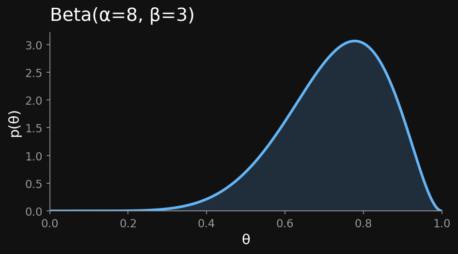
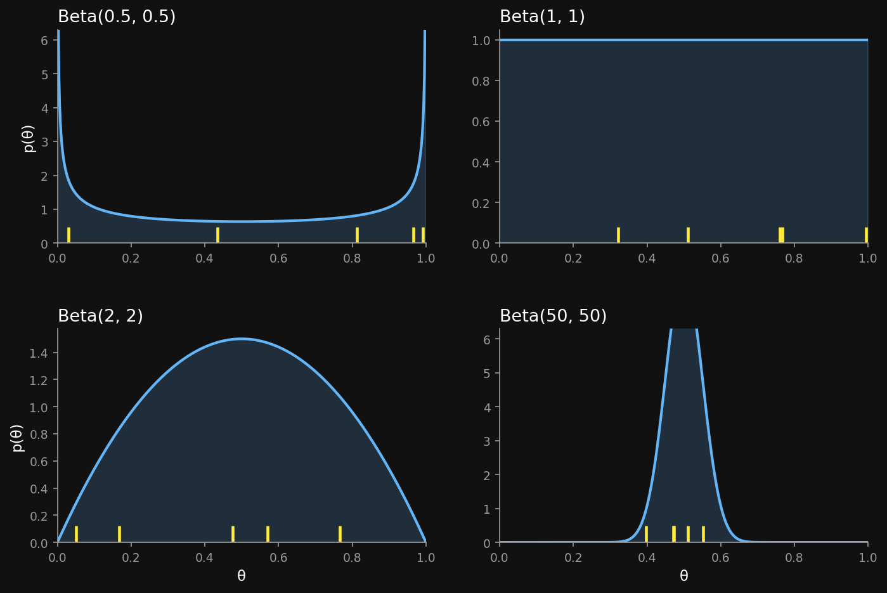
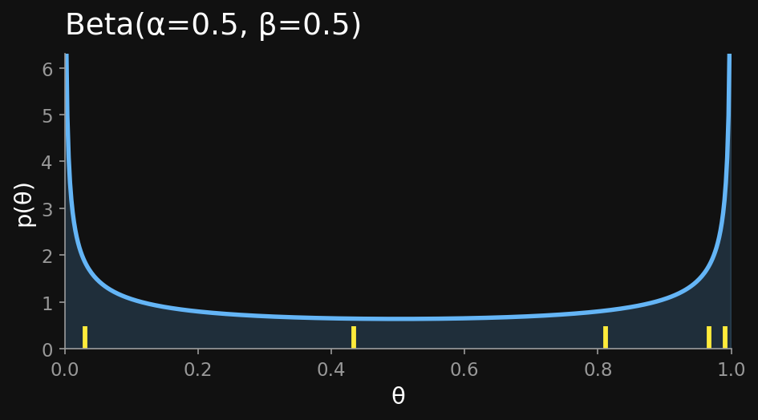
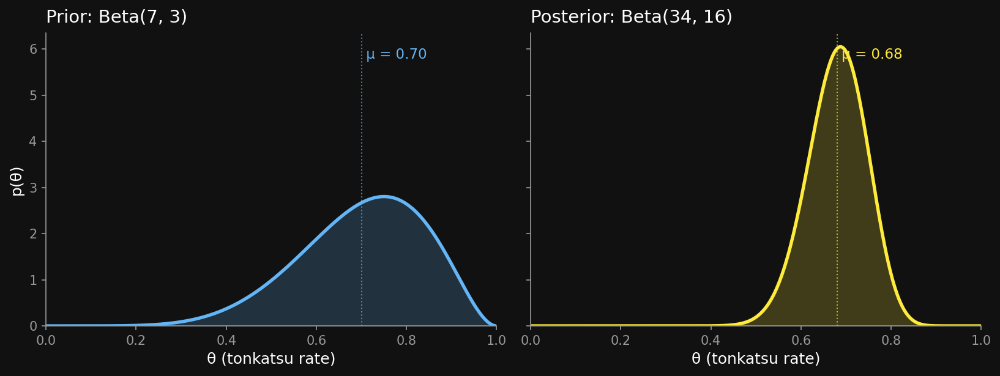
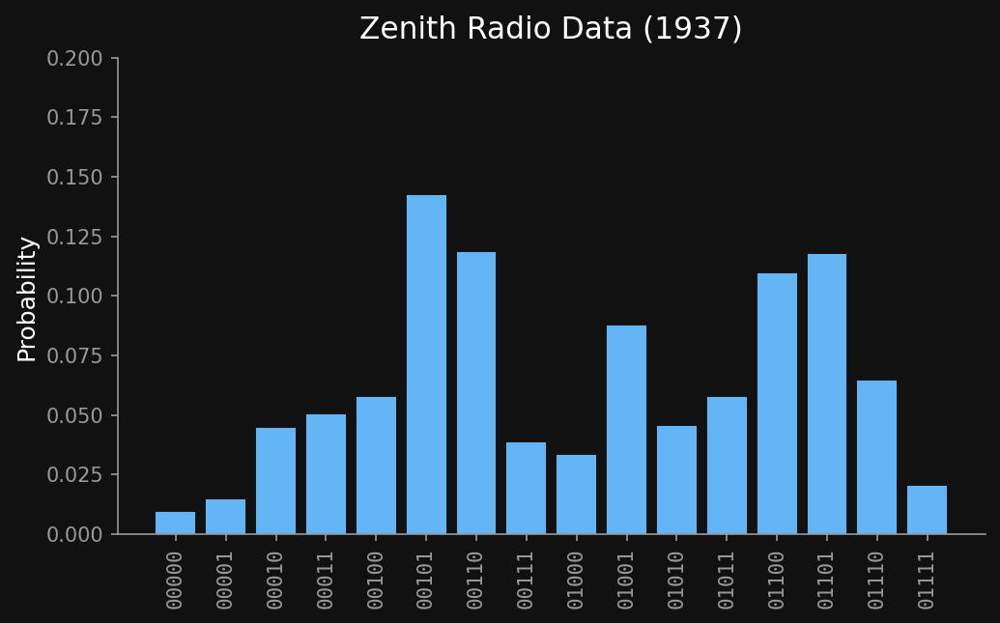
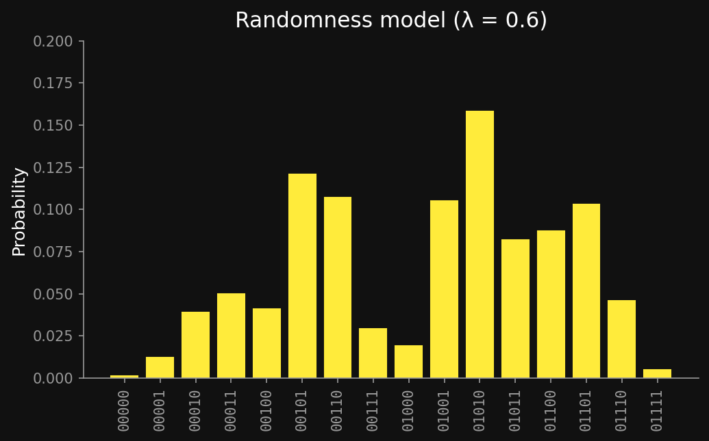

## Agenda {.agenda .dense}

- Welcome back  [0:00]{.time}
- Conjugacy as a pattern  [0:10]{.time}
- Beta-Binomial  [0:25]{.time}
- Break  [1:00]{.time}
- Gaussian-Gaussian with N observations  [1:10]{.time}
- Subjective randomness (G&T 2001)  [1:45]{.time}
- Close  [1:55]{.time}

::: {.notes}
Two-week gap since Week 2 (no class May 1 or 8). Start by acknowledging the
gap and resurfacing the Gaussian-Gaussian update from Block 7 — that's the
anchor we pivot on today. ~2 min agenda overview.
:::

## [Paper presentation assignments]{.lang-en}[論文発表の割り当て]{.lang-ja} {.section-break background-image="../../sds-reveal/sds_frame.png" background-size="cover"}

## [Your paper presentation slots]{.lang-en}[論文発表のスケジュール]{.lang-ja}

| Week | Presenter | Paper |
|---|---|---|
| **4** | **Shohei** | Tenenbaum & Xu (2000), *Word learning as Bayesian inference* |
| **11** | **Imai** | Mikolov et al. (2013), *Efficient estimation of word representations in vector space* (word2vec) |
| **12** | **Tenzin** | Miller, Raine & Groh (2023), *AI hyperrealism: why AI faces are perceived as more real than human ones* |

::: {.notes}
~1 min. Brief announcement — names + papers + which week. Don't get into
the content of any paper yet; just confirm the schedule. If anyone wants
to swap weeks, tell them to DM right after class.
:::

## [How the presentation works]{.lang-en}[発表のやり方]{.lang-ja}

::: {.lang-en}
- **~15 min talk** + **5–10 min discussion** that you facilitate
- Focus: **how the math connects to cognitive science**, and the authors' evidence
- Papers have more than fits in 15 min — pick the 2–3 ideas that matter most
- End with **at least 3 discussion questions**
- **Worth 7.5%** of your grade
- [**If you're concerned about your presentation, DM me for a 1-on-1**]{.yellow} (at least one week before your slot) — we'll plan what to focus on and what to skip
:::

::: {.lang-ja}
- **約15分の発表** + **5〜10分のディスカッション**（自分で進行）
- 焦点: **数式モデルと認知科学の繋がり**、著者が示した証拠
- 論文は15分に収まらない — 最も重要な2〜3点を選ぶ
- 最後に**3つ以上のディスカッション質問**
- 成績の**7.5%**
- [**発表に不安があれば、DMで1対1ミーティングを**]{.yellow}（発表の少なくとも1週間前まで） — 何に焦点を当てるか、何を飛ばすかを相談
:::

::: {.notes}
~1.5 min. Emphasize the 1-on-1 — it's the safety net for students who are
nervous about presenting. Don't read the full grading rubric here; the
guidelines page has it.
:::

## [Framing — six questions to organize your talk]{.lang-en}[構成 — 発表を組み立てる6つの問い]{.lang-ja}

::: {.lang-en}
*(Adapted from Tom Griffiths. Also good for reading ANY paper in this course.)*

1. **What is the cognitive science question** the paper explores?
2. **What is the context?** What previous approaches have been tried?
3. **What is the underlying computational problem?** How is it formulated?
4. **What is the solution?** Core mathematical ideas — intuition over rigor.
5. **How does the solution connect to human behavior?**
6. **What can we conclude?** Your own interpretation.
:::

::: {.lang-ja}
*(Tom Griffithsから。本コースで論文を読むときにも有用。)*

1. 論文が探る**認知科学の問い**は何か?
2. **文脈**は? これまでどんなアプローチが試みられてきたか?
3. 背後にある**計算的問題**は? どう定式化されているか?
4. **解法**は? 中核となる数式 — 厳密さよりも直観で。
5. 解法は**人間の行動とどう繋がるか**?
6. **何が結論できるか**? 自分自身の解釈。
:::

[Full rubric + tips · 完全な評価基準: [hml.chibatech.dev/presentation-guidelines.html](https://hml.chibatech.dev/presentation-guidelines.html)]{.accent}

::: {.notes}
~30s. Don't read the questions aloud — point at them, say "these are the
six you should organize around, they're on the guidelines page." Move on.
Total announcements block target: 3 minutes. Then transition to conjugacy.
:::

## [Conjugacy as a pattern]{.lang-en}[パターンとしての共役性]{.lang-ja} {.section-break background-image="../../sds-reveal/sds_frame.png" background-size="cover"}

::: {.notes}
Block 1 — the framing move. Show that Week 2's Gaussian × Gaussian = Gaussian
wasn't a coincidence. When the prior and likelihood pair up a certain way, the
posterior stays in the prior's family. That's the whole point of this week.
:::

## [The move we saw in Week 2]{.lang-en}[第2週で見た動き]{.lang-ja} {.bigger}

::: {.lang-en}
[Prior:]{.accent} $\mu \sim N(500, 20^2)$

[Likelihood:]{.accent} observation $D = 510$, known $\sigma = 30$

[Posterior:]{.accent} $\mu \mid D \sim N(503.3, 16.6^2)$

 

[**Notice:** prior is Gaussian → posterior is Gaussian. Same family.]{.yellow}
:::

::: {.lang-ja}
[事前分布:]{.accent} $\mu \sim N(500, 20^2)$

[尤度:]{.accent} 観測 $D = 510$、既知 $\sigma = 30$

[事後分布:]{.accent} $\mu \mid D \sim N(503.3, 16.6^2)$

 

[**注目:** 事前がガウス → 事後もガウス。同じ族。]{.yellow}
:::

::: {.notes}
Quick recall. Spend 30s on this slide. The key observation isn't the numbers,
it's the closure property. If students groan, remind them: this is exactly
what we computed at the end of Week 2.
:::

## [What "conjugate" means — in words]{.lang-en}[「共役」とは — 言葉で]{.lang-ja} {.bigger}

::: {.lang-en}
**Conjugate** = the posterior stays in the *same family* as the prior.

[Gaussian prior + Gaussian likelihood → Gaussian posterior.]{.accent}

Different parameters, same shape of distribution.

 

[We just saw it once. The next question: is this lucky, or a pattern?]{.dim}
:::

::: {.lang-ja}
**共役** = 事後が事前と*同じ族*にとどまる。

[ガウス事前 + ガウス尤度 → ガウス事後。]{.accent}

パラメータは異なるが、分布の形は同じ。

 

[一度見た。次の問い: これは幸運か、パターンか?]{.dim}
:::

::: {.notes}
Plain-language landing first. "Family" is the new concept; "same family" is
the load-bearing phrase. Don't show the formal symbols yet.
:::

## [What "conjugate" means — formally]{.lang-en}[「共役」とは — 形式的に]{.lang-ja}

::: {.lang-en}
A prior family $\mathcal{F}$ is **conjugate to a likelihood** $p(D \mid \theta)$
when the posterior stays in $\mathcal{F}$ (same functional form, updated params):
:::

::: {.lang-ja}
事前分布の族 $\mathcal{F}$ が尤度 $p(D \mid \theta)$ に**共役**とは、事後が
再び $\mathcal{F}$ に属する (同じ関数形、パラメータだけ更新) こと:
:::

$$
p(\theta) \in \mathcal{F} \;\; \Longrightarrow \;\; p(\theta \mid D) \in \mathcal{F}
$$

::: {.lang-en}
[The likelihood typically lives in a *different* family — e.g. **Beta** prior + **Binomial** likelihood → Beta posterior. Conjugacy is a property of the *pair* (prior family, likelihood).]{.dim}

[Last week's Gaussian-Gaussian was the special case where both happened to be in the same family — not the general rule.]{.dim}
:::

::: {.lang-ja}
[尤度は通常*別の*族 — 例: **ベータ**事前 + **二項**尤度 → ベータ事後。共役性は (事前族, 尤度) の*組*の性質。]{.dim}

[先週のガウス-ガウスは両者が同じ族だった特殊例 — 一般則ではない。]{.dim}
:::

::: {.notes}
Slow down here. Three parts: (a) prior and posterior in the SAME family, (b)
the likelihood is in general a DIFFERENT family — conjugacy is a property of
the (prior family, likelihood) pair, not of the prior alone, (c) "updated
parameters" is the mechanical bit — we'll see the update rules next.
Conjugacy is closure under the Bayesian update operator. Call back to last
week's Gaussian-Gaussian explicitly: that was the unusual case where prior
and likelihood lived in the same family; today's Beta-Binomial is the more
typical pattern.
:::

## [Why conjugacy matters]{.lang-en}[共役性が重要な理由]{.lang-ja} {.midbig}

::: {.lang-en}
| Property | Why you care |
|---|---|
| Closed-form posterior | No integration, no sampling |
| Sequential updates | Today's posterior = tomorrow's prior |
| Interpretable hyperparameters | Prior knowledge as "pseudo-observations" |
| Fast, exact | Good pedagogy + fast enough to compute on the fly |
:::

::: {.lang-ja}
| 性質 | なぜ重要か |
|---|---|
| 閉形式の事後 | 積分も標本化も不要 |
| 逐次更新 | 今日の事後 = 明日の事前 |
| 解釈可能なハイパーパラメータ | 事前知識を「疑似観測」として |
| 高速・厳密 | 教育に良く、実用速度でも計算可能 |
:::

::: {.notes}
This is the "why learn conjugacy at all?" slide. In Week 7 (Monte Carlo)
we'll see what you do when conjugacy fails. For now, when it works, it's the
cleanest tool in the box.
:::

## [Beta-Binomial]{.lang-en}[ベータ-二項]{.lang-ja} {.section-break background-image="../../sds-reveal/sds_frame.png" background-size="cover"}

::: {.notes}
Block 2 — the first new conjugate pair. Frame: we already saw Gaussian-
Gaussian. Now the same pattern for a totally different likelihood (Binomial).
:::

## [Back to the bentos — but now with counts]{.lang-en}[弁当に戻る — でも今度は回数で]{.lang-ja} {.bigger}

::: {.lang-en}
Chibany's prior belief about tonkatsu rate $\theta$:

[70% tonkatsu, 30% hamburger]{.accent} — but how confident?

 

This semester's data: **27 tonkatsu out of 40 bentos**.

[What's Chibany's updated belief about $\theta$?]{.yellow}
:::

::: {.lang-ja}
チバニーのとんかつ率 $\theta$ に対する事前信念:

[とんかつ70%、ハンバーグ30%]{.accent} — でもどれくらい自信を持って?

 

今学期のデータ: **40個中27個がとんかつ**。

[$\theta$ に対するチバニーの更新後の信念は?]{.yellow}
:::

::: {.notes}
Story-frame. Last week we asked about the meal of a single bento. This week
we ask about the underlying RATE — which is a parameter, not an observation.
That shift (from meal to rate) is the conceptual payoff of this slide. We
name the rate θ (theta) consistently from here on.
:::

## [The Binomial likelihood — what you already know]{.lang-en}[二項尤度 — 既知の話]{.lang-ja} {.bigger}

::: {.lang-en}
With rate $\theta$ fixed, $n$ bentos give $k$ tonkatsus with probability:

$$
p(k \mid \theta, n) = \binom{n}{k} \, \theta^{k} (1-\theta)^{n-k}
$$

[Each bento is iid Bernoulli($\theta$). $\binom{n}{k}$ counts which $k$ of the $n$ were tonkatsu.]{.dim}
:::

::: {.lang-ja}
率 $\theta$ を固定すると、$n$ 個の弁当のうち $k$ 個がとんかつである確率:

$$
p(k \mid \theta, n) = \binom{n}{k} \, \theta^{k} (1-\theta)^{n-k}
$$

[各弁当は iid ベルヌーイ($\theta$)。$\binom{n}{k}$ は $n$ 個中どの $k$ 個がとんかつかの選び方の数。]{.dim}
:::

::: {.notes}
Anchor on what students already know from undergrad probability. Binomial
PMF is a likelihood — given a fixed θ, it gives the probability of getting
exactly k successes. Spend ~1 min here. Don't move forward until this lands
— the pivot on the next slide depends on θ being "fixed."
:::

## [Now flip your viewpoint]{.lang-en}[視点を反転させる]{.lang-ja} {.bigger}

::: {.lang-en}
What if we fix $k$ and $n$ (we *saw* them) and ask: which $\theta$ made these data likely?

$$
\underbrace{\theta^{k}(1-\theta)^{n-k}}_{\text{a function of } \theta}
$$

[Same expression — now read as a curve over $\theta \in [0,1]$. The $\binom{n}{k}$ drops out: it doesn't depend on $\theta$.]{.accent}
:::

::: {.lang-ja}
$k$ と $n$ を固定して（観測したから）、「どの $\theta$ がこのデータを起こりやすくしたか?」と問うたら?

$$
\underbrace{\theta^{k}(1-\theta)^{n-k}}_{\theta \text{ の関数}}
$$

[同じ式 — でも今度は $\theta \in [0,1]$ 上の曲線として読む。$\binom{n}{k}$ は $\theta$ に依らないので落ちる。]{.accent}
:::

::: {.notes}
The pivot. Same algebraic expression, two different readings:
  - Fix θ, vary k: discrete probability mass function (last slide).
  - Fix k, vary θ: a CURVE over θ. Not a probability (doesn't integrate to 1),
    but the shape encodes which θ values are compatible with the data.
This is the foreshadowing of "likelihood as a function of the parameter." It's
the move EVERY conjugacy derivation makes. Pause ~30s after the slide — give
students time to feel the flip.
:::

## [That curve has a name — Beta]{.lang-en}[その曲線には名前がある — ベータ]{.lang-ja} {.bigger}

::: {.lang-en}
Normalize $\theta^{k}(1-\theta)^{n-k}$ over $\theta \in [0,1]$ — it integrates to a constant. Call that constant $B(k+1, n-k+1)$.

$$
\text{Beta}(\theta; \, \alpha, \beta) \;\propto\; \theta^{\alpha - 1}(1-\theta)^{\beta - 1}
$$

[Setting $\alpha = k+1$, $\beta = n-k+1$ recovers exactly the likelihood-as-curve. **Beta is the family that generalizes that shape** — any $\alpha, \beta > 0$ allowed, including non-integer.]{.dim}
:::

::: {.lang-ja}
$\theta^{k}(1-\theta)^{n-k}$ を $\theta \in [0,1]$ で積分すると、ある定数になる。それを $B(k+1, n-k+1)$ とおく。

$$
\text{Beta}(\theta; \, \alpha, \beta) \;\propto\; \theta^{\alpha - 1}(1-\theta)^{\beta - 1}
$$

[$\alpha = k+1$、$\beta = n-k+1$ とおけば、ちょうど尤度曲線と一致。**ベータはその形を一般化した族** — $\alpha, \beta > 0$ なら何でもよく、非整数も可。]{.dim}
:::

::: {.notes}
The naming move. The likelihood-as-function-of-θ has a specific functional
form; that form generalizes to a 2-parameter family called Beta. The
key insight: Beta isn't dropped from the sky — it's the natural shape that
emerges from the Binomial likelihood when you flip the conditioning.

This also explains why Beta is CONJUGATE to Binomial: same functional form
in θ means prior × likelihood is also in that form. We'll see the mechanic
explicitly in a few slides.
:::

## [One Beta to start — Chibany's prior]{.lang-en}[まずは1つ — チバニーの事前]{.lang-ja} {.bigger}

{fig-align="center" width="65%"}

::: {.lang-en}
$\text{Beta}(8, 3)$: mass concentrated **above $0.5$**, peak around $0.78$. Moderate confidence — not razor-sharp, not flat.

[5 samples: $0.755, \; 0.638, \; 0.520, \; 0.748, \; 0.647$]{.dim}
:::

::: {.lang-ja}
$\text{Beta}(8, 3)$: 質量は **$0.5$ より上に集中**、ピークは $0.78$ あたり。中程度の自信 — 鋭くも平坦でもない。

[5サンプル: $0.755, \; 0.638, \; 0.520, \; 0.748, \; 0.647$]{.dim}
:::

::: {.notes}
Single-case anchor. Pick (8, 3) deliberately: it's roughly Chibany's
"70% tonkatsu, moderate confidence" prior from the bento slide, so the
picture answers a question students just asked. Both dials are non-trivial:
α > β (skew above 0.5) AND α + β = 11 (moderate width). Walk through:
  - peak shifted right because α > β
  - some width because α + β isn't huge
  - 5 samples cluster above 0.5, matching the picture
Uniform Beta(1,1) is deliberately NOT shown here because the parameters
"vanish" (exponents → 0) and you can't see how α, β shape anything. It
appears on the next slide as one of 5 cases where the parameter-shape
relationship is the focus.
:::

## [Four Betas, same mean — different shapes]{.lang-en}[4つのベータ、同じ平均 — 異なる形]{.lang-ja}

{fig-align="center" width="92%"}

::: {.lang-en}
[**All four have mean $0.5$** (because $\alpha = \beta$) — but they look completely different. The $\alpha + \beta$ dial controls **concentration**, not location.]{.yellow}
:::

::: {.lang-ja}
[**4つとも平均は $0.5$**（$\alpha = \beta$ だから） — でも見た目はまったく違う。$\alpha + \beta$ ダイヤルは**集中度**を制御、位置ではない。]{.yellow}
:::

::: {.notes}
Walk through each panel — same mean, different shape:
  - Beta(0.5, 0.5): U-shape — strong prior on extremes. (Tanaka marbles.)
  - Beta(1, 1): uniform — no information.
  - Beta(2, 2): wide, gentle center on 0.5.
  - Beta(50, 50): narrow around 0.5 — strong belief in "fair."
All four have mean = 0.5, but the SHAPE encodes wildly different beliefs.
Land the takeaway: α+β controls concentration; mean alone doesn't define a
prior. Beta(8,3) is on the previous slide as the skewed example — not
repeated here because it would dilute the same-mean-different-shape point.
:::

## [Poll — Tanaka's attic of marbles]{.lang-en}[ポール — 田中さんの屋根裏のビー玉]{.lang-ja} {.midbig}

::: {.lang-en}
Tanaka finds bags of marbles in his parents' attic. **Each bag is mostly one color** (white or black), but **overall the count is ~50/50**.

He wants to encode this in a Beta prior over $\theta$ = probability of drawing white. Which $\text{Beta}(\alpha, \beta)$?

::: {.fragment}
- **A.** $\text{Beta}(1, 1)$ — uniform, no info
- **B.** $\text{Beta}(2, 2)$ — gentle center at $0.5$
- **C.** $\text{Beta}(10, 10)$ — strong center at $0.5$
- **D.** $\text{Beta}(0.5, 0.5)$ — U-shaped at the edges
:::
:::

::: {.lang-ja}
田中さんが実家の屋根裏でビー玉の袋を見つけた。**各袋はほぼ一色**（白または黒）だが、**全体では約50/50**。

これを $\theta$ =（白を引く確率）に対するベータ事前として表したい。どの $\text{Beta}(\alpha, \beta)$ ?

::: {.fragment}
- **A.** $\text{Beta}(1, 1)$ — 一様、情報なし
- **B.** $\text{Beta}(2, 2)$ — $0.5$ にやや集中
- **C.** $\text{Beta}(10, 10)$ — $0.5$ に強く集中
- **D.** $\text{Beta}(0.5, 0.5)$ — 端でU字型
:::
:::

::: {.notes}
Adapted from SP25 quiz "Gaussian and Binomial Bayes" item ge16beaee (essay,
"marbles"). Converted to MC. The key insight: "each bag mostly one color" is
about *within-bag* concentration near 0 or 1; "overall ~50/50" is the symmetry.
A U-shaped Beta(0.5, 0.5) is the only one that captures both. Beta(2,2) and
Beta(10,10) get the symmetry but penalize the bag-level extremity — wrong.
1.5 min including discussion.
:::

## [Poll — answer]{.lang-en}[ポール — 答え]{.lang-ja}

[**D. $\text{Beta}(0.5, 0.5)$.**]{.yellow}

{fig-align="center" width="58%"}

::: {.lang-en}
U-shaped: mass piles up near $0$ and $1$ (bag-level extremity), symmetric overall. $\text{Beta}(2,2)$ and $\text{Beta}(10,10)$ are *unimodal at $0.5$* — they encode "around half white" *within a bag*, which is the opposite of what Tanaka saw.
:::

::: {.lang-ja}
U字型: $0$ と $1$ の近くに質量が集まり（袋ごとの極端さ）、全体としては対称。$\text{Beta}(2,2)$ と $\text{Beta}(10,10)$ は*$0.5$ に単峰* — 「袋の中で約半分が白」を表しており、田中さんが見たものとは逆。
:::

::: {.notes}
Make sure they see why B and C are wrong, not just why D is right. The trap is
to read "overall 50/50" and reach for the most-symmetric-around-0.5 option.
But $0.5$ refers to the marginal across bags, not within. 1 min.
:::

## [Beta-Binomial — set up the pieces]{.lang-en}[ベータ-二項 — 道具立て]{.lang-ja} {.biggerplus}

::: {.lang-en}
[Prior:]{.accent} $\theta \sim \text{Beta}(\alpha, \beta)$  →  $p(\theta) \propto \theta^{\alpha-1}(1-\theta)^{\beta-1}$

[Likelihood:]{.accent} $k$ tonkatsus in $n$ bentos  →  $p(k \mid \theta) \propto \theta^{k}(1-\theta)^{n-k}$
:::

::: {.lang-ja}
[事前:]{.accent} $\theta \sim \text{Beta}(\alpha, \beta)$  →  $p(\theta) \propto \theta^{\alpha-1}(1-\theta)^{\beta-1}$

[尤度:]{.accent} $n$ 個中 $k$ 個がとんかつ  →  $p(k \mid \theta) \propto \theta^{k}(1-\theta)^{n-k}$
:::

::: {.notes}
Symbols already established: θ = tonkatsu rate (from bento slide and
Binomial-first walkthrough). The (n choose k) binomial coefficient drops
because it doesn't involve θ — same "drop the normalizer" move from the
Jamal poll that's coming.
:::

## [Beta-Binomial — multiply and read off]{.lang-en}[ベータ-二項 — 掛けて読み取る]{.lang-ja} {.biggerplus}

[Posterior $\propto$ Prior $\times$ Likelihood:]{.accent}

$$
p(\theta \mid k) \;\propto\; \theta^{\alpha-1}(1-\theta)^{\beta-1} \cdot \theta^{k}(1-\theta)^{n-k}
$$

::: {.fragment}
$$
= \; \theta^{(\alpha + k) - 1}(1-\theta)^{(\beta + n - k) - 1}
$$
:::

::: {.fragment}
::: {.lang-en}
[Recognize this:]{.yellow} it's $\text{Beta}(\alpha + k, \; \beta + n - k)$.
:::
::: {.lang-ja}
[これは:]{.yellow} $\text{Beta}(\alpha + k, \; \beta + n - k)$。
:::
:::

::: {.notes}
The Jamal move in action. Combine exponents, recognize Beta form, read off
parameters. This is the *whole* conjugacy mechanic, exposed. Fragments build
sequentially: students see the multiplication, then the combine, then the
recognition.
:::

## [Beta-Binomial conjugate update]{.lang-en}[ベータ-二項 共役更新]{.lang-ja} {.bigger}

::: {.lang-en}
[Prior:]{.accent} $\theta \sim \text{Beta}(\alpha, \beta)$

[Data:]{.accent} $k$ successes in $n$ trials

[Posterior:]{.accent} $\theta \mid k \sim \text{Beta}(\alpha + k, \; \beta + n - k)$

 

[**Just add the counts.** Successes bump $\alpha$, failures bump $\beta$.]{.yellow}
:::

::: {.lang-ja}
[事前:]{.accent} $\theta \sim \text{Beta}(\alpha, \beta)$

[データ:]{.accent} $n$ 試行中 $k$ 成功

[事後:]{.accent} $\theta \mid k \sim \text{Beta}(\alpha + k, \; \beta + n - k)$

 

[**回数を足すだけ。** 成功は $\alpha$ に、失敗は $\beta$ に加算。]{.yellow}
:::

::: {.notes}
Summary card. After the derivation, this is the rule students should
memorize. Hyperparameters as pseudo-counts: Beta(7,3) is "as if we'd seen
7 tonkatsus and 3 hamburgers before any real data."
:::

## [Worked example — Chibany's semester]{.lang-en}[計算例 — チバニーの学期]{.lang-ja} {.smaller}

::: {.lang-en}
[Prior:]{.accent} $\theta \sim \text{Beta}(7, 3)$ — "70/30 with low confidence"   ·   [Data:]{.accent} 27 tonkatsu in 40   ·   [Posterior:]{.accent} $\text{Beta}(7+27, \; 3+13) = \text{Beta}(34, 16)$
:::

::: {.lang-ja}
[事前:]{.accent} $\theta \sim \text{Beta}(7, 3)$ — 「70/30、自信は低め」   ·   [データ:]{.accent} 40個中27個がとんかつ   ·   [事後:]{.accent} $\text{Beta}(7+27, \; 3+13) = \text{Beta}(34, 16)$
:::

{fig-align="center" width="78%"}

::: {.lang-en}
[Mean barely moved ($0.70 \to 0.68$) — but the posterior is **much sharper**. 40 observations of moderate signal added a lot of certainty.]{.yellow}
:::

::: {.lang-ja}
[平均はほとんど動かず（$0.70 \to 0.68$） — でも事後は**ずっと鋭く**なる。40個の観測で確信が大幅に強まった。]{.yellow}
:::

::: {.notes}
Play with the numbers. What if the prior were Beta(70, 30) instead of (7, 3)?
Then the 40 observations barely move the posterior. That's the prior-strength
lesson. What if we'd used Beta(1,1)? Then posterior is Beta(28, 14) ≈ 0.67 —
data dominates. This is the BIG intuition: priors act like pseudo-observations
and the data:prior ratio determines who wins.
:::

## [Break]{.lang-en}[休憩]{.lang-ja} {.section-break background-image="images/jimcalliestairs.jpg" background-size="cover" background-opacity="0.55"}

## [Resume — Gaussian-Gaussian with N observations]{.lang-en}[再開 — N観測のガウス-ガウス]{.lang-ja} {data-menu-title="Gaussian-N agenda" .biggest}

::: {.lang-en}
Agenda so far: [Beta-Binomial ✓]{.dim}

[Now: what if Chibany weighs N bentos, not one?]{.accent}
:::

::: {.lang-ja}
ここまで: [ベータ-二項 ✓]{.dim}

[次は: チバニーが1個ではなくN個の弁当を測ったら?]{.accent}
:::

::: {.notes}
2-min re-grounding after break. Surface the next conceptual move: from
one observation to many. Week 2 did one observation. Today we generalize.
:::

## [Gaussian-Gaussian — notation lock-in]{.lang-en}[ガウス-ガウス — 記号の確認]{.lang-ja} {.midbig}

::: {.lang-en}
| Symbol | What it is |
|---|---|
| $\mu_0, \sigma_0^2$ | Prior mean and variance of $\mu$ |
| $\sigma^2$ | Data noise (known, fixed) |
| $D_1, \ldots, D_N$ | $N$ iid observations |
| $\sum_i D_i$ | Sum over the $N$ observations: $D_1 + D_2 + \cdots + D_N$ |
| $\mu_N, \sigma_N^2$ | Posterior mean and variance of $\mu$ after seeing $N$ data |
:::

::: {.lang-ja}
| 記号 | 意味 |
|---|---|
| $\mu_0, \sigma_0^2$ | $\mu$ の事前の平均と分散 |
| $\sigma^2$ | データのノイズ（既知・固定） |
| $D_1, \ldots, D_N$ | $N$ 個の iid 観測 |
| $\sum_i D_i$ | $N$ 観測の和: $D_1 + D_2 + \cdots + D_N$ |
| $\mu_N, \sigma_N^2$ | $N$ データを見た後の $\mu$ の事後の平均と分散 |
:::

::: {.notes}
NEW slide added per CLAUDE.md "define at first use" rule. Σ in particular is
its first deck appearance; defining it inline before the formula slide stops
students from getting stuck on the operator instead of the conjugacy point.
The two-subscript pairs (μ_0/σ_0 prior vs μ_N/σ_N posterior) are the easiest
place to lose students — make sure they see the pattern.
:::

## [Gaussian-Gaussian — precision is additive]{.lang-en}[ガウス-ガウス — 精度は加法的]{.lang-ja}

::: {.lang-en}
[Posterior precision:]{.accent}
:::
::: {.lang-ja}
[事後の精度:]{.accent}
:::

$$
\underbrace{\frac{1}{\sigma_N^2}}_{\text{posterior}} \;=\; \underbrace{\frac{1}{\sigma_0^2}}_{\text{prior}} \;+\; \underbrace{\frac{N}{\sigma^2}}_{N \text{ data}}
$$

 

::: {.lang-en}
[**Precision = 1/variance.** Each observation adds $1/\sigma^2$ units. $N$ observations add $N/\sigma^2$.]{.yellow}

[Sanity check: at $N = 1$, this matches Week 2's single-observation case.]{.dim}
:::

::: {.lang-ja}
[**精度 = 1/分散。** 各観測が $1/\sigma^2$ 単位を加える。$N$ 観測で $N/\sigma^2$。]{.yellow}

[確認: $N = 1$ なら第2週の単一観測の式と一致。]{.dim}
:::

::: {.notes}
Isolate the precision formula. The under-braces are critical — they tell
students what each term *means* before they're asked to manipulate it. The
N=1 sanity check is the bridge back to Week 2's worked example.
:::

## [Gaussian-Gaussian — posterior mean]{.lang-en}[ガウス-ガウス — 事後平均]{.lang-ja} {.bigger}

$$
\mu_N \;=\; \sigma_N^2 \left( \underbrace{\frac{\mu_0}{\sigma_0^2}}_{\text{prior precision} \times \text{prior mean}} \;+\; \underbrace{\frac{\sum_i D_i}{\sigma^2}}_{\text{data precision} \times \text{data sum}} \right)
$$

 

::: {.lang-en}
[$\mu_N$ is a **precision-weighted average** of the prior mean and the data sum. Whoever has more precision wins.]{.accent}
:::

::: {.lang-ja}
[$\mu_N$ は事前平均とデータ和の**精度重み付き平均**。精度の大きい方が勝つ。]{.accent}
:::

::: {.notes}
Final piece. Show this *after* precision is internalized, not before — the
formula is intimidating until students know that 1/σ² is "precision."
:::

## [Poll — Jamal's shortcut]{.lang-en}[ポール — ジャマルの近道]{.lang-ja}

::: {.lang-en}
While deriving a posterior over $\mu$, Jamal notices the non-constant terms (w.r.t. $\mu$) **have the form of a Gaussian**. He drops everything else and concludes the posterior is Gaussian with parameters read off the surviving form. Is he correct?

::: {.fragment}
- **A.** Yes — the dropped terms are absorbed into the normalization constant
- **B.** Yes — you can drop any term, even those involving $\mu$
- **C.** No — he dropped some terms that involve $\mu$
- **D.** Only if he later multiplies his answer by the dropped terms
:::
:::

::: {.lang-ja}
$\mu$ の事後を導出中、ジャマルは（$\mu$ に関する）非定数項が **ガウスの形をしている** ことに気づいた。残りを全て落とし、残った形からパラメータを読み取って事後をガウスと結論した。正しい?

::: {.fragment}
- **A.** はい — 落とした項は正規化定数に吸収される
- **B.** はい — $\mu$ を含む項でさえ落としてよい
- **C.** いいえ — $\mu$ を含む項を落としてしまった
- **D.** 後で落とした項を掛け直す場合のみ
:::
:::

::: {.notes}
SP25 "Gaussian and Binomial Bayes" item g5f90d4e (the only MC item in that
quiz). This is THE canonical conjugacy move — "drop terms that don't involve
the variable of interest, recognize the surviving functional form, read off
parameters." It's exactly what the Gaussian-N derivation hides behind that
"complete the square" step. 1.5 min.
:::

## [Poll — answer]{.lang-en}[ポール — 答え]{.lang-ja} {.bigger}

[**A. Yes — the dropped terms are part of the normalization constant.**]{.yellow}

::: {.lang-en}
A posterior is a probability density in $\mu$. Anything not depending on $\mu$ is a multiplicative constant — absorbed into $Z = \int p(\mu \mid D)\, d\mu$.

[Recognize the functional form → read off parameters → normalization handles itself.]{.accent}
:::

::: {.lang-ja}
事後分布は $\mu$ についての確率密度。$\mu$ に依存しないものは乗法的な定数で、$Z = \int p(\mu \mid D)\, d\mu$ に吸収される。

[関数形を認識 → パラメータを読み取る → 正規化は勝手に処理される。]{.accent}
:::

::: {.notes}
This is the rhetorical move every conjugacy derivation makes. Anchor it now;
they'll reuse it for Beta-Binomial (drop the binomial coefficient and the
B(α,β) normalizer) and Dirichlet-Multinomial. 30s.
:::

## [Sequential updating — same rule, no new math]{.lang-en}[逐次更新 — 同じ規則、新しい計算なし]{.lang-ja}

::: {.lang-en}
Observations arrive one at a time. Posterior after $k$ observations becomes
prior for observation $k+1$.
:::

::: {.lang-ja}
観測が1個ずつ到着。$k$ 観測後の事後が、$k+1$ 番目の観測の事前になる。
:::

$$
\text{Beta}(34, 16) \xrightarrow[+1 \text{ hamb}]{\text{see 1 more}} \text{Beta}(34, 17)
$$

$$
N(503.3, 16.6^2) \xrightarrow[D = 498]{\text{see 1 more}} N(502.2, 14.5^2)
$$

 

::: {.lang-en}
[This is why conjugacy is useful in practice: online updates, no re-fit.]{.dim}
:::

::: {.lang-ja}
[これが実用上の共役性の利点: オンライン更新、再学習不要。]{.dim}
:::

::: {.notes}
Forward-pointer to future weeks. In Week 7 we'll see what happens when you
CAN'T keep the posterior in the family — you have to sample. Today's happy
story is the exception, not the rule, but it's the one we can reason about
exactly.
:::

## [Three conjugate pairs, one pattern]{.lang-en}[3つの共役対、1つのパターン]{.lang-ja} {.bigger}

::: {.lang-en}
| Prior | Likelihood | Posterior |
|---|---|---|
| $\text{Beta}(\alpha, \beta)$ | Binomial$(n, p)$ | $\text{Beta}(\alpha + k, \beta + n - k)$ |
| $\text{Dirichlet}(\vec{\alpha})$ | Multinomial$(n, \vec{p})$ | $\text{Dirichlet}(\vec{\alpha} + \vec{k})$ |
| $N(\mu_0, \sigma_0^2)$ | $N(\mu, \sigma^2)$ | $N(\mu_N, \sigma_N^2)$ |

[Row 2 is the multi-category generalization: $\vec{\alpha} = (\alpha_1, \ldots, \alpha_K)$, $\vec{k} = (k_1, \ldots, k_K)$. Same "add the counts" rule.]{.dim}
:::

::: {.lang-ja}
| 事前 | 尤度 | 事後 |
|---|---|---|
| $\text{Beta}(\alpha, \beta)$ | Binomial$(n, p)$ | $\text{Beta}(\alpha + k, \beta + n - k)$ |
| $\text{Dirichlet}(\vec{\alpha})$ | Multinomial$(n, \vec{p})$ | $\text{Dirichlet}(\vec{\alpha} + \vec{k})$ |
| $N(\mu_0, \sigma_0^2)$ | $N(\mu, \sigma^2)$ | $N(\mu_N, \sigma_N^2)$ |

[2行目は多カテゴリへの一般化: $\vec{\alpha} = (\alpha_1, \ldots, \alpha_K)$、$\vec{k} = (k_1, \ldots, k_K)$。同じ「回数を足す」規則。]{.dim}
:::

::: {.notes}
Punchline table. Row 2 (Dirichlet-Multinomial) now arrives WITHOUT a dedicated
intro slide — students see the pattern from the table alone. The dim caption
defines the vector notation since it's the only place \vec{α} appears.
:::

## [Stretch question — pushing the pattern]{.lang-en}[ストレッチ問題 — パターンを押し広げる]{.lang-ja}

::: {.lang-en}
Three pairs all worked. But how strict is the "same family" rule?

[Prior on $\mu$:]{.accent} **bimodal** (mixture of two Gaussians)

[Likelihood:]{.accent} Gaussian

[Posterior?]{.yellow}

::: {.fragment}
- **A.** Gaussian (likelihood dominates)
- **B.** Bimodal Gaussian mixture
- **C.** Uniform (prior × likelihood cancels)
- **D.** Not closed-form — needs numerics
:::
:::

::: {.lang-ja}
3つの対はうまくいった。では「同じ族」というルールはどれくらい厳密か?

[$\mu$ の事前:]{.accent} **二峰性**（2つのガウスの混合）

[尤度:]{.accent} ガウス

[事後は?]{.yellow}

::: {.fragment}
- **A.** ガウス（尤度が支配）
- **B.** 二峰性のガウス混合
- **C.** 一様（事前と尤度が相殺）
- **D.** 閉形式でない — 数値計算が必要
:::
:::

::: {.notes}
Stretch poll, placed here on purpose — students have now seen all three
canonical conjugate pairs, so the meta-question "is the (prior, likelihood)
family bond strict or generalizable?" lands as an extension, not a sandbag.
Mixture models proper are deferred to a later week; this poll is a teaser.
Commit-before-reveal as usual. ~1 min.
:::

## [Stretch question — answer]{.lang-en}[ストレッチ問題 — 答え]{.lang-ja}

::: {.lang-en}
[**B and D are both defensible — depending on what "family" means.**]{.yellow}

- [**D (strict):**]{.accent} the posterior isn't a single Gaussian, so we left the Gaussian family. Conjugacy *to Gaussians* fails.
- [**B (generalized):**]{.accent} components update independently, weights re-balance — still closed-form. The richer "mixture of Gaussians" family IS conjugate.

[Lesson: conjugacy is a property of the *(prior family, likelihood) pair*, not the prior alone.]{.dim}
:::

::: {.lang-ja}
[**BとDのどちらも妥当 — 「族」の意味次第。**]{.yellow}

- [**D (厳密):**]{.accent} 事後は単一のガウスでない。「ガウス族への共役」は破綻。
- [**B (一般化):**]{.accent} 成分は独立に更新、重みが再調整 — 依然として閉形式。「ガウスの混合」というより広い族は共役。

[教訓: 共役性は*（事前族、尤度）の対*の性質、事前単体ではない。]{.dim}
:::

::: {.notes}
Land the nuance. Validate either answer — D reads the question rigorously
under the textbook definition; B generalizes correctly. The takeaway is the
same: conjugacy is a property of the pair, not the prior alone. Mixtures of
conjugate priors get their own treatment in a later mixture-modeling week. ~1 min.
:::

## [Subjective randomness — a Bayesian story]{.lang-en}[主観的ランダム性 — ベイズ的物語]{.lang-ja} {.section-break background-image="../../sds-reveal/sds_frame.png" background-size="cover"}

## [Which feels more random?]{.lang-en}[どちらがよりランダムに感じる?]{.lang-ja} {.bigger}

 

$$
\text{(a)} \quad \mathtt{H \; H \; T \; H \; T \; T \; T \; H}
$$

 

$$
\text{(b)} \quad \mathtt{H \; H \; H \; H \; H \; H \; H \; H}
$$

::: {.notes}
~30 seconds. SHOW. Don't tell. Read the two sequences out loud. Ask the
class — gestures, voting by hand, whatever. Wait for the answer to land
naturally; almost everyone will say (a). Don't say anything else yet —
the paradox lands harder if students have *already committed* to "(a) is
more random" before they see the next slide reveal that both sequences
have identical probability. Goal of this slide: get them to feel the
asymmetry, not analyze it.
:::

## [Why does HHTHTTTH look "more random" than HHHHHHHH?]{.lang-en}[なぜHHTHTTTHはHHHHHHHHより「ランダム」に見えるのか?]{.lang-ja}

::: {.lang-en}
Both sequences have the same probability under a fair coin: $(1/2)^8 = 1/256$.

So why do people consistently say the first is "more random"?

 

[**Griffiths & Tenenbaum (2001):**]{.accent} a single likelihood $P(x \mid \text{random})$ can't *decide* anything by itself — you need at least two hypotheses to compare. "Is $x$ random?" only has an answer if you also ask "*compared to what?*" — e.g. "or did some regularity in the world produce $x$?"
:::

::: {.lang-ja}
両方とも公正なコインで同じ確率: $(1/2)^8 = 1/256$。

なぜ人は一貫して前者を「よりランダム」と言うのか?

 

[**Griffiths & Tenenbaum (2001):**]{.accent} 単一の尤度 $P(x \mid \text{random})$ だけでは何も*判断*できない — 比較する仮説が少なくとも2つ必要。「$x$ はランダムか?」に答えるには「*何と比べて?*」も問わなければならない — 例: 「それとも世界の何らかの規則性が $x$ を生んだのか?」
:::

::: {.notes}
~2 min hook. Open with the actual classic example. The probability-equivalence
fact is the hook: students who've taken any stats class know both sequences
have the same probability, but the intuition that one is "more random" is
unshakeable. The paper's move is to take that intuition seriously and ask:
what BAYESIAN question is the mind actually answering?
:::

## [The reframe — likelihood ratio, not likelihood]{.lang-en}[再構築 — 尤度ではなく尤度比]{.lang-ja}

::: {.lang-en}
Not [$P(x \mid \text{random})$]{.dim}.   Instead, [$P(x \mid \text{random})$ vs. $P(x \mid \text{regular})$]{.accent}.
:::

::: {.lang-ja}
[$P(x \mid \text{random})$]{.dim} ではなく、[$P(x \mid \text{random})$ vs. $P(x \mid \text{regular})$]{.accent}。
:::

 

::: {.r-fit-text}
$$
\text{subjective randomness}(x) \;=\; \log \frac{P(x \mid \text{random})}{P(x \mid \text{regular})}
$$
:::

 

::: {.lang-en}
[A **likelihood ratio.** Uniform prior over the two hypotheses → this *is* the posterior odds.]{.yellow}
:::

::: {.lang-ja}
[**尤度比。** 2つの仮説に一様な事前 → これがそのまま事後オッズ。]{.yellow}
:::

::: {.notes}
~3 min. The pivot. This is where today's conjugacy machinery pays off — the
"drop the normalizer, recognize the form" move from the Jamal poll is
EXACTLY what this paper does. P(random|x) / P(regular|x) is a posterior odds;
by Bayes' rule it factors into prior odds × likelihood ratio. Under equal
priors over "random" vs "regular," it IS the likelihood ratio.

What competes with "random" depends on the stimulus — for binary sequences,
"regular" = local representativeness (~50/50 in each subsequence). For
numbers, it's features like "prime" or "ends in 7." The regularity space is
the modeling commitment, and arguably the paper's weakest spot — flag
verbally if students are interested but don't crowd the slide with it.
:::

## [The model — local representativeness]{.lang-en}[モデル — 局所代表性]{.lang-ja}

::: {.lang-en}
At step $k$, count heads $H_i$ and tails $T_i$ in the suffix going back $i$ steps. Score how much choosing **H** vs **T** at step $k$ keeps the suffixes balanced:
:::

::: {.lang-ja}
ステップ $k$ で、$i$ ステップ前まで遡る部分系列の表 $H_i$ と裏 $T_i$ を数える。ステップ $k$ で **H** と **T** のどちらを選ぶと部分系列のバランスが保たれるかを採点:
:::

$$
L_k \;=\; \sum_{i=1}^{k-1} \log \frac{P(\,H_i + 1,\; T_i \mid \text{random}\,)}{P(\,H_i,\; T_i + 1 \mid \text{random}\,)}
$$

::: {.lang-en}
[Then $P(R_k = \text{H}) = \sigma(\lambda L_k)$, where $\sigma(z) = \dfrac{1}{1 + e^{-z}}$ squashes any real number into $[0, 1]$.]{.dim}

[**A long run of H's drives $L_k$ negative** (every suffix already looks H-heavy), so the model strongly prefers T next — no free "switch preference" parameter needed.]{.yellow}
:::

::: {.lang-ja}
[次に $P(R_k = \text{H}) = \sigma(\lambda L_k)$、ここで $\sigma(z) = \dfrac{1}{1 + e^{-z}}$ は任意の実数を $[0, 1]$ に押し込む関数。]{.dim}

[**Hの連続が長いと $L_k$ が負に振れる**（どの部分系列もすでにH偏重）ので、モデルは次にTを強く好む — 自由な「切替選好」パラメータ不要。]{.yellow}
:::

::: {.notes}
~3-4 min. The model spec. This slide has more notation than usual — slow down.

WHAT σ MEANS HERE (the load-bearing notation explanation):

σ is the LOGISTIC function (also called the sigmoid). Three facts to convey:

  (a) Definition: σ(z) = 1 / (1 + e^(-z)). On the board, draw the S-curve:
      it passes through (0, 0.5), asymptotes to 0 as z → -∞ and to 1 as
      z → +∞. The curve is monotonically increasing.

  (b) What it does FOR US: L_k is a real number — it can be any value
      from -∞ to +∞. But we need a PROBABILITY for the response. The
      logistic squashes the real line into [0, 1] so the output is a
      valid probability. σ(0) = 0.5 ("indifferent → pick H half the
      time"), σ(large positive) → 1 ("very strongly prefer H"),
      σ(large negative) → 0 ("very strongly prefer T").

  (c) NOTATION WARNING — σ is overloaded. In Weeks 2-3 we used σ for the
      standard deviation of a Gaussian (e.g. σ², σ²₀ in the Gaussian-
      Gaussian update). HERE σ is a FUNCTION, not a variance. Same Greek
      letter, totally different meaning. The argument tells you which:
      σ(z) with parentheses = logistic function; σ alone = std dev. Flag
      this to the class verbally — it's the kind of notation collision
      that trips up careful students.

  (d) λ is INSIDE σ. λ multiplies L_k before squashing. Bigger λ →
      σ steepens around 0 → small differences in L_k become large
      differences in probability. λ → 0 → σ(0) = 0.5 always, model becomes
      indifferent. λ → ∞ → step function, model is deterministic. G&T
      fit λ ≈ 0.6 — moderately strong but not deterministic.

KEY CONCEPTUAL MOVES TO LAND (beyond σ):
1. The model is SEQUENTIAL — each response depends on what came before.
2. "Local representativeness" = each suffix subsequence should look ~50/50.
3. L_k is a SUM of log-likelihood-ratios over different suffix lengths
   (this is exactly the conjugacy "drop the normalizer, recognize the form"
   move applied across multiple Bernoulli likelihoods).
4. The logistic transform converts L_k into a response probability.
5. λ is the model's ONE free parameter. G&T fit λ ≈ 0.6 to Zenith data.

Importantly: the model has NO free "switch preference" parameter. The
switching bias is an EMERGENT property of computing the likelihood ratio.
That's the difference between description and explanation.

If students push back on σ: just draw it. The S-curve is a 30-second
sketch and once they see "any real number in, a probability out" it
becomes intuitive. Don't get stuck deriving why this particular function
— other squashing functions exist; G&T just picked the logistic because
it's smooth and analytically convenient.
:::

## [Zenith radio data — the binary sequence experiment]{.lang-en}[Zenithラジオデータ — 2値系列実験]{.lang-ja} {.smaller}

::: {.lang-en}
1937 publicity stunt: Zenith broadcast 5 H/T sequences via radio, asked **20,099 listeners** to "transmit" their guesses via ESP. Sequences collapsed to 16 length-5 patterns (initial choice ignored).
:::

::: {.lang-ja}
1937年の宣伝企画: ZenithがH/T系列5つをラジオで放送し、**20,099人**のリスナーにESPで「送信」してもらった。長さ5の16パターンに集約（最初の選択は無視）。
:::

::: {.columns}
::: {.column width="50%"}
{fig-align="center"}
:::
::: {.column width="50%"}
{fig-align="center"}
:::
:::

::: {.lang-en}
[**$\lambda = 0.6$ fits with $r = 0.95$.** The bias toward sequences like `01010` falls out of the math — no free "switch preference" knob.]{.yellow}
:::

::: {.lang-ja}
[**$\lambda = 0.6$ で当てはまり $r = 0.95$。** `01010` のような系列への偏りは数式から導かれる — 自由な「切替選好」パラメータなし。]{.yellow}
:::

::: {.notes}
~3 min. This is the empirical landing. The Zenith experiment is wonderful
because it predates the cognitive-science framing by decades — pure
behavioral data. G&T's model FITS it without tuning a "switch preference"
parameter; the bias is an emergent property of computing the Bayes factor.
That's the difference between a descriptive model and an explanatory one.
:::

## [The takeaway for today's class]{.lang-en}[今日の授業のまとめ]{.lang-ja}

::: {.lang-en}
- The "mistake" in subjective randomness is **not** that people are bad at probability.
- They're computing $\log P(x \mid \text{random}) / P(x \mid \text{regular})$ — a perfectly Bayesian quantity.
- Today's conjugate-update mechanics ("drop the normalizer, recognize the form") are *exactly* the operation behind this model.

 

[**Open question:** is human cognition Bayesian-by-default, or just Bayesian-when-tractable?]{.accent}
:::

::: {.lang-ja}
- 主観的ランダムさの「誤り」は、人が確率に弱いということ**ではない**。
- 人は $\log P(x \mid \text{random}) / P(x \mid \text{regular})$ — 完全にベイズ的な量 — を計算している。
- 今日の共役更新の操作（「正規化を落として形を認識」）が、まさにこのモデルの背後にある操作。

 

[**開かれた問い:** 人の認知はデフォルトでベイズ的か、それとも扱える時だけベイズ的か?]{.accent}
:::

::: {.notes}
~3 min including discussion. Land two points: (a) the methodological move
(reframe the question, don't blame the participant); (b) the technical link
to today's content (the likelihood-ratio computation IS conjugacy mechanics
applied to a binary discrimination problem). The open question is the
forward-pointer to Weeks 11-13 on contemporary cognitive ML.

Source: archive/canvas_export_sp25/web_resources/old_paper_presents/
GriffithsTenenbaum2001.pptx — restructured around the conjugacy connection
rather than the SP25 student's original ordering. Paper PDF at
resources/readings/Griffiths2001random.pdf.
:::

::: {.notes}
Punchline table. The POINT of this week: conjugacy isn't one trick. It's
a recurring pattern. Mixture models (later weeks) and hierarchical Bayes
(Week 4) lean on these closed forms.
:::

## [Close]{.lang-en}[まとめ]{.lang-ja} {.section-break background-image="../../sds-reveal/sds_frame.png" background-size="cover"}

## [Next week — Week 4 preview]{.lang-en}[来週 — 第4週のプレビュー]{.lang-ja} {.bigger}

::: {.lang-en}
Ira leads. **Hierarchical Bayes.**

Chibany's bento rate isn't the same across every semester, but semesters
aren't totally independent either. How do we share information without
collapsing?

 

[Read T3 Ch 5 before class.]{.accent}
:::

::: {.lang-ja}
イラが進行。**階層ベイズ。**

チバニーの弁当率は学期ごとに同じではないが、学期同士が完全に独立でもない。
潰さずに情報をどう共有する?

 

[授業前にT3 第5章を読むこと。]{.accent}
:::

::: {.notes}
~2 min close. Thank students for sitting through the math-heavy day. Set up
the hierarchical story as "one level up from what we did today." See you
next Friday.
:::
