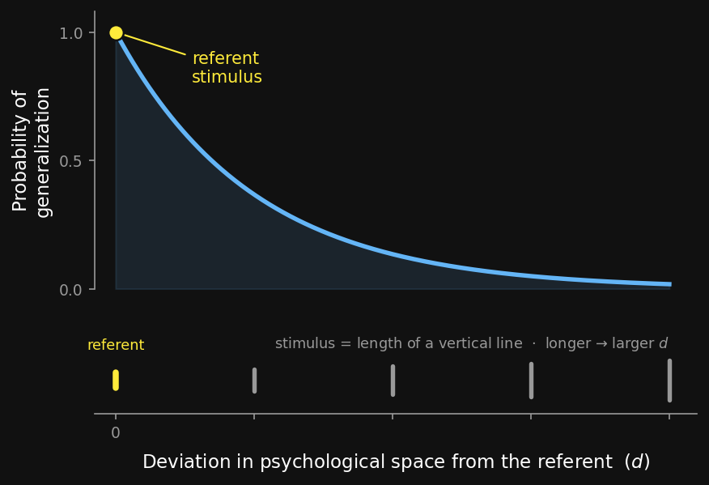
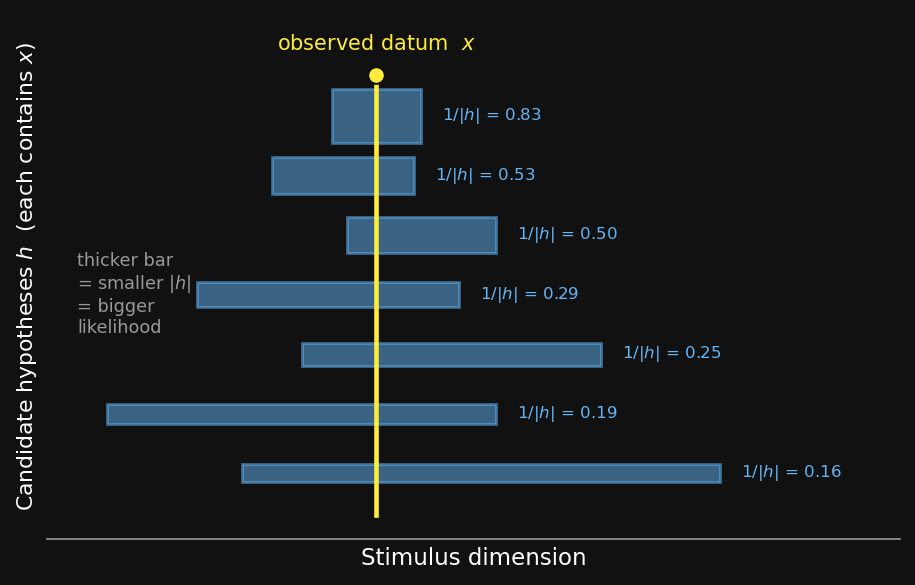
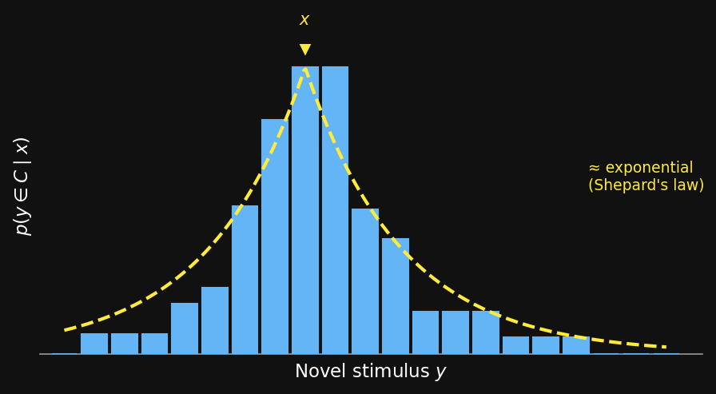

## Agenda {.agenda .dense}

- Welcome + Clusters walkthrough  [0:00]{.time}
- The generalization problem  [0:10]{.time}
- The Bayesian generalization framework + size principle  [0:18]{.time}
- Rectangle game + number game  [0:40]{.time}
- Break  [1:08]{.time}
- Student presentation — Shohei  [1:15]{.time}
- No Free Lunch  [1:40]{.time}
- Hierarchical Bayes + close  [1:50]{.time}

::: {.notes}
~2 min agenda overview. Today's spine: one framework, shown twice — once on
continuous concepts (the rectangle game), once on discrete concepts (the number
game). Everything before the break is core; the back half is Shohei's paper
plus the No-Free-Lunch capstone and a hierarchical-Bayes look-ahead. Tell them
the order matters: the size principle in Block 4 is the engine for both games.
:::

## [Assignment 1 — Clusters]{.lang-en}[課題1 — クラスタ]{.lang-ja} {.section-break background-image="../../sds-reveal/sds_frame.png" background-size="cover"}

::: {.notes}
Block 1, second half. This is a TOUR of the stencil — not a re-derivation of
Week 3's math. Hard cap 8 minutes; if questions run long, push them to office
hours / DM and move into the generalization content. The core lecture cannot
start late.
:::

## [Clusters — what and when]{.lang-en}[クラスタ — 内容と期限]{.lang-ja} {.bigger}

::: {.lang-en}
[**Assignment 1: Gaussians, Categories, and Clusters**]{.accent}

- Due [**Fri Jun 5, 2026, 8:00 PM**]{.yellow} — worth **7.5%**
- **Problem 1** — Gaussian-Gaussian conjugate model → *you can do this today* (it's Week 3 material)
- **Problem 2** — Gaussian mixture / categorization → Bayes' rule over two category Gaussians
- **Problem 3** — clustering → leans on this week + T3 Ch 5
:::

::: {.lang-ja}
[**課題1：ガウス分布、カテゴリ、クラスタ**]{.accent}

- 提出期限 [**2026年6月5日（金）20:00**]{.yellow} — 配点 **7.5%**
- **問題1** — ガウス-ガウス共役モデル → *今日できる*（第3週の内容）
- **問題2** — ガウス混合 / カテゴリ化 → 2つのカテゴリのガウス分布へのベイズの定理
- **問題3** — クラスタリング → 今週の内容 + T3 第5章が必要
:::

::: {.notes}
Read the date out loud — Fri Jun 5, 8 PM. Maps to textbook T1 Ch 5 (Bayesian
inference) and T3 Ch 5 (Mixture models). Stress Problem 1 is doable tonight so
nobody waits until June. ~2 min.
:::

## [Clusters — which notebook]{.lang-en}[クラスタ — どのノートブック]{.lang-ja}

::: {.lang-en}
- [**`clusters.ipynb` is the canonical stencil**]{.accent} — the GenJAX path
- `clusters_python.ipynb` and `clusters_nosoln.Rmd` — non-GenJAX paths, *same math, same credit*
- Matlab available on request
- [**"Open in Colab"**]{.yellow} links are live on the assignments page — one click, no local setup
- Read the **assignment PDF first** — it has the problem statements and all the math

[Assignments page: [hml.chibatech.dev/assignments.html](https://hml.chibatech.dev/assignments.html)]{.accent}
:::

::: {.lang-ja}
- [**`clusters.ipynb` が正式なひな形**]{.accent} — GenJAX を使う道
- `clusters_python.ipynb` と `clusters_nosoln.Rmd` — GenJAX を使わない道、*数式も配点も同じ*
- Matlab は希望者に提供
- [**「Open in Colab」**]{.yellow} リンクが課題ページにあり — クリック1回、ローカル設定不要
- まず**課題PDF**を読むこと — 問題文と数式がすべて載っている

[課題ページ: [hml.chibatech.dev/assignments.html](https://hml.chibatech.dev/assignments.html)]{.accent}
:::

::: {.notes}
The point of having three notebooks: GenJAX is the canonical path because the
course is building toward it, but a student who is more comfortable in plain
Python or R is not penalised — the math and the grade are identical. Don't
demo the notebook live; just point at the Colab links. ~3 min. Then transition
into generalization: "Problems 2 and 3 are categorization and clustering — and
categorization is a special case of the thing we're studying today:
generalization."
:::

## [The generalization problem]{.lang-en}[一般化の問題]{.lang-ja} {.section-break background-image="../../sds-reveal/sds_frame.png" background-size="cover"}

::: {.notes}
Block 2. Open with the phenomenon, let students react, THEN name it. Show
before tell.
:::

## [Chibany's lunches]{.lang-en}[チバニーのお弁当]{.lang-ja} {.bigger}

::: {.lang-en}
Chibany has had three tonkatsu lunches this week. Each weighed about **500 g**.

 

Today a lunch arrives weighing **480 g**. Is it tonkatsu?

What about **700 g**? What about **350 g**?
:::

::: {.lang-ja}
チバニーは今週、とんかつ弁当を3回食べた。どれも約 **500 g** だった。

 

今日、**480 g** の弁当が届いた。これはとんかつ?

**700 g** なら? **350 g** なら?
:::

::: {.notes}
Don't analyse yet. Let two or three students answer out loud — most will say
480 yes, 700 no, 350 maybe. That instinct IS generalization. Hold the model
back. ~2 min.
:::

## [What just happened]{.lang-en}[今起きたこと]{.lang-ja} {.midbig}

::: {.lang-en}
[**Generalization**]{.accent} — deciding when to extend a property from
observed examples to a *novel* stimulus.

- No two stimuli are ever identical → you *must* generalize to act at all
- It is everywhere: word learning, categorization, object recognition,
  property induction, stereotypes
- It is the core problem of inductive inference
:::

::: {.lang-ja}
[**一般化（generalization）**]{.accent} — ある性質を、観測した例から
*新しい*刺激へと拡張するかどうかを判断すること。

- まったく同じ刺激は二つとない → 行動するには*必ず*一般化が要る
- どこにでもある: 単語学習、カテゴリ化、物体認識、性質の帰納、ステレオタイプ
- 帰納的推論の中心的な問題
:::

::: {.notes}
"Property" here is general: edible, tonkatsu, a dax, healthy. The claim that
generalization is unavoidable is the hook — there is no "just match exactly"
fallback, because nothing matches exactly. ~1.5 min.
:::

## [Shepard's universal law]{.lang-en}[シェパードの普遍法則]{.lang-ja} {.smaller}

::: {.lang-en}
[Shepard (1987)]{.accent} — across species and domains, the probability of
generalization **decays exponentially** with distance in **psychological
space** (*the perceived distance, after the mind represents the stimulus —
not raw physical space*).
:::

::: {.lang-ja}
[Shepard (1987)]{.accent} — 種や領域を超えて、一般化の確率は
**心理的空間**における距離とともに**指数関数的に減衰**する（*心が刺激を
表現した後の知覚距離 — 生の物理的空間ではない*）。
:::

:::: {.columns}
::: {.column width="62%"}
{fig-align="center" width="100%"}
:::
::: {.column width="38%"}
 

$$g(d) = e^{-d}$$

::: {.lang-en}
[$g$]{.accent} — probability of generalization

[$d$]{.accent} — deviation in psychological space from the referent
:::

::: {.lang-ja}
[$g$]{.accent} — 一般化の確率

[$d$]{.accent} — 参照刺激からの心理的空間における隔たり
:::
:::
::::

::: {.notes}
"Psychological space" is the term to lock in — it's defined before use here.
The plot: a referent stimulus sits at d = 0; the curve g(d) = exp(-d) is the
generalization gradient. The vertical-line strip under the x-axis makes the
dimension concrete — the stimulus is the length of a vertical line, and
deviation d is how different a line looks from the referent. Shepard's law is
remarkably robust empirically. The puzzle it leaves: WHY exponential? Today's
Bayesian framework answers it — exponential decay falls out of the posterior.
~2 min.
:::

## [Poll — Shepard's universal law]{.lang-en}[ポール — シェパードの普遍法則]{.lang-ja} {.midbig}

::: {.lang-en}
Shepard's universal law of generalization says generalization …

::: {.fragment}
- **A.** decays exponentially in psychological space
- **B.** decays exponentially in stimulus space
- **C.** grows exponentially in psychological space
- **D.** grows exponentially in stimulus space
:::
:::

::: {.lang-ja}
シェパードの一般化の普遍法則によれば、一般化は …

::: {.fragment}
- **A.** 心理的空間で指数関数的に減衰する
- **B.** 刺激空間で指数関数的に減衰する
- **C.** 心理的空間で指数関数的に増大する
- **D.** 刺激空間で指数関数的に増大する
:::
:::

::: {.notes}
SP25 quiz "Bayesian Generalization", item "Universal Law". Commit-before-reveal,
≤1.5 min. The two real traps are decay-vs-grow (obvious once stated) and
psychological-vs-stimulus (the substantive one). Most cuttable poll of the day
if behind — the answer is also on the previous slide.
:::

## [Poll — answer]{.lang-en}[ポール — 答え]{.lang-ja} {.bigger}

[**A. Decays exponentially in psychological space.**]{.yellow}

::: {.lang-en}
"Stimulus space" is the trap — generalization isn't governed by physical
distance but by *perceived* distance. A model of generalization therefore needs
a model of the **psychological space**. That is exactly what the Bayesian
framework supplies next.
:::

::: {.lang-ja}
「刺激空間」が罠 — 一般化は物理的距離ではなく*知覚された*距離に支配される。
だから一般化のモデルには**心理的空間**のモデルが必要になる。次に学ぶ
ベイズの枠組みが、まさにそれを与えてくれる。
:::

::: {.notes}
~1 min. The bridge sentence matters: "a model of generalization needs a model
of psychological space" → motivates the hypothesis space.
:::

## [The Bayesian generalization framework]{.lang-en}[ベイズ的一般化の枠組み]{.lang-ja} {.section-break background-image="../../sds-reveal/sds_frame.png" background-size="cover"}

::: {.notes}
Block 3. The framework slide and notation lock-in. This is the single most
important block of the day — both games are just this equation with a different
hypothesis space. Credit: Shepard (1987), Tenenbaum (1999), Tenenbaum &
Griffiths (2001).
:::

## [The idea — concepts as hypotheses]{.lang-en}[考え方 — 概念を仮説として]{.lang-ja} {.midbig}

::: {.lang-en}
Instead of measuring distance directly, posit a **space of candidate concepts**
and let Bayes do the generalizing.

- A concept = a **set of stimuli** that share the property
- Shepard's term: a [**consequential subset**]{.accent} — the subset of things
  the property "applies to"
- Generalization becomes: *which concepts are consistent with the examples,
  and do they contain the new stimulus?*
:::

::: {.lang-ja}
距離を直接測る代わりに、**候補となる概念の空間**を仮定し、一般化はベイズに
任せる。

- 概念 = その性質を共有する**刺激の集合**
- シェパードの用語: [**結果的部分集合（consequential subset）**]{.accent}
  — 性質が「当てはまる」ものの部分集合
- 一般化はこうなる: *どの概念が例と整合し、その概念は新しい刺激を含むか?*
:::

::: {.notes}
"Consequential subset" is Shepard's term — define it here, it recurs. The
conceptual move: a concept is a SET. Generalization to y = "is y in the sets
that survived the data?" ~2 min.
:::

## [Notation lock-in]{.lang-en}[記号の確認]{.lang-ja} {.midbig}

::: {.lang-en}
- $h$ — a [**hypothesis**]{.accent}: one candidate concept, i.e. a *set* of stimuli
- $\mathcal{H}$ — the [**hypothesis space**]{.accent}: all candidate $h$
- $X = \{x_1, \dots, x_n\}$ — the observed [**examples**]{.accent} of the concept
- $y$ — a [**novel stimulus**]{.accent} we must judge
- $C$ — the (unknown) true concept
:::

::: {.lang-ja}
- $h$ — [**仮説**]{.accent}: 候補となる1つの概念、すなわち刺激の*集合*
- $\mathcal{H}$ — [**仮説空間**]{.accent}: すべての候補 $h$
- $X = \{x_1, \dots, x_n\}$ — 観測された概念の[**例**]{.accent}
- $y$ — 判断すべき[**新しい刺激**]{.accent}
- $C$ — （未知の）真の概念
:::

::: {.notes}
Per CLAUDE.md: define every symbol before it appears in a formula. These five
carry the whole block. ~1.5 min — point, don't lecture.
:::

## [The three ingredients]{.lang-en}[3つの構成要素]{.lang-ja} {.bigger}

::: {.lang-en}
[**Prior** $p(h)$]{.accent} — domain knowledge: which concepts are *natural*
before any data.

[**Likelihood** $p(X \mid h)$]{.accent} — how probable the examples are if $h$
is the true concept.

[**Posterior** $p(h \mid X)$]{.accent} — belief in $h$ after seeing the examples:
$$p(h \mid X) \;\propto\; p(X \mid h)\; p(h)$$
:::

::: {.lang-ja}
[**事前確率** $p(h)$]{.accent} — 領域知識: データを見る前に、どの概念が
*自然*か。

[**尤度** $p(X \mid h)$]{.accent} — $h$ が真の概念なら、その例がどれだけ
起こりやすいか。

[**事後確率** $p(h \mid X)$]{.accent} — 例を見た後の $h$ への信念:
$$p(h \mid X) \;\propto\; p(X \mid h)\; p(h)$$
:::

::: {.notes}
This is just Bayes' rule — they have seen it every week. What's new is the
OBJECT: h is a set/concept, not a parameter. Flag that the size principle
(next block) is a claim purely about the LIKELIHOOD term. ~2 min.
:::

## [The hypothesis space IS a prior]{.lang-en}[仮説空間そのものが事前]{.lang-ja} {.midbig}

::: {.lang-en}
Choosing $\mathcal{H}$ is already a [**strong prior**]{.accent}.

Any concept not in $\mathcal{H}$ has $p(h) = 0$ — it can never be learned, no
matter the data.

 

[So: a learner's inductive bias lives in *which hypotheses it even considers*.]{.yellow}
:::

::: {.lang-ja}
$\mathcal{H}$ を選ぶこと自体が [**強い事前**]{.accent}。

$\mathcal{H}$ に含まれない概念は $p(h) = 0$ — データがどうであれ、決して
学習できない。

 

[つまり: 学習者の帰納的バイアスは*そもそもどの仮説を考慮するか*に宿る。]{.yellow}
:::

::: {.notes}
This slide plants the seed for No Free Lunch in Block 9. The hypothesis space
is not neutral bookkeeping — it is where the inductive commitment is made.
Callback to this slide explicitly during NFL. ~1.5 min.
:::

## [Generalization = a posterior-weighted vote]{.lang-en}[一般化 = 事後確率による投票]{.lang-ja} {.bigger}

::: {.lang-en}
Probability that the novel stimulus $y$ has the property:
$$p(y \in C \mid X) \;=\; \sum_{h \in \mathcal{H}} \mathbf{1}[\,y \in h\,]\; p(h \mid X)$$

::: {.fragment}
Every hypothesis votes. Its vote is **its posterior weight**, and it votes "yes"
only if it *contains* $y$.
:::
:::

::: {.lang-ja}
新しい刺激 $y$ がその性質を持つ確率:
$$p(y \in C \mid X) \;=\; \sum_{h \in \mathcal{H}} \mathbf{1}[\,y \in h\,]\; p(h \mid X)$$

::: {.fragment}
すべての仮説が投票する。票の重みは**事後確率**であり、その仮説が $y$ を
*含む*ときだけ「はい」に投票する。
:::
:::

[$\mathbf{1}[\,y \in h\,]$ — the indicator: $1$ if $y$ is in the set $h$, else $0$.]{.dim}

::: {.notes}
The indicator is defined in the dim caption per CLAUDE.md. THIS is the equation
of the day. Say it plainly: generalization to y = total posterior mass sitting
on hypotheses that contain y. Both games are this exact sum. ~2 min.
:::

## [One datum, many hypotheses]{.lang-en}[1つのデータ、多くの仮説]{.lang-ja} {.smaller}

:::: {.columns}
::: {.column width="58%"}
{fig-align="center" width="100%"}
:::
::: {.column width="42%"}
::: {.lang-en}
Observe **one** datum $x$.

Every interval that **contains $x$** is a live hypothesis $h$.

Under strong sampling each gets likelihood [$1/|h|$]{.accent} — so the
**smaller** the interval, the **taller** the bar.

[Flat prior → posterior weight $\propto$ this likelihood.]{.yellow}
:::

::: {.lang-ja}
**1つ**のデータ $x$ を観測する。

$x$ を**含む**すべての区間が、生きた仮説 $h$。

強いサンプリングの下で各仮説は尤度 [$1/|h|$]{.accent} を得る — 区間が
**小さい**ほどバーは**高い**。

[平坦な事前 → 事後確率はこの尤度に比例。]{.yellow}
:::
:::
::::

::: {.notes}
The Tenenbaum & Griffiths (2001) BBS construction, step 1. One data point; a
family of overlapping consequential intervals, each containing x. Bar thickness
= likelihood = 1/|h| (size principle). With a flat prior the posterior weight
of each hypothesis is just its normalised likelihood. Next slide: sum these up.
~2 min.
:::

## [Sum the votes → the gradient]{.lang-en}[票を合計 → 勾配]{.lang-ja} {.smaller}

:::: {.columns}
::: {.column width="58%"}
{fig-align="center" width="100%"}
:::
::: {.column width="42%"}
::: {.lang-en}
For each novel $y$, add up the posterior weight of **every hypothesis that
contains $y$**:
$$p(y \in C \mid x) = \sum_{h} \mathbf{1}[\,y \in h\,]\, p(h \mid x)$$

Points near $x$ sit inside *many* intervals → tall bars. Far points sit
inside *few* → short bars.

[The discretized votes trace an **approximately exponential** decay —
Shepard's law, **derived**.]{.yellow}
:::

::: {.lang-ja}
新しい $y$ ごとに、**$y$ を含むすべての仮説**の事後確率を合計する:
$$p(y \in C \mid x) = \sum_{h} \mathbf{1}[\,y \in h\,]\, p(h \mid x)$$

$x$ の近くの点は*多くの*区間に入る → 高いバー。遠い点は*わずかな*区間に
しか入らない → 低いバー。

[離散化された票が**ほぼ指数関数的**な減衰を描く — シェパードの法則が
**導出**された。]{.yellow}
:::
:::
::::

::: {.notes}
Step 2 of the T&G construction. The posterior-weighted vote IS the sum over
hypotheses. Walk it slowly: a y close to x is covered by nearly all the
intervals, so its bar is tall; a far y is covered by only the few wide
intervals, so its bar is short. The bar profile is a discretized exponential —
this is where Shepard's universal law comes from in the Bayesian account. It is
the same dashed yellow curve from the Shepard slide, now produced rather than
posited. ~2.5 min, then move to the size principle.
:::

## [The size principle]{.lang-en}[サイズ原理]{.lang-ja} {.section-break background-image="../../sds-reveal/sds_frame.png" background-size="cover"}

::: {.notes}
Block 4. The size principle is a claim about the LIKELIHOOD. It is the engine
that makes both games work. Strong vs. weak sampling first, because the size
principle only holds under strong sampling.
:::

## [Where did the examples come from?]{.lang-en}[例はどこから来たのか?]{.lang-ja} {.midbig}

::: {.lang-en}
The likelihood $p(X \mid h)$ depends on *how you assume the examples were
generated*. Two assumptions:

[**Weak sampling**]{.accent} — examples generated some other way, then *labeled*
by whether they fall in $h$.

[**Strong sampling**]{.accent} — each example drawn *uniformly at random from
within* $h$.
:::

::: {.lang-ja}
尤度 $p(X \mid h)$ は、*例がどう生成されたと仮定するか*に依存する。
2つの仮定:

[**弱いサンプリング（weak sampling）**]{.accent} — 例は別の方法で生成され、
その後 $h$ に入るかどうかで*ラベル付け*される。

[**強いサンプリング（strong sampling）**]{.accent} — 各例は $h$ の*中から
一様ランダムに*抽出される。
:::

::: {.notes}
This is the assumption distinction that everything hinges on. Weak: the world
hands you items, you check membership. Strong: a teacher (or process) picks
items FROM the concept. ~2 min.
:::

## [The two likelihoods]{.lang-en}[2つの尤度]{.lang-ja} {.smaller}

::: {.lang-en}
[**Weak sampling:**]{.accent}
$$p(X \mid h) = \begin{cases} 1 & \text{if every } x_i \in h \\ 0 & \text{otherwise}\end{cases}$$
Does not depend on the *size* of $h$.

[**Strong sampling:**]{.accent}  $p(x \mid h) = \dfrac{1}{|h|}$ for $x \in h$, so
$$p(X \mid h) = \left(\frac{1}{|h|}\right)^{n}$$
:::

::: {.lang-ja}
[**弱いサンプリング:**]{.accent}
$$p(X \mid h) = \begin{cases} 1 & \text{すべての } x_i \in h \text{ のとき} \\ 0 & \text{それ以外}\end{cases}$$
$h$ の*大きさ*には依存しない。

[**強いサンプリング:**]{.accent}  $x \in h$ について $p(x \mid h) = \dfrac{1}{|h|}$、
よって
$$p(X \mid h) = \left(\frac{1}{|h|}\right)^{n}$$
:::

[$|h|$ — the size of hypothesis $h$: how many stimuli it contains. $n$ — number of examples.]{.dim}

::: {.notes}
Define |h| and n in the dim caption. The key contrast: weak sampling's
likelihood is size-blind (1 or 0); strong sampling's likelihood is
(1/|h|)^n — and that exponent is the whole story of the next slide. ~2 min.
:::

## [The size principle]{.lang-en}[サイズ原理]{.lang-ja} {.bigger}

::: {.lang-en}
Under strong sampling: [**smaller hypotheses get higher likelihood**]{.yellow}
— and *exponentially* more so as the number of examples $n$ grows.

$$p(X \mid h) = \left(\frac{1}{|h|}\right)^{n} \;\;\Rightarrow\;\; \text{small } |h| \text{ wins, and wins faster with more data}$$

[*The* mechanism behind both games today.]{.accent}
:::

::: {.lang-ja}
強いサンプリングの下では: [**小さい仮説ほど高い尤度を得る**]{.yellow}
— しかも例の数 $n$ が増えるほど*指数関数的に*そうなる。

$$p(X \mid h) = \left(\frac{1}{|h|}\right)^{n} \;\;\Rightarrow\;\; \text{小さい } |h| \text{ が勝ち、データが増えるほど速く勝つ}$$

[今日の両方のゲームを動かす*中心的*な仕組み。]{.accent}
:::

::: {.notes}
Name it and pin it. (1/|h|)^n: doubling the data doesn't double the gap, it
squares it. This is why a few examples can pick out a small, specific concept.
~1.5 min.
:::

## [Why — the suspicious coincidence]{.lang-en}[なぜ — 怪しい偶然]{.lang-ja} {.midbig}

::: {.lang-en}
You see the examples $\{60, 80, 10, 30\}$.

- If the concept is **"multiples of 10"** — unremarkable, that's just what its
  members look like.
- If the concept is **"even numbers"** — it's a [**suspicious
  coincidence**]{.yellow} that not one of the four was 2, 4, 6, 8, …

Strong sampling *penalizes* the big hypothesis for failing to predict the tight
clustering you actually saw.
:::

::: {.lang-ja}
例 $\{60, 80, 10, 30\}$ を見たとする。

- 概念が **「10の倍数」** なら — 当たり前、それがメンバーの姿そのもの。
- 概念が **「偶数」** なら — 4つのどれも 2, 4, 6, 8, … でなかったのは
  [**怪しい偶然**]{.yellow}。

強いサンプリングは、実際に見た密な集まりを予測できなかったとして、
大きい仮説を*ペナルティする*。
:::

::: {.notes}
This is the intuition students should leave with. "Suspicious coincidence" is
the phrase. The big hypothesis isn't ruled out — it's just made to look like it
got lucky, and Bayes discounts luck. ~2 min.
:::

## [Poll — strong sampling]{.lang-en}[ポール — 強いサンプリング]{.lang-ja} {.midbig}

::: {.lang-en}
What is **strong sampling**?

::: {.fragment}
- **A.** Each stimulus is generated uniformly at random from the true hypothesis
- **B.** A stimulus has probability one given the true hypothesis
- **C.** Larger hypotheses are given smaller prior probability
- **D.** Smaller hypotheses are given smaller prior probability
:::
:::

::: {.lang-ja}
**強いサンプリング**とは何か?

::: {.fragment}
- **A.** 各刺激は真の仮説から一様ランダムに生成される
- **B.** 刺激は真の仮説の下で確率1を持つ
- **C.** 大きい仮説には小さい事前確率が与えられる
- **D.** 小さい仮説には小さい事前確率が与えられる
:::
:::

::: {.notes}
SP25 quiz "Bayesian Generalization", item "Strong sampling". Commit-before-
reveal, ≤1.5 min. B is the sharp distractor — "probability one given the
hypothesis" is WEAK sampling (membership = 1). C and D confuse the size
principle (a likelihood claim) with the prior. The answer is A.
:::

## [Poll — answer]{.lang-en}[ポール — 答え]{.lang-ja} {.bigger}

[**A. Uniformly at random from the true hypothesis.**]{.yellow}

::: {.lang-en}
**B** describes *weak* sampling — membership gives likelihood $1$, regardless of
size. **C / D** describe a *prior* over hypotheses; the size principle is about
the **likelihood**, not the prior. Strong sampling = "the examples were drawn
*from inside* the concept" — and that is what makes size matter.
:::

::: {.lang-ja}
**B** は*弱い*サンプリングの説明 — メンバーであれば、大きさによらず尤度は
$1$。**C / D** は仮説の*事前*の話; サイズ原理は事前ではなく**尤度**の話。
強いサンプリング = 「例は概念の*中から*抽出された」 — それがサイズを
重要にする。
:::

::: {.notes}
~1 min. Hammer the B distinction — it's the conceptual core. Then transition:
"Let's watch the size principle do its job — first on continuous concepts."
:::

## [Rectangle game — continuous concepts]{.lang-en}[長方形ゲーム — 連続的な概念]{.lang-ja} {.section-break background-image="../../sds-reveal/sds_frame.png" background-size="cover"}

::: {.notes}
Block 5. The rectangle game = the framework with H = intervals/rectangles.
Build up: 1-D interval first, then generalization gradient, then effect of n,
then the 2-D rectangle and Tenenbaum's experiment. Source: Tenenbaum (1999),
Tenenbaum & Griffiths (2001).
:::

## [Gnarbles]{.lang-en}[グナーブル]{.lang-ja} {.midbig}

::: {.lang-en}
A [**gnarble**]{.accent} is a rectangle whose dimensions fall in some interval.

Tenenbaum's cover story: a **2-D concept** is an axis-aligned rectangle in a
feature space — e.g. *healthy levels* of insulin × cholesterol.

 

You observe a few examples drawn from inside the rectangle. [**Which other points
are gnarbles?**]{.yellow}
:::

::: {.lang-ja}
[**グナーブル（gnarble）**]{.accent} とは、寸法がある区間に収まる長方形。

テネンバウムのカバーストーリー: **2次元の概念**は、特徴空間における
軸平行な長方形 — 例えばインスリン × コレステロールの*健康な水準*。

 

長方形の中から抽出された例をいくつか観測する。[**他のどの点が
グナーブルか?**]{.yellow}
:::

::: {.notes}
Gnarble = the made-up category word, keeps it about the structure not prior
knowledge. Healthy-levels framing is Tenenbaum's. Start 1-D on the next slide
for clarity, then go 2-D. ~2 min.
:::

## [Start in 1-D]{.lang-en}[まず1次元で]{.lang-ja} {.bigger}

::: {.lang-en}
Concept = an [**interval**]{.accent} $[\ell, u]$ on one dimension.

- Hypothesis space $\mathcal{H}$ = *all* intervals
- Strong sampling → likelihood $\propto \left(\dfrac{1}{u - \ell}\right)^{n}$
- Size of the hypothesis = the **length** $u - \ell$
:::

::: {.lang-ja}
概念 = 1つの次元上の[**区間**]{.accent} $[\ell, u]$。

- 仮説空間 $\mathcal{H}$ = *すべての*区間
- 強いサンプリング → 尤度 $\propto \left(\dfrac{1}{u - \ell}\right)^{n}$
- 仮説の大きさ = **長さ** $u - \ell$
:::

::: {.notes}
1-D first so the size principle is literally "shorter interval = higher
likelihood." Smallest interval consistent with the data is the one containing
the data exactly — but it isn't the only survivor. ~2 min.
:::

## [The generalization gradient]{.lang-en}[一般化勾配]{.lang-ja} {.midbig}

::: {.lang-en}
Plot $p(y \in C \mid X)$ as $y$ moves along the dimension:

- **High** inside the range of the examples
- **Decays** as $y$ moves outside that range

::: {.fragment}
[The decay is *exponential* — Shepard's universal law, now **derived** rather
than assumed.]{.yellow}
:::
:::

::: {.lang-ja}
$y$ が次元上を動くとき、$p(y \in C \mid X)$ をプロットする:

- 例の範囲の**内側**では高い
- $y$ がその範囲の外へ動くと**減衰**する

::: {.fragment}
[減衰は*指数関数的* — シェパードの普遍法則が、仮定ではなく
**導出**された。]{.yellow}
:::
:::

::: {.notes}
This is the payoff of the whole framework: Shepard observed exponential decay
empirically; here it FALLS OUT of the posterior sum over intervals. We didn't
put it in. ~2 min.
:::

## [More examples → tighter generalization]{.lang-en}[例が増えると → 一般化が引き締まる]{.lang-ja} {.midbig}

::: {.lang-en}
- **One example** → broad, diffuse generalization (many interval sizes survive)
- **Many examples** → tight generalization, hugging the data range

Why: the size principle. With large $n$, big intervals lose likelihood
*exponentially* fast — only the small, snug intervals keep posterior mass.
:::

::: {.lang-ja}
- **例が1つ** → 広く拡散した一般化（多くの区間サイズが生き残る）
- **例が多数** → データ範囲に密着した、引き締まった一般化

理由: サイズ原理。$n$ が大きいと、大きい区間は尤度を*指数関数的に*速く
失う — 小さくぴったりした区間だけが事後確率の質量を保つ。
:::

::: {.notes}
Connect explicitly: "tighter with more data" is the (1/|h|)^n exponent in
action. This is the same mechanism that will make the number game produce
rules. ~2 min.
:::

## [Into 2-D — the rectangle experiment]{.lang-en}[2次元へ — 長方形実験]{.lang-ja} {.midbig}

::: {.lang-en}
Same machinery: hypothesis = an axis-aligned **rectangle**.

Tenenbaum's experiment: subjects see dots from "an arbitrary rectangle of
healthy levels" and guess the rectangle.

- Measure how far $d$ people extend **beyond** the data range $r$
- $d$ shrinks as $r$ grows and as the number of dots $n$ grows
- The Bayesian model predicts this $d$-vs-$r$-vs-$n$ pattern
:::

::: {.lang-ja}
同じ仕組み: 仮説 = 軸平行な**長方形**。

テネンバウムの実験: 被験者は「健康な水準の任意の長方形」からの点を見て、
長方形を推測する。

- 人々がデータ範囲 $r$ を**超えて**どれだけ $d$ 拡張するかを測定
- $d$ は $r$ が大きくなるほど、点の数 $n$ が増えるほど縮む
- ベイズモデルはこの $d$-対-$r$-対-$n$ のパターンを予測する
:::

::: {.notes}
r = the spread of the observed dots, d = how far past them subjects still say
"gnarble". Empirically d depends on both r and n exactly as the model predicts.
This is the quantitative win. ~2.5 min.
:::

## [One fix — an exponential prior]{.lang-en}[1つの修正 — 指数事前]{.lang-ja} {.midbig}

::: {.lang-en}
Pure size principle slightly **over-extends** the rectangle.

The fix: an [**exponential prior over rectangle size**]{.accent} — larger
rectangles are a priori less likely.

Justified by the task framing (the monitor's edges, prior experience with
rectangles). With it, the model fits the human data.
:::

::: {.lang-ja}
純粋なサイズ原理では、長方形をわずかに**拡張しすぎる**。

修正: [**長方形の大きさに対する指数事前**]{.accent} — 大きい長方形ほど
事前に起こりにくい。

課題の枠組み（モニターの縁、長方形への事前経験）から正当化される。
これにより、モデルは人間のデータに適合する。
:::

::: {.notes}
State the result; do not derive the exponential prior. The lesson: likelihood
(size principle) + prior together fit the data — neither alone. Most cuttable
slide in Block 5 if behind. ~1.5 min.
:::

## [The rectangle game in one line]{.lang-en}[長方形ゲームを一言で]{.lang-ja} {.bigger}

::: {.lang-en}
The continuous concept learner is [**just the framework equation**]{.yellow}
with $\mathcal{H}$ = intervals / rectangles.

$$p(y \in C \mid X) = \sum_{h} \mathbf{1}[\,y \in h\,]\; p(h \mid X)$$

Nothing new — only the choice of $\mathcal{H}$.
:::

::: {.lang-ja}
連続的な概念の学習者は、$\mathcal{H}$ = 区間 / 長方形 とした
[**枠組みの式そのもの**]{.yellow}。

$$p(y \in C \mid X) = \sum_{h} \mathbf{1}[\,y \in h\,]\; p(h \mid X)$$

新しいものは何もない — $\mathcal{H}$ の選び方だけ。
:::

::: {.notes}
Drive the unification home before pivoting to the discrete case. Same equation,
swap H. ~1 min.
:::

## [Number game — discrete concepts]{.lang-en}[数当てゲーム — 離散的な概念]{.lang-ja} {.section-break background-image="../../sds-reveal/sds_frame.png" background-size="cover"}

::: {.notes}
Block 6. Tenenbaum's number game. Show the phenomenon first, then the discrete
hypothesis space, then the size-principle arithmetic worked numerically — that
arithmetic is the centerpiece of the day and what Shohei's paper builds on.
:::

## [The number game]{.lang-en}[数当てゲーム]{.lang-ja} {.midbig}

::: {.lang-en}
A simple task (Tenenbaum, 1999):

- I have a concept — a set of numbers between 1 and 100
- You see one or more [**"yes" examples**]{.accent}
- You judge: is some other number a "yes"?

[Watch what your own judgments do as examples come in.]{.yellow}
:::

::: {.lang-ja}
シンプルな課題（Tenenbaum, 1999）:

- 私はある概念を持っている — 1から100までの数の集合
- あなたは1つ以上の[**「はい」の例**]{.accent}を見る
- あなたは判断する: 別の数は「はい」か?

[例が入ってくるにつれて、自分の判断がどう動くかを見よう。]{.yellow}
:::

::: {.notes}
Show before tell. The next slide IS the demo — let students react before any
math. ~1.5 min.
:::

## [What people actually do]{.lang-en}[人々が実際にすること]{.lang-ja} {.midbig}

::: {.lang-en}
Human generalization judgments (Tenenbaum's $N = 20$ subjects):

- Examples $\{60\}$ → **diffuse** similarity: many numbers get moderate "yes"
- Examples $\{60, 80, 10, 30\}$ → sharp **"multiples of 10"**
- Examples $\{60, 52, 57, 55\}$ → sharp **"numbers near 60"**

One example → graded. Four examples → a crisp **rule**.
:::

::: {.lang-ja}
人間の一般化判断（テネンバウムの $N = 20$ 名の被験者）:

- 例 $\{60\}$ → **拡散した**類似性: 多くの数が中程度の「はい」
- 例 $\{60, 80, 10, 30\}$ → 鋭く **「10の倍数」**
- 例 $\{60, 52, 57, 55\}$ → 鋭く **「60前後の数」**

例が1つ → 段階的。例が4つ → 明確な**規則**。
:::

::: {.notes}
Let it land. The same number 60 starts every set, yet the generalization is
totally different by the fourth example. That's the phenomenon to explain. ~2 min.
:::

## [Two things to explain]{.lang-en}[説明すべき2つのこと]{.lang-ja} {.bigger}

::: {.lang-en}
1. Generalization can look [**similarity-based (graded)**]{.accent} *or*
   [**rule-based (all-or-none)**]{.accent} — and people switch between them.
2. People learn a concept from [**just a few examples**]{.accent}.

 

[One model — the Bayesian framework — produces *both*, with no extra
machinery.]{.yellow}
:::

::: {.lang-ja}
1. 一般化は [**類似性ベース（段階的）**]{.accent} *にも*
   [**規則ベース（全か無か）**]{.accent} *にも*見える — そして人はその間を
   切り替える。
2. 人は [**ごく少数の例**]{.accent} から概念を学ぶ。

 

[1つのモデル — ベイズの枠組み — が、追加の仕組みなしに*両方*を生み出す。]{.yellow}
:::

::: {.notes}
Frame the success criterion before showing the model. A non-Bayesian account
usually needs two mechanisms (a similarity module + a rule module). The
Bayesian model needs one. ~1.5 min.
:::

## [The discrete hypothesis space]{.lang-en}[離散的な仮説空間]{.lang-ja} {.midbig}

::: {.lang-en}
$\mathcal{H}$ for the number game has two kinds of hypothesis:

[**Mathematical properties** (~24)]{.accent} — even, odd, primes, squares,
cubes, multiples of $k$, powers of $k$.

[**Magnitude intervals**]{.accent} — "numbers in $[a, b]$": e.g. 10–20, 30–45.

The **prior** $p(h)$ weights these families against each other.
:::

::: {.lang-ja}
数当てゲームの $\mathcal{H}$ には2種類の仮説がある:

[**数学的性質**（約24個）]{.accent} — 偶数、奇数、素数、平方数、立方数、
$k$ の倍数、$k$ の冪。

[**大きさの区間**]{.accent} — 「$[a, b]$ の中の数」: 例 10–20、30–45。

**事前** $p(h)$ がこれらの族を互いに重み付けする。
:::

::: {.notes}
The two families are what let the model switch between rule-like (math
properties) and similarity-like (intervals) generalization. The interval
family is what produces "diffuse similarity" for {60}. ~2 min.
:::

## [Size principle, by the numbers]{.lang-en}[サイズ原理を数値で]{.lang-ja} {.bigger}

::: {.lang-en}
Two candidate concepts for numbers in 1–100:

- [**Multiples of 2**]{.accent} — 50 numbers → $p(x \mid h) = \dfrac{1}{50} = 2\%$ each
- [**Multiples of 10**]{.accent} — 10 numbers → $p(x \mid h) = \dfrac{1}{10} = 10\%$ each
:::

::: {.lang-ja}
1–100 の数に対する2つの候補概念:

- [**2の倍数**]{.accent} — 50個の数 → 各 $p(x \mid h) = \dfrac{1}{50} = 2\%$
- [**10の倍数**]{.accent} — 10個の数 → 各 $p(x \mid h) = \dfrac{1}{10} = 10\%$
:::

::: {.notes}
Sequential-reveal arithmetic starts here. Both concepts contain {10,30,60,80};
under strong sampling each member's probability is 1/|h|. Set up the two
numbers, then build the comparison over the next two slides. ~1.5 min.
:::

## [One example: $x = 60$]{.lang-en}[例が1つ: $x = 60$]{.lang-ja} {.bigger}

::: {.lang-en}
$$p(60 \mid \text{mult-2}) = \frac{1}{50} \qquad p(60 \mid \text{mult-10}) = \frac{1}{10}$$

::: {.fragment}
[Multiples of 10 is already **5×** more likely — but only 5×. With one example,
many hypotheses stay in contention → **graded** generalization.]{.yellow}
:::
:::

::: {.lang-ja}
$$p(60 \mid \text{2の倍数}) = \frac{1}{50} \qquad p(60 \mid \text{10の倍数}) = \frac{1}{10}$$

::: {.fragment}
[10の倍数はすでに **5倍**起こりやすい — だが5倍だけ。例が1つだと、多くの
仮説が競合に残る → **段階的**な一般化。]{.yellow}
:::
:::

::: {.notes}
The 5× gap is the size ratio 50/10. One example: a 5× edge isn't decisive,
so the posterior spreads → that's why {60} alone looks like diffuse
similarity. ~1.5 min.
:::

## [Four examples: $\{10, 30, 60, 80\}$]{.lang-en}[例が4つ: $\{10, 30, 60, 80\}$]{.lang-ja} {.biggest}

::: {.lang-en}
$$p(X \mid \text{mult-2}) = \left(\tfrac{1}{50}\right)^{4} \approx 1.6 \times 10^{-7}$$

::: {.fragment}
$$p(X \mid \text{mult-10}) = \left(\tfrac{1}{10}\right)^{4} = 10^{-4}$$
:::

::: {.fragment}
[Now multiples of 10 is **~625×** more likely. The 5× edge got raised to the
4th power → a crisp **rule**.]{.yellow}
:::
:::

::: {.lang-ja}
$$p(X \mid \text{2の倍数}) = \left(\tfrac{1}{50}\right)^{4} \approx 1.6 \times 10^{-7}$$

::: {.fragment}
$$p(X \mid \text{10の倍数}) = \left(\tfrac{1}{10}\right)^{4} = 10^{-4}$$
:::

::: {.fragment}
[今や10の倍数は **約625倍**起こりやすい。5倍の差が4乗された → 明確な
**規則**。]{.yellow}
:::
:::

::: {.notes}
625 = 5^4. This is the size principle's exponent made concrete. THIS slide is
the highest-value 90 seconds of the day — it explains both phenomena at once:
one example → 5× → graded; four examples → 625× → rule. Do NOT cut this. ~2 min.
:::

## [The number game in one line]{.lang-en}[数当てゲームを一言で]{.lang-ja} {.bigger}

::: {.lang-en}
Same equation as the rectangle game — $\mathcal{H}$ is now **discrete**.

$$p(y \in C \mid X) = \sum_{h} \mathbf{1}[\,y \in h\,]\; p(h \mid X)$$

Graded vs. rule-like generalization both [**fall out of the
posterior**]{.yellow} — no extra mechanism. The size principle's exponent does
the switching.
:::

::: {.lang-ja}
長方形ゲームと同じ式 — $\mathcal{H}$ が今度は**離散的**。

$$p(y \in C \mid X) = \sum_{h} \mathbf{1}[\,y \in h\,]\; p(h \mid X)$$

段階的な一般化も規則的な一般化も、追加の仕組みなしに
[**事後確率から導かれる**]{.yellow}。サイズ原理の指数が切り替えを担う。
:::

::: {.notes}
Close the unification: rectangle game (continuous H) and number game (discrete
H) are ONE model. This is the take-home of the whole pre-break lecture. ~1.5
min, then break.
:::

## [Break]{.lang-en}[休憩]{.lang-ja} {.section-break background-image="../../sds-reveal/sds_frame.png" background-size="cover"}

::: {.notes}
5 min break. After the break: one bridge slide, then Shohei presents.
:::

## [Bridge — Shohei's paper]{.lang-en}[橋渡し — ショウヘイの論文]{.lang-ja} {.midbig}

::: {.lang-en}
Up next: **Shohei** presents [**Tenenbaum & Xu (2000), *Word learning as
Bayesian inference***]{.accent}.

A child hears *"this is a dax"* pointing at three Dalmatians. Is a poodle a dax?
A cat?

[This is the **number game**, with $\mathcal{H}$ = candidate word meanings
(subordinate / basic-level / superordinate). The **size principle** explains why
three subordinate examples → a subordinate meaning.]{.yellow}

*Watch for the size principle doing the work.*
:::

::: {.lang-ja}
次は: **ショウヘイ**が [**Tenenbaum & Xu (2000)『ベイズ推論としての
単語学習』**]{.accent} を発表する。

子供が3匹のダルメシアンを指さして *「これはダックスだよ」* と聞く。
プードルはダックス? 猫は?

[これは**数当てゲーム**であり、$\mathcal{H}$ = 候補となる単語の意味
（下位 / 基本 / 上位カテゴリ）。**サイズ原理**が、なぜ3つの下位の例から
下位の意味になるかを説明する。]{.yellow}

*サイズ原理が働くところに注目。*
:::

::: {.notes}
~2 min. Prime the audience hard: Shohei's paper is the discrete framework they
just saw, applied to word meanings. The "dog vs. Dalmatian" case is the
suspicious-coincidence argument: if the word meant "dog", three Dalmatians in a
row is a coincidence. Hand off, start the 5-min swap buffer.
:::

## [Student presentation — Shohei]{.lang-en}[学生発表 — ショウヘイ]{.lang-ja} {.section-break background-image="../../sds-reveal/sds_frame.png" background-size="cover"}

::: {.notes}
~25 min total: 15 min talk + 5 min discussion (Shohei facilitates, ≥3
questions) + 5 min swap/setup buffer. Instructor stays hands-off during
discussion unless it stalls. Stall-breaker: "How does the size principle show
up in their word-learning data?"
:::

## [No Free Lunch]{.lang-en}[ノーフリーランチ]{.lang-ja} {.section-break background-image="../../sds-reveal/sds_frame.png" background-size="cover"}

::: {.notes}
Block 9. Wolpert's NFL. This is the capstone — it explains WHY the prior and
the hypothesis space (Block 3) are not optional bookkeeping but the entire
reason generalization is possible.
:::

## [The No Free Lunch theorem]{.lang-en}[ノーフリーランチ定理]{.lang-ja} {.midbig}

::: {.lang-en}
[Wolpert (1996)]{.accent} — averaged over **all possible worlds**, no learning
algorithm beats any other.

Sequence prediction: you see $x_1, x_2$, predict $x_3$.

- If *every* hypothesis about the sequence is equally possible …
- … then for any data, every prediction is exactly **50/50**.
:::

::: {.lang-ja}
[Wolpert (1996)]{.accent} — **あらゆる可能な世界**にわたって平均すると、
どの学習アルゴリズムも他のどれにも勝らない。

系列予測: $x_1, x_2$ を見て $x_3$ を予測する。

- もし系列に関する*すべての*仮説が等しく可能なら …
- … どんなデータに対しても、あらゆる予測はちょうど **50/50**。
:::

::: {.notes}
The result feels paradoxical the first time. The trick: for every world where
your rule predicts well, there's a mirror world where it predicts badly, and
they cancel. ~2.5 min.
:::

## [What NFL means for us]{.lang-en}[NFLが意味すること]{.lang-ja} {.bigger}

::: {.lang-en}
A learner only works because the distribution over worlds is
[**constrained**]{.yellow} — i.e. because it has a **non-flat prior**.

- Generalization is *impossible* without inductive bias
- Recall: the hypothesis space $\mathcal{H}$ and the prior $p(h)$ from Block 3
- They are not bookkeeping — they are *the entire reason* learning is possible
:::

::: {.lang-ja}
学習者が機能するのは、世界に対する分布が[**制約されている**]{.yellow}から
にすぎない — すなわち、**平坦でない事前**を持つから。

- 帰納的バイアスなしに一般化は*不可能*
- 思い出そう: ブロック3の仮説空間 $\mathcal{H}$ と事前 $p(h)$
- それらは事務的なものではない — 学習が可能である*まさにその理由*
:::

::: {.notes}
Explicit callback to the "hypothesis space IS a prior" slide. The whole day
closes here: the size principle and the prior aren't tricks, they're the
inductive commitments NFL proves you cannot do without. ~2 min.
:::

## [Poll — No Free Lunch]{.lang-en}[ポール — ノーフリーランチ]{.lang-ja} {.midbig}

::: {.lang-en}
What is the No Free Lunch theorem (for prediction)?

::: {.fragment}
- **A.** When all hypotheses are possible, there's nothing you can learn to predict
- **B.** Learning one hypothesis hurts learning other hypotheses
- **C.** If someone gives you lunch for free, they'll expect something back
- **D.** Generalizing to new stimuli can hurt a learner
:::
:::

::: {.lang-ja}
ノーフリーランチ定理（予測について）とは何か?

::: {.fragment}
- **A.** すべての仮説が可能なとき、予測のために学べることは何もない
- **B.** 1つの仮説を学ぶと、他の仮説の学習が損なわれる
- **C.** 誰かが無料で昼食をくれたら、後で見返りを期待される
- **D.** 新しい刺激への一般化は学習者を害しうる
:::
:::

::: {.notes}
SP25 quiz "Bayesian Generalization", item "No free lunch". Commit-before-reveal,
≤1.5 min. C is the joke distractor. The answer is A. Cuttable if Shohei
overran.
:::

## [Poll — answer]{.lang-en}[ポール — 答え]{.lang-ja} {.bigger}

[**A. When all hypotheses are possible, there's nothing you can learn to
predict.**]{.yellow}

::: {.lang-en}
A flat prior over every possible world means data carries no leverage — every
continuation stays 50/50. To learn, you must *commit* to some worlds being more
likely than others. [That commitment is your prior — and it is why your prior
matters.]{.accent}
:::

::: {.lang-ja}
あらゆる可能な世界に平坦な事前を置くと、データはてこにならない — どの
継続も50/50のまま。学ぶには、ある世界が他より起こりやすいと*コミット*
しなければならない。[そのコミットメントが事前であり、事前が重要である
理由。]{.accent}
:::

::: {.notes}
~1 min. The closing line — "that's why your prior matters" — sets up
hierarchical Bayes: if you NEED a prior, where does a good one come from? You
can learn it. Transition to Block 10.
:::

<!-- ============================================================ -->
<!-- HIER-BAYES VARIANT A: TEASER  (~5 min, 3 slides)              -->
<!-- Use if behind schedule. Slides A1-A3 are ALSO the opening of  -->
<!-- Variant B. To run Variant A: present A1-A3, then SKIP the     -->
<!-- Variant-B block and jump to the Close section.                -->
<!-- ============================================================ -->

## [Hierarchical Bayes]{.lang-en}[階層ベイズ]{.lang-ja} {.section-break background-image="../../sds-reveal/sds_frame.png" background-size="cover"}

::: {.notes}
Block 10. TWO VARIANTS authored. Decide live by the clock at ~1:50:
  - Behind schedule → present the next 3 slides (A1-A3), then jump straight
    to the "Close" section, skipping the Variant-B block.
  - On schedule / ahead → present A1-A3 AND the Variant-B block, then Close.
    This runs ~10 min long, which is intended — it only spends slack.
The Variant-B slides are fenced with HTML comments below.
:::

## [Back to Chibany's class]{.lang-en}[チバニーのクラスに戻る]{.lang-ja} {.midbig}

::: {.lang-en}
Every student in Chibany's class has their **own** tonkatsu-vs-hamburger rate
$\theta_i$.

The rates aren't identical — but they aren't unrelated either. They're all
Chibany's customers.

 

[Should learning Aoi's rate tell us anything about Ben's?]{.yellow}
:::

::: {.lang-ja}
チバニーのクラスの各学生は、**自分自身の**とんかつ対ハンバーグの率
$\theta_i$ を持つ。

率は同一ではない — だが無関係でもない。全員チバニーの客なのだ。

 

[アオイの率を学ぶことは、ベンの率について何か教えてくれるべきか?]{.yellow}
:::

::: {.notes}
Slide A1. Show before tell — let students answer the yellow question. Most
will intuit "a little, yes." That intuition IS partial pooling. $\theta_i$ =
student i's tonkatsu rate. ~1.5 min.
:::

## [Priors over priors]{.lang-en}[事前の上の事前]{.lang-ja} {.bigger}

::: {.lang-en}
Put a prior on the **parameters of the prior**:
$$\theta_i \sim \text{Beta}(a, b), \qquad (a, b) \text{ themselves unknown}$$

The two-level model:
$$(a, b) \;\longrightarrow\; \theta_i \;\longrightarrow\; \text{observed bentos}$$

[$(a, b)$ is the *shared* structure; each $\theta_i$ is a student.]{.accent}
:::

::: {.lang-ja}
**事前のパラメータ**の上に、さらに事前を置く:
$$\theta_i \sim \text{Beta}(a, b), \qquad (a, b) \text{ 自体も未知}$$

2階層モデル:
$$(a, b) \;\longrightarrow\; \theta_i \;\longrightarrow\; \text{観測された弁当}$$

[$(a, b)$ が*共有*された構造; 各 $\theta_i$ が1人の学生。]{.accent}
:::

::: {.notes}
Slide A2. Beta(a,b) is the Week-3 Beta, now with a, b themselves uncertain and
inferred. The arrow diagram is the graphical model: shared (a,b) at the top
generates each student's theta_i, which generates their observed bentos.
~2 min.
:::

## [Why it matters]{.lang-en}[なぜ重要か]{.lang-ja} {.midbig}

::: {.lang-en}
A hierarchical model lets a learner [**learn the prior from data**]{.yellow} —
exactly the inductive bias No Free Lunch said you cannot do without.

- $(a, b)$ is learned from *all* the students together
- It is how "overhypotheses" get acquired — the shape bias, object vs.
  substance kinds (Kemp, Perfors & Tenenbaum, 2007)
:::

::: {.lang-ja}
階層モデルは、学習者が[**データから事前を学ぶ**]{.yellow}ことを可能にする
— まさにノーフリーランチが「なしでは済まない」と言った帰納的バイアス。

- $(a, b)$ は*すべての*学生から一緒に学ばれる
- これが「上位仮説（overhypotheses）」 — 形状バイアス、物体対物質の種類
  — の獲得のされ方（Kemp, Perfors & Tenenbaum, 2007）
:::

::: {.notes}
Slide A3. The punchline that ties the day together: NFL says you need a prior,
hierarchical Bayes says you can LEARN one. Name-drop Kemp et al. 2007 — Shohei's
sibling paper in the reading list — don't derive. If running Variant A, jump
to the Close section after this slide. ~1.5 min.
:::

<!-- ============================================================ -->
<!-- HIER-BAYES VARIANT B: FULL BLOCK  (~10 min, 5 slides)         -->
<!-- Use ONLY if on schedule at ~1:55. Continues from A3 above.    -->
<!-- If running Variant A, SKIP everything between this marker and -->
<!-- the "END VARIANT B" marker, and go straight to "Close".       -->
<!-- ============================================================ -->

## [Three ways to pool the data]{.lang-en}[データをまとめる3つの方法]{.lang-ja} {.midbig}

::: {.lang-en}
Six students, six bento records. How do you estimate their rates?

| Approach | Model | Problem |
|---|---|---|
| **Complete pooling** | one shared $\theta$ for everyone | ignores that students differ |
| **No pooling** | a separate $\theta_i$, all unrelated | ignores that they're all Chibany's customers |
| **Hierarchical** | $\theta_i \sim \text{Beta}(a,b)$ | *the middle path* — borrows strength |

[Hierarchical Bayes = **partial pooling**.]{.yellow}
:::

::: {.lang-ja}
6人の学生、6つの弁当記録。彼らの率をどう推定する?

| 方法 | モデル | 問題 |
|---|---|---|
| **完全プーリング** | 全員で1つの共有 $\theta$ | 学生が異なることを無視 |
| **プーリングなし** | 別々の $\theta_i$、互いに無関係 | 全員チバニーの客であることを無視 |
| **階層** | $\theta_i \sim \text{Beta}(a,b)$ | *中間の道* — 強さを借りる |

[階層ベイズ = **部分プーリング（partial pooling）**。]{.yellow}
:::

::: {.notes}
Slide B4. Variant B only. The three-way table is the conceptual core of
hierarchical modeling. Complete pooling and no pooling are the two extremes;
hierarchical is the principled middle. ~2.5 min.
:::

## [The two-level model]{.lang-en}[2階層モデル]{.lang-ja} {.bigger}

::: {.lang-en}
Built up, top to bottom:

$$(a, b) \;\sim\; \text{prior}$$

::: {.fragment}
$$\theta_i \mid a, b \;\sim\; \text{Beta}(a, b)$$
:::

::: {.fragment}
$$k_i \mid \theta_i \;\sim\; \text{Binomial}(n_i, \theta_i)$$
:::
:::

::: {.lang-ja}
上から下へ組み上げる:

$$(a, b) \;\sim\; \text{事前}$$

::: {.fragment}
$$\theta_i \mid a, b \;\sim\; \text{Beta}(a, b)$$
:::

::: {.fragment}
$$k_i \mid \theta_i \;\sim\; \text{Binomial}(n_i, \theta_i)$$
:::
:::

[$k_i$ — tonkatsu count for student $i$.  $n_i$ — that student's total bentos.]{.dim}

::: {.notes}
Slide B5. Variant B only. Sequential reveal: hyperprior → per-student rate →
per-student data. Define k_i and n_i in the dim caption. This is the generative
story; the inference goes the other way. ~2 min.
:::

## [Inference — no closed form]{.lang-en}[推論 — 閉じた形はない]{.lang-ja} {.midbig}

::: {.lang-en}
We want the posterior over *everything*:
$$p\big(a, b, \{\theta_i\} \mid \text{data}\big)$$

[Unlike the Beta-Binomial of Week 3, this has **no clean closed form**.]{.yellow}

This is where sampling comes in — and where **GenJAX** earns its place
(the hierarchical `bento_day()` exercise builds exactly this model).
:::

::: {.lang-ja}
私たちは*すべて*に対する事後確率を求めたい:
$$p\big(a, b, \{\theta_i\} \mid \text{データ}\big)$$

[第3週のベータ-二項とは違い、これには**きれいな閉じた形がない**。]{.yellow}

ここでサンプリングの出番 — そして **GenJAX** が本領を発揮する
（階層版 `bento_day()` 演習は、まさにこのモデルを組み立てる）。
:::

::: {.notes}
Slide B6. Variant B only. Honest about the cost: hierarchy buys expressiveness,
pays in tractability. Callback to Week 2's GenJAX setup. This motivates why the
course invested in GenJAX. ~2 min.
:::

## [Shrinkage — borrowing strength]{.lang-en}[縮約 — 強さを借りる]{.lang-ja} {.midbig}

::: {.lang-en}
For each student, compare:

- their **raw** tonkatsu fraction $k_i / n_i$
- their **posterior mean** $\hat\theta_i$

[The posterior means are pulled **toward the group mean** — *a lot* when a
student has little data, barely at all when they have a lot.]{.yellow}

This is hierarchical Bayes [**automatically borrowing strength**]{.accent}
across students.
:::

::: {.lang-ja}
各学生について、比較する:

- **生の**とんかつ割合 $k_i / n_i$
- **事後平均** $\hat\theta_i$

[事後平均は**グループ平均の方へ**引き寄せられる — データが少ない学生は
*大きく*、データが多い学生はほとんど動かない。]{.yellow}

これが階層ベイズが学生間で[**自動的に強さを借りる**]{.accent}こと。
:::

::: {.notes}
Slide B7. Variant B only. Shrinkage is the payoff and the most memorable idea.
A student with 2 bentos shrinks hard toward the group; a student with 50
barely moves. The model decides how much to trust each student WITHOUT being
told. ~2.5 min.
:::

## [Overhypotheses — learning the bias]{.lang-en}[上位仮説 — バイアスを学ぶ]{.lang-ja} {.midbig}

::: {.lang-en}
With the hierarchy in hand, **overhypotheses** become precise.

The shape bias; the object-vs-substance distinction — these are *second-level*
hypotheses, learned as a distribution over *kinds of concept* (Kemp, Perfors &
Tenenbaum, 2007).

[No Free Lunch said a learner needs inductive bias. The hierarchy is where a
learner **acquires** it — instead of being born with it.]{.yellow}
:::

::: {.lang-ja}
階層を手にすると、**上位仮説（overhypotheses）**が精密になる。

形状バイアス、物体対物質の区別 — これらは*第2階層*の仮説であり、
*概念の種類*に対する分布として学ばれる（Kemp, Perfors & Tenenbaum, 2007）。

[ノーフリーランチは、学習者には帰納的バイアスが必要だと言った。階層は、
学習者がそれを**獲得する**場所 — 生まれつき持つのではなく。]{.yellow}
:::

::: {.notes}
Slide B8. Variant B only. Closes the full block by tying back to NFL once more.
This is the deepest point of the day: a hierarchical learner is not born with
its prior, it learns it from data — which is why a learner can be both
flexible AND avoid the No-Free-Lunch trap. ~2 min, then Close.
:::

<!-- ============================================================ -->
<!-- END VARIANT B                                                 -->
<!-- ============================================================ -->

## [Close]{.lang-en}[まとめ]{.lang-ja} {.section-break background-image="../../sds-reveal/sds_frame.png" background-size="cover"}

::: {.notes}
Close section — appended after WHICHEVER hier-Bayes variant ran. ~3 min.
:::

## [Before next week]{.lang-en}[来週までに]{.lang-ja} {.bigger}

::: {.lang-en}
[Read **T3 Ch 5 — Mixture models** before Week 5.]{.accent}

It formalizes the same partial-pooling idea you just saw, and feeds directly
into **Problem 3** of the Clusters assignment.

 

[Clusters is due **Fri Jun 5, 8:00 PM**.]{.yellow}
:::

::: {.lang-ja}
[第5週までに **T3 第5章 — 混合モデル** を読むこと。]{.accent}

今見たのと同じ部分プーリングの考え方を形式化し、クラスタ課題の
**問題3**に直結する。

 

[クラスタ課題の提出期限は **6月5日（金）20:00**。]{.yellow}
:::

::: {.notes}
~1 min. T3 Ch 5 does double duty: Week 5 pre-read AND Clusters Problem 3
support. Remind them of the Jun 5 deadline. If Variant B ran, add: "Ch 5 is
the mixture-model formalization of today's hierarchy."
:::

## [Next week — Week 5]{.lang-en}[来週 — 第5週]{.lang-ja} {.bigger}

::: {.lang-en}
**Bayes nets + causal Bayes nets.**

From "concepts as sets" to **structured probabilistic models** — graphs that
encode how variables depend on each other, and what happens when you
*intervene*.

 

[Check the readings page for the Week 5 paper + presenter.]{.dim}
:::

::: {.lang-ja}
**ベイズネット + 因果ベイズネット。**

「集合としての概念」から、**構造化された確率モデル**へ — 変数が互いに
どう依存するか、そして*介入*したとき何が起こるかを符号化するグラフ。

 

[第5週の論文と発表者は、リーディングのページで確認すること。]{.dim}
:::

::: {.notes}
~1.5 min close. Thank Shohei for presenting, thank the room for the math-heavy
front half. NOTE: verify Week 5's presenter against course/readings_map.yml
before class — do not announce a name from memory. See you next Friday.
:::
