## [Agenda]{.lang-en}[本日の予定]{.lang-ja} {.agenda .dense}

- [Your assignment IS a Bayes net]{.lang-en}[皆さんの課題はベイズネットです]{.lang-ja}  [0:00]{.time}
- [Two complications + notation]{.lang-en}[2つの拡張 + 記号の確認]{.lang-ja}  [0:10]{.time}
- [Chibany Monty Hall + formal definition]{.lang-en}[チバニーのモンティ・ホール + 正式な定義]{.lang-ja}  [0:20]{.time}
- [d-separation + Bayes-Ball]{.lang-en}[d分離 + ベイズボール]{.lang-ja}  [0:35]{.time}
- [Explaining away]{.lang-en}[説明はがし]{.lang-ja}  [1:00]{.time}
- [Break]{.lang-en}[休憩]{.lang-ja}  [1:12]{.time}
- [Observation → intervention]{.lang-en}[観測 → 介入]{.lang-ja}  [1:22]{.time}
- [The do-operator]{.lang-en}[do演算子]{.lang-ja}  [1:32]{.time}
- [Blicket detector]{.lang-en}[ブリケット検出器]{.lang-ja}  [1:47]{.time}
- [Information theory + close]{.lang-en}[情報理論 + まとめ]{.lang-ja}  [1:55]{.time}

::: {.notes}
~1 min agenda overview. Today's spine: the Gaussian mixture from Clusters
turns out to be a Bayes net you've already been doing. We build up to multi-
parent networks, name the formal object, then go through d-separation,
explaining-away, and the causal Bayes-net machinery (do-operator). Close with
3 info-theory slides connecting back to the collider. No student presenter
this week — we have more time per block.
:::

## [Terminology: four overlapping names]{.lang-en}[用語：重なり合う4つの名前]{.lang-ja} {.smaller}

::: {.lang-en}
Before we start — these terms get used loosely, sometimes interchangeably.
Here's the relationship for today:

- **Graphical model** — *umbrella term.* Any probabilistic model drawn as a graph.
  Includes directed (Bayes nets) and undirected (Markov random fields) variants.
- **Bayesian network** *(= directed graphical model = belief network)* — a **DAG**
  where each node is a random variable and arrows encode conditional dependence.
  Today's main object.
- **Hierarchical Bayesian model** — Week 4's "priors over priors." Once drawn as a
  graph, it's a Bayes net with at least one **extra level of parameter nodes feeding
  into other parameter nodes.** So: **every hierarchical Bayesian model is a Bayes
  net.** The reverse isn't true — a Bayes net without that extra layer (e.g.
  Monty Hall, which we'll work through later today) is "flat," not hierarchical.
- **Causal Bayesian network** — same DAG, but arrows now mean **direct causation**.
  Adds the do-operator (Pearl). Every causal BN is a Bayes net; not every Bayes
  net is causal.

[GMM = hierarchical Bayes ⊂ Bayes net ⊂ graphical model. Causal BN = Bayes net + causal reading.]{.dim}
:::

::: {.lang-ja}
始める前に — これらの用語は緩く、時には互換的に使われます。今日のための関係：

- **グラフィカルモデル** — *総称*。グラフとして描かれる確率モデル全般。
  有向（ベイズネット）と無向（マルコフ確率場）の両方を含む。
- **ベイズネット** *(= 有向グラフィカルモデル = 信念ネットワーク)* — **DAG**
  で、各ノードが確率変数、矢印が条件付き依存性を表す。今日の主役。
- **階層ベイズモデル** — 第4週の「事前分布の上の事前分布」。グラフに描けば、
  **パラメータノードが別のパラメータノードに流れ込む追加の層** を持つベイズネット。
  つまり：**階層ベイズモデルはすべてベイズネット。** 逆は真ではない — その追加の
  層がないベイズネット（例：モンティ・ホール、今日後で扱います）は「フラット」で
  あり、階層的ではない。
- **因果ベイズネット** — 同じDAGだが、矢印は **直接的な因果関係** を意味する。
  do演算子（Pearl）が加わる。因果BN はすべてベイズネット；ベイズネットがすべて
  因果的なわけではない。

[GMM = 階層ベイズ ⊂ ベイズネット ⊂ グラフィカルモデル。因果BN = ベイズネット + 因果的解釈。]{.dim}
:::

::: {.notes}
~2 min. Set the vocabulary BEFORE the build-up. Two students could otherwise
think "Bayesian network" = "the thing with hyperpriors from Week 4" or =
"the causal thing we'll do later." Lock in the containment relationship now:
graphical model ⊃ Bayes net ⊃ hierarchical BN. Causal BN = Bayes net + a
specific *interpretation* of the arrows (and the do-operator). Mention
undirected GMs briefly (one sentence) — we won't cover them today but
students should know the umbrella isn't only DAGs. Reference back to this
slide if anyone asks "is X a Bayes net or a hierarchical model?"
:::

# [Your assignment IS a Bayes net]{.lang-en}[皆さんの課題はベイズネットです]{.lang-ja} {.section-break background-image="../../sds-reveal/sds_frame.png" background-size="cover"}

## [Welcome]{.lang-en}[ようこそ]{.lang-ja} {.bigger}

::: {.lang-en}
**Week 5 of Human and Machine Learning.**

Last week we wrestled with **hierarchical Bayes** — priors over priors.
Right now most of you are mid-Clusters, working out **Gaussian mixtures**.

Today's claim: those are the same thing, drawn as a graph.
:::

::: {.lang-ja}
**人間と機械の学習、第5週。**

先週は **階層ベイズ** — 事前分布の上の事前分布 — に取り組みました。
今は皆さんの多くがクラスタ課題の途中で、**ガウス混合モデル** を解いていますね。

今日の主張：その2つは同じものを、グラフで描いただけだ、ということです。
:::

::: {.notes}
30 sec opening. Set up the recognition moment: you've been doing this; let's
name it. Don't pre-empt the punchline — let the GMM-as-DAG slide deliver it.
:::

## [Chibany's histogram, drawn differently]{.lang-en}[チバニーのヒストグラム、別の描き方で]{.lang-ja} {.midbig}

::: {.lang-en}
Remember Chibany's mystery bentos? Two peaks at 350g and 500g.

In Clusters you're writing a **two-Gaussian mixture** as a generative process and
computing what each datapoint tells you about which cluster it came from.

Today's claim: that generative process **is a Bayes net.** Same model — just drawn.
You've been doing Bayesian-network inference all week without naming it.

[We'll leave the density and the "which cluster?" formula to your assignment — no spoilers today.]{.dim}
:::

::: {.lang-ja}
チバニーのミステリー弁当を覚えていますか？350g と 500g の2つのピーク。

クラスタ課題では、2成分ガウス混合を **生成過程** として書き、各データ点が
どのクラスタから来たかを計算していますね。

今日の主張：その生成過程は **ベイズネットそのもの**。同じモデル、ただ図に描いただけ。
皆さんは今週ずっと、名前を付けずにベイズネットの推論をしていたんです。

[密度の式と「どのクラスタか？」の式は課題で導出してもらうので、今日はネタバレなし。]{.dim}
:::

::: {.notes}
~2 min. RECOGNITION slide. NOTE: density formula and responsibility formula
are deliberately omitted — they're Problems 1 & 2 of Clusters, due Friday
and not all submitted yet. Set up the "you've been doing it" payoff without
spoiling the algebra. Lecture flow: name the model conceptually, promise to
show it as a graph, deliver via the build-up steps.
:::

## [The generative process you wrote]{.lang-en}[皆さんが書いた生成過程]{.lang-ja}

::: {.lang-en}
In Clusters Problem 2, you wrote the two-Gaussian mixture as:

$$c_n \mid \theta \;\sim\; \mathrm{Bernoulli}(\theta)$$
$$x_n \mid \mu_{c(n)},\, \sigma^2_{c(n)} \;\overset{iid}{\sim}\; \mathrm{N}(\mu_{c(n)},\, \sigma^2_{c(n)})$$

Two lines. Each line is **one sampling step.** Today we'll show that this
generative process **is already a Bayes net** — we just haven't drawn it yet.
:::

::: {.lang-ja}
クラスタの問題2 では、2成分ガウス混合を次のように書きました：

$$c_n \mid \theta \;\sim\; \mathrm{Bernoulli}(\theta)$$
$$x_n \mid \mu_{c(n)},\, \sigma^2_{c(n)} \;\overset{iid}{\sim}\; \mathrm{N}(\mu_{c(n)},\, \sigma^2_{c(n)})$$

2行。各行が **1つのサンプリングステップ**。今日は、この生成過程が
**すでにベイズネットである** ことを示します — 単にまだ図に描いていないだけ。
:::

::: {.notes}
~60 sec. Anchor on the exact notation from the assignment. Two lines —
emphasize each is one sample step. Then promise the visualization.
:::

## [Step 1: introduce θ]{.lang-en}[ステップ1：θを導入]{.lang-ja} {.smaller}

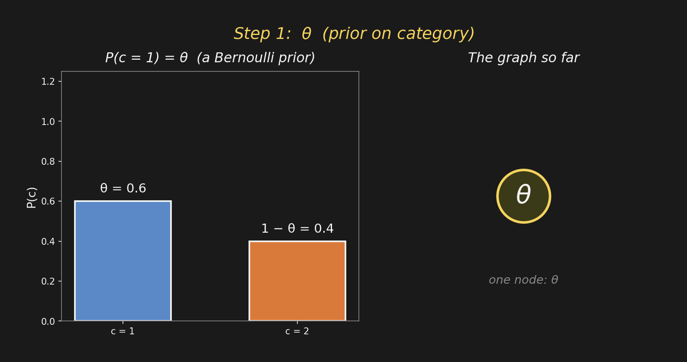{fig-align="center" width="100%"}

::: {.lang-en}
The Bernoulli prior **on the left** has one parameter, $\theta$. **On the right**, $\theta$ becomes one **node** of the graph. A node = a random variable (or parameter) in the model.
:::

::: {.lang-ja}
左のベルヌーイ事前分布にはパラメータ $\theta$ が1つ。右では、$\theta$ がグラフの **ノード** の1つになる。ノード = モデル中の確率変数（またはパラメータ）。
:::

::: {.notes}
~60 sec. Spend a beat on each panel. Left: theta is a number on [0,1] that sets
the bar heights. Right: that same number is a node. Same θ, two pictures.
:::

## [Step 2: sample $c_n \sim \mathrm{Bernoulli}(\theta)$]{.lang-en}[ステップ2：$c_n \sim \mathrm{Bernoulli}(\theta)$ をサンプル]{.lang-ja} {.smaller}

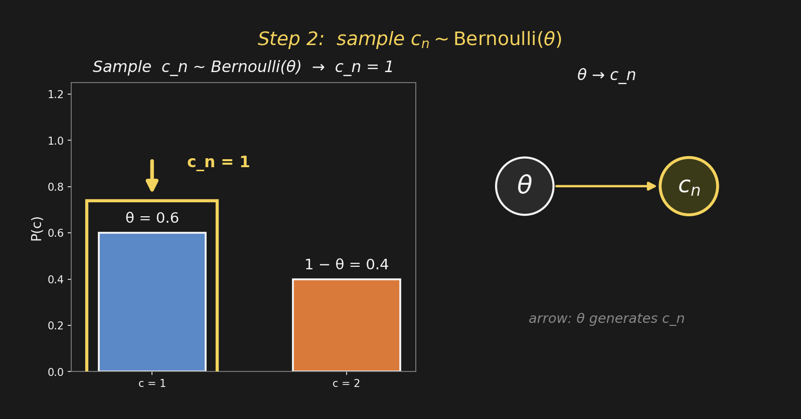{fig-align="center" width="100%"}

::: {.lang-en}
Sampling $c_n$ flips a θ-weighted coin. Pick category 1 (highlighted bar).
**On the graph:** $c_n$ becomes a new node, and the line $c_n \mid \theta \sim \mathrm{Bernoulli}(\theta)$ becomes an **arrow** from θ to $c_n$.

**Generative-process line ↔ arrow in the graph.**
:::

::: {.lang-ja}
$c_n$ のサンプリングは、θ で重み付けされたコインを振る。カテゴリ1 を選ぶ（黄色いバー）。
**グラフの上では：** $c_n$ が新しいノードになり、$c_n \mid \theta \sim \mathrm{Bernoulli}(\theta)$ という行は θ から $c_n$ への **矢印** になる。

**生成過程の1行 ↔ グラフの矢印1本。**
:::

::: {.notes}
~75 sec. THE central pedagogical move. The 'arrow' is exactly the conditioning
bar in the generative process. Spell this out — "the | in `c_n | θ` IS the
arrow from θ to c_n."
:::

## [Step 3: introduce the components]{.lang-en}[ステップ3：成分を導入]{.lang-ja} {.smaller}

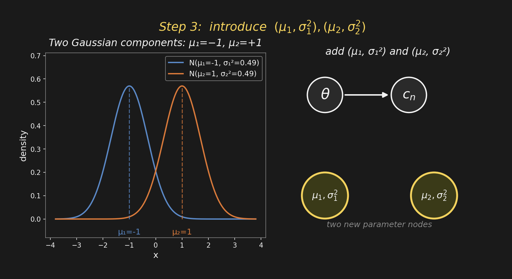{fig-align="center" width="100%"}

::: {.lang-en}
The two Gaussians have parameters $(\mu_1, \sigma_1^2)$ and $(\mu_2, \sigma_2^2)$. **On the graph:** two new nodes for the parameters — one pair per component.

We're not yet drawing arrows from these into $x_n$. That happens in the next step.
:::

::: {.lang-ja}
2つのガウス分布のパラメータは $(\mu_1, \sigma_1^2)$ と $(\mu_2, \sigma_2^2)$。**グラフの上では：** パラメータごとに新しいノード — 成分ごとに1ペア。

まだ $x_n$ への矢印は描かない。それは次のステップ。
:::

::: {.notes}
~60 sec. Show two Gaussians at μ=-1 and μ=+1 (exact values from Problem 2).
Add parameter nodes but no edges into x yet — keep the build-up tidy.
:::

## [Step 4: sample $x_n$, the observation]{.lang-en}[ステップ4：観測 $x_n$ をサンプル]{.lang-ja} {.smaller}

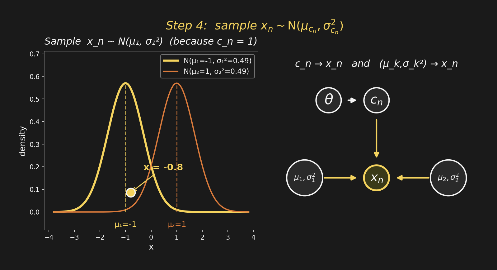{fig-align="center" width="100%"}

::: {.lang-en}
With $c_n = 1$, we sample $x_n \sim \mathrm{N}(\mu_1, \sigma_1^2)$ — a point under the highlighted Gaussian. **On the graph:** $x_n$ is a new node (shaded — it's *observed*), with arrows from $c_n$ and from each $(\mu_k, \sigma_k^2)$.

The second generative-process line gave us **three new arrows** at once.
:::

::: {.lang-ja}
$c_n = 1$ のとき、$x_n \sim \mathrm{N}(\mu_1, \sigma_1^2)$ をサンプル — 黄色いガウス分布の下の1点。**グラフの上では：** $x_n$ は新しいノード（網掛け = 観測済み）、$c_n$ と各 $(\mu_k, \sigma_k^2)$ から矢印が入る。

生成過程の2行目で、**矢印が3本** 一気に加わった。
:::

::: {.notes}
~75 sec. Shaded x_n = observed convention. Point out: x_n depends on c_n
(which Gaussian) AND on (μ_k, σ_k) (the parameters of that Gaussian). Three
arrows from one generative-process line.
:::

## [Step 5: do this N times]{.lang-en}[ステップ5：これを N 回繰り返す]{.lang-ja} {.smaller}

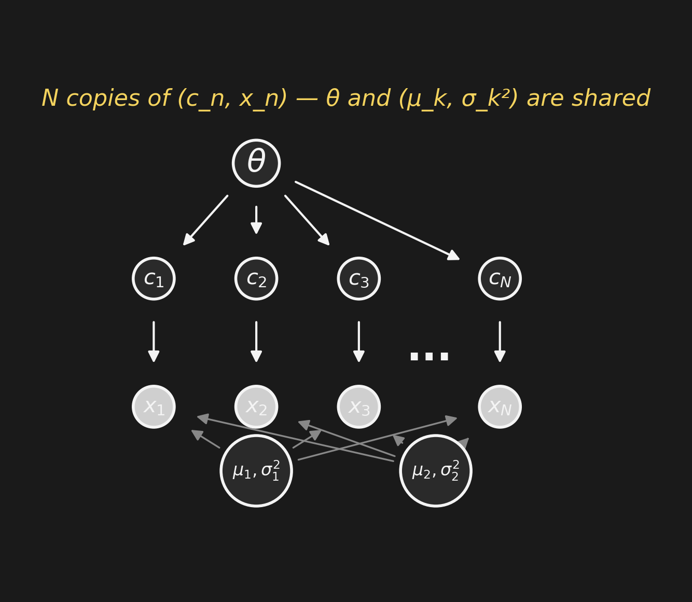{fig-align="center" width="100%"}

::: {.lang-en}
The generative process has $n = 1, \ldots, N$. Each $n$ gets its own $(c_n, x_n)$ — but $\theta$ and the $(\mu_k, \sigma_k^2)$ are **shared**.

Drawn explicitly, this is an N-fold copy of the same little pattern.
:::

::: {.lang-ja}
生成過程は $n = 1, \ldots, N$ にわたる。各 $n$ に独自の $(c_n, x_n)$ — しかし $\theta$ と $(\mu_k, \sigma_k^2)$ は **共有される**。

明示的に描くと、同じ小さなパターンの N 個のコピー。
:::

::: {.notes}
~60 sec. Show 3 copies + "..." + the Nth. The shared parameters are drawn
once; the per-datum nodes are drawn N times. Set up the plate motivation:
this is correct but unwieldy.
:::

## [Step 6: the plate — a shortcut]{.lang-en}[ステップ6：プレート — 略記法]{.lang-ja} {.smaller}

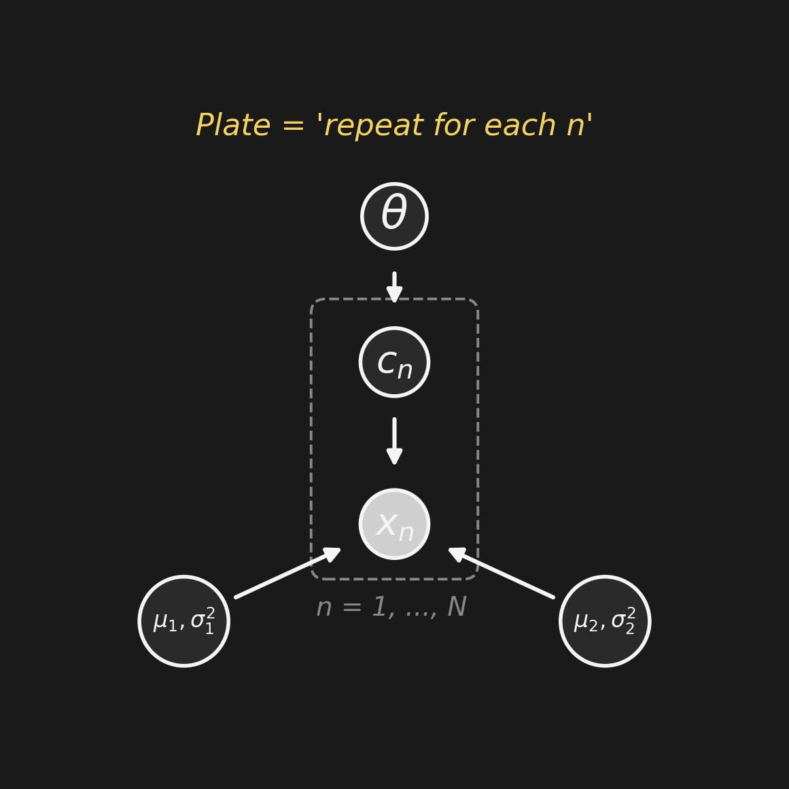{fig-align="center" width="88%"}

::: {.lang-en}
**Plate notation:** draw the repeating pattern *once* inside a dashed box, and label the box "$n = 1, \ldots, N$." The plate means **"copy everything inside, N times."**

Same graph, vastly more compact.
:::

::: {.lang-ja}
**プレート記法：** 繰り返しパターンを *1回だけ* 破線の箱の中に描き、箱に "$n = 1, \ldots, N$" とラベルを付ける。プレートの意味は **「中身を N 回コピー」**。

同じグラフ、はるかにコンパクト。
:::

::: {.notes}
~45 sec. Plate is purely notation — no new content. Just compress the
unrolled graph. Bishop, Murphy, Koller all use this.
:::

## [Step 7: generalize to K components]{.lang-en}[ステップ7：K成分に一般化]{.lang-ja} {.smaller}

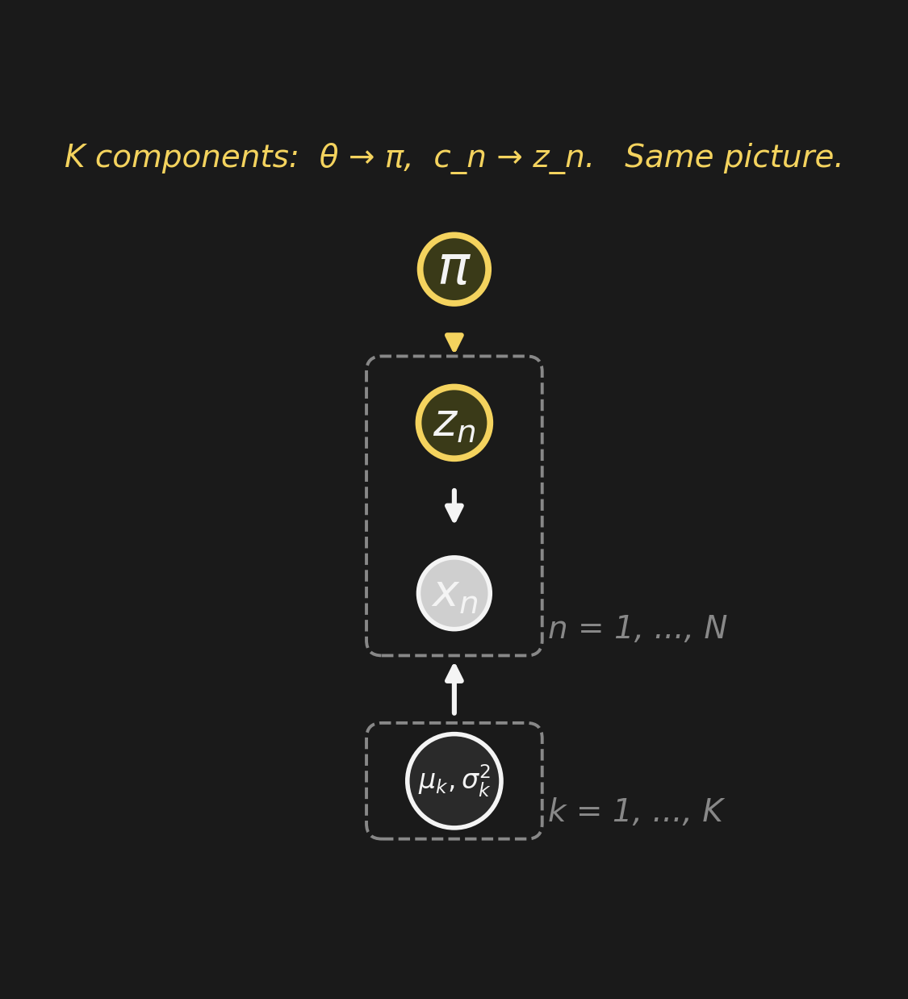{fig-align="center" width="90%"}

::: {.lang-en}
Bernoulli($\theta$) generalizes to Categorical($\pi$) for K components.
$c_n \to z_n$, $\theta \to \pi$, and $(\mu_k, \sigma_k^2)$ gets a K-plate.

**Same picture.** Two clusters or two hundred — the graph language stayed put.
:::

::: {.lang-ja}
Bernoulli($\theta$) は K 成分の場合の Categorical($\pi$) に一般化される。
$c_n \to z_n$、$\theta \to \pi$、$(\mu_k, \sigma_k^2)$ には K-プレートを付ける。

**同じ絵。** 2つのクラスタでも200個でも — グラフ言語はそのまま。
:::

[The choice of K — DPMM (T3 Ch 6) avoids fixing it. Week 10 picks this up.]{.dim}

::: {.notes}
~60 sec. Quick generalization. The notation switch (c_n → z_n, θ → π) is
just renaming. The K-plate is the new structural piece. DPMM gets the
one-line forward pointer.
:::

## [Reading inference off the graph]{.lang-en}[グラフから推論を読み取る]{.lang-ja}

::: {.lang-en}
You've now seen the graph. Two things to take away — **without writing down
the formula** (that's your assignment):

- **Down the arrow** = generative direction. Sample $\theta$, then $c_n$, then $x_n$.
- **Up the arrow** = inference direction. Observe $x_n$, ask which $c_n$ generated it.

The "which cluster?" calculation you're doing in Clusters Problem 2 is
**inference going UP the arrow from $x_n$ to $c_n$.** Prior → likelihood → posterior,
read off the parent–child structure.

[We won't write the formula here — finish the assignment first; we'll discuss after Friday.]{.dim}
:::

::: {.lang-ja}
グラフを見たので、2つの要点を持ち帰ってください — **式は書かずに**（それは課題）：

- **矢印を下る** = 生成方向。$\theta$ をサンプル、次に $c_n$、次に $x_n$。
- **矢印を上る** = 推論方向。$x_n$ を観測して、どの $c_n$ から来たかを問う。

クラスタ課題の問題2 でやっている「どのクラスタか？」の計算は、まさに
**$x_n$ から $c_n$ へ矢印を上る推論**。事前 → 尤度 → 事後を、親子構造から読み取る。

[式はここでは書きません — まず課題を提出してから、金曜後に解説します。]{.dim}
:::

::: {.notes}
~75 sec. PAYOFF slide. NOTE: previous version showed the full responsibility
formula — REMOVED because that's Problem 2 of Clusters (due Friday, not all
submitted). Keep the conceptual claim ("up the arrow = inference") without
giving away the algebra. Verbal hint to students: "the formula falls out of
the graph naturally, but write it yourself — we'll go over it next class."
:::

# [Two complications + notation]{.lang-en}[2つの拡張 + 記号の確認]{.lang-ja} {.section-break background-image="../../sds-reveal/sds_frame.png" background-size="cover"}

## [Where do the priors come from?]{.lang-en}[事前分布はどこから来るのか？]{.lang-ja} {.midbig}

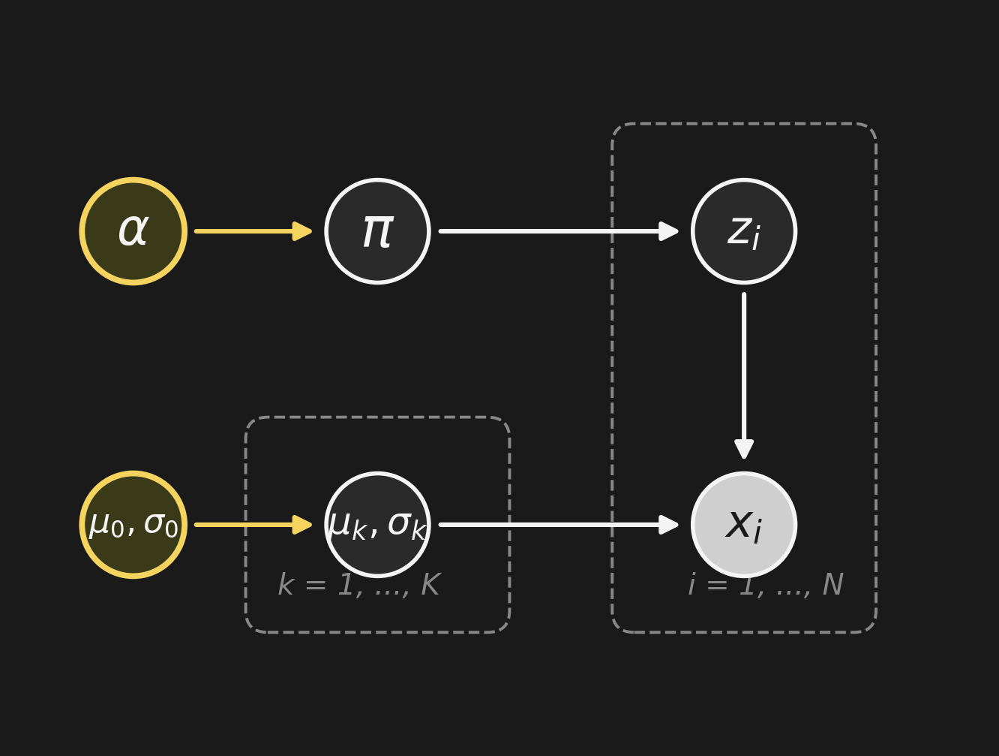{fig-align="center" width="82%"}

::: {.lang-en}
Add a **hyperprior**: $\alpha \to \pi$ and $(\mu_0, \sigma_0) \to (\mu_k, \sigma_k)$.

This is **exactly Week 4's hierarchical Bayes**, drawn as a graph.
The graph language already covered it; we just didn't have the words yet.
:::

::: {.lang-ja}
**ハイパー事前分布** を追加する：$\alpha \to \pi$ と $(\mu_0, \sigma_0) \to (\mu_k, \sigma_k)$。

これは **先週の階層ベイズそのもの** を、グラフで描いたものです。
グラフという言語ですでに表現できていたのに、その言葉を持っていなかっただけ。
:::

::: {.notes}
~90 sec. Connect explicitly to Week 4 — hyperpriors are nodes upstream of
priors, the directional edges encode "this generates that's parameters." The
yellow-highlighted nodes are the additions. Don't dive into hyperprior
inference; the point is just "the picture scales."
:::

## [What if there are multiple parents?]{.lang-en}[親ノードが複数ある場合は？]{.lang-ja}

::: {.lang-en}
**Chibany realizes:** the bento ($B$) weight depends on more than just which cluster.

- **Weather** ($W$) — hot days mean lighter bentos
- **Day of the week** ($D$) — the cafeteria menu rotates
- **Restaurant** ($R$) — different students come from different places

Multiple causes, one observation. *How does the picture handle that?*

[We'll use $W$, $D$, $R$, $B$ as shorthand for these variables from here on.]{.dim}
:::

::: {.lang-ja}
**チバニーは気づきます：** 弁当 ($B$) の重さは、どのクラスタかだけでは決まらない。

- **天気** ($W$) — 暑い日は軽めの弁当
- **曜日** ($D$) — カフェテリアのメニューはローテーション
- **レストラン** ($R$) — 学生によって出身地が違う

複数の原因、1つの観測値。 *グラフはこれをどう扱う？*

[以降、これらの変数を $W$, $D$, $R$, $B$ と略記します。]{.dim}
:::

::: {.notes}
~60 sec. Set up the multi-parent slide. Stay light here — it's a question, not
yet an answer. The answer is on the next slide.
:::

## [Chibany's full bento network]{.lang-en}[チバニーの完全な弁当ネットワーク]{.lang-ja} {.smaller}

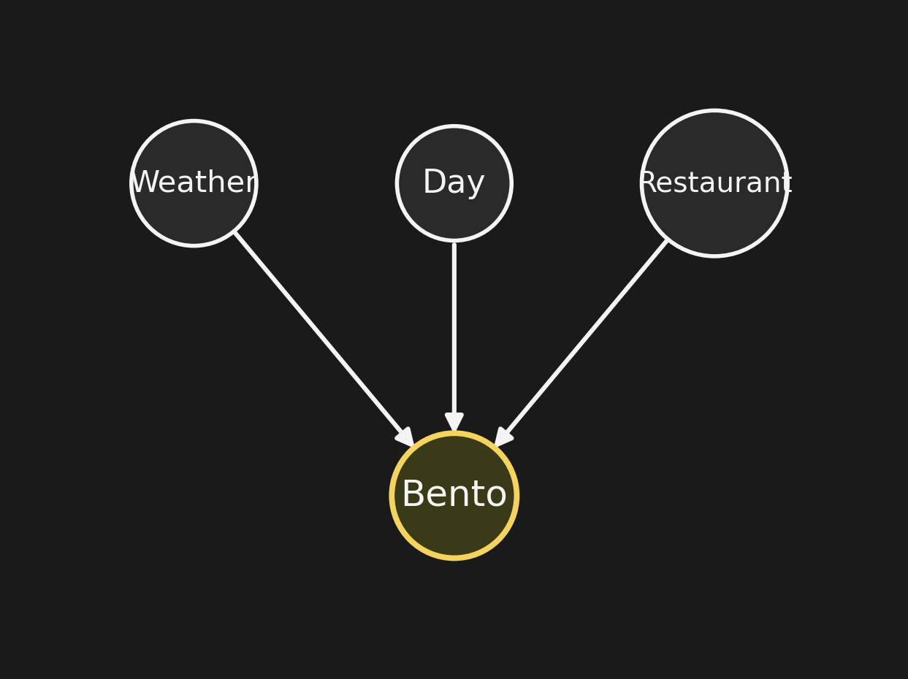{fig-align="center" width="78%"}

::: {.lang-en}
Three parents pointing into Bento. **What's the joint distribution?**
:::

::: {.lang-ja}
3つの親ノードが弁当に向かう。**同時分布は何になるか？**
:::

::: {.notes}
~45 sec. Show the graph, pose the question. Let the audience think for a beat
before the rule appears next slide. Show-before-tell.
:::

## [The rule for multiple parents]{.lang-en}[親が複数あるときのルール]{.lang-ja} {.midbig}

::: {.lang-en}
Each parent contributes a factor. The joint factorizes as:
$$P(W, D, R, B) \;=\; P(W) \, P(D) \, P(R) \, P(B \mid W, D, R)$$

- $W$, $D$, $R$ have no parents → marginals.
- $B$ has three parents → conditional on **all three**.

**One factor per node, conditioned on that node's parents.** That's the rule.
:::

::: {.lang-ja}
各親ノードが因子を1つ提供する。同時分布は次のように因数分解される：
$$P(W, D, R, B) \;=\; P(W) \, P(D) \, P(R) \, P(B \mid W, D, R)$$

- $W$、$D$、$R$ には親がない → 周辺確率。
- $B$ には3つの親 → **3つすべて** に条件付けられる。

**各ノードにつき1つの因子、その親に条件付けられた形で。** これがルールです。
:::

::: {.notes}
~90 sec. State the rule. Don't yet name it "the Markov factorization" — that
happens in Block 3. Here it's just shorthand. Note explicitly: nodes without
parents are easy (marginals); nodes with many parents need the full CPT.
:::

## [Notation lock-in]{.lang-en}[記号の確認]{.lang-ja}

:::: {.columns}

::: {.column width="48%"}
::: {.lang-en}
**Symbols we'll use:**

- $G = (V, E)$ — a **directed acyclic graph** (DAG)
- $\text{Pa}(X)$ — the **parents** of node $X$ in $G$
:::

::: {.lang-ja}
**使う記号：**

- $G = (V, E)$ — **有向非巡回グラフ** (DAG)
- $\text{Pa}(X)$ — グラフ $G$ における $X$ の **親** ノード
:::
:::

::: {.column width="48%"}
::: {.lang-en}
**Three examples so far:**

- GMM: $\text{Pa}(z_i) = \{\pi\}$, $\text{Pa}(x_i) = \{z_i\}$
- GMM + hyperprior: add $\text{Pa}(\pi) = \{\alpha\}$
- Bento: $\text{Pa}(B) = \{W, D, R\}$
:::

::: {.lang-ja}
**ここまでの3つの例：**

- GMM: $\text{Pa}(z_i) = \{\pi\}$、$\text{Pa}(x_i) = \{z_i\}$
- ハイパー事前を追加: $\text{Pa}(\pi) = \{\alpha\}$
- 弁当ネット: $\text{Pa}(B) = \{W, D, R\}$
:::
:::

::::

::: {.lang-en}
**Joint factorizes as:**
$$P(X_1, \ldots, X_n) = \prod_i P(X_i \mid \text{Pa}(X_i))$$

[Same picture, same rule, three problems.]{.dim}
:::

::: {.lang-ja}
**同時分布の因数分解：**
$$P(X_1, \ldots, X_n) = \prod_i P(X_i \mid \text{Pa}(X_i))$$

[同じ絵、同じルール、3つの問題。]{.dim}
:::

::: {.notes}
~90 sec. This is the C-concession: shorthand notation lock-in, but I'm NOT
yet calling the product formula "the Markov factorization." That's for Block 3
after Monty Hall lands. Frame this slide as "the shorthand we'll use next."
:::

# [Chibany Monty Hall + formal definition]{.lang-en}[チバニーのモンティ・ホール + 正式な定義]{.lang-ja} {.section-break background-image="../../sds-reveal/sds_frame.png" background-size="cover"}

## [A new puzzle for Chibany]{.lang-en}[チバニーへの新しい謎]{.lang-ja} {.bigger}

::: {.lang-en}
**The cafeteria scenario.** Three bento boxes on the counter. Exactly one of them
contains tonkatsu (the other two don't). Chibany picks **box 1**. The cafeteria
worker — who *knows* which box has the tonkatsu — opens **box 3** and reveals:
not tonkatsu.

*Should Chibany switch to box 2?*
:::

::: {.lang-ja}
**カフェテリアでの場面。** カウンターに3つのお弁当。そのうちちょうど1つだけが
トンカツ（残りの2つは違う）。チバニーは **1番** を選んだ。カフェテリア店員 —
どの箱がトンカツかを *知っている* — が **3番** を開けて：トンカツじゃない、と見せる。

*チバニーは2番に変えるべきか？*
:::

::: {.notes}
~60 sec. Show-before-tell. Let them think. No one says "Monty Hall" yet.
Some students will know the classic puzzle; others will guess "no, switching
shouldn't matter." Both reactions are fine — the network reveals the answer.
:::

## [As a Bayes net]{.lang-en}[ベイズネットとして]{.lang-ja} {.midbig}

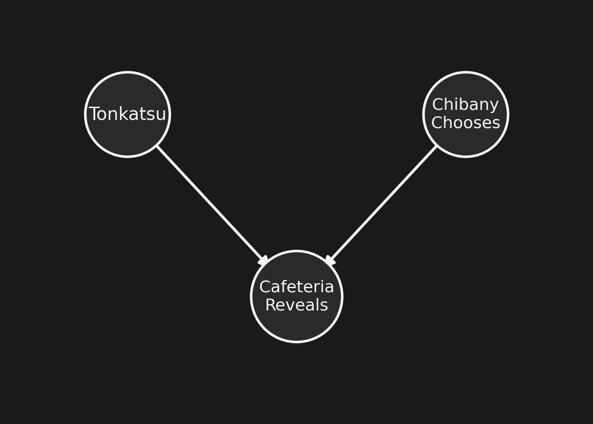{fig-align="center" width="65%"}

::: {.lang-en}
Three nodes:

- **Tonkatsu** ($T$): which box has it. Uniform: each box, 1/3.
- **Chibany Chooses** ($C$): which box Chibany chose. Independent of Tonkatsu.
- **Cafeteria Reveals** ($R$): which box the worker opens — depends on **both** parents.

A **collider**: two arrows pointing into the same node.

[We'll use $T$, $C$, $R$ as shorthand for these from here on. ($C$ for Chibany's choice — avoids clashing with $P(\cdot)$ for probability.)]{.dim}
:::

::: {.lang-ja}
3つのノード：

- **トンカツ** ($T$)：どの箱に入っているか。一様分布：各箱 1/3。
- **チバニーの選択** ($C$)：チバニーがどの箱を選ぶか。トンカツの位置とは独立。
- **店員の公開** ($R$)：店員がどの箱を開けるか — **両方** の親ノードに依存。

**コライダー（合流点）**：2つの矢印が同じノードに向かう構造。

[以降、これらの変数を $T$, $C$, $R$ と略記します。（$C$ は Chibany's choice — 確率の $P(\cdot)$ と紛れないように。）]{.dim}
:::

::: {.notes}
~90 sec. Name "collider" here but don't unpack what's special about it yet —
that's Block 4 (d-sep) and Block 5 (explaining away). Walk through each node's
CPT verbally: Tonkatsu and Picks are uniform; Reveals is determined by:
"open a box that is (a) not Chibany's pick and (b) not the tonkatsu box."
:::

## [Joint factorization]{.lang-en}[同時分布の因数分解]{.lang-ja}

::: {.lang-en}
The graph gives us:
$$P(T, C, R) \;=\; P(T) \, P(C) \, P(R \mid T, C)$$

- $P(T) = 1/3$ for each box
- $P(C) = 1/3$ for each box (we'll assume Chibany chooses uniformly)
- $P(R \mid T, C)$ — the cafeteria worker's policy: open a box that's neither the tonkatsu nor Chibany's choice.

Before any observation, each box has probability 1/3 of being tonkatsu.
:::

::: {.lang-ja}
グラフから次が得られる：
$$P(T, C, R) \;=\; P(T) \, P(C) \, P(R \mid T, C)$$

- $P(T) = 1/3$ 各箱について
- $P(C) = 1/3$ 各箱について（チバニーは一様に選ぶと仮定）
- $P(R \mid T, C)$ — 店員のポリシー：トンカツの箱でもチバニーの選択でもない箱を開ける。

何も観測する前は、各箱がトンカツである確率は 1/3。
:::

::: {.notes}
~75 sec. Write the factorization on the board. The first two factors are
trivial (uniform). The third one — the worker's policy — is the interesting
factor. Students will sometimes try to write P(R) as 1/3 too. Catch this:
no, P(R) is NOT uniform on its own; only the CONDITIONAL P(R | T, C) is fixed
by the worker's policy.
:::

## [Now condition: $P(T \mid R = 3, C = 1)$]{.lang-en}[ここで条件付け: $P(T \mid R = 3, C = 1)$]{.lang-ja}

::: {.lang-en}
We observe $C = 1$ (Chibany chose box 1) and $R = 3$ (worker opened box 3).
What's the posterior over $T$?

Two cases that matter:

- $T = 1$ (Chibany's choice is right). Worker opens box 2 OR box 3 — picks uniformly. So $P(R = 3 \mid T = 1, C = 1) = 1/2$.
- $T = 2$ (the other unopened box). Worker MUST open box 3 (only choice that's neither 1 nor 2). So $P(R = 3 \mid T = 2, C = 1) = 1$.
- $T = 3$ (impossible — worker just revealed it). $P(R = 3 \mid T = 3, C = 1) = 0$.
:::

::: {.lang-ja}
$C = 1$（チバニーは1番を選んだ）と $R = 3$（店員は3番を開けた）を観測。
$T$ の事後分布は？

重要な3つのケース：

- $T = 1$（チバニーの選択が正解）。店員は2番か3番を一様に選ぶ。$P(R = 3 \mid T = 1, C = 1) = 1/2$。
- $T = 2$（もう一つの未開封）。店員は3番を開けるしか **ない**（1でも2でもない箱）。$P(R = 3 \mid T = 2, C = 1) = 1$。
- $T = 3$（不可能 — 店員が開けたので）。$P(R = 3 \mid T = 3, C = 1) = 0$。
:::

::: {.notes}
~2 min. The KEY pedagogical step. Walk through each likelihood carefully:
- T=1 (Chibany right): worker chooses randomly between 2 free boxes.
- T=2 (other box): worker has only one legal move.
- T=3: impossible.
This asymmetry IS the explaining-away mechanism at work, though we won't name
it yet.
:::

## [Bayes' rule gives the answer]{.lang-en}[ベイズの定理で答えが出る]{.lang-ja} {.midbig}

::: {.lang-en}
$$P(T = k \mid R = 3, C = 1) \;\propto\; P(R = 3 \mid T = k, C = 1) \, P(T = k)$$

| $T$ | Prior | Likelihood | Unnormalized |
|---|---:|---:|---:|
| 1 | 1/3 | 1/2 | 1/6 |
| 2 | 1/3 | 1   | 1/3 |
| 3 | 1/3 | 0   | 0   |

Normalize: $P(T = 1 \mid \cdot) = 1/3$, $P(T = 2 \mid \cdot) = 2/3$.

**Chibany should switch.**
:::

::: {.lang-ja}
$$P(T = k \mid R = 3, C = 1) \;\propto\; P(R = 3 \mid T = k, C = 1) \, P(T = k)$$

| $T$ | 事前 | 尤度 | 正規化前 |
|---|---:|---:|---:|
| 1 | 1/3 | 1/2 | 1/6 |
| 2 | 1/3 | 1   | 1/3 |
| 3 | 1/3 | 0   | 0   |

正規化：$P(T = 1 \mid \cdot) = 1/3$、$P(T = 2 \mid \cdot) = 2/3$。

**チバニーは変えるべきだ。**
:::

::: {.notes}
~90 sec. Drop the punchline: 2/3 vs 1/3 — switch. The structural reason is the
worker's CPT depends on both Chibany's choice AND the tonkatsu location — that
asymmetry produces the unequal likelihoods.
:::

## [Now name it: the Markov factorization]{.lang-en}[正式名称: マルコフ因数分解]{.lang-ja}

::: {.lang-en}
**Definition.** A **Bayesian network** for variables $X_1, \ldots, X_n$ is a **directed acyclic graph** $G$ — one node per variable — together with a **conditional distribution** $P(X_i \mid \text{Pa}_G(X_i))$ at each node.

**Theorem (Markov factorization).** The joint distribution factorizes as
$$P(X_1, \ldots, X_n) \;=\; \prod_{i=1}^{n} P(X_i \mid \text{Pa}_G(X_i)).$$

[You've used this rule three times already — mixture, hyperprior, bento — and just used it for the Monty Hall posterior. Now it has a name.]{.dim}
:::

::: {.lang-ja}
**定義.** 変数 $X_1, \ldots, X_n$ の **ベイズネット** とは、変数ごとに1ノードの **有向非巡回グラフ（DAG）** $G$ と、各ノードの **条件付き分布** $P(X_i \mid \text{Pa}_G(X_i))$ の組。

**定理（マルコフ因数分解）.** 同時分布は次のように因数分解される：
$$P(X_1, \ldots, X_n) \;=\; \prod_{i=1}^{n} P(X_i \mid \text{Pa}_G(X_i)).$$

[このルールはすでに3回使いました — 混合、ハイパー事前、弁当 — そしてモンティ・ホールで事後分布も計算した。やっと名前が付いた。]{.dim}
:::

::: {.notes}
~90 sec. Name it. The theorem statement is the formal definition. Don't go
into I-maps; the dim caption is enough. The right move is "you've been doing
this — now you have a name for it." Don't dwell.
:::

## [How compact is this?]{.lang-en}[どれくらいコンパクトか？]{.lang-ja} {.smaller}

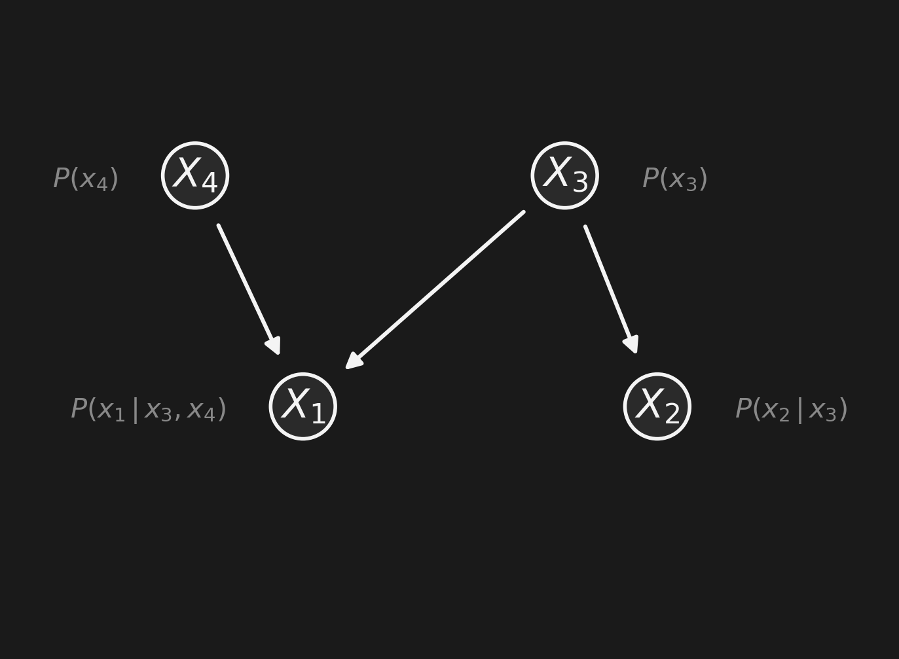{fig-align="center" width="78%"}

::: {.lang-en}
For 4 binary variables, the **full joint** needs $2^4 - 1 = 15$ numbers.
This Bayes net needs how many?
:::

::: {.lang-ja}
2値変数4つの場合、**完全な同時分布** には $2^4 - 1 = 15$ 個の数が必要。
このベイズネットは何個で済むか？
:::

::: {.notes}
~45 sec. Pose the question. Don't reveal yet. Per-node counts hidden — let
students count for themselves. Hint verbally: "each node contributes
2^(#parents) numbers." Then advance to the reveal.
:::

## [How compact is this? — answer]{.lang-en}[どれくらいコンパクトか？ — 答え]{.lang-ja} {.smaller}

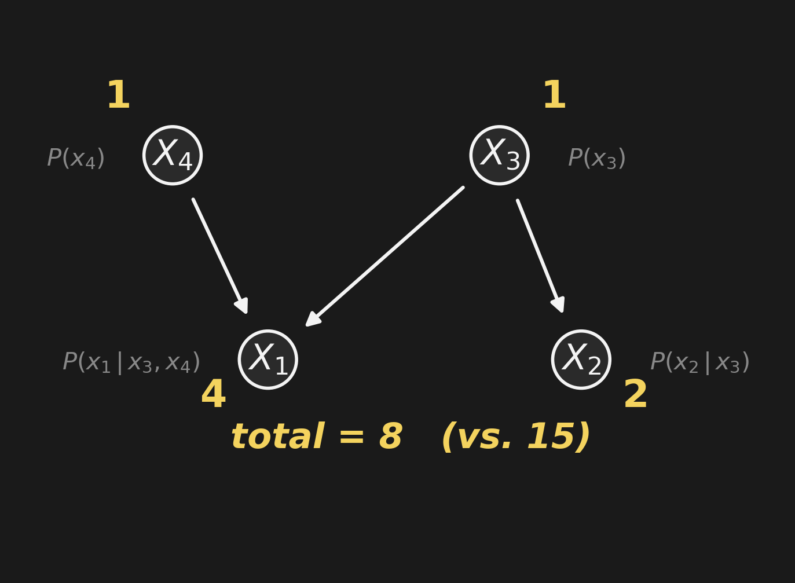{fig-align="center" width="78%"}

::: {.lang-en}
**8** vs. 15. Modest gain here — exponential gain at scale.
:::

::: {.lang-ja}
**8** 個 vs. 15 個。ここでは控えめな差 — 規模が大きくなると指数的な差に。
:::

::: {.notes}
~45 sec. The Pearl psychic-friend example. Per-node counts revealed on the
figure. The "vs 15" is the punchline. Mention this gets more dramatic fast:
10 binary vars → 1023 vs maybe 30. 50 binary vars → 10^15 vs maybe a few
hundred.
:::

## [Same network, different costume]{.lang-en}[同じネット、違う衣装]{.lang-ja} {.smaller}

:::: {.columns}

::: {.column width="48%"}
{fig-align="center" width="100%"}

::: {style="text-align:center;"}
[Chibany version]{.lang-en .dim}[チバニー版]{.lang-ja .dim}
:::
:::

::: {.column width="48%"}
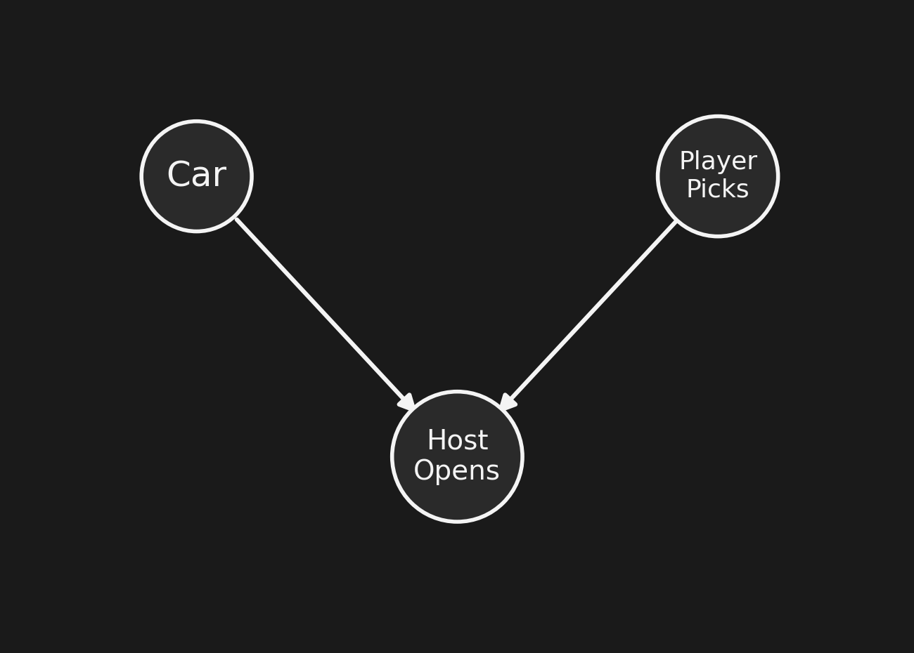{fig-align="center" width="100%"}

::: {style="text-align:center;"}
[Classic Monty Hall]{.lang-en .dim}[古典的なモンティ・ホール]{.lang-ja .dim}
:::
:::

::::

::: {.lang-en}
Car / Host / Player and Tonkatsu / Cafeteria / Chibany — *literally* the same network.
The 2/3 vs 1/3 answer is structural.
:::

::: {.lang-ja}
車 / ホスト / プレイヤー と トンカツ / 店員 / チバニー — *文字通り* 同じネットワーク。
2/3 vs 1/3 の答えはネットワーク構造から来る。
:::

::: {.notes}
~45 sec. Bridge from Chibany to the cultural reference. Some students will
have heard of Monty Hall before; now they know what makes it work
structurally.
:::

## [Poll — Bayes-net factorization]{.lang-en}[ポール — ベイズネット因数分解]{.lang-ja}

::: {.lang-en}
In the Chibany Monty Hall network (Tonkatsu → Reveals ← Chooses),
the joint $P(T, R, C)$ factorizes as:
:::

::: {.lang-ja}
チバニーのモンティ・ホールネット（トンカツ → 公開 ← 選択）において、
同時分布 $P(T, R, C)$ の因数分解は：
:::

::: {.fragment}
::: {.lang-en}
- **A.** $P(T) \, P(C) \, P(R \mid T, C)$
- **B.** $P(T \mid C) \, P(C) \, P(R)$
- **C.** $P(T) \, P(C \mid T) \, P(R \mid C)$
- **D.** Cannot factorize — all three are dependent.
:::

::: {.lang-ja}
- **A.** $P(T) \, P(C) \, P(R \mid T, C)$
- **B.** $P(T \mid C) \, P(C) \, P(R)$
- **C.** $P(T) \, P(C \mid T) \, P(R \mid C)$
- **D.** 因数分解できない — 3つすべて従属。
:::
:::

::: {.notes}
~60 sec. Commit-before-reveal. Each node, given its parents, contributes one
factor. T and C have no parents → marginals. R has T and C as parents →
conditional on both. (A) is correct.
:::

## [Poll — answer]{.lang-en}[ポール — 答え]{.lang-ja} {.bigger}

[**A.** $P(T) \, P(C) \, P(R \mid T, C)$]{.lang-en .yellow}[**A.** $P(T) \, P(C) \, P(R \mid T, C)$]{.lang-ja .yellow}

::: {.lang-en}
Each node, given its parents, contributes one factor.
$T$ and $C$ are root nodes (no parents) → marginals.
$R$ is a child of both → conditional on both.
:::

::: {.lang-ja}
各ノードは、その親ノードに条件付けられた因子を1つ提供する。
$T$ と $C$ は根ノード（親なし）→ 周辺確率。
$R$ は両方の子 → 両方に条件付けられた条件付き確率。
:::

::: {.notes}
~45 sec. (B) gets the conditioning backwards. (C) inserts a non-existent
edge C→T. (D) confuses dependence with non-factorization — a Bayes net
can have dependent variables AND still factorize.
:::

# [d-separation + Bayes-Ball]{.lang-en}[d分離 + ベイズボール]{.lang-ja} {.section-break background-image="../../sds-reveal/sds_frame.png" background-size="cover"}

## [Reading independence off the graph]{.lang-en}[グラフから独立性を読み取る]{.lang-ja} {.midbig}

::: {.lang-en}
The Markov factorization tells us how the joint *factors*.
But what about **conditional independence**?

Three patterns to know — every Bayes net is built from these:

- **Chain:** $A \to B \to C$
- **Fork:** $A \leftarrow B \to C$
- **Collider:** $A \to B \leftarrow C$

Conditioning on $B$ behaves *differently* in each.
:::

::: {.lang-ja}
マルコフ因数分解は、同時分布の *因数分解* を教えてくれます。
では **条件付き独立性** はどうでしょうか？

3つのパターン — どのベイズネットもこれらから組み立てられている：

- **チェーン（鎖）:** $A \to B \to C$
- **フォーク（分岐）:** $A \leftarrow B \to C$
- **コライダー（合流）:** $A \to B \leftarrow C$

$B$ に条件付けるとき、それぞれ *違う* 振る舞いをします。
:::

::: {.notes}
~60 sec. Set up the 3-slide build-up. Tell them ahead of time: collider is the
weird one. The setup primes them to look for the asymmetry.
:::

## [Chain: A → B → C]{.lang-en}[チェーン: A → B → C]{.lang-ja} {.smaller}

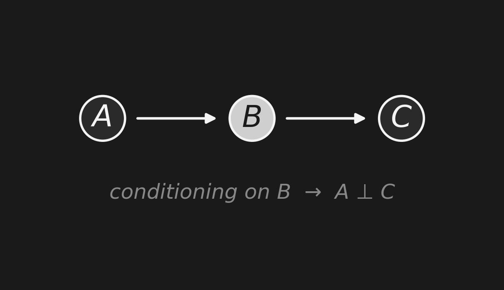{fig-align="center" width="68%"}

::: {.lang-en}
Conditioning on the middle node **blocks** information flow.

$$A \;\perp\; C \;\mid\; B$$
:::

::: {.lang-ja}
中間ノードに条件付けると、情報の流れは **遮断** される。

$$A \;\perp\; C \;\mid\; B$$
:::

::: {.notes}
~60 sec. Example: Sleep → Caffeine → Alertness. Knowing caffeine intake makes
sleep and alertness conditionally independent — caffeine "absorbs" all the
sleep-info relevant to alertness.
:::

## [Fork: A ← B → C]{.lang-en}[フォーク: A ← B → C]{.lang-ja} {.smaller}

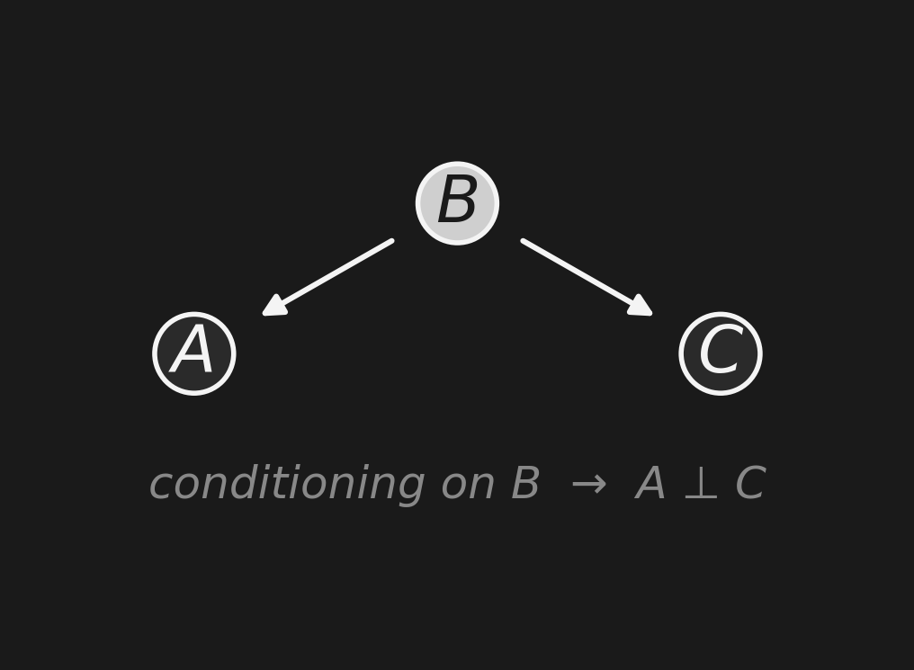{fig-align="center" width="68%"}

::: {.lang-en}
A common cause. Conditioning on the cause **blocks** information flow.

$$A \;\perp\; C \;\mid\; B$$
:::

::: {.lang-ja}
共通原因。原因に条件付けると、情報の流れは **遮断** される。

$$A \;\perp\; C \;\mid\; B$$
:::

::: {.notes}
~60 sec. Example: a common-cause structure — Genetics → both Height and
Vocabulary. Knowing genetics makes the two seemingly correlated outcomes
conditionally independent.
:::

## [Collider: A → B ← C]{.lang-en}[コライダー: A → B ← C]{.lang-ja} {.smaller}

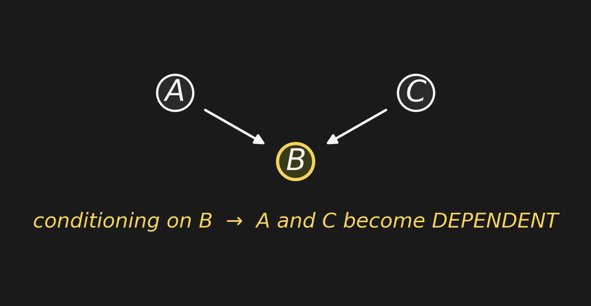{fig-align="center" width="68%"}

::: {.lang-en}
A common effect. Conditioning on the effect **induces** dependence between the
otherwise-independent causes.

$$A \;\perp\; C \quad\text{but}\quad A \;\not\perp\; C \;\mid\; B$$

This is **backwards** from chain and fork. It's the surprise of the lecture.
:::

::: {.lang-ja}
共通の結果。結果に条件付けると、もともと独立だった原因間に依存性が **生じる**。

$$A \;\perp\; C \quad\text{しかし}\quad A \;\not\perp\; C \;\mid\; B$$

これはチェーンやフォークと **逆向き**。今日の講義の意外なポイント。
:::

::: {.notes}
~75 sec. THE key concept for the rest of the lecture. Flag it explicitly:
this looks wrong, and yet it's right. We'll see WHY in Block 5 (explaining
away). For now, just absorb the rule: collider conditioning OPENS the path.
:::

## [Markov blanket]{.lang-en}[マルコフブランケット]{.lang-ja} {.smaller}

:::: {.columns}

::: {.column width="50%"}
::: {.lang-en}
**Definition.** The Markov blanket of node $X$:

- **parents** of $X$
- **children** of $X$
- **other parents** of $X$'s children (the "spouses")

Conditioning on the Markov blanket makes $X$ **independent of everything else** in the network.

The spouses are the non-obvious part — they're there because of *collider conditioning* flowing through $X$'s children.
:::

::: {.lang-ja}
**定義.** ノード $X$ のマルコフブランケット：

- $X$ の **親**
- $X$ の **子**
- $X$ の子の **他の親**（「配偶者」）

マルコフブランケットに条件付けると、$X$ はネットワーク中の **他のすべてから独立** になる。

配偶者は自明でないところ — $X$ の子を通って流れる *コライダーへの条件付け* のために含まれる。
:::
:::

::: {.column width="50%"}
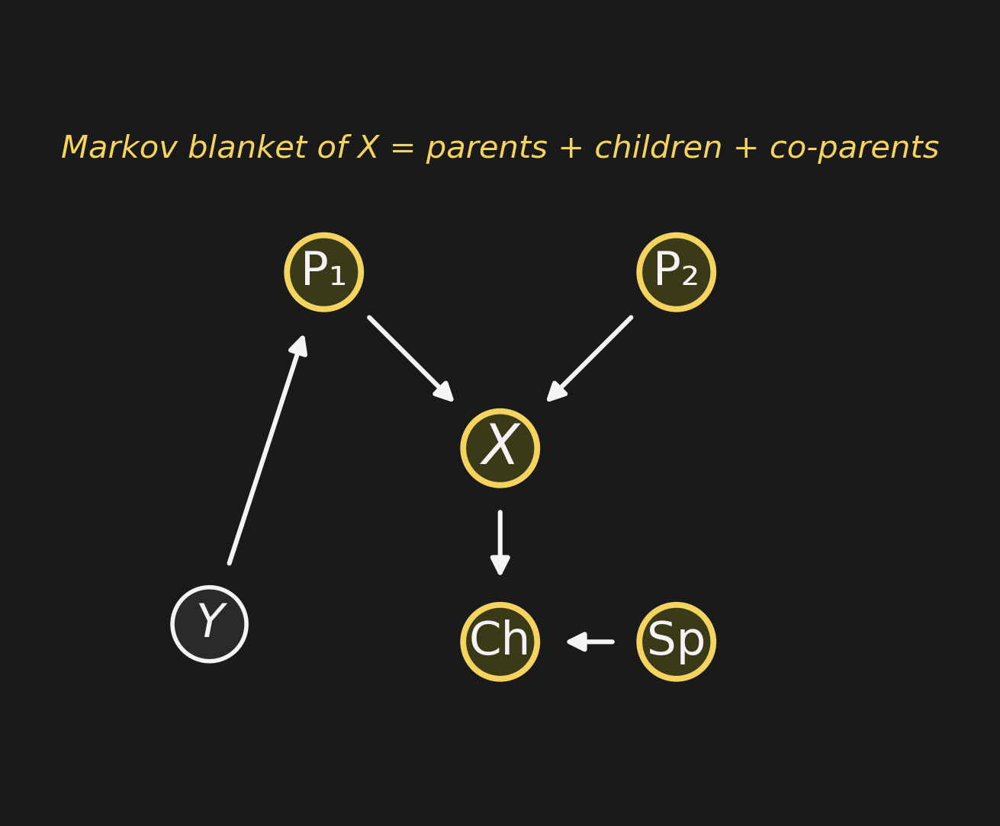{fig-align="center" width="100%"}
:::

::::

::: {.notes}
~90 sec. The spouses bit is the non-obvious part — that's collider-conditioning
flowing through children's other parents. Use the figure to point.
:::

## [Bayes-Ball: interactive demo]{.lang-en}[ベイズボール：インタラクティブデモ]{.lang-ja}

<iframe src="widgets/bayes_ball.html"
        width="100%" height="460"
        frameborder="0"
        style="background: #1a1a1a; border-radius: 4px;">
</iframe>

::: {.notes}
The widget runs 3 scripted scenarios:
1. Chain with B conditioned — ball blocks at B.
2. Collider with B not conditioned — ball blocks at B.
3. Collider with B conditioned — ball passes through to C.

Keyboard: 1/2/3 to pick scenario; space or arrow-right to step; r to reset.
Each scenario takes ~90 sec to run through. Don't open-ended-explore.
~5 min total for the widget.
:::

## [Poll — collider conditioning]{.lang-en}[ポール — コライダーの条件付け]{.lang-ja}

::: {.lang-en}
You see the cafeteria worker reveal a bento (not Chibany's pick, not tonkatsu).
You haven't been told which bento Chibany picked. Does the worker's choice
tell you anything about Chibany's pick?
:::

::: {.lang-ja}
店員がお弁当を1つ公開する（チバニーの選択でもなく、トンカツでもない）。
チバニーがどれを選んだかはまだ知らない。店員の選択は、チバニーの選択について
何か教えてくれるだろうか？
:::

::: {.fragment}
::: {.lang-en}
- **A.** Yes — the worker's choice and Chibany's pick become dependent.
- **B.** No — they were independent before, so they're still independent.
- **C.** Only if you also know which bento has the tonkatsu.
- **D.** Chibany's pick was random, so nothing tells you about it.
:::

::: {.lang-ja}
- **A.** はい — 店員の選択とチバニーの選択は従属になる。
- **B.** いいえ — もともと独立だったので、今も独立。
- **C.** トンカツの位置も知っている場合のみ。
- **D.** チバニーの選択はランダムなので、何も教えてくれない。
:::
:::

::: {.notes}
~60 sec. (B) is the natural mistake — that's exactly the misconception we
need to dislodge. Watch for students who pick it; they need to see Block 5
(explaining away) for the resolution.
:::

## [Poll — answer]{.lang-en}[ポール — 答え]{.lang-ja} {.bigger}

[**A.** Yes — collider conditioning induces dependence.]{.lang-en .yellow}[**A.** はい — コライダーの条件付けは依存性を生み出す。]{.lang-ja .yellow}

::: {.lang-en}
The worker's choice constrains Chibany's pick: if the worker opened box 3,
Chibany must have picked box 1 or 2 (otherwise the worker would have opened
something else). The choices are now correlated *through* the constraint.

This is **explaining away** — Block 5.
:::

::: {.lang-ja}
店員の選択はチバニーの選択を制約する：店員が3番を開けたなら、
チバニーは1番か2番を選んだに違いない（さもなければ店員は別の箱を開けたはず）。
2つの選択は制約 *を通じて* 相関する。

これが **説明はがし** — ブロック5。
:::

::: {.notes}
~60 sec. Pay off the surprise. The reasoning is "given what we observed, what
ASSIGNMENTS to the parents are consistent?" — and that's a constraint on the
joint over parents, which means they're now dependent.
:::

# [Explaining away]{.lang-en}[説明はがし]{.lang-ja} {.section-break background-image="../../sds-reveal/sds_frame.png" background-size="cover"}

## [Sprinkler / Rain / Wet grass]{.lang-en}[スプリンクラー / 雨 / 濡れた芝生]{.lang-ja} {.smaller}

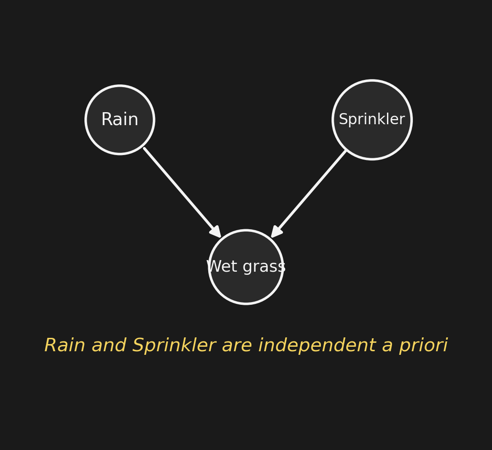{fig-align="center" width="68%"}

::: {.lang-en}
Three nodes: **Rain** ($R$), **Sprinkler** ($S$), **Wet grass** ($W$). Two independent causes of wet grass. A priori,
$$P(R) = 0.3, \quad P(S) = 0.3, \quad P(R, S) = P(R)\,P(S).$$
Rain and Sprinkler are **independent**. The grass is wet if **either** cause fires:
$$W = 1 \iff (R = 1)\ \text{or}\ (S = 1). \quad\text{(deterministic OR)}$$

[$R$, $S$, $W$ from here on.]{.dim}
:::

::: {.lang-ja}
3つのノード：**雨** ($R$)、**スプリンクラー** ($S$)、**濡れた芝生** ($W$)。濡れた芝生の独立な2つの原因。事前分布は、
$$P(R) = 0.3, \quad P(S) = 0.3, \quad P(R, S) = P(R)\,P(S).$$
雨とスプリンクラーは **独立**。**どちらか** の原因が起これば芝生は濡れる：
$$W = 1 \iff (R = 1)\ \text{または}\ (S = 1). \quad\text{(決定的 OR)}$$

[以降、$R$, $S$, $W$ と略記。]{.dim}
:::

::: {.notes}
~60 sec. Establish the baseline: nothing observed, both causes are independent
of each other. Standard collider setup.
:::

## [Observe wet grass]{.lang-en}[濡れた芝生を観測]{.lang-ja} {.smaller}

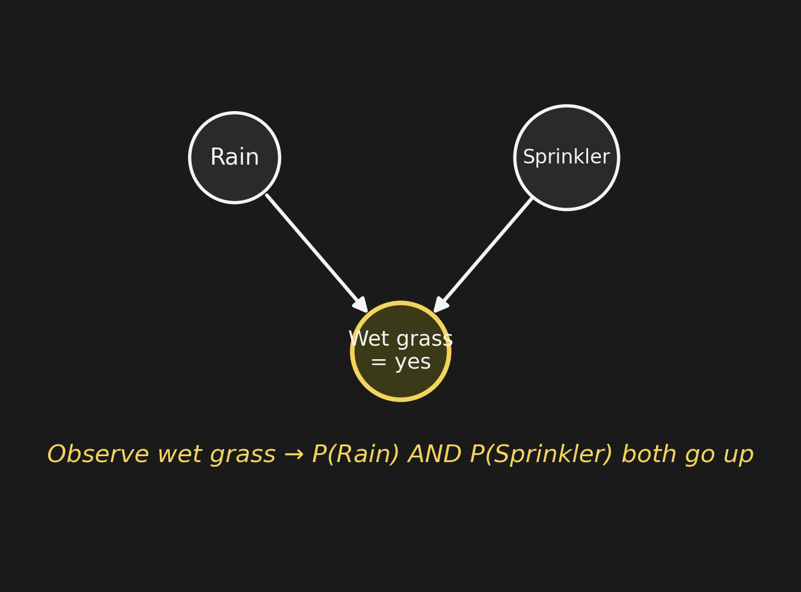{fig-align="center" width="68%"}

::: {.lang-en}
Now we walk outside: the grass is wet ($W = 1$). Both probabilities **rise**:
$$P(R \mid W) \approx 0.59, \quad P(S \mid W) \approx 0.59.$$
Either cause is now more plausible — the observation supports both.
:::

::: {.lang-ja}
さて、外に出ると：芝生が濡れている ($W = 1$)。両方の確率が **上がる**：
$$P(R \mid W) \approx 0.59, \quad P(S \mid W) \approx 0.59.$$
どちらの原因も今や確からしくなる — 観測は両方を支持する。
:::

::: {.notes}
~75 sec. The "competition" hasn't happened yet — the wetness elevates both
hypotheses. Under the deterministic OR these are exact: P(R|W) = P(S|W) =
10/17 ≈ 0.59 (0.3 → 0.59, roughly doubled).
:::

## [Also learn sprinkler was on]{.lang-en}[さらに、スプリンクラーが作動していたと知る]{.lang-ja} {.smaller}

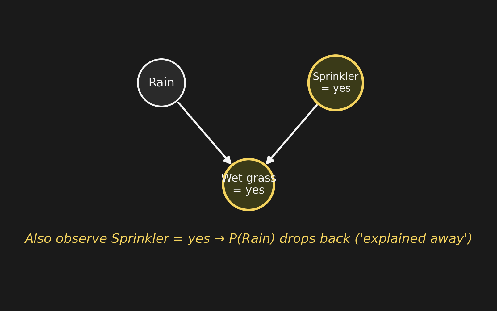{fig-align="center" width="68%"}

::: {.lang-en}
A neighbor mentions: "I saw your sprinkler running this morning." So $S = 1$. Now:
$$P(R \mid W, S = 1) = 0.3 = P(R).$$
Rain's probability **drops all the way back to its prior** — sprinkler already
"explains" the wetness, so wet grass tells us **nothing more** about rain.

**Conditioning on the collider's parents *and* the collider itself induces this
competition.** That's explaining away.
:::

::: {.lang-ja}
近所の人が言う：「今朝あなたのスプリンクラーが動いているのを見たよ。」つまり $S = 1$。今度は：
$$P(R \mid W, S = 1) = 0.3 = P(R).$$
雨の確率が **事前分布まで完全に戻る** — スプリンクラーが濡れていることを既に「説明」したので、
濡れた芝生は雨について **もう何も教えてくれない**。

**コライダーの親 *と* コライダー自身に条件付けることで、この競合が生まれる。**
これが説明はがし。
:::

::: {.notes}
~90 sec. THE key numerical reveal. Rain went 0.3 → 0.59 → 0.30 — it rises on
wet grass, then returns EXACTLY to its prior once the sprinkler is known on.
With a deterministic OR, S=1 makes wet grass certain regardless of rain, so W
carries zero further information about R: P(R|W,S=1) = P(R) = 0.3 exactly. The
sprinkler fully "explains" the wetness. (A noisy OR would leave R slightly
above prior — the residual is the signature of non-determinism; we keep the
clean deterministic version here.) Aside worth saying aloud: if instead the
grass were wet with S=0, only rain is left to explain it, so P(R|W,S=0)=1.
:::

## [What just happened]{.lang-en}[今、何が起きたのか]{.lang-ja}

:::: {.columns}

::: {.column width="48%"}
::: {.lang-en}
**The numbers:**

| Conditioning set | $P(R = 1)$ |
|---|---:|
| nothing | 0.30 |
| $W = 1$ | 0.59 |
| $W = 1,\, S = 1$ | 0.30 |

Rain rose, then fell back to its prior. The fall is **explaining away**.
:::

::: {.lang-ja}
**数値の変化：**

| 条件付け | $P(R = 1)$ |
|---|---:|
| なし | 0.30 |
| $W = 1$ | 0.59 |
| $W = 1,\, S = 1$ | 0.30 |

雨の確率は上がり、事前分布まで戻った。下がる部分が **説明はがし**。
:::
:::

::: {.column width="48%"}
::: {.lang-en}
**The take-home in one sentence:**

Conditioning on a common effect (the collider) makes the independent causes
*dependent*. Then learning one cause *reduces* the support for the other.

Same mechanism, two stages.
:::

::: {.lang-ja}
**一文でまとめると：**

共通の結果（コライダー）に条件付けると、独立だった原因が *従属になる*。
そして一つの原因を学ぶと、もう一つの原因への支持が *減る*。

同じメカニズム、2つの段階。
:::
:::

::::

::: {.notes}
~75 sec. The two-column summary. Numbers on the left, take-home on the right.
The "two stages" framing is important: stage 1 = conditioning on the collider
induces dependence; stage 2 = the dependence is a competition for explaining
the observation.
:::

## [Why Chibany should switch — explained]{.lang-en}[チバニーが箱を変えるべき理由 — 説明はがしで]{.lang-ja} {.midbig}

::: {.lang-en}
Remember Monty Hall? Tonkatsu and Chibany's pick were independent a priori.
We then conditioned on the **collider** (the worker's reveal).

That's explaining away.

The worker had to open *some* box. If Chibany picked correctly (T = 1), the
worker had a free choice. If Chibany picked wrong (T ≠ 1), the worker was
*forced* to open the specific other box. The "forcing" is what makes the
posterior favor switching.
:::

::: {.lang-ja}
モンティ・ホールを覚えていますか？トンカツとチバニーの選択は、事前には独立でした。
そして **コライダー**（店員の公開）に条件付けた。

それが説明はがし。

店員は *どれか* 箱を開けないといけない。もしチバニーが正解を選んでいたら（T = 1）、
店員には自由な選択肢があった。もし間違っていたら（T ≠ 1）、店員は特定の箱を
開けるしか *なかった*。この「強制」が、事後分布を「変える」方に傾けるのです。
:::

::: {.notes}
~90 sec. Tie the threads: Monty Hall WAS explaining away, all along. The
worker's reveal is the collider; conditioning on it makes Chibany's pick and
tonkatsu location dependent — which is what gives us the 2/3 answer.
:::

## [Break]{.lang-en}[休憩]{.lang-ja} {.section-break .photo-break background-image="images/callieOnChairMay2026.jpg" background-size="cover" background-position="center"}

::: {.notes}
10-min break. The cat is Callie on her chair. Stretch, hydrate. We're at 1:12,
returning at 1:22 for the causal half.
:::

# [Observation → intervention]{.lang-en}[観測 → 介入]{.lang-ja} {.section-break background-image="../../sds-reveal/sds_frame.png" background-size="cover"}

## [A claim from the dentist]{.lang-en}[歯医者からの主張]{.lang-ja} {.bigger}

::: {.lang-en}
Chibany is at the dentist. "People with yellow teeth," the dentist says, "tend
to have higher rates of lung cancer."

Chibany asks: "Should I whiten my teeth?"
:::

::: {.lang-ja}
チバニーは歯医者で。「歯が黄色い人は」と歯医者が言う、「肺がんの率が高い傾向がある。」

チバニーが聞く：「歯を白くしたほうがいい？」
:::

::: {.notes}
~45 sec. Set up the joke; the answer is obviously no. The interesting question
is WHY no. The DAG language we just developed gives us the precise answer.
:::

## [The confound]{.lang-en}[共通原因（交絡）]{.lang-ja} {.smaller}

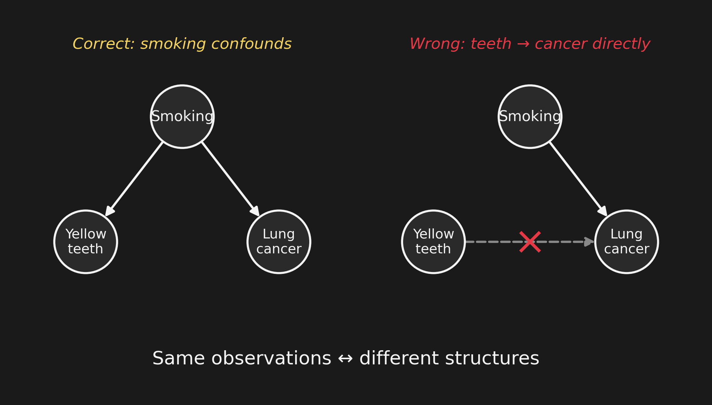{fig-align="center" width="82%"}

::: {.lang-en}
Three variables: **Smoking** ($S$), **Yellow teeth** ($T$), **Lung cancer** ($L$). Two structures give *exactly the same* statistical correlation:

- $S$ causes both $T$ and $L$ (correct).
- $T$ directly causes $L$ (wrong, but observationally indistinguishable).

**Observation alone cannot tell them apart.** You'd see the same correlation either way.

[$S$, $T$, $L$ from here on.]{.dim}
:::

::: {.lang-ja}
3つの変数：**喫煙** ($S$)、**黄色い歯** ($T$)、**肺がん** ($L$)。2つの構造が *まったく同じ* 統計的相関を生む：

- $S$ が $T$ と $L$ の両方の原因（正しい）。
- $T$ が直接 $L$ を引き起こす（誤りだが、観測上は区別できない）。

**観測だけではこの2つを区別できません。** どちらの構造でも同じ相関が見られる。

[以降、$S$, $T$, $L$ と略記。]{.dim}
:::

::: {.notes}
~90 sec. The point: correlation under-determines causal structure. To
distinguish, you need *something more* — and that's what intervention gives
you.
:::

## [Three causal stories, one correlation: chain]{.lang-en}[1つの相関、3つの因果ストーリー：チェーン]{.lang-ja} {.smaller}

{fig-align="center" width="62%"}

::: {.lang-en}
**Story 1 (chain):** $T \to S \to L$ — yellow teeth cause smoking,
smoking causes lung cancer. Implausible, but observationally consistent.

Conditional independence: $T \perp L \mid S$.
:::

::: {.lang-ja}
**ストーリー1（チェーン）:** $T \to S \to L$ — 黄色い歯が喫煙の原因で、
喫煙が肺がんの原因。実際にはありそうにないが、観測上は整合的。

条件付き独立性: $T \perp L \mid S$。
:::

::: {.notes}
~45 sec. Walk through the first story. Each story is observationally
consistent with the same correlation between T and L — that's the point.
:::

## [Three causal stories, one correlation: fork]{.lang-en}[1つの相関、3つの因果ストーリー：フォーク]{.lang-ja} {.smaller}

{fig-align="center" width="62%"}

::: {.lang-en}
**Story 2 (fork):** $T \leftarrow S \to L$ — smoking causes both. The
*real* story for the smoking-yellow-teeth-cancer triangle.

Conditional independence: $T \perp L \mid S$.

**Identical to chain!** Observation cannot tell these apart.
:::

::: {.lang-ja}
**ストーリー2（フォーク）:** $T \leftarrow S \to L$ — 喫煙が両方の原因。
喫煙-黄色い歯-肺がんの三角関係の *本当の* ストーリー。

条件付き独立性: $T \perp L \mid S$。

**チェーンと同一！** 観測ではこの2つを区別できません。
:::

::: {.notes}
~45 sec. THE key reveal: chain and fork are observationally identical.
Same conditional-independence pattern. Same joint distribution. The arrows
point different ways but observation can't see arrowheads.
:::

## [Three causal stories, one correlation: collider]{.lang-en}[1つの相関、3つの因果ストーリー：コライダー]{.lang-ja} {.smaller}

{fig-align="center" width="62%"}

::: {.lang-en}
**Story 3 (collider):** $T \to S \leftarrow L$ — yellow teeth and lung cancer
each independently cause smoking (also implausible, but bear with it).

Conditional dependence: $T \not\perp L \mid S$.

**Observationally distinct** — but the wrong structure for a smoking confound.
Most real-world confounds are forks, indistinguishable from chains.
:::

::: {.lang-ja}
**ストーリー3（コライダー）:** $T \to S \leftarrow L$ — 黄色い歯と肺がんが
それぞれ独立に喫煙の原因（これもありそうにないが、お付き合いください）。

条件付き従属性: $T \not\perp L \mid S$。

**観測で区別できる** — しかし、喫煙の交絡には合わない構造。
現実の交絡の多くはフォークで、チェーンとは区別できません。
:::

::: {.notes}
~45 sec. Collider is observationally distinct from chain/fork — but it's not
the structure we worry about for confounding. The under-determination of
chain-vs-fork is the actual problem.
:::

## [What we need]{.lang-en}[必要なもの]{.lang-ja} {.midbig}

:::: {.columns}

::: {.column width="48%"}
::: {.lang-en}
**What observation tells you:**

- statistical dependence
- joint distribution
- can't disambiguate chain from fork

This is **Level 1** of Pearl's ladder.
:::

::: {.lang-ja}
**観測が教えてくれること：**

- 統計的従属性
- 同時分布
- チェーンとフォークの区別はつかない

これがパールの梯子の **レベル1**。
:::
:::

::: {.column width="48%"}
::: {.lang-en}
**What intervention would do:**

- cut incoming arrows
- reveal the cause
- break Markov equivalence

This is **Level 2** — coming up next.
:::

::: {.lang-ja}
**介入なら何ができるか：**

- 入ってくる矢印を切る
- 原因を明らかにする
- マルコフ同値を破る

これが **レベル2** — 次に登場。
:::
:::

::::

::: {.notes}
~60 sec. Set up Block 7. Pearl's ladder: Level 1 = seeing, Level 2 = doing,
Level 3 = counterfactuals. We'll stay on 1 and 2.
:::

# [The do-operator]{.lang-en}[do演算子]{.lang-ja} {.section-break background-image="../../sds-reveal/sds_frame.png" background-size="cover"}

## [The original network]{.lang-en}[元のネットワーク]{.lang-ja} {.smaller}

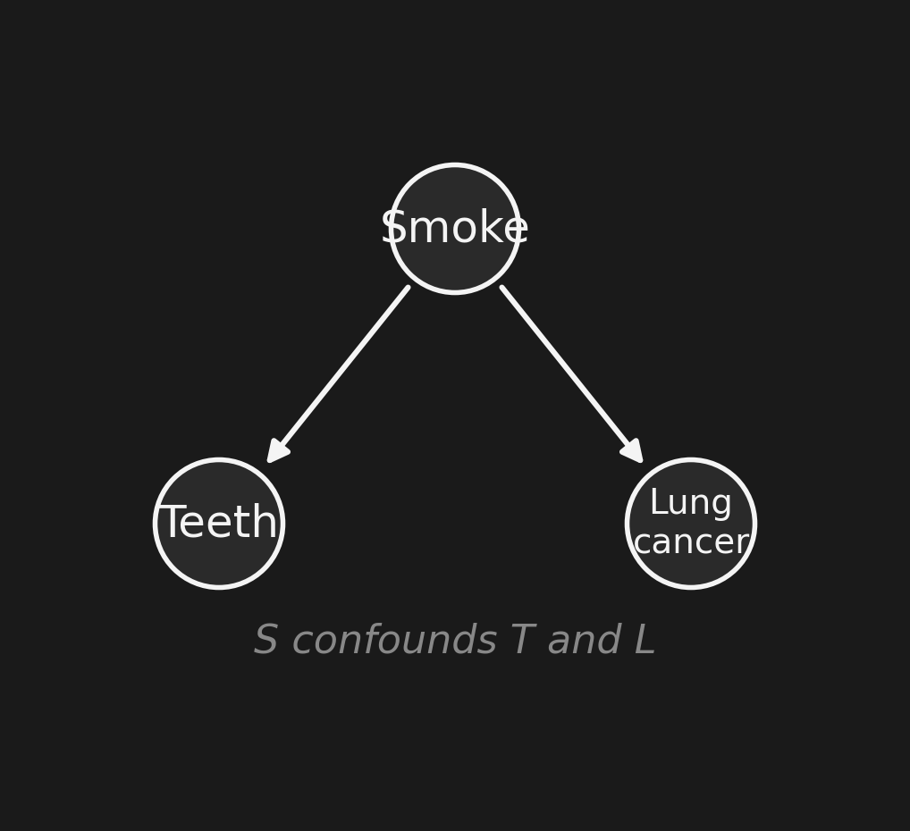{fig-align="center" width="68%"}

::: {.lang-en}
$S \to T$ (smoking causes yellow teeth), $S \to L$ (smoking causes lung cancer).
$T$ and $L$ are correlated *because of* the common cause $S$.

If we **observe** $T = \text{yellow}$, we update our belief about $S$, and
*therefore* about $L$. Hence $P(L \mid T = \text{yellow}) > P(L)$.
:::

::: {.lang-ja}
$S \to T$（喫煙が歯を黄色くする）、$S \to L$（喫煙が肺がんの原因）。
$T$ と $L$ は共通原因 $S$ *を通じて* 相関する。

$T = \text{黄色}$ を **観測** すると、$S$ についての信念が更新され、
*そのため* $L$ についても更新される。だから $P(L \mid T = \text{黄色}) > P(L)$。
:::

::: {.notes}
~60 sec. Establish the observational baseline: P(L|T) > P(L). That's the
"yellow teeth correlate with cancer" claim from the dentist.
:::

## [do(T = white): cut the incoming arrow]{.lang-en}[do(T = 白): 入ってくる矢印を切る]{.lang-ja} {.smaller}

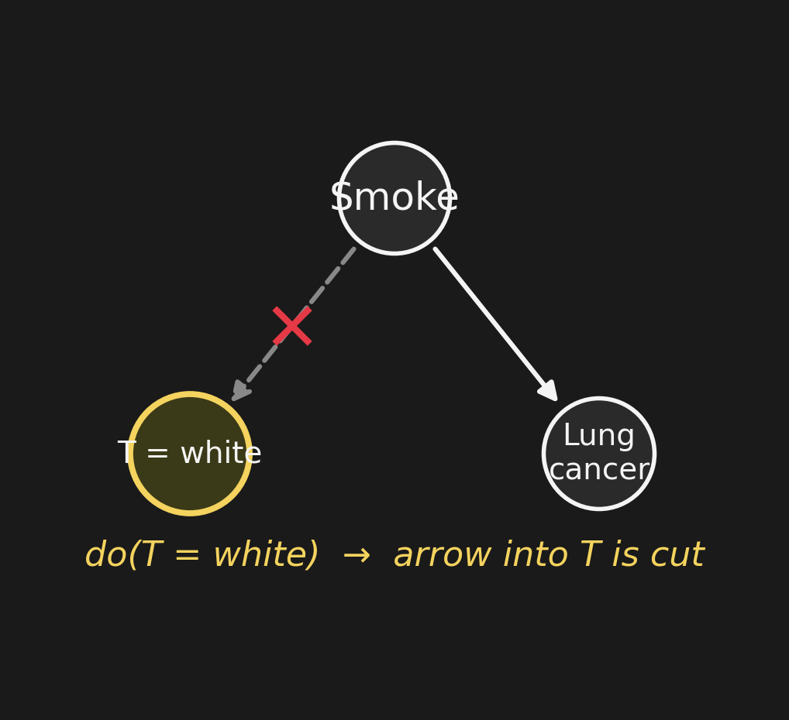{fig-align="center" width="68%"}

::: {.lang-en}
**Graph surgery.** We set $T = \text{white}$ by intervention — we paid for whitening.
The intervention **cuts the incoming arrow** $S \to T$.

Why cut? Because $T$ is no longer being *generated* by smoking. $T$ is being
generated by Chibany's wallet. The mechanism changed.
:::

::: {.lang-ja}
**グラフ手術.** 介入によって $T = \text{白}$ にする — 歯を白くする処置にお金を払った。
介入は **入ってくる矢印** $S \to T$ **を切断する**。

なぜ切る？$T$ はもはや喫煙によって *生成されていない* から。$T$ はチバニーの財布に
よって生成されている。メカニズムが変わったのです。
:::

::: {.notes}
~90 sec. THE key conceptual move. Spend time on this: "the mechanism that
generates T has changed." Pearl's phrasing: do() replaces the conditional
probability table for T with a fixed value.
:::

## [Compute P(L | do(T = white))]{.lang-en}[P(L | do(T = 白)) を計算]{.lang-ja} {.smaller}

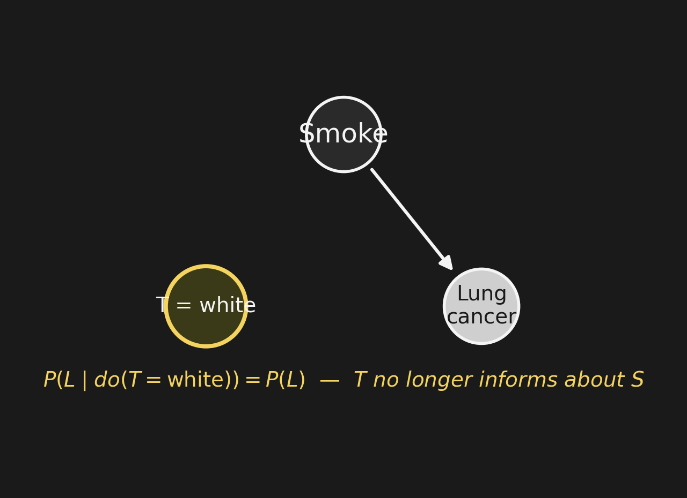{fig-align="center" width="68%"}

::: {.lang-en}
After surgery, $T$ has no parents. The factorization becomes:
$$P(S, L, T = \text{white}) = P(S) \, P(L \mid S).$$

Marginalize over $S$ to get $P(L \mid do(T = \text{white}))$:
$$P(L \mid do(T = \text{white})) = \sum_S P(L \mid S) \, P(S) = P(L).$$

**Intervention severed the path from $T$ back to $L$ through $S$.**
$T$ no longer carries any information about $S$, so knowing $T$ tells you nothing new about $L$.
:::

::: {.lang-ja}
手術後、$T$ には親がない。因数分解は次のようになる：
$$P(S, L, T = \text{白}) = P(S) \, P(L \mid S).$$

$S$ について周辺化して $P(L \mid do(T = \text{白}))$ を得る：
$$P(L \mid do(T = \text{白})) = \sum_S P(L \mid S) \, P(S) = P(L).$$

**介入は $T$ から $S$ を経由して $L$ へ戻る経路を断ち切った。**
$T$ はもう $S$ について何の情報も運ばないので、$T$ を知っても $L$ について新しいことは何も分からない。
:::

::: {.notes}
~2 min. Show the marginalization step explicitly. The intuition: in the
observational world, T was a SIGNAL of S; in the intervened world, T is just
a value we set, with no relation to S.
:::

## [$P(L \mid T)$ vs. $P(L \mid do(T))$]{.lang-en}[$P(L \mid T)$ vs. $P(L \mid do(T))$]{.lang-ja} {.smaller}

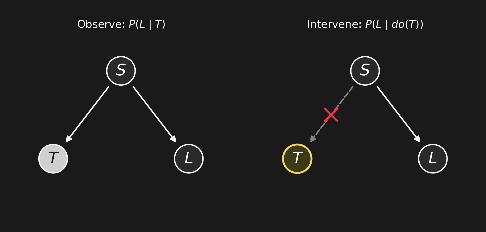{fig-align="center" width="100%"}

::: {.lang-en}
**Same notation, different operation, different answer.**

- $P(L \mid T)$: passive observation. Yellow teeth tell you about smoking.
- $P(L \mid do(T))$: active intervention. Yellow teeth tell you about the dentist's bill.
:::

::: {.lang-ja}
**同じ記号、違う操作、違う答え。**

- $P(L \mid T)$: 受動的な観測。黄色い歯は喫煙について教えてくれる。
- $P(L \mid do(T))$: 能動的な介入。黄色い歯は歯科医の請求書について教えてくれる。
:::

::: {.notes}
~60 sec. The two-column side-by-side. Drive home: the SAME mathematical
syntax (P(L | something)) means TWO DIFFERENT THINGS depending on whether the
"something" is observed or intervened.
:::

## [Poll — do vs. condition]{.lang-en}[ポール — do vs. 条件付け]{.lang-ja}

::: {.lang-en}
In the smoking network $S \to T, S \to L$, Chibany pays to whiten their teeth
(intervention: $T = \text{white}$).

What is $P(\text{lung cancer} \mid do(T = \text{white}))$?
:::

::: {.lang-ja}
喫煙ネットワーク $S \to T, S \to L$ で、チバニーがお金を払って歯を白くする
（介入：$T = \text{白}$）。

$P(\text{肺がん} \mid do(T = \text{白}))$ は？
:::

::: {.fragment}
::: {.lang-en}
- **A.** Lower than $P(\text{lung cancer})$ — white teeth predict less smoking.
- **B.** Same as $P(\text{lung cancer})$ — intervention cuts the $S \to T$ edge.
- **C.** Higher than $P(\text{lung cancer})$ — paint chemicals are toxic.
- **D.** Unknown without more data.
:::

::: {.lang-ja}
- **A.** $P(\text{肺がん})$ より低い — 白い歯は喫煙の少なさを予測する。
- **B.** $P(\text{肺がん})$ と同じ — 介入は $S \to T$ の辺を切る。
- **C.** $P(\text{肺がん})$ より高い — 塗料の化学物質は有毒。
- **D.** データが足りない。
:::
:::

::: {.notes}
~75 sec. (A) is the seductive observational answer. (B) is correct: the
intervention severed the back-door path from T to L through S.
:::

## [Poll — answer]{.lang-en}[ポール — 答え]{.lang-ja} {.bigger}

[**B.** Same as $P(\text{lung cancer})$.]{.lang-en .yellow}[**B.** $P(\text{肺がん})$ と同じ。]{.lang-ja .yellow}

::: {.lang-en}
The intervention cuts the $S \to T$ edge. $T$ no longer informs about $S$,
and the path from $T$ to $L$ (which went through $S$) is severed.

**(A) is the trap** — it's the right answer if you *observe* $T$, but the
wrong answer if you *intervene* on $T$.
:::

::: {.lang-ja}
介入は $S \to T$ の辺を切る。$T$ はもう $S$ について何も教えてくれず、
$T$ から（$S$ を経由して）$L$ への経路は断ち切られた。

**(A) は罠** — $T$ を *観測* するなら正しい答え、$T$ に *介入* するなら間違った答え。
:::

::: {.notes}
~60 sec. Watch the room. If more than half pick (A), spend an extra 30 sec
on why — the temptation is the entire reason this poll exists.
:::

# [Causal cognition — the blicket detector]{.lang-en}[因果認知 — ブリケット検出器]{.lang-ja} {.section-break background-image="../../sds-reveal/sds_frame.png" background-size="cover"}

## [The blicket detector]{.lang-en}[ブリケット検出器]{.lang-ja} {.smaller}

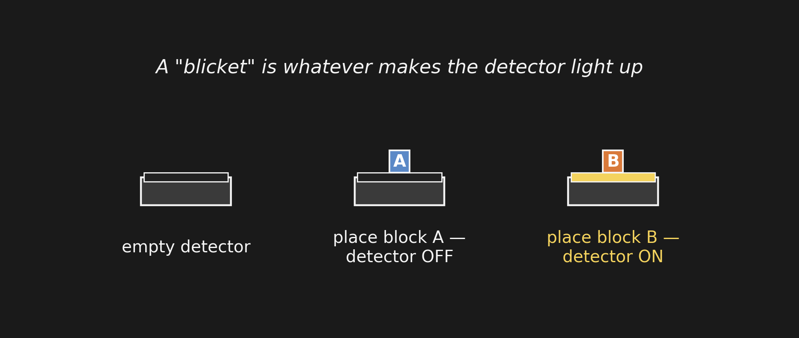{fig-align="center" width="92%"}

::: {.lang-en}
A children's experiment (Gopnik & Sobel, 2000). A "blicket" is whatever makes
the machine light up. Children watch blocks placed on the detector and
infer which blocks are blickets.
:::

::: {.lang-ja}
子ども向けの実験（ゴプニックとソベル、2000）。「ブリケット」とは、機械を光らせる
ものすべて。子どもは積み木が検出器に置かれるのを見て、どの積み木がブリケットかを推論する。
:::

::: {.notes}
~60 sec. Set up the experiment. The key: kids are doing causal inference,
not just statistical inference. They need to disentangle which block is doing
the work.
:::

## [The experiment as a Bayes net]{.lang-en}[ベイズネットとしての実験]{.lang-ja}

:::: {.columns}

::: {.column width="48%"}
::: {.lang-en}
**The physical setup:**

- A machine ("detector") that lights up.
- A collection of blocks. Each block is or isn't a blicket.
- Place blocks on the machine; observe whether it lights up.

The child's job: figure out which blocks are blickets.
:::

::: {.lang-ja}
**物理的な構造：**

- 光る機械（「検出器」）。
- いくつかの積み木。各積み木はブリケットかそうでないか。
- 積み木を機械に置く；光るかどうかを観測。

子どもの仕事：どの積み木がブリケットかを見つけ出す。
:::
:::

::: {.column width="48%"}
::: {.lang-en}
**The Bayes net:**

For two blocks $A$, $B$:

- $A$-blicket? → Detector lights
- $B$-blicket? → Detector lights

A **collider**: detector is the common effect.

Each trial **conditions on the collider**.
Inference is *explaining away*.
:::

::: {.lang-ja}
**ベイズネット：**

積み木 $A$、$B$ について：

- $A$ はブリケット？ → 検出器が光る
- $B$ はブリケット？ → 検出器が光る

**コライダー**：検出器が共通の結果。

各試行は **コライダーへの条件付け**。
推論は *説明はがし*。
:::
:::

::::

::: {.notes}
~90 sec. The two-column bridge: experiment on the left, Bayes net on the
right. Show the audience that they already have the formal tools to predict
what happens — it's a collider, two trials = two observations of the collider,
explaining away is the inference.
:::

## [Backwards blocking]{.lang-en}[バックワード・ブロッキング]{.lang-ja} {.smaller}

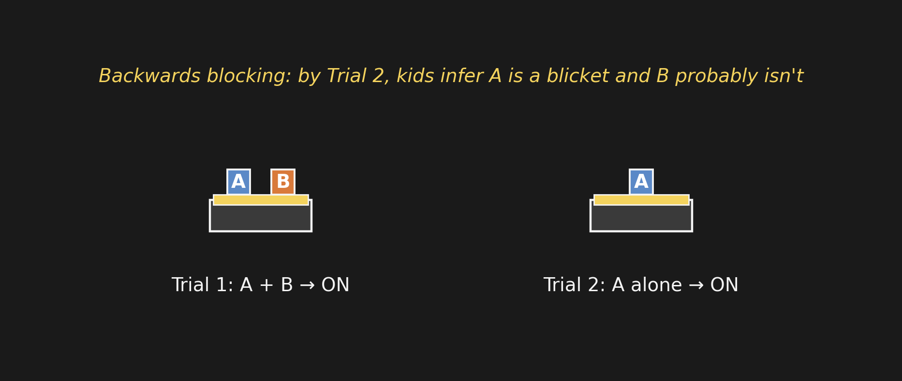{fig-align="center" width="92%"}

::: {.lang-en}
- **Trial 1:** A and B together → detector ON.
- **Trial 2:** A alone → detector ON.

After Trial 2, what do kids think about B?
:::

::: {.lang-ja}
- **試行1:** AとBを一緒に → 検出器 ON。
- **試行2:** Aだけ → 検出器 ON。

試行2の後、子どもはBについてどう思う？
:::

::: {.notes}
~60 sec. Pose the inference. A is clearly a blicket — alone, it turns on the
detector. What about B? After Trial 1 alone, B could go either way. After
Trial 2, A "explains" the Trial 1 result, and B's blicket-status drops.
:::

## [Children match the Bayes net]{.lang-en}[子どもはベイズネットと一致する]{.lang-ja} {.smaller}

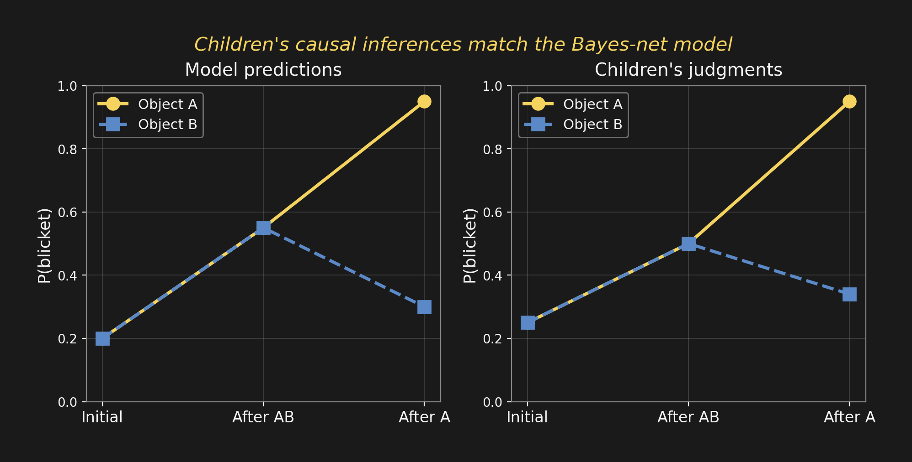{fig-align="center" width="100%"}

::: {.lang-en}
Children's judgments **drop** for object B after the A-alone trial — even though
nothing changed about B's data. **Children do graph surgery.** They reason
about the causal structure, not just statistical patterns.

The formal machinery isn't just for engineers.
:::

::: {.lang-ja}
子どもの判断は、Aだけの試行のあとBについて **下がる** — Bのデータについては
何も変わっていないのに。**子どもはグラフ手術をしている。** 統計パターンだけでなく、
因果構造について推論しているのです。

この形式的な仕組みは、エンジニアだけのものではありません。
:::

::: {.notes}
~75 sec. Cog-sci payoff. By age 3-4, children are doing exactly the
explaining-away reasoning we developed today. This is real cognition.
:::

## [Did the prior come back?]{.lang-en}[事前は戻ってくるか？]{.lang-ja} {.smaller}

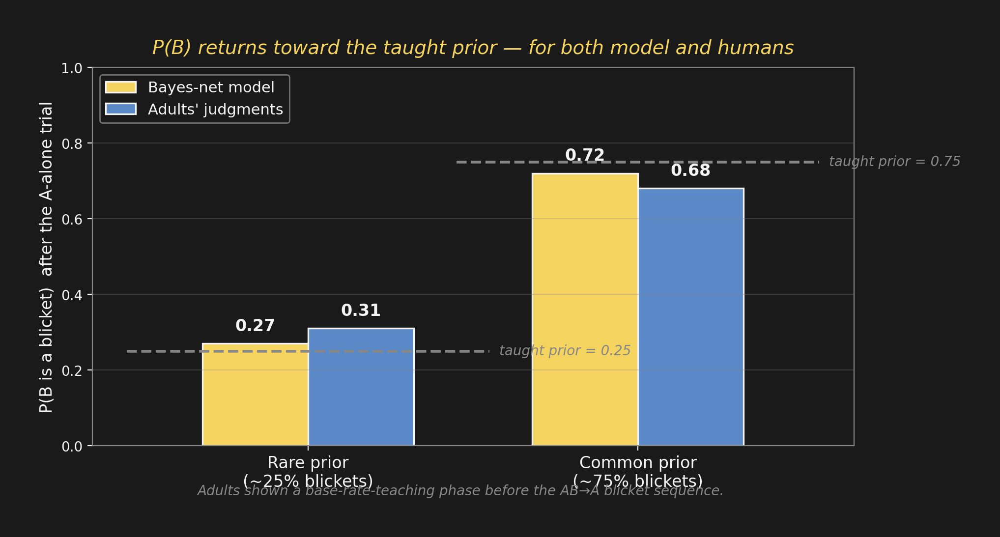{fig-align="center" width="100%"}

::: {.lang-en}
**Design.** Before the AB→A blicket sequence, adults watch a base-rate-teaching phase showing **~25%** ("rare prior") or **~75%** ("common prior") of arbitrary blocks are blickets. Then they run the classic backwards-blocking trials and rate $P(B)$.

**Bayes-net prediction.** After A alone explains the AB result, the posterior on $B$ should **relax back toward the taught prior**. Associative learning predicts a uniformly low rating regardless.

**Result.** Both the model AND adults snap $P(B)$ back to the taught base rate — strong evidence that adults are reasoning *Bayesianly* over a causal graph, not just learning associations.
:::

::: {.lang-ja}
**設計：** AB→A の試行の前に、大人は「任意のブロックがブリケットである率」が **~25%**（rare 事前）か **~75%**（common 事前）かを学習する映像を見る。その後、定番の後方ブロッキング試行を行い $P(B)$ を評価する。

**ベイズネットの予測：** A だけの試行が AB の結果を「説明」した後、$B$ の事後分布は **教えられた事前に戻る**。連合学習の予測は、教えた率に関係なく一律に低い評価。

**結果：** モデルも大人も $P(B)$ を教えられた基準率に戻す — 大人は連合ではなく、因果グラフ上で *ベイズ的に* 推論している強い証拠。
:::

::: {.notes}
~90 sec. THE prior-manipulation result. The classic Sobel/Tenenbaum/Gopnik
backwards-blocking design with a taught base rate added before the AB→A
trials. The discriminating test: after A explains the AB result, where does
B's posterior settle? Bayes net says "back to the prior you taught me";
associative learning predicts "uniformly low." Humans match the Bayesian
prediction across both conditions — same graph, two priors, two posterior
landings. This is the strongest demo today that causal Bayes nets are the
right cognitive model for adults, not just children.
:::

# [Information theory + close]{.lang-en}[情報理論 + まとめ]{.lang-ja} {.section-break background-image="../../sds-reveal/sds_frame.png" background-size="cover"}

## [Entropy as expected surprise]{.lang-en}[エントロピー：期待される驚き]{.lang-ja}

::: {.lang-en}
Define the **surprise** of seeing event $X = x$ as

$$\text{surprise}(x) \;=\; \log \frac{1}{P(x)} \;=\; -\log P(x).$$

[Smaller probability → larger surprise. The minus sign is there because $\log P(x) \le 0$ when $P(x) \le 1$, so $-\log P(x) \ge 0$ — surprise is non-negative.]{.dim}

| Event probability | Surprise (bits) |
|---|---:|
| $P(x) = 1$ (certain) | $0$ |
| $P(x) = 1/2$ (fair coin) | $1$ |
| $P(x) = 0.01$ (rare) | $\approx 6.6$ |

**Entropy** $H(X)$ is the *expected* surprise:

$$H(X) \;=\; \sum_x P(x) \cdot \big[-\log P(x)\big] \;=\; \mathbb{E}\!\left[-\log P(X)\right].$$
:::

::: {.lang-ja}
事象 $X = x$ を観測したときの **驚き** を次のように定義する：

$$\text{驚き}(x) \;=\; \log \frac{1}{P(x)} \;=\; -\log P(x).$$

[確率が小さいほど驚きが大きい。マイナス符号は、$P(x) \le 1$ のとき $\log P(x) \le 0$ なので、$-\log P(x) \ge 0$ — 驚きが非負になるように。]{.dim}

| 事象の確率 | 驚き (ビット) |
|---|---:|
| $P(x) = 1$（確実） | $0$ |
| $P(x) = 1/2$（公正なコイン） | $1$ |
| $P(x) = 0.01$（まれ） | $\approx 6.6$ |

**エントロピー** $H(X)$ は驚きの *期待値*：

$$H(X) \;=\; \sum_x P(x) \cdot \big[-\log P(x)\big] \;=\; \mathbb{E}\!\left[-\log P(X)\right].$$
:::

::: {.notes}
~60 sec. Entropy = expected surprise. Surprise is -log(P). One sentence each
for the three examples.
:::

## [Mutual information]{.lang-en}[相互情報量]{.lang-ja} {.smaller}

::: {.lang-en}
How much does knowing $Y$ reduce uncertainty about $X$?
$$I(X; Y) \;=\; H(X) - H(X \mid Y)$$

Properties:

- $I(X; Y) \geq 0$ always.
- $I(X; Y) = 0 \iff X \perp Y$.
- $I(X; Y) = I(Y; X)$ — symmetric.

Conditional version:
$$I(X; Y \mid Z) = H(X \mid Z) - H(X \mid Y, Z).$$
$X \perp Y \mid Z$ iff $I(X; Y \mid Z) = 0$.
:::

::: {.lang-ja}
$Y$ を知ることは、$X$ についての不確実性をどれだけ減らすか？
$$I(X; Y) \;=\; H(X) - H(X \mid Y)$$

性質：

- $I(X; Y) \geq 0$ 常に。
- $I(X; Y) = 0 \iff X \perp Y$。
- $I(X; Y) = I(Y; X)$ — 対称。

条件付き版：
$$I(X; Y \mid Z) = H(X \mid Z) - H(X \mid Y, Z).$$
$X \perp Y \mid Z$ は $I(X; Y \mid Z) = 0$ と同値。
:::

::: {.notes}
~75 sec. The symmetry is the surprising property. Conditional MI is the
bridge to today's d-separation work.
:::

## [The collider, in info-theoretic clothing]{.lang-en}[コライダー、情報理論で]{.lang-ja}

::: {.lang-en}
Take the Sprinkler / Rain / Wet-Grass collider:

- $I(\text{Rain}; \text{Sprinkler}) = 0$ — independent a priori.
- $I(\text{Rain}; \text{Sprinkler} \mid \text{Wet}) > 0$ — dependent after conditioning.

**Conditioning on a collider creates mutual information from nothing.**

That's explaining away — viewed through a different lens. Info theory and
Bayes nets are two languages describing the same structural facts.
:::

::: {.lang-ja}
スプリンクラー / 雨 / 濡れた芝生 のコライダーを考える：

- $I(\text{雨}; \text{スプリンクラー}) = 0$ — 事前には独立。
- $I(\text{雨}; \text{スプリンクラー} \mid \text{濡れた}) > 0$ — 条件付け後は従属。

**コライダーへの条件付けは、無から相互情報量を生み出す。**

これが説明はがし — 別の視点から見たもの。情報理論とベイズネットは、
同じ構造的事実を記述する2つの言語です。
:::

::: {.notes}
~75 sec. THE punchline of the info-theory mini-block. Explaining away IS
mutual-information creation. KL divergence gets a wordless forward pointer
in next-week's preview.
:::

## [Next week — Week 6]{.lang-en}[来週 — 第6週]{.lang-ja} {.bigger}

::: {.lang-en}
**Markov chains + networks.** Random walks. Memory search.

**Reading:** Abbott, Austerweil & Griffiths (2012) — *Human memory search as
a random walk in a semantic network.*

We've spent today on the **structure** of multi-variable distributions.
Next week we **walk** on a network instead of conditioning on one.
:::

::: {.lang-ja}
**マルコフ連鎖とネットワーク。** ランダムウォーク。記憶検索。

**読み物:** Abbott, Austerweil & Griffiths (2012) — *Human memory search as
a random walk in a semantic network.*

今日はマルチ変数分布の **構造** について学びました。
来週はネットワークに条件付ける代わりに、その上を **歩く**。
:::

::: {.notes}
~30 sec. Hand-off. Two-week recap: this week was structure (conditional
independence), next week is dynamics (random walks). DPMM is in the
pre-read for context.
:::

## [Thanks]{.lang-en}[ありがとうございました]{.lang-ja} {.bigger}

::: {.lang-en}
Questions?

Office hours: by appointment. Slack me.

Reflections due before next Friday — pick any required or optional reading
from this week. 5 of 11 across the semester.
:::

::: {.lang-ja}
質問は？

オフィスアワー：予約制。Slack でご連絡を。

リフレクションは次の金曜日までに — 今週の必須または推薦の読み物どれでもOK。
学期を通して 11 回中 5 回。
:::

::: {.notes}
Close. Photo / icebreaker / Q&A as time permits.
:::
