## [Agenda]{.lang-en}[本日の予定]{.lang-ja} {.agenda .dense}

- [Welcome + a Markov chain you already know]{.lang-en}[ようこそ + すでに知っているマルコフ連鎖]{.lang-ja}  [0:00]{.time}
- [Markov chains: states, transitions, the Markov property]{.lang-en}[マルコフ連鎖：状態・遷移・マルコフ性]{.lang-ja}  [0:10]{.time}
- [Stationary distribution]{.lang-en}[定常分布]{.lang-ja}  [0:25]{.time}
- [Networks: graphs as structure]{.lang-en}[ネットワーク：構造としてのグラフ]{.lang-ja}  [0:40]{.time}
- [Random walk on a network]{.lang-en}[ネットワーク上のランダムウォーク]{.lang-ja}  [0:52]{.time}
- [Break]{.lang-en}[休憩]{.lang-ja}  [1:07]{.time}
- [Memory search as a random walk (Abbott 2012)]{.lang-en}[ランダムウォークとしての記憶探索（Abbott 2012）]{.lang-ja}  [1:12]{.time}
- [Network properties + PageRank + Week 7 bridge]{.lang-en}[ネットワークの性質 + PageRank + 第7週へ]{.lang-ja}  [1:48]{.time}

::: {.notes}
~2 min agenda. Today's spine: ONE idea, built three times, each more concrete.
(1) a Markov chain — states + a transition matrix; (2) a random walk on a
network — a Markov chain whose states are nodes; (3) memory search — your own
recall is a random walk on a semantic network (the required reading, Abbott
2012). Tell them: the thread connecting Week 5 (Bayes nets — directed graphs,
the "Markov" factorization) to today is that we now add TIME. No presentation
today; I cover the cognitive work myself. One break; polls throughout (the
stationary-distribution examples and the degree result).
:::

## [A Markov chain you already know]{.lang-en}[すでに知っているマルコフ連鎖]{.lang-ja} {.section-break background-image="../../sds-reveal/sds_frame.png" background-size="cover"}

::: {.notes}
Block 1. Open with the phenomenon, let students react, THEN name it
(show-before-tell). The Chibany bento chain. Also a one-slide admin note:
Assignment 2 (Generalization) is due Jun 19 — point at the walkthrough page.
:::

## [Admin — Assignment 2]{.lang-en}[連絡 — 課題2]{.lang-ja}

::: {.lang-en}
[**Assignment 2 (Generalization) is due Fri Jun 19, 8:00 PM** — worth 7.5%.]{.yellow}

- Build your own Bayesian generalization model: design a hypothesis space, then compute posteriors and predictions under weak vs. strong sampling.
- [**Walkthrough + stencils:** [hml.chibatech.dev/assignments.html](https://hml.chibatech.dev/assignments.html)]{.accent} — read the PDF first, then pick a stencil (GenJAX / Python / R), one-click "Open in Colab."
- Reminder: **3 free late days pooled** across the four programming assignments.
- Questions? **DM me, or drop them in the class channel.**
:::

::: {.lang-ja}
[**課題2（一般化）は6月19日（金）20:00締切** — 配点7.5%。]{.yellow}

- 自分のベイズ一般化モデルを作る：仮説空間を設計し、弱い／強いサンプリングのもとで事後分布と予測を計算。
- [**説明とひな形：** [hml.chibatech.dev/assignments.html](https://hml.chibatech.dev/assignments.html)]{.accent} — まずPDFを読み、ひな形（GenJAX／Python／R）を選んで「Open in Colab」を1クリック。
- 注意：4つのプログラミング課題で**共通の無料遅延3日**。
- 質問は **DM か、クラスチャンネルへ。**
:::

::: {.notes}
~1.5 min. Assignment 2 = Generalization, due Jun 19 (7.5%). This is the natural
week to point at it — it was assigned Week 4 and is now ~2 weeks out. Walk the
assignments page briefly (PDF + three stencils + Colab), don't re-derive the
math. Questions go to me directly (DM) or the class channel — there is no
dedicated #assignments channel. Then straight into Chibany.
:::

## [Chibany's bento habit]{.lang-en}[チバニーのお弁当のクセ]{.lang-ja} {.midbig}

::: {.lang-en}
[*New twist on Chibany this week:* students now bring Chibany **both** a **tonkatsu** and a **hamburger** bento every day — and Chibany **chooses** which one to eat.]{.dim}

There's a habit in the choosing: Chibany **loves tonkatsu**, so after a
tonkatsu day they usually want it *again* — but every so often they fancy a
change. And after a **hamburger** day, they almost always swing back to tonkatsu.

[If Chibany chose tonkatsu **yesterday**, what will they *probably* eat **today**? And does it matter what they ate **last Tuesday**?]{.yellow}
:::

::: {.lang-ja}
[*今週のチバニーの新展開：* 学生は毎日チバニーに **とんかつ** と **ハンバーグ** の弁当を**両方**届けるようになり、チバニーがどちらを食べるか**選ぶ**。]{.dim}

選び方にクセがある：チバニーは**とんかつが大好き**なので、とんかつの日の翌日は
たいてい*また*とんかつ — でもたまに気分を変えたくなる。そして**ハンバーグ**の
日の翌日は、ほぼ必ずとんかつに戻る。

[**昨日**チバニーがとんかつを選んだなら、**今日**はたぶん何を食べる? そして**先週の火曜**に何を食べたかは関係ある?]{.yellow}
:::

::: {.notes}
Show before tell. NOTE the deliberate narrative shift, called out in the dim
line: in Weeks 1-2 students BROUGHT bentos and we did inference on the hidden
contents (Chibany loves tonkatsu, 70/30 prior, opaque bentos). Here students
bring BOTH a tonkatsu and a hamburger bento each day, and Chibany CHOOSES one —
giving us an observable day-to-day SEQUENCE of choices, so we can study
dependence over time. That's what a Markov chain is about. Chibany uses
they/them. Let 2-3 students answer out loud. The key thing to elicit: to guess
today, you only need YESTERDAY — last Tuesday adds nothing once you know
yesterday. That instinct IS the Markov property. Hold the name back one
slide. ~2 min.
:::

## [Draw the habit]{.lang-en}[クセを図にする]{.lang-ja}

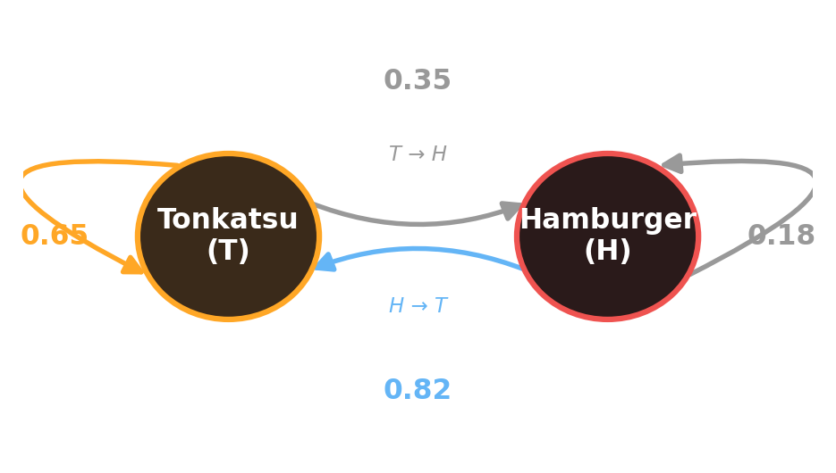{fig-align="center" width="74%"}

::: {.lang-en}
[Two **states** ($X_t$ = today's bento), arrows = probabilities of tomorrow's choice. Today depends **only** on yesterday. Chibany **loves tonkatsu**: sticks with it (0.65) and swings back to it after a burger (0.82).]{.dim}
:::

::: {.lang-ja}
[2つの**状態**（$X_t$ = 今日のお弁当）、矢印 = 明日の選択の確率。今日は**昨日だけ**に依存する。チバニーは**とんかつが大好き**：とんかつを続け（0.65）、ハンバーグの後はとんかつに戻る（0.82）。]{.dim}
:::

::: {.notes}
Introduce the symbol when you name the variable (CLAUDE.md rule): today's bento
is X_t, taking values T (tonkatsu) or H (hamburger). The transition probs are
tuned so the STATIONARY distribution is 70% T / 30% H — matching Chibany's
canonical "loves tonkatsu, 70/30". After tonkatsu: 0.65 stay, 0.35 switch.
After hamburger: 0.82 back to tonkatsu, 0.18 repeat. Each row sums to 1. Don't
work the stationary math here — just note tonkatsu is "stickier"; it pays off
in Block 3 when we compute the 70/30 stationary distribution. ~1 min.
:::

## [Markov]{.lang-en}[マルコフ]{.lang-ja}

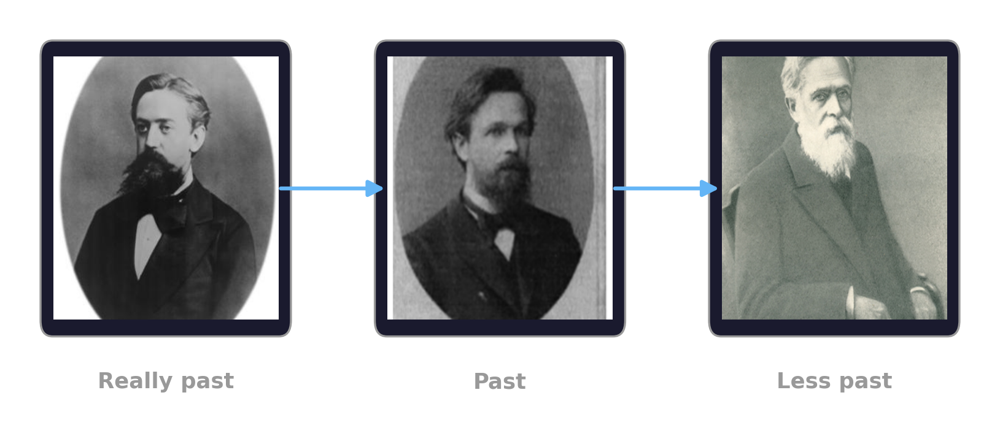{fig-align="center" width="80%"}

::: {.lang-en}
[**Given the present, the future is independent of the past.**]{.yellow}
:::
::: {.lang-ja}
[**現在を知れば、未来は過去と独立である。**]{.yellow}
:::

::: {.notes}
The Andrey Markov "Really Past / Past / Less Past" gag (same mathematician,
younger → older, left to right). The joke: it doesn't matter HOW far back you
go — once you know the present state, none of the past adds anything. This is
the intuition for the Markov property BEFORE the formula on the next slide. The
three photos are the actual SP25 deck images, composed into one figure so the
captions align and arrows show the progression. ~1 min — land the yellow line,
then formalize.
:::

## [Name it: the Markov property]{.lang-en}[名前をつける：マルコフ性]{.lang-ja} {.midbig}

::: {.lang-en}
[**The future is independent of the past, given the present.**]{.accent}

$$P(X_{t+1} \mid X_t, X_{t-1}, \dots, X_0) \;=\; P(X_{t+1} \mid X_t)$$

- Once you know **today** ($X_t$), the whole earlier history tells you nothing more about **tomorrow**.
- A sequence with this property is a [**Markov chain**]{.yellow}.
:::

::: {.lang-ja}
[**現在を知れば、未来は過去と独立である。**]{.accent}

$$P(X_{t+1} \mid X_t, X_{t-1}, \dots, X_0) \;=\; P(X_{t+1} \mid X_t)$$

- **今日**（$X_t$）さえ分かれば、それより前の履歴は**明日**について何も追加情報を与えない。
- この性質を持つ系列を[**マルコフ連鎖**]{.yellow}と呼ぶ。
:::

::: {.notes}
This is the definition. "Really Past / Past / Less Past" — none of it matters
once you have the present. Connect to Week 5: there we drew directed graphs
(Bayes nets) and used the word "Markov" for the factorization. Here it's the
same independence idea, but indexed by TIME. ~2 min.
:::

## [Where we are]{.lang-en}[現在地]{.lang-ja} {.agenda .dense}

- [Welcome + a Markov chain you already know]{.lang-en .done}[ようこそ + すでに知っているマルコフ連鎖]{.lang-ja .done}  [0:00]{.time}
- [Markov chains: states, transitions, the Markov property]{.lang-en .highlight}[マルコフ連鎖：状態・遷移・マルコフ性]{.lang-ja .highlight}  [0:10]{.time}
- [Stationary distribution]{.lang-en}[定常分布]{.lang-ja}  [0:25]{.time}
- [Networks: graphs as structure]{.lang-en}[ネットワーク：構造としてのグラフ]{.lang-ja}  [0:40]{.time}
- [Random walk on a network]{.lang-en}[ネットワーク上のランダムウォーク]{.lang-ja}  [0:52]{.time}
- [Break]{.lang-en}[休憩]{.lang-ja}  [1:07]{.time}
- [Memory search as a random walk (Abbott 2012)]{.lang-en}[ランダムウォークとしての記憶探索（Abbott 2012）]{.lang-ja}  [1:12]{.time}
- [Network properties + PageRank + Week 7 bridge]{.lang-en}[ネットワークの性質 + PageRank + 第7週へ]{.lang-ja}  [1:48]{.time}

::: {.notes}
Recap ~10s. Chibany set up the idea; now formalize states + transition matrix.
:::

## [Markov chains: the machinery]{.lang-en}[マルコフ連鎖：仕組み]{.lang-ja} {.section-break background-image="../../sds-reveal/sds_frame.png" background-size="cover"}

::: {.notes}
Block 2. States, the transition matrix, two views (FSA + matrix), card shuffle.
:::

## [Notation lock-in]{.lang-en}[記号の確認]{.lang-ja} {.midbig}

::: {.lang-en}
- [$X_t$]{.accent} — the **state** at time $t$ (one of a finite set $\mathcal{S}$). *Chibany: $X_t \in \{\text{T}, \text{H}\}$.*
- [$P$]{.accent} — the **transition matrix**: $P_{ij} = P(X_{t+1}=j \mid X_t=i)$.
- [$\pi$]{.accent} — the **stationary distribution** (the long-run fractions — defined fully next segment).

[Each **row** of $P$ is a probability distribution over next states → it sums to 1. Such a matrix is called **row-stochastic**.]{.dim}
:::

::: {.lang-ja}
- [$X_t$]{.accent} — 時刻 $t$ の**状態**（有限集合 $\mathcal{S}$ の1つ）。*チバニー: $X_t \in \{\text{T}, \text{H}\}$。*
- [$P$]{.accent} — **遷移行列**: $P_{ij} = P(X_{t+1}=j \mid X_t=i)$。
- [$\pi$]{.accent} — **定常分布**（長期的な割合 — 次のセグメントで完全に定義）。

[$P$ の各**行**は次状態の確率分布 → 合計1。このような行列を**行確率的**と呼ぶ。]{.dim}
:::

::: {.notes}
Define before use. The row-sums-to-1 point matters — it's why P^k stays a valid
distribution and why the largest eigenvalue is 1. Name pi now so next segment's
formula has nothing to decode. ~2 min.
:::

## [Two views of the same chain]{.lang-en}[同じ連鎖の2つの見方]{.lang-ja}

:::: {.columns .v-center}
::: {.column width="50%"}
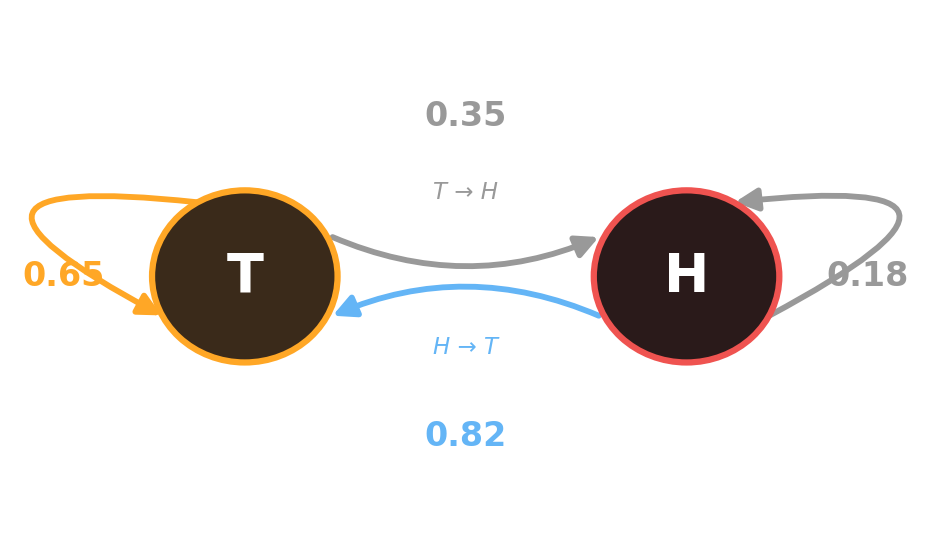{fig-align="center" width="100%"}

::: {.lang-en}
[**Picture view:** Chibany's chain — states + labeled arrows (the same one from "Draw the habit").]{.dim}
:::
::: {.lang-ja}
[**絵の見方：** チバニーの連鎖 — 状態 + ラベル付き矢印（「クセを図にする」と同じもの）。]{.dim}
:::
:::

::: {.column width="50%"}
::: {.lang-en}
[**Matrix view:**]{.accent}
$$P = \begin{pmatrix} 0.65 & 0.35 \\ 0.82 & 0.18 \end{pmatrix}$$

Row 1 = "if **T** today, then tomorrow." Row 2 = "if **H** today."
*(columns are T, H)*

[Same chain, two pictures.]{.dim}
:::
::: {.lang-ja}
[**行列の見方：**]{.accent}
$$P = \begin{pmatrix} 0.65 & 0.35 \\ 0.82 & 0.18 \end{pmatrix}$$

行1 =「今日 **T** なら、明日は」。行2 =「今日 **H** なら」。
*（列は T, H）*

[同じ連鎖、2つの絵。]{.dim}
:::
:::
::::

::: {.notes}
The picture and the matrix are the SAME object. Two-column because there's
genuine structural parallelism. Next slide shows how the matrix actually
generates a step — the seed of Monte Carlo at the end. ~2 min.
:::

## [The matrix is a sampler]{.lang-en}[行列はサンプラー]{.lang-ja} {.midbig}

::: {.lang-en}
How does the chain actually *take a step*? You roll a (continuous) die.

Say today is **tonkatsu (T)**, so the row is $[\,0.65,\; 0.35\,]$ — 0.65 stay T, 0.35 switch to H.

1. Draw a random number $u$ evenly between 0 and 1. *(Say $u = 0.42$.)*
2. $0.42 < 0.65$ → **stay at T**. *(If it were $> 0.65$ → switch to H.)*

[Repeat tomorrow, and the next day… **the matrix plus a stream of random numbers generates the whole sequence.** Hold this idea — it returns at the end of class.]{.yellow}
:::

::: {.lang-ja}
連鎖は実際にどう*1歩進む*? （連続的な）サイコロを振る。

今日が **とんかつ (T)** なら、行は $[\,0.65,\; 0.35\,]$ — 0.65でT継続、0.35でHへ。

1. 0と1の間で一様な乱数 $u$ を引く。*（例：$u = 0.42$。）*
2. $0.42 < 0.65$ → **Tに留まる**。*（$> 0.65$ なら → Hへ切替。）*

[翌日も、その次の日も繰り返す… **行列 + 乱数の流れが系列全体を生成する。** この発想を覚えておいて — 授業の最後に戻ってくる。]{.yellow}
:::

::: {.notes}
This is the slide the student review asked for: give the uniform-draw its own
concrete micro-example (u=0.73 > stay) instead of cramming it onto the
two-views slide. "Roll a continuous die" is the intuition for Uniform(0,1).
This is the explicit seed of Monte Carlo — called back on the bridge slide. ~2 min.
:::

## [Run it: what a chain produces]{.lang-en}[動かす：連鎖が生み出すもの]{.lang-ja} {.midbig}

::: {.lang-en}
Five runs of **Chibany's chain**, each starting at **T**:

```
T H T H T T H T H T T T H T H T T T T H
T T H T H H T T T T T H T H T T T T T T
T T H T H T T H T T T H T T T H T H T T
T T T T H T T H T T T T T T T T H T T T
T T H T H T T H T T T H T T T T H T T T
```

[Mostly **T**, with brief **H** interruptions (hamburger almost never repeats). Over time, roughly **70% T, 30% H**.]{.yellow}
:::

::: {.lang-ja}
**チバニーの連鎖**を5回走らせる。各回 **T** から開始：

```
T H T H T T H T H T T T H T H T T T T H
T T H T H H T T T T T H T H T T T T T T
T T H T H T T H T T T H T T T H T H T T
T T T T H T T H T T T T T T T T H T T T
T T H T H T T H T T T H T T T T H T T T
```

[ほとんど **T**、たまに **H** が割り込む（ハンバーグはほぼ繰り返さない）。長い目で見ると、おおよそ **70% T, 30% H**。]{.yellow}
:::

::: {.notes}
Real samples from Chibany's chain (T->T .65, H->T .82). The point: the chain has
memory-of-one-step (you see T tends to persist, H flips right back), yet a
stable long-run frequency emerges — ~70% T. That long-run frequency is the
stationary distribution, which we make precise next segment AND compute as 70/30.
~2 min.
:::

## [Where we are]{.lang-en}[現在地]{.lang-ja} {.agenda .dense}

- [Welcome + a Markov chain you already know]{.lang-en .done}[ようこそ + すでに知っているマルコフ連鎖]{.lang-ja .done}  [0:00]{.time}
- [Markov chains: states, transitions, the Markov property]{.lang-en .done}[マルコフ連鎖：状態・遷移・マルコフ性]{.lang-ja .done}  [0:10]{.time}
- [Stationary distribution]{.lang-en .highlight}[定常分布]{.lang-ja .highlight}  [0:25]{.time}
- [Networks: graphs as structure]{.lang-en}[ネットワーク：構造としてのグラフ]{.lang-ja}  [0:40]{.time}
- [Random walk on a network]{.lang-en}[ネットワーク上のランダムウォーク]{.lang-ja}  [0:52]{.time}
- [Break]{.lang-en}[休憩]{.lang-ja}  [1:07]{.time}
- [Memory search as a random walk (Abbott 2012)]{.lang-en}[ランダムウォークとしての記憶探索（Abbott 2012）]{.lang-ja}  [1:12]{.time}
- [Network properties + PageRank + Week 7 bridge]{.lang-en}[ネットワークの性質 + PageRank + 第7週へ]{.lang-ja}  [1:48]{.time}

::: {.notes}
Recap ~10s. We've seen a chain produce long-run frequencies (Chibany ~70% T).
Now make "long-run frequency" precise: the stationary distribution. Open the
segment with card shuffling to motivate the GOAL.
:::

## [The stationary distribution]{.lang-en}[定常分布]{.lang-ja} {.section-break background-image="../../sds-reveal/sds_frame.png" background-size="cover"}

::: {.notes}
Block 3. Open with card shuffling (process → goal), THEN the long-run question;
pi P = pi; find it by power iteration; the "start doesn't matter" poll; name the
eigenvector fact (no PCA/SVD aside).
:::

## [Shuffling a deck]{.lang-en}[デッキをシャッフルする]{.lang-ja}

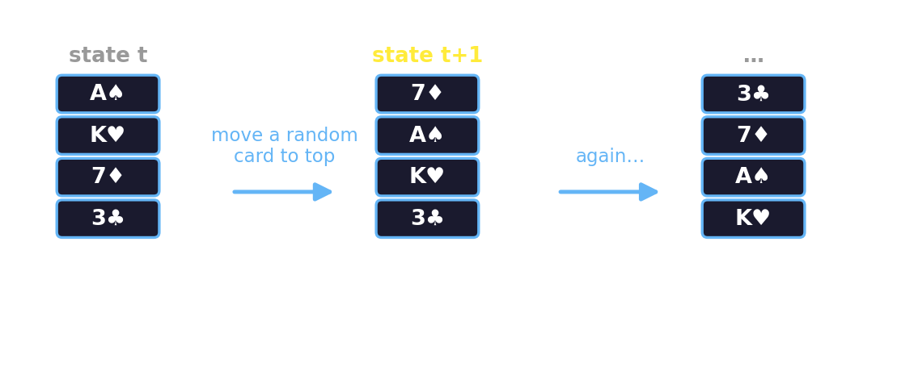{fig-align="center" width="92%"}

::: {.lang-en}
- [**State** = the deck's current ordering]{.dim}
- [**Transition** = "move a random card to the top," over and over]{.dim}

[**You shuffle a deck before a game. What are you actually trying to achieve — what's the *computational goal* of shuffling?**]{.yellow}
:::

::: {.lang-ja}
- [**状態** = デッキの現在の並び]{.dim}
- [**遷移** =「ランダムなカードを一番上へ」を繰り返す]{.dim}

[**ゲームの前にデッキをシャッフルする。本当は何を達成しようとしている — シャッフルの*計算的なゴール*は?**]{.yellow}
:::

::: {.notes}
This is the SEGMENT OPENER for stationary distributions — process only, no
"stationary" word yet. Card shuffling is a Markov chain (state = ordering,
transition = move-random-card-to-top). Ask the question and let students answer
out loud: "what's the goal of shuffling?" Steer toward: make every ordering
equally likely / no ordering predictable / fair. Hold the formal answer for the
NEXT slide. ~1.5 min. (Don't say "stationary distribution" yet.)
:::

## [The goal: a distribution that stops changing]{.lang-en}[ゴール：変わらなくなる分布]{.lang-ja} {.midbig}

::: {.lang-en}
The goal of shuffling: make **every ordering equally likely** — a *uniform* distribution over all $52!$ orderings.

- Shuffle once more from there, and the distribution is **still uniform** — shuffling can't make it "more shuffled."
- That self-perpetuating, **no-longer-changing** distribution is what this whole lecture segment is about.

[We were never after one ordering — we were after a **distribution the process settles into**. Let's make that precise.]{.yellow}
:::

::: {.lang-ja}
シャッフルのゴール：**すべての並びを等確率にする** — $52!$ 通りの並びに対する*一様*分布。

- そこからもう一度シャッフルしても、分布は**まだ一様** — それ以上「シャッフル」できない。
- この自己保存的で**もう変わらない**分布こそ、このセグメント全体のテーマ。

[私たちは1つの並びを求めていたのではない — **過程が落ち着く分布**を求めていた。これを正確にしよう。]{.yellow}
:::

::: {.notes}
The reveal/payoff of the shuffling question, and the bridge INTO the formal
definition. The goal of shuffling = uniform over orderings, and crucially: once
you're there, shuffling keeps you there (it stops changing). That "stops
changing" property IS stationarity — which we name on the next slide. 52! is
astronomically large, so you can't compute it by listing orderings; you reach it
by RUNNING the process. Foreshadows power iteration. ~1.5 min.
:::

## [The long-run question]{.lang-en}[長期の問い]{.lang-ja} {.midbig}

::: {.lang-en}
Run a chain for a very long time. **What fraction of the time do you spend in each state?**

[Over a whole semester, what fraction of Chibany's lunches are tonkatsu?]{.dim}

Call that distribution [$\pi$]{.accent}.

[**Definition:** $\pi$ is *stationary* if running one more step doesn't change it:]{.dim}
$$\pi P = \pi$$

If you're already distributed as $\pi$, you stay distributed as $\pi$ forever.
:::

::: {.lang-ja}
連鎖を非常に長く走らせる。**各状態で過ごす時間の割合は?**

[1学期を通して、チバニーの昼食のうちとんかつは何割?]{.dim}

その分布を [$\pi$]{.accent} と呼ぶ。

[**定義：** もう1歩進めても変わらないとき $\pi$ は*定常*：]{.dim}
$$\pi P = \pi$$

すでに $\pi$ の分布なら、その後ずっと $\pi$ のまま。
:::

::: {.notes}
State it; don't derive it. pi P = pi: a fixed point of the chain's dynamics.
Anchor with Chibany: his chain (0.65/0.35, 0.82/0.18) settles to pi = 70%
tonkatsu / 30% hamburger — exactly the 70/30 "loves tonkatsu" prior students
saw in Week 2. The coin's pi was (1/2, 1/2); the shuffle's was uniform over
orderings. Question now: how do we FIND pi for a chain we're handed? Two
answers — run it (power iteration, this segment) or solve the eigen-equation
(the assignment). ~2 min.
:::

## [How to find π — just run it]{.lang-en}[π の求め方 — とにかく走らせる]{.lang-ja} {.midbig}

::: {.lang-en}
Start from **any** distribution and step repeatedly — i.e. multiply by $P$ over and over:
$$\mathbf{v},\; \mathbf{v}P,\; \mathbf{v}P^2,\; \mathbf{v}P^3,\; \dots \;\longrightarrow\; \pi$$

This is called [**power iteration**]{.yellow}. Let's watch it on **Chibany's chain**.
:::

::: {.lang-ja}
**任意の**分布から始めて、繰り返し1歩進める — つまり $P$ を何度も掛ける：
$$\mathbf{v},\; \mathbf{v}P,\; \mathbf{v}P^2,\; \mathbf{v}P^3,\; \dots \;\longrightarrow\; \pi$$

これを[**べき乗法**]{.yellow}と呼ぶ。**チバニーの連鎖**で見てみよう。
:::

::: {.notes}
Set up the build-up that follows, on the SAME Chibany chain we've used all
along (0.65/0.35, 0.82/0.18). Poll FIRST (before the figure), then reveal. ~1 min.
:::

## [Poll — does the start matter?]{.lang-en}[ポール — 出発点は関係ある?]{.lang-ja} {.midbig}

::: {.lang-en}
We'll run Chibany's chain two ways — he **always starts on tonkatsu**, or **always on hamburger** — for **20 days**.

**Before we look:** is the chance he's eating **tonkatsu** on day 20 the same either way?
:::

::: {.lang-ja}
チバニーの連鎖を2通りで走らせる — **いつもとんかつから始める**、または**いつもハンバーグから** — **20日間**。

**見る前に：** 20日目にとんかつを食べている確率は、どちらから始めても同じ?
:::

::: {.fragment}
::: {.lang-en}
- **A.** essentially the same
- **B.** clearly different — the start sticks
- **C.** it depends on the exact matrix
:::

::: {.lang-ja}
- **A.** ほぼ同じ
- **B.** 明らかに違う — 出発点が残る
- **C.** 行列次第
:::
:::

::: {.notes}
COMMIT BEFORE REVEAL — this poll comes BEFORE the convergence figure, so
students actually have to predict. Don't show the figure yet. The same "does
the start matter?" question is the SP25 "Markov chains and networks" quiz Q4;
we hit it again on the 3-state example. ~1 min, then reveal on the next slide.
:::

## [Two different starts — the reveal]{.lang-en}[2つの異なる出発点 — 答え合わせ]{.lang-ja}

::: {.lang-en}
Same start always-tonkatsu (top) vs always-hamburger (bottom). After $k$ steps:
:::

::: {.lang-ja}
いつもとんかつから（上）対 いつもハンバーグから（下）。$k$ステップ後：
:::

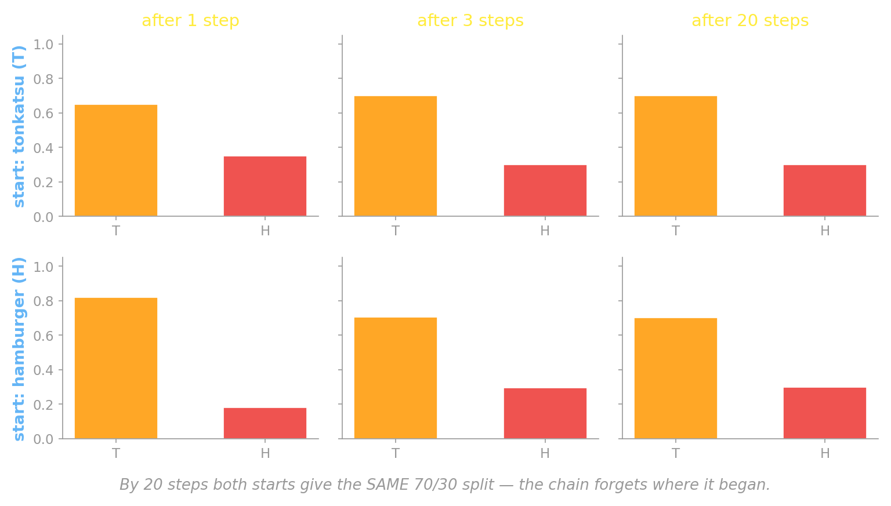{fig-align="center" width="82%"}

::: {.lang-en}
[**A. Essentially the same.** After 1 step they differ; by 20 steps both reach **70% T / 30% H**. The chain **forgot where it started**.]{.yellow}
:::

::: {.lang-ja}
[**A. ほぼ同じ。** 1ステップ後は違うが、20ステップで両方とも **70% T / 30% H** に到達。連鎖は**出発点を忘れた**。]{.yellow}
:::

::: {.notes}
THE reveal of the poll. Top row starts always-tonkatsu, bottom always-hamburger.
After 1 step they look different; by 20 steps both rows are IDENTICAL — 70/30 —
the chain forgot its start. That common distribution is Chibany's stationary pi.
~2 min. The "why" (ergodicity) is the next slide.
:::

## [Why? The chain mixes]{.lang-en}[なぜ? 連鎖は混合する]{.lang-ja} {.bigger}

::: {.lang-en}
After enough days the chain **forgets where it started** — it *mixes*. The
long-run distribution is the stationary $\pi$ (Chibany's **70/30**), and (for a
well-behaved chain) it's the **same from every starting point**.

[The technical condition is **ergodicity** — you can get from any state to any
other, and the chain doesn't get trapped in a cycle.]{.dim}
:::

::: {.lang-ja}
十分な日数の後、連鎖は**出発点を忘れる** — *混合する*。長期の分布は
定常分布 $\pi$ であり、（性質の良い連鎖では）**どの出発点からでも同じ**。

[技術的条件は**エルゴード性** — どの状態からどの状態へも到達でき、周期に
閉じ込められないこと。]{.dim}
:::

::: {.notes}
The "why" behind the poll answer. Define ergodicity in one dim line —
get-anywhere + not-periodic. Don't prove it. The takeaway: pi is a property of
the chain, not of where you start. ~1.5 min.
:::

## [Where does π come from?]{.lang-en}[π はどこから来る?]{.lang-ja}

::: {.lang-en}
Power iteration **converges** to $\pi$. But what *is* $\pi$, exactly?

[$\pi$ is the **left eigenvector of $P$ with eigenvalue 1**.]{.accent}

- An **eigenvector** of a matrix is a vector whose *direction* is unchanged when you multiply by the matrix — only its length scales, by a factor called the **eigenvalue**.
- Since $\pi P = \pi$ (unchanged, scale $=1$), $\pi$ is exactly the eigenvector with eigenvalue 1. Every row-stochastic matrix has one.

[The bar charts showed this: once the shape stopped changing under $\times P$, you'd found $\pi$.]{.dim}
:::

::: {.lang-ja}
べき乗法は $\pi$ に**収束**する。では $\pi$ とは正確には何?

[$\pi$ は **固有値1に対応する $P$ の左固有ベクトル**。]{.accent}

- 行列の**固有ベクトル**とは、その行列を掛けても*方向*が変わらないベクトル — 長さだけが**固有値**という倍率で変わる。
- $\pi P = \pi$（不変、倍率 $=1$）なので、$\pi$ はまさに固有値1の固有ベクトル。行確率行列は必ず1つ持つ。

[棒グラフが示したこと：$\times P$ で形が変わらなくなったら $\pi$ を見つけた。]{.dim}
:::

::: {.notes}
State the eigenvector fact in ONE slide; define eigenvector in one line. Do NOT
bring in PCA/SVD (the SP25 aside is deliberately cut — it derails the process
narrative and most SDS students are shaky on it). The explicit eigen-solve is
in the assignment, not the lecture. The lecture route is power iteration; the
eigenvector is the "what it converges to" footnote. ~2 min.
:::

## [Now try a harder one — together]{.lang-en}[もう少し難しいのを — 一緒に]{.lang-ja} {.midbig}

:::: {.columns .v-center}
::: {.column width="46%"}
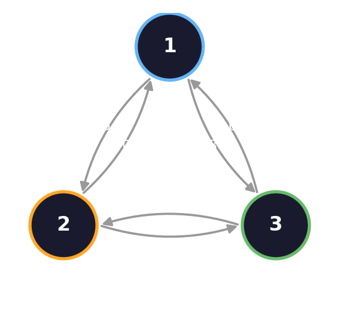{fig-align="center" width="100%"}
:::
::: {.column width="54%"}
::: {.lang-en}
A **3-state** random walk (states 1, 2, 3). Same rules as Chibany — just more states. Its transition matrix:

$$A = \begin{pmatrix} 0 & 0.1 & 0.9 \\ 0.5 & 0 & 0.5 \\ 0.8 & 0.2 & 0 \end{pmatrix}$$

[Row $i$ = where you go from state $i$. (No self-loops here — the diagonal is 0.)]{.dim}
:::
::: {.lang-ja}
**3状態**のランダムウォーク（状態 1, 2, 3）。チバニーと同じルール — 状態が増えただけ。遷移行列：

$$A = \begin{pmatrix} 0 & 0.1 & 0.9 \\ 0.5 & 0 & 0.5 \\ 0.8 & 0.2 & 0 \end{pmatrix}$$

[行 $i$ = 状態 $i$ からの行き先。（ここでは自己ループなし — 対角は0。）]{.dim}
:::
:::
::::

::: {.notes}
The SECOND worked example, fully presented (the SP25 "Markov chains and
networks" quiz matrix). Goal: show the SAME machinery — power iteration →
stationary π — generalizes beyond the 2-state Chibany chain. Read the matrix
together: from state 1 you go to 2 w.p. 0.1 or to 3 w.p. 0.9, etc. Then poll
intuitions BEFORE computing. ~1.5 min.
:::

## [Poll — guess before we compute]{.lang-en}[ポール — 計算する前に予想]{.lang-ja} {.smaller}

:::: {.columns .v-center}
::: {.column width="42%"}
{fig-align="center" width="86%"}

$$A = \begin{pmatrix} 0 & 0.1 & 0.9 \\ 0.5 & 0 & 0.5 \\ 0.8 & 0.2 & 0 \end{pmatrix}$$
:::
::: {.column width="58%"}
::: {.lang-en}
Run this 3-state walk a long time. **Which state does it visit MOST often?**

[Which state do the *others* tend to send you toward?]{.dim}

::: {.fragment}
- **A.** state 1
- **B.** state 2
- **C.** state 3
- **D.** all about equal
:::
:::

::: {.lang-ja}
この3状態のウォークを長く走らせる。**最も頻繁に訪れる状態は?**

[*他の*状態はどこへ送りがち?]{.dim}

::: {.fragment}
- **A.** 状態1
- **B.** 状態2
- **C.** 状態3
- **D.** ほぼ均等
:::
:::
:::
::::

::: {.notes}
Commit before reveal — this tests intuition, and the network + matrix are RIGHT
THERE so students can reason. The clue: state 1 sends 0.9 to state 3, state 2
sends 0.5 to state 3 — lots of arrows point at 3 (and at 1). State 2 is rarely
a destination (only 0.1 from 1, 0.2 from 3). So 1 and 3 high, 2 low. Don't
reveal exact numbers yet — compute them next. ~1 min.
:::

## [Work it out — power iteration]{.lang-en}[計算する — べき乗法]{.lang-ja}

::: {.lang-en}
Same method as Chibany: pick two starts (**state 1** / **state 2**), multiply by $A$ over and over.
:::
::: {.lang-ja}
チバニーと同じ方法：2つの出発点（**状態1** / **状態2**）を選び、$A$ を何度も掛ける。
:::

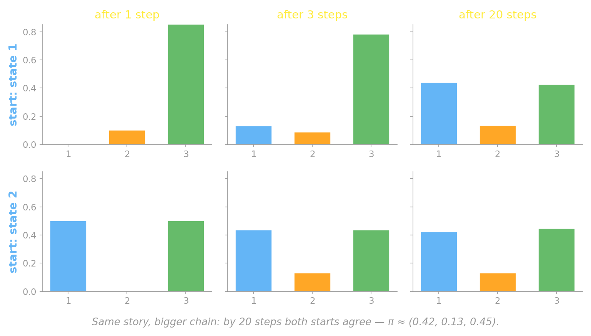{fig-align="center" width="82%"}

::: {.notes}
Work the power iteration live or step through the figure. Top row starts in
state 1, bottom in state 2. After 1 step: very different. By 20 steps: identical
— and state 2 is clearly the smallest, states 1 and 3 nearly tied, as the poll
intuition predicted. ~2 min.
:::

## [Poll — does the start matter? (again)]{.lang-en}[ポール — 出発点は関係ある?（再び）]{.lang-ja} {.smaller}

:::: {.columns .v-center}
::: {.column width="42%"}
{fig-align="center" width="86%"}

$$A = \begin{pmatrix} 0 & 0.1 & 0.9 \\ 0.5 & 0 & 0.5 \\ 0.8 & 0.2 & 0 \end{pmatrix}$$
:::
::: {.column width="58%"}
::: {.lang-en}
Run this walk for **20 steps**. Is the chance of being in **state 2** the same from **state 1** as from **state 2**?

[Same question we asked for Chibany — does it still hold with 3 states?]{.dim}

::: {.fragment}
- **A.** essentially the same
- **B.** clearly different
- **C.** depends on the matrix
:::
:::

::: {.lang-ja}
このウォークを**20ステップ**走らせる。**状態2**にいる確率は、**状態1**からでも**状態2**からでも同じ?

[チバニーで聞いたのと同じ問い — 3状態でも成り立つ?]{.dim}

::: {.fragment}
- **A.** ほぼ同じ
- **B.** 明らかに違う
- **C.** 行列次第
:::
:::
:::
::::

::: {.notes}
SP25 "Markov chains and networks" quiz Q2 vs Q3 → Q4, now as a poll on the
matrix it was actually written for. Answer: A — same (~0.13 either way). The
chain is ergodic, so it forgets its start regardless of how many states. ~1 min.
:::

## [The 3-state stationary distribution]{.lang-en}[3状態の定常分布]{.lang-ja} {.midbig}

::: {.lang-en}
[**A. Essentially the same** — and the walk's long-run home is:]{.yellow}

$$\pi \approx (\,0.42,\; 0.13,\; 0.45\,)$$

- **States 1 and 3** soak up most of the visits (everyone points toward them).
- **State 2** is rarely visited — exactly the poll intuition.
- Two states, three states, or 52! card orderings — **same method, same kind of answer.**
:::

::: {.lang-ja}
[**A. ほぼ同じ** — そしてウォークの長期的な居場所は：]{.yellow}

$$\pi \approx (\,0.42,\; 0.13,\; 0.45\,)$$

- **状態1と3**がほとんどの訪問を集める（皆そこを指す）。
- **状態2**はめったに訪れない — まさに予想どおり。
- 2状態、3状態、あるいは 52! 通りのカードの並び — **同じ方法、同じ種類の答え。**
:::

::: {.notes}
The payoff: the machinery generalizes. pi ≈ (0.42, 0.13, 0.45) — states 1 and 3
dominate, state 2 is rare, matching the pre-compute poll. Tie it together: the
same power-iteration → stationary recipe worked for Chibany (2 states), this
walk (3 states), and the card shuffle (52! states). The assignment has them
solve the stationary distribution explicitly (eigenvector) for this exact
matrix. ~1.5 min.
:::

## [Where we are]{.lang-en}[現在地]{.lang-ja} {.agenda .dense}

- [Welcome + a Markov chain you already know]{.lang-en .done}[ようこそ + すでに知っているマルコフ連鎖]{.lang-ja .done}  [0:00]{.time}
- [Markov chains: states, transitions, the Markov property]{.lang-en .done}[マルコフ連鎖：状態・遷移・マルコフ性]{.lang-ja .done}  [0:10]{.time}
- [Stationary distribution]{.lang-en .done}[定常分布]{.lang-ja .done}  [0:25]{.time}
- [Networks: graphs as structure]{.lang-en .highlight}[ネットワーク：構造としてのグラフ]{.lang-ja .highlight}  [0:40]{.time}
- [Random walk on a network]{.lang-en}[ネットワーク上のランダムウォーク]{.lang-ja}  [0:52]{.time}
- [Break]{.lang-en}[休憩]{.lang-ja}  [1:07]{.time}
- [Memory search as a random walk (Abbott 2012)]{.lang-en}[ランダムウォークとしての記憶探索（Abbott 2012）]{.lang-ja}  [1:12]{.time}
- [Network properties + PageRank + Week 7 bridge]{.lang-en}[ネットワークの性質 + PageRank + 第7週へ]{.lang-ja}  [1:48]{.time}

::: {.notes}
Recap ~10s. We have chains + stationary distributions in the abstract. Now give
the states STRUCTURE: make them nodes of a network.
:::

## [Networks: graphs as structure]{.lang-en}[ネットワーク：構造としてのグラフ]{.lang-ja} {.section-break background-image="../../sds-reveal/sds_frame.png" background-size="cover"}

::: {.notes}
Block 4. Networks as graphs; from a graph to a transition matrix (the hinge);
then Block 5 walks on it.
:::

## [What's a graph?]{.lang-en}[グラフとは?]{.lang-ja} {.midbig}

::: {.lang-en}
A [**graph**]{.accent} $G = (V, E)$ is just **nodes** ($V$) joined by **edges** ($E$).

- Edges can be **undirected** (mutual) or **directed** (one-way)
- Edges can be **weighted** (stronger / weaker)

[You already met graphs **last week** — a **Bayes net** is a directed graph. There an edge meant *"depends on"*; the graphs today use edges to mean *"is related / connected to."*]{.yellow}
:::

::: {.lang-ja}
[**グラフ**]{.accent} $G = (V, E)$ とは、**ノード**（$V$）を**エッジ**（$E$）で結んだもの。

- エッジは**無向**（相互）または**有向**（一方向）
- エッジは**重み付き**にできる（強弱）

[グラフは**先週**すでに登場した — **ベイズネット**は有向グラフ。そこでのエッジは*「依存する」*の意味だったが、今日のグラフではエッジは*「関連・接続している」*を意味する。]{.yellow}
:::

::: {.notes}
Introduce the graph abstraction generically FIRST, and anchor it to last week:
a Bayes net IS a directed graph (nodes = variables, edges = "depends on"). Today
the same object, edges meaning "related/connected." ~1.5 min. Examples next.
:::

## [Graphs are everywhere]{.lang-en}[グラフはどこにでもある]{.lang-ja} {.smaller}

::: {.lang-en}
The power of the abstraction: **one object, many domains.** What are the **nodes** and **edges**?
:::
::: {.lang-ja}
抽象化の力：**1つの対象、多くの領域。** **ノード**と**エッジ**は何?
:::

::: {.lang-en}
| Graph | Nodes | Edges |
|---|---|---|
| **Semantic network** (cog sci) | concepts / words | "is related / associated" |
| **The Web** | web pages | hyperlinks (directed) |
| **Co-authorship network** | researchers | "wrote a paper together" |
| **Social network** | people | friendships / follows |
| **Road map** | intersections | roads (weighted = distance) |
| **Neural network (brain)** | neurons | synapses |

[Today's star is the **semantic network** — concepts as nodes, associations as edges. Cognitive science has used it for decades (Collins & Quillian 1969; Collins & Loftus 1975).]{.dim}
:::

::: {.lang-ja}
| グラフ | ノード | エッジ |
|---|---|---|
| **意味ネットワーク**（認知科学） | 概念 / 単語 | 「関連・連想する」 |
| **ウェブ** | ウェブページ | ハイパーリンク（有向） |
| **共著ネットワーク** | 研究者 | 「一緒に論文を書いた」 |
| **ソーシャルネットワーク** | 人 | 友人関係 / フォロー |
| **道路地図** | 交差点 | 道路（重み = 距離） |
| **神経回路（脳）** | ニューロン | シナプス |

[今日の主役は**意味ネットワーク** — 概念がノード、連想がエッジ。認知科学は何十年も使ってきた（Collins & Quillian 1969; Collins & Loftus 1975）。]{.dim}
:::

::: {.notes}
The "one abstraction, many domains" slide. Each row makes nodes/edges explicit
so the abstraction is concrete. The Web row foreshadows PageRank (segment 8);
the semantic-network row is the one we build on (the Abbott payoff). Co-authorship
+ social are familiar to students. ~2 min. Land: today we walk on the semantic
network.
:::

## [The graph as a matrix]{.lang-en}[行列としてのグラフ]{.lang-ja} {.smaller}

:::: {.columns .v-center}
::: {.column width="44%"}
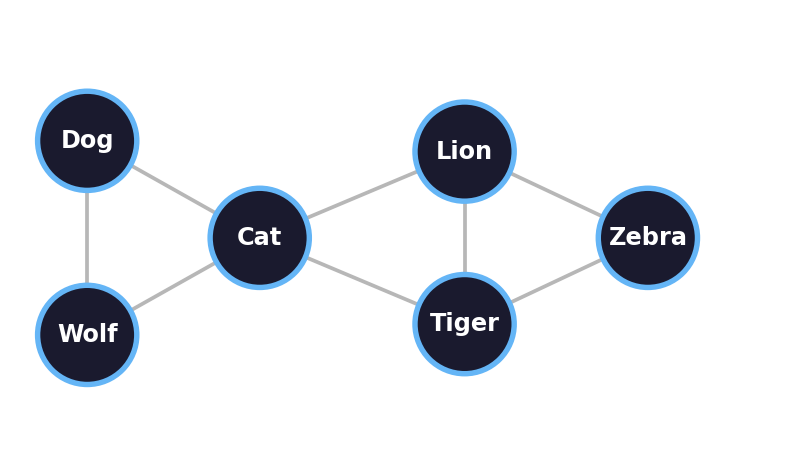{fig-align="center" width="100%"}
:::
::: {.column width="56%"}
::: {.lang-en}
**Adjacency matrix** $L$: $L_{ij} = 1$ when nodes $i$ and $j$ share an edge, else $0$.

$$L = \begin{array}{r|cccccc} & \text{D} & \text{W} & \text{C} & \text{L} & \text{T} & \text{Z} \\ \hline \text{Dog} & 0 & 1 & 1 & 0 & 0 & 0 \\ \text{Wolf} & 1 & 0 & 1 & 0 & 0 & 0 \\ \text{Cat} & 1 & 1 & 0 & 1 & 1 & 0 \\ \text{Lion} & 0 & 0 & 1 & 0 & 1 & 1 \\ \text{Tiger} & 0 & 0 & 1 & 1 & 0 & 1 \\ \text{Zebra} & 0 & 0 & 0 & 1 & 1 & 0 \end{array}$$

[Symmetric (undirected). Each **row sum** = that node's **degree** — Cat's row sums to 4.]{.dim}
:::
::: {.lang-ja}
**隣接行列** $L$：ノード $i$ と $j$ がエッジで繋がっていれば $L_{ij} = 1$、なければ $0$。

$$L = \begin{array}{r|cccccc} & \text{D} & \text{W} & \text{C} & \text{L} & \text{T} & \text{Z} \\ \hline \text{Dog} & 0 & 1 & 1 & 0 & 0 & 0 \\ \text{Wolf} & 1 & 0 & 1 & 0 & 0 & 0 \\ \text{Cat} & 1 & 1 & 0 & 1 & 1 & 0 \\ \text{Lion} & 0 & 0 & 1 & 0 & 1 & 1 \\ \text{Tiger} & 0 & 0 & 1 & 1 & 0 & 1 \\ \text{Zebra} & 0 & 0 & 0 & 1 & 1 & 0 \end{array}$$

[対称（無向）。各**行の和** = そのノードの**次数** — Cat の行は4。]{.dim}
:::
:::
::::

::: {.notes}
The explicit adjacency matrix L for the animal network, shown large beside the
graph so students see the graph↔matrix correspondence concretely. Point out one
or two entries: L[Cat,Lion]=1 because there's an edge; L[Dog,Lion]=0 because
there isn't. Symmetric because undirected. Row sums = degrees (Cat=4, the hub).
Next slide: normalize rows → transition matrix P. ~2 min.
:::

## [From a graph to a transition matrix]{.lang-en}[グラフから遷移行列へ]{.lang-ja} {.smaller}

:::: {.columns .v-center}
::: {.column width="48%"}
{fig-align="center" width="100%"}
:::
::: {.column width="52%"}
::: {.lang-en}
[**The hinge of the whole lecture:**]{.accent}

1. List the edges in an **adjacency matrix** $L$: $L_{ij} = 1$ if $i$–$j$ are connected (or a positive weight).
2. **Normalize each row** to sum to 1 → a transition matrix $P$.

Now $P$ describes a walker who, at each node, **steps to a random neighbor**.

[Structure (the graph) + process (the walk) — a Markov chain whose states are nodes.]{.yellow}
:::
::: {.lang-ja}
[**講義全体の要：**]{.accent}

1. エッジを**隣接行列** $L$ に並べる：$i$–$j$ が繋がっていれば $L_{ij} = 1$（または正の重み）。
2. **各行を正規化**して合計1に → 遷移行列 $P$。

$P$ は、各ノードで**ランダムな隣へ進む**歩行者を表す。

[構造（グラフ） + 過程（ウォーク） — 状態がノードであるマルコフ連鎖。]{.yellow}
:::
:::
::::

::: {.notes}
THIS is the hinge that turns Block 4's structure into Block 2's process. Row-
normalize the adjacency matrix and you have a random walk. Two-column: graph on
the left, the recipe on the right. ~3 min.
:::

## [Where we are]{.lang-en}[現在地]{.lang-ja} {.agenda .dense}

- [Welcome + a Markov chain you already know]{.lang-en .done}[ようこそ + すでに知っているマルコフ連鎖]{.lang-ja .done}  [0:00]{.time}
- [Markov chains: states, transitions, the Markov property]{.lang-en .done}[マルコフ連鎖：状態・遷移・マルコフ性]{.lang-ja .done}  [0:10]{.time}
- [Stationary distribution]{.lang-en .done}[定常分布]{.lang-ja .done}  [0:25]{.time}
- [Networks: graphs as structure]{.lang-en .done}[ネットワーク：構造としてのグラフ]{.lang-ja .done}  [0:40]{.time}
- [Random walk on a network]{.lang-en .highlight}[ネットワーク上のランダムウォーク]{.lang-ja .highlight}  [0:52]{.time}
- [Break]{.lang-en}[休憩]{.lang-ja}  [1:07]{.time}
- [Memory search as a random walk (Abbott 2012)]{.lang-en}[ランダムウォークとしての記憶探索（Abbott 2012）]{.lang-ja}  [1:12]{.time}
- [Network properties + PageRank + Week 7 bridge]{.lang-en}[ネットワークの性質 + PageRank + 第7週へ]{.lang-ja}  [1:48]{.time}

::: {.notes}
Recap ~10s. We can turn any graph into a chain. Now WALK it — and watch what
the walk visits.
:::

## [Random walk on a network]{.lang-en}[ネットワーク上のランダムウォーク]{.lang-ja} {.section-break background-image="../../sds-reveal/sds_frame.png" background-size="cover"}

::: {.notes}
Block 5. The Meow/Cat/Dog walk build-up; the degree result; the degree poll.
:::

## [Take a walk — step 1]{.lang-en}[歩いてみる — ステップ1]{.lang-ja}

:::: {.columns .v-center}
::: {.column width="58%"}
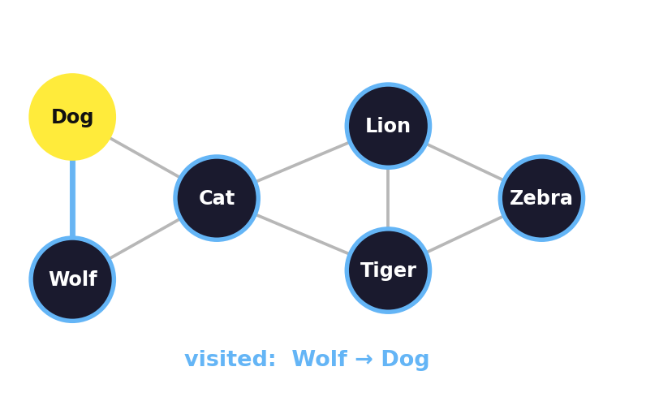{fig-align="center" width="100%"}
:::
::: {.column width="42%"}
::: {.lang-en}
Start at **Wolf**. Pick a random neighbor → **Dog**.

[The sequence of nodes we visit *is* a Markov chain.]{.dim}
:::
::: {.lang-ja}
**Wolf** から開始。ランダムな隣を選ぶ → **Dog**。

[訪れるノードの系列が*まさに*マルコフ連鎖。]{.dim}
:::
:::
::::

::: {.notes}
Build-up as sibling slides (not fragments) — each step its own slide, so it
reads as animation. Step 1: Wolf -> Dog. ~20s per slide. Highlighted node =
where the walker is now; blue edges = the path so far.
:::

## [Take a walk — step 2]{.lang-en}[歩いてみる — ステップ2]{.lang-ja}

:::: {.columns .v-center}
::: {.column width="58%"}
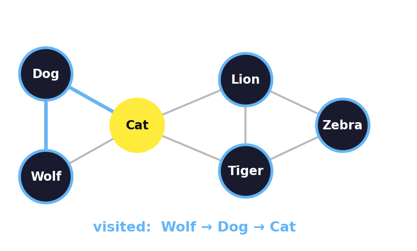{fig-align="center" width="100%"}
:::
::: {.column width="42%"}
::: {.lang-en}
**Dog** → random neighbor → **Cat**.
:::
::: {.lang-ja}
**Dog** → ランダムな隣 → **Cat**。
:::
:::
::::

::: {.notes}
Step 2: Dog -> Cat (into the bridge node).
:::

## [Take a walk — step 3]{.lang-en}[歩いてみる — ステップ3]{.lang-ja}

:::: {.columns .v-center}
::: {.column width="58%"}
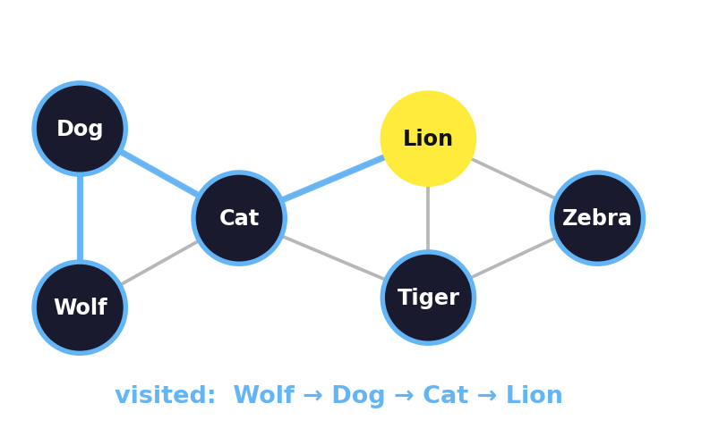{fig-align="center" width="100%"}
:::
::: {.column width="42%"}
::: {.lang-en}
**Cat** → **Lion**. The walk crossed the bridge from the "pets" side to the "big cats."
:::
::: {.lang-ja}
**Cat** → **Lion**。ウォークは橋を渡り「ペット」側から「大型ネコ」へ。
:::
:::
::::

::: {.notes}
Step 3: Cat -> Lion. The walk crosses the bridge (Cat) between clusters —
foreshadows the category-switch in fluency (segment 6).
:::

## [Take a walk — and keep going]{.lang-en}[歩いてみる — さらに続ける]{.lang-ja}

:::: {.columns .v-center}
::: {.column width="58%"}
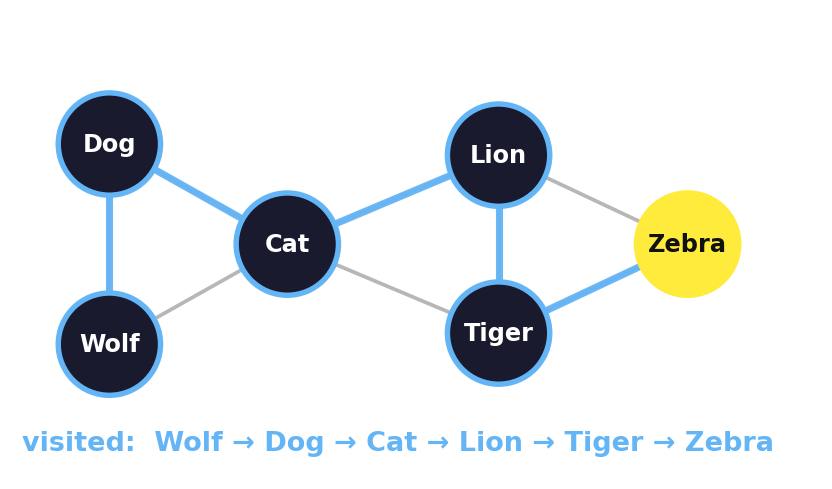{fig-align="center" width="100%"}
:::
::: {.column width="42%"}
::: {.lang-en}
…**Lion → Tiger → Zebra**. Visited so far:
**Wolf → Dog → Cat → Lion → Tiger → Zebra**.

[Run it long enough — which nodes get visited most?]{.yellow}
:::
::: {.lang-ja}
…**Lion → Tiger → Zebra**。訪問:
**Wolf → Dog → Cat → Lion → Tiger → Zebra**。

[十分長く走らせると — どのノードが一番訪れられる?]{.yellow}
:::
:::
::::

::: {.notes}
Final state of the walk build-up. The question on the slide sets up the degree
result + poll. ~20s.
:::

## [The stationary distribution of a walk]{.lang-en}[ウォークの定常分布]{.lang-ja} {.midbig}

::: {.lang-en}
For an **undirected, unweighted** network, the long-run visit frequency has a
beautifully simple form:

$$\pi_i \;\propto\; \deg(i)$$

where [$\deg(i)$]{.accent} = the **degree** of node $i$ = how many edges touch it,
and [$\propto$]{.accent} means *"grows with"* — double the edges, roughly double the visits.

[**More connected → visited more often.** No eigen-solve needed for this case — the degree *is* the answer.]{.yellow}
:::

::: {.lang-ja}
**無向・重みなし**ネットワークでは、長期の訪問頻度は驚くほど単純：

$$\pi_i \;\propto\; \deg(i)$$

ここで [$\deg(i)$]{.accent} = ノード $i$ の**次数** = 接続するエッジの本数、
[$\propto$]{.accent} は*「に比例して増える」* — エッジが倍なら訪問もおよそ倍。

[**繋がりが多い → 訪問が多い。** この場合は固有値計算不要 — 次数が答えそのもの。]{.yellow}
:::

::: {.notes}
The clean payoff. Define "degree" inline (first use). Check it against the walk:
the highest-degree node was visited most. This is also exactly why PageRank
works (Block 8) and why high-degree concepts dominate fluency (Block 6). ~2 min.
:::

## [Poll — which node wins?]{.lang-en}[ポール — どのノードが勝つ?]{.lang-ja} {.midbig}

:::: {.columns .v-center}
::: {.column width="52%"}
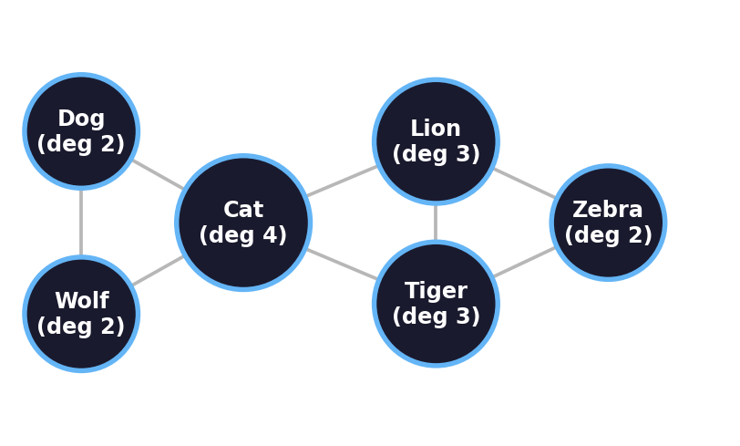{fig-align="center" width="100%"}
:::
::: {.column width="48%"}
::: {.lang-en}
Run a random walk on this network for a long time.

Which node do you visit **most often**?

::: {.fragment}
- **A.** Cat
- **B.** Lion
- **C.** Wolf
- **D.** Zebra
:::
:::
::: {.lang-ja}
このネットワークでランダムウォークを長く走らせる。

**最も頻繁に**訪れるノードは?

::: {.fragment}
- **A.** Cat
- **B.** Lion
- **C.** Wolf
- **D.** Zebra
:::
:::
:::
::::

::: {.notes}
Degree is printed on each node in the figure (but NOT highlighted — no spoiler).
Commit before reveal. Cat is the bridge between the two clusters, so it has the
most edges (degree 4) — but let students figure that out. ~1 min.
:::

## [Poll — answer]{.lang-en}[ポール — 答え]{.lang-ja} {.smaller}

[[**A. Cat — it has the highest degree.**]{.lang-en}[**A. Cat — 次数が最も高い。**]{.lang-ja}]{.yellow}

:::: {.columns .v-center}
::: {.column width="40%"}
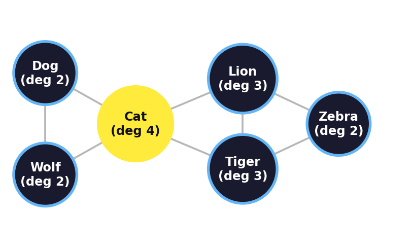{fig-align="center" width="100%"}
:::
::: {.column width="60%"}
::: {.lang-en}
$\pi_i \propto \deg(i)$, and **Cat** touches the most edges (degree 4) — it's
the **bridge** between the two clusters. Long-run behavior is dictated by
**structure**: no extra assumption needed, and **no eigen-solve** for an
undirected graph — the degree *is* the answer.

[Hold onto this: the most-visited concept is the most-connected one. That's about to explain how people *recall*.]{.dim}
:::

::: {.lang-ja}
$\pi_i \propto \deg(i)$ であり、**Cat** が最も多くのエッジ（次数4）に接する —
2つのクラスタを繋ぐ**橋**だから。長期挙動は**構造**で決まる：追加の仮定も、
無向グラフなら**固有値計算も不要** — 次数が答えそのもの。

[覚えておいて：最も訪れられる概念は最も繋がった概念。これがこの後、人が
どう*思い出す*かを説明する。]{.dim}
:::
:::
::::

::: {.notes}
Bridge sentence matters: most-visited = most-connected → this is the engine of
the Abbott model after the break. ~1 min.
:::

## [Where we are]{.lang-en}[現在地]{.lang-ja} {.agenda .dense}

- [Welcome + a Markov chain you already know]{.lang-en .done}[ようこそ + すでに知っているマルコフ連鎖]{.lang-ja .done}  [0:00]{.time}
- [Markov chains: states, transitions, the Markov property]{.lang-en .done}[マルコフ連鎖：状態・遷移・マルコフ性]{.lang-ja .done}  [0:10]{.time}
- [Stationary distribution]{.lang-en .done}[定常分布]{.lang-ja .done}  [0:25]{.time}
- [Networks: graphs as structure]{.lang-en .done}[ネットワーク：構造としてのグラフ]{.lang-ja .done}  [0:40]{.time}
- [Random walk on a network]{.lang-en .done}[ネットワーク上のランダムウォーク]{.lang-ja .done}  [0:52]{.time}
- [Break]{.lang-en .highlight}[休憩]{.lang-ja .highlight}  [1:07]{.time}
- [Memory search as a random walk (Abbott 2012)]{.lang-en}[ランダムウォークとしての記憶探索（Abbott 2012）]{.lang-ja}  [1:12]{.time}
- [Network properties + PageRank + Week 7 bridge]{.lang-en}[ネットワークの性質 + PageRank + 第7週へ]{.lang-ja}  [1:48]{.time}

::: {.notes}
Recap ~10s. All the machinery is in place. After the break: the cognitive
payoff — this exact model IS a theory of human memory search.
:::

## [Break]{.lang-en}[休憩]{.lang-ja} {.section-break .photo-break background-image="images/catsJune5_2026.jpg" background-size="cover" background-position="center"}

::: {.lang-en}
[5 minutes]{.yellow}
:::
::: {.lang-ja}
[5分]{.yellow}
:::

::: {.notes}
5 min break. After: animal fluency = a random walk on a semantic network
(Abbott 2012, the required reading).
:::

## [Memory search as a random walk]{.lang-en}[ランダムウォークとしての記憶探索]{.lang-ja} {.section-break background-image="../../sds-reveal/sds_frame.png" background-size="cover"}

::: {.notes}
Block 6. The required-reading payoff (Abbott, Austerweil & Griffiths 2012).
Phenomenon first (the fluency task), then the model. Instructor-led — no
presenter this week.
:::

## [Try it yourself]{.lang-en}[やってみよう]{.lang-ja} {.biggest}

::: {.lang-en}
**List as many animals as you can — 60 seconds. Go.**
:::

::: {.lang-ja}
**動物をできるだけたくさん挙げて — 60秒。スタート。**
:::

::: {.notes}
Run it live if the room is willing (30-60s), or just have them think it. This
is the "verbal/semantic fluency" task (Bousfield & Sedgewick 1944; Troyer et
al. 1997). After: ask what ORDER things came out in. Show before tell. ~1.5 min.
:::

## [What your list looks like]{.lang-en}[あなたのリストの形]{.lang-ja} {.midbig}

::: {.lang-en}
People don't list animals at random. They come out in **bursts by category**:

> *wolf, lion, giraffe, zebra* … *dog, cat, hamster* …

A run of African animals, a pause, a run of pets. **Then a switch.**

[Why this structure? And why *those* animals, in *that* order?]{.yellow}
:::

::: {.lang-ja}
人はランダムに動物を挙げない。**カテゴリごとのまとまり**で出てくる：

> *オオカミ、ライオン、キリン、シマウマ* … *イヌ、ネコ、ハムスター* …

アフリカの動物の連続、一拍、ペットの連続。**そして切り替え。**

[なぜこの構造? なぜ*それらの*動物が、*その*順で?]{.yellow}
:::

::: {.notes}
The empirical phenomenon: clustering + switching. This is what any theory of
recall has to explain. Hold the answer one slide. ~1.5 min.
:::

## [The model: recall is a random walk]{.lang-en}[モデル：想起はランダムウォーク]{.lang-ja} {.smaller}

:::: {.columns .v-center}
::: {.column width="48%"}
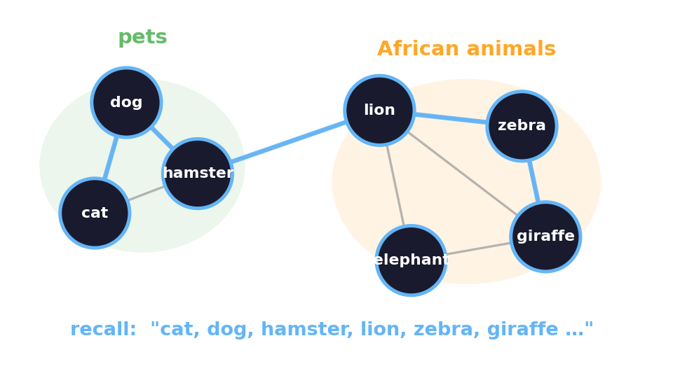{fig-align="center" width="100%"}
:::
::: {.column width="52%"}
::: {.lang-en}
[**Abbott, Austerweil & Griffiths (2012):**]{.accent}

Your semantic memory is a **network**; recall is a **random walk** on it. The
list you produce *is* the sequence of nodes the walk visits.

- **Clusters** = the walk lingering in a densely-connected community
- **Switches** = the walk crossing a bridge edge to another community

[No extra "search strategy" needed — it falls out of the network.]{.dim}
:::
::: {.lang-ja}
[**Abbott, Austerweil & Griffiths (2012):**]{.accent}

意味記憶は**ネットワーク**であり、想起はその上の**ランダムウォーク**。
あなたが出すリストは*まさに*ウォークが訪れるノードの系列。

- **まとまり** = 密に繋がった共同体に滞在するウォーク
- **切り替え** = 別の共同体への橋エッジを渡るウォーク

[追加の「探索戦略」は不要 — ネットワークから自然に出る。]{.dim}
:::
:::
::::

::: {.notes}
THE payoff slide. Everything today converges here: a Markov chain (Block 2) +
a network (Block 4) + a random walk (Block 5) = a theory of memory. BUT the raw
walk isn't the fluency list yet — that's the censoring function, next slide.
The required reading. ~2 min.
:::

## [The catch: the walk ≠ the list]{.lang-en}[落とし穴：ウォーク ≠ リスト]{.lang-ja} {.midbig}

::: {.lang-en}
A random walk **revisits** nodes and wanders through **non-animals** — but a fluency list has neither. So the walk is *not* the list directly.

[**The censoring function** (Abbott et al. 2012) is the missing link: you **report a word only the first time the walk hits it**, and only if it's an animal. Everything else is **censored** (hidden).]{.yellow}

- $\tau(k)$ = the **first hitting time** of the $k$-th unique animal
- The gap between first-hits → the **inter-item response time (IRT)** — *what the data actually measures.*
:::

::: {.lang-ja}
ランダムウォークはノードを**再訪**し、**動物以外**もさまよう — でも流暢性リストにはどちらもない。だからウォークはそのままではリストではない。

[**打ち切り関数**（Abbott et al. 2012）が欠けていた繋がり：**ウォークが初めてその語に到達したときだけ**、しかも動物なら報告する。それ以外は**打ち切り**（隠す）。]{.yellow}

- $\tau(k)$ = $k$番目のユニークな動物の**初到達時刻**
- 初到達の間隔 → **項目間反応時間（IRT）** — *データが実際に測るもの。*
:::

::: {.notes}
THE crucial mechanism the model needs. Without censoring, the walk is just a
node sequence — it isn't the fluency list and can't be compared to IRT data.
Censoring = report each unique animal only on FIRST hit; everything else
(revisits, non-animals) is hidden. tau(k) = first hitting time of the k-th
unique animal; IRT = gap between consecutive first-hits (+ word length). This
is what links the latent walk to the observed behavior. Worked example next.
~2 min.
:::

## [Censoring — worked example]{.lang-en}[打ち切り — 具体例]{.lang-ja} {.smaller}

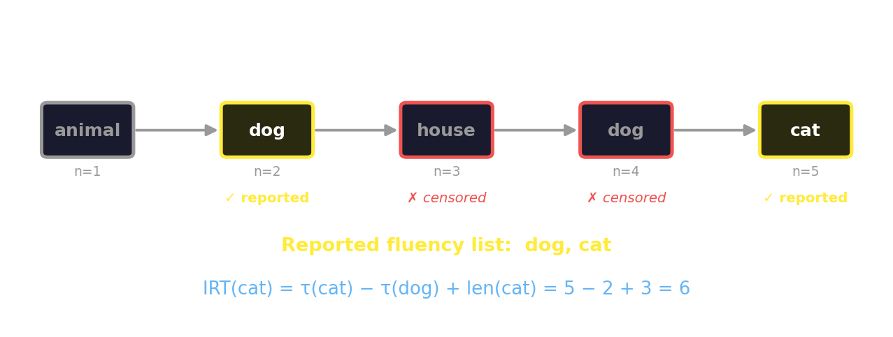{fig-align="center" width="92%"}

::: {.lang-en}
[The walk visits **animal → dog → house → dog → cat**. Reported: **dog, cat**. *house* (not an animal) and the *second dog* (a revisit) are censored. The IRT to "cat" is the step-gap between first-hits, plus the word's length.]{.dim}
:::
::: {.lang-ja}
[ウォークは **animal → dog → house → dog → cat** を訪れる。報告：**dog, cat**。*house*（動物でない）と*2回目のdog*（再訪）は打ち切り。「cat」へのIRTは初到達間のステップ差 + 語長。]{.dim}
:::

::: {.notes}
Walk through it live (the paper's own example, §4.2). animal(n=1) → dog(n=2,
first animal → KEEP) → house(n=3, not an animal → CENSOR) → dog(n=4, revisit →
CENSOR) → cat(n=5, first time → KEEP). Reported list: dog, cat. tau(dog)=2,
tau(cat)=5. IRT(cat) = 5 − 2 + len("cat")=3 → 6. The IRT is read straight off
the censored walk — THAT is how the latent process connects to the data. ~2 min.
:::

## [The signature: slow down, then switch]{.lang-en}[特徴：減速、そして切り替え]{.lang-ja} {.midbig}

::: {.lang-en}
The famous **optimal-foraging** finding (Hills et al. 2012): line up each animal by **when it appears relative to a category switch**.

- Within a patch, items come **faster and faster** — until they slow.
- The **first word of a new patch** is the **slowest** of all — it's above your average IRT. That's the "switch cost."

[Marginal Value Theorem: leave a patch when its return rate drops below your overall average. People look like they're foraging.]{.dim}
:::

::: {.lang-ja}
有名な**最適採餌**の発見（Hills et al. 2012）：各動物を**カテゴリ切り替えに対する位置**で並べる。

- パッチ内では項目が**どんどん速く**出てくる — やがて遅くなるまで。
- **新しいパッチの最初の語**が**最も遅い** — 平均IRTを超える。これが「切り替えコスト」。

[限界価値定理：パッチの収益率が全体平均を下回ったら離れる。人は採餌しているように見える。]{.dim}
:::

::: {.notes}
The behavioral phenomenon (Abbott Fig 1a, from Hills et al. 2012). Set it up
BEFORE showing the bar chart so students know what to look for: position-1 bar
(first word of new patch) is the tallest, above the average line. Hills et al.
read this as a deliberate optimal-foraging switch decision (two processes). ~2 min.
:::

## […and the random walk reproduces it]{.lang-en}[…そしてランダムウォークが再現する]{.lang-ja} {.smaller}

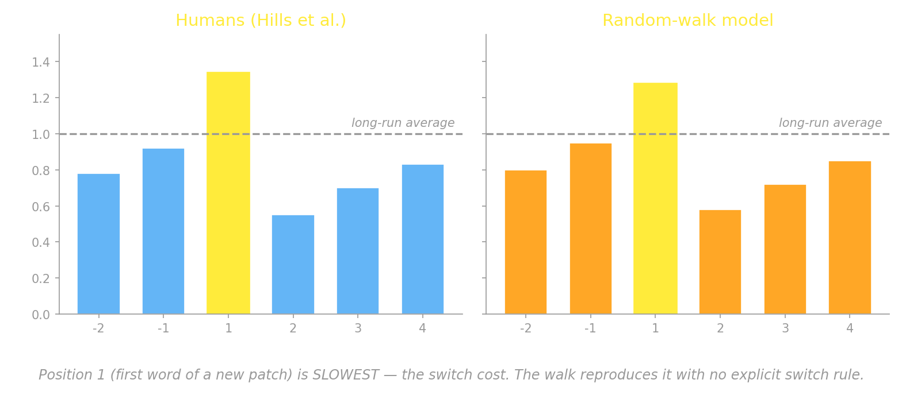{fig-align="center" width="86%"}

::: {.lang-en}
[The censored random walk — **one process, no switch rule** — produces the *same* curve as humans: position 1 slowest, position 2 fastest. The "decision to switch" was never needed; it falls out of the network's structure.]{.yellow}
:::
::: {.lang-ja}
[打ち切りランダムウォーク — **1つの過程、切り替え規則なし** — が人間と*同じ*曲線を生む：位置1が最も遅く、位置2が最も速い。「切り替えの決定」は不要だった。ネットワークの構造から自然に出る。]{.dim}
:::

::: {.notes}
THE result (Abbott Fig 3 vs Fig 1a). Left = humans, right = the random-walk
model. Same shape: position 1 is the tallest bar (slowest), above the average
line. The model has NO switch process — just a censored random walk on the
network — yet it reproduces the "switch cost" that was taken as evidence for a
deliberate two-process forager. Simpler, unified account. This is the paper's
headline. ~2 min.
:::

## [Why this is a big claim]{.lang-en}[なぜこれが大きな主張か]{.lang-ja} {.midbig}

::: {.lang-en}
The same **structure + process** split we've used since Marr (Week 2):

- **Structure** — the semantic network (estimated from *other* behavior, e.g. word-association norms)
- **Process** — the random walk (a Markov chain — *memoryless*)
- **Behavior** — the fluency list (which animals, in which order, with which pauses)

[Structure + process **jointly predict** behavior — and they fit human data well, with no recall-specific machinery bolted on.]{.yellow}
:::

::: {.lang-ja}
Marr 以来（第2週）使ってきた **構造 + 過程** の分け方：

- **構造** — 意味ネットワーク（*別の*行動、例：語連想規範から推定）
- **過程** — ランダムウォーク（マルコフ連鎖 — *記憶を持たない*）
- **行動** — 流暢性リスト（どの動物が、どの順で、どんな間で）

[構造 + 過程が行動を**共同で予測** — しかも想起専用の仕掛けなしで人間データによく合う。]{.yellow}
:::

::: {.notes}
Tie back to Marr's levels (Week 2) explicitly — this is the course's recurring
structure/process/behavior frame. The "memoryless" point is the discussion
hook: human recall avoids repeats, but a pure random walk doesn't — is that a
problem? (That's a Slack reflection prompt.) ~2 min.
:::

## [Discuss]{.lang-en}[ディスカッション]{.lang-ja} {.bigger}

::: {.lang-en}
- The walk is **memoryless** — but people rarely repeat themselves. Fatal flaw, or fixable?
- The network is **estimated from other data**. Is that a clean test, or is some explanation smuggled in?
- Does the **stationary distribution** of your memory mean anything real — salience? accessibility? frequency?
:::

::: {.lang-ja}
- ウォークは**記憶を持たない** — でも人はめったに繰り返さない。致命的欠陥? それとも修正可能?
- ネットワークは**別データから推定**。これはクリーンな検証? それとも説明が紛れ込んでいる?
- あなたの記憶の**定常分布**は何か現実的なものを意味する? — 顕著性? アクセス可能性? 頻度?
:::

::: {.notes}
~3 min open discussion (this replaces a student presentation this week). These
are the Slack reflection prompts, so students have seen them. Let it breathe.
The optional foraging / clinical extensions now come AFTER network properties
(post-PageRank), so this discussion flows straight into the network-properties
segment. If running short, cut discussion to one question.
:::

## [Network properties + the road to Week 7]{.lang-en}[ネットワークの性質 + 第7週への道]{.lang-ja} {.section-break background-image="../../sds-reveal/sds_frame.png" background-size="cover"}

::: {.notes}
Block 8. A couple of network terms; ER vs scale-free; PageRank (promised in the
Slack thread); the MC->MCMC bridge + close. This segment ALWAYS runs.
:::

## [A few network terms]{.lang-en}[いくつかのネットワーク用語]{.lang-ja} {.midbig}

::: {.lang-en}
- [**Degree**]{.accent} of a node = number of edges touching it. (We used this: $\pi_i \propto \deg(i)$.)
- [**Shortest path length** (geodesic distance)]{.accent} = fewest edges between two nodes.
- [**Diameter**]{.accent} = the longest shortest-path in the network.
- [**Degree distribution**]{.accent} = the histogram of all nodes' degrees — it tells you what *kind* of network you have.
:::

::: {.lang-ja}
- ノードの[**次数**]{.accent} = 接続するエッジ数。（$\pi_i \propto \deg(i)$ で使った。）
- [**最短経路長**（測地距離）]{.accent} = 2ノード間の最少エッジ数。
- [**直径**]{.accent} = ネットワーク内で最長の最短経路。
- [**次数分布**]{.accent} = 全ノードの次数のヒストグラム — どの*種類*のネットワークかを教える。
:::

::: {.notes}
Brief — these support the figure on the next slide and general literacy.
Degree already did real work today. ~1.5 min.
:::

## [Two kinds of network]{.lang-en}[2種類のネットワーク]{.lang-ja}

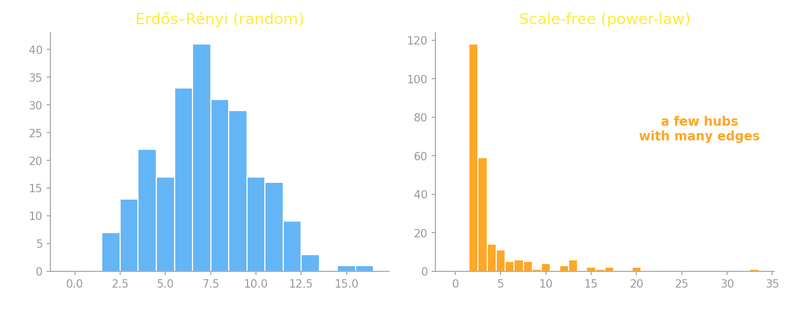{fig-align="center" width="84%"}

::: {.lang-en}
- [**Random (Erdős–Rényi):** Binomial degrees, everyone similar]{.dim}
- [**Scale-free / power-law:** a few high-degree **hubs** — real semantic, social, and web networks look like this]{.dim}
:::

::: {.lang-ja}
- [**ランダム（Erdős–Rényi）：** 二項分布の次数、皆似たり寄ったり]{.dim}
- [**スケールフリー / べき乗則：** 少数の高次数**ハブ** — 実際の意味・社会・ウェブのネットワークはこちら]{.dim}
:::

::: {.notes}
The two-column figure: random vs scale-free degree distributions. The key
contrast: random networks can't be both sparse AND clustered; real cognitive
networks are scale-free, with hubs. Hubs = the high-pi nodes a walk visits
most. ~2 min.
:::

## [Hubs win: PageRank]{.lang-en}[ハブが勝つ：PageRank]{.lang-ja}

:::: {.columns .v-center}
::: {.column width="52%"}
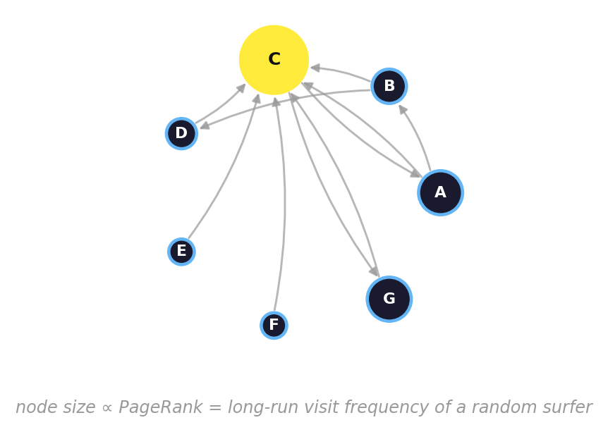{fig-align="center" width="100%"}
:::
::: {.column width="48%"}
::: {.lang-en}
**PageRank** (the original Google algorithm) ranks pages by the **stationary
distribution of a random walk** over the link graph — exactly the $\pi$ from
this morning, at web scale.

[Griffiths, Steyvers & Firl (2007), *Google and the mind*:]{.accent} PageRank
over a **semantic** network predicts human word-fluency. Same algorithm, same $\pi$.
:::
::: {.lang-ja}
**PageRank**（元祖 Google アルゴリズム）は、リンクグラフ上の**ランダム
ウォークの定常分布**でページを順位付け — まさに今朝の $\pi$ を、ウェブ規模で。

[Griffiths, Steyvers & Firl (2007)『Google and the mind』：]{.accent} **意味**
ネットワーク上の PageRank が人間の語の流暢性を予測する。同じアルゴリズム、同じ $\pi$。
:::
:::
::::

::: {.notes}
Promised in the Week 6 Slack thread ("the same object behind PageRank, which
we'll see Friday"). The point: pi isn't an abstraction — it's a $100B idea AND
a model of memory accessibility. A page/concept is important if a random walker
visits it often. Makes the whole morning feel real. ~2 min.
:::

<!-- ===================================================================== -->
<!-- OPTIONAL EXTENSIONS: foraging optimum + clinical networks.             -->
<!-- Placed AFTER network properties. Run only if on time; cut entirely     -->
<!-- under time pressure (the required reading, Abbott, is in the protected  -->
<!-- core segment). These are real research-data panels.                     -->
<!-- ===================================================================== -->

## [Optional: do people *actually* leave at the optimum?]{.lang-en}[補足：人は*本当に*最適点で離れる?]{.lang-ja}

:::: {.columns .v-center}
::: {.column width="60%"}
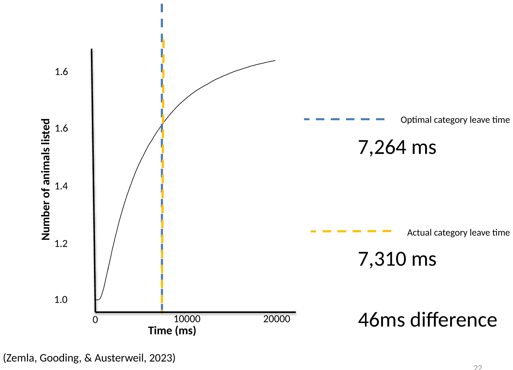{fig-align="center" width="100%"}
:::
::: {.column width="40%"}
::: {.lang-en}
[Zemla, Gooding & Austerweil (2023):]{.accent} actual category-leave times
track the MVT optimum almost exactly (**46 ms** apart).

And **optimal switching is preserved with age** — older adults switch *less*,
but *strategically*, not from a deficit.
:::
::: {.lang-ja}
[Zemla, Gooding & Austerweil (2023)：]{.accent} 実際のカテゴリ離脱時間は
MVT最適値をほぼ正確に追う（**46 ms** 差）。

そして**最適な切り替えは加齢で保たれる** — 高齢者は*より少なく*切り替えるが、
欠陥ではなく*戦略的*に。
:::
:::
::::

::: {.notes}
OPTIONAL. Real data. The 46 ms gap is the headline. The age result resolves
H1 ("general slowing") vs H2 ("optimal with fewer resources") in favor of H2.
~2 min.
:::

## [Optional: invert the walk → estimate the network]{.lang-en}[補足：ウォークを逆転 → ネットワークを推定]{.lang-ja} {.smaller}

:::: {.columns .v-center}
::: {.column width="52%"}
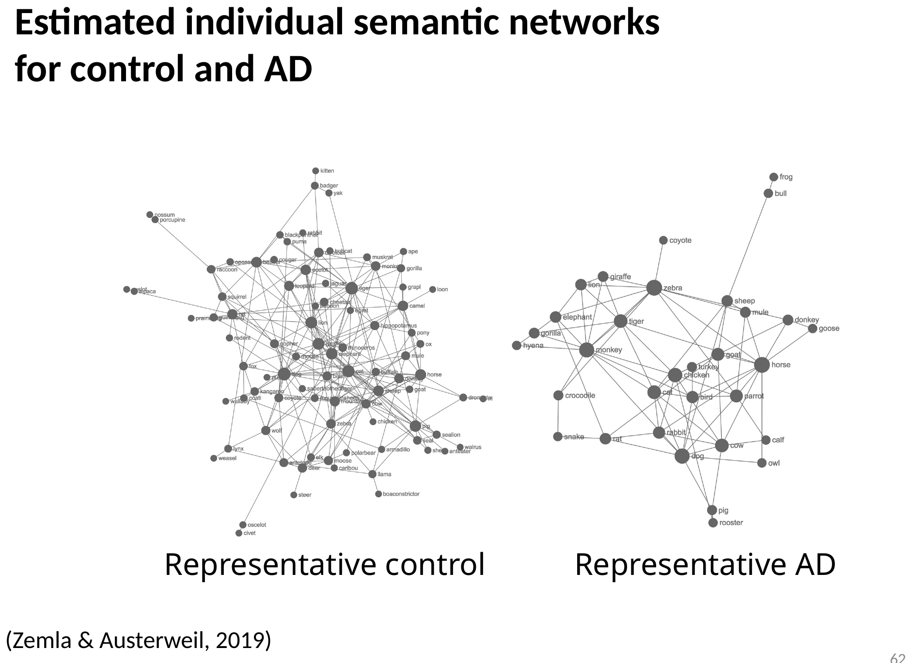{fig-align="center" width="100%"}
:::
::: {.column width="48%"}
::: {.lang-en}
So far: network → walk → fluency list. You can also run it **backwards** — given
fluency lists, **infer the most likely network** (U-INVITE; Zemla & Austerweil 2018).

[That makes the network a **measurement instrument**: estimate someone's semantic network from a few fluency lists, then compare groups.]{.yellow}

[Tool: **SNAFU** — `github.com/AusterweilLab/snafu-py`]{.dim}
:::
::: {.lang-ja}
これまで：ネットワーク → ウォーク → 流暢性リスト。**逆向き**にも走らせられる —
流暢性リストから**最尤ネットワークを推定**（U-INVITE；Zemla & Austerweil 2018）。

[これでネットワークは**測定器**になる：数本の流暢性リストから個人の意味ネットワークを推定し、群間比較できる。]{.yellow}

[ツール：**SNAFU** — `github.com/AusterweilLab/snafu-py`]{.dim}
:::
:::
::::

::: {.notes}
OPTIONAL. The inverse problem (network from behavior). Frame the network as a
measurement instrument — that's what makes the clinical comparison possible
(next slide). U-INVITE = the estimation method; SNAFU = the toolkit. ~2 min.
:::

## [Optional: Alzheimer's changes the network]{.lang-en}[補足：アルツハイマー病はネットワークを変える]{.lang-ja} {.smaller}

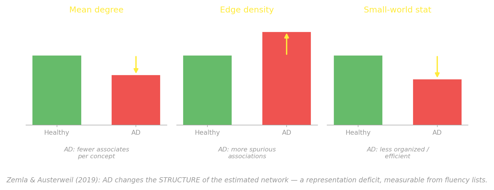{fig-align="center" width="88%"}

::: {.lang-en}
[**Zemla & Austerweil (2019)** estimated networks for 41 AD patients vs. healthy controls. Three structural differences point to an **impaired representation** — fewer associates per concept, more spurious links, less organized — *measured from fluency lists alone.* (A separate **retrieval** deficit — faulty monitoring of what's already been said — shows up too.)]{.dim}
:::
::: {.lang-ja}
[**Zemla & Austerweil (2019)** は41名のAD患者と健常対照のネットワークを推定。3つの構造的差異が**表現の障害**を示す — 概念あたりの連想が少なく、偽の結合が多く、組織化が低い — *流暢性リストだけから測定。*（別の**検索**の障害 — 既出項目の追跡の不全 — も現れる。）]{.dim}
:::

::: {.notes}
OPTIONAL — the clinical payoff, with the actual Zemla & Austerweil 2019
network-statistic differences. AD networks: smaller MEAN DEGREE (fewer
associates), higher EDGE DENSITY (more spurious associations), less
SMALL-WORLD-like (less organized). Together = "impaired representation." A
separate retrieval deficit (faulty monitoring) also exists. The headline: a
clinical signature read off fluency lists via the network model. This is a
presentation candidate this week. ~2 min. End of optional extensions → bridge.
:::

## [Bridge — we've been doing Monte Carlo]{.lang-en}[橋渡し — 私たちはすでにモンテカルロをしていた]{.lang-ja} {.midbig}

::: {.lang-en}
Look back at the day:

- **Running the chain** (Chibany's bento, the card shuffle) **drew samples** by comparing a random number to the row of $P$.
- The **stationary distribution** we found by **running the chain** and watching where it settles.

[We were **estimating a distribution by sampling** — that's **Monte Carlo**.]{.yellow}
:::

::: {.lang-ja}
今日を振り返ると：

- **連鎖を走らせる**こと（チバニーのお弁当、カードのシャッフル）は、乱数を $P$ の行と比べて**サンプルを引く**ことだった。
- **定常分布**は、**連鎖を走らせて**落ち着く先を見て求めた。

[私たちは**サンプリングで分布を推定**していた — それが**モンテカルロ**。]{.yellow}
:::

::: {.notes}
The reframe: we've already been using sampling to estimate distributions —
running a chain by drawing random numbers IS Monte Carlo. Name it. ~2 min.
(The hospital / law-of-large-numbers poll moved to Week 7, where Monte Carlo
estimation is the topic.)
:::

## [Next week — Week 7]{.lang-en}[来週 — 第7週]{.lang-ja}

::: {.lang-en}
[**Monte Carlo — and we flip the problem.**]{.accent}

Today the chain came first and we *found* its stationary distribution. **Next
week we reverse it:** start with a target distribution we *want* to sample
(e.g. a Bayesian posterior), and **design a Markov chain whose stationary
distribution is that target.**

That's [**Markov chain Monte Carlo (MCMC)**]{.yellow} — and it leads to a wild
idea: people may sample from their own posteriors (*MCMC with People*).

[Required reading + presenter on the readings page.]{.dim}
:::

::: {.lang-ja}
[**モンテカルロ — そして問題を反転する。**]{.accent}

今日は連鎖が先にあり、その定常分布を*求めた*。**来週は逆**：サンプリング
したい目標分布（例：ベイズ事後分布）から始め、**その目標を定常分布に持つ
マルコフ連鎖を設計する。**

それが[**マルコフ連鎖モンテカルロ（MCMC）**]{.yellow} — そしてとんでもない
発想へ：人は自分の事後分布からサンプリングしているかもしれない（*MCMC with People*）。

[必須リーディングと発表者はリーディングのページに。]{.dim}
:::

::: {.notes}
~1.5 min close. The MC->MCMC flip is the whole reason Markov chains came before
Monte Carlo in the calendar. Thank the room. Reflections due before next Friday
(Abbott or any Week 6 reading). Verify Week 7's presenter against
readings_map.yml before announcing. See you next Friday.
:::
