## [Agenda]{.lang-en}[本日の予定]{.lang-ja} {.agenda .agenda-roomy}

- [Admin + What *is* Monte Carlo? (poll)]{.lang-en}[連絡 + モンテカルロとは?（ポール）]{.lang-ja}  [0:00]{.time}
- [Basic Monte Carlo]{.lang-en}[基本のモンテカルロ]{.lang-ja}  [0:08]{.time}
- [Importance sampling]{.lang-en}[重点サンプリング]{.lang-ja}  [0:23]{.time}
- [Particle filtering]{.lang-en}[粒子フィルタ]{.lang-ja}  [0:38]{.time}
- [MCMC: design a chain for a target]{.lang-en}[MCMC：目標を狙う連鎖を設計]{.lang-ja}  [0:48]{.time}
- [Interactive: Gibbs &amp; MH]{.lang-en}[インタラクティブ：ギブズとMH]{.lang-ja}  [1:03]{.time}
- [Break]{.lang-en}[休憩]{.lang-ja}  [1:15]{.time}
- [Programmable inference (GenJAX)]{.lang-en}[プログラム可能な推論（GenJAX）]{.lang-ja}  [1:20]{.time}
- [MCMC with People]{.lang-en}[人を使ったMCMC]{.lang-ja}  [1:36]{.time}
- [Sampler for the Kemp model]{.lang-en}[Kemp階層モデルのサンプラー]{.lang-ja}  [1:42]{.time}

::: {.notes}
~2 min agenda. The spine: we climb a ladder of approximate-inference tools
(Monte Carlo -> importance sampling -> particle filter -> MCMC) and then cash it
out twice — MCMC with People, and a sampler for the Kemp beta-binomial hierarchy
(the model from Week 4). The thread from Week 6: last week we FOUND a chain's
stationary distribution; this week we pick a target and DESIGN a chain to hit it.
Throughout, a recurring "in GenJAX" callout maps each method to probabilistic
computing. One break. Polls mined from the SP25 Monte Carlo + Markov-chains
quizzes.
:::

# [What *is* Monte Carlo?]{.lang-en}[モンテカルロとは?]{.lang-ja} {.section-break background-image="../../sds-reveal/sds_frame.png" background-size="cover"}

## [Admin — programming assignment + GenJAX]{.lang-en}[連絡 — プログラミング課題 + GenJAX]{.lang-ja}

::: {.lang-en}
[**Today's tools are the next programming assignment** — a sampler you build yourself.]{.yellow}

- We'll end with the exact recipe for the **Kemp hierarchy sampler** (the Week 4 model). That recipe *is* the assignment.
- [**Walkthrough + stencils:** [hml.chibatech.dev/assignments.html](https://hml.chibatech.dev/assignments.html)]{.accent} — GenJAX / Python / R, one-click Colab.
- Reminder: **3 free late days pooled** across the four programming assignments.
- Questions? **DM me, or the class channel.**
:::

::: {.lang-ja}
[**今日の道具が次のプログラミング課題** — 自分で組むサンプラー。]{.yellow}

- 最後に**Kemp階層モデルのサンプラー**（第4週のモデル）の具体的なレシピを示す。そのレシピが課題そのもの。
- [**説明とひな形：** [hml.chibatech.dev/assignments.html](https://hml.chibatech.dev/assignments.html)]{.accent} — GenJAX／Python／R、Colabを1クリック。
- 注意：4つのプログラミング課題で**共通の無料遅延3日**。
- 質問は **DM か、クラスチャンネルへ。**
:::

::: {.notes}
~1.5 min. Frame the whole session as building toward the assignment. Don't
re-tour the assignments page. Then the project-proposal slide, then the warm-up poll.
:::

## [Admin — final project proposal]{.lang-en}[連絡 — 最終プロジェクト提案書]{.lang-ja}

::: {.lang-en}
[**Final project proposal due Sun Jun 28, 8:00 PM** — about one page, graded pass/fail.]{.yellow}

- Four sections: **Background · Question · Method · References** (at least 3).
- Three (non-exclusive) categories: **experiment** · **modeling/ML** · **math/theory** — any topic in human and machine learning, not just class material.
- **Talk to me about your idea before the deadline** — DM or email for 5 minutes.
- [**Full guidelines:** [hml.chibatech.dev/project.html](https://hml.chibatech.dev/project.html)]{.accent}

[Looking ahead: presentations Fri Jul 17 (final session) · paper due Fri Jul 24.]{.dim}
:::

::: {.lang-ja}
[**最終プロジェクトの提案書：6月28日（日）20:00締切** — 約1ページ、合否判定。]{.yellow}

- 4つのセクション：**背景 · 問い · 方法 · 参考文献**（3件以上）。
- 3つの（重複可の）カテゴリ：**実験** · **モデリング／ML** · **数理／理論** — 授業の内容に限らず、人間と機械の学習に関する話題なら何でも。
- **締切前にアイデアを相談してください** — DMかメールで5分の面談を。
- [**詳細ガイドライン：** [hml.chibatech.dev/project.html](https://hml.chibatech.dev/project.html)]{.accent}

[今後の予定：最終回（7月17日（金））に発表 · 最終レポートは7月24日（金）締切。]{.dim}
:::

::: {.notes}
~1.5 min. The proposal is the first project deliverable (5%) and the deadline is
just over two weeks out — this is the main announcement window. Emphasize the
pre-deadline chat: a 5-minute conversation catches too-big/too-small/already-
answered questions. Point at the project page for the rubric; don't tour it.
Then straight into the warm-up poll.
:::

## [Poll — the hospital problem]{.lang-en}[ポール — 病院問題]{.lang-ja} {.poll-slide .smaller}

::: {.lang-en}
A **large** hospital and a **small** hospital each record, over a year, the days where **more than 60% of the babies born are boys**.

Across the year, which hospital records **more** such days?
:::
::: {.lang-ja}
**大きい**病院と**小さい**病院が、1年間にわたって、**生まれた赤ちゃんの60%超が男の子**だった日を記録する。

1年を通して、そういう日が**多い**のはどちらの病院?
:::

::: {.fragment}
::: {.lang-en}
- **A.** the larger hospital
- **B.** the smaller hospital
- **C.** about the same
:::
::: {.lang-ja}
- **A.** 大きい病院
- **B.** 小さい病院
- **C.** だいたい同じ
:::
:::

::: {.notes}
Source: SP25 Monte Carlo Estimation quiz, item "Intuition" (Kahneman & Tversky).
Run as a FULL poll from scratch this week (the Week-6 commit didn't happen).
Commit before reveal — options appear on the first keypress; have students vote
A/B/C, THEN advance to the reveal slide. ~1 min.
:::

## [Poll — answer]{.lang-en}[ポール — 答え]{.lang-ja} {.poll-answer-hosp .smaller}

[**B — the smaller hospital.**]{.lang-en .yellow}[**B — 小さい病院。**]{.lang-ja .yellow}

::: {.lang-en}
Small samples vary more — the **law of large numbers**. A big sample's boy-fraction sits tight near 50%; a small one swings wildly, so it crosses 60% on far more days.
:::
::: {.lang-ja}
小さい標本ほどばらつく — **大数の法則**。大きな標本の男の子の割合は50%付近に固まり、小さい標本は大きく振れる。だから60%を超える日がずっと多い。
:::

::: {.fragment}
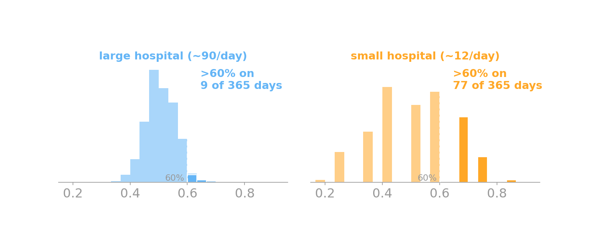{fig-align="center" width="58%"}
:::

::: {.notes}
Reveal sequence: (0) answer + LLN text; (1) the simulation figure fades in —
both hospitals centered at 50%, but the SMALL hospital's daily boy-fraction
swings wider, so its >60% tail is 19.4% vs 2.2% for the large one. THEN advance
to the next slide for the "that was Monte Carlo" payoff. ~1.5 min.
:::

## [That was Monte Carlo]{.lang-en}[それがモンテカルロだった]{.lang-ja} {.poll-reveal}

[**That was Monte Carlo.**]{.lang-en .accent}[**それがモンテカルロだった。**]{.lang-ja .accent}

::: {.lang-en}
You judged a probability by reasoning about **repeated random samples** — and more samples means a tighter answer. Today we make that the central tool.
:::
::: {.lang-ja}
**繰り返しのランダム標本**から確率を判断した — 標本が多いほど答えは締まる。今日はそれを中心的な道具にする。
:::

::: {.notes}
The payoff slide. They've just done Monte Carlo reasoning informally (and seen
it simulated); today we make it the central tool. ~30s.
:::

## [Why approximate?]{.lang-en}[なぜ近似する?]{.lang-ja}

::: {.lang-en}
Exact Bayesian inference means summing/integrating over **all** hypotheses — usually intractable.

- **Top-down strategy:** borrow good samplers from CS/statistics; then ask whether they double as *psychological processes*.
- When they do, we get **rational process models** — algorithms that are both good inference *and* candidate accounts of how the mind computes. [(Sanborn et al. 2010; Shi et al. 2010)]{.dim}
:::

::: {.lang-ja}
厳密なベイズ推論は**すべての**仮説にわたる和／積分 — たいてい計算不能。

- **トップダウン戦略：** 計算機科学・統計学から良いサンプラーを借りる。次にそれが*心理的過程*も兼ねるか問う。
- 兼ねるとき、**合理的過程モデル**が得られる — 良い推論であり、かつ心の計算の候補説明でもあるアルゴリズム。[(Sanborn et al. 2010; Shi et al. 2010)]{.dim}
:::

::: {.notes}
Marr framing from the SP25 opener. This is the umbrella for BOTH payoffs: MCMC
with People (MCMC as a process model) and particle filters (SIS as a process
model). ~1.5 min.
:::

# [Basic Monte Carlo]{.lang-en}[基本のモンテカルロ]{.lang-ja} {.section-break background-image="../../sds-reveal/sds_frame.png" background-size="cover"}

## [The Monte Carlo estimator]{.lang-en}[モンテカルロ推定量]{.lang-ja} {.smaller .mc-estimator}

::: {.lang-en}
To estimate an expectation $\mathbb{E}_{P}[f(x)]$ (the average of $f$ over draws from $P$), draw samples and **average**:
:::
::: {.lang-ja}
期待値 $\mathbb{E}_{P}[f(x)]$（$P$ からの引きにわたる $f$ の平均）を推定するには、標本を引いて**平均**を取る：
:::

$$\hat\mu_n = \frac{1}{n}\sum_{i=1}^{n} f(x_i), \qquad x_i \sim P(x)$$

::: {.lang-en}
[$\hat\mu_n$ = our $n$-sample **estimate** of that mean (the hat means "estimated").]{.dim}
:::
::: {.lang-ja}
[$\hat\mu_n$ = その平均の $n$ 標本**推定値**（ハットは「推定」の意）。]{.dim}
:::

:::: {.columns .v-center}
::: {.column width="40%"}
::: {.lang-en}
**Example — a die roll.** The average number of spots is $\mathbb{E}[x]=3.5$.

Roll it $n$ times and average. The estimate is noisy for small $n$ and settles toward **3.5** as $n$ grows.
:::
::: {.lang-ja}
**例 — サイコロ。** 目の平均は $\mathbb{E}[x]=3.5$。

$n$ 回振って平均する。小さい $n$ では推定はばらつき、$n$ が増えると **3.5** に落ち着く。
:::
:::
::: {.column width="60%"}
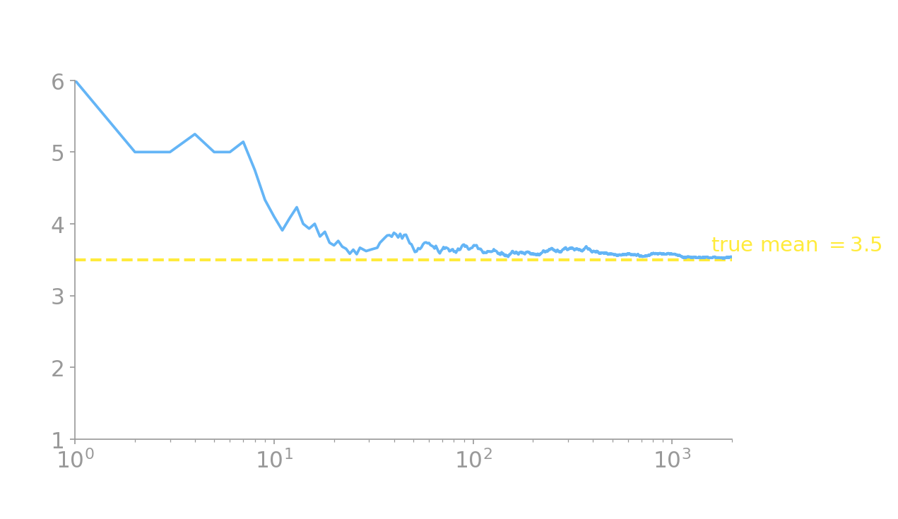{fig-align="center" width="90%"}
:::
::::

::: {.notes}
Define the estimator (mu-hat) full-width up top, then the die example as
text|figure two-column so the convergence plot is large and legible. The figure
IS the LLN from the hospital poll, now visual: small n noisy, large n
concentrates. Tie them together explicitly. ~2 min.
:::

## [Rejection sampling]{.lang-en}[棄却サンプリング]{.lang-ja} {.smaller}

:::: {.columns .v-center}
::: {.column width="56%"}
::: {.lang-en}
The average above needs samples from $P$ — but often we can't draw from $P$ directly. The simplest fix: **rejection sampling**.

- Sample from an **easy** region you *can* draw from (e.g. a box that contains $P$).
- **Keep** the points that fall under $P$ (inside the target region); **throw away** the rest.
- The kept points are distributed exactly as $P$ — and the *fraction kept* estimates $P$'s area/probability.

[Simple and exact, but it **wastes samples**: if $P$ fills little of the box, most draws are rejected. The next example makes this concrete.]{.dim}
:::
::: {.lang-ja}
上の平均には $P$ からの標本が要る — だが $P$ から直接引けないことが多い。最も簡単な対処：**棄却サンプリング**。

- 引ける**簡単な**領域（例：$P$ を含む箱）から引く。
- $P$ の下（目標領域の内側）に落ちた点は**残し**、それ以外は**捨てる**。
- 残った点はちょうど $P$ に従う — そして*残った割合*が $P$ の面積／確率を推定する。

[単純で厳密だが**標本を無駄にする**：$P$ が箱のごく一部しか占めないと大半が棄却される。次の例で具体化する。]{.dim}
:::
:::
::: {.column width="44%"}
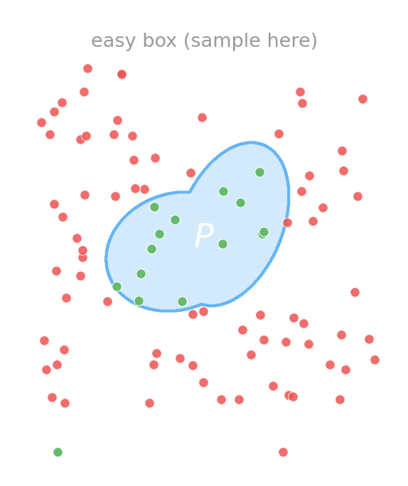{fig-align="center" width="92%"}
:::
::::

::: {.notes}
NEW full slide (was a half-column shared with inverse-CDF; inverse-CDF removed,
and this now comes BEFORE the darts per the reorder — rejection is defined first,
then the darts are rejection in action). Define rejection sampling: sample easy,
keep-under-P, reject the rest; kept points ~ P; fraction kept = area. Flag the
wastefulness -> motivates importance sampling later. ~1.5 min.
:::

## [π by throwing darts — rejection in action]{.lang-en}[ダーツで π を求める — 棄却サンプリングの実例]{.lang-ja} {.smaller}

:::: {.columns .v-center}
::: {.column width="54%"}
::: {.lang-en}
Rejection sampling in action. Throw darts at the **unit square** (the easy region): draw two uniforms $x,y \sim \text{Uniform}[0,1]$. **Keep** a dart when it's inside the quarter-circle, $x^2 + y^2 \le 1$; reject the rest.

- Quarter-circle area $= \pi/4$; square area $= 1$.
- So the **fraction kept** $\approx \pi/4$:

$$\hat\pi = 4\cdot\frac{\#\,\text{inside}}{\#\,\text{total}}$$

This is exactly $\hat\mu_n$ with $f(x,y) = \mathbb{1}[x^2+y^2\le 1]$.

[$\mathbb{1}[\cdot]$ = the **indicator**: 1 when the condition holds, 0 otherwise.]{.dim}
:::
::: {.lang-ja}
棄却サンプリングの実例。**単位正方形**（簡単な領域）にダーツを投げる：2つの一様乱数 $x,y \sim \text{Uniform}[0,1]$ を引く。$x^2 + y^2 \le 1$ で四分円の内側なら**残し**、それ以外は棄却。

- 四分円の面積 $= \pi/4$、正方形 $= 1$。
- だから**残った割合** $\approx \pi/4$：

$$\hat\pi = 4\cdot\frac{\#\,\text{inside}}{\#\,\text{total}}$$

これはまさに $f(x,y) = \mathbb{1}[x^2+y^2\le 1]$ の $\hat\mu_n$。

[$\mathbb{1}[\cdot]$ = **指示関数**：条件が成り立てば1、そうでなければ0。]{.dim}
:::
:::
::: {.column width="46%"}
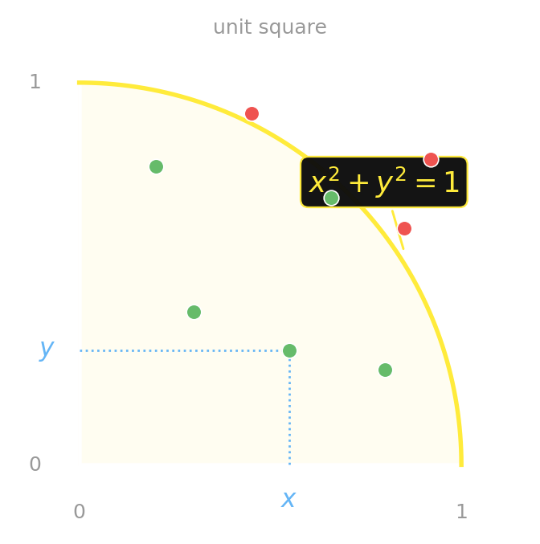{fig-align="center" width="92%"}
:::
::::

::: {.notes}
The canonical two-uniform-draws MC example (Prof. specifically wanted this).
The schematic shows the unit square + quarter-circle with x, y, and the arc
x^2+y^2=1 labeled, plus a few green-inside/red-outside example darts. Define the
indicator here — first use. Stress: f is just an indicator, so the average of f
IS the probability of landing inside, which IS pi/4. Next slide: watch it
converge. ~2 min.
:::

## [More darts → better estimate]{.lang-en}[ダーツが多いほど推定が良くなる]{.lang-ja}

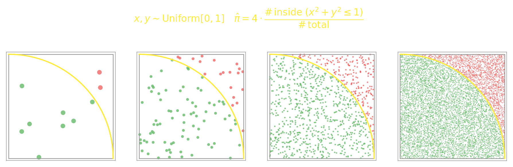{fig-align="center" width="100%"}

::: {.lang-en}
[Green = kept (inside), red = rejected (outside). The estimate tightens toward 3.14159… — the same law of large numbers, now in 2-D.]{.dim}
:::
::: {.lang-ja}
[緑=残す（内側）、赤=棄却（外側）。推定値は3.14159…へ締まる — 同じ大数の法則、今度は2次元で。]{.dim}
:::

::: {.notes}
Build-up: 10 -> 100 -> 1000 -> 10000. At n=10 it's wildly off; by 10^4 it's
~3.14. This visually closes the hospital/LLN poll a second time. ~1 min.
:::

## [What Monte Carlo gives you]{.lang-en}[モンテカルロが保証すること]{.lang-ja} {.smaller}

::: {.lang-en}
The estimator $\hat\mu_n$ is:

- **consistent** — converges to the truth as data grows: $\hat\mu_n \to \mathbb{E}[f]$ as $n\to\infty$.
- **unbiased** — correct *on average* even for small $n$: $\mathbb{E}[\hat\mu_n] = \mathbb{E}[f]$.
- **error shrinks like $1/\sqrt{n}$** — *regardless of dimension* [(unlike a grid, whose cost explodes as dimensions grow). The estimate's spread is approximately Gaussian — "asymptotically normal."]{.dim}
:::
::: {.lang-ja}
推定量 $\hat\mu_n$ は：

- **一致性** — データが増えると真値へ収束：$n\to\infty$ で $\hat\mu_n \to \mathbb{E}[f]$。
- **不偏性** — 小さい $n$ でも*平均的には*正しい：$\mathbb{E}[\hat\mu_n] = \mathbb{E}[f]$。
- **誤差は $1/\sqrt{n}$ で縮む** — *次元によらず* [（格子は次元とともにコストが爆発するが、MCはしない）。推定値のばらつきはほぼガウス — 「漸近正規」。]{.dim}
:::

::: {.fragment}
[**But:** rejection sampling **throws most draws away**. Can we instead **use every sample**, each weighted by how much it tells us about the quantity we're estimating? → importance sampling.]{.lang-en .yellow}
[**しかし：** 棄却サンプリングは**大半の引きを捨てる**。代わりに、**すべての標本を使い**、各標本を「推定したい量についてどれだけ情報を持つか」で重み付けできないか? → 重点サンプリング。]{.lang-ja .yellow}
:::

::: {.notes}
One keyword-clause per line. Don't derive — state. The 1/sqrt(n) "regardless of
dimension" is the headline (vs grid methods). The fragment now hinges off
rejection's wastefulness (introduced earlier) into importance sampling. ~1.5 min.
:::

## [In GenJAX: Monte Carlo is `simulate` + `vmap`]{.lang-en}[GenJAXでは：モンテカルロは `simulate` + `vmap`]{.lang-ja} {.smaller}

:::: {.columns .v-center}
::: {.column width="56%"}
```python
@gen
def dart():
    x = uniform(0.0, 1.0) @ "x"   # throw a dart
    y = uniform(0.0, 1.0) @ "y"
    return (x*x + y*y <= 1.0)     # f = 𝟙[inside]

key  = jax.random.key(0)
keys = jax.random.split(key, 10_000)
sim  = lambda k: dart.simulate(k, ())
traces = jax.vmap(sim)(keys)      # 10k darts
f = traces.get_retval()           # 0/1 per dart
pi_hat = 4.0 * jnp.mean(f)        # π̂ = 4·in/total
```
:::
::: {.column width="44%"}
::: {.lang-en}
- The **same darts** as before: two uniforms, keep when $x^2+y^2\le 1$.
- `simulate` throws **one** dart (a *trace*); `vmap` throws $n$ in parallel.
- `f` *is* the indicator $\mathbb{1}[\cdot]$; its mean is the fraction inside, so $\hat\pi = 4\cdot\overline f$.

[A probabilistic program's `simulate` *is* the sampler in the estimator.]{.dim}
:::
::: {.lang-ja}
- **さっきと同じダーツ**：2つの一様乱数、$x^2+y^2\le 1$ なら残す。
- `simulate` は**1本**のダーツ（*トレース*）；`vmap` で $n$ 本を並列に。
- `f` こそ指示関数 $\mathbb{1}[\cdot]$；その平均が内側の割合なので $\hat\pi = 4\cdot\overline f$。

[確率的プログラムの `simulate` こそが推定量の中のサンプラー。]{.dim}
:::
:::
::::

::: {.notes}
First "in GenJAX" callout, now using the SAME pi-darts example from the rejection
slides (Prof. request) so the API maps onto something students just saw. The
model draws the two uniforms and returns the indicator f; vmap throws 10k darts;
4*mean(f) is pi_hat. simulate = one dart, vmap = n darts, mean = the estimator.
Keep it light. ~1 min. Next slide shows the actual run output (the trace + values).
:::

## [...and running it]{.lang-en}[…そして実行すると]{.lang-ja} {.smaller}

:::: {.columns .v-center}
::: {.column width="50%"}
```text
# peek at the first 5 darts (the trace)
>>> traces.get_choices()["x"][:5]
Array([0.104, 0.091, 0.746, 0.849, 0.610])
>>> traces.get_choices()["y"][:5]
Array([0.228, 0.752, 0.743, 0.928, 0.989])
>>> f[:5]              # 𝟙[x²+y² ≤ 1]
Array([1, 1, 0, 0, 0])

>>> jnp.sum(f)         # darts inside
Array(7859)            # out of 10,000
>>> pi_hat
Array(3.1436, dtype=float32)
```
:::
::: {.column width="50%"}
::: {.lang-en}
- Dart 1 = $(0.10, 0.23)$: $x^2+y^2 = 0.06 \le 1$ → **inside** ($f=1$).
- Dart 3 = $(0.75, 0.74)$: $x^2+y^2 = 1.11 > 1$ → **outside** ($f=0$).
- $7859/10{,}000 = 0.786$ inside, so $\hat\pi = 4\times 0.786 = 3.14$.

[**The estimate landed on $\pi$.** Same trace, same indicator, same $4\cdot\overline f$ as the darts slide — now it's a probabilistic program.]{.dim}
:::
::: {.lang-ja}
- ダーツ1 = $(0.10, 0.23)$：$x^2+y^2 = 0.06 \le 1$ → **内側**（$f=1$）。
- ダーツ3 = $(0.75, 0.74)$：$x^2+y^2 = 1.11 > 1$ → **外側**（$f=0$）。
- $7859/10{,}000 = 0.786$ が内側、よって $\hat\pi = 4\times 0.786 = 3.14$。

[**推定は $\pi$ に当たった。** ダーツのスライドと同じトレース・同じ指示関数・同じ $4\cdot\overline f$ — それが確率的プログラムになっただけ。]{.dim}
:::
:::
::::

::: {.notes}
The SAME pi-darts code as the previous slide, now with the ACTUAL output from a
real GenJAX 0.10.3 run (key=0, 10,000 darts, pi_genjax.py). The trace shows the
two uniform draws per dart and the indicator f; 7859 darts land inside, so
pi_hat = 4*0.7859 = 3.1436. The two worked darts (1 inside, 3 outside) let
students verify the indicator by hand. Ties the abstract estimator to a number
on the screen AND to the exact darts they saw earlier. ~1.5 min.
:::

# [Importance sampling]{.lang-en}[重点サンプリング]{.lang-ja} {.section-break background-image="../../sds-reveal/sds_frame.png" background-size="cover"}

## [Sample the wrong distribution — then reweight]{.lang-en}[間違った分布から引いて — 重みで直す]{.lang-ja}

::: {.lang-en}
We want $\mathbb{E}_{P}[f] = \displaystyle\int f(x)\,p(x)\,dx$, but we **can't sample from $P$**.

Idea: sample from an **easy** distribution $q$ that we *can* draw from, and **correct** for using the wrong one.
:::
::: {.lang-ja}
求めたいのは $\mathbb{E}_{P}[f] = \displaystyle\int f(x)\,p(x)\,dx$ だが、$P$ から**標本を引けない**。

着想：引ける**簡単な**分布 $q$ から引き、間違った分布を使ったことを**補正**する。
:::

::: {.lang-en}
[$p, q$ = the **densities** of the target $P$ and the proposal $q$. Note $\mathbb{E}_P[f]$ already contains one factor of $p$ — it's the $p(x)$ in the integral.]{.dim}
:::
::: {.lang-ja}
[$p, q$ = 目標 $P$ と提案分布 $q$ の**密度**。$\mathbb{E}_P[f]$ は既に $p$ を1つ含む — 積分の中の $p(x)$ がそれ。]{.dim}
:::

::: {.notes}
Setup slide (1/4 of the importance-sampling build-up). The KEY framing that
prevents the common error: E_P[f] is the INTEGRAL ∫ f·p dx — it already has one
p in it. The trick on the next slide multiplies the integrand by q/q; it does
NOT multiply E_P[f] by p (that would double-count p → wrong f·p²/q). ~1 min.
:::

## [The trick: multiply by $q/q$]{.lang-en}[コツ：$q/q$ を掛ける]{.lang-ja} {.smaller}

::: {.lang-en}
Start from the integral, multiply the integrand by $1 = \dfrac{q(x)}{q(x)}$, and regroup:
:::
::: {.lang-ja}
積分から始め、被積分関数に $1 = \dfrac{q(x)}{q(x)}$ を掛けて、まとめ直す：
:::

$$\mathbb{E}_{P}[f] = \int f(x)\,p(x)\,dx
= \int f(x)\,p(x)\,\frac{q(x)}{q(x)}\,dx$$

::: {.fragment}
$$= \int \underbrace{f(x)\,\frac{p(x)}{q(x)}}_{\text{new integrand}}\;\underbrace{q(x)\,dx}_{\text{the measure for }\mathbb{E}_q}
= \mathbb{E}_{q}\!\left[f(x)\,\frac{p(x)}{q(x)}\right]$$
:::

::: {.lang-en}
[The leftover $q(x)\,dx$ is exactly what makes this an **expectation under $q$** — it's the density we integrate against. This is still an **exact identity**: no sampling yet. We *sample* from $q$ only on the next slide, to *estimate* this expectation.]{.dim}
:::
::: {.lang-ja}
[残った $q(x)\,dx$ こそが、これを **$q$ のもとの期待値**にする — 積分する密度。これは依然**厳密な恒等式**：まだサンプリングしていない。$q$ から*標本を引く*のは次のスライド、この期待値を*推定する*ためだけ。]{.dim}
:::

::: {.notes}
The derivation (2/4). The q/q trick, INSIDE the integral. The under-brace makes
explicit that one q joins f·p to make the weight and the OTHER q becomes the
measure. This is exactly where students (and the prof's own scratch work) slip:
do NOT write E_P[f] = E_P[f·p·q/q] — that inserts a SECOND p. The p is already
in the integral; we only insert q/q. ~2 min.
:::

## [The estimator and the weight]{.lang-en}[推定量と重み]{.lang-ja} {.smaller}

::: {.lang-en}
Now it's an expectation under $q$ — so estimate it the basic-MC way: draw $x_i \sim q$ and average.
:::
::: {.lang-ja}
これは $q$ のもとの期待値 — だから基本MCのように推定：$x_i \sim q$ を引いて平均する。
:::

::: {.lang-en}
First name the leftover factor — the **importance weight** $w(x)$:
:::
::: {.lang-ja}
まず残った因子に名前を — **重点重み** $w(x)$：
:::

$$w(x)=\frac{p(x)}{q(x)}$$

$$\mathbb{E}_{P}[f] = \mathbb{E}_{q}\!\left[f(x)\,w(x)\right]
\approx \frac{1}{n}\sum_{i=1}^{n} f(x_i)\,w(x_i)$$

::: {.lang-en}
[Up-weight where $p > q$, down-weight where $p < q$. **No samples are thrown away** — every draw counts, weighted by how useful it is.]{.dim}
:::
::: {.lang-ja}
[$p > q$ なら重く、$p < q$ なら軽く。**標本は一切捨てない** — すべての引きが、有用さに応じた重みで効く。]{.dim}
:::

::: {.fragment}
::: {.lang-en}
In practice we usually divide by the **sum of the weights** instead of $n$ — the **self-normalized** estimator:
$$\mathbb{E}_{P}[f] \approx \frac{\sum_i f(x_i)\,w(x_i)}{\sum_i w(x_i)}$$
[Now **only ratios of weights** appear — which is what lets $p$ be unnormalized (next slide).]{.dim}
:::
::: {.lang-ja}
実際には $n$ ではなく**重みの総和**で割ることが多い — **自己正規化**推定量：
$$\mathbb{E}_{P}[f] \approx \frac{\sum_i f(x_i)\,w(x_i)}{\sum_i w(x_i)}$$
[これで**重みの比**しか現れない — だから $p$ を未正規化にできる（次スライド）。]{.dim}
:::
:::

::: {.notes}
The estimator (3/4). First the plain (1/n) form + the importance weight at first
use. Then a fragment introduces the SELF-NORMALIZED form (divide by Σw, not n) —
this is what later slides ("p can be unnormalized", "exemplar models ARE
importance samplers") refer back to, so it must actually appear here. Only ratios
of weights survive → p can be unnormalized. ~2 min.
:::

## [Bonus: $p$ can be unnormalized]{.lang-en}[おまけ：$p$ は未正規化でよい]{.lang-ja} {.smaller}

::: {.lang-en}
With self-normalizing (previous slide), **only ratios of weights** appear, and each weight is itself a ratio $w = p/q$.

So $p$ may be **unnormalized**: if $p = \tilde p / Z$ for some unknown constant $Z$, the $Z$ **cancels** between numerator and denominator and never matters.
:::
::: {.lang-ja}
自己正規化（前スライド）により、**重みの比**しか現れず、各重みも比 $w = p/q$。

だから $p$ は**未正規化**でよい：$p = \tilde p / Z$（$Z$ は未知定数）なら、$Z$ は分子と分母で**打ち消え**、影響しない。
:::

$$\frac{\sum_i f(x_i)\,w_i}{\sum_i w_i}
\;=\; \frac{\sum_i f(x_i)\,\dfrac{\tilde p(x_i)}{{\color{red}Z}\,q(x_i)}}{\sum_i \dfrac{\tilde p(x_i)}{{\color{red}Z}\,q(x_i)}}
\;=\; \frac{\sum_i f(x_i)\,\dfrac{\tilde p(x_i)}{q(x_i)}}{\sum_i \dfrac{\tilde p(x_i)}{q(x_i)}}$$

[The same ${\color{red}Z}$ multiplies every term in **both** sums, so it factors out and cancels — gone.]{.dim style="text-align:center; display:block;"}

::: {.lang-en}
[This is huge for Bayesian work: a posterior $p(h\mid d) \propto p(d\mid h)\,p(h)$ is only known **up to** the constant $p(d)$ — and importance sampling doesn't need it.]{.dim}
:::
::: {.lang-ja}
[ベイズでは重要：事後分布 $p(h\mid d) \propto p(d\mid h)\,p(h)$ は定数 $p(d)$ **を除いて**しか分からない — 重点サンプリングはそれを必要としない。]{.dim}
:::

::: {.notes}
The unnormalized point (4/4), now its own slide instead of a cramped caption.
The payoff line connects to Bayesian posteriors (known only up to p(d)) — which
is exactly why IS matters for the Kemp model later. ~1 min.
:::

## [Good $q$ vs bad $q$: look at the weights]{.lang-en}[良い $q$ と悪い $q$：重みを見る]{.lang-ja} {.big-figure}

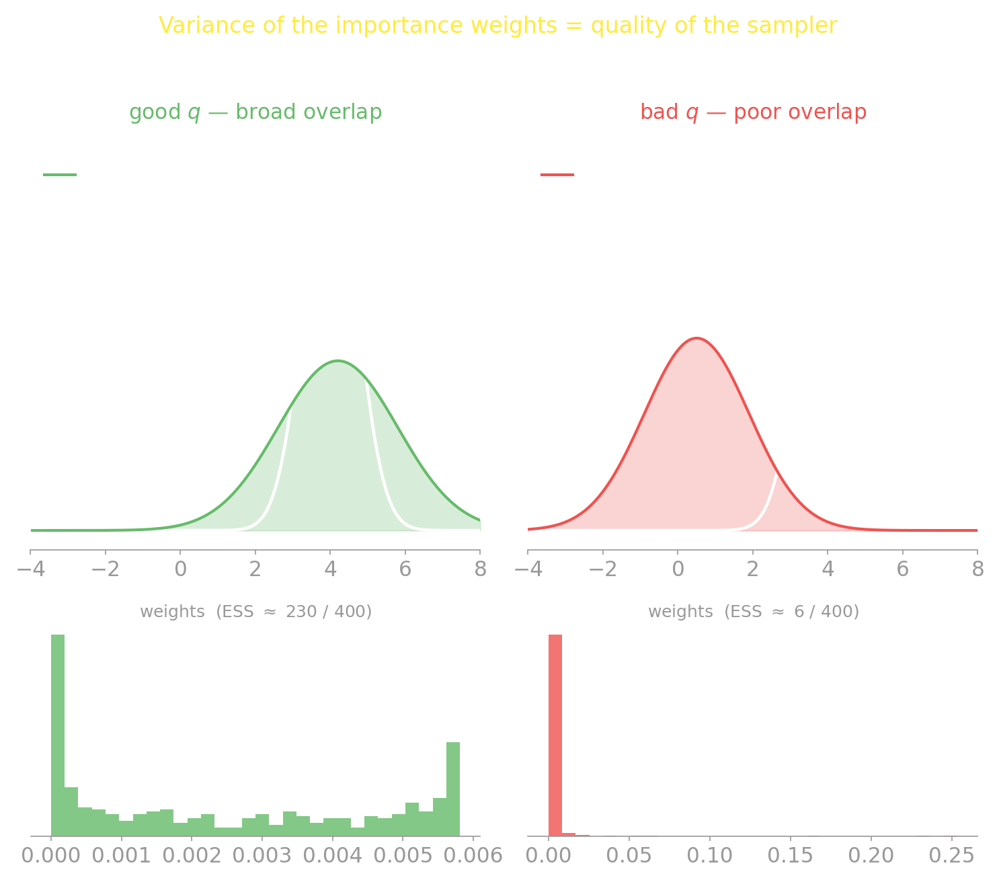{fig-align="center" width="100%"}

::: {.lang-en}
[**Weight variance = sampler quality.** A few huge weights (right) ⇒ effectively a handful of samples (**ESS** ≈ 6 of 400) ⇒ a noisy estimate. Good $q$ (left): ESS ≈ 230.]{.dim}
:::
::: {.lang-ja}
[**重みのばらつき = サンプラーの質。** 少数の巨大な重み（右）⇒ 実質わずかな標本（**ESS** ≈ 6/400）⇒ ノイズの多い推定。良い $q$（左）：ESS ≈ 230。]{.dim}
:::

::: {.notes}
Good q (broad overlap, even weights, ESS≈230) vs bad q (one weight dominates,
ESS≈6). ESS = effective sample size = (Σwᵢ)²/Σwᵢ² — how many independent draws
the weighted samples are really worth (out of 400). This diagnostic motivates the
"blunt tool" line for Kemp later. Next slide makes ESS a number you compute. ~2 min.
:::

## [Effective sample size, as a number]{.lang-en}[実効標本サイズ、数値として]{.lang-ja} {.smaller}

::: {.lang-en}
Put a number on "how many of my $T$ weighted samples actually count." With **normalized** weights ($w_t \ge 0$, $\sum_t w_t = 1$):

$$N_{\text{eff}} = \frac{1}{\sum_{t=1}^{T} w_t^{\,2}}$$

- **All weights equal** ($w_t = 1/T$) ⇒ $N_{\text{eff}} = T$. Nothing wasted.
- **One weight dominates** ⇒ $N_{\text{eff}} \to 1$. The estimate rests on a single sample.
- It measures **how even the weights are** — i.e. how well $q$ covers $p$ — *not* how accurate your final estimate is. (Hold onto that distinction; the assignment's Problem 3 turns on it.)
:::
::: {.lang-ja}
「$T$ 個の重み付き標本のうち実際に効くのは何個か」を数値化する。**正規化**重み（$w_t \ge 0$、$\sum_t w_t = 1$）で：

$$N_{\text{eff}} = \frac{1}{\sum_{t=1}^{T} w_t^{\,2}}$$

- **重みが全て等しい**（$w_t = 1/T$）⇒ $N_{\text{eff}} = T$。無駄なし。
- **1つの重みが支配**⇒ $N_{\text{eff}} \to 1$。推定が1標本に依存。
- これは**重みの均等さ**（= $q$ が $p$ をどれだけ覆うか）を測る — 最終推定の*正確さ*ではない。（この区別を覚えておく；課題の問題3の核心。）
:::

::: {.notes}
NEW slide (added for the assignment: Problem 3 needs N_eff as a computable
quantity, not just the dim caption on the previous figure). The formula, the two
limits (uniform -> T, peaked -> 1), and the key warning that ESS measures weight-
evenness NOT estimator accuracy -- which is exactly the Problem 3(b) puzzle (plain
MC gets N_eff = T yet IS is the better estimator). Don't belabor; the PDF carries
the full puzzle. ~1.5 min.
:::

## [The simplest importance sampler]{.lang-en}[最も簡単な重点サンプラー]{.lang-ja}

::: {.lang-en}
For a posterior $P(h\mid d)$, use the **prior as the proposal**: $q = P(h)$. Then the weights are just the likelihood:
:::
::: {.lang-ja}
事後分布 $P(h\mid d)$ には、**事前分布を提案に**使う：$q = P(h)$。すると重みは尤度そのもの：
:::

$$w(h) = \frac{P(h\mid d)}{P(h)} = \frac{P(d\mid h)\,P(h)}{P(d)\,P(h)} = \frac{P(d\mid h)}{P(d)} \;\propto\; P(d\mid h)$$

::: {.lang-en}
[**Sample from the prior, weight by the likelihood.** That's the whole recipe.]{.yellow}

[We don't know $P(d)$, so divide by the **sum of the weights** instead of $1/n$ — this is **self-normalized** importance sampling: $\;\mathbb{E}[f]\approx \sum_i f(h_i)w_i / \sum_i w_i$.]{.dim}
:::
::: {.lang-ja}
[**事前から引き、尤度で重み付け。** これがレシピのすべて。]{.yellow}

[$P(d)$ は未知なので、$1/n$ ではなく**重みの総和**で割る — これが**自己正規化**重点サンプリング：$\;\mathbb{E}[f]\approx \sum_i f(h_i)w_i / \sum_i w_i$。]{.dim}
:::

::: {.notes}
Likelihood weighting. The P(d) cancels into a normalizing constant -> self-
normalized IS. This is the pattern GenJAX's .importance gives you for free
(next-but-one slide). ~1.5 min.
:::

## [Exemplar models *are* importance samplers]{.lang-en}[事例モデルは重点サンプラーである]{.lang-ja} {.smaller}

::: {.lang-en}
A cognitive aside that recurs all term. **Exemplar models** (Nosofsky 1986) answer with a similarity-weighted vote over stored examples ($x_i$):
:::
::: {.lang-ja}
学期を通じて再登場する認知の余談。**事例モデル**（Nosofsky 1986）は、記憶した例（$x_i$）にわたる類似度重み付き投票で答える：
:::

:::: {.columns .v-center}
::: {.column width="40%"}
$$\text{response}(x) = \frac{\sum_i s(x, x_i)\,f(x_i)}{\sum_i s(x, x_i)}$$

::: {.lang-en}
[$s(x, x_i)$ = **similarity** between the query $x$ and stored example $x_i$ (the weight); $f(x_i)$ = the **label/output** stored with example $i$.]{.dim}
:::
::: {.lang-ja}
[$s(x, x_i)$ = クエリ $x$ と記憶例 $x_i$ の**類似度**（重み）；$f(x_i)$ = 例 $i$ に保存された**ラベル／出力**。]{.dim}
:::
:::
::: {.column width="60%"}
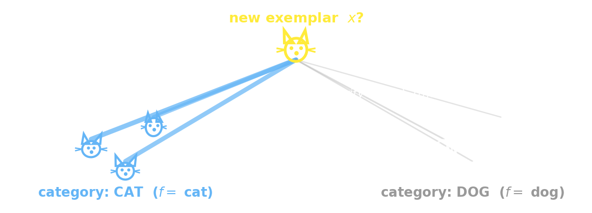{width="100%"}
:::
::::

::: {.lang-en}
This is **exactly** the self-normalized importance sampler from earlier ($\sum_i w\,f / \sum_i w$) — the stored exemplars are the samples, and similarity $s$ plays the role of the weight $w$.
:::
::: {.lang-ja}
これは先ほどの**自己正規化重点サンプラーそのもの**（$\sum_i w\,f / \sum_i w$）— 記憶した事例が標本、類似度 $s$ が重み $w$ の役割。
:::

::: {.notes}
The course through-line: a famous psychological model turns out to be an
inference algorithm. Optional/compressible if behind. ~1.5 min.
:::

## [In GenJAX: importance sampling for free]{.lang-en}[GenJAXでは：重点サンプリングが無料]{.lang-ja} {.smaller}

:::: {.columns .v-center}
::: {.column width="58%"}
```python
# the model's PRIOR is the default proposal
trace, log_weight = model.importance(
    key, constraint, args)

# score a custom proposal yourself
log_p, retval = model.assess(choices, args)

# K particles (sequential Monte Carlo)
alg = smc.ImportanceK(
    Target(model, args, constraint),
    k_particles=100)
```
:::
::: {.column width="42%"}
::: {.lang-en}
- `importance` returns a sample **and** its `log_weight` — "sample from prior, weight by likelihood" in one call.
- `assess` scores choices under the model — the primitive you'll reuse for MCMC.
:::
::: {.lang-ja}
- `importance` は標本**と**その `log_weight` を返す — 「事前から引き、尤度で重み付け」を1呼び出しで。
- `assess` はモデル下で選択を採点 — MCMCで再利用する基本演算。
:::
:::
::::

::: {.notes}
The key map: .importance IS likelihood weighting. The prior is the default
proposal, so you get the previous slide's recipe for one call. Flag assess now —
it's the scoring primitive that MCMC needs. ~1.5 min.
:::

## [...importance sampling, run]{.lang-en}[…重点サンプリングを実行]{.lang-ja} {.smaller}

:::: {.columns .v-center}
::: {.column width="54%"}
```python
# coin with unknown bias; observe heads
@gen
def coin():
    theta = beta(2.0, 2.0) @ "theta"
    y = flip(theta) @ "y"
    return theta

obs = C["y"].set(True)          # condition: heads
def one(k):
    tr, logw = coin.importance(k, obs, ())
    return tr.get_retval(), logw
thetas, logws = jax.vmap(one)(
    jax.random.split(key, 5000))
# self-normalize: weight by the likelihood
w = jnp.exp(logws); w = w / w.sum()
post_mean = jnp.sum(w * thetas)
```
:::
::: {.column width="46%"}
```text
>>> logws[0]    # = log p(heads|θ)
Array(-0.216, dtype=float32)

>>> thetas[:3]  # prior draws of θ
Array([0.806, 0.485, 0.455],
      dtype=float32)

>>> post_mean   # E[θ | heads]
Array(0.605, dtype=float32)

# true posterior Beta(3,2)
#   mean = 0.600  ✓
```

::: {.lang-en}
[Sampled $\theta$ from the **prior**, weighted each by the **likelihood** of heads — the estimate $0.605$ matches the exact posterior mean $0.600$.]{.dim}
:::
::: {.lang-ja}
[$\theta$ を**事前**から引き、表の**尤度**で重み付け — 推定 $0.605$ は厳密な事後平均 $0.600$ に一致。]{.dim}
:::
:::
::::

::: {.notes}
The importance-sampling output slide, with ACTUAL output from a real GenJAX
0.10.3 run. A coin: theta ~ Beta(2,2), observe y=heads. coin.importance returns
(trace, log_weight) where log_weight = log p(heads|theta) = the likelihood.
Self-normalize (weight by exp(logw), divide by the sum) → E[theta|heads] = 0.605,
matching the exact Beta(3,2) posterior mean 0.600. This is "sample from prior,
weight by likelihood" made concrete, AND a beta-bernoulli preview of the Kemp
model. ~1.5 min.
:::

## [Poll — when the prior is a bad proposal]{.lang-en}[ポール — 事前が悪い提案のとき]{.lang-ja} {.poll-slide .smaller}

::: {.lang-en}
You importance-sample a posterior using the **prior** as $q$. The prior and posterior **barely overlap**. What happens to your estimate?
:::
::: {.lang-ja}
**事前**を $q$ として事後分布を重点サンプリングする。事前と事後が**ほとんど重ならない**。推定はどうなる?
:::

::: {.fragment}
::: {.lang-en}
- **A.** a few samples get huge weights — the estimate is noisy
- **B.** all weights are equal — the estimate is exact
- **C.** every sample is rejected
:::
::: {.lang-ja}
- **A.** 少数の標本が巨大な重みを持つ — 推定はノイズだらけ
- **B.** すべての重みが等しい — 推定は厳密
- **C.** すべての標本が棄却される
:::
:::

::: {.fragment}
[**A** — weight variance blows up. This is *exactly* why the textbook's importance sampling for the Kemp hyperparameters was a **"blunt tool."** We fix it with MCMC.]{.lang-en .yellow}
[**A** — 重みのばらつきが爆発。これがまさに、教科書のKemp超パラメータの重点サンプリングが**「鈍い道具」**だった理由。MCMCで直す。]{.lang-ja .yellow}
:::

::: {.notes}
Sourced fresh (IS overlap intuition). Optional — cut first if behind. It sets up
the "blunt tool" callback for Block 9. Note A and C are both tempting; C is the
rejection-sampling answer, A is the IS answer. ~1 min.
:::

# [Particle filtering]{.lang-en}[粒子フィルタ]{.lang-ja} {.section-break background-image="../../sds-reveal/sds_frame.png" background-size="cover"}

## [Data arriving over time]{.lang-en}[時間とともに届くデータ]{.lang-ja}

::: {.lang-en}
When data come one at a time, recomputing $P(h\mid d_1,\dots,d_n)$ from scratch each step is wasteful. Exploit a simple fact:
:::
::: {.lang-ja}
データが1つずつ届くとき、毎回 $P(h\mid d_1,\dots,d_n)$ をゼロから計算し直すのは無駄。簡単な事実を使う：
:::

$$P(h\mid d_1,\dots,d_n) \;\propto\; P(d_n\mid h)\;\underbrace{P(h\mid d_1,\dots,d_{n-1})}_{\text{yesterday's posterior}}$$

::: {.lang-en}
[**Yesterday's posterior is today's prior.** Repeated importance sampling over a growing dataset = a **particle filter** (a.k.a. sequential Monte Carlo).]{.yellow}
:::
::: {.lang-ja}
[**昨日の事後分布が今日の事前分布。** 増えていくデータに対する繰り返しの重点サンプリング = **粒子フィルタ**（逐次モンテカルロ）。]{.yellow}
:::

::: {.notes}
SIS. The recursion IS Bayes applied incrementally. Names: particle filter, SMC,
bootstrap filter, condensation, survival of the fittest. ~2 min.
:::

## [The particle filter]{.lang-en}[粒子フィルタの仕組み]{.lang-ja}

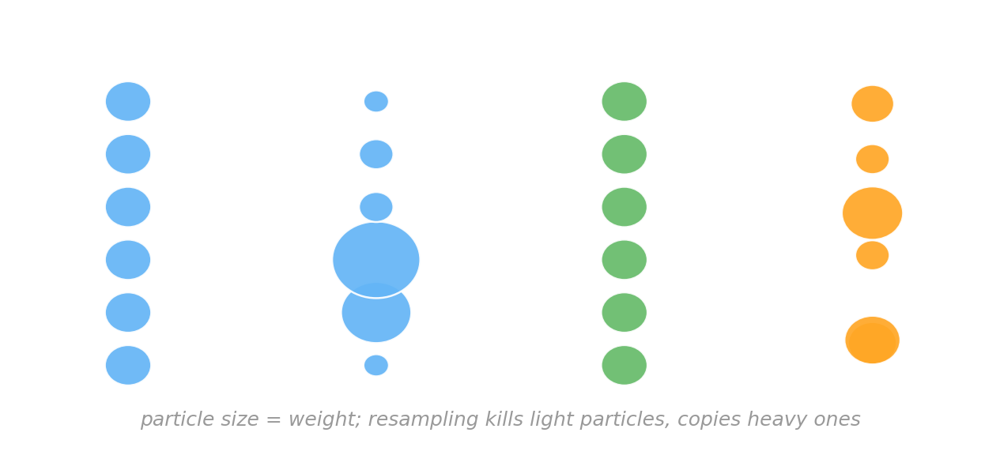{fig-align="center" width="92%"}

::: {.lang-en}
[Init $M$ particles from the prior. Per datum: **weight** by $P(d_n\mid h)$, normalize, and **resample** if the weights degenerate (kill light particles, copy heavy ones).]{.dim}
:::
::: {.lang-ja}
[$M$ 個の粒子を事前から初期化。各データで：$P(d_n\mid h)$ で**重み付け**、正規化、重みが偏れば**再サンプリング**（軽い粒子を捨て、重い粒子を複製）。]{.dim}
:::

::: {.notes}
Walk the schematic left to right. Resampling is the trick that stops all the
weight piling onto one particle. ~2 min.
:::

## [A worked example: tracking a moving object]{.lang-en}[実例：動く物体を追跡する]{.lang-ja} {.smaller}

::: {.lang-en}
A robot slides along a line; we want its position over time. We carry **5 particles** — guesses for where it is. Tracking over time needs **two modeling assumptions** — the same two any state-space model makes:
:::
::: {.lang-ja}
ロボットが直線上を滑る。各時刻での位置を知りたい。**5粒子**（位置の推測）を運ぶ。時間追跡には、状態空間モデルが常に置く**2つのモデル仮定**が必要：
:::

::: {.lang-en}
- **Observation model** $P(z \mid x)$ — how a state produces a sensor reading. Here: $z \sim \mathcal{N}(x, \sigma^2)$ (noisy sensor). Gives the **weight** $w_i \propto P(z \mid x_i)$.
- **Motion model** $P(x_{t} \mid x_{t-1})$ — how the state *evolves* between ticks. Here we **assume** the robot drifts $+1$ with a little noise. Used to **propagate**.

[Both are *your* modeling choices, not facts. If the thing **doesn't move**, the motion model is just "stay put" ($x_t = x_{t-1}$) — particle filtering doesn't *require* dynamics, only that you state *some* transition.]{.dim}
:::
::: {.lang-ja}
- **観測モデル** $P(z \mid x)$ — 状態がどうセンサ値を生むか。ここでは $z \sim \mathcal{N}(x, \sigma^2)$（ノイズ付きセンサ）。**重み** $w_i \propto P(z \mid x_i)$ を与える。
- **運動モデル** $P(x_{t} \mid x_{t-1})$ — 状態が刻みの間にどう*変化*するか。ここではロボットが少しのノイズ付きで $+1$ ドリフトすると**仮定**。**伝播**に使う。

[どちらも*あなたの*モデル選択であって事実ではない。対象が**動かない**なら、運動モデルは単に「その場に留まる」（$x_t = x_{t-1}$）— 粒子フィルタは動力学を*要求しない*。何らかの遷移を述べればよいだけ。]{.dim}
:::

::: {.notes}
Set up the 1-D tracking problem before the three step slides. CRITICAL framing
(Prof. note): a particle filter is inference in a STATE-SPACE model, which has
TWO assumed pieces — the observation model (gives weights) and the motion/
transition model (gives propagation). Both are modeling choices, NOT given. The
"+1 drift" in Step 3 is an ASSUMPTION, introduced here so it isn't a surprise.
Defuse the misconception that PF needs dynamics: a static state just uses the
identity transition (x_t = x_{t-1}) — PF still works, you just don't move the
particles. The state (x_i), observation (z), weight (w_i) symbols recur on every
step figure. ~2 min.
:::

## [Step 1 — weight by the observation]{.lang-en}[ステップ1 — 観測で重み付け]{.lang-ja} {.big-figure}

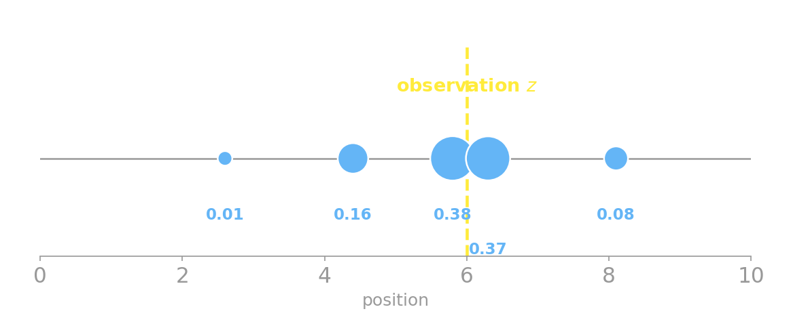{fig-align="center"}

::: {.lang-en}
[Each particle gets a weight $w_i \propto P(z \mid x_i)$ — bigger dots are heavier. The two particles flanking the observation carry almost all the weight; the far ones are nearly zero.]{.dim}
:::
::: {.lang-ja}
[各粒子に重み $w_i \propto P(z \mid x_i)$ — 大きい点ほど重い。観測の両隣の2粒子がほぼ全重みを持ち、遠い粒子はほぼゼロ。]{.dim}
:::

::: {.notes}
The weights ARE importance weights — this is sequential importance sampling.
Particles near z (the yellow line) explain the data well. ~1 min.
:::

## [Step 2 — resample]{.lang-en}[ステップ2 — 再サンプリング]{.lang-ja} {.big-figure}

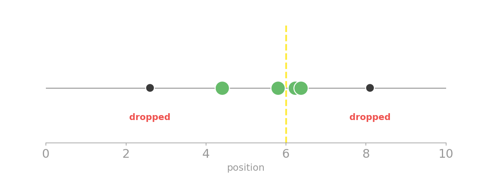{fig-align="center"}

::: {.lang-en}
[Draw 5 **new** particles with replacement, each chosen with probability $\propto w_i$. Heavy particles get copied (sometimes twice); the two far-from-$z$ particles are **dropped**. Same particle count, mass now concentrated where the data points.]{.dim}
:::
::: {.lang-ja}
[確率 $\propto w_i$ で5個の**新しい**粒子を復元抽出。重い粒子は複製され（時に2回）、$z$ から遠い2粒子は**捨てられる**。粒子数は同じだが、質量はデータの指す場所に集中。]{.dim}
:::

::: {.notes}
Resampling kills the degeneracy: without it, one particle would eventually hog
all the weight. After resampling the weights reset to uniform. ~1 min.
:::

## [Step 3 — propagate]{.lang-en}[ステップ3 — 伝播]{.lang-ja} {.big-figure}

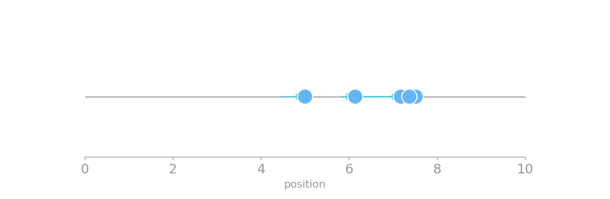{fig-align="center"}

::: {.lang-en}
[Push every particle forward through the **assumed motion model** $P(x_t \mid x_{t-1})$ from the setup (here: drift $+1$, plus a little noise). The cloud is now this tick's **prior** — ready to be weighted by the next observation. Loop back to Step 1. *(Static target? This step is just $x_t = x_{t-1}$ — the particles stay put.)*]{.dim}
:::
::: {.lang-ja}
[各粒子を設定で**仮定した運動モデル** $P(x_t \mid x_{t-1})$ で前進（ここでは：ドリフト $+1$ と少しのノイズ）。この雲が今刻みの**事前分布** — 次の観測で重み付けする準備完了。ステップ1へ戻る。*（対象が静止？ この手順は単に $x_t = x_{t-1}$ — 粒子はその場に留まる。）*]{.dim}
:::

::: {.notes}
Propagate = apply the transition. This closes the loop: propagated cloud is the
prior for the next weight step. weight->resample->propagate, repeat. ~1 min.
:::

## [The particle filter in GenJAX]{.lang-en}[GenJAXでの粒子フィルタ]{.lang-ja} {.smaller}

:::: {.columns .v-center}
::: {.column width="60%"}
```python
@gen
def step(x_prev):
    x = normal(x_prev + 1.0, 0.5) @ "x"  # propagate
    z = normal(x, 1.2) @ "z"             # observe
    return x

def filter(key, observations, xs):
    for z in observations:
        k1, k2, key = jax.random.split(key, 3)
        # weight: importance over all particles at once
        keys = jax.random.split(k1, len(xs))
        tr, log_w = jax.vmap(lambda k, xp:
            step.importance(k, C["z"].set(z), (xp,))
        )(keys, xs)
        # resample ∝ weight
        idx = jax.random.categorical(k2, log_w,
                                     shape=xs.shape)
        xs = tr.get_choices()["x"][idx]
    return xs
```
:::
::: {.column width="40%"}
::: {.lang-en}
- The **same three steps**: `importance` = weight, `categorical` = resample, the next loop's `simulate` inside `step` = propagate.
- `importance` returns each particle **and** its `log_weight` — no hand-derived likelihood.
- `vmap` runs all particles in parallel on one device.
:::
::: {.lang-ja}
- **同じ3ステップ**：`importance` = 重み付け、`categorical` = 再サンプリング、次ループの `step` 内 `simulate` = 伝播。
- `importance` は各粒子**と**その `log_weight` を返す — 尤度を手で導出しない。
- `vmap` で全粒子を1デバイス上で並列実行。
:::
:::
::::

::: {.notes}
The bootstrap filter, hand-rolled — 0.10.3 has no high-level chain(), so we
write the loop. The point: importance/categorical/simulate ARE the three
algorithm steps. Upstream v1.0.10 packages this as smc helpers. ~2 min.
:::

## [...the filter, run]{.lang-en}[…フィルタを実行]{.lang-ja} {.smaller}

:::: {.columns .v-center}
::: {.column width="52%"}
```python
# object drifts +1 per tick from 1
true  = [1, 2, 3, 4, 5]
# noisy sensor readings
obs   = [1.3, 1.8, 3.4, 3.9, 5.2]

ests = []
xs = init_particles(key, M=1000)
for z, x in run(key, obs):
    ests.append(float(jnp.mean(xs)))
```

```text
true  : [1.0, 2.0, 3.0, 4.0, 5.0]
obs   : [1.3, 1.8, 3.4, 3.9, 5.2]
PF est: [1.1, 1.96, 3.07, 4.01, 5.08]
```
:::
::: {.column width="48%"}
::: {.lang-en}
- The filter's mean tracks the **true** position [1, 2, 3, 4, 5] — even though it only ever sees the **noisy** observations.
- It **smooths**: the estimate $1.96$ at tick 2 is pulled back toward the track from the noisy $1.8$, because the motion model says "you should be near 2."
- 1000 particles, real GenJAX 0.10.3 output.
:::
::: {.lang-ja}
- フィルタの平均は**真の**位置 [1, 2, 3, 4, 5] を追う — **ノイズの多い**観測しか見ていないのに。
- **平滑化**する：刻み2での推定 $1.96$ は、運動モデルが「2付近のはず」と言うので、ノイズの多い $1.8$ から軌道側へ引き戻される。
- 1000粒子、実際の GenJAX 0.10.3 出力。
:::
:::
::::

::: {.notes}
Real run (pf_genjax.py). The headline: PF est tracks the true track, smoothing
the noisy obs — motion model + observations combined. This is exactly the
worked example, now in code with 1000 particles. ~1.5 min.
:::

## [Particle filters as process models]{.lang-en}[過程モデルとしての粒子フィルタ]{.lang-ja} {.smaller}

::: {.lang-en}
**Why this, of all approximations?** A particle filter is a probabilistic approximation that builds **incrementally** — yesterday's posterior is today's prior. But "incremental + probabilistic" alone isn't special (exact recursive Bayes is too). What makes it a *cognitive* model is the **shape** of its approximation: it holds a **small, fixed number of concrete hypotheses** ($M$ particles), updated by **stochastic resampling**.

That specific form predicts the ways people *deviate* from full Bayes:

- **limited memory** — only $M$ hypotheses carried forward (people track a handful, not a full distribution; $M$ is a fittable "how-approximate" knob).
- **order effects** — early data decide which particles survive (Kruschke 2006); a parametric incremental filter wouldn't predict this.
- **variability** — resampling is random, so two people (two runs) can land on different beliefs from the same data.

[Applied to feature learning (Austerweil & Griffiths 2013), categorization (Sanborn et al. 2006), associative learning, changepoint detection, sentence processing. **In GenJAX:** `smc.*` chained over the observations.]{.dim}
:::
::: {.lang-ja}
**なぜ数ある近似の中でこれか？** 粒子フィルタは**逐次的に**構築する確率的近似 — 昨日の事後分布が今日の事前分布。だが「逐次的＋確率的」だけでは特別でない（厳密な逐次ベイズもそう）。*認知*モデルにするのは近似の**形**：**少数で固定個数の具体的仮説**（$M$ 粒子）を、**確率的な再サンプリング**で更新する点。

その形こそが、人が完全ベイズから*逸脱*する仕方を予測する：

- **限られた記憶** — 前へ運ぶ仮説は $M$ 個だけ（人は完全な分布でなく少数を追う；$M$ は「どれだけ近似か」の調整つまみ）。
- **順序効果** — 早いデータがどの粒子が生き残るかを決める（Kruschke 2006）；パラメトリックな逐次フィルタはこれを予測しない。
- **ばらつき** — 再サンプリングは確率的なので、同じデータでも2人（2回の実行）が異なる信念に至りうる。

[特徴学習（Austerweil & Griffiths 2013）、カテゴリ化（Sanborn et al. 2006）、連合学習、変化点検出、文処理に応用。**GenJAXでは：** 観測にわたって連鎖させた `smc.*`。]{.dim}
:::

::: {.notes}
Answers the Prof's question "why PF, not just any incremental approximation?"
The honest argument: incremental+probabilistic is necessary but NOT sufficient
(exact recursive Bayes / Kalman is also incremental + probabilistic and predicts
NO human deviations). What singles out the PF is the FORM of its approximation —
a finite sample of discrete hypotheses (M particles) updated by stochastic
resampling. That specific form is what reproduces the documented human signatures:
few hypotheses (Vul et al. 2014 "one and done"), order/primacy effects, and
run-to-run variability. Contrast: a parametric incremental filter (assumed-density
/ variational) smooths the posterior into a Gaussian and predicts none of these.
So M is a fittable approximation-budget knob a normative model doesn't have.
Refs: Sanborn, Griffiths & Navarro 2010; Vul, Goodman, Griffiths & Tenenbaum 2014;
Abbott & Griffiths. ~2 min.
:::

# [MCMC: design a chain to hit a target]{.lang-en}[MCMC：目標を狙う連鎖を設計]{.lang-ja} {.section-break background-image="../../sds-reveal/sds_frame.png" background-size="cover"}

## [Running Week 6 backwards]{.lang-en}[第6週を逆向きに走らせる]{.lang-ja}

::: {.lang-en}
Last week you **found** a chain's stationary distribution $\pi$ by running it.

[$\pi$ is stationary when $\pi P = \pi$ — one more step doesn't change it.]{.dim}

This week we **reverse it**: start with a target $P(x)$ we *want* (a posterior), and **design** a Markov chain whose stationary distribution **is** $P(x)$. That's **Markov chain Monte Carlo (MCMC)**.
:::
::: {.lang-ja}
先週は、連鎖を走らせて定常分布 $\pi$ を**見つけた**。

[$\pi$ は $\pi P = \pi$ のとき定常 — もう1ステップ進めても変わらない。]{.dim}

今週は**逆向き**：欲しい目標 $P(x)$（事後分布）から始め、その定常分布が $P(x)$ **になる**マルコフ連鎖を**設計**する。これが **マルコフ連鎖モンテカルロ（MCMC）**。
:::

::: {.fragment}
[Two schemes: **Metropolis–Hastings** and **Gibbs**.]{.lang-en .yellow}
[2つの方式：**メトロポリス・ヘイスティングス**と**ギブズ**。]{.lang-ja .yellow}
:::

::: {.notes}
The named callback to Week 6 — one line, don't re-derive pi. The "reverse the
arrow" framing is the conceptual core of the week. ~1.5 min.
:::

## [Metropolis–Hastings]{.lang-en}[メトロポリス・ヘイスティングス]{.lang-ja} {.smaller}

::: {.lang-en}
[(Metropolis et al. 1953; Hastings 1970)]{.dim} &nbsp; [$x^{(t)}$ = the state at iteration $t$.]{.dim}

- **Step 0.** Start anywhere: $x^{(0)}$.
- **Step 1.** **Propose** a move $x' \sim Q(x'\mid x^{(t)})$. [$Q$ = the **proposal** — usually a Gaussian step $Q=\mathcal{N}(x^{(t)}, \sigma^2)$, width $\sigma$. ($\mathcal{N}(\mu,\sigma^2)$ = Normal, mean $\mu$, variance $\sigma^2$.)]{.dim}
- **Step 2.** **Accept** with probability $A = \min\!\left(1,\, \dfrac{P(x')}{P(x^{(t)})}\right)$ *(symmetric-proposal form)*. Otherwise stay.
:::
::: {.lang-ja}
[(Metropolis et al. 1953; Hastings 1970)]{.dim} &nbsp; [$x^{(t)}$ = 反復 $t$ での状態。]{.dim}

- **手順0.** どこからでも開始：$x^{(0)}$。
- **手順1.** 移動を**提案**：$x' \sim Q(x'\mid x^{(t)})$。[$Q$ = **提案分布** — ふつうガウスのステップ $Q=\mathcal{N}(x^{(t)}, \sigma^2)$、幅 $\sigma$。（$\mathcal{N}(\mu,\sigma^2)$ = 正規分布、平均 $\mu$・分散 $\sigma^2$。）]{.dim}
- **手順2.** 確率 $A = \min\!\left(1,\, \dfrac{P(x')}{P(x^{(t)})}\right)$ で**受理**（*対称提案の形*）。さもなくば留まる。
:::

::: {.lang-en}
[Intuition: a move **uphill** (toward higher $P$) is **always** accepted; a move **downhill** is accepted *sometimes*, in proportion to how far down it goes. That's what lets the chain explore yet still favor high-probability regions.]{.dim}
:::
::: {.lang-ja}
[直観：**上り**（$P$ が高い方）への移動は**必ず**受理。**下り**は*ときどき*受理 — どれだけ下るかに比例して。これが、連鎖が探索しつつも高確率領域を好む仕組み。]{.dim}
:::

::: {.fragment}
[A Gaussian step is **symmetric** ($Q(x'\mid x)=Q(x\mid x')$), so the $Q$ terms cancel and only $P(x')/P(x)$ is left — that's the **Metropolis** special case. (Full Hastings keeps a $Q(x\mid x')/Q(x'\mid x)$ factor for asymmetric proposals.) And only the **ratio** of $P$ matters, so the **normalizing constant cancels** — you never need $P(d)$.]{.lang-en .accent}
[ガウスのステップは**対称**（$Q(x'\mid x)=Q(x\mid x')$）なので $Q$ が打ち消え、$P(x')/P(x)$ だけが残る — これが**メトロポリス**の特別な場合。（一般のヘイスティングスは非対称提案のため $Q(x\mid x')/Q(x'\mid x)$ を残す。）さらに $P$ の**比**だけが効くので**正規化定数も打ち消え**、$P(d)$ は要らない。]{.lang-ja .accent}
:::

::: {.notes}
Define proposal Q (now concrete: Gaussian width sigma), acceptance ratio A, and
the iteration superscript x^(t) at first use. Two cancellations: (1) symmetric Q
cancels -> Metropolis special case (answers "where did the Hastings term go?");
(2) normalizer cancels -> why MCMC beats exact inference. The sigma here is the
demo's slider. ~2 min.
:::

## [MH, step by step (1/3)]{.lang-en}[MH、一歩ずつ (1/3)]{.lang-ja}

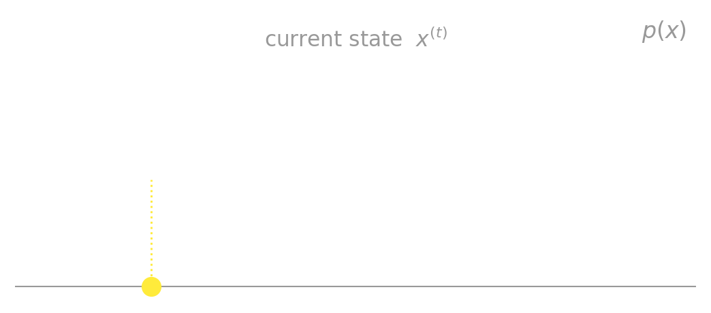{fig-align="center" width="92%"}

::: {.lang-en}
[We want to sample this multimodal $p(x)$. The chain sits at the current state.]{.dim}
:::
::: {.lang-ja}
[この多峰性 $p(x)$ から標本を取りたい。連鎖は現在の状態にいる。]{.dim}
:::

::: {.notes}
Sibling-slide build-up (not fragments) so it reads as animation. Slide 1: just
the current point on the target. ~20s.
:::

## [MH, step by step (2/3)]{.lang-en}[MH、一歩ずつ (2/3)]{.lang-ja}

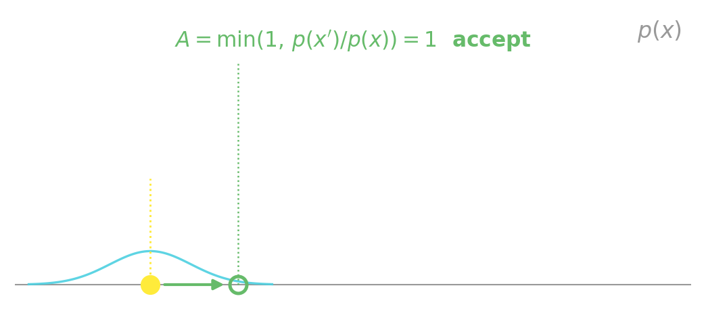{fig-align="center" width="92%"}

::: {.lang-en}
[Propose a nearby move. It's **uphill** ($p(x') > p(x)$), so the ratio $p(x')/p(x) > 1$ and $A=\min(1,\cdot)=1$ — **always accept**.]{.dim}
:::
::: {.lang-ja}
[近くへの移動を提案。**上り**（$p(x') > p(x)$）なので比 $p(x')/p(x) > 1$、$A=\min(1,\cdot)=1$ — **必ず受理**。]{.dim}
:::

::: {.notes}
Slide 2: a proposal that goes uphill. A=1, accept. The chain climbs toward high-
density regions naturally. ~20s.
:::

## [MH, step by step (3/3)]{.lang-en}[MH、一歩ずつ (3/3)]{.lang-ja}

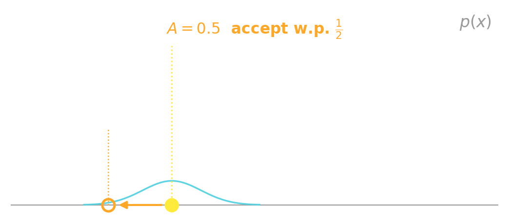{fig-align="center" width="92%"}

::: {.lang-en}
[A **downhill** proposal (here $p(x')/p(x)=0.5$): $A=0.5$ — accept only **half the time**. Sometimes the chain moves to lower density; that's what lets it explore, not just hill-climb.]{.dim}
:::
::: {.lang-ja}
[**下り**の提案（ここでは $p(x')/p(x)=0.5$）：$A=0.5$ — **半分だけ**受理。低密度へ動くこともある。それが、ただの山登りでなく探索を可能にする。]{.dim}
:::

::: {.notes}
Slide 3: downhill, A=0.5, sometimes accept. The "sometimes accept downhill" is
why MCMC samples the WHOLE distribution instead of converging to the mode. The
6th anim frame (reject, far/low-density) is in reserve if you want a 4th slide.
~20s.
:::

## [Gibbs sampling]{.lang-en}[ギブズサンプリング]{.lang-ja} {.smaller}

:::: {.columns .v-center}
::: {.column width="54%"}
::: {.lang-en}
When you can sample each variable **given the rest**, resample one coordinate at a time:

$$x_i^{(t+1)} \sim P(x_i \mid x_{-i})$$

[$x_{-i}$ = all the other coordinates (everything except $x_i$).]{.dim}

- No accept/reject — **every move is accepted**.
- Moves are **axis-aligned** (one coordinate at a time).

[Preview: in the Kemp sampler the $\theta_i$ step is **pure Gibbs** (conjugate); the hyperparameters need Metropolis.]{.dim}
:::
::: {.lang-ja}
各変数を**他を固定して**引けるとき、1座標ずつ再サンプリング：

$$x_i^{(t+1)} \sim P(x_i \mid x_{-i})$$

[$x_{-i}$ = 他のすべての座標（$x_i$ 以外）。]{.dim}

- 受理／棄却なし — **すべての移動を受理**。
- 移動は**軸に沿う**（1座標ずつ）。

[予告：Kempサンプラーでは $\theta_i$ ステップは**純粋なギブズ**（共役）；超パラメータにはメトロポリスが要る。]{.dim}
:::
:::
::: {.column width="46%"}
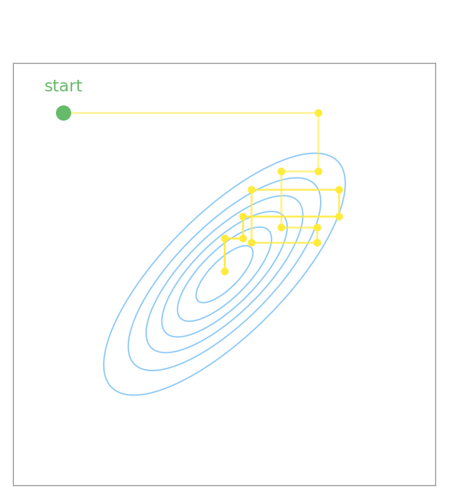{fig-align="center" width="92%"}
:::
::::

::: {.notes}
Define x_{-i}. Gibbs always accepts -> the contrast with MH. The L-shaped moves
in the figure. Plant the Kemp preview here. ~2 min.
:::

## [MH vs Gibbs]{.lang-en}[MH 対 ギブズ]{.lang-ja}

:::: {.columns .v-center}
::: {.column width="50%"}
::: {.lang-en}
**Metropolis–Hastings**

- works for **any** target
- propose + accept/reject
- needs only the **ratio** $P(x')/P(x)$
- proposal variance must be tuned
:::
::: {.lang-ja}
**メトロポリス・ヘイスティングス**

- **どんな**目標でも使える
- 提案 + 受理／棄却
- **比** $P(x')/P(x)$ だけで足りる
- 提案の分散は調整が必要
:::
:::
::: {.column width="50%"}
::: {.lang-en}
**Gibbs**

- needs the **conditionals** $P(x_i\mid x_{-i})$
- always accepts
- one coordinate at a time
- no tuning, but can mix slowly
:::
::: {.lang-ja}
**ギブズ**

- **条件付き分布** $P(x_i\mid x_{-i})$ が必要
- 常に受理
- 1座標ずつ
- 調整不要だが混合が遅いことも
:::
:::
::::

::: {.notes}
Two-column structural parallel. The "proposal variance must be tuned" bullet
sets up the interactive viz. ~1 min.
:::

## [Poll — does the starting point matter?]{.lang-en}[ポール — 出発点は関係ある?]{.lang-ja} {.poll-slide .smaller}

::: {.lang-en}
You run your MH chain from **two very different starting points**, for a long time. The histograms of visited states are…
:::
::: {.lang-ja}
MHの連鎖を**まったく違う2つの出発点**から、長時間走らせる。訪れた状態のヒストグラムは…
:::

::: {.fragment}
::: {.lang-en}
- **A.** the same — the chain forgets where it started
- **B.** different — the start determines the answer
- **C.** depends on the proposal
:::
::: {.lang-ja}
- **A.** 同じ — 連鎖は出発点を忘れる
- **B.** 違う — 出発点が答えを決める
- **C.** 提案分布次第
:::
:::

::: {.fragment}
[**A** — an **ergodic** chain forgets its start and converges to $\pi$ = the target. That's the whole point of MCMC. **…if it has mixed** — which is exactly what the next demo is about.]{.lang-en .yellow}
[**A** — **エルゴード的**な連鎖は出発点を忘れ、$\pi$＝目標へ収束する。それがMCMCの核心。**…ただし混合していれば** — それこそ次のデモの主題。]{.lang-ja .yellow}
:::

::: {.notes}
Source: SP25 Markov-chains quiz Q4 (start-doesn't-matter), recast as an MCMC
convergence intuition. The "if it mixed" caveat is the deliberate hook into the
viz. ~1 min.
:::

# [Interactive: Gibbs &amp; Metropolis–Hastings]{.lang-en}[インタラクティブ：ギブズとMH]{.lang-ja} {.section-break background-image="../../sds-reveal/sds_frame.png" background-size="cover"}

## [Live demo — what to watch]{.lang-en}[ライブデモ — 注目点]{.lang-ja} {.smaller}

::: {.lang-en}
A multimodal 2-D Gaussian mixture. We control the **proposal variance** and watch the **acceptance ratio** and **mixing**.

- **σ too small** → acceptance ≈ 1, but a slow random walk — **stuck in one mode**.
- **σ too large** → almost everything rejected, acceptance ≈ 0 — chain frozen.
- **σ just right** → acceptance ≈ 0.2–0.5, the chain explores.
- **The catch** → even good local acceptance **can't cross** between well-separated modes.
:::
::: {.lang-ja}
多峰性の2次元ガウス混合。**提案の分散**を操作し、**受理率**と**混合**を観察する。

- **σ が小さすぎ** → 受理率 ≈ 1 だが遅いランダムウォーク — **1つの峰に閉じ込められる**。
- **σ が大きすぎ** → ほぼ全て棄却、受理率 ≈ 0 — 連鎖が凍りつく。
- **σ がちょうど良い** → 受理率 ≈ 0.2〜0.5、連鎖が探索する。
- **落とし穴** → 局所の受理率が良くても、離れた峰の**間は渡れない**。
:::

::: {.notes}
This slide just lists the beats; the demo does the work. Run the 5-demo script in
widgets/README.md: Gibbs baseline -> tiny sigma -> huge sigma -> just-right
-> trapped finale. The trapped demo is the punchline: acceptance ~0.6 but
"modes visited 1/4". ~30s on this slide, then switch to the demo.
:::

## [Gibbs &amp; MH demo]{.lang-en}[ギブズとMHのデモ]{.lang-ja} {background-iframe="widgets/mcmc-gmm.html" background-interactive="true"}

::: {.notes}
THE interactive slide. background-interactive=true is required or the sliders
won't respond. Drive the 5-demo script live. If the iframe fails to load, skip
to the next slide (static fallback) and narrate over the mh-anim + gibbs-trace
figures from Block 5.
:::

## [If the live demo isn't available]{.lang-en}[ライブデモが使えないとき]{.lang-ja} {.pdf-fallback}

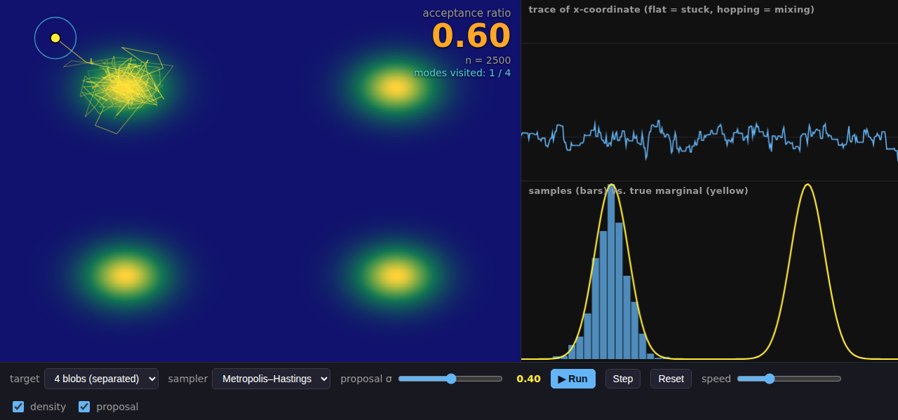{fig-align="center" width="100%"}

::: {.lang-en}
[Trapped MH: acceptance is healthy (0.60) but **only 1 of 4 modes** was visited — the histogram fills just one peak. Good *local* acceptance ≠ good *global* mixing. Open `week07.html` to drive it live.]{.dim}
:::
::: {.lang-ja}
[閉じ込められたMH：受理率は健全（0.60）だが**4峰のうち1峰**しか訪れていない — ヒストグラムは1峰だけ。良い*局所*受理率 ≠ 良い*大域*混合。`week07.html` を開けばライブで操作できる。]{.dim}
:::

::: {.notes}
This is the static still for the PDF export (decktape can't capture the live
iframe). In the live HTML deck, step past it. It also doubles as the Poll 3
reference image. ~10s.
:::

## [Poll — two runs disagree]{.lang-en}[ポール — 2回の結果が食い違う]{.lang-ja} {.poll-slide .smaller}

::: {.lang-en}
Two MH runs on the bimodal target give **very different histograms** after 1,000 steps. What went wrong?
:::
::: {.lang-ja}
二峰性の目標へのMH 2回が、1,000ステップ後に**まったく違うヒストグラム**になる。何が起きた?
:::

::: {.fragment}
::: {.lang-en}
- **A.** neither chain has mixed — each got stuck in a different mode
- **B.** MCMC is biased — this is expected
- **C.** the target has no stationary distribution
:::
::: {.lang-ja}
- **A.** どちらの連鎖も混合していない — それぞれ別の峰に閉じ込められた
- **B.** MCMCは偏っている — 想定内
- **C.** 目標に定常分布が存在しない
:::
:::

::: {.fragment}
[**A** — poor mixing, not bias. Both chains are ergodic in theory (each *would* reach $\pi$ eventually), but with a local proposal neither has crossed between modes in 1,000 steps — so each chain reflects only the mode it started in, and the two disagree. **That disagreement is the diagnostic:** run several chains from different starts; if they don't agree, none has mixed.]{.lang-en .yellow}
[**A** — 偏りではなく混合不良。両連鎖とも理論上はエルゴード的（各々いずれ $\pi$ に達する）だが、局所提案では1,000ステップで峰の間を渡れず、各連鎖は出発した峰しか反映しないため、2つが食い違う。**この食い違いこそ診断材料：** 異なる出発点から複数の連鎖を走らせ、一致しなければどれも混合していない。]{.lang-ja .yellow}
:::

::: {.notes}
Source: SP25 Markov-chains stationary-distribution item, recast from "compute pi"
to "did the sampler actually reach pi?". Lands AFTER the demo showed a stuck
chain. ~1 min.
:::

# [Break]{.lang-en}[休憩]{.lang-ja} {.section-break background-image="images/break-cat-week7.jpg" background-size="contain" background-position="center" background-repeat="no-repeat" background-color="#111111"}

# [Programmable inference (GenJAX)]{.lang-en}[プログラム可能な推論（GenJAX）]{.lang-ja} {.section-break background-image="../../sds-reveal/sds_frame.png" background-size="cover"}

## [One picture: classical method ⇄ GenJAX]{.lang-en}[一枚で：古典的手法 ⇄ GenJAX]{.lang-ja} {.smaller}

:::: {.columns}
::: {.column width="50%"}
::: {.lang-en}
**Classical**

- basic Monte Carlo
- rejection sampling
- importance sampling
- K-particle IS / SMC
- particle filter
- MCMC / Metropolis–Hastings
:::
::: {.lang-ja}
**古典的手法**

- 基本のモンテカルロ
- 棄却サンプリング
- 重点サンプリング
- K粒子IS／SMC
- 粒子フィルタ
- MCMC／メトロポリス・ヘイスティングス
:::
:::
::: {.column width="50%"}
::: {.lang-en}
**GenJAX surface**

- `simulate` + `vmap`
- filter `simulate` by the constraint
- `importance` → `(trace, log_weight)`
- `smc.ImportanceK(Target(…), k=N)`
- `smc.*` chained over observations
- **assemble it** from `update` / `assess`
:::
::: {.lang-ja}
**GenJAXの実体**

- `simulate` + `vmap`
- 制約で `simulate` をフィルタ
- `importance` → `(trace, log_weight)`
- `smc.ImportanceK(Target(…), k=N)`
- 観測にわたる `smc.*` の連鎖
- `update` / `assess` から**自分で組む**
:::
:::
::::

::: {.lang-en}
[**The idea:** probabilistic programming gives you importance sampling *for free*, and hands you the scoring primitive (`assess`) to **assemble** MCMC — exactly what we'll do for the Kemp model.]{.yellow}
:::
::: {.lang-ja}
[**要点：** 確率的プログラミングは重点サンプリングを*無料*で与え、MCMCを**組み立てる**ための採点演算（`assess`）を渡す — まさにKempモデルでやること。]{.yellow}
:::

::: {.notes}
The LIGHT GenJAX summary — always runs. The thesis line is the hinge into Block
9. Note: MCMC is NOT a black box in genjax 0.10.3 (the repo's pinned version) —
you build it. Newer upstream (v1.0.10) adds hmc()/chain(); name-drop only.
~2 min. At rehearsal: show this OR the deep-dive (7b), maybe not both.
:::

<!-- BLOCK 7b GENJAX-HEAVY — fenced; show OR skip in favor of the summary slide -->

## [Deep-dive (1/4): the target and the skeleton]{.lang-en}[詳説 (1/4)：目標と骨組み]{.lang-ja} {.smaller}

:::: {.columns .v-center}
::: {.column width="54%"}
```python
@gen
def model():
    mu = normal(0.0, 1.0) @ "mu"   # prior
    y  = normal(mu, 0.5)  @ "y"    # likelihood
    return y

# score log p(mu, y=1.5) with assess
def log_p(mu):
    ch = C["mu"].set(mu).at["y"].set(1.5)
    logp, _ = model.assess(ch, ())
    return logp
```
:::
::: {.column width="46%"}
::: {.lang-en}
- **Goal:** sample $\mu$ from its posterior after seeing $y = 1.5$.
- We pick **one tool**: `assess` — it returns $\log p(\mu, y)$ for any $\mu$.
- Every MH step is the **same 3 lines**: *propose → score → accept*. The only thing that changes is the **proposal**.

[Closed-form posterior here is $\mathcal{N}(1.2, 0.45)$ — so we can check the chain landed right.]{.dim}
:::
::: {.lang-ja}
- **目標：** $y = 1.5$ を見た後の事後分布から $\mu$ を標本する。
- **道具は1つ**：`assess` — 任意の $\mu$ に $\log p(\mu, y)$ を返す。
- どのMHステップも**同じ3行**：*提案 → 採点 → 受理*。変わるのは**提案分布**だけ。

[ここでの閉形式事後分布は $\mathcal{N}(1.2, 0.45)$ — だから連鎖が正しく収束したか確認できる。]{.dim}
:::
:::
::::

::: {.notes}
7b deep-dive, slide 1 of 4. HEAVY/fenced — show OR skip for the summary. Target:
mu~N(0,1), y~N(mu,0.5), observe y=1.5 -> posterior N(1.2, 0.447). The ONE
primitive is assess (= log joint). The recurring skeleton is propose/score/accept;
only the proposal changes. assess matches the closed form exactly (verified,
mh_genjax.py). ~1.5 min.
:::

## [Deep-dive (2/4): proposal A — a random walk]{.lang-en}[詳説 (2/4)：提案A — ランダムウォーク]{.lang-ja} {.smaller}

:::: {.columns .v-center}
::: {.column width="56%"}
```python
def mh_step_A(key, mu, sigma=0.5):
    kp, ka = random.split(key)
    mu_new = mu + sigma * random.normal(kp)  # propose
    logA = log_p(mu_new) - log_p(mu)         # score
    ok = jnp.log(random.uniform(ka)) < logA  # accept?
    return jnp.where(ok, mu_new, mu)
```

```text
start mu=0.0,  log_p=-5.65
propose mu'=0.266   logA=+1.42 → accept ✓
# uphill (closer to 1.2) ⇒ logA>0 ⇒ always accept
```
:::
::: {.column width="44%"}
::: {.lang-en}
- **Random-walk proposal:** $\mu' = \mu + \sigma\,\varepsilon$, a small Gaussian step.
- It's **symmetric** ($q(\mu'\!\mid\mu)=q(\mu\!\mid\mu')$), so the $q$ terms cancel and $\log A$ is **just** the score difference — the animation's rule.
- Run 4000 steps: mean $1.17$, **accept rate 0.68**. Small steps, mostly accepted.

[This is the workhorse proposal — the one in the interactive demo.]{.dim}
:::
::: {.lang-ja}
- **ランダムウォーク提案：** $\mu' = \mu + \sigma\,\varepsilon$、小さなガウスのステップ。
- **対称**（$q(\mu'\!\mid\mu)=q(\mu\!\mid\mu')$）なので $q$ が打ち消え、$\log A$ は**ただの**スコア差 — アニメの規則。
- 4000ステップ実行：平均 $1.17$、**受理率 0.68**。小さなステップ、ほぼ受理。

[これが主力の提案 — インタラクティブデモのもの。]{.dim}
:::
:::
::::

::: {.notes}
7b slide 2 of 4. Proposal A = symmetric random walk. Because it's symmetric the
q-ratio is 1, so logA = log_p(new) - log_p(old) — literally the animation's
accept rule. Real numbers (mh_genjax.py, key=1): from mu=0, propose 0.266,
logA=+1.42, accept. Chain: mean 1.17 (true 1.2), accept 0.68. ~1.5 min.
:::

## [Deep-dive (3/4): proposal B — independent jumps]{.lang-en}[詳説 (3/4)：提案B — 独立ジャンプ]{.lang-ja} {.smaller}

:::: {.columns .v-center}
::: {.column width="56%"}
```python
def mh_step_B(key, mu):
    kp, ka = random.split(key)
    mu_new = random.normal(kp)        # propose ~ N(0,1)
    logA = ( log_p(mu_new) - log_p(mu)
        + log_q(mu) - log_q(mu_new) )  # +q-correction!
    ok = jnp.log(random.uniform(ka)) < logA
    return jnp.where(ok, mu_new, mu)
```

```text
propose mu'=-2.378  logA=-25.6 → reject ✗
# jumped away from the posterior ⇒ logA≪0 ⇒ reject
```
:::
::: {.column width="44%"}
::: {.lang-en}
- **Independent proposal:** draw $\mu' \sim \mathcal{N}(0,1)$ fresh — *ignore where you are*.
- The proposal is symmetric as a *bell curve*, but the **kernel isn't**: since it ignores $\mu$, the forward and reverse probabilities differ, $q(\mu'\!\mid\mu)=\mathcal{N}(\mu';0,1) \neq \mathcal{N}(\mu;0,1)=q(\mu\!\mid\mu')$. So you **must add** $\log q(\mu) - \log q(\mu')$ — drop it and the chain targets the *wrong* distribution.
- Run 4000 steps: mean $1.23$, **accept rate 0.25**. Bold jumps, often rejected.
:::
::: {.lang-ja}
- **独立提案：** $\mu' \sim \mathcal{N}(0,1)$ を新たに引く — *現在地を無視*。
- 提案は*釣鐘型*としては対称だが、**カーネルは非対称**：$\mu$ を無視するため順方向と逆方向の確率が異なり、$q(\mu'\!\mid\mu)=\mathcal{N}(\mu';0,1) \neq \mathcal{N}(\mu;0,1)=q(\mu\!\mid\mu')$。だから $\log q(\mu) - \log q(\mu')$ を**加える必要**がある — 省くと連鎖は*誤った*分布を狙う。
- 4000ステップ実行：平均 $1.23$、**受理率 0.25**。大胆なジャンプ、しばしば棄却。
:::
:::
::::

::: {.notes}
7b slide 3 of 4. Proposal B = independent draw from the prior. THE teaching
contrast: the q-correction term log q(mu) - log q(mu_new) appears — the ONLY new
code vs. proposal A. PRECISION POINT (a student asked): N(0,1) is a symmetric
*distribution*, but the MH symmetry that matters is KERNEL symmetry,
q(mu'|mu)=q(mu|mu'). The independent proposal ignores mu, so q(mu'|mu)=N(mu';0,1)
=/= N(mu;0,1)=q(mu|mu') — forward and reverse probabilities differ, hence the
correction doesn't cancel. (The random walk q(mu'|mu)=N(mu;mu,sigma) depends on
mu'-mu and IS kernel-symmetric because the Gaussian is even.) Drop the correction
-> wrong stationary dist. Real numbers (key=3): propose -2.378, logA=-25.6,
reject. Chain: mean 1.23, accept 0.25 (vs A's 0.68). ~2 min.
:::

## [Deep-dive (4/4): same skeleton, your choice of proposal]{.lang-en}[詳説 (4/4)：同じ骨組み、提案はあなた次第]{.lang-ja} {.smaller}

:::: {.columns .v-center}
::: {.column width="50%"}
| | **A: random walk** | **B: independent** |
|---|---|---|
| propose | $\mu + \sigma\varepsilon$ | $\mu' \sim \mathcal{N}(0,1)$ |
| $q(\mu'\!\mid\mu)=q(\mu\!\mid\mu')$? | yes | no |
| $q$-correction | none | required |
| accept rate | 0.68 | 0.25 |
| post. mean | 1.17 | 1.23 |
:::
::: {.column width="50%"}
::: {.lang-en}
- **Both land on the truth** ($\mu\approx 1.2$) — MH is *correct* for any valid proposal.
- The proposal only changes **efficiency**: how often you accept, how fast you mix.
- The accept/reject rule never changed — only the proposal slotted into the skeleton did.

[This is *programmable* inference: no black-box `mh()` in 0.10.3 — you assemble it, and you choose the proposal. (For Kemp, the proposal is a Gaussian step on $(\varphi,\log\kappa)$ — slide 60+.)]{.yellow}
:::
::: {.lang-ja}
- **どちらも真値に収束**（$\mu\approx 1.2$）— MHは妥当な提案ならどれでも*正しい*。
- 提案が変えるのは**効率**だけ：受理頻度、混合の速さ。
- 受理／棄却の規則は不変 — 骨組みに差し込む提案だけが変わった。

[これが*プログラム可能な*推論：0.10.3にブラックボックスの `mh()` はない — 自分で組み、提案を選ぶ。（Kempでは提案は $(\varphi,\log\kappa)$ 上のガウスステップ — スライド60〜。）]{.yellow}
:::
:::
::::

::: {.notes}
7b slide 4 of 4 — the payoff. BOTH proposals give the correct posterior (mean
~1.2): MH is exact for ANY valid proposal; the proposal only sets efficiency
(accept rate / mixing speed). The accept rule was identical in A and B — only the
proposal function changed. Hinge into Kemp: there the proposal is a Gaussian RW
on (phi, log kappa). This whole 7b block is the on-ramp to the assignment. Cut
the whole block under time pressure (show the LIGHT summary instead). ~2 min.
:::

# [MCMC with People]{.lang-en}[人を使ったMCMC]{.lang-ja} {.section-break background-image="../../sds-reveal/sds_frame.png" background-size="cover"}

## [What if a person is the accept step?]{.lang-en}[人が受理ステップだったら?]{.lang-ja}

:::: {.columns .v-center}
::: {.column width="46%"}
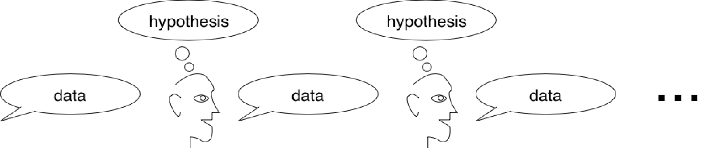{fig-align="center" width="100%"}
:::
::: {.column width="54%"}
::: {.lang-en}
Show someone two stimuli — *"which looks more like a cat?"* — and treat their **choice** as the Metropolis accept/reject decision.

The chain alternates: a **hypothesis** in the head produces **data** (a response), which the next person reads as data and forms a new hypothesis.
:::
::: {.lang-ja}
2つの刺激を見せ — *「どちらがネコらしい?」* — その**選択**をメトロポリスの受理／棄却とみなす。

連鎖は交互に進む：頭の中の**仮説**が**データ**（反応）を生み、次の人がそれをデータとして読み、新しい仮説を作る。
:::
:::
::::

::: {.notes}
Show-before-tell. COSMOS s31. The human IS the accept step. This is the required
reading (Sanborn & Griffiths). ~1.5 min.
:::

## [The chain converges to the prior in their heads]{.lang-en}[連鎖は頭の中の事前分布へ収束する]{.lang-ja}

::: {.lang-en}
If learners **sample from their posterior** $P(h\mid d) \propto P(d\mid h)\,P(h)$, then the Markov chain on hypotheses **converges to the prior $P(h)$** — the inductive biases in their heads.

[**You can read out someone's prior by running them as an MCMC chain.** (Bartlett 1932; Kirby 2001; Griffiths &amp; Kalish 2007; Sanborn et al. 2010)]{.yellow}
:::
::: {.lang-ja}
学習者が**事後分布から標本を取る** $P(h\mid d) \propto P(d\mid h)\,P(h)$ なら、仮説上のマルコフ連鎖は**事前分布 $P(h)$ へ収束する** — 頭の中の帰納バイアス。

[**人をMCMC連鎖として走らせれば、その事前分布を読み出せる。** (Bartlett 1932; Kirby 2001; Griffiths &amp; Kalish 2007; Sanborn et al. 2010)]{.yellow}
:::

::: {.notes}
COSMOS s33/34. The deep payoff: iterated learning = a Markov chain on hypotheses
whose stationary distribution is the prior. Connect to structure/process/behavior
(Marr). ~2 min.
:::

## [Recovering mental prototypes]{.lang-en}[心的プロトタイプの復元]{.lang-ja}

:::: {.columns .v-center}
::: {.column width="50%"}
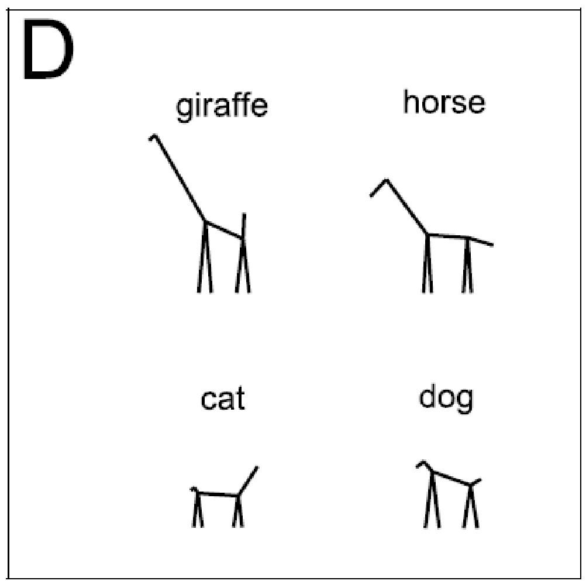{fig-align="center" width="74%"}
:::
::: {.column width="50%"}
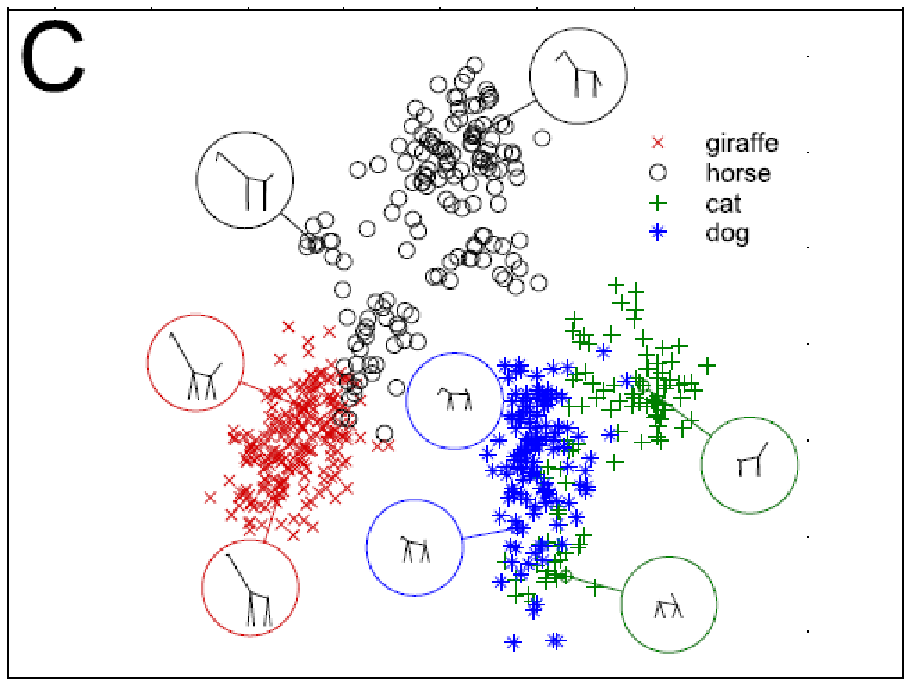{fig-align="center" width="86%"}
:::
::::

::: {.lang-en}
[Sanborn &amp; Griffiths (2007): MCMCP over a 9-D stick-figure space recovers each category's mental prototype — giraffe, horse, cat, dog separate cleanly.]{.dim}
:::
::: {.lang-ja}
[Sanborn &amp; Griffiths (2007)：9次元の棒人形空間でのMCMCPが、各カテゴリの心的プロトタイプを復元 — キリン・ウマ・ネコ・イヌがきれいに分離。]{.dim}
:::

::: {.notes}
COSMOS s36-38. The result figure. The 2-D scatter shows the four categories
separating, with prototype morphs circled. ~1.5 min. Compression path: under
time pressure, this slide + the cartoon + one sentence = the whole block in ~3
min. Optional extension (subjective-randomness ladders, music Gibbs) lives in
images/cosmos_src/subj_random_ladder*.png — add only with a luxurious 12 min.
:::

# [A sampler for the Kemp hierarchy]{.lang-en}[Kemp階層モデルのサンプラー]{.lang-ja} {.section-break background-image="../../sds-reveal/sds_frame.png" background-size="cover"}

## [The model — from Week 4]{.lang-en}[モデル — 第4週から]{.lang-ja}

:::: {.columns .v-center}
::: {.column width="52%"}
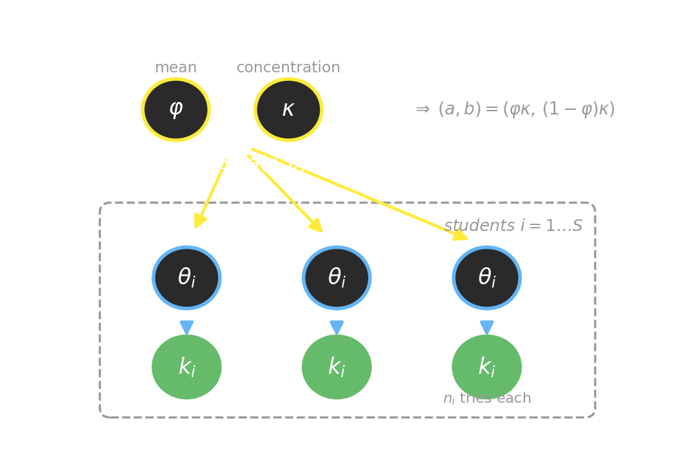{fig-align="center" width="100%"}
:::
::: {.column width="48%"}
::: {.lang-en}
Each student $i$ has a tonkatsu rate $\theta_i \sim \text{Beta}(a,b)$; we observe counts $k_i \sim \text{Binomial}(n_i, \theta_i)$.

The hyperparameters $(a,b)$ are **unknown** and **learned** — the overhypotheses. [(Kemp, Perfors &amp; Tenenbaum 2007 — no DPMM here.)]{.dim}

[We'll learn them through the **mean** $\varphi=\tfrac{a}{a+b}$ and **concentration** $\kappa=a+b$ (the figure's top nodes) — easier to put priors on.]{.dim}
:::
::: {.lang-ja}
各学生 $i$ はトンカツ率 $\theta_i \sim \text{Beta}(a,b)$；観測はカウント $k_i \sim \text{Binomial}(n_i, \theta_i)$。

超パラメータ $(a,b)$ は**未知**で**学習する** — オーバー仮説。[(Kemp, Perfors &amp; Tenenbaum 2007 — ここではDPMMなし。)]{.dim}

[**平均** $\varphi=\tfrac{a}{a+b}$ と**集中度** $\kappa=a+b$（図の上のノード）を通して学習する — 事前分布を置きやすい。]{.dim}
:::
:::
::::

::: {.notes}
Callback to Week 4 Variant B. The hierarchy students already saw conceptually —
now we give it a sampler. ~1.5 min.
:::

## [Why we need a sampler]{.lang-en}[なぜサンプラーが必要か]{.lang-ja}

::: {.lang-en}
The joint posterior $p(a, b, \{\theta_i\} \mid \text{data})$ has **no clean closed form**.

The textbook (T3 Ch 12) used **importance sampling** over the Beta-Binomial marginal — but with a broad hyperprior, most sampled $(a,b)$ explain the data poorly, so the estimate wobbles. The **"blunt tool."**

[Now we build the sharp one: a chain that spends its samples where the posterior mass actually is.]{.yellow}
:::
::: {.lang-ja}
同時事後分布 $p(a, b, \{\theta_i\} \mid \text{data})$ には**きれいな閉形式がない**。

教科書（T3 第12章）はベータ二項周辺分布に**重点サンプリング**を使った — だが超事前分布が広いと、引いた $(a,b)$ の大半はデータをうまく説明せず、推定が揺れる。**「鈍い道具」**。

[今、鋭い道具を作る：事後分布の質量が実際にある所に標本を使う連鎖。]{.yellow}
:::

::: {.notes}
Callback to the Block 3 "blunt tool" poll. This is the motivation for the whole
block. ~1.5 min.
:::

## [The recipe — two steps per sweep]{.lang-en}[レシピ — 1スイープに2ステップ]{.lang-ja}

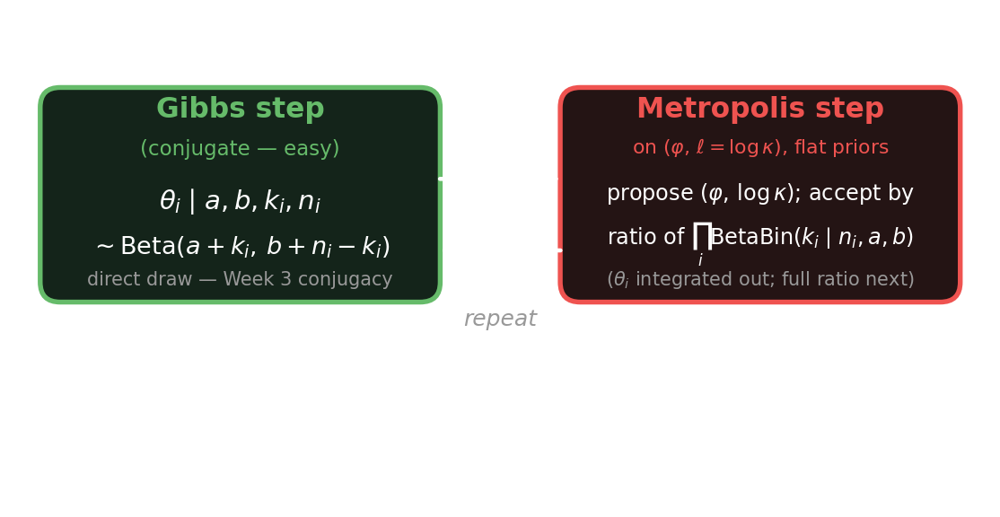{fig-align="center" width="92%"}

::: {.lang-en}
[One half is free (conjugate Gibbs); the other half needs Metropolis. Alternate them. ($\text{BetaBin}$ = the Beta-Binomial marginal likelihood — defined in two slides.)]{.dim}
:::
::: {.lang-ja}
[片方は無料（共役ギブズ）；もう片方はメトロポリスが要る。交互に行う。（$\text{BetaBin}$ = ベータ二項周辺尤度 — 2枚先で定義。）]{.dim}
:::

::: {.notes}
The overview figure. Next two slides expand each half. ~1 min.
:::

## [Step 1 — Gibbs the $\theta_i$ (free)]{.lang-en}[ステップ1 — $\theta_i$ をギブズ（無料）]{.lang-ja}

::: {.lang-en}
Hold $(a,b)$ fixed. Each student's rate has a **conjugate** update — *exactly Week 3*:
:::
::: {.lang-ja}
$(a,b)$ を固定。各学生の率は**共役**更新 — *まさに第3週*：
:::

$$\theta_i \mid a, b, k_i, n_i \;\sim\; \text{Beta}(a + k_i,\; b + n_i - k_i)$$

::: {.lang-en}
[A direct draw — no rejection, no tuning. You've had this since Week 3 conjugacy: prior $\text{Beta}(a,b)$ + $k_i$ successes in $n_i$ tries → posterior $\text{Beta}(a+k_i, b+n_i-k_i)$.]{.dim}
:::
::: {.lang-ja}
[直接引く — 棄却なし、調整なし。第3週の共役性で既習：事前 $\text{Beta}(a,b)$ + $n_i$ 回中 $k_i$ 成功 → 事後 $\text{Beta}(a+k_i, b+n_i-k_i)$。]{.dim}
:::

::: {.notes}
The easy half. Stress that they already know this from Week 3 — it's just
conjugacy in a loop. ~2 min.
:::

## [Integrate out $\theta_i$: the Beta-Binomial marginal]{.lang-en}[$\theta_i$ を積分消去：ベータ二項周辺分布]{.lang-ja} {.smaller}

::: {.lang-en}
To score the hyperparameters $(a,b)$, we don't want each $\theta_i$ in the way — so **average it out** (the marginal likelihood of a student's count):

$$\text{BetaBin}(k\mid n,a,b) = \int_0^1 \underbrace{\text{Binomial}(k\mid n,\theta)}_{\text{likelihood}}\;\underbrace{\text{Beta}(\theta\mid a,b)}_{\text{prior}}\,d\theta = \binom{n}{k}\,\frac{B(a+k,\; b+n-k)}{B(a,b)}$$

[$\binom{n}{k}$ = the **binomial coefficient** ("$n$ choose $k$"). $B(\alpha,\beta)$ = the **Beta function**, the normalizing constant of $\text{Beta}(\alpha,\beta)$. Because Beta-Binomial is conjugate (Week 3), this integral is **closed-form** — no sampling needed. This is *why* $\theta_i$ vanishes from the accept ratio.]{.dim}
:::
::: {.lang-ja}
超パラメータ $(a,b)$ を採点するとき、各 $\theta_i$ が邪魔 — だから**積分で消す**（ある学生のカウントの周辺尤度）：

$$\text{BetaBin}(k\mid n,a,b) = \int_0^1 \underbrace{\text{Binomial}(k\mid n,\theta)}_{\text{尤度}}\;\underbrace{\text{Beta}(\theta\mid a,b)}_{\text{事前}}\,d\theta = \binom{n}{k}\,\frac{B(a+k,\; b+n-k)}{B(a,b)}$$

[$\binom{n}{k}$ = **二項係数**（「$n$ 個から $k$ 個」）。$B(\alpha,\beta)$ = **ベータ関数**、$\text{Beta}(\alpha,\beta)$ の正規化定数。ベータ二項は共役（第3週）なので、この積分は**閉形式** — サンプリング不要。だから受理比から $\theta_i$ が消える。]{.dim}
:::

::: {.notes}
NEW slide (added after round-1 student review flagged BetaBin as undefined). This
is the missing piece for the assignment's Metropolis step: shows what the
marginal IS (the formula), names the Beta function B, and shows the integrate-out
move that makes theta_i disappear. ~2 min.
:::

## [Step 2 — Metropolis the hyperparameters: propose]{.lang-en}[ステップ2 — 超パラメータをメトロポリス：提案]{.lang-ja} {.smaller}

::: {.lang-en}
$(a,b)$ are **not** conjugate to anything. Reparametrize to **mean** and **concentration**, and **work in $(\varphi,\, \ell)$** where $\ell=\log\kappa$:

$$\varphi = \frac{a}{a+b} \in (0,1), \qquad \kappa = a + b > 0, \qquad \ell = \log\kappa$$

- **Priors:** flat (uniform) on **both** $\varphi\in(0,1)$ and $\ell$ (improper-flat — no bounds to track, so the prior ratio is exactly 1). [Flat on $\ell=\log\kappa$ *is* the log-uniform prior on $\kappa$ — spans orders of magnitude.]{.dim}
- **Propose** a symmetric Gaussian step on each (tune the two widths separately):

$$\varphi' = \varphi + \epsilon_\varphi,\quad \epsilon_\varphi\sim\mathcal{N}(0,\sigma_\varphi^2); \qquad \ell' = \ell + \epsilon_\ell,\quad \epsilon_\ell\sim\mathcal{N}(0,\sigma_\ell^2)$$

- **Map back** to evaluate the model: $\;\kappa' = e^{\ell'},\;\; a' = \varphi'\kappa',\;\; b' = (1-\varphi')\kappa'$.
- If $\varphi'\notin(0,1)$ the flat prior is $0$ ⇒ **reject** (set $A=0$). [$\sigma_\varphi,\sigma_\ell$ = the proposal widths you tune for mixing — the demo's knob.]{.dim}
:::
::: {.lang-ja}
$(a,b)$ は何にも共役でない。**平均**と**集中度**に再パラメータ化し、**$(\varphi,\,\ell)$ で扱う**（$\ell=\log\kappa$）：

$$\varphi = \frac{a}{a+b} \in (0,1), \qquad \kappa = a + b > 0, \qquad \ell = \log\kappa$$

- **事前分布：** $\varphi\in(0,1)$ と $\ell$ の**両方**に平坦（一様）（非正則平坦 — 境界を追う必要がなく、事前比はちょうど1）。[$\ell=\log\kappa$ に平坦 = $\kappa$ に対数一様 — 桁にわたる。]{.dim}
- 各々に対称ガウスのステップで**提案**（2つの幅は別々に調整）：

$$\varphi' = \varphi + \epsilon_\varphi,\quad \epsilon_\varphi\sim\mathcal{N}(0,\sigma_\varphi^2); \qquad \ell' = \ell + \epsilon_\ell,\quad \epsilon_\ell\sim\mathcal{N}(0,\sigma_\ell^2)$$

- モデル評価のため**逆写像**：$\;\kappa' = e^{\ell'},\;\; a' = \varphi'\kappa',\;\; b' = (1-\varphi')\kappa'$。
- $\varphi'\notin(0,1)$ なら平坦事前分布は $0$ ⇒ **棄却**（$A=0$）。[$\sigma_\varphi,\sigma_\ell$ = 混合のため調整する提案幅 — デモのつまみ。]{.dim}
:::

::: {.notes}
Step 2a — the proposal. Split from the accept ratio (round-3 student review:
the single slide was too dense and under-specified). Key adds: TWO sigmas (phi
and ell need different step sizes), the inverse map to (a,b), and the
out-of-support rule (phi' outside (0,1) -> reject, because flat prior = 0). ~2 min.
:::

## [Step 2 — Metropolis: the accept ratio]{.lang-en}[ステップ2 — メトロポリス：受理比]{.lang-ja} {.smaller}

::: {.lang-en}
The general Metropolis–Hastings ratio has four factors. With **this** choice, three of them are $1$:

$$A = \min\!\left(1,\; \underbrace{\frac{\prod_i \text{BetaBin}(k_i\mid n_i, a', b')}{\prod_i \text{BetaBin}(k_i\mid n_i, a, b)}}_{\text{marginal likelihood}}\;\times\;\underbrace{\frac{\pi(\varphi',\ell')}{\pi(\varphi,\ell)}}_{=\,1\ \text{(flat)}}\;\times\;\underbrace{\frac{q(\varphi,\ell\mid\varphi',\ell')}{q(\varphi',\ell'\mid\varphi,\ell)}}_{=\,1\ \text{(symmetric)}}\;\times\;\underbrace{J}_{=\,1\ \text{(no transform)}}\right)$$

[$a'=\varphi'\kappa',\; b'=(1-\varphi')\kappa',\; \kappa'=e^{\ell'}$ — the proposed hyperparameters (from the previous slide).]{.dim}

- **prior ratio $=1$:** both priors are flat in $(\varphi,\ell)$.
- **proposal ratio $=1$:** the Gaussian step is symmetric.
- **Jacobian $J=1$:** the prior lives on the **same** coordinates $(\varphi,\ell)$ we sample in — no change of variables. [If you instead put a flat prior on $(a,b)$ and sampled in $(\varphi,\ell)$, you *would* owe a Jacobian. Defining the prior in the sampling coordinates avoids it.]{.dim}

[So $A$ collapses to **just the marginal-likelihood ratio**. The $\binom{n_i}{k_i}$ in each BetaBin is constant in $(a,b)$, so it cancels too — drop it. **Note:** this step scores $(a,b)$ through the marginal, so the $\theta_i$ you just drew in the Gibbs step are **not** used here — they're integrated out.]{.dim}
:::
::: {.lang-ja}
一般のメトロポリス・ヘイスティングス比は4因子。**この**選び方では3つが $1$：

$$A = \min\!\left(1,\; \underbrace{\frac{\prod_i \text{BetaBin}(k_i\mid n_i, a', b')}{\prod_i \text{BetaBin}(k_i\mid n_i, a, b)}}_{\text{周辺尤度}}\;\times\;\underbrace{\frac{\pi(\varphi',\ell')}{\pi(\varphi,\ell)}}_{=\,1\ \text{(平坦)}}\;\times\;\underbrace{\frac{q(\varphi,\ell\mid\varphi',\ell')}{q(\varphi',\ell'\mid\varphi,\ell)}}_{=\,1\ \text{(対称)}}\;\times\;\underbrace{J}_{=\,1\ \text{(変換なし)}}\right)$$

[$a'=\varphi'\kappa',\; b'=(1-\varphi')\kappa',\; \kappa'=e^{\ell'}$ — 提案された超パラメータ（前スライドより）。]{.dim}

- **事前比 $=1$：** 両事前分布は $(\varphi,\ell)$ で平坦。
- **提案比 $=1$：** ガウスのステップは対称。
- **ヤコビアン $J=1$：** 事前分布をサンプリングと**同じ** $(\varphi,\ell)$ 座標に置く — 変数変換なし。[もし $(a,b)$ に平坦事前分布を置いて $(\varphi,\ell)$ でサンプリングすると、ヤコビアンが必要になる。サンプリング座標で事前分布を定義すれば回避できる。]{.dim}

[よって $A$ は**周辺尤度の比だけ**になる。各 BetaBin の $\binom{n_i}{k_i}$ は $(a,b)$ について定数なので打ち消え、省ける。**注：** このステップは周辺分布で $(a,b)$ を採点するので、ギブズで引いたばかりの $\theta_i$ は**使わない** — 積分消去されている。]{.dim}
:::

::: {.notes}
Step 2b — the accept ratio, now shown IN FULL (round-3 student review: the
"no prior / no Jacobian" claim was load-bearing but buried in dim text, and a
student couldn't verify it or would code it wrong with a different
parametrization). The four-factor form makes explicit WHY only the marginal
survives under this exact (phi, log-kappa) + flat-prior + symmetric-Gaussian
choice. Also notes the binomial coefficient cancels. ~2 min.
:::

## [In GenJAX: the sampler you assemble]{.lang-en}[GenJAXでは：自分で組むサンプラー]{.lang-ja} {.smaller}

:::: {.columns}
::: {.column width="50%"}
::: {.lang-en}
**The recipe**

- $\theta_i$ step: direct $\text{Beta}$ draw
- $(\varphi,\kappa)$ step: MH on the marginal
- alternate, collect samples after **burn-in**

[**burn-in** = the early samples, discarded so the chain can forget its start (Week 6's mixing) and reach $\pi$ before you count.]{.dim}
:::
::: {.lang-ja}
**レシピ**

- $\theta_i$ ステップ：直接 $\text{Beta}$ から引く
- $(\varphi,\kappa)$ ステップ：周辺分布へMH
- 交互に行い、**バーンイン**後に標本収集

[**バーンイン** = 初期の標本。連鎖が出発点を忘れ（第6週の混合）$\pi$ に達するまで捨てる。]{.dim}
:::
:::
::: {.column width="50%"}
::: {.lang-en}
**In GenJAX**

- Gibbs step → `beta(a+k, b+n-k).sample`
- MH step → score the **closed-form BetaBin** (slide 52) directly — *not* the model's joint `assess`, which would still contain $\theta_i$.
- the MH skeleton is the deep-dive's `mh_step`. [The assignment builds this same chain a slightly different way — next slide.]{.dim}
:::
::: {.lang-ja}
**GenJAXでは**

- ギブズステップ → `beta(a+k, b+n-k).sample`
- MHステップ → **閉形式の BetaBin**（スライド52）を直接採点 — モデルの同時 `assess` ではない（それは $\theta_i$ を含む）。
- MHの骨格は詳説の `mh_step`。[課題は同じ連鎖を少し違うやり方で作る — 次のスライド。]{.dim}
:::
:::
::::

::: {.lang-en}
[The chain spends its samples where the mass is — **sharp**. Importance sampling weighted a cloud of prior draws — **blunt**. Same model, better tool.]{.yellow}
:::
::: {.lang-ja}
[連鎖は質量のある所に標本を使う — **鋭い**。重点サンプリングは事前draw群を重み付けた — **鈍い**。同じモデル、より良い道具。]{.yellow}
:::

::: {.notes}
Two-column math | GenJAX. The closing contrast (sharp vs blunt) resolves the
arc. Point them at the assignment stencil. ~2 min.
:::

## [Two ways to score the same chain]{.lang-en}[同じ連鎖を採点する2つの方法]{.lang-ja} {.smaller}

:::: {.columns}
::: {.column width="50%"}
::: {.lang-en}
**This lecture — collapsed**

$$A \propto \frac{\prod_i \text{BetaBin}(k_i\mid n_i, a', b')}{\prod_i \text{BetaBin}(k_i\mid n_i, a, b)}$$

- $\theta_i$ **integrated out** (closed form)
- flat prior on $\ell=\log\kappa$
- the elegant shortcut — fewest moving parts
:::
::: {.lang-ja}
**この講義 — 周辺化**

$$A \propto \frac{\prod_i \text{BetaBin}(k_i\mid n_i, a', b')}{\prod_i \text{BetaBin}(k_i\mid n_i, a, b)}$$

- $\theta_i$ を**積分消去**（閉形式）
- $\ell=\log\kappa$ に平坦事前分布
- エレガントな近道 — 部品が最少
:::
:::
::: {.column width="50%"}
::: {.lang-en}
**The assignment — explicit**

$$\log A = \sum_i \log\tfrac{\text{Beta}(\theta_i\mid a',b')}{\text{Beta}(\theta_i\mid a,b)} + \log\tfrac{p(\ell')}{p(\ell)}$$

- scores the $\theta_i$ you **just drew** in the Gibbs step
- weak **proper** $\log$-normal prior on $\kappa$ (a real prior ratio)
- you see Gibbs **and** Metropolis working together
:::
::: {.lang-ja}
**課題 — 明示的**

$$\log A = \sum_i \log\tfrac{\text{Beta}(\theta_i\mid a',b')}{\text{Beta}(\theta_i\mid a,b)} + \log\tfrac{p(\ell')}{p(\ell)}$$

- ギブズで**今引いた** $\theta_i$ を採点
- $\kappa$ に弱い**正則** $\log$-正規事前分布（本物の事前比）
- ギブズ**と**メトロポリスが協働する様子が見える
:::
:::
::::

::: {.lang-en}
[**Same chain, same target $\pi$** — they just differ in *what you condition on*. Collapsing $\theta_i$ gives lower-variance hyperparameter moves (less Monte-Carlo noise per step); keeping $\theta_i$ is more general — it's what you do the moment a step *isn't* conjugate and you can't integrate by hand. The assignment uses the explicit form so you build both moves yourself.]{.yellow}

[*Does the choice matter for what's learned?* The **answer** (the posterior over the overhypothesis) is identical either way. But lower variance per step means the collapsed chain pins down $(\varphi,\kappa)$ in **fewer sweeps** — it *learns the overhypothesis faster per unit of compute.* That's the only sense in which the sampler choice touches learning here: speed, not conclusion.]{.dim}
:::
::: {.lang-ja}
[**同じ連鎖、同じ目標 $\pi$** — 違うのは*何で条件付けるか*だけ。$\theta_i$ を周辺化すると超パラメータの動きが低分散（毎ステップのモンテカルロ雑音が減る）；$\theta_i$ を保つ方が一般的 — ステップが共役*でなく*手で積分できない瞬間にこれを使う。課題は明示形を使い、両方の動きを自分で組む。]{.yellow}

[*この選択は学習結果に影響するか?* **結論**（オーバー仮説の事後分布）はどちらでも同一。ただし毎ステップの分散が低いと、周辺化した連鎖は**より少ないスイープ**で $(\varphi,\kappa)$ を絞り込む — *計算量あたり、オーバー仮説をより速く学習する。* サンプラーの選択が学習に触れるのはこの意味だけ：速さであって結論ではない。]{.dim}
:::

::: {.notes}
NEW bridge slide (the deck's accept ratio and the assignment's accept ratio are
NOT the same expression; a note-taker would code the wrong one). Left = what the
previous slides built (marginal/collapsed, flat prior). Right = what the
assignment PDF asks for (Gibbs-sampled theta scored with the Beta likelihood +
a proper log-normal kappa prior). The yellow line is the actual teaching point
and answers "why does the sampling choice matter": collapsing = Rao-Blackwell,
lower variance but needs a closed-form integral; keeping theta = general, the
only option when conjugacy fails. Both target the same posterior. ~2 min. If
tight, state the one sentence and move on -- the assignment footnote carries it.
:::

# [Wrapping up]{.lang-en}[まとめ]{.lang-ja} {.section-break background-image="../../sds-reveal/sds_frame.png" background-size="cover"}

## [The toolkit ladder]{.lang-en}[道具立ての梯子]{.lang-ja} {.smaller}

::: {.lang-en}
- **Monte Carlo** — average samples to estimate an expectation.
- **Importance sampling** — sample the wrong distribution, reweight.
- **Particle filter** — importance sampling, updated over time.
- **MCMC (MH + Gibbs)** — design a chain whose stationary distribution is your target.
- **Applied:** read out a person's prior (MCMCP); learn the Kemp hierarchy's hyperparameters.

[Each rung bought a sharper tool for a harder target.]{.dim}

[**Why this still matters in 2026.** You'll rarely hand-write an accept ratio again — but the *sample → score → reweight-or-accept* loop didn't go away, it got a **learned proposal**. A **diffusion model** is a learned reverse-MCMC; **RLHF** samples from a policy and reweights by a reward; **best-of-$N$** is importance sampling. The mechanics you built today are the conceptual core of how today's models are trained, steered, and aligned.]{.accent}
:::
::: {.lang-ja}
- **モンテカルロ** — 標本を平均して期待値を推定。
- **重点サンプリング** — 間違った分布から引き、重みで直す。
- **粒子フィルタ** — 時間更新する重点サンプリング。
- **MCMC（MH + ギブズ）** — 定常分布が目標になる連鎖を設計。
- **応用：** 人の事前分布を読み出す（MCMCP）；Kemp階層の超パラメータを学習。

[各段が、より難しい目標へのより鋭い道具をもたらした。]{.dim}

[**なぜ2026年でも重要か。** 受理比を手で書くことはもう滅多にない — だが*サンプル→採点→重み付け／受理*のループは消えず、**学習された提案分布**を得た。**拡散モデル**は学習された逆MCMC；**RLHF**は方策から引いて報酬で重み付け；**best-of-$N$** は重点サンプリング。今日組んだ仕組みは、現代のモデルが訓練・操舵・整合される仕方の概念的中核。]{.accent}
:::

::: {.notes}
Recap. Then: the GenJAX sampling exercise (Kemp sampler) is the capstone. ~1 min.
:::

## [Next week + the assignment]{.lang-en}[来週 + 課題]{.lang-ja}

::: {.lang-en}
- **Assignment:** build the Kemp sampler — Gibbs the $\theta_i$, Metropolis the $(\varphi,\kappa)$. Stencil + Colab on the assignments page.
- **Week 8:** signal detection theory, MDPs, reinforcement learning — *from inferring beliefs to choosing actions.*
:::
::: {.lang-ja}
- **課題：** Kempサンプラーを作る — $\theta_i$ をギブズ、$(\varphi,\kappa)$ をメトロポリス。ひな形とColabは課題ページに。
- **第8週：** 信号検出理論、MDP、強化学習 — *信念の推論から行動の選択へ。*
:::

::: {.notes}
Close. Confirm the Week 8 presenter against readings_map.yml. ~1 min.
:::
