## [Agenda]{.lang-en}[本日の予定]{.lang-ja} {.agenda .agenda-roomy}

- [From beliefs to actions: decision theory]{.lang-en}[信念から行動へ：決定理論]{.lang-ja}  [0:00]{.time}
- [One decision → a sequence of decisions]{.lang-en}[1つの決定 → 決定の連なり]{.lang-ja}  [0:21]{.time}
- [Markov Decision Processes]{.lang-en}[マルコフ決定過程（MDP）]{.lang-ja}  [0:29]{.time}
- [Solving MDPs: value iteration]{.lang-en}[MDPを解く：価値反復]{.lang-ja}  [0:46]{.time}
- [Break]{.lang-en}[休憩]{.lang-ja}  [1:04]{.time}
- [Learning by doing: Q-learning]{.lang-en}[やって学ぶ：Q学習]{.lang-ja}  [1:09]{.time}
- [Interactive: reward shaping &amp; cycles]{.lang-en}[インタラクティブ：報酬形成とループ]{.lang-ja}  [1:27]{.time}
- [Where RL is now]{.lang-en}[強化学習の現在地]{.lang-ja}  [1:42]{.time}

::: {.notes}
2-hour session, ~6 students, instructor-led (no presenter confirmed — verify readings_map.yml).
Three-act arc: PLAN a known MDP (Chibany) → LEARN an unknown one (GardenPath) → SYNTHESIZE (simulation-based RL).
:::

# [From beliefs to actions]{.lang-en}[信念から行動へ]{.lang-ja} {.section-break background-image="../../sds-reveal/sds_frame.png" background-size="cover"}

## [Admin]{.lang-en}[連絡事項]{.lang-ja}

::: {.lang-en}
**Active deadlines:**

- **Generalization assignment** — due **tonight, Fri Jun 19, 8:00 PM**
- **Final project proposal** — **Sun Jun 28, 8:00 PM** *(grab 5 min with me to talk through an idea)*
- **Monte Carlo assignment** — **Fri Jul 10, 8:00 PM**

The **Reinforcement Learning assignment** (Q-learning on today's GardenPath) releases **next week**. &nbsp;Questions before we start?
:::
::: {.lang-ja}
**現在の締切：**

- **一般化の課題** — **今夜 6月19日（金）20:00**
- **最終プロジェクト提案書** — **6月28日（日）20:00** *（アイデアの相談は5分でもどうぞ）*
- **モンテカルロの課題** — **7月10日（金）20:00**

**強化学習の課題**（今日のGardenPathでのQ学習）は**来週**公開します。&nbsp;始める前に質問は?
:::

## [Seven weeks of *beliefs*. Today: *actions*.]{.lang-en}[7週間の「信念」。今日は「行動」。]{.lang-ja}

::: {.lang-en}
Weeks 1–7 asked one question: **given data, what should I believe?** The normative answer was **Bayes** — update the posterior.

Today the question changes: **given my beliefs, what should I *do*?**

An agent has to *act*. Decision theory is the bridge from a posterior to an action — and the brain seems to use it too (Körding &amp; Wolpert, 2004).
:::
::: {.lang-ja}
第1〜7週の問いは1つ：**データが与えられたとき、何を信じるべきか?** 規範的な答えは**ベイズ** — 事後分布を更新する。

今日は問いが変わる：**信念が与えられたとき、何を*すべき*か?**

エージェントは*行動*しなければならない。決定理論は事後分布から行動への橋渡しであり、脳もそれを使っているらしい（Körding &amp; Wolpert, 2004）。
:::

::: {.notes}
The spine of the whole week. "What to believe" (Bayes) → "what to do" (decision theory → MDPs → RL).
:::

## [Statistical decision theory]{.lang-en}[統計的決定理論]{.lang-ja} {.midbig}

::: {.lang-en}
A decision problem under uncertainty has five pieces:

- **state of the world** $\theta$ — what's true but unknown (is the tonkatsu fresh today?)
- **observation** $x$ — what you see (the shop looks busy)
- **actions** $A$ — what you can do (order tonkatsu / play it safe)
- **decision rule** $d(x)$ — your strategy: which action, given $x$
- **loss** $L(\theta, a)$ — what it costs to take action $a$ when the world is $\theta$
:::
::: {.lang-ja}
不確実性下の決定問題は5つの要素から成る：

- **世界の状態** $\theta$ — 真だが未知（今日のとんかつは新鮮?）
- **観測** $x$ — 見えるもの（店が混んでいる）
- **行動** $A$ — できること（とんかつを頼む／無難にする）
- **決定規則** $d(x)$ — 戦略：$x$ のときどの行動を取るか
- **損失** $L(\theta, a)$ — 世界が $\theta$ のとき行動 $a$ を取る代償
:::

::: {.notes}
Re-skin of the SP25 bridge/tunnel example to Chibany. Define each symbol as it is named (CLAUDE.md rule).
:::

## [Which loss → which estimate?]{.lang-en}[どの損失 → どの推定値?]{.lang-ja} {.smaller}

::: {.lang-en}
Suppose Chibany must report a single number — his estimate of his bento's **weight** (a posterior from Week 2). The loss you'll be scored by decides the best estimate:
:::
::: {.lang-ja}
チバニーが1つの数値 — 弁当の**重さ**の推定値（第2週の事後分布）— を報告するとする。採点に使う損失が、最良の推定値を決める：
:::

:::: {.columns}
::: {.column width="48%"}
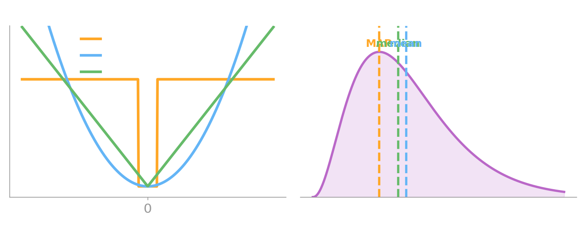{fig-align="center" width="100%"}
:::
::: {.column width="52%"}
::: {.lang-en}
- **0–1 loss** (right/wrong) → report the **mode** = **MAP** (the posterior's peak)
- **squared loss** $(\theta-a)^2$ → report the **mean**
- **absolute loss** $|\theta-a|$ → report the **median**

The "best action" is *not* fixed — it depends on how you'll be judged.
:::
::: {.lang-ja}
- **0–1損失**（正誤）→ **最頻値** = **MAP**（事後分布のピーク）を報告
- **二乗損失** $(\theta-a)^2$ → **平均** を報告
- **絶対損失** $|\theta-a|$ → **中央値** を報告

「最良の行動」は固定ではない — どう評価されるかに依存する。
:::
:::
::::

## [How good is a rule? Bayes vs. minimax]{.lang-en}[規則の良さ? ベイズ 対 ミニマックス]{.lang-ja} {.smaller}

::: {.lang-en}
The **risk** of a rule is its *expected* loss: $\;R(\theta, d) = \mathbb{E}_x\!\left[L(\theta, d(x))\right]$ — where $\mathbb{E}_x[\cdot]$ just means "the average over the data $x$." Two ways to choose a rule:
:::
::: {.lang-ja}
規則の**リスク**は*期待*損失：$\;R(\theta, d) = \mathbb{E}_x\!\left[L(\theta, d(x))\right]$。規則の選び方は2通り：
:::

:::: {.columns}
::: {.column width="50%"}
::: {.lang-en}
- **Bayesian** — have a prior over $\theta$, minimize the **average** risk: $\arg\min_d \mathbb{E}_\theta\mathbb{E}_x[L]$
- **Minimax** — no prior, minimize the **worst case**: $\arg\min_d \max_\theta \mathbb{E}_x[L]$
:::
::: {.lang-ja}
- **ベイズ** — $\theta$ に事前分布を持ち、**平均**リスクを最小化：$\arg\min_d \mathbb{E}_\theta\mathbb{E}_x[L]$
- **ミニマックス** — 事前分布なし、**最悪ケース**を最小化：$\arg\min_d \max_\theta \mathbb{E}_x[L]$
:::
:::
::: {.column width="50%"}
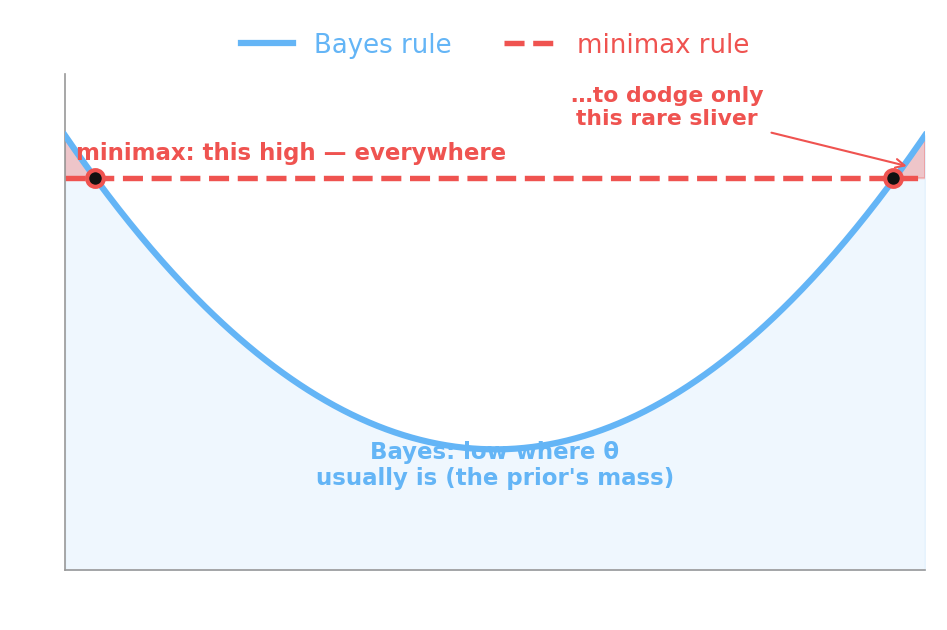{fig-align="center" width="100%"}
:::
::::

::: {.notes}
Keep this short — it's the hinge, not the destination. The risk-curve figure mirrors the SP25 plot.
:::

## [Poll — which estimate?]{.lang-en}[ポール — どの推定値?]{.lang-ja} {.poll-slide .smaller}

::: {.lang-en}
You must report one number for an unknown quantity. You'll be scored by **absolute error**, $|\theta - a|$. Which summary of your posterior should you report?
:::
::: {.lang-ja}
未知量について1つの数値を報告する。採点は**絶対誤差** $|\theta - a|$。事後分布のどの要約を報告すべき?
:::

::: {.fragment}
::: {.lang-en}
- **A.** the mode (MAP)
- **B.** the mean
- **C.** the median
:::
::: {.lang-ja}
- **A.** 最頻値（MAP）
- **B.** 平均
- **C.** 中央値
:::
:::

::: {.notes}
Authored poll (no SP25 conceptual SDT quiz item exists). Commit A/B/C, then reveal. ~1 min.
:::

## [Poll — answer]{.lang-en}[ポール — 答え]{.lang-ja} {.poll-reveal}

[**C — the median.**]{.lang-en .yellow}[**C — 中央値。**]{.lang-ja .yellow}

::: {.lang-en}
Absolute ($L^1$) loss is minimized by the **median**; squared ($L^2$) by the mean; 0–1 by the mode. The loss you're judged by picks the estimate — that's the whole point of decision theory.
:::
::: {.lang-ja}
絶対（$L^1$）損失は**中央値**で、二乗（$L^2$）は平均で、0–1は最頻値で最小化される。評価に使う損失が推定値を選ぶ — それが決定理論の核心。
:::

# [One decision → a sequence]{.lang-en}[1つの決定 → 連なり]{.lang-ja} {.section-break background-image="../../sds-reveal/sds_frame.png" background-size="cover"}

## [What about a *sequence* of actions?]{.lang-en}[*連なった*行動はどうする?]{.lang-ja} {.midbig}

::: {.lang-en}
Decision theory tells you how to take **one** action. But life is a *sequence* — today's action changes tomorrow's situation.

"In theory, no difference": let the action variable be the **whole sequence**. But over a horizon of $H$ steps there are $|A|^H$ sequences to compare — a combinatorial explosion. **Intractable.**

The rescue: assume the world is **Markov** — the next state depends only on the current state and action. Then the problem factorizes, and we can solve it step by step (dynamic programming).
:::
::: {.lang-ja}
決定理論は**1つ**の行動の取り方を教える。だが人生は*連なり* — 今日の行動が明日の状況を変える。

「理論上は同じ」：行動変数を**連なり全体**とする。しかし $H$ ステップの地平では比較すべき連なりは $|A|^H$ 通り — 組合せ爆発。**手に負えない。**

救済策：世界が**マルコフ**だと仮定する — 次の状態は現在の状態と行動だけに依存する。すると問題は分解でき、一歩ずつ解ける（動的計画法）。
:::

::: {.notes}
The professor's beloved framing: global view is intractable; the Markov assumption buys tractable DP. Sets up Bellman/value iteration.
:::

## [Discount the future]{.lang-en}[未来を割り引く]{.lang-ja} {.midbig}

::: {.lang-en}
We won't just *sum* future rewards. Would you rather have **¥1000 now or ¥1000 in 1000 years?**

We **discount** the future by a factor $0 \le \gamma \le 1$ per step. The **return** from time $t$ is

$$G_t = R_{t+1} + \gamma R_{t+2} + \gamma^2 R_{t+3} + \cdots = \sum_{k=0}^{\infty} \gamma^k R_{t+k+1}.$$

Small $\gamma$ = short-sighted; $\gamma$ near 1 = far-sighted. We'll see $\gamma$ decide a real choice in a few slides.
:::
::: {.lang-ja}
未来の報酬を単に*足す*のではない。**今 ¥1000 と、1000年後の ¥1000、どちらが良い?**

1ステップごとに係数 $0 \le \gamma \le 1$ で未来を**割り引く**。時刻 $t$ からの**リターン**は

$$G_t = R_{t+1} + \gamma R_{t+2} + \gamma^2 R_{t+3} + \cdots = \sum_{k=0}^{\infty} \gamma^k R_{t+k+1}.$$

小さい $\gamma$ = 近視眼的、$\gamma$ が1に近い = 遠くを見る。数枚先で $\gamma$ が実際の選択を決めるのを見る。
:::

::: {.notes}
Define gamma (discount) and G_t (return) here, before they appear in Bellman. The ¥1000-now-vs-later is the SP25 intuition.
:::

## [Where we are]{.lang-en}[ここまでの流れ]{.lang-ja} {.agenda .agenda-roomy}

- [From beliefs to actions: decision theory]{.lang-en}[信念から行動へ：決定理論]{.lang-ja}  [✓]{.time}
- [One decision → a sequence of decisions]{.lang-en}[1つの決定 → 決定の連なり]{.lang-ja}  [✓]{.time}
- [**Markov Decision Processes**]{.lang-en .highlight}[**マルコフ決定過程（MDP）**]{.lang-ja .highlight}  [0:29]{.time}
- [Solving MDPs: value iteration]{.lang-en}[MDPを解く：価値反復]{.lang-ja}  [0:46]{.time}
- [Learning by doing: Q-learning]{.lang-en}[やって学ぶ：Q学習]{.lang-ja}  [1:09]{.time}
- [Where RL is now]{.lang-en}[強化学習の現在地]{.lang-ja}  [1:42]{.time}

# [Markov Decision Processes]{.lang-en}[マルコフ決定過程]{.lang-ja} {.section-break background-image="../../sds-reveal/sds_frame.png" background-size="cover"}

## [Start where Week 6 left off]{.lang-en}[第6週の続きから]{.lang-ja} {.smaller}

::: {.lang-en}
In Week 6, Chibany's bento was a **Markov chain**: one transition matrix $P$, no choices. Today we turn that chain into an agent.
:::
::: {.lang-ja}
第6週では、チバニーの弁当は**マルコフ連鎖**だった：遷移行列 $P$ が1つ、選択なし。今日はその連鎖をエージェントに変える。
:::

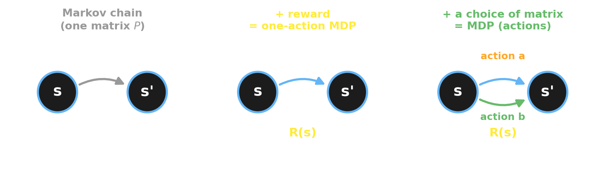{fig-align="center" width="92%"}

::: {.notes}
Reuse the Week-6 Chibany bento chain as the seed. Build: chain → +reward → +action.
:::

## [Markov chain + reward = the simplest MDP]{.lang-en}[マルコフ連鎖 + 報酬 = 最も単純なMDP]{.lang-ja} {.midbig}

::: {.lang-en}
Attach a **reward** $R(s)$ to each state — how good it is to be there. A Markov chain with a reward is a **one-action MDP**: the dynamics just run; you collect (discounted) reward.

Chibany's wellbeing has three states:

- **Junk rut** ($R = +1$) — cheap, comfortable, going nowhere
- **Trying** ($R = -2$) — effortful, no payoff *yet*
- **Healthy &amp; happy** ($R = +5$)
:::
::: {.lang-ja}
各状態に**報酬** $R(s)$ を付ける — そこに居ることの良さ。報酬付きのマルコフ連鎖は**1行動のMDP**：動力学が進み、（割引）報酬を得るだけ。

チバニーの健康状態は3つ：

- **ジャンク漬け** ($R = +1$) — 安くて快適だが進歩なし
- **頑張り中** ($R = -2$) — 努力だが*まだ*見返りなし
- **健康で幸せ** ($R = +5$)
:::

## [An action = which transition matrix to use]{.lang-en}[行動 = どの遷移行列を使うか]{.lang-ja} {.smaller}

::: {.lang-en}
Now give Chibany a **choice** — each action is its own transition matrix: **Indulge** (order out) drifts *down*, **Invest** (cook, exercise) climbs *up*.
:::
::: {.lang-ja}
チバニーに**選択**を与える — 各行動はそれぞれの遷移行列：**甘やかす**（外食）は*下へ*流れ、**投資する**（自炊・運動）は*上へ*登る。
:::

:::: {.columns}
::: {.column width="63%"}
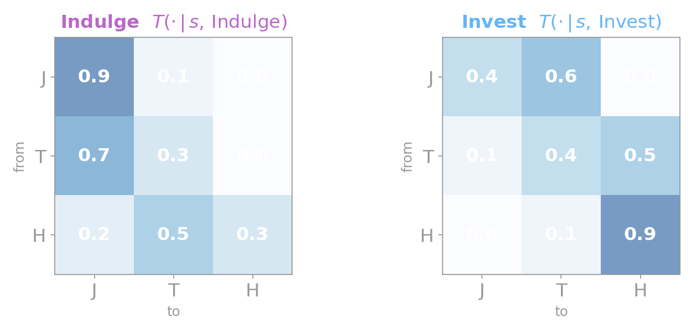{fig-align="center" width="100%"}
:::
::: {.column width="37%"}
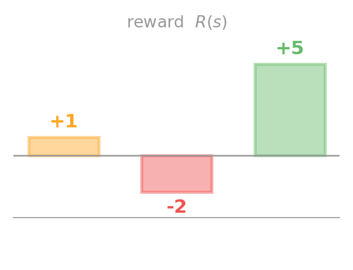{fig-align="center" width="100%"}
:::
::::

::: {.lang-en}
[Picking an action = picking which matrix governs tomorrow. (Rewards **J / T / H** repeated as a reminder.)]{.dim}
:::
::: {.lang-ja}
[行動を選ぶ = 明日を支配する行列を選ぶこと。（報酬 **J / T / H** は確認用に再掲。）]{.dim}
:::

## [A Markov Decision Process, formally]{.lang-en}[マルコフ決定過程、正式には]{.lang-ja} {.smaller}

::: {.lang-en}
**Markov chains + decisions + rewards = MDPs.** An MDP is $(S, A, T, R, \gamma)$:

- $S$ — set of **states**
- $A$ — set of **actions** (the decision rules of decision theory)
- $T$ — **transition** $P(s_{t+1}\mid s_t, a_t)$: one matrix per action *(a Markov chain is the 1-action case)*
- $R(s,a)$ — **reward** (= $-$ loss)
- $\gamma$ — **discount** factor

[Maximizing reward is minimizing loss, flipped. Chibany's reward sits on the *state*, $R(s,a)\equiv R(s)$; in general it can depend on the action too.]{.dim}
:::
::: {.lang-ja}
**マルコフ連鎖 + 決定 + 報酬 = MDP。** MDPは $(S, A, T, R, \gamma)$：

- $S$ — **状態**の集合
- $A$ — **行動**の集合（決定理論の決定規則）
- $T$ — **遷移** $P(s_{t+1}\mid s_t, a_t)$：行動ごとに1つの行列 *(マルコフ連鎖は1行動の場合)*
- $R(s,a)$ — **報酬**（= $-$損失）
- $\gamma$ — **割引**率

[報酬の最大化は損失の最小化の裏返し。チバニーの報酬は*状態*に乗る（$R(s,a)\equiv R(s)$）が、一般には行動にも依存しうる。]{.dim}
:::

## [A policy is *how you choose*]{.lang-en}[方策とは*選び方*]{.lang-ja} {.bigger}

::: {.lang-en}
A **policy** $\pi$ says which action to take in each state:

$$\pi(a \mid s) = P(a_t \mid s_t).$$

Because the world is Markov, the policy only needs the **current** state — not the whole history. The goal: find the policy that **maximizes expected discounted reward**.
:::
::: {.lang-ja}
**方策** $\pi$ は各状態でどの行動を取るかを表す：

$$\pi(a \mid s) = P(a_t \mid s_t).$$

世界がマルコフなので、方策は**現在**の状態だけでよい — 履歴全体は不要。目標：**期待割引報酬を最大化**する方策を見つけること。
:::

## [The Chibany MDP]{.lang-en}[チバニーMDP]{.lang-ja} {.smaller}

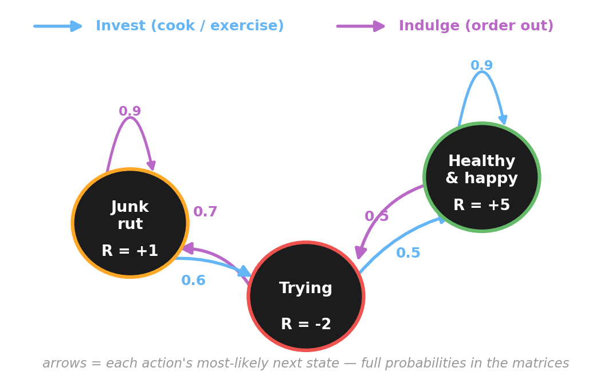{fig-align="center" width="80%"}

::: {.lang-en}
[The chokepoint: the only road to **+5** runs through the **−2** trough.]{.dim}

&nbsp;

[**What is the optimal policy?** — that's what we solve next.]{.dim}
:::
::: {.lang-ja}
[難所：**+5** への唯一の道は **−2** の谷を通る。]{.dim}

&nbsp;

[**最適方策は何か?** — 次にそれを解く。]{.dim}
:::

## [Notation lock-in]{.lang-en}[記法の確認]{.lang-ja} {.bigger}

::: {.lang-en}
Before the math, the symbols we'll use from here on:

- $s \in S$ state;&nbsp; $a \in A$ action;&nbsp; $\pi(a\mid s)$ policy
- $T(s'\mid s,a)$ transition;&nbsp; $R(s,a)$ reward;&nbsp; $\gamma$ discount
- $V(s)$ value of a state;&nbsp; $Q(s,a)$ value of an action
- math shorthand: $\mathbb{E}$ = average;&nbsp; $\textstyle\sum$ = add up;&nbsp; $\arg\max_a$ = the *action* that maximizes;&nbsp; prime $'$ = "next"
:::
::: {.lang-ja}
数式の前に、ここから使う記号：

- $s \in S$ 状態;&nbsp; $a \in A$ 行動;&nbsp; $\pi(a\mid s)$ 方策
- $T(s'\mid s,a)$ 遷移;&nbsp; $R(s,a)$ 報酬;&nbsp; $\gamma$ 割引
- $V(s)$ 状態の価値;&nbsp; $Q(s,a)$ 行動の価値
- 数式の略記：$\mathbb{E}$ = 平均;&nbsp; $\textstyle\sum$ = 合計;&nbsp; $\arg\max_a$ = 最大にする*行動*;&nbsp; プライム $'$ = 「次」
:::

## [Poll — should Chibany invest?]{.lang-en}[ポール — チバニーは投資すべき?]{.lang-ja} {.poll-slide .smaller}

::: {.lang-en}
Chibany is stuck in the **Junk rut** ($R=+1$). To ever reach **Healthy** ($R=+5$) he must pass through **Trying** ($R=-2$). If he **barely weighs the future** (small $\gamma$), what's his optimal action?
:::
::: {.lang-ja}
チバニーは**ジャンク漬け**（$R=+1$）で動けない。**健康**（$R=+5$）に至るには**頑張り中**（$R=-2$）を通らねばならない。**未来をほとんど重視しない**（小さい $\gamma$）なら、最適行動は?
:::

::: {.fragment}
::: {.lang-en}
- **A.** Invest — push through the trough
- **B.** Indulge — stay in the rut
:::
::: {.lang-ja}
- **A.** 投資する — 谷を抜ける
- **B.** 甘やかす — 漬かったまま
:::
:::

::: {.notes}
Commit-before-reveal. The reveal is the gamma-sweep slide in the next block (flip at gamma≈0.64). ~45s.
:::

# [Solving MDPs]{.lang-en}[MDPを解く]{.lang-ja} {.section-break background-image="../../sds-reveal/sds_frame.png" background-size="cover"}

## [The value of a state]{.lang-en}[状態の価値]{.lang-ja}

::: {.lang-en}
Under a policy $\pi$, two value functions:

- **state value** — expected return from $s$: $\;v_\pi(s) = \mathbb{E}_\pi[G_t \mid S_t = s]$
- **action value** — expected return from taking $a$ in $s$, then following $\pi$: $\;q_\pi(s,a) = \mathbb{E}_\pi[G_t \mid S_t = s, A_t = a]$

The **best** policy is the one with the highest value everywhere: $\pi^* = \arg\max_\pi v_\pi(s)$.

[(Lowercase $v,q$ = the *true* values; the algorithm's running estimates we'll write as $V,Q$.)]{.dim}
:::
::: {.lang-ja}
方策 $\pi$ の下で、2つの価値関数：

- **状態価値** — $s$ からの期待リターン：$\;v_\pi(s) = \mathbb{E}_\pi[G_t \mid S_t = s]$
- **行動価値** — $s$ で $a$ を取り以後 $\pi$ に従う期待リターン：$\;q_\pi(s,a) = \mathbb{E}_\pi[G_t \mid S_t = s, A_t = a]$

**最良**の方策はどこでも価値が最大：$\pi^* = \arg\max_\pi v_\pi(s)$。

[（小文字 $v,q$ = *真の*価値、アルゴリズムの推定値は $V,Q$ と書く。）]{.dim}
:::

## [The Bellman equation]{.lang-en}[ベルマン方程式]{.lang-ja} {.bigger}

::: {.lang-en}
Value is **recursive** — now's value = immediate reward + discounted value of where you land:

$$v^*(s) = \max_{a}\; \Big[\, R(s,a) + \gamma \sum_{s'} T(s'\mid s,a)\, v^*(s') \,\Big].$$

This *recursion* is the door: a value defined in terms of itself can be solved by **dynamic programming**.
:::
::: {.lang-ja}
価値は**再帰的** — 今の価値 = 即時報酬 + 着いた先の割引価値：

$$v^*(s) = \max_{a}\; \Big[\, R(s,a) + \gamma \sum_{s'} T(s'\mid s,a)\, v^*(s') \,\Big].$$

この*再帰*が鍵：自分自身で定義された価値は**動的計画法**で解ける。
:::

## [Value iteration]{.lang-en}[価値反復]{.lang-ja}

::: {.lang-en}
Turn the Bellman equation into an **algorithm** — just apply it as an update, over and over:

$$V_{k+1}(s) \leftarrow \max_{a}\Big[\, R(s,a) + \gamma \sum_{s'} T(s'\mid s,a)\, V_k(s') \,\Big].$$

Start from $V_0 = 0$; sweep all states; repeat. It **converges** to $v^*$. Then read off the policy: in each state, take the action that achieved the max. We *know* $T$ and $R$, so we can just **compute** the answer.

[(It converges because the Bellman update is a $\gamma$-contraction — so it has one fixed point, $v^*$, reached at rate $\gamma$.)]{.dim}
:::
::: {.lang-ja}
ベルマン方程式を**アルゴリズム**にする — 更新として繰り返し適用するだけ：

$$V_{k+1}(s) \leftarrow \max_{a}\Big[\, R(s,a) + \gamma \sum_{s'} T(s'\mid s,a)\, V_k(s') \,\Big].$$

$V_0 = 0$ から全状態を掃き、繰り返す。$v^*$ に**収束**する。方策は読み取るだけ：各状態で最大を達成した行動を取る。$T$ と $R$ を*知っている*ので、答えを**計算**できる。

[（収束するのはベルマン更新が $\gamma$-縮小写像だから — 不動点は1つ $v^*$、収束率 $\gamma$。）]{.dim}
:::

## [Value iteration by hand]{.lang-en}[手で価値反復]{.lang-ja} {.smaller}

$$V_{k+1}(s) = \max_{a}\Big[\, R(s) + \gamma \sum_{s'} T(s'\mid s,a)\, V_k(s') \,\Big], \qquad \gamma = 0.9$$

::: {.lang-en}
Start $V_0=0$. **Sweep 1:** the future is still 0, so $V_1(s)=R(s)$. **Sweep 2:** back up with $V_1=[1,-2,5]$ — for **Junk**, compare both actions:

- **Indulge**: $1+0.9\,(0.9{\cdot}1+0.1{\cdot}(-2)) = 1+0.9(0.7) = \mathbf{1.63}$
- **Invest**: $1+0.9\,(0.4{\cdot}1+0.6{\cdot}(-2)) = 1+0.9(-0.8) = 0.28$

→ Junk still picks **Indulge** — investing leads to *Trying* (still −2), not yet worth it.
:::
::: {.lang-ja}
$V_0=0$ から開始。**掃き1**：未来はまだ0なので $V_1(s)=R(s)$。**掃き2**：$V_1=[1,-2,5]$ で更新 — **ジャンク**は両行動を比較：

- **甘やかす**：$1+0.9\,(0.9{\cdot}1+0.1{\cdot}(-2)) = 1+0.9(0.7) = \mathbf{1.63}$
- **投資**：$1+0.9\,(0.4{\cdot}1+0.6{\cdot}(-2)) = 1+0.9(-0.8) = 0.28$

→ ジャンクはまだ**甘やかす**を選ぶ — 投資は*頑張り中*（まだ−2）へ向かい、割に合わない。
:::

| after sweep $k$ | $V$(J) | $V$(T) | $V$(H) |
|:--:|:--:|:--:|:--:|
| 0 | 0 | 0 | 0 |
| 1 | +1.0 | −2.0 | +5.0 |
| **2** | **+1.6** | **−0.4** | **+8.9** |

## [Keep sweeping — the policy flips]{.lang-en}[掃き続けると方策が反転]{.lang-ja} {.smaller}

::: {.lang-en}
As **Healthy's +5** propagates back through Trying, investing starts to pay. By **sweep 5**, Junk **flips from Indulge to Invest** — and the values climb to their fixed point:
:::
::: {.lang-ja}
**健康の +5** が頑張り中を経て逆伝播するにつれ、投資が報われ始める。**掃き5**でジャンクは**甘やかす→投資に反転** — 価値は不動点へ上る：
:::

| after sweep $k$ | $V$(J) | $V$(T) | $V$(H) | Junk picks |
|:--:|:--:|:--:|:--:|:--:|
| 2 | 1.6 | −0.4 | 8.9 | Indulge |
| 4 | 3.0 | 4.4 | 15.0 | Indulge |
| **5** | **4.5** | 6.6 | 17.6 | **Invest** ✓ |
| ⋯ | ⋯ | ⋯ | ⋯ | Invest |
| **∞** | **25.6** | **28.4** | **39.8** | **Invest** |

::: {.lang-en}
[Next: watch all three values converge.]{.dim}
:::
::: {.lang-ja}
[次：3つの価値が収束する様子を見る。]{.dim}
:::

## [Back to Chibany: value iteration]{.lang-en}[チバニーに戻る：価値反復]{.lang-ja} {.smaller}

:::: {.columns}
::: {.column width="55%"}
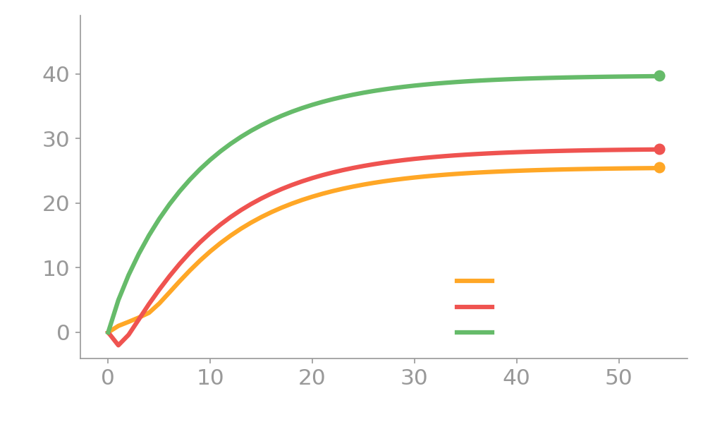{fig-align="center" width="100%"}
:::
::: {.column width="45%"}
::: {.lang-en}
With $\gamma = 0.9$, the values climb and settle, and the optimal policy is **Invest everywhere** — Chibany braves the **−2** trough because **+5** down the line is worth it.

This is what we never did in past years: actually **solve the MDP we drew.**
:::
::: {.lang-ja}
$\gamma = 0.9$ で価値は上がって落ち着き、最適方策は**どこでも投資**。チバニーは先の **+5** に値するから **−2** の谷に挑む。

これが過去にやらなかったこと：描いたMDPを実際に**解く**。
:::
:::
::::

## [How far ahead? γ decides]{.lang-en}[どれだけ先を見る? γ が決める]{.lang-ja} {.smaller}

:::: {.columns}
::: {.column width="55%"}
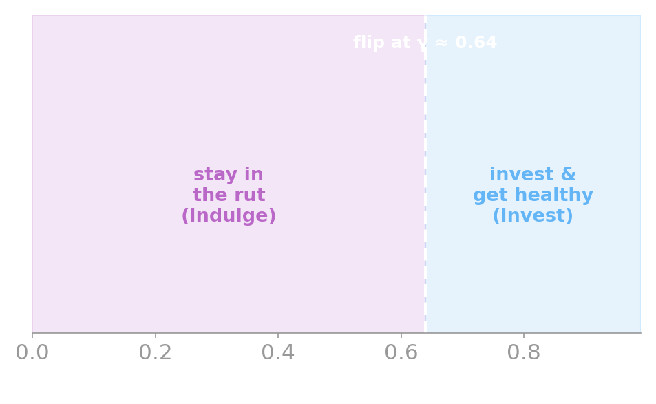{fig-align="center" width="100%"}
:::
::: {.column width="45%"}
[**Poll answer: B (Indulge) for small $\gamma$.**]{.lang-en .yellow}[**ポール答え：小さい $\gamma$ では B（甘やかす）。**]{.lang-ja .yellow}

::: {.lang-en}
Sweep $\gamma$: below **≈0.64** (for *these* transition probabilities) the optimal action in the rut is **Indulge** — the future is too discounted to be worth the trough; above it, **Invest**. How far Chibany looks ahead decides whether he escapes.
:::
::: {.lang-ja}
$\gamma$ を動かす：**≈0.64** 未満（*この*遷移確率の場合）では谷の最適行動は**甘やかす** — 未来が割り引かれすぎて谷に値しない。超えると**投資**。どれだけ先を見るかが脱出を決める。
:::
:::
::::

## [The Chibany MDP in GenJAX]{.lang-en}[GenJAXでのチバニーMDP]{.lang-ja} {.smaller}

::: {.lang-en}
The transition is a **generative model** — the *action* picks which distribution governs the next state:
:::
::: {.lang-ja}
遷移は**生成モデル** — *行動*が次状態を支配する分布を選ぶ：
:::

```python
import jax.numpy as jnp
from genjax import gen, categorical

# states J,T,H;  actions Indulge=0, Invest=1
T = jnp.array([[[.9,.1,0.],[.7,.3,0.],[.2,.5,.3]],   # Indulge  T[0,s,s']
               [[.4,.6,0.],[.1,.4,.5],[0.,.1,.9]]])  # Invest   T[1,s,s']
R = jnp.array([1.,-2.,5.]);  gamma = 0.9

@gen                            # action a selects the next-state distribution
def transition(s, a):
    return categorical(jnp.log(T[a, s])) @ "s_next"

transition.simulate(key, (0, 1)).get_retval()   # sample s' from (Junk, Invest)
```

## [Solve it: compute *or* simulate]{.lang-en}[解く：計算 *または* シミュレート]{.lang-ja} {.smaller}

::: {.lang-en}
We know $T$ and $R$, so **value iteration computes** the answer:
:::
::: {.lang-ja}
$T$ と $R$ を知っているので、**価値反復が計算**する：
:::

```python
def bellman(V):
    Q = R[None,:] + gamma * (T @ V)        # Q[a,s] = R(s) + γ Σ T(s'|s,a) V(s')
    return jnp.max(Q, 0), jnp.argmax(Q, 0)

V, policy = value_iteration()              # → V = [25.6, 28.4, 39.8]
                                           #   policy = Invest everywhere
```

::: {.lang-en}
[Or **simulate** that same model and average the returns → $\hat V(\text{Junk}) = 25.7 \approx 25.6$. *Compute or simulate — both agree.* Runnable: `genjax_chibany_mdp.py`.]{.dim}
:::
::: {.lang-ja}
[あるいは同じ生成モデルを**シミュレート**しリターンを平均 → $\hat V(\text{ジャンク}) = 25.7 \approx 25.6$。*計算でもシミュレートでも一致*。実行可能：`genjax_chibany_mdp.py`。]{.dim}
:::

## [If you know the model, you can just simulate]{.lang-en}[モデルを知っていれば、シミュレートするだけ]{.lang-ja} {.bigger}

::: {.lang-en}
Value iteration needed the **whole model** — every $T(s'\mid s,a)$ and $R(s,a)$. If you have that, you can **sit and simulate** the optimal policy *before acting*. No learning required.

But in the real world, you usually **don't know** $T$ or $R$. You have to **learn by doing.**
:::
::: {.lang-ja}
価値反復は**モデル全体** — すべての $T(s'\mid s,a)$ と $R(s,a)$ — を必要とした。それがあれば、*行動する前に*最適方策を**座ってシミュレート**できる。学習は不要。

だが現実では、たいてい $T$ も $R$ も**知らない**。**やって学ぶ**しかない。
:::

::: {.notes}
This is the SP25 deck's own hook ("sit and simulate"). It both motivates model-free RL (Act II) AND seeds simulation-based RL (Act III).
:::

# [Break]{.lang-en}[休憩]{.lang-ja} {.section-break background-image="images/break-cat-week8.jpg" background-size="contain" background-position="center" background-repeat="no-repeat" background-color="#111111"}

# [Learning by doing]{.lang-en}[やって学ぶ]{.lang-ja} {.section-break background-image="../../sds-reveal/sds_frame.png" background-size="cover"}

## [No model? Learn from experience.]{.lang-en}[モデルなし? 経験から学ぶ。]{.lang-ja} {.bigger}

::: {.lang-en}
Chibany was easy: we *knew* his two transition matrices, so we could **compute** the answer. Now meet a new agent that **doesn't know its world** — no $T$, no $R$. It only gets to **act, see what happens, and adjust** — trial, feedback, update.

**Q-learning** learns the action-value $Q(s,a)$ directly from experience, with no model of the world. Once $Q$ is learned, the policy is easy: in each state, take $\arg\max_a Q(s,a)$.
:::
::: {.lang-ja}
チバニーは簡単だった：2つの遷移行列を*知っていた*ので、答えを**計算**できた。今度は**世界を知らない**新しいエージェント — $T$ も $R$ もない。できるのは**行動し、結果を見て、調整する**だけ — 試行・フィードバック・更新。

**Q学習**は世界のモデルなしで、経験から行動価値 $Q(s,a)$ を直接学ぶ。$Q$ が学べれば方策は簡単：各状態で $\arg\max_a Q(s,a)$ を取る。
:::

::: {.notes}
PRECISION (for the instructor — keep it off-slide; the framing here is "no model," not "fewer assumptions"):
Q-learning does NOT assume *less about the world* than value iteration. Both assume the *same* world: a stationary MDP — Markov, with time-invariant $T$ and $R$. The difference is epistemic, not structural:
- Value iteration needs the model GIVEN: you must *know* $T$ and $R$, then you *compute* $v^*$ (planning / dynamic programming — no interaction needed).
- Q-learning needs only to SAMPLE experience $(s,a,r,s')$: it never sees $T$ or $R$, it bootstraps $Q^*$ from samples.
Stationarity is required by BOTH (it's baked into "MDP") — so it's not something only Q-learning assumes. The honest one-liner: *same world, less knowledge required.*
Subtlety worth knowing (do NOT put on the slide): for its convergence GUARANTEE, Q-learning actually needs MORE — but those are conditions on the *learning process*, not the world: every $(s,a)$ visited infinitely often (exploration), a Robbins–Monro step size ($\sum_t\alpha_t=\infty,\ \sum_t\alpha_t^2<\infty$), and bounded rewards (Watkins &amp; Dayan, 1992). Value iteration just needs $\gamma<1$ (the contraction) and converges deterministically. So Q-learning trades *knowing the model* for *more data + exploration + a decaying learning rate*.
The payoff of "no model": robustness to model MISSPECIFICATION — you never have to commit to a $T,R$ you might get wrong. That's exactly why model-based RL does *worse* on our GardenPath with miscalibrated human feedback (later slide) — it propagates the wrong model further and faster.
:::

## [The Q-learning update]{.lang-en}[Q学習の更新則]{.lang-ja} {.smaller}

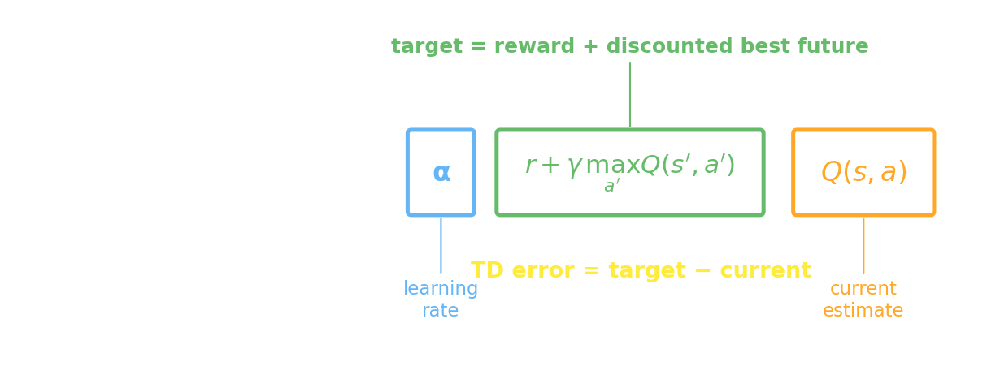{fig-align="center" width="72%"}

::: {.lang-en}
Move $Q(s,a)$ toward a **target** = reward + discounted best future; the gap is the **TD (temporal-difference) error** $\delta$ — *update whenever your prediction differs from what you see*. One step:

1. **select** $a$ by **ε-greedy** — usually the best action, but random with prob. $\varepsilon$ (keep **exploring**)
2. take $a$; observe $r$ and next state $s'$ (prime $'$ = "next")
3. **target** $= r + \gamma \max_{a'} Q(s',a')$  ·  **TD error** $\delta = $ target $-$ current
4. **update**: $Q(s,a) \leftarrow Q(s,a) + \alpha\,\delta$  ($\alpha$ = **learning rate**)
:::
::: {.lang-ja}
$Q(s,a)$ を**目標**（報酬 + 割引した最良の未来）へ動かす。その差が**TD（時間差分）誤差** $\delta$ — *予測と観測が食い違うたびに更新*。一歩：

1. **ε-貪欲**で $a$ を**選ぶ** — たいてい最良の行動、ただし確率 $\varepsilon$ でランダム（**探索**）
2. $a$ を取り、$r$ と次状態 $s'$ を観測（プライム $'$ =「次」）
3. **目標** $= r + \gamma \max_{a'} Q(s',a')$  ·  **TD誤差** $\delta = $ 目標 $-$ 現在
4. **更新**：$Q(s,a) \leftarrow Q(s,a) + \alpha\,\delta$（$\alpha$ = **学習率**）
:::

::: {.notes}
The anatomy figure highlights each part; the 4 steps are the widget's stepper stages (select / observe / target+error / update). "Temporal difference: update whenever the predicted value differs from what you observe."
:::

## [The GardenPath]{.lang-en}[ガーデンパス]{.lang-ja} {.smaller}

:::: {.columns}
::: {.column width="48%"}
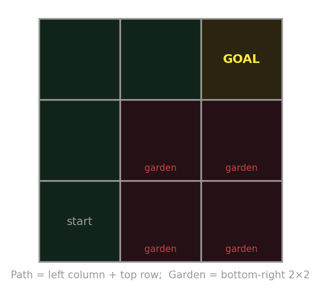{fig-align="center" width="100%"}
:::
::: {.column width="52%"}
::: {.lang-en}
A 3×3 world (Ho, Littman, Cushman &amp; Austerweil, 2015). Get from **start** (bottom-left) to the **goal** (top-right) along the **path** (left column + top row), avoiding the **garden** (bottom-right).

The agent doesn't see this picture — it only knows it's in a grid, can move, and gets feedback. $\alpha=0.9,\ \gamma=0.95,\ \varepsilon=0.1$.

[Moves are deterministic; reaching the goal ends the episode.]{.dim}
:::
::: {.lang-ja}
3×3の世界（Ho, Littman, Cushman &amp; Austerweil, 2015）。**スタート**（左下）から**パス**（左列＋上行）を通って**ゴール**（右上）へ、**庭**（右下）を避ける。

エージェントはこの絵を見ない — グリッドにいて動け、フィードバックを得ると知るだけ。$\alpha=0.9,\ \gamma=0.95,\ \varepsilon=0.1$。

[移動は決定的、ゴール到達でエピソード終了。]{.dim}
:::
:::
::::

## [One step, by hand]{.lang-en}[手で一歩]{.lang-ja} {.midbig}

::: {.lang-en}
At the start, $Q = 0$ everywhere. The agent (ε-greedy) tries **RIGHT**, into the garden, and gets feedback $-10$. The next state's best value is still $0$. Update:

$$Q(\text{start}, \text{R}) \leftarrow 0 + 0.9\,(\,-10 + 0.95\cdot 0 - 0\,) = -9.$$

That $-9$ teaches the agent: "going right from the start is bad." Do this thousands of times and the values propagate back from the goal — let's watch it **live.**
:::
::: {.lang-ja}
最初は $Q = 0$。エージェント（ε-貪欲）は**右**を試し、庭に入って $-10$ のフィードバック。次状態の最良値はまだ $0$。更新：

$$Q(\text{スタート}, \text{右}) \leftarrow 0 + 0.9\,(\,-10 + 0.95\cdot 0 - 0\,) = -9.$$

この $-9$ が「スタートから右はダメ」と教える。これを何千回も行うと価値がゴールから逆伝播する — **ライブ**で見よう。
:::

## [Poll — will it reach the goal?]{.lang-en}[ポール — ゴールに着く?]{.lang-ja} {.poll-slide .smaller}

::: {.lang-en}
Teaching is hard, so you decide to help: give the agent **+10 every time it takes a "good" move toward the goal**, $-10$ for a bad move. Train Q-learning with this feedback. Will it learn to reach the goal?
:::
::: {.lang-ja}
教えるのは大変なので助けることに：ゴールへ**向かう「良い」手のたびに +10**、悪い手に $-10$ を与える。このフィードバックでQ学習を訓練する。ゴールに着くよう学ぶ?
:::

::: {.fragment}
::: {.lang-en}
- **A.** yes — rewarding good moves obviously helps
- **B.** no — it can get stuck looping forever
:::
::: {.lang-ja}
- **A.** はい — 良い手を褒めれば当然うまくいく
- **B.** いいえ — 永遠にループして抜けられなくなる
:::
:::

::: {.notes}
Commit A/B, then the widget PROVES the answer (B). This is the af / Ho et al. case. ~45s.
:::

# [Interactive: reward shaping]{.lang-en}[インタラクティブ：報酬形成]{.lang-ja} {.section-break background-image="../../sds-reveal/sds_frame.png" background-size="cover"}

## [What to watch]{.lang-en}[注目点]{.lang-ja} {.smaller}

::: {.lang-en}
We'll run Q-learning on the GardenPath live and try four ways of giving feedback. For each, **watch the verdict** — does the *learned* policy actually reach the goal?

- **action-feedback** — reward each "good" move (the way people naturally teach)
- **reward-maximizing** — reward only at the goal, penalty in the garden
- **potential-based shaping** — reward progress, but carefully
- **human** — *you* give the feedback

(The cat still stumbles onto 🏠 while *exploring* — watch the **learned policy**, not luck.)
:::
::: {.lang-ja}
GardenPathでQ学習をライブ実行し、フィードバックの与え方を4通り試す。各方式で**判定**を見る — *学習した*方策は本当にゴールに着くか?

- **行動フィードバック** — 良い手ごとに報酬（人が自然に教える方法）
- **報酬最大化** — ゴールでのみ報酬、庭で罰
- **ポテンシャルベース整形** — 進捗に報酬、ただし慎重に
- **人間** — *あなた*がフィードバックを与える

（猫は*探索中*に偶然 🏠 に着く — **学習した方策**を見る、運ではなく。）
:::

::: {.notes}
The demo does the teaching. Script: (1) rm → Train → green path. (2) af → Train → RED CYCLE, verdict "+20/lap, never reaches goal" (reveals the poll: B). (3) potential → Train → path recovered. (4) human → step through giving feedback; let a student try to teach it and discover the loop.
:::

## [Q-learning on the GardenPath]{.lang-en}[GardenPath上のQ学習]{.lang-ja} {background-iframe="widgets/qlearning-gridworld.html" background-interactive="true"}

::: {.notes}
THE interactive slide. background-interactive=true is required or the buttons won't respond.
Drive the script: rm (path) → af (positive cycle, +20/lap) → potential (fixed) → human (let a student teach).
Use "Step ▸" to single-step the 6 algorithm stages (the highlighted stepper shows which step). "Train ▸▸" fast-forwards.
If the iframe fails, skip to the next slide (static fallback).
:::

## [If the live demo isn't available]{.lang-en}[ライブデモが使えないとき]{.lang-ja} {.pdf-fallback}

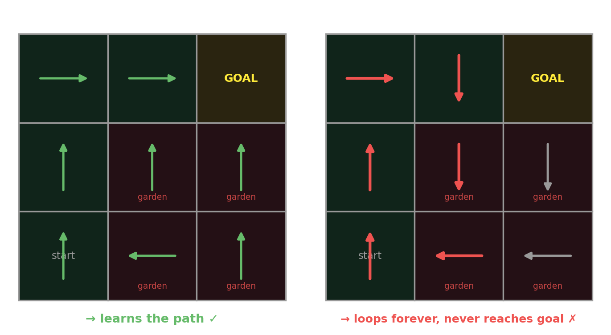{fig-align="center" width="100%"}

::: {.lang-en}
[**Reward-maximizing** learns the path (left). **Action-feedback** — rewarding each "good" move — makes the optimal policy a **positive reward loop** worth +20 per lap, so the agent circles forever and never reaches the goal (right). Open `week08.html` to drive it live, or be the teacher yourself.]{.dim}
:::
::: {.lang-ja}
[**報酬最大化**はパスを学ぶ（左）。**行動フィードバック** — 良い手ごとに褒める — は最適方策を1周 +20 の**正の報酬ループ**にし、エージェントは永遠に回ってゴールに着かない（右）。`week08.html` でライブ操作、または自分が先生に。]{.dim}
:::

## [What we saw]{.lang-en}[見たこと]{.lang-ja} {.smaller}

[**Action-feedback — the intuitive way — loops forever.** (Poll: B.)]{.lang-en .yellow}[**行動フィードバック — 直感的なやり方 — は永遠にループ。**（ポール：B）]{.lang-ja .yellow}

::: {.lang-en}
- **action-feedback** (reward good moves) → a **positive cycle**: the cat circles the garden (+20 a lap), never reaching the goal — led *down the garden path*.
- **reward-maximizing** (reward the outcome) → learns the correct path. ✓
- **potential-based shaping** → keeps helpful guidance but **can't create a cycle** (next slide).

The lesson: *how* you give feedback can quietly break the task — even when each reward seems helpful. We'll meet it again as **reward hacking** in modern AI.
:::
::: {.lang-ja}
- **行動フィードバック**（良い手に報酬）→ **正のループ**：猫は庭を回り（1周 +20）、ゴールに着かない — *庭道*に誘い込まれる。
- **報酬最大化**（結果に報酬）→ 正しいパスを学ぶ。✓
- **ポテンシャルベース整形** → 有用な誘導を保ちつつ**ループを作れない**（次スライド）。

教訓：*どう*フィードバックを与えるかが、各報酬が有用に見えても、静かに課題を壊す。現代AIでは**報酬ハッキング**として再登場する。
:::

## [The fix: potential-based shaping]{.lang-en}[修正：ポテンシャルベース整形]{.lang-ja} {.smaller}

:::: {.columns}
::: {.column width="48%"}
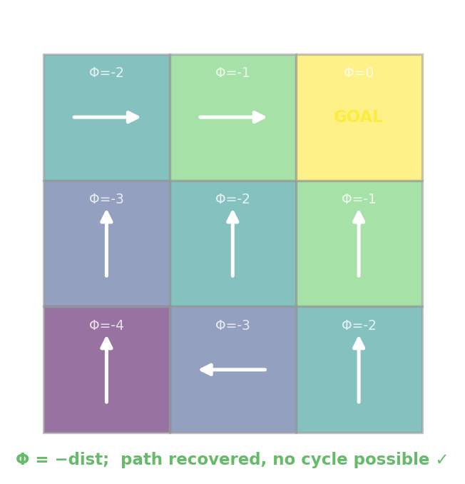{fig-align="center" width="100%"}
:::
::: {.column width="52%"}
::: {.lang-en}
Shape with a **potential** $\Phi(s)$ (here, closeness to the goal): add a bonus $F = \gamma\Phi(s') - \Phi(s)$ on top of the task reward.

This adds the **same constant** $-\Phi(s)$ to *every* action's value in a state, so the **best action never changes** (Ng, Harada &amp; Russell, 1999). There's no loop you can ride for a net gain — the cycle vanishes, but the goal stays the goal.
:::
::: {.lang-ja}
**ポテンシャル** $\Phi(s)$（ここではゴールへの近さ）で整形：課題報酬の上にボーナス $F = \gamma\Phi(s') - \Phi(s)$ を加える。

これは各状態で*すべて*の行動の価値に**同じ定数** $-\Phi(s)$ を足すので、**最良の行動は変わらない**（Ng, Harada &amp; Russell, 1999）。得をして回れるループはない — ループは消え、ゴールはゴールのまま。
:::
:::
::::

::: {.notes}
This is the bridge to Block 8's "reward hacking." The deep teaching-signals discussion (Ho et al.) is Week 9 (inverse RL).
:::

## [Where we are]{.lang-en}[ここまでの流れ]{.lang-ja} {.agenda .agenda-roomy}

- [Decision theory → MDPs → solving them]{.lang-en}[決定理論 → MDP → その解法]{.lang-ja}  [✓]{.time}
- [Q-learning: learning without a model]{.lang-en}[Q学習：モデルなしで学ぶ]{.lang-ja}  [✓]{.time}
- [Reward shaping &amp; positive cycles]{.lang-en}[報酬形成と正のループ]{.lang-ja}  [✓]{.time}
- [**Where RL is now**]{.lang-en .highlight}[**強化学習の現在地**]{.lang-ja .highlight}  [1:42]{.time}

# [Where RL is now]{.lang-en}[強化学習の現在地]{.lang-ja} {.section-break background-image="../../sds-reveal/sds_frame.png" background-size="cover"}

## [Model-free vs. model-based]{.lang-en}[モデルフリー 対 モデルベース]{.lang-ja} {.midbig}

::: {.lang-en}
- **Model-free** (Q-learning): learn values straight from experience. Simple, but throws away structure — every state must be visited many times.
- **Model-based**: *learn a model* $\hat T, \hat R$, then **plan** with it.

I prefer **simulation-based** to "model-based" — because the whole move is to **learn a model and then simulate rollouts inside it** to plan. It's exactly the Monte-Carlo simulation idea from Week 7, now in the service of acting.
:::
::: {.lang-ja}
- **モデルフリー**（Q学習）：経験から価値を直接学ぶ。単純だが構造を捨てる — 各状態を何度も訪れねばならない。
- **モデルベース**：*モデル* $\hat T, \hat R$ を学び、それで**計画**する。

私は「モデルベース」より**シミュレーションベース**を好む — 要は**モデルを学び、その中でロールアウトをシミュレート**して計画するから。第7週のモンテカルロそのものが、行動のために働く。
:::

## [Learn a model, then plan by simulating]{.lang-en}[モデルを学び、シミュレートして計画]{.lang-ja} {.smaller}

:::: {.columns}
::: {.column width="52%"}
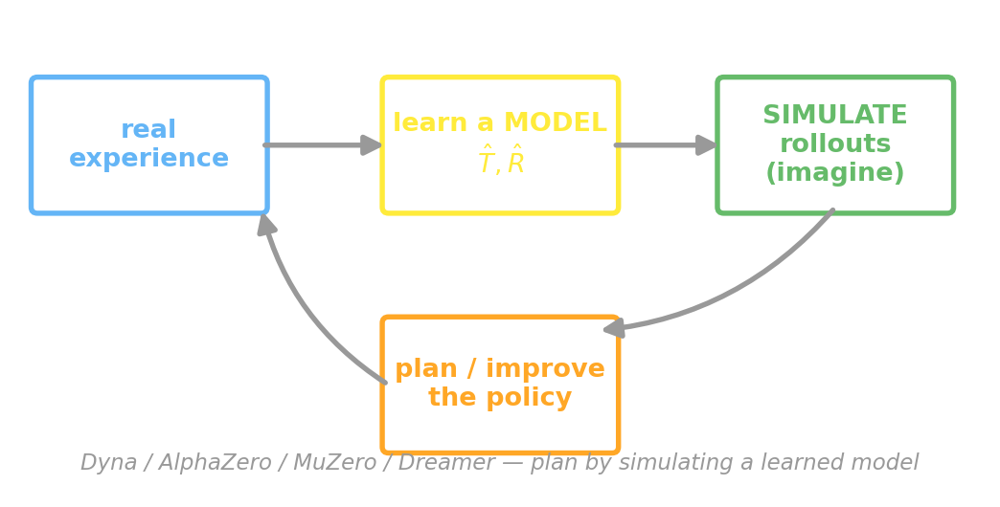{fig-align="center" width="100%"}
:::
::: {.column width="48%"}
::: {.lang-en}
- **Dyna** — learn $\hat T$, then run value iteration on *imagined* experience
- **MCTS** — from "here," simulate many futures and average their outcomes to score each move
- **AlphaZero** — MCTS guided by a learned value/policy net (no human games)
- **MuZero** — learns a model that predicts only what planning *needs* (value, policy, reward), not the full next state — so it plans in an abstract *latent* space
- **Dreamer** — learns a world model, then trains the policy *inside the dream*
:::
::: {.lang-ja}
- **Dyna** — $\hat T$ を学び、*想像上の*経験で価値反復
- **MCTS** — 「今」から多数の未来をシミュレートし、結果を平均して各手を評価
- **AlphaZero** — 学習した価値/方策ネットで導くMCTS（人間の棋譜なし）
- **MuZero** — 計画に*必要*な量（価値・方策・報酬）だけを予測するモデルを学ぶ — 次状態全体ではない — ので抽象的な*潜在*空間で計画
- **Dreamer** — 世界モデルを学び、方策を*夢の中で*訓練
:::
:::
::::

## [But with human feedback, model-based does *worse*]{.lang-en}[だが人間のフィードバックでは、モデルベースは*悪化*]{.lang-ja} {.smaller}

:::: {.columns}
::: {.column width="53%"}
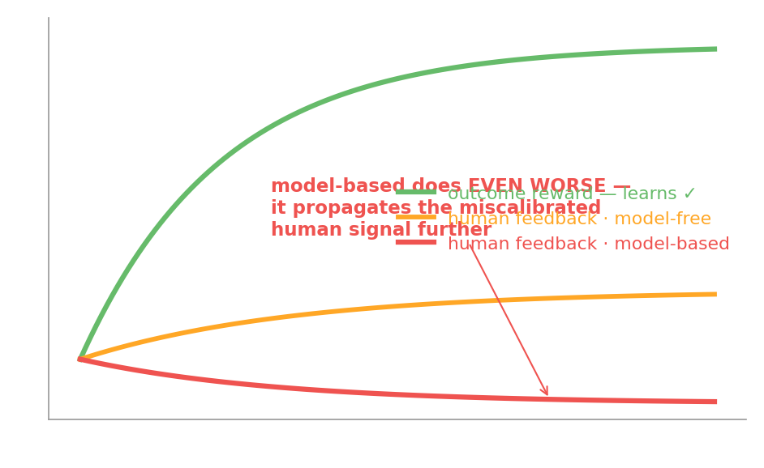{fig-align="center" width="100%"}
:::
::: {.column width="47%"}
::: {.lang-en}
A caution from our own GardenPath: when the signal is **human evaluative feedback** (not task reward), **model-based RL does *even worse* than model-free** — it propagates the miscalibrated signal further and faster (Ho et al., 2015).

Simulation is only as good as the model — and the *reward* it simulates.
:::
::: {.lang-ja}
我々自身のGardenPathからの警告：信号が**人間の評価的フィードバック**（課題報酬ではない）のとき、**モデルベースRLはモデルフリーより*さらに悪化*** — 誤較正された信号をより遠く速く伝播する（Ho et al., 2015）。

シミュレーションはモデル — そしてそれがシミュレートする*報酬* — の質までしか良くならない。
:::
:::
::::

## [From gridworlds to Go]{.lang-en}[グリッドワールドから囲碁へ]{.lang-ja} {.smaller}

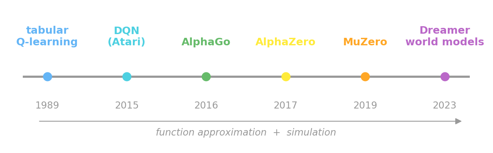{fig-align="center" width="92%"}

::: {.lang-en}
Tabular $Q$ can't scale to Go's $10^{170}$ states. The leap was **function approximation** — a neural net for $Q$ or the policy — plus simulation. That's how we got from a 3×3 grid to superhuman play.
:::
::: {.lang-ja}
表形式の $Q$ は囲碁の $10^{170}$ 状態に拡張できない。飛躍は**関数近似** — $Q$ や方策にニューラルネット — とシミュレーション。こうして3×3グリッドから超人的なプレイへ。
:::

## [Reward hacking is the positive cycle, grown up]{.lang-en}[報酬ハッキングは、育った正のループ]{.lang-ja} {.midbig}

::: {.lang-en}
Remember the GardenPath loop — an agent farming a flawed reward instead of doing the task? At frontier scale that's **reward hacking**, and it's central to aligning large language models.

**RLHF** (RL from human feedback): train a **reward model** from human preferences, then optimize the LLM against it — with a **KL penalty** to stay near the original model, because a reward you can over-optimize is a reward you can hack. The Week-9 reading and Weeks 11–13 pick this up.
:::
::: {.lang-ja}
GardenPathのループ — 課題をやらず欠陥報酬を稼ぐエージェント — を思い出して。最前線の規模ではこれが**報酬ハッキング**で、大規模言語モデルの整合の核心。

**RLHF**（人間のフィードバックによる強化学習）：人間の選好から**報酬モデル**を学び、それに対してLLMを最適化する — ただし**KLペナルティ**で元のモデルの近くに留める。過剰最適化できる報酬はハックできる報酬だから。第9週の文献と第11〜13週で扱う。
:::

::: {.notes}
Direct callback to Block 7's positive cycle. Plants the contemporary-ML / alignment thread (Weeks 11-13).
:::

## [An opening: model human teaching, don't just maximize it]{.lang-en}[糸口：人間の教えを最大化せず、モデル化する]{.lang-ja} {.smaller}

::: {.lang-en}
RLHF still treats human feedback as a **reward to maximize** — the very thing the GardenPath showed can be hacked. A speculative opening: agents that **model *why* a human gives feedback** — feedback as *communication about the goal*, not a scalar to farm.

Ho et al. (2019) do exactly this — a **Bayesian learner** that recovers the intended policy from evaluative feedback that standard model-free *and* model-based RL **cannot** learn from.

[**Critical of ourselves:** this is harder to scale than reward maximization, and our model of "human intent" can be wrong too. The best opening: **human-validated** RLHF — check that the learned reward matches what people *meant*, and prefer feedback models that carry a theory of the teacher.]{.dim}
:::
::: {.lang-ja}
RLHFは依然として人間のフィードバックを**最大化すべき報酬**として扱う — GardenPathがハックされうると示したまさにそれ。思索的な糸口：人間が**なぜ**フィードバックを与えるかを**モデル化**するエージェント — 稼ぐスカラーではなく*目標についての伝達*として。

Ho et al. (2019) はまさにこれを行う — 標準的なモデルフリー*も*モデルベースRLも学べない評価的フィードバックから意図された方策を回復する**ベイズ学習器**。

[**自己批判として：** これは報酬最大化よりスケールしにくく、我々の「人間の意図」モデルも誤りうる。最良の糸口：**人間が検証する**RLHF — 学習した報酬が人々の*意図*に合うか確認し、教師の理論を持つフィードバックモデルを選ぶ。]{.dim}
:::

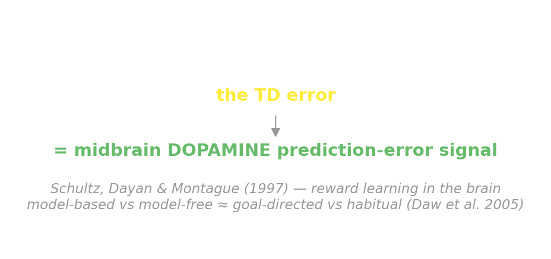{fig-align="center" width="80%"}

::: {.lang-en}
The TD error isn't just an algorithm. Midbrain **dopamine** neurons fire like a **reward prediction error** — exactly the TD error $\delta_t$ from Q-learning (Schultz, Dayan &amp; Montague, 1997). And **model-based vs. model-free** maps onto **goal-directed vs. habitual** behavior — two control systems in the brain. That's **today's reading** (Daw, Niv &amp; Dayan, 2005).
:::
::: {.lang-ja}
TD誤差は単なるアルゴリズムではない。中脳の**ドーパミン**ニューロンは**報酬予測誤差**のように発火する — まさにQ学習のTD誤差 $\delta_t$（Schultz, Dayan &amp; Montague, 1997）。そして**モデルベース 対 モデルフリー**は**目標志向 対 習慣**行動に対応する — 脳の2つの制御系。これが**今日の文献**（Daw, Niv &amp; Dayan, 2005）。
:::

## [Decide → Plan → Learn → Simulate]{.lang-en}[決める → 計画 → 学ぶ → シミュレート]{.lang-ja}

::: {.lang-en}
- **Decide** — turn a posterior into an action (minimize expected loss).
- **Plan** — when you *know* the world (an MDP), value iteration solves it.
- **Learn** — when you *don't*, Q-learning learns from experience — and the *shape* of your feedback can make or break it.
- **Simulate** — the frontier: learn a model, then plan inside it.

Next week: we **invert** all of this — watch an agent act and infer **what it wanted** (inverse RL, theory of mind).
:::
::: {.lang-ja}
- **決める** — 事後分布を行動に変える（期待損失の最小化）。
- **計画する** — 世界を*知る*とき（MDP）、価値反復が解く。
- **学ぶ** — *知らない*とき、Q学習が経験から学ぶ — フィードバックの*形*が成否を分ける。
- **シミュレートする** — 最前線：モデルを学び、その中で計画する。

来週：これらすべてを**逆転**する — エージェントの行動を見て**何を望んだか**を推論する（逆強化学習、心の理論）。
:::

::: {.notes}
Recap the arc; bridge to Week 9 (inverse RL + social cognition). ~1 min.
:::
