# [Run the camera backwards]{.lang-en}[カメラを逆回しする]{.lang-ja} {.section-break background-image="../../sds-reveal/sds_frame.png" background-size="cover"}

::: {.notes}
Opening section break, clock 0:00. The title for the whole week: we're going to "run the camera backwards." Last week we filmed a goal turning into actions (forward RL); this week we play that film in reverse to recover the goal/belief/reward. Set the tone in one line, then go to admin — don't elaborate yet, the pivot slide does that.
:::

## [Admin — deadlines]{.lang-en}[連絡 — 締め切り]{.lang-ja}

::: {.lang-en}
- ★ **Final-project proposal due Sunday June 28, 8:00 PM** (pass/fail) — ~1 page: background, your question, method, ≥3 references.
- **Assignment 4 (Reinforcement Learning)** is out — due **Fri Jul 10, 8 PM** (Q-learning on the GardenPath grid).
- **Monte Carlo assignment** also due **Fri Jul 10, 8 PM** — pace your work around the proposal.
- **Reflections:** you need **5 of 11** (Weeks 2–12). After today, **3 chances remain** — Weeks 10, 11, 12. Check you're on track.
:::

::: {.lang-ja}
- ★ **最終プロジェクト提案書：6月28日（日）20:00締切**（合否）— 約1ページ：背景・問い・手法・参考文献3件以上。
- **課題4（強化学習）**公開中 — 締切 **7月10日（金）20:00**（GardenPathグリッド上のQ学習）。
- **モンテカルロ課題**も締切 **7月10日（金）20:00** — 提案書を挟んでペース配分を。
- **リフレクション：** 11週中**5回**必要（第2〜12週）。今日以降、**残り3回** — 第10・11・12週。進捗を確認しよう。
:::

::: {.notes}
Welcome block, clock 0:00 — we have ~7 min here. Lead with the headline: the final-project proposal is due Sunday June 28, 8 PM, two days out — make sure everyone has a question and three references lined up. Note the RL assignment (Assignment 4) and Monte Carlo are BOTH due Jul 10, 8 PM, so they should pace work around the proposal this weekend. Reflections: students need 5 of 11 (Weeks 2–12); by class time Week 9's window has closed, so only 3 chances remain (Weeks 10–12) — nudge anyone behind to plan ahead. Keep it to two minutes; don't linger.
:::

## [Next week is async — AI Safety workshop]{.lang-en}[来週は非同期 — AIセーフティ・ワークショップ]{.lang-ja}

::: {.lang-en}
- **Week 10 (Fri Jul 3) runs asynchronously** — no in-person session.
- There's an **AI Safety workshop** that week — you're warmly invited if it interests you. *Heads up: it runs **fully in English**.*
- I'll **record the lecture** (Bayesian nonparametrics) and post a **link to the recording** — watch it on your own time.
- The **weekly discussion thread still runs** — post and reply as usual (Week 10 is reflection-eligible).
:::

::: {.lang-ja}
- **第10週（7月3日・金）は非同期** — 対面授業はありません。
- その週に**AIセーフティのワークショップ**があります — 興味があればぜひご参加を。*注：**全て英語**で行われます。*
- **講義（ベイズ・ノンパラメトリクス）を録画**し、**録画リンク**を共有します — 各自のペースで視聴を。
- **毎週のディスカッションスレッドは通常通り** — いつものように投稿・返信を（第10週はリフレクション対象）。
:::

::: {.notes}
Logistics for next week — flag it clearly so nobody shows up to an empty room. Week 10 (Jul 3) is ASYNC because there's an AI Safety workshop that week worth attending; students are invited if interested, but warn them it's entirely in English. You'll record the Bayesian-nonparametrics lecture and post the link; the Slack discussion thread runs as normal and Week 10 still counts as one of their three remaining reflection weeks. ~30 seconds; point them to the thread for the workshop details/link.
:::

## [From acting to reading minds]{.lang-en}[行動から心を読むへ]{.lang-ja}

::: {.lang-en}
Last week we ran reinforcement learning **forward**: a goal becomes a policy becomes actions.

This week we run the *same machinery* **backward** — watch the actions, infer the **goal**, **belief**, or **reward** behind them. That inversion is **inverse RL**, and when the agent is a person, it *is* the computational story of **social cognition**.
:::

::: {.lang-ja}
先週は強化学習を**順方向**に動かした：目標 → 方策 → 行動。

今週は*同じ仕組み*を**逆方向**に動かす — 行動を観察し、その背後の**目標・信念・報酬**を推論する。この反転が**逆強化学習**であり、相手が人間のときそれは**社会的認知**の計算論的な物語そのものだ。
:::

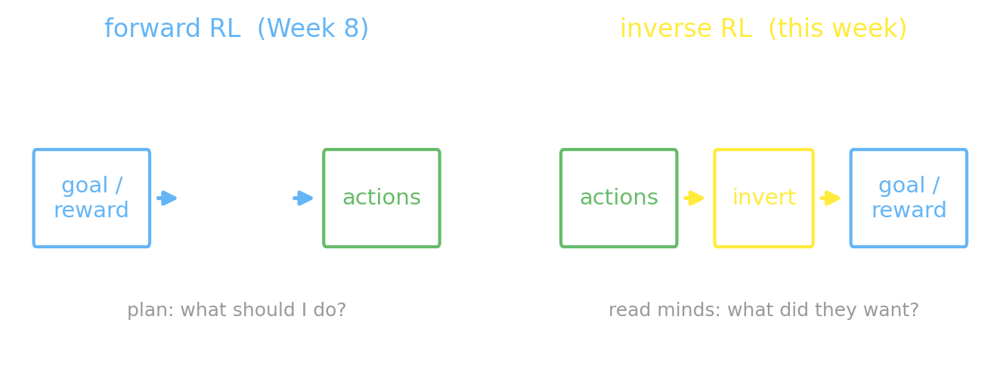{fig-align="center" width="86%"}

::: {.notes}
This is the pivot slide — the spine of the whole week. Last week we ran RL FORWARD: a goal became a policy became actions, and the students literally coded that (Q-learning on GardenPath). Today we run the SAME machinery BACKWARD: watch the actions, infer the hidden goal/belief/reward. Say the name-drop out loud — "this inversion is inverse RL, and when the agent is a person, it IS the computational theory of social cognition" (Jara-Ettinger 2019). Point at the two columns of the figure: forward (goal→π→actions) on the left, inverse (actions→goal) on the right. Everything today is this one arrow reversed, applied to a richer hidden variable each block.
:::

## [The one equation for the whole week]{.lang-en}[今週を貫く一つの式]{.lang-ja}

$$P(\text{goal}\mid\text{actions}) \;\propto\; \underbrace{P(\text{actions}\mid\text{goal})}_{\text{a policy, in reverse}}\;\cdot\;P(\text{goal})$$

::: {.lang-en}
The likelihood `P(actions | goal)` is just a **policy** — how a goal-seeker would act. Last week we worked out *how good each action is* for a goal; this week we assume the agent **mostly takes the good actions, but slips up now and then** — and we read that backward. Everything today is this one inversion, on a richer hidden variable each time: **goal → belief → reward**.
:::

::: {.lang-ja}
尤度 `P(行動 | 目標)` は単なる**方策** — 目標を目指す者の動き方だ。先週は各行動が目標に対して*どれだけ良いか*を求めた。今週はエージェントが**たいてい良い行動を取るが、時々ミスをする**と仮定し、それを逆向きに読む。今日はこの一つの反転を、隠れ変数を**目標 → 信念 → 報酬**と豊かにしながら適用する。
:::

::: {.notes}
The single equation the whole deck hangs on — write it big and say it once slowly. The key move to land: the likelihood P(actions | goal) is JUST a policy — exactly what we computed last week (value iteration → Q-values). The one new ingredient this week is making the agent noisily rational: wrap Q in a softmax with temperature β, so mistakes are possible and the inference has something to chew on. Promise them the punchline now: today we re-run this exact inversion on goal, then belief, then reward — same equation, richer hidden variable each time. Don't derive anything yet; that's the next block.
:::

## [Agenda — 2 hours]{.lang-en}[本日の予定 — 2時間]{.lang-ja} {.agenda .dense}

- [Run the camera backwards]{.lang-en .highlight}[カメラを逆回しする]{.lang-ja .highlight}  [0:00]{.time}
- [Goal inference as inverse planning]{.lang-en}[逆プランニングとしての目標推論]{.lang-ja}  [0:07]{.time}
- [Theory of Mind = inverse RL]{.lang-en}[心の理論 = 逆強化学習]{.lang-ja}  [0:37]{.time}
- [POMDPs — inferring beliefs]{.lang-en}[POMDP — 信念を推論する]{.lang-ja}  [0:45]{.time}
- [Break]{.lang-en}[休憩]{.lang-ja}  [1:07]{.time}
- [Inverse RL — recovering rewards]{.lang-en}[逆強化学習 — 報酬の復元]{.lang-ja}  [1:12]{.time}
- [Teaching, flipped]{.lang-en}[教示の反転]{.lang-ja}  [1:26]{.time}
- [Alignment & LLM Theory of Mind]{.lang-en}[アラインメントとLLMの心の理論]{.lang-ja}  [1:38]{.time}
- [Close & Week 10]{.lang-en}[まとめと第10週]{.lang-ja}  [1:52]{.time}

::: {.notes}
The full 2-hour map. Highlighted row is where we are (Welcome, 0:00). Five-beat arc: goal → ToM → belief → teaching → alignment, each re-running the same inversion. Flag the break at 1:07. Don't read every line — just orient them: "two halves, break in the middle, the back half is teaching and the modern alignment tail." Move on quickly.
:::

# [Goal inference as inverse planning]{.lang-en}[逆プランニングとしての目標推論]{.lang-ja} {.section-break background-image="../../sds-reveal/sds_frame.png" background-size="cover"}

::: {.notes}
Section break into Block 2, the longest concept block (~20 min, clock 0:07). This is where we actually build the inversion — Baker, Tenenbaum & Saxe 2007 (the assigned reading) and Baker, Saxe & Tenenbaum 2009. Transition line: "we have the one equation; now let's actually invert an MDP and recover a goal from a path."
:::

## [Where we are]{.lang-en}[ここまでの流れ]{.lang-ja} {.agenda .dense}

- [Run the camera backwards]{.lang-en .done}[カメラを逆回しする]{.lang-ja .done}  [0:00]{.time}
- [Goal inference as inverse planning]{.lang-en .highlight}[逆プランニングとしての目標推論]{.lang-ja .highlight}  [0:07]{.time}
- [Theory of Mind = inverse RL]{.lang-en}[心の理論 = 逆強化学習]{.lang-ja}  [0:37]{.time}
- [POMDPs — inferring beliefs]{.lang-en}[POMDP — 信念を推論する]{.lang-ja}  [0:45]{.time}
- [Break]{.lang-en}[休憩]{.lang-ja}  [1:07]{.time}
- [Inverse RL — recovering rewards]{.lang-en}[逆強化学習 — 報酬の復元]{.lang-ja}  [1:12]{.time}
- [Teaching, flipped]{.lang-en}[教示の反転]{.lang-ja}  [1:26]{.time}
- [Alignment & LLM Theory of Mind]{.lang-en}[アラインメントとLLMの心の理論]{.lang-ja}  [1:38]{.time}
- [Close & Week 10]{.lang-en}[まとめと第10週]{.lang-ja}  [1:52]{.time}

::: {.notes}
Recap slide — brief. We've done the welcome/pivot (~7 min in); now entering goal inference as inverse planning. One sentence and move on.
:::

## [Notation lock-in]{.lang-en}[記法の確認]{.lang-ja}

::: {.lang-en}
- **trajectory** $\tau$ — the path of states and actions we observe
- **goal** $g$ — the hidden thing we infer; **reward** $R$, **cost** $C$
- **posterior** $P(g \mid \tau)$ — our belief over goals after seeing $\tau$
- **likelihood** $P(\tau \mid g)$ — how a $g$-seeking agent would move
- **rationality** $\beta$ — how decisively the agent picks the best-valued action ($\beta\to\infty$ greedy / pure exploit, $\beta\to 0$ random); formula next slide
- carried from Week 8: state $s$, action $a$, policy $\pi$, value $Q$, discount $\gamma$
:::

::: {.lang-ja}
- **軌跡** $\tau$ — 観察する状態と行動の系列
- **目標** $g$ — 推論したい隠れ変数；**報酬** $R$、**コスト** $C$
- **事後分布** $P(g \mid \tau)$ — $\tau$ を見た後の目標についての信念
- **尤度** $P(\tau \mid g)$ — 目標 $g$ を目指すエージェントの動き方
- **合理性** $\beta$ — 価値最大の行動をどれだけ決然と選ぶか（$\beta\to\infty$ で貪欲＝純粋な活用、$\beta\to 0$ でランダム）；式は次のスライド
- 先週から：状態 $s$、行動 $a$、方策 $\pi$、価値 $Q$、割引 $\gamma$
:::

::: {.notes}
This is the heaviest-notation week after Week 8 — the CLAUDE.md rule is to define every new symbol at first use, so this is the lock-in box. Walk the new symbols slowly: τ (trajectory = path of states+actions we observe), g (the hidden goal), the posterior P(g|τ) and the likelihood P(τ|g), and especially β, the rationality knob (its softmax formula lands two slides on, in Build the inversion) — emphasize the two limits: β→∞ is greedy/pure exploit, β→0 is random. The rest (s, a, π, Q, γ) carries over from last week; just remind them. Tell students this box is a reference they can glance back at; don't make them memorize it.
:::

## [The inversion is Bayes' rule]{.lang-en}[反転はベイズの定理]{.lang-ja}

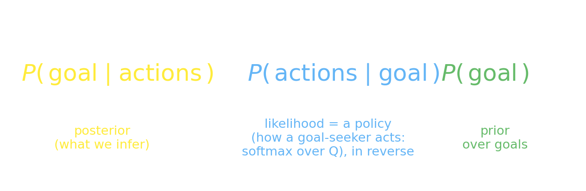{fig-align="center" width="92%"}

::: {.lang-en}
**Posterior** (what we infer) $\propto$ **likelihood** (how a goal-seeker acts — a softmax policy, read in reverse) $\times$ **prior** (over candidate goals). Next: build each piece.
:::
::: {.lang-ja}
**事後分布**（推論したいもの）$\propto$ **尤度**（目標を追う者の行動 — ソフトマックス方策を逆に読む）$\times$ **事前分布**（候補目標について）。次に各要素を組み立てる。
:::

::: {.notes}
The high-level anatomy before the recipe: goal inference IS Bayes' rule. Point at the color-coding — posterior (yellow, what we infer) ∝ likelihood (blue) × prior (green). The one thing to stress: the LIKELIHOOD is a policy — "how a goal-seeker acts," i.e. last week's softmax-over-Q run in reverse. That's the whole trick; the next slide makes each of the four pieces concrete.
:::

## [Build the inversion]{.lang-en}[反転を組み立てる]{.lang-ja}

::: {.lang-en}
1. **Forward** — value iteration (Week 8) gives the $Q$-values $Q_g$; wrap them in a **softmax** (best action most likely, the rest still possible) → a noisy-rational policy $\pi_g(a\mid s)\propto \exp(\beta\,Q_g(s,a))$ *(new this week; one per candidate goal)*
2. **Likelihood** — $P(\tau\mid g)=\prod_t \pi_g(a_t\mid s_t)$
3. **Prior** — $P(g)$ over candidate goals
4. **Posterior** — $P(g\mid\tau)\propto P(\tau\mid g)\,P(g)$
:::

::: {.lang-ja}
1. **順方向** — 価値反復（先週）が $Q$ 値 $Q_g$ を与える；それを**ソフトマックス**（最良の行動が最も起こりやすいが、他もあり得る）で包む → ノイズのある合理的方策 $\pi_g(a\mid s)\propto \exp(\beta\,Q_g(s,a))$ *（今週から；候補目標ごとに一つ）*
2. **尤度** — $P(\tau\mid g)=\prod_t \pi_g(a_t\mid s_t)$
3. **事前分布** — 候補目標についての $P(g)$
4. **事後分布** — $P(g\mid\tau)\propto P(\tau\mid g)\,P(g)$
:::

::: {.notes}
The four-step recipe — this is the conceptual core of the block; take your time. Step 1 is the only new compute: last week's value iteration gives Q-values per candidate goal, and we wrap each in a softmax to get a noisy-rational policy π_g — one forward solve PER hypothesized goal. Steps 2–4 are just Bayes: multiply the per-step policy probabilities into a likelihood, multiply by the prior, normalize to the posterior. Emphasize "the likelihood is a policy" — that is the whole trick (it's the blue piece of the Bayes-rule anatomy we just saw). Then promise: "now let's watch this run."
:::

## [In GenJAX — invert the MDP]{.lang-en}[GenJAXで — MDPを反転する]{.lang-ja}

```python
LOGITS = beta * Q_per_goal              # β·Q logits; categorical softmaxes them → the policy
@gen
def observer(states):                   # observed actions = the data
    g = categorical(jnp.log(goal_prior)) @ "goal"     # the hidden goal
    for t in range(T):
        categorical(LOGITS[g, states[t]]) @ f"a_{t}"  # softmax policy of g
post = normalize([exp(observer.assess(cm(g, acts), (states,))[0]) for g in GOALS])
```

[The hidden variable we recover **is "which MDP are we in?"**]{.lang-en}[復元する隠れ変数こそ**「どのMDPにいるか」**である。]{.lang-ja}

::: {.notes}
The GenJAX code slide — the recipe in ~7 runnable lines. Point at the three things: LOGITS = β·Q (the policy is a softmax over Q-values from last week's solver); the @gen model draws the hidden goal g, then samples each action from the softmax policy of g; and post enumerates the candidate goals and normalizes the assessed scores into the posterior. The backbone is genjax_goal_inference.py in this directory — verified to run (genjax 0.10.3) — so you CAN open it and execute it live if the room is engaged. Land the tagline on the slide: the hidden variable we recover IS "which MDP are we in?" — that's the unifying frame for the whole week.
:::

## [Watch it infer — live]{.lang-en}[推論を実演 — ライブ]{.lang-ja} {background-iframe="widgets/goal-inference.html" background-interactive="true"}

::: {.notes}
WIDGET A — live goal inference (Baker's "freeze the animation" paradigm made interactive). Demo script: start with the agent stepping under its softmax policy and watch the posterior bars over goals update each step — point out it's AMBIGUOUS early (mid vs right tie around 0.50) and SHARPENS as the agent commits; the verified freeze-frame sequence on "right" is 0.37 → 0.47 → 0.50 → 0.54. Then drag the β (rationality) slider: near-random β flattens the posterior to ~0.33 each, high β sharpens to ~0.72 on the true goal — "the inference is only as good as the rationality assumption." NEW: there's a "🎮 you drive" mode — switch to it and steer the agent with the arrow keys / WASD; the posterior updates live as the audience watches you betray your goal by where you head. If the widget fails to load, the static fallback is goal-inference-posterior.png. Keep it to ~2 min.
:::

## [The inversion is ill-posed]{.lang-en}[反転は不良設定問題]{.lang-ja}

:::: {.columns}
::: {.column width="52%"}
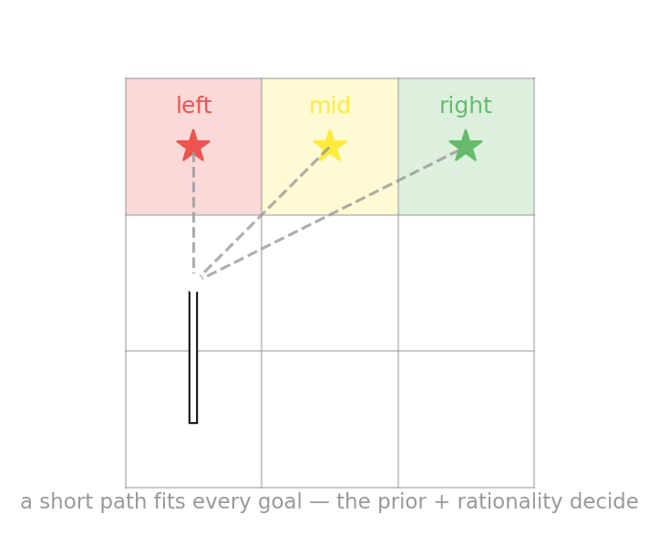{fig-align="center" width="100%"}
:::
::: {.column width="48%"}
::: {.lang-en}
A few steps fit **many** goals. The single confident answer comes from the **prior** + the **rationality assumption** — it's a *posterior*, not a unique solution.

Baker, Saxe & Tenenbaum (2009): the *changing-goal* model tracks human goal judgments at **r = 0.97** (vs 0.82 single-goal).
:::
::: {.lang-ja}
数ステップは**多くの**目標に当てはまる。一つの確信ある答えは**事前分布**と**合理性の仮定**から来る — 唯一解ではなく*事後分布*だ。

Baker, Saxe & Tenenbaum (2009)：*目標が変わる*モデルは人間の判断を **r = 0.97** で説明（単一目標は0.82）。
:::
:::
::::

::: {.notes}
The crucial caveat — don't skip it. A few steps fit MANY goals; the single confident answer is NOT a unique solution, it's a posterior that the prior plus the rationality assumption disambiguate (Baker, Saxe & Tenenbaum 2009: "the inverse problem is ill-posed; its solution requires strong prior knowledge"). Common student confusion to preempt: they'll think the model "figured out" the goal — correct them, it WEIGHTED multiple explanations by fit. The r=0.97 number is the payoff: the changing-goal model tracks human frame-by-frame goal judgments at r=0.97 (Experiment 1), versus 0.82 for a single-fixed-goal model — say "modeling that goals can CHANGE is what fits people best." Tee up the next slide: people infer not just the goal but the cost-reward tradeoff behind it.
:::

## [People reason about cost vs reward]{.lang-en}[人はコストと報酬で推論する]{.lang-ja}

::: {.lang-en}
**Naive utility calculus** (Jara-Ettinger et al. 2016): we assume agents **maximize reward minus cost**, and we infer *both* from behavior — present from infancy through adulthood. Inferring the reward is the same move as inferring the goal.

Watch **Chibany** trek all the way across town for a bento box and open it beaming — you infer two things at once: the trip was **costly**, so the contents must have been **worth it**. You'd be *surprised* if it weren't his beloved **tonkatsu**.
:::

::: {.lang-ja}
**素朴効用計算**（Jara-Ettinger et al. 2016）：私たちはエージェントが**報酬からコストを引いた値を最大化**すると仮定し、行動からその*両方*を推論する — 乳児期から成人まで存在する。報酬の推論は目標の推論と同じ操作だ。

**チバニー**が弁当のために町の反対側まで歩き、満面の笑みで開けるのを見れば、二つを同時に推論する：その道のりは**コストが高く**、だから中身は**それに見合う価値**があったはず。大好きな**とんかつ**でなければ*驚く*だろう。
:::

::: {.notes}
Naive utility calculus (Jara-Ettinger, Gweon, Schulz & Tenenbaum 2016): we assume agents maximize reward MINUS cost, and we infer BOTH from behavior — and this runs from infancy through adulthood. The Chibany bento example is the intuition pump: a long costly trip + a beaming face → you infer the contents were worth it (you'd be surprised if it weren't his beloved tonkatsu). The one thing to emphasize: inferring the reward is the SAME inversion move as inferring the goal — just a richer latent. This is the bridge from the cog-sci ToM material to machine reward-recovery (Widget D later). Then run the poll.
:::

## [Poll — which is *not* inverse RL?]{.lang-en}[ポール — *逆*強化学習で*ない*のは？]{.lang-ja}

::: {.poll-slide}
::: {.fragment}
::: {.lang-en}
- **A.** Find an optimal policy by acting in an MDP
- **B.** Learn a reward from an agent's behavior
- **C.** Learn an agent's preferences from behavior
- **D.** Learn an MDP's transitions from behavior
:::
::: {.lang-ja}
- **A.** MDPの中で行動して最適方策を求める
- **B.** 行動から報酬関数を学習する
- **C.** 行動から選好を学習する
- **D.** 行動から遷移関数を学習する
:::
:::
:::

::: {.notes}
POLL 1 (commit before reveal). Source: SP25 "Social Cognition and Inverse Reinforcement Learning" quiz, Q2. Have everyone commit to a letter before you reveal. The likely split: B and D draw a few votes from students who hear "learn from behavior" and pattern-match to "inverse." The misconception this surfaces: confusing the FORWARD problem (acting in an MDP to find a policy — last week) with the INVERSE problem (recovering something hidden from behavior). Hold the reveal until everyone has committed.
:::

## [Poll — reveal]{.lang-en}[ポール — 解答]{.lang-ja} {.poll-reveal}

[**A — that's *forward* RL.**]{.lang-en .yellow}[**A — それは*順*強化学習。**]{.lang-ja .yellow}

::: {.lang-en}
Acting *in* an MDP to find a policy is the forward problem (Week 8). B, C, D all **recover something hidden from behavior** — that's the inverse problem.
:::
::: {.lang-ja}
MDPの*中で*行動して方策を求めるのは順問題（先週）。B・C・Dはすべて**行動から隠れたものを復元する** — それが逆問題だ。
:::

::: {.notes}
Reveal: A — that's FORWARD RL (acting in an MDP to find a policy = Week 8's problem). One-line justification: B, C, D all recover something hidden FROM behavior — that's the inverse problem. Source: SP25 IRL quiz Q2. Reinforce the forward/inverse distinction one more time, since the rest of the day depends on it, then move into the softmax / noisy-rationality detail.
:::

## [Noisy rationality]{.lang-en}[ノイズのある合理性]{.lang-ja}

:::: {.columns}
::: {.column width="50%"}
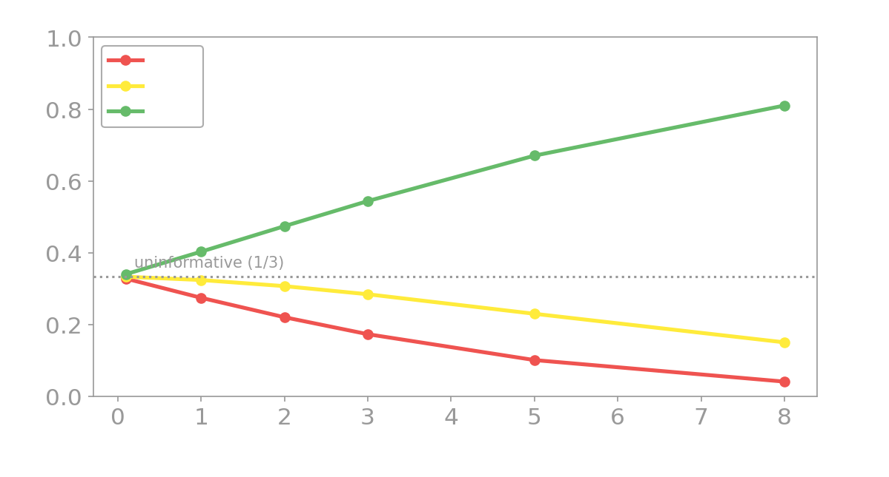{fig-align="center" width="100%"}
:::
::: {.column width="50%"}
::: {.lang-en}
$\pi(a\mid s)\propto \exp(\beta\,Q(s,a))$ — favors high-$Q$ actions, imperfectly. Take the **rightward path** (→ → ↑ ↑) from the goal-inference demo: at high $\beta$ it's decisive evidence the goal is **top-right**; at $\beta\to 0$ (a random agent) the *same path* says nothing.

So when an agent **blunders or detours**, the model rationalizes it by inferring a *weirder goal* — or, soon, an **unseen obstacle**. "Assume rationality, blame the goal."
:::
::: {.lang-ja}
$\pi(a\mid s)\propto \exp(\beta\,Q(s,a))$ — 高$Q$の行動を好むが完璧ではない。目標推論デモの**右向きの経路**（→ → ↑ ↑）：高い $\beta$ では目標が**右上**だという決定的な証拠、$\beta\to 0$（ランダム）では*同じ経路*が無意味。

だからエージェントが**失敗・遠回り**すると、モデルは*より奇妙な目標*を — まもなく**見えない障害物**を — 推論して辻褄を合わせる。「合理性を仮定し、目標のせいにする」。
:::
:::
::::

::: {.notes}
This slide carries Block 3 (noisy rationality) — under time pressure it folds into the build-the-inversion slide, but it deserves its own beat if there's room (~0:27 mark). The core idea: the softmax exponent β is the rationality knob — the SAME path is decisive evidence at high β and useless at β→0. The big payoff phrase, say it out loud: "Assume rationality, blame the goal." When an agent blunders or detours, the model doesn't conclude it's irrational — it rationalizes the detour by inferring a WEIRDER goal, or (foreshadow Block 5) an unseen obstacle. This is the exact mechanism BToM will reuse for false beliefs, so plant it here. If a student objects "but maybe the agent just had wrong info," that's the perfect lead-in to POMDPs — acknowledge and say "hold that, it's the next beat."
:::

# [Theory of Mind = inverse RL]{.lang-en}[心の理論 = 逆強化学習]{.lang-ja} {.section-break background-image="../../sds-reveal/sds_frame.png" background-size="cover"}

::: {.notes}
Section break into Block 4 (~8 min, clock 0:37). Short transition: "we've shown the machinery — now the claim about minds." This block names the thesis: Theory of Mind IS inverse RL.
:::

## [Where we are]{.lang-en}[ここまでの流れ]{.lang-ja} {.agenda .dense}

- [Run the camera backwards]{.lang-en .done}[カメラを逆回しする]{.lang-ja .done}  [0:00]{.time}
- [Goal inference as inverse planning]{.lang-en .done}[逆プランニングとしての目標推論]{.lang-ja .done}  [0:07]{.time}
- [Theory of Mind = inverse RL]{.lang-en .highlight}[心の理論 = 逆強化学習]{.lang-ja .highlight}  [0:37]{.time}
- [POMDPs — inferring beliefs]{.lang-en}[POMDP — 信念を推論する]{.lang-ja}  [0:45]{.time}
- [Break]{.lang-en}[休憩]{.lang-ja}  [1:07]{.time}
- [Inverse RL — recovering rewards]{.lang-en}[逆強化学習 — 報酬の復元]{.lang-ja}  [1:12]{.time}
- [Teaching, flipped]{.lang-en}[教示の反転]{.lang-ja}  [1:26]{.time}
- [Alignment & LLM Theory of Mind]{.lang-en}[アラインメントとLLMの心の理論]{.lang-ja}  [1:38]{.time}
- [Close & Week 10]{.lang-en}[まとめと第10週]{.lang-ja}  [1:52]{.time}

::: {.notes}
Recap — brief. Goal inference and noisy rationality are done (~37 min in); next is the ToM = IRL framing. One sentence, keep moving.
:::

## [Reading minds *is* inverse planning]{.lang-en}[心を読むこと*は*逆プランニング]{.lang-ja}

:::: {.columns}
::: {.column width="52%"}
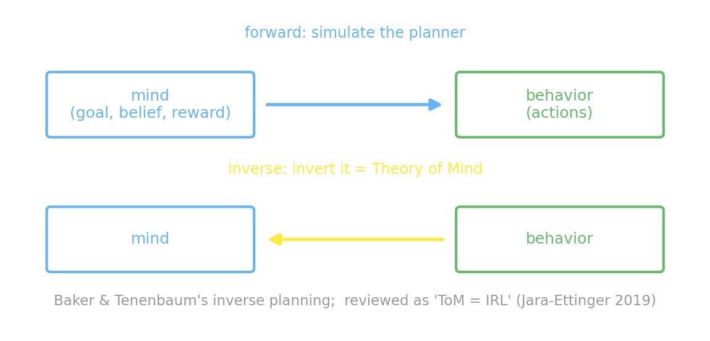{fig-align="center" width="100%"}
:::
::: {.column width="48%"}
::: {.lang-en}
The framework is **Baker & Tenenbaum's** (2007, 2009) — *action understanding as inverse planning*. Forward = simulate the planner; inverse = invert it to recover goals/beliefs.

Jara-Ettinger's 2019 **review** names it cleanly: **Theory of Mind = IRL**.
:::
::: {.lang-ja}
枠組みは**Baker & Tenenbaum**（2007, 2009）— *逆プランニングとしての行動理解*。順方向＝プランナーを模擬、逆方向＝それを反転して目標・信念を復元。

Jara-Ettinger 2019の**レビュー**が端的に命名：**心の理論 = 逆強化学習**。
:::
:::
::::

::: {.notes}
The framing slide. Be careful with attribution (it's in the research notes): the FRAMEWORK is Baker & Tenenbaum's — Baker, Tenenbaum & Saxe 2007 and Baker, Saxe & Tenenbaum 2009, "action understanding as inverse planning," which they themselves call inverse planning / inverse RL. Jara-Ettinger's 2019 review is what cleanly NAMES it "Theory of Mind = IRL" and is the modern synthesis — cite it as the review, NOT the originator. Say the one-liner: mental-state inference from behavior IS inverse RL — forward = simulate the planner, inverse = invert it to recover goals/beliefs. This is the conceptual peak of the front half: "this is what minds do." Then pivot to the limitation that opens Block 5.
:::

## [But agents don't see everything]{.lang-en}[しかしエージェントは全てを見ていない]{.lang-ja}

::: {.lang-en}
So far we inferred **goals**, assuming the agent sees the whole world (an MDP). But people act on **partial — and sometimes *false* — beliefs**.

To read *those* minds we must invert a model where the **belief itself is hidden**. That model is a **POMDP**.
:::

::: {.lang-ja}
ここまでは、エージェントが世界全体を見ている（MDP）と仮定して**目標**を推論した。だが人は**部分的で — 時に*誤った* — 信念**にもとづいて行動する。

*その*心を読むには、**信念そのものが隠れている**モデルを反転しなければならない。それが**POMDP**だ。
:::

::: {.notes}
The hinge of the whole lecture. So far we inferred GOALS, assuming the agent sees the whole world (an MDP). But people act on partial — and sometimes FALSE — beliefs. To read THOSE minds we must invert a model where the belief itself is hidden: a POMDP. This is the 2009→2017 move in Baker's own work (MDP → POMDP). Say it as a cliffhanger: "to read a mind that's wrong about the world, we need a new piece of machinery." Then break into the POMDP block.
:::

# [POMDPs — inferring beliefs]{.lang-en}[POMDP — 信念を推論する]{.lang-ja} {.section-break background-image="../../sds-reveal/sds_frame.png" background-size="cover"}

::: {.notes}
Section break into Block 5 — THE HEART of the lecture (~22 min, clock 0:45). This is the longest and most important block; it never gets cut. Transition: "now the agent doesn't see everything — let's infer what it BELIEVES."
:::

## [Where we are]{.lang-en}[ここまでの流れ]{.lang-ja} {.agenda .dense}

- [Run the camera backwards]{.lang-en .done}[カメラを逆回しする]{.lang-ja .done}  [0:00]{.time}
- [Goal inference as inverse planning]{.lang-en .done}[逆プランニングとしての目標推論]{.lang-ja .done}  [0:07]{.time}
- [Theory of Mind = inverse RL]{.lang-en .done}[心の理論 = 逆強化学習]{.lang-ja .done}  [0:37]{.time}
- [POMDPs — inferring beliefs]{.lang-en .highlight}[POMDP — 信念を推論する]{.lang-ja .highlight}  [0:45]{.time}
- [Break]{.lang-en}[休憩]{.lang-ja}  [1:07]{.time}
- [Inverse RL — recovering rewards]{.lang-en}[逆強化学習 — 報酬の復元]{.lang-ja}  [1:12]{.time}
- [Teaching, flipped]{.lang-en}[教示の反転]{.lang-ja}  [1:26]{.time}
- [Alignment & LLM Theory of Mind]{.lang-en}[アラインメントとLLMの心の理論]{.lang-ja}  [1:38]{.time}
- [Close & Week 10]{.lang-en}[まとめと第10週]{.lang-ja}  [1:52]{.time}

::: {.notes}
Recap — brief. ToM = IRL is named (~45 min in); now we add partial/false beliefs via POMDPs. One sentence, keep moving — this is the longest block so don't burn time on the recap.
:::

## [The food-truck puzzle]{.lang-en}[フードトラックの謎]{.lang-ja} {.smaller}

:::: {.columns}
::: {.column width="55%"}
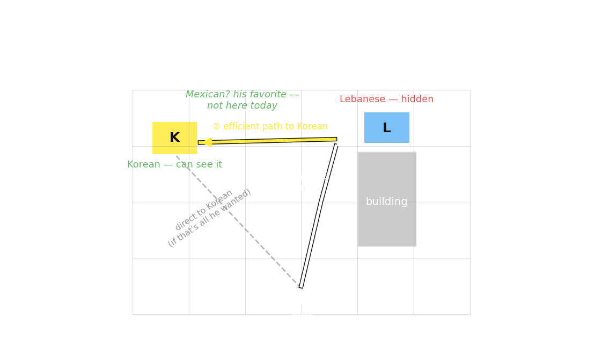{fig-align="center" width="100%"}
:::
::: {.column width="45%"}
::: {.lang-en}
**Chibany** likes **Mexican > Korean > Lebanese**. He can **see** a Korean truck nearby; a building **hides the far spot**.

Instead of going straight to the **visible Korean**, he detours to peek at the **hidden** spot — the moment he sees it's **Lebanese** (not the Mexican he hoped for), he takes the **direct** path to the Korean.

Passing up a perfectly good Korean only makes sense if he was **hoping for Mexican** and *didn't know* what was hidden. So you infer a desire for a truck **not even in the scene** — impossible without modeling his **belief** (Baker et al. 2017).
:::
::: {.lang-ja}
**チバニー**の好み：**メキシコ > 韓国 > レバノン**。近くの韓国料理トラックは**見える**が、建物が**遠い場所を隠している**。

見えている**韓国料理**へ直行せず、わざわざ**隠れた**場所を覗きに行き — **レバノン料理**（期待したメキシコ料理ではない）と分かると — **まっすぐ**韓国料理へ向かう。

申し分ない韓国料理を素通りするのは、**メキシコ料理を期待**していて、隠れた場所に何があるか*知らなかった*場合のみ筋が通る。だから**その場にすら無い**トラックへの欲求を推論する — 彼の**信念**をモデル化しない限り不可能だ（Baker et al. 2017）。
:::
:::
::::

::: {.notes}
Motivation BEFORE formalism — the food-truck scenario is why we need beliefs at all (Baker, Jara-Ettinger, Saxe & Tenenbaum 2017, Nature Human Behaviour). Walk it as a story: Chibany prefers Mexican > Korean > Lebanese; he can SEE a Korean truck nearby but a building HIDES the far spot. He skips going straight to the perfectly good visible Korean and detours to peek behind the building; the moment he can see it's Lebanese (not Mexican), he takes the efficient straight path to the Korean — he does NOT walk all the way to the far truck (pre-empt the "why didn't he take the efficient route back?" question — he does). The punchline to land: passing up the Korean only makes sense if he was HOPING for Mexican and DIDN'T KNOW what was hidden — so you infer a desire for a truck that isn't even in the scene. No shortest-path goal account can explain this; you can only explain it by modeling what he BELIEVED. That's the entire case for the POMDP. Spend time here — it's the intuition that carries the formalism.
:::

## [Forward POMDP — the belief state]{.lang-en}[順方向POMDP — 信念状態]{.lang-ja} {.smaller}

:::: {.columns}
::: {.column width="50%"}
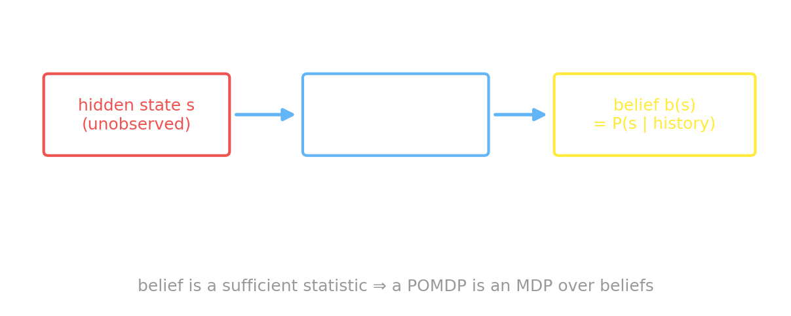{fig-align="center" width="100%"}
:::
::: {.column width="50%"}
::: {.lang-en}
The agent never sees state $s$, only an **observation** $o$. It keeps a **belief** $b(s)=P(s\mid\text{history})$, updated by **Bayes** after each $(a,o)$.

*Don't let the new symbol fool you:* $b(s)$ is **nothing exotic** — it's the same Bayesian posterior we've worked with all term, just over the *hidden* state. We write $b$ because it's the field's standard, and because it's the **one probability a POMDP agent must track**.

The belief is a **sufficient statistic** → a POMDP is just an **MDP over beliefs**.
:::
::: {.lang-ja}
エージェントは状態 $s$ を見ず、**観測** $o$ のみを得る。**信念** $b(s)=P(s\mid\text{履歴})$ を保持し、各 $(a,o)$ の後に**ベイズ**で更新する。

*新しい記号に惑わされないで：* $b(s)$ は**特別なものではない** — 今学期ずっと扱ってきたのと同じベイズ事後分布で、ただ*隠れた*状態についてのものだ。$b$ と書くのは分野の標準であり、**POMDPエージェントが追うべき唯一の確率**だからにすぎない。

信念は**十分統計量** → POMDPは**信念上のMDP**に他ならない。
:::
:::
::::

::: {.notes}
The formalism, kept conceptual. The agent never sees state s, only an observation o; it keeps a belief b(s) = P(s | history), updated by Bayes after each (a, o). The key reassurance — say it explicitly to preempt panic at the new symbol: b(s) is NOTHING exotic, it's the same Bayesian posterior we've used all term, just over the hidden state. We write b because it's the field's standard and because it's the ONE probability a POMDP agent must track. Then the big structural payoff: the belief is a sufficient statistic for history, so a POMDP is just an MDP over beliefs — planning in a POMDP = solving an MDP on the belief simplex. That sentence sets up the Tiger problem and the alpha-vector picture coming next.
:::

## [The Tiger problem]{.lang-en}[トラ問題]{.lang-ja}

::: {.lang-en}
Two doors; a tiger behind one. **Listen** (cost −1) — the growl is right only **85%** of the time. Open the wrong door: **−100**; the **correct** door: **+10**. Your belief slides by Bayes:
:::
::: {.lang-ja}
二つの扉、片方の奥にトラ。**聞く**（コスト−1）— うなり声が正しいのは**85%**だけ。間違った扉を開けると **−100**、正しいと **+10**。信念はベイズで動く：
:::

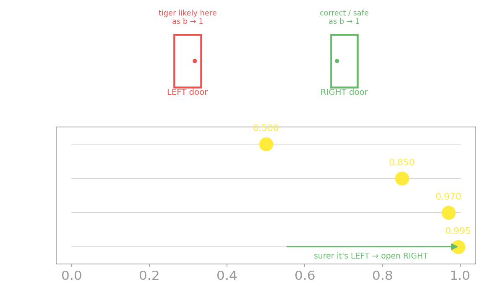{fig-align="center" width="84%"}

::: {.notes}
The canonical 2-state POMDP (Kaelbling, Littman & Cassandra 1998) — small enough to draw the whole belief space as a line, which is its pedagogical gift. Lay out the numbers: two doors, a tiger behind one; Listen costs −1 but the growl is only 85% reliable; opening the wrong door is −100, the correct one +10 (γ = 0.95 canonical — note the R `pomdp` package uses 0.75 if anyone has seen it elsewhere). The belief slides by Bayes: each consistent growl multiplies the odds by 0.85/0.15 ≈ 5.67, so from 0.5 you go 0.5 → 0.85 → 0.9698 → 0.9945; a hear-left then hear-right cancels exactly back to 0.5. Walk the figure top (doors) to bottom (belief). Note: this slide is belief-ONLY (no α-vectors yet — those come two slides later, where they're explained). Tell them: keep listening in the uncertain middle, open once you're sure enough — and crucially, ONE growl (b=0.85) is NOT enough. That sets up Poll 2.
:::

## [In GenJAX — belief update = conditioning]{.lang-en}[GenJAXで — 信念更新 = 条件付け]{.lang-ja}

```python
OBS = jnp.array([[0.85, 0.15],     # tiger-left  -> hear-left .85 / hear-right .15
                 [0.15, 0.85]])    # tiger-right -> ...

@gen
def listen(belief):
    s = categorical(jnp.log(belief)) @ "s"      # the hidden state, drawn from belief
    categorical(jnp.log(OBS[s])) @ "o"          # the growl we actually hear

# b'(s) ∝ P(o | s) b(s): enumerate the 2 states, score with assess, normalize
def update(belief, obs):
    return normalize([exp(listen.assess(cm(s, obs), (belief,))[0]) for s in (0, 1)])
# 0.5 -> 0.85 -> 0.9698 -> 0.9945  as the growls agree
```

::: {.notes}
GenJAX code slide — the belief update IS Bayesian conditioning, nothing more. Point at OBS (the 0.85/0.15 observation matrix), the @gen listen model (draw the hidden state from the current belief, then the growl from OBS), and update() which enumerates the 2 states, scores each with assess, and normalizes — that's exactly b'(s) ∝ P(o|s)·b(s). The comment shows the verified output 0.5 → 0.85 → 0.9698 → 0.9945. Backbone is genjax_tiger_pomdp.py in this directory, verified to run — you can execute it live to reproduce the belief sequence. The teaching point: "the belief update is just conditioning — the same thing we've done all term, now over a genuinely unobserved world state."
:::

## [Track the belief — live]{.lang-en}[信念を追う — ライブ]{.lang-ja} {background-iframe="widgets/pomdp-belief.html" background-interactive="true"}

::: {.notes}
WIDGET B — the Tiger belief tracker. Demo script: start at 0.5/0.5; press Listen → hear-left a couple of times and watch the bars animate 0.5 → 0.85 → 0.97. The key beat: after ONE growl the belief is only 0.85 — point out that's not yet at the open threshold, so one growl isn't enough; a second agreeing growl pushes it past ~0.90 (where opening beats listening). Show the cancellation too: hear-left then hear-right snaps back to 0.5 — a satisfying "evidence cancels" moment. If the widget overlays the α-vector PWLC value lines with the shaded optimal-action region, point out the belief crossing from the "listen" region into the "open" region. This sets up Poll 2 directly — don't reveal the poll answer yet. Fallback PNG: tiger-belief-update.png. ~2 min.
:::

## [Value is a function of belief]{.lang-en}[価値は信念の関数]{.lang-ja} {.smaller}

:::: {.columns .v-center}
::: {.column width="56%"}
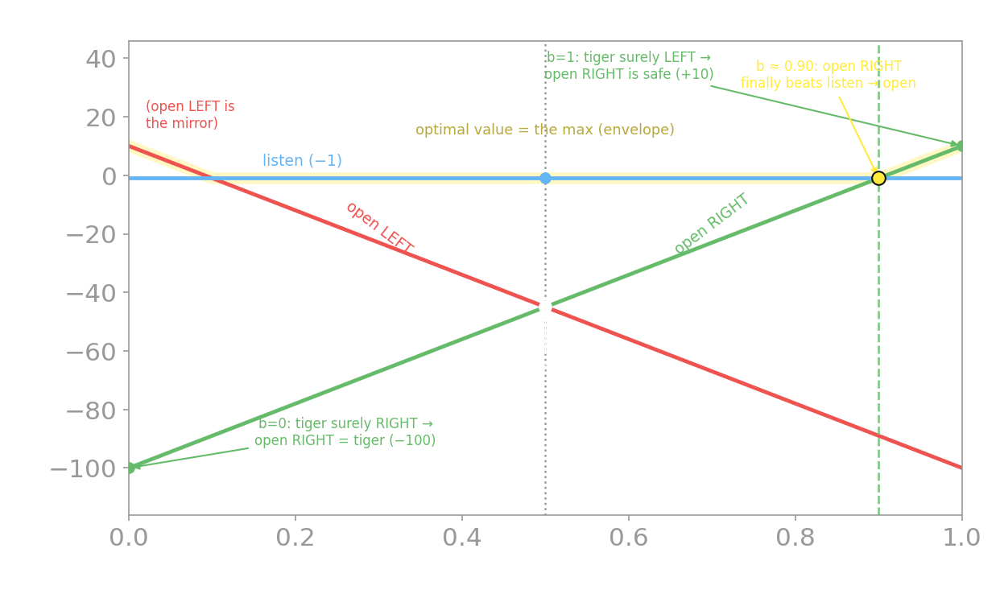{fig-align="center" width="100%"}
:::
::: {.column width="44%"}
::: {.lang-en}
Each action's value is a **weighted average** of its two outcomes → a **straight line** in $b$ (its **alpha-vector**). *Open right* = **+10** if tiger-left (prob $b$), **−100** if right: that's $110b-100$. At $b=0.5$ it's a **−45 gamble** — *listen* ($-1$) wins.

The optimal value is their **upper envelope** (the max). Its breakpoints are the **decision thresholds**: open the correct door once $b$ passes **≈ 0.90** — where open-right's line finally beats *listen* ($-1$).

**Solvers** scale this up: exact $\alpha$-vector VI → offline **QMDP / SARSOP** → online **POMCP / DESPOT**.
:::
::: {.lang-ja}
各行動の価値は二つの結末の**加重平均** → $b$ の**直線**（その**αベクトル**）。*右を開ける* = トラが左（確率 $b$）なら **+10**、右なら **−100**：つまり $110b-100$。$b=0.5$ では **−45 の賭け** — *聞く*（$-1$）が勝つ。

最適価値はその**上側包絡線**（max）。その折れ点が**決定の閾値**：$b$ が **≈ 0.90** を超えたら正しい扉を開ける — open-right の直線が*聞く*（$-1$）を上回る点だ。

**ソルバ**が大規模化：厳密な$\alpha$ベクトル価値反復 → オフライン **QMDP / SARSOP** → オンライン **POMCP / DESPOT**。
:::
:::
::::

[Kochenderfer, Wheeler & Wray, *Algorithms for Decision Making* (MIT Press, 2022) — free at [algorithmsbook.com](https://algorithmsbook.com)]{.cite}

::: {.notes}
The α-vector / piecewise-linear-convex value picture. BUILD IT, don't just show it — this is where students (and you!) get confused. Each line is the EXPECTED reward of committing to one action, which is a weighted average of its two possible outcomes, weighted by the belief: open-right pays +10 if the tiger's on the left (prob b) and −100 if on the right (prob 1−b), so its value is 110b − 100. Walk the endpoints on the figure: at b=1 (tiger surely left) open-right is safe → +10; at b=0 (surely right) open-right is the tiger → −100; the line just connects them, and the value at any belief is the point on that line. Those two endpoint numbers ARE the action's alpha-vector. Hit b=0.5 explicitly (students ask): both open lines sit at −45 there — a coin-flip on a tiger — while listen is −1, so you listen. The optimal value is the upper envelope (the max); its breakpoints are the decision thresholds (open-right takes over at b≈0.90). It's piecewise-linear and convex for a finite horizon. The intuition to deliver: the regions tell you the optimal action — listen in the uncertain middle, open near the edges; the breakpoints are the belief thresholds. This is what makes "the policy is a function of belief" visually obvious. Then the solver taxonomy as a fast name-drop (Kochenderfer's Algorithms for Decision Making, the Stanford AA228 line): exact α-vector VI → offline QMDP/SARSOP → online POMCP/DESPOT. Under time pressure this whole slide drops to a name-drop — protect the Tiger build-up and Poll 2 instead.
:::

## [How the decision unfolds — ① uncertain]{.lang-en}[決定の流れ — ① 不確か]{.lang-ja}

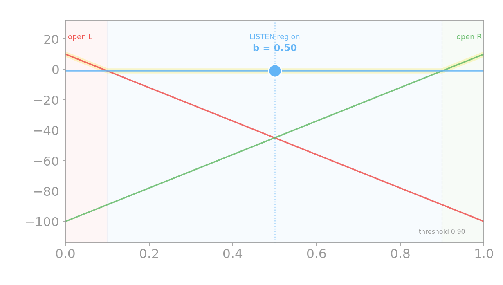{fig-align="center" width="78%"}

::: {.lang-en}
You start at **50/50**. The top line is **listen** ($-1$) — much better than a **−45 gamble**. So you listen, and a growl arrives.
:::
::: {.lang-ja}
**50/50**から始まる。一番上の線は**聞く**（$-1$）— **−45の賭け**よりずっと良い。だから聞く。すると、うなり声が届く。
:::

::: {.notes}
Start the walk. The marker sits on the LISTEN line at b=0.5 — say "right now any door is a −45 coin-flip on a tiger, so the best line overhead is listen." This is the dynamic payoff of the static plot: as observations come in, the marker is going to SLIDE along the x-axis. Click to the next slide as the growl arrives.
:::

## [How the decision unfolds — ② still listening]{.lang-en}[決定の流れ — ② まだ聞く]{.lang-ja}

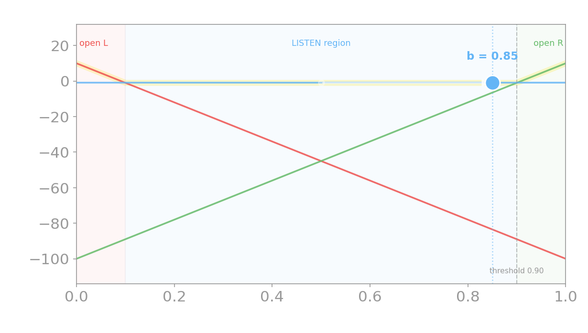{fig-align="center" width="78%"}

::: {.lang-en}
Each growl **slides the belief right**. After one "left" growl, $b=0.85$ — still in the **listen region** (left of 0.90). So you listen again.
:::
::: {.lang-ja}
うなり声ごとに**信念は右へ**動く。一度「左」を聞くと $b=0.85$ — まだ**聞く領域**（0.90の左）。だからもう一度聞く。
:::

::: {.notes}
The belief jumped 0.5 → 0.85 (the faded dot + arrow show it). Key beat: the marker is STILL on the listen line — one growl isn't enough to cross 0.90, so the optimal action is unchanged. This is exactly Poll 2's setup. Click on as the second growl arrives.
:::

## [How the decision unfolds — ③ open!]{.lang-en}[決定の流れ — ③ 開ける！]{.lang-ja}

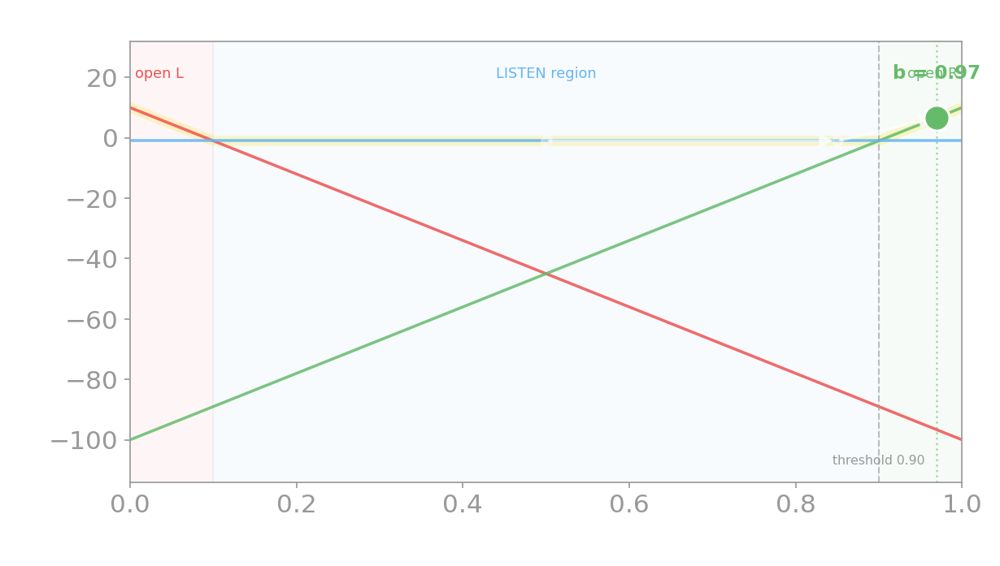{fig-align="center" width="78%"}

::: {.lang-en}
A second agreeing growl → $b=0.97$, **past the 0.90 threshold**. The marker **hops up onto the open-right line** — now opening beats listening. **Open the right door.**
:::
::: {.lang-ja}
二度目の一致するうなり声 → $b=0.97$、**0.90の閾値を越える**。マーカーは**open-rightの線へ飛び移る** — 今や開ける方が良い。**右の扉を開ける。**
:::

::: {.notes}
The payoff frame: the marker hops UP off the listen line onto the green open-right line — that hop IS the decision to act. The whole arc in one sentence: you ride the listen line (gathering cheap evidence) until the belief crosses a threshold where a terminal action's line rises above it, then you commit. That's how a POMDP policy works. The live Tiger widget two slides back lets them drive this themselves. Straight into Poll 2 (which is just this, asked before the reveal).
:::

## [Poll — open, or listen again?]{.lang-en}[ポール — 開ける？もう一度聞く？]{.lang-ja}

::: {.poll-slide}
::: {.lang-en}
You've heard **one** growl from the left. Do you open the right door now, or listen again?
:::
::: {.lang-ja}
左から**一度**うなり声を聞いた。今すぐ右の扉を開ける？もう一度聞く？
:::

::: {.fragment}
::: {.lang-en}
- **A.** Open the right door now
- **B.** Listen again
:::
::: {.lang-ja}
- **A.** 今すぐ右の扉を開ける
- **B.** もう一度聞く
:::
:::
:::

::: {.notes}
POLL 2 (commit before reveal). Source: AUTHORED (Tiger, verified numbers — not from the SP25 quiz). Setup: you've heard ONE growl from the left. Have everyone commit: open the right door now, or listen again? The likely split: many will pick A (open) — the growl feels convincing, 85% sounds high. The misconception this surfaces: confusing the belief (0.85) with the EXPECTED VALUE of acting on it — 0.85 isn't enough because the −100 downside is huge. Hold the reveal; the arithmetic on the next slide is the whole point.
:::

## [Poll — reveal]{.lang-en}[ポール — 解答]{.lang-ja} {.poll-reveal}

[**B — listen again.**]{.lang-en .yellow}[**B — もう一度聞く。**]{.lang-ja .yellow}

::: {.lang-en}
Opening right wins (+10) if the tiger is left, loses (−100) if right: $E[\text{open-right}] = 10\,b + (-100)(1-b) = 110b - 100$. One growl → $b=0.85$ → $E=\mathbf{-6.5}$, *worse* than the −1 of listening. **Two** agreeing growls → $b=0.97$ → $E=\mathbf{+6.7}$ → open.
:::
::: {.lang-ja}
一度のうなり → $b=0.85$、よって $E[\text{右を開ける}] = 110(0.85)-100 = \mathbf{-6.5}$ — 聞く（−1）より*悪い*。**二度**一致 → $b=0.97$、$E = \mathbf{+6.7}$ → 開ける。
:::

::: {.notes}
Reveal: B — listen again. Walk the arithmetic slowly, it's the payoff: opening right wins +10 if the tiger is left and loses −100 if right, so E[open-right] = 10b + (−100)(1−b) = 110b − 100. One growl → b=0.85 → E = −6.5, which is WORSE than the −1 cost of listening. TWO agreeing growls → b≈0.97 → E = +6.7 → now open. Emphasize: the belief was already "85% sure" after one growl, but the asymmetric −100 penalty means you still shouldn't act — information has value. Source: authored, verified in genjax_tiger_pomdp.py. Then send them to break.
:::

## [Break]{.lang-en}[休憩]{.lang-ja} {.section-break background-image="images/CallieJimWeek9.jpg" background-size="cover"}

::: {.notes}
Break — 5 min, clock 1:07. Cat photo. We resume at 1:12 with the teaching block. Good moment to take a question that's been brewing about beliefs/POMDPs before we flip the inversion.
:::

# [Inverse RL — recovering rewards]{.lang-en}[逆強化学習 — 報酬の復元]{.lang-ja} {.section-break background-image="../../sds-reveal/sds_frame.png" background-size="cover"}

::: {.notes}
Section break into the machine side of inverse RL (~14 min, clock 1:12). Transition, post-break: "all morning we inferred discrete goals and beliefs by hand — now the SAME inverse problem at ML scale: recover a whole reward FUNCTION from behavior." Sets up teaching (smart demonstrators shape behavior to be inverted) and the alignment capstone.
:::

## [Where we are]{.lang-en}[ここまでの流れ]{.lang-ja} {.agenda .dense}

- [Run the camera backwards]{.lang-en .done}[カメラを逆回しする]{.lang-ja .done}  [0:00]{.time}
- [Goal inference as inverse planning]{.lang-en .done}[逆プランニングとしての目標推論]{.lang-ja .done}  [0:07]{.time}
- [Theory of Mind = inverse RL]{.lang-en .done}[心の理論 = 逆強化学習]{.lang-ja .done}  [0:37]{.time}
- [POMDPs — inferring beliefs]{.lang-en .done}[POMDP — 信念を推論する]{.lang-ja .done}  [0:45]{.time}
- [Break]{.lang-en .done}[休憩]{.lang-ja .done}  [1:07]{.time}
- [Inverse RL — recovering rewards]{.lang-en .highlight}[逆強化学習 — 報酬の復元]{.lang-ja .highlight}  [1:12]{.time}
- [Teaching, flipped]{.lang-en}[教示の反転]{.lang-ja}  [1:26]{.time}
- [Alignment & LLM Theory of Mind]{.lang-en}[アラインメントとLLMの心の理論]{.lang-ja}  [1:38]{.time}
- [Close & Week 10]{.lang-en}[まとめと第10週]{.lang-ja}  [1:52]{.time}

::: {.notes}
Recap, post-break (~1:12). Belief inference is done; now scale the inversion up — how machines recover a reward from behavior (MaxEnt → GAIL → AIRL) — then flip it (teaching), then the alignment capstone.
:::

## [IRL methods = learning the reward]{.lang-en}[逆強化学習の手法 = 報酬を学ぶ]{.lang-ja} {.smaller}

::: {.lang-en}
"IRL methods" all do one thing: **recover the reward function** behind observed behavior. The catch — it's **underconstrained**: many rewards explain the same actions. So each method adds an assumption to pin one down.
:::
::: {.lang-ja}
「逆強化学習の手法」がすることは一つ：観察された行動の背後にある**報酬関数を復元**する。問題は**劣決定**：同じ行動に多くの報酬が当てはまる。だから各手法は一つに絞るための仮定を加える。
:::

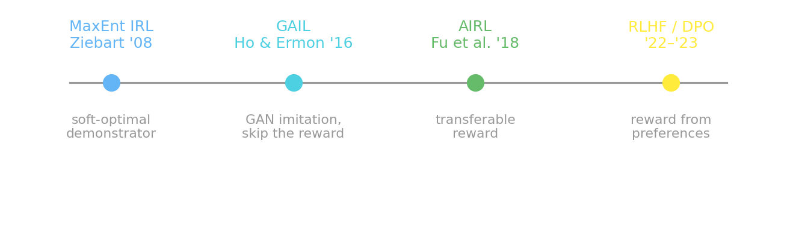{fig-align="center" width="64%"}

::: {.lang-en}
**MaxEnt IRL** (Ziebart 2008) — among all rewards consistent with the data, pick the one that keeps **maximum uncertainty** (highest entropy): $P(\tau)\propto e^{\text{reward}}$, a soft-optimal demonstrator (the *same* softmax as Block 2). **Why a milestone:** a principled fix for the ill-posedness — commit no more than the data forces → *one* well-defined reward by max-likelihood, and the bridge from IRL to soft-RL and RLHF.
:::
::: {.lang-ja}
**最大エントロピー逆強化学習**（Ziebart 2008）— データに整合する報酬の中で、**最大の不確実性**（最大エントロピー）を残すものを選ぶ：$P(\tau)\propto e^{\text{報酬}}$、ソフト最適な実演者（Block 2と*同じ*ソフトマックス）。**画期点：** 劣決定への原理的な解決 — データが強いる以上にコミットしない → *一つの*明確な報酬を最尤で得る。IRLからソフトRL・RLHFへの橋渡し。
:::

::: {.notes}
Frame it first: every "IRL method" learns the REWARD from behavior, and the core difficulty is that IRL is UNDERCONSTRAINED — many rewards explain the same demonstrations, so a method has to add an assumption to choose one. MaxEnt IRL (Ziebart 2008) is the foundational one: it invokes the maximum-entropy principle — among all reward-consistent trajectory distributions, pick the LEAST-committal (highest-entropy) one, P(τ) ∝ e^reward. Say WHY that's the right move: the data underdetermines the reward, so you should hold onto as much uncertainty as the data allows rather than smuggling in extra assumptions — max entropy is exactly "commit no more than you must." That gives a single, globally-normalized, well-defined reward fit by maximum likelihood, and crucially it's the SAME softmax we used as the inverse-planning likelihood in Block 2 — the seam joining cog-sci ToM to machine IRL, and the launch point for deep IRL and RLHF. Next slide: GAIL, AIRL, RLHF.
:::

## [...from imitation to transferable rewards to alignment]{.lang-en}[…模倣 → 転移可能な報酬 → アラインメント]{.lang-ja} {.smaller}

::: {.lang-en}
- **GAIL** (Ho & Ermon 2016) — imitation as a **GAN**: a discriminator tells expert from learner, and the policy learns to fool it (matching the expert's behavior). **Milestone:** imitation that **scales** to deep, high-dim control — but it *skips* recovering a reward, so there's no transferable objective.
- **AIRL** (Fu et al. 2018) — adversarial like GAIL, but the discriminator is **structured so a reward falls out**, disentangled from the dynamics. **Milestone:** combines GAIL's scale with a **transferable** reward you can re-optimize under *new* dynamics.
- **RLHF / DPO** ('22–'23) — learn the reward from human **preferences** (pairwise comparisons), not demonstrations; then optimize the policy (DPO folds the reward *into* the policy). **Milestone:** this is how **LLMs are aligned** — preference-based IRL at frontier scale.
:::
::: {.lang-ja}
- **GAIL**（Ho & Ermon 2016）— **GAN**としての模倣：識別器が専門家と学習者を見分け、方策はそれを騙すよう学ぶ（専門家の行動に一致）。**画期点：** 深く高次元の制御へ**スケール**する模倣 — ただし報酬は復元せず、転移可能な目的関数はない。
- **AIRL**（Fu et al. 2018）— GAILと同じ敵対的だが、識別器を**報酬が取り出せるよう構造化**し、ダイナミクスから分離。**画期点：** GAILのスケールと、*新しい*ダイナミクスで再最適化できる**転移可能**な報酬を両立。
- **RLHF / DPO**（'22–'23）— デモではなく人間の**選好**（対比較）から報酬を学び、方策を最適化（DPOは報酬を方策に*畳み込む*）。**画期点：** **LLMのアラインメント**そのもの — 大規模な選好ベースのIRL。
:::

::: {.notes}
The honesty note to repeat (callback to Block 2's ill-posedness): a recovered reward is ONE explanation among many — MaxEnt's entropy prior and AIRL's disentanglement are regularizers that pick A reward, not THE reward. GAIL (Ho & Ermon 2016): imitation as a GAN — a discriminator separates expert vs learner state-action pairs, the policy is trained to match the expert's occupancy; it scales to high-dim control but never returns a usable/transferable reward. AIRL (Fu, Luo & Levine 2018): keeps the adversarial setup but structures the discriminator so a reward function falls out, plus a disentanglement trick (state-only reward + shaping) so the reward transfers across changed dynamics. RLHF/DPO: preference-based IRL — fit a reward model to pairwise human preferences (Bradley-Terry), freeze it, optimize with PPO; DPO collapses the two stages via an implicit reward. This is the practical payoff of the whole IRL program and the bridge to the alignment thread (Weeks 11-13). Then run Widget D (reward recovery).
:::

## [Recover a reward — live]{.lang-en}[報酬を復元 — ライブ]{.lang-ja} {background-iframe="widgets/reward-recovery.html" background-interactive="true"}

::: {.notes}
WIDGET D — reward recovery, now fully CONFIGURABLE. Demo script: the true-reward panel (right) starts with a single +1 goal. CLICK any cell on that RIGHT grid to cycle its reward +1 → 0 → −1 — set up a goal plus a −1 "hazard" or two on the way to it. Then add demonstrations: the agent value-iterates on whatever reward you painted, so it SEEKS the +1 and ROUTES AROUND the −1 (watch the paths bend). The recovered panel (middle) shows the MaxEnt-style estimate — reward ∝ where the agent is drawn (green) vs. where it avoids (red), measured against a random walker so the start doesn't dominate. Two beats to land: (1) it recovers the structure — green at the +1 goal, red at the −1 hazard; (2) IRL is ILL-POSED — a cell merely ON THE WAY to the goal also lights up green, and it can't cleanly tell a neutral cell from one the agent just avoided. Method note (a student asked): this is MaxEnt-IRL feature-matching (match the demonstrator's state visitation); the repo's GenJAX backbones do the principled Bayesian-inversion version — genjax_goal_inference.py inverts the MDP for a posterior over goals, genjax_reward_from_prefs.py recovers a reward from preferences — the widget is vanilla JS so it runs live in the browser. Fallback PNG: reward-recovery-heatmap.png. ~2-3 min.
:::

# [Teaching = inverse planning, flipped]{.lang-en}[教示 = 逆プランニングの反転]{.lang-ja} {.section-break background-image="../../sds-reveal/sds_frame.png" background-size="cover"}

::: {.notes}
Section break into teaching, new to this lecture (~12 min, clock 1:26). Transition: "we just watched machines recover a reward from demonstrations — now FLIP it: if you KNOW you'll be inverted, you choose actions that make your goal obvious. That's teaching."
:::

## [Where we are]{.lang-en}[ここまでの流れ]{.lang-ja} {.agenda .dense}

- [Run the camera backwards]{.lang-en .done}[カメラを逆回しする]{.lang-ja .done}  [0:00]{.time}
- [Goal inference as inverse planning]{.lang-en .done}[逆プランニングとしての目標推論]{.lang-ja .done}  [0:07]{.time}
- [Theory of Mind = inverse RL]{.lang-en .done}[心の理論 = 逆強化学習]{.lang-ja .done}  [0:37]{.time}
- [POMDPs — inferring beliefs]{.lang-en .done}[POMDP — 信念を推論する]{.lang-ja .done}  [0:45]{.time}
- [Break]{.lang-en .done}[休憩]{.lang-ja .done}  [1:07]{.time}
- [Inverse RL — recovering rewards]{.lang-en .done}[逆強化学習 — 報酬の復元]{.lang-ja .done}  [1:12]{.time}
- [Teaching, flipped]{.lang-en .highlight}[教示の反転]{.lang-ja .highlight}  [1:26]{.time}
- [Alignment & LLM Theory of Mind]{.lang-en}[アラインメントとLLMの心の理論]{.lang-ja}  [1:38]{.time}
- [Close & Week 10]{.lang-en}[まとめと第10週]{.lang-ja}  [1:52]{.time}

::: {.notes}
Recap (~1:26). Recovering rewards is done; now the flip — teaching by demonstration (showing-vs-doing, legibility, CIRL) — then the alignment capstone. One sentence, keep moving.
:::

## [Flip the inversion]{.lang-en}[反転を反転する]{.lang-ja}

::: {.lang-en}
If an observer infers your goal from your actions, you can **choose** actions that make your goal **obvious**. That's **teaching** — and it's inverse planning run the other way.

The forward planner asks *"what should I do to reach my goal?"* The teacher asks *"what should I do so you can tell what my goal is?"* — same machinery, one more level of recursion.
:::
::: {.lang-ja}
観察者があなたの行動から目標を推論するなら、あなたは目標を**明白にする**行動を**選べる**。それが**教示**であり、逆プランニングを逆向きに走らせたものだ。

順方向のプランナーは*「目標に到達するには何をすべきか？」*を問う。教師は*「私の目標が分かるように何をすべきか？」*を問う — 同じ仕組み、もう一段の再帰だ。
:::

::: {.notes}
The conceptual flip — state it cleanly. If an observer infers your goal from your actions, you can CHOOSE actions that make your goal obvious. That's teaching, and it's inverse planning run the other direction. The contrast to nail: the forward planner asks "what should I do to reach my goal?"; the teacher asks "what should I do so you can TELL what my goal is?" — same machinery, one more level of recursion. Keep it to this one idea; the examples (showing-vs-doing, Dragan legibility, CIRL) make it concrete on the next slides.
:::

## [Showing vs. doing]{.lang-en}[見せる vs する]{.lang-ja}

:::: {.columns}
::: {.column width="55%"}
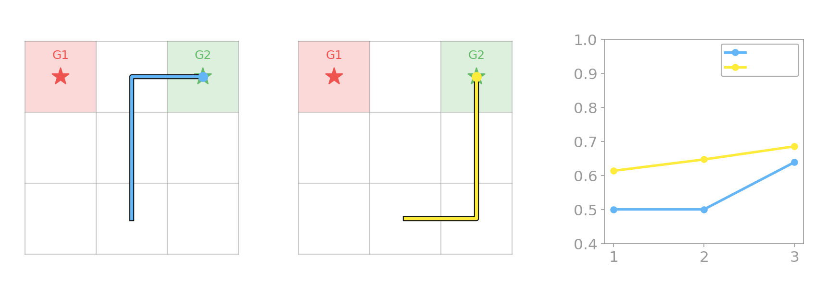{fig-align="center" width="100%"}
:::
::: {.column width="45%"}
::: {.lang-en}
People **doing** a task and people **showing** it move differently — demonstrators deviate from the efficient path to make the goal **unambiguous** (Ho, Littman, MacGlashan, Cushman & Austerweil 2016).

Both paths here are optimal-length, but the legible one commits **on the first move**.
:::
::: {.lang-ja}
タスクを**する**人と**見せる**人は動きが違う — 実演者は効率的な経路から外れ、目標を**曖昧でなく**する（Ho, Littman, MacGlashan, Cushman & Austerweil 2016）。

ここの両経路は最適長だが、読み取りやすい方は**最初の一手**で意図を示す。
:::
:::
::::

::: {.notes}
This is the instructor's own work — Ho, Littman, MacGlashan, Cushman & Austerweil 2016, "Showing versus doing." The empirical result: people DOING a task and people SHOWING it move differently — demonstrators deliberately deviate from the efficient path to make the goal UNAMBIGUOUS. Point at the figure: both paths here are optimal-LENGTH, but the legible (showing) one commits on the first move so the observer's posterior jumps immediately. The Bayesian model: the teacher picks the demonstration that maximizes the observer's posterior on the correct reward. You can mention you're the author if it helps engagement. Then run the widget.
:::

## [Toggle legible vs. efficient — live]{.lang-en}[読み取りやすさを切り替え — ライブ]{.lang-ja} {background-iframe="widgets/showing-vs-doing.html" background-interactive="true"}

::: {.notes}
WIDGET C — showing-vs-doing legibility toggle. Demo script: with two candidate goals and a shared start, first run the EFFICIENT (doing) path and watch the observer's P(goal) bar stay near 50/50 until late — the path is ambiguous early. Then toggle to LEGIBLE (showing) and re-run: the observer's posterior commits EARLIER, jumping toward the true goal on the first move. The verified number to call out: legible 0.613 vs efficient 0.500 at step 1 — and both paths are optimal-length. That number is also the Poll 4 reveal, so plant it. Backbone: genjax_legible_teaching.py (verified). Fallback PNGs: legible-vs-efficient.png / showing-vs-doing-grid.png. ~2 min.
:::

## [Legibility vs. predictability]{.lang-en}[読み取りやすさ vs 予測可能性]{.lang-ja}

:::: {.columns}
::: {.column width="50%"}
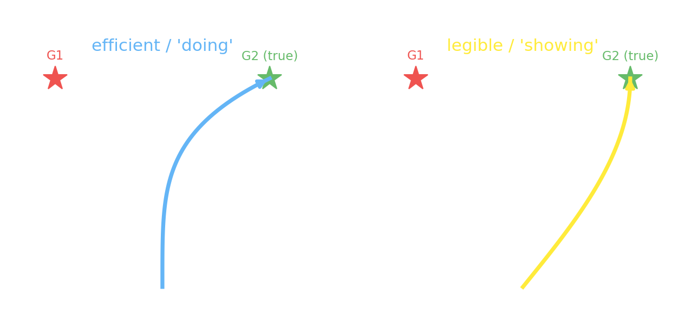{fig-align="center" width="100%"}
:::
::: {.column width="50%"}
::: {.lang-en}
Dragan, Lee & Srinivasa (2013): the **efficient** reach is ambiguous until the end; the **legible** reach veers toward the goal early. Two inferences in opposite directions — goal→trajectory vs trajectory→goal.

Reward can be a **signal**, not just a reinforcer (Ho et al. 2015 — the GardenPath paper).
:::
::: {.lang-ja}
Dragan, Lee & Srinivasa (2013)：**効率的**な到達は最後まで曖昧、**読み取りやすい**到達は早めに目標へ寄る。逆方向の二つの推論 — 目標→軌跡 と 軌跡→目標。

報酬は強化子だけでなく**信号**にもなり得る（Ho et al. 2015 — GardenPathの論文）。
:::
:::
::::

::: {.notes}
Dragan, Lee & Srinivasa 2013 — the canonical robot reach-to-one-of-two-objects figure. The distinction to draw: the EFFICIENT/predictable reach hugs the ambiguous midline and resolves the goal only at the end; the LEGIBLE reach veers conspicuously toward the true goal EARLY (it's longer, but the observer infers the goal sooner). Formalize it as two inferences in OPPOSITE directions: predictability = P(trajectory | goal) (goal→traj), legibility scored by the observer's P(goal | trajectory-so-far) weighted to early timesteps (traj→goal) — the same axis as ToM. Tie back to the course: reward can be a SIGNAL, not just a reinforcer (Ho et al. 2015 — and that's the GardenPath paper the RL assignment comes from, so the Week-8 feedback loop was the "communication" reading of reward). Under time pressure Dragan drops to a name-drop.
:::

## [Alignment as a teaching game]{.lang-en}[教示ゲームとしてのアラインメント]{.lang-ja}

::: {.lang-en}
- **Cooperative IRL** (Hadfield-Menell et al. 2016): human + robot, both rewarded by the *human's* reward — but only the human knows it.
- **Efficient expert demonstration is provably suboptimal** — you should *deviate* to teach.
- It **reduces to a POMDP** whose hidden state is the human's reward.
- *The unifying frame: every beat today is a POMDP over which-MDP-we're-in.*
:::
::: {.lang-ja}
- **協調的逆強化学習**（Hadfield-Menell et al. 2016）：人間とロボットが共に*人間の*報酬で報われるが、報酬を知るのは人間だけ。
- **効率的な専門家の実演は証明可能に最適でない** — 教えるには*あえて外れる*べき。
- それは人間の報酬を隠れ状態とする**POMDPに帰着**する。
- *統一的な枠組み：今日の全ては「どのMDPにいるか」上のPOMDPだ。*
:::

::: {.notes}
Cooperative IRL / assistance games (Hadfield-Menell, Russell, Abbeel & Dragan 2016). The setup: human + robot, both rewarded by the HUMAN's reward, but only the human knows it. Two results to land. First, the theorem: efficient expert demonstration is provably SUBOPTIMAL — you should DEVIATE from efficient behavior to teach (formally br(br(π_E)) ≠ π_E). Second, the unifying punchline of the whole day: CIRL reduces to a POMDP whose hidden state is the human's reward — so every beat today (goal inference, belief inference, teaching) is a POMDP over "which MDP are we in?" Say that explicitly; it closes the frame you opened in Block 2. This also seeds the alignment thread for Weeks 11-13. Then run Poll 4.
:::

## [Poll — show the exit]{.lang-en}[ポール — 出口を示す]{.lang-ja}

::: {.poll-slide}
::: {.lang-en}
You want to show a friend which of two exits to take. Do you walk the **shortest** path, or **exaggerate** toward it?
:::
::: {.lang-ja}
友達に二つの出口のどちらを使うか示したい。**最短**経路を歩く？それとも**誇張して**そちらへ寄る？
:::

::: {.fragment}
::: {.lang-en}
- **A.** Walk the shortest, most efficient path
- **B.** Exaggerate toward the exit
:::
::: {.lang-ja}
- **A.** 最短で最も効率的な経路を歩く
- **B.** 出口に向かって誇張する
:::
:::
:::

::: {.notes}
POLL 4 (commit before reveal). Source: AUTHORED (legibility / Widget C — not from the SP25 quiz). Setup: you want to show a friend which of two exits to take — walk the shortest, most efficient path, or exaggerate toward it? Have everyone commit. The likely split: a real divide — efficiency feels "correct," but the showing-vs-doing widget they just saw argues for exaggeration. The misconception this surfaces: that the best demonstration is the most efficient ACTION, when the goal is COMMUNICATION, not task completion. Hold the reveal.
:::

## [Poll — reveal]{.lang-en}[ポール — 解答]{.lang-ja} {.poll-reveal}

[**B — exaggerate (be legible).**]{.lang-en .yellow}[**B — 誇張する（読み取りやすく）。**]{.lang-ja .yellow}

::: {.lang-en}
The efficient path is ambiguous early; the legible path makes the observer's posterior commit sooner — exactly what the widget showed (61% vs 50% on the first move).
:::
::: {.lang-ja}
効率的な経路は早期には曖昧。読み取りやすい経路は観察者の事後分布を早く確定させる — ウィジェットが示した通り（最初の一手で61% vs 50%）。
:::

::: {.notes}
Reveal: B — exaggerate (be legible). One-line justification: the efficient path is ambiguous early; the legible path makes the observer's posterior commit sooner — exactly what the widget showed, 61% vs 50% on the first move. Source: authored (legibility / Widget C). Connect it forward: this "communicate the objective, don't just complete the task" idea is the seed of the alignment block coming up.
:::

# [Alignment & LLM Theory of Mind]{.lang-en}[アラインメントとLLMの心の理論]{.lang-ja} {.section-break background-image="../../sds-reveal/sds_frame.png" background-size="cover"}

::: {.notes}
Section break into the contemporary capstone (~14 min, clock 1:38). Transition: "the same inverse problem at frontier scale — machine theory of mind, RLHF as preference-based IRL, and the contested question of whether LLMs have a theory of mind." This block is the modern payoff; seeds Weeks 11-13.
:::

## [Where we are]{.lang-en}[ここまでの流れ]{.lang-ja} {.agenda .dense}

- [Run the camera backwards]{.lang-en .done}[カメラを逆回しする]{.lang-ja .done}  [0:00]{.time}
- [Goal inference as inverse planning]{.lang-en .done}[逆プランニングとしての目標推論]{.lang-ja .done}  [0:07]{.time}
- [Theory of Mind = inverse RL]{.lang-en .done}[心の理論 = 逆強化学習]{.lang-ja .done}  [0:37]{.time}
- [POMDPs — inferring beliefs]{.lang-en .done}[POMDP — 信念を推論する]{.lang-ja .done}  [0:45]{.time}
- [Break]{.lang-en .done}[休憩]{.lang-ja .done}  [1:07]{.time}
- [Inverse RL — recovering rewards]{.lang-en .done}[逆強化学習 — 報酬の復元]{.lang-ja .done}  [1:12]{.time}
- [Teaching, flipped]{.lang-en .done}[教示の反転]{.lang-ja .done}  [1:26]{.time}
- [Alignment & LLM Theory of Mind]{.lang-en .highlight}[アラインメントとLLMの心の理論]{.lang-ja .highlight}  [1:38]{.time}
- [Close & Week 10]{.lang-en}[まとめと第10週]{.lang-ja}  [1:52]{.time}

::: {.notes}
Recap (~1:38). Teaching is done; the capstone scales the inverse problem to frontier ML — machine ToM (ToMnet), RLHF/DPO as preference-based IRL, and the LLM-ToM debate. Compresses first if behind: keep the RLHF slides + the LLM-ToM bottom line + Poll 3.
:::

## [Two ways to read a mind]{.lang-en}[心を読む二つの方法]{.lang-ja}

:::: {.columns}
::: {.column width="50%"}
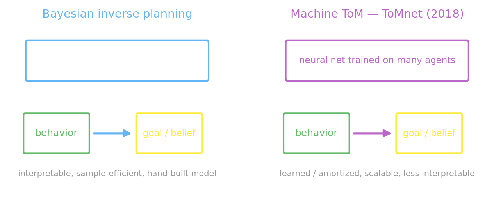{fig-align="center" width="100%"}
:::
::: {.column width="50%"}
::: {.lang-en}
**ToMnet** (Rabinowitz et al. 2018) — a neural net watches many agents and **learns** to predict their behavior and false beliefs. The **amortized** cousin (learned in one forward pass) of Baker's explicit **Bayesian** inversion: same inverse problem, learned vs. hand-built.
:::
::: {.lang-ja}
**ToMnet**（Rabinowitz et al. 2018）— ニューラルネットが多数のエージェントを観察し、行動や誤信念の予測を**学習**する。Bakerの明示的な**ベイズ**反転の**償却版**：同じ逆問題、学習 vs 手作り。
:::
:::
::::

::: {.notes}
Machine Theory of Mind — ToMnet (Rabinowitz et al. 2018, DeepMind). A meta-learned "observer" network watches many agents and LEARNS to predict their behavior and even false beliefs from behavior alone (it passes a Sally-Anne-style false-belief test in gridworlds). The contrast to draw — this is the slide's whole point: ToMnet is the AMORTIZED/learned cousin of Baker's explicit BAYESIAN inversion. Same inverse problem, two ways to solve it — a neural net learns the mapping in one forward pass vs. explicitly inverting a hand-specified planner. Flag that this amortized-vs-Bayesian axis is exactly the mechanism question we'll hit with LLMs in two slides. Keep it to ~3 min.
:::

## [RLHF & DPO — a reward from preferences]{.lang-en}[RLHFとDPO — 選好から報酬を]{.lang-ja}

::: {.lang-en}
- **RLHF** (RL from Human Feedback): don't hand-write a reward — show people **pairs** of outputs, record **which they prefer**, fit a **reward model** to the preferences, then RL the policy against it.
- **DPO** (Direct Preference Optimization): skip the separate reward model — optimize the policy **directly** on the preferences (the reward is *implicit* in the policy).
- The choice model is **Bradley–Terry**: $P(A \succ B) = \sigma(r_A - r_B)$. Fitting $r$ from human **choices** is exactly **preference-based inverse RL**.
:::
::: {.lang-ja}
- **RLHF**（人間のフィードバックによる強化学習）：報酬を手書きせず — 出力の**ペア**を人に見せ、**どちらを好むか**を記録し、選好に**報酬モデル**を当てはめ、それに対して方策をRLする。
- **DPO**（直接選好最適化）：別個の報酬モデルを省き、選好から**直接**方策を最適化（報酬は方策に*暗黙的*）。
- 選択モデルは**ブラッドリー–テリー**：$P(A \succ B) = \sigma(r_A - r_B)$。人間の**選択**から $r$ を当てはめるのが、まさに**選好ベースの逆強化学習**。
:::

::: {.notes}
Explain BEFORE the code (per the lecture rule). RLHF = Reinforcement Learning from Human Feedback: rather than hand-specifying a reward, collect PAIRWISE human preferences between model outputs, fit a reward model to them, freeze it, and optimize the policy with PPO. DPO = Direct Preference Optimization: the optimal RLHF policy implies an implicit reward, so you optimize the policy directly on preferences without training a separate reward model — the reward lives inside the policy. The choice model under both is Bradley-Terry: P(A≻B) = sigmoid(r_A − r_B). Key framing: fitting r from human choices is preference-based inverse RL — recover the objective from behavior. Next slide runs it in GenJAX. (Callback: reward hacking = Week-8's positive cycle at frontier scale.)
:::

## [...recovering that reward in GenJAX]{.lang-en}[…その報酬をGenJAXで復元]{.lang-ja}

```python
@gen
def prefs(pairs):                                    # the Bradley-Terry reward model
    r = jnp.array([normal(0., 2.) @ f"r_{k}" for k in range(K)])   # latent rewards
    for n, (i, j) in enumerate(pairs):
        flip(sigmoid(r[i] - r[j])) @ f"pref_{n}"                   # i ≻ j ?
```

::: {.lang-en}
**Sampled data** — 90 preferences from a hidden quality (A=+2, B=+0.5, C=−1):
`A≻B,  A≻C,  B≻C,  A≻B,  C≻B,  A≻C, …`
**Inference** — condition on them, recover the reward: **A=+1.36, B=0.00, C=−1.36 → A > B > C ✓** (only up to an additive constant — IRL's ill-posedness).
:::
::: {.lang-ja}
**サンプルデータ** — 隠れた品質（A=+2, B=+0.5, C=−1）から90件の選好：
`A≻B,  A≻C,  B≻C,  A≻B,  C≻B,  A≻C, …`
**推論** — それで条件付けて報酬を復元：**A=+1.36, B=0.00, C=−1.36 → A > B > C ✓**（定数分だけ不定 — IRLの劣決定性）。
:::

::: {.notes}
Backbone genjax_reward_from_prefs.py (verified to run). Walk the code: latent reward r per item with a normal prior; each observed pairwise preference is a flip with probability sigmoid(r_i − r_j) — that IS the Bradley-Terry / RLHF reward-model likelihood. Then sampling-importance-resampling recovers the posterior-mean reward. The example: from a TRUE reward A=2, B=0.5, C=−1, sample 90 preferences (mostly A≻B, A≻C, B≻C with occasional flips), condition, and recover A:+1.36 / B:0 / C:−1.36 — correct ranking, identifiable only up to an additive constant (a shift cancels in every sigmoid(r_i − r_j)) — that constant ambiguity IS IRL's ill-posedness again. This is the reward-modeling step of RLHF, in miniature. Then the LLM-ToM debate.
:::

## [Do LLMs have a Theory of Mind?]{.lang-en}[LLMは心の理論を持つか？]{.lang-ja}

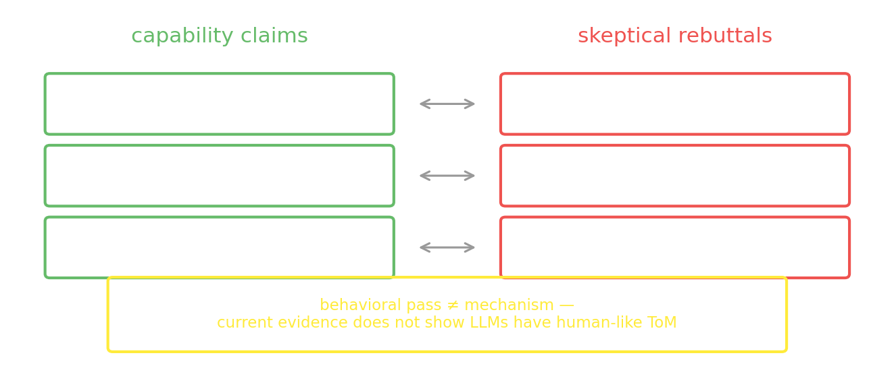{fig-align="center" width="86%"}

::: {.notes}
The contested capstone — present it as a LIVE debate (claim → rebuttal), not a settled answer. Walk the figure's two poles. Pro-capability: Kosinski 2024 (GPT-4 solved ~75% of false-belief tasks — 6-year-old level — and "may have spontaneously emerged"; note the hedge, don't strawman it as "GPT has ToM"); Strachan 2024 (at/above human on false belief, irony, hinting across 1,907 humans); Street 2024 (adult-level higher-order recursive ToM). Skeptical: Ullman 2023, Pang 2025. Set it up here; the next slide lands the skeptical verdict. ~6 min for the whole LLM segment.
:::

## [The honest answer: contested]{.lang-en}[正直な答え：論争中]{.lang-ja}

::: {.lang-en}
- **Pass** — many false-belief, irony, and hinting vignettes, at adult level.
- **Fail** — minimal, *belief-preserving* perturbations flip success to failure (Ullman 2023): make the container *transparent* so the agent can see in, yet the model still reports the false belief.
- **Confounds** — also stumble on faux pas; the wins may be response bias or training-data contamination (Pang 2025).
- **A behavioral pass is not the mechanism.**
:::
::: {.lang-ja}
- **通過** — 誤信念・皮肉・ほのめかしの多くを、成人並みに。
- **失敗** — 信念構造を保つ些細な改変で成功が失敗に（Ullman 2023）：容器を*透明*にして主体が中を見えるようにしても、モデルは依然として誤信念を報告する。
- **交絡** — 失言課題でもつまずく；勝利は応答バイアスや学習データ汚染かもしれない（Pang 2025）。
- **行動上の通過は機構ではない。**
:::

[**Defensible 2026 position:** current evidence does not show LLMs have human-like Theory of Mind.]{.lang-en .yellow}[**2026年の妥当な立場：** 現状の証拠はLLMが人間並みの心の理論を持つことを示さない。]{.lang-ja .yellow}

::: {.notes}
The skeptical landing (instructor's lean is skeptical — present the wins, then dismantle them). The dismantling: Ullman 2023 — trivial, belief-PRESERVING perturbations flip success to failure (make the container transparent so the agent can SEE in, and the model STILL says it holds the false belief). The Strachan faux-pas result — apparent wins are response bias / hyperconservatism, not inference. Pang 2025 — Morgan's Canon: attributing ToM is premature until memorized-template / training-data contamination is ruled out, which currently it can't be. The through-line, repeat it: a behavioral pass is NOT the mechanism. The defensible 2026 position: current evidence does NOT show LLMs have human-like Theory of Mind — impressive ToM-shaped pattern-matching, not demonstrated mental-state representation. Then run Poll 3.
:::

## [Poll — does GPT-4 have ToM?]{.lang-en}[ポール — GPT-4は心の理論を持つ？]{.lang-ja}

::: {.poll-slide}
::: {.lang-en}
GPT-4 passes ~75% of false-belief vignettes — a 6-year-old's level. Does it **have** a theory of mind?
:::
::: {.lang-ja}
GPT-4は誤信念課題の約75%を通過 — 6歳児の水準。それは心の理論を**持つ**のか？
:::

::: {.fragment}
::: {.lang-en}
- **A.** Yes — it passes the tests
- **B.** No — passing tests isn't having the mechanism
- **C.** We can't tell yet
:::
::: {.lang-ja}
- **A.** はい — テストに通る
- **B.** いいえ — テスト通過は機構を持つことではない
- **C.** まだ判断できない
:::
:::
:::

::: {.notes}
POLL 3 (commit before DISCUSS — this one is meant to open a discussion, not just a quick reveal). Source: adapts SP25 IRL quiz Q1 (the ToM functionalism question), modernized to the LLM debate. Setup: GPT-4 passes ~75% of false-belief vignettes (6-year-old level) — does it HAVE a theory of mind? Have everyone commit to A/B/C. The likely split: a genuine three-way divide — this is the point, it's a live debate. The misconception this surfaces: functionalism — equating "passes the behavioral test" with "has the underlying capacity/mechanism." Let it run as a short discussion before revealing.
:::

## [Poll — reveal]{.lang-en}[ポール — 解答]{.lang-ja} {.poll-reveal}

[**B / C — behavioral pass ≠ mechanism.**]{.lang-en .yellow}[**B / C — 行動上の通過 ≠ 機構。**]{.lang-ja .yellow}

::: {.lang-en}
This is the recurring epistemics question of the course — "fits the judgments" and "this is the computation it runs" are different claims. The honest read of the current evidence is skeptical.
:::
::: {.lang-ja}
これは本講義で繰り返す認識論の問い — 「判断に合う」と「これがその計算だ」は別の主張。現状の証拠の正直な読みは懐疑的だ。
:::

::: {.notes}
Reveal: B / C — behavioral pass ≠ mechanism. The one-line justification: "fits the judgments" and "this is the computation it runs" are DIFFERENT claims — that's the recurring epistemics question of the whole course (it goes back to the model-fit-vs-mechanism distinction from earlier weeks). The honest read of the current evidence is skeptical. Source: SP25 IRL quiz Q1 (ToM functionalism), modernized. This is the intellectual high point of the back half — let it breathe before closing.
:::

# [Where we landed]{.lang-en}[到達点]{.lang-ja} {.section-break background-image="../../sds-reveal/sds_frame.png" background-size="cover"}

::: {.notes}
Section break into the close (~5 min, clock 1:52). Transition: "one inversion, applied five times — let's name what we did."
:::

## [One inversion, six times]{.lang-en}[一つの反転を六度]{.lang-ja} {.agenda .agenda-roomy}

- [**Goal** inference — invert the MDP]{.lang-en .done}[**目標**推論 — MDPを反転]{.lang-ja .done}
- [Theory of Mind = inverse RL]{.lang-en .done}[心の理論 = 逆強化学習]{.lang-ja .done}
- [**Belief** inference — invert a POMDP (Tiger, food-truck)]{.lang-en .done}[**信念**推論 — POMDPを反転（トラ、フードトラック）]{.lang-ja .done}
- [**Reward** — recover the whole function (MaxEnt → GAIL/AIRL)]{.lang-en .done}[**報酬** — 関数全体を復元（MaxEnt → GAIL/AIRL）]{.lang-ja .done}
- [**Teaching** — make your goal legible (CIRL)]{.lang-en .done}[**教示** — 目標を読み取りやすく（CIRL）]{.lang-ja .done}
- [**Alignment** — RLHF as IRL; LLM ToM is contested]{.lang-en .done}[**アラインメント** — IRLとしてのRLHF；LLMの心の理論は論争中]{.lang-ja .done}

::: {.notes}
The closing recap — the same inversion applied to richer and richer hidden variables: goal (invert the MDP) → ToM = IRL (the framing) → belief (invert a POMDP: Tiger, food-truck) → reward (recover the whole reward function: MaxEnt → GAIL/AIRL) → teaching (make your goal legible, CIRL) → alignment (RLHF as preference-based IRL; LLM-ToM contested). Drive the unifying frame home one last time: every beat was a POMDP over "which MDP are we in?" — the latent we condition on observations to infer. Keep it tight; this is the takeaway slide.
:::

## [Next week]{.lang-en}[来週]{.lang-ja}

::: {.lang-en}
We've inferred *discrete* hidden causes — goals, beliefs, rewards. **Next: Bayesian nonparametrics** — inferring *how many* causes there are when you don't know in advance.

⚠️ **Next week (Jul 3) is async** — no in-person class. Watch the recording I post; Slack discussion runs as normal. (Optional AI Safety workshop that week — in English.)

**Reminders:** project proposal due **Sun Jun 28, 8 PM**; **3 reflection chances left** (Weeks 10–12); RL + Monte Carlo both due **Jul 10**.
:::
::: {.lang-ja}
ここでは*離散的*な隠れ原因 — 目標・信念・報酬 — を推論した。**次回：ベイズ的ノンパラメトリクス** — 原因が*いくつ*あるかを事前に知らずに推論する。

⚠️ **来週（7月3日）は非同期** — 対面授業なし。投稿する録画を視聴；Slackのディスカッションは通常通り。（その週は任意のAIセーフティ・ワークショップ — 英語。）

**連絡：** プロジェクト提案書は **6月28日（日）20:00**；**リフレクション残り3回**（第10〜12週）；強化学習とモンテカルロは共に **7月10日**締切。
:::

::: {.notes}
The bridge slide. Frame the through-line: all term, and especially today, we've inferred DISCRETE hidden causes — goals, beliefs, rewards. Next week flips a key assumption: Bayesian nonparametrics — inferring HOW MANY causes there are when you don't know the number in advance. End with the reminders, since this is the last thing they'll see: project proposal due Sunday Jun 28, 8 PM; reflection before Friday; RL and Monte Carlo both due Jul 10. Thank them and close.
:::
