## [This week is async]{.lang-en}[今週は非同期です]{.lang-ja}

::: {.lang-en}
- **No in-person session** — this is the recorded Bayesian-nonparametrics lecture. Watch at your own pace; pause and play with the widgets.
- **Reflections:** Week 10 is reflection-eligible — post in the discussion thread.
- **Due Fri Jul 10, 8 PM:** the Reinforcement Learning assignment **and** the Monte Carlo assignment.
- Four interactive widgets are linked from the slides — open them and click around; that's the point of recording it.
:::

::: {.lang-ja}
- **対面授業はありません** — これは録画版のベイズ・ノンパラメトリクス講義です。各自のペースで視聴し、ウィジェットで遊んでみてください。
- **リフレクション：** 第10週は対象 — ディスカッションスレッドに投稿を。
- **締切 7月10日（金）20:00：** 強化学習課題**と**モンテカルロ課題。
- スライドから4つのインタラクティブ・ウィジェットにリンクしています — 開いてクリックしてみてください。それが録画にした狙いです。
:::

::: {.notes}
Async housekeeping. This is the recorded lecture — tell them to actually open the four widgets and drag the sliders; the whole reason this week is recorded is so they can pause and experiment. Remind them both the RL and Monte Carlo assignments are due Jul 10, 8 PM, and Week 10 counts as a reflection week. Keep it short and get into the content.
:::

## [Agenda]{.lang-en}[本日の予定]{.lang-ja} {.agenda .dense}

- [**Bias-variance → double descent** — how complex should a model be?]{.lang-en}[**バイアス・バリアンス → 二重降下** — モデルはどれだけ複雑であるべきか]{.lang-ja}
- [**Finite mixtures** — the "how many clusters?" problem]{.lang-en}[**有限混合** — 「クラスタはいくつ？」問題]{.lang-ja}
- [**The Chinese Restaurant Process** (CRP)]{.lang-en}[**中華料理店過程**（CRP）]{.lang-ja}
- [**The Dirichlet Process** — three lenses on one object]{.lang-en}[**ディリクレ過程** — 一つの対象への三つの視点]{.lang-ja}
- [**DP mixture models** — let the data choose K]{.lang-en}[**DP混合モデル** — データにKを選ばせる]{.lang-ja}
- [**One machine, many models** — LDA, features]{.lang-en}[**一つの仕組みで多くのモデル** — LDA・特徴]{.lang-ja}
- [**Gaussian processes** & the modern tail (NNGP/NTK, RAG)]{.lang-en}[**ガウス過程**と現代的な発展（NNGP/NTK・RAG）]{.lang-ja}
- [**The one picture** — parametric → nonparametric → BNP]{.lang-en}[**一枚の絵** — パラメトリック → ノンパラメトリック → BNP]{.lang-ja}

::: {.notes}
The map for the day. The spine: one question — "how complex should the model be?" — and two modern answers. Block 1 dissects the deep-learning answer (go huge, regularize); Blocks 2–8 build the Bayesian-nonparametric answer (let the model grow with the data under a prior). Promise them that the CRP / Dirichlet process is ONE machine they'll see reused for clustering, topics, features, and functions. Don't linger.
:::

# [How complex should the model be?]{.lang-en}[モデルはどれだけ複雑であるべきか？]{.lang-ja} {.section-break background-image="../../sds-reveal/sds_frame.png" background-size="cover"}

::: {.notes}
Block 1 opens the whole week with one question. We'll answer it twice: first the classical bias-variance way (and its modern sequel, double descent), then — for the rest of the day — the Bayesian-nonparametric way. Keep the section break to one breath.
:::

## [The setup: pick a model's complexity]{.lang-en}[設定：モデルの複雑さを選ぶ]{.lang-ja}

::: {.lang-en}
We have noisy data and want to learn the mapping behind it. We must choose a **hypothesis space** — how flexible the model is allowed to be. Here: a polynomial of **degree 1, 3, or 12**.
:::

::: {.lang-ja}
ノイズのあるデータがあり、その背後の対応関係を学びたい。**仮説空間** — モデルにどれだけ柔軟性を許すか — を選ばねばならない。ここでは**次数1・3・12**の多項式。
:::

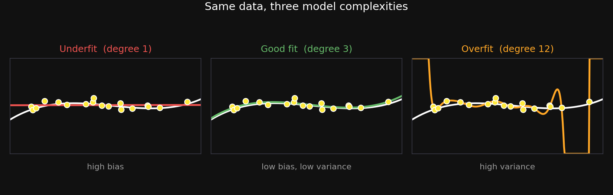{fig-align="center" width="92%"}

::: {.notes}
Set up the whole block. We have noisy data and want the underlying function. The one knob is model complexity — here the polynomial degree. Walk the three panels: degree 1 is a flat line that can't bend to the data (underfit), degree 3 tracks the truth, degree 12 wiggles wildly to chase every noisy point (overfit, blowing up at the edges). Name the tension: too simple misses the signal, too complex chases the noise. That's the bias-variance dilemma we're about to make precise.
:::

## [Two ways to be wrong]{.lang-en}[誤り方は二通り]{.lang-ja}

::: {.columns}
::: {.column width="50%"}
::: {.lang-en}
**Training error**

- error on points the model has **already seen**
- **always falls** as complexity rises — a flexible model can memorize
- *not* the thing to optimize
:::
::: {.lang-ja}
**訓練誤差**

- モデルが**既に見た**点での誤差
- 複雑さを上げると**常に下がる** — 柔軟なモデルは暗記できる
- 最適化*すべき対象ではない*
:::
:::
::: {.column width="50%"}
::: {.lang-en}
**Prediction (test) error**

- error on **new**, unseen data
- the thing we **actually** care about
- rises again once the model overfits
:::
::: {.lang-ja}
**予測（テスト）誤差**

- **新しい**未見のデータでの誤差
- **本当に**気にすべきもの
- 過学習すると再び上がる
:::
:::
:::

::: {.lang-en}
The gap between them is **overfitting** — the model memorized noise instead of signal.
:::
::: {.lang-ja}
両者の差が**過学習** — 信号ではなくノイズを覚えてしまった状態。
:::

::: {.notes}
The key distinction students must hold onto: training error is not the goal — it always drops with complexity. Prediction error on new data is the goal, and the gap between train and test is overfitting. Define overfitting plainly: the model fit the noise, which won't repeat on new data. This sets up the decomposition next.
:::

## [The bias-variance decomposition]{.lang-en}[バイアス・バリアンス分解]{.lang-ja}

$$\mathbb{E}\big[(\hat{y}-y)^2\big] \;=\; \text{Bias}^2 \;+\; \text{Variance} \;+\; \sigma^2$$

::: {.lang-en}
- **$\hat{y}$** the prediction, **$y$** the truth, **$\mathbb{E}$** an average over re-drawn training sets.
- **Bias²** — the systematic miss of the *average* fit (too-simple models).
- **Variance** — how much the fit *wobbles* across datasets (too-complex models).
- **$\sigma^2$** — irreducible noise, which no model can remove.
:::

::: {.lang-ja}
- **$\hat{y}$** 予測、**$y$** 真値、**$\mathbb{E}$** 引き直した訓練集合にわたる平均。
- **バイアス²** — *平均的な*当てはめの系統的なずれ（単純すぎるモデル）。
- **バリアンス** — 当てはめがデータ次第でどれだけ*揺れる*か（複雑すぎるモデル）。
- **$\sigma^2$** — どんなモデルも除けない不可避なノイズ。
:::

[Geman, Bienenstock & Doursat (1992)]{.dim}

::: {.notes}
This is the heart of the classical story (Geman, Bienenstock & Doursat 1992). Define every symbol on the slide: ŷ is the prediction, y the truth, the expectation is over re-drawn training sets. Bias² = systematic miss of the average fit (simple models). Variance = how much the fit jumps around when you resample the data (complex models). σ² = irreducible noise. The punchline coming up: bias falls and variance rises with complexity, so their sum is U-shaped.
:::

## [High bias vs. high variance]{.lang-en}[高バイアス vs 高バリアンス]{.lang-ja}

::: {.columns}
::: {.column width="50%"}
::: {.lang-en}
**High bias** (too simple)

- average fit misses the curve
- but it barely moves if you resample
- *underfitting*
:::
::: {.lang-ja}
**高バイアス**（単純すぎ）

- 平均的な当てはめが曲線を外す
- だがデータを引き直してもほぼ動かない
- *過少適合*
:::
:::
::: {.column width="50%"}
::: {.lang-en}
**High variance** (too complex)

- average fit can track the truth
- but each fit swings wildly with the data
- *overfitting*
:::
::: {.lang-ja}
**高バリアンス**（複雑すぎ）

- 平均的な当てはめは真値を追える
- だが各当てはめがデータ次第で大きく振れる
- *過剰適合*
:::
:::
:::

{fig-align="center" width="76%"}

::: {.notes}
Two-column contrast. Left: a too-simple model has high bias but low variance — wrong, but stably wrong. Right: a too-complex model has low bias but high variance — right on average but wildly unstable. Tie it back to the spaghetti you'll see in the widget: the degree-12 fits fan out, the degree-1 fits are a tight but wrong bundle.
:::

## [The classical moral: the U-curve]{.lang-en}[古典的な教訓：U字曲線]{.lang-ja}

::: {.columns}
::: {.column width="56%"}
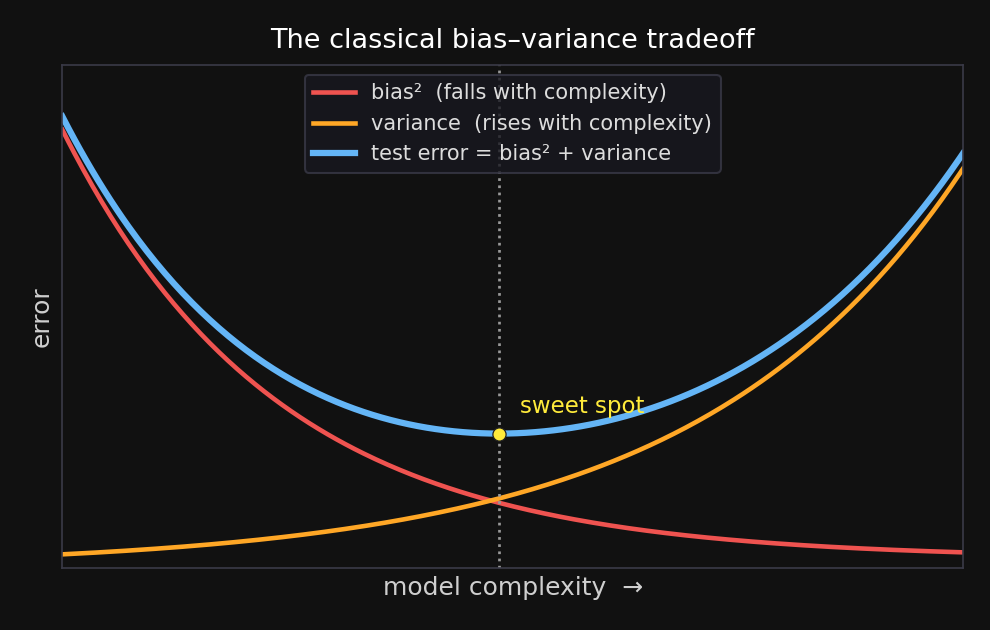{fig-align="center" width="100%"}
:::

::: {.column width="44%"}
::: {.lang-en}
Bias falls, variance rises → their sum is minimized at an **intermediate** complexity.

For decades this was the whole story: there's a sweet spot, and going past it **always hurts**.
:::

::: {.lang-ja}
バイアスは下がり、バリアンスは上がる → その和は**中間の**複雑さで最小になる。

数十年間これが全てだった：最適点があり、それを超えると**必ず悪化する**、と。
:::
:::
:::

::: {.notes}
The classic picture, and the claim we're about to complicate. Bias down, variance up, sum is U-shaped with a sweet spot in the middle. State the old slogan explicitly — "past the sweet spot, more capacity always hurts" — because that's exactly the half we're going to overturn after the widget. First, let them play with the left half.
:::

## [Meet the controls]{.lang-en}[操作パネルの説明]{.lang-ja}

::: {.columns}
::: {.column width="50%"}
::: {.lang-en}
**The data**

- **training points $n$** — how many noisy examples we learn from. *More data ⇒ less variance.*
- **noise $\sigma$** — the spread of the random scatter added to the true signal. *Bigger $\sigma$ ⇒ noisier data, easier to overfit.*
:::
::: {.lang-ja}
**データ**

- **訓練点数 $n$** — 学習に使うノイズ入りの例の数。*データが多い ⇒ バリアンスが下がる。*
- **ノイズ $\sigma$** — 真の信号に加わるランダムなばらつきの大きさ。*$\sigma$ が大きい ⇒ ノイズが多く過学習しやすい。*
:::
:::

::: {.column width="50%"}
::: {.lang-en}
**The model**

- **polynomial degree** — its flexibility, i.e. **capacity**. *Low = stiff (underfit); high = wiggly (overfit).*
- **ridge $\lambda$** — a penalty on large coefficients that pulls the fit toward something tamer: a **regularizer**. *$\lambda=0$ = off; bigger $\lambda$ = simpler fit.* (Returns after the break.)
:::
::: {.lang-ja}
**モデル**

- **多項式の次数** — 柔軟さ、すなわち**容量**。*低い＝硬い（過少適合）／高い＝うねる（過剰適合）。*
- **リッジ $\lambda$** — 大きな係数に課す罰則で、当てはめをより穏やかにする**正則化**。*$\lambda=0$＝なし／大きいほど単純。*（休憩後に再登場。）
:::
:::
:::

::: {.notes}
Orient them to the knobs before they play. Two groups. The DATA: how many points n, and how much noise σ — noise is just the random scatter on top of the true curve, and it's what makes overfitting bite (with zero noise, any wiggly interpolant looks fine). The MODEL: how flexible it is (polynomial degree = capacity) and how hard we rein it in (ridge λ). Define ridge plainly as a regularizer — a penalty on large coefficients that trades a little training fit for a lot of stability; we'll meet it again after the break as the "explicit twin" of the implicit min-norm bias. On the next slide we only touch n, noise, and degree; capacity and ridge come in once we cross into the double-descent regime.
:::

## [Play with it — classical regime]{.lang-en}[触ってみる — 古典領域]{.lang-ja} {.widget-slide}

<iframe class="widget-frame" src="widgets/bias-variance-explorer.html?view=classical"></iframe>

[**Left:** drag **polynomial degree** — the per-dataset "spaghetti" fans out as variance rises. **Right:** the bias²/variance/test curve, shown up to $p=n$ — the classic U. Raise **$n$** and the spaghetti tightens (variance ↓).]{.lang-en .widget-cap}[**左:** **多項式の次数**をドラッグ — データセットごとの「スパゲッティ」が広がる（バリアンス増）。**右:** bias²/バリアンス/テスト誤差の曲線を $p=n$ まで表示 — 古典的なU字。**$n$** を上げるとスパゲッティが縮む（バリアンス↓）。]{.lang-ja .widget-cap}

::: {.notes}
Drive both panels. LEFT (the fits): slide the degree from 1 upward — at degree 1 the average fit is flat (high bias) but the spaghetti of per-dataset fits is tight; at degree 3 the average tracks the truth and the spaghetti stays tight (the sweet spot); by degree 10+ the spaghetti fans out wildly (high variance). RIGHT (the decomposition): the bias²/variance/test curve, shown ONLY up to p = n — the classic U-curve made tangible; the second descent past p = n is deliberately off-screen so the "what happens past p = n?" prediction question lands fresh on the next slides. Then crank n (now capped at 40 here, so the right panel's O(n³) solve stays responsive): the spaghetti tightens onto the truth — variance → 0, the other half of the bias-variance story. Read the live bias²/variance numbers as you go. Then ask the prediction question.
:::

## [Predict before we continue]{.lang-en}[続ける前に予想しよう]{.lang-ja} {.poll-slide}

::: {.lang-en}
Keep adding parameters **past** the point where the model can fit every training point exactly. What happens to **test** error?
:::
::: {.lang-ja}
モデルが全ての訓練点をぴったり当てられる点を**超えて**、さらにパラメータを増やし続ける。**テスト**誤差はどうなる？
:::

::: {.fragment}
::: {.lang-en}
- **A.** keeps rising — more capacity, more overfitting
- **B.** flattens out
- **C.** rises to a peak, then **falls again**
:::
::: {.lang-ja}
- **A.** 上がり続ける — 容量が増えるほど過学習
- **B.** 横ばいになる
- **C.** 一度ピークまで上がり、その後**再び下がる**
:::
:::

::: {.notes}
Pause-and-predict (recorded — tell them to actually pause the video and pick). The intuitive answer from the U-curve is A. The truth is C. Let the suspense sit for a beat before advancing. Sourced as a concept-check on the bias-variance material.
:::

## [Double descent — the U-curve is half the story]{.lang-en}[二重降下 — U字曲線は半分の物語]{.lang-ja} {.big-figure}

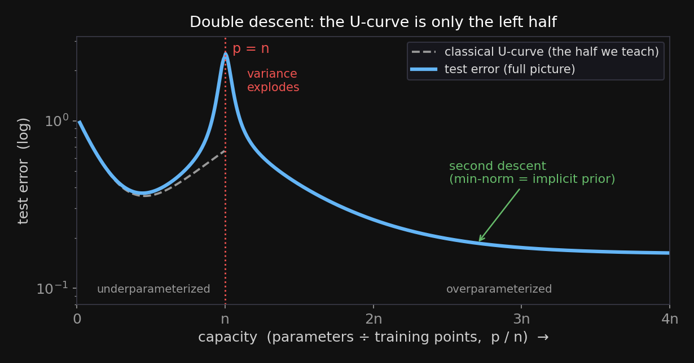{fig-align="center" width="72%"}

::: {.lang-en}
Past the **interpolation threshold** ($p=n$: as many parameters as data points), test error spikes — then **descends a second time**, often below the classical sweet spot. The U-curve is the *left half*.
:::

::: {.lang-ja}
**補間しきい値**（$p=n$：パラメータ数がデータ点数と等しい）を超えると、テスト誤差は急上昇し — その後**二度目の降下**をして、しばしば古典的最適点より下に達する。U字曲線は*左半分*だ。
:::

[Belkin et al. (2019, PNAS); Nakkiran et al. (2019)]{.dim}

::: {.notes}
The reveal — answer C. Everything we taught is correct but stops at the interpolation threshold (p = n: as many parameters as data points). Modern ML lives to the RIGHT of it. Belkin et al. 2019 named "double descent"; Nakkiran et al. 2019 showed it in real neural nets and even across training epochs. Point at the figure: the dashed classical U is only the left half; the full curve spikes at p = n then descends a second time, often below the classical minimum. The only thing we retire is "more capacity always eventually hurts." Next: WHY the spike, and why the second descent.
:::

## [Why the spike at $p=n$?]{.lang-en}[なぜ $p=n$ で急上昇？]{.lang-ja} {.widget-slide}

<iframe class="widget-frame" src="widgets/bias-variance-explorer.html"></iframe>

[Right panel, "closed-form min-norm": drag **capacity p** to $n$. The test curve spikes — and the purple **‖weights‖₂** panel spikes with it.]{.lang-en .widget-cap}[右パネル「closed-form min-norm」：**容量 p** を $n$ までドラッグ。テスト曲線が急上昇し、紫の **‖weights‖₂** パネルも同時に跳ね上がる。]{.lang-ja .widget-cap}

::: {.notes}
Drive the RIGHT panel. With exactly n parameters and n noisy points, there is a UNIQUE setting that threads every point — and to pass through noise exactly, it must be wild: enormous coefficients swinging between points. Slide capacity p to n and show the test spike AND the purple ‖weights‖₂ panel spiking together. The contortion needed to interpolate is what wrecks generalization. Now go past n and ask which interpolant the learner picks.
:::

## [Past the threshold: which fit?]{.lang-en}[しきい値の先：どの当てはめ？]{.lang-ja}

::: {.columns}
::: {.column width="50%"}
::: {.lang-en}
With **more parameters than data**, there are **infinitely many** fits that nail the training points exactly.

So the question changes:

> not "*can* it fit?" but "*which* perfect fit?"
:::
::: {.lang-ja}
**データよりパラメータが多い**と、訓練点をぴったり当てる当てはめが**無数に**ある。

だから問いが変わる：

> 「合わせ*られる*か」ではなく「*どの*完全な当てはめか」
:::
:::
::: {.column width="50%"}
::: {.lang-en}
Gradient descent from zero (and the pseudoinverse) picks the **minimum-norm** fit — the one with the **smallest weights**.

Smallest weights → smoothest → **generalizes**.

**That choice is a prior.**
:::
::: {.lang-ja}
ゼロから始める勾配降下（と擬似逆行列）は**最小ノルム**の当てはめ — **重みが最小**のもの — を選ぶ。

重み最小 → 最も滑らか → **汎化する**。

**その選択は事前分布だ。**
:::
:::
:::

::: {.notes}
The conceptual pivot of the whole block. Past p = n there are infinitely many interpolating solutions, so the question is no longer "can it fit?" but "which fit does the learner choose?" Gradient descent from zero, and equivalently the pseudoinverse, picks the minimum-norm interpolant — the smallest-weight solution, which is the smoothest, hence generalizes. And "prefer the smallest-norm solution" is not neutral — it is a prior. That word "prior" is the bridge to the entire rest of the day. Set up the exact norm next.
:::

## [Norm ↔ prior: the dictionary]{.lang-en}[ノルム ↔ 事前分布：対応辞書]{.lang-ja}

::: {.columns}
::: {.column width="50%"}
::: {.lang-en}
**ℓ₂ norm** — $\lVert\beta\rVert_2^2$
*(squared Euclidean length)*

⇕

a **Gaussian prior** on the weights

→ **ridge regression**
:::
::: {.lang-ja}
**ℓ₂ノルム** — $\lVert\beta\rVert_2^2$
*（ユークリッド長の二乗）*

⇕

重みへの**ガウス事前分布**

→ **リッジ回帰**
:::
:::
::: {.column width="50%"}
::: {.lang-en}
**ℓ₁ norm** — $\lVert\beta\rVert_1$
*(sum of absolute values)*

⇕

a **Laplace prior** on the weights

→ **lasso** → *sparsity*
:::
::: {.lang-ja}
**ℓ₁ノルム** — $\lVert\beta\rVert_1$
*（絶対値の和）*

⇕

重みへの**ラプラス事前分布**

→ **ラッソ** → *スパース性*
:::
:::
:::

::: {.lang-en}
Gradient descent from zero converges to the minimum-**ℓ₂** fit — the **Gaussian**-prior one. *(Not L1.)*
:::
::: {.lang-ja}
ゼロから始める勾配降下は最小**ℓ₂**の当てはめ — **ガウス**事前分布のもの — に収束する。*（L1ではない。）*
:::

::: {.notes}
Pin down the dictionary, because this answers the natural question "which prior?" Penalizing the squared ℓ₂ (Euclidean) length of the weights is exactly a Gaussian prior + MAP — that's ridge. Penalizing ℓ₁ (sum of absolute values) is a Laplace prior — that's lasso, which gives sparsity. They are different priors with different fingerprints. Plain gradient descent from zero gives the minimum-ℓ₂ (Gaussian) solution, not the L1 one. So the implicit regularization of overparameterized models is specifically a Gaussian prior on the weights.
:::

## [Ridge: the explicit twin]{.lang-en}[リッジ：明示的な双子]{.lang-ja} {.widget-slide}

<iframe class="widget-frame" src="widgets/bias-variance-explorer.html"></iframe>

[Drag **ridge λ** up: the spike at $p=n$ collapses (≈337 → ~1) — explicit ℓ₂ is the *twin* of the implicit min-norm bias. A moderate λ gives the lowest test of all; over-shrink and you under-fit (the best test creeps back up).]{.lang-en .widget-cap}[**ridge λ** を上げる：$p=n$ の急上昇が崩れる（約337 → 約1）— 明示的な ℓ₂ は暗黙の最小ノルム・バイアスの*双子*。適度な λ が最も低いテスト誤差を与え、縮小しすぎると過小適合になる（最良のテスト誤差が再び上がる）。]{.lang-ja .widget-cap}

::: {.notes}
If a hidden Gaussian prior does the work, we can add it on purpose and dial it. Ridge minimizes training error + λ·‖β‖₂²; the solution is β = (ΦᵀΦ + λI)⁻¹Φᵀy — the +λI is the whole change. Drag λ up in the widget: the spike at p = n flattens, peak test error dropping from ~337 to ~1. Nakkiran et al. 2020 proved the right λ removes double descent entirely — and indeed a *moderate* λ gives the lowest test of all, beating λ=0 (min-norm). Push λ too far and you over-shrink: the best achievable test creeps back UP — over-regularizing under-fits (bias wins). Be careful how you describe the "too much λ" regime: the optimal CAPACITY does drift down (toward p ≈ n) as λ grows, but big models stay perfectly usable and the test curve does NOT snap back into a steep small-capacity U — on the log-y axis the post-optimum rise is gentle, so the blue curve can look almost flat/monotone even though a shallow optimum is there. So the honest takeaway is "λ and capacity are two knobs for the same effective complexity," not "the old U-curve returns." λ interpolates between "trust the data, interpolate" and "trust the prior, keep weights small."
:::

## [Early stopping: the implicit twin]{.lang-en}[早期終了：暗黙の双子]{.lang-ja} {.widget-slide}

<iframe class="widget-frame" src="widgets/bias-variance-explorer.html"></iframe>

[Selector → **"neural net + GD"**. Sweep **hidden units H**; set **GD iterations T**. Small T → flat, no spike (early stopping); large T → the spike returns at $H=n$.]{.lang-en .widget-cap}[セレクタ → **「neural net + GD」**。**隠れユニット数 H** を掃引し、**GD反復回数 T** を設定。小さい T → 平坦・急上昇なし（早期終了）、大きい T → $H=n$ で急上昇が戻る。]{.lang-ja .widget-cap}

::: {.notes}
The second route to the same prior — the one many people guess first: just don't train as long. Switch the selector to "neural net + GD": a real one-hidden-layer net, knobs = hidden units H and GD iterations T. With only a few steps the double-descent spike isn't there and the weights stay small; train for 10,000 steps and the spike snaps back at H = n. Gradient descent from zero grows the weights gradually, so stopping early is almost exactly ridge with effective λ ≈ 1/(η·T) (Yao, Rosasco & Caponnetto 2007; Ali et al. 2019). So three knobs — min-norm interpolant, ridge λ, GD iterations — are the SAME move: a Gaussian prior on the weights, dialed. That is a Bayesian idea, which is exactly where the rest of the day goes.
:::

## [Benign overfitting & the honest caveats]{.lang-en}[無害な過学習と正直な注意点]{.lang-ja}

::: {.lang-en}
- **Benign overfitting** (Bartlett et al. 2020): in high dimensions a model can interpolate the *noise* and still generalize — the noise spreads thin across many directions.
- **Caveat:** double descent needs the right regime — high-dimensional, roughly isotropic features. Low-dim correlated features (the widget's *left* panel) don't show it.
- The classical U-curve was never *wrong* — just **incomplete**.
:::

::: {.lang-ja}
- **無害な過学習**（Bartlett et al. 2020）：高次元ではモデルがノイズを補間しても汎化しうる — ノイズが多数の方向に薄く分散する。
- **注意：** 二重降下には適切な条件が要る — 高次元でほぼ等方的な特徴。低次元の相関した特徴（ウィジェット*左*パネル）では現れない。
- 古典的U字曲線は*間違い*ではなく、**不完全**だっただけ。
:::

::: {.notes}
Round it off honestly. Benign overfitting (Bartlett et al. 2020): fitting noise exactly feels illegal, but in very high dimensions the noise spreads across an enormous number of directions, each barely perturbed, so it costs almost nothing on test. The caveat matters: double descent needs high-dimensional, roughly isotropic features — the low-dimensional correlated polynomial features in the LEFT panel of the widget do NOT show a clean second descent, and that contrast is worth naming. Bottom line: the U-curve was incomplete, not wrong.
:::

## [So — how complex should the model be?]{.lang-en}[では、モデルはどれだけ複雑であるべきか？]{.lang-ja}

::: {.lang-en}
Two principled modern answers:

1. **Go huge, then regularize** — make the model enormous and let an implicit/explicit prior pick a simple interpolant (the deep-learning answer we just dissected).
2. **Let the model grow with the data** — under an explicit prior that says how eagerly to add complexity. That is **Bayesian nonparametrics** — the rest of today.
:::

::: {.lang-ja}
原理的な現代の答えは二つ：

1. **巨大化してから正則化** — モデルを巨大にし、暗黙／明示の事前分布に単純な補間解を選ばせる（今分解した深層学習の答え）。
2. **データとともにモデルを育てる** — 複雑さをどれだけ足すかを定める明示的な事前分布の下で。これが**ベイズ・ノンパラメトリクス** — 今日の残り。
:::

::: {.notes}
The bridge. Same question, two principled answers. One: go huge and regularize — the deep-learning answer we just took apart, where the regularizer is a Gaussian prior on the weights (implicit or explicit). Two: don't fix the size at all — let the model grow with the data under an explicit prior governing how eagerly it adds complexity. That's Bayesian nonparametrics, and it's the rest of the lecture. The connective tissue is the word "prior," which Block 1 earned honestly.
:::

# [Let the data decide: Bayesian nonparametrics]{.lang-en}[データに決めさせる：ベイズ・ノンパラメトリクス]{.lang-ja} {.section-break background-image="../../sds-reveal/sds_frame.png" background-size="cover"}

::: {.notes}
Block 2. We start concretely: clustering bento weights with a Gaussian mixture, and the question that breaks it — how many clusters? That question is where nonparametrics earns its keep.
:::

## [Recall: clustering bento weights]{.lang-en}[復習：弁当の重さをクラスタリング]{.lang-ja}

::: {.lang-en}
From the mixture-models chapter: bento weights cluster by type — **Hamburger** ($\approx 350$ g) and **Tonkatsu** ($\approx 500$ g). A **Gaussian mixture model (GMM)** gives each cluster a Gaussian and a weight, and treats *which cluster each point came from* as a **latent variable to infer** — we reason about the posterior, we don't solve it in closed form. But you must still **fix K** (the number of clusters) up front.
:::

::: {.lang-ja}
混合モデルの章より：弁当の重さは種類でまとまる — **ハンバーグ**（約350g）と**とんかつ**（約500g）。**ガウス混合モデル（GMM）**は各クラスタにガウス分布と重みを与え、*各点がどのクラスタ由来か*を**推論すべき潜在変数**として扱う — 閉形式で解くのではなく事後分布を考える。だが**Kを事前に固定**せねばならない。
:::

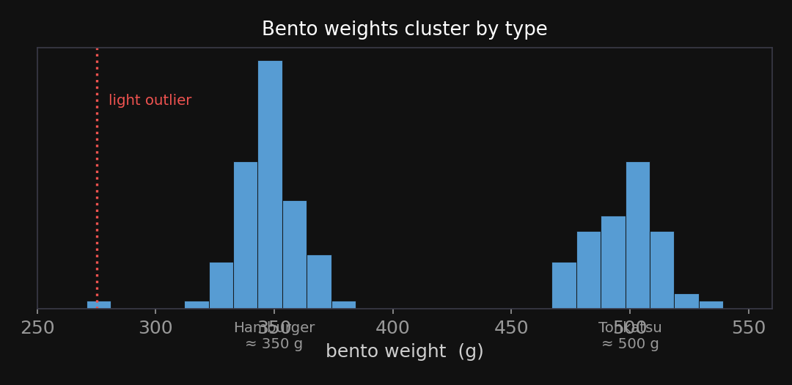{fig-align="center" width="60%"}

::: {.notes}
Ground the abstraction in the running example. Bento weights cluster by food type — Hamburger ~350 g, Tonkatsu ~500 g. A GMM puts a Gaussian + weight on each cluster, and treats each point's cluster assignment as a latent variable to infer — in this course we reason about the posterior over assignments and parameters (importance sampling in the textbook), NOT EM and NOT a closed-form solve. The catch, which is the whole motivation: you must pick K, the number of clusters, before you start. Next slide: why that's genuinely hard.
:::

## [The "how many clusters?" problem]{.lang-en}[「クラスタはいくつ？」問題]{.lang-ja} {.big-figure}

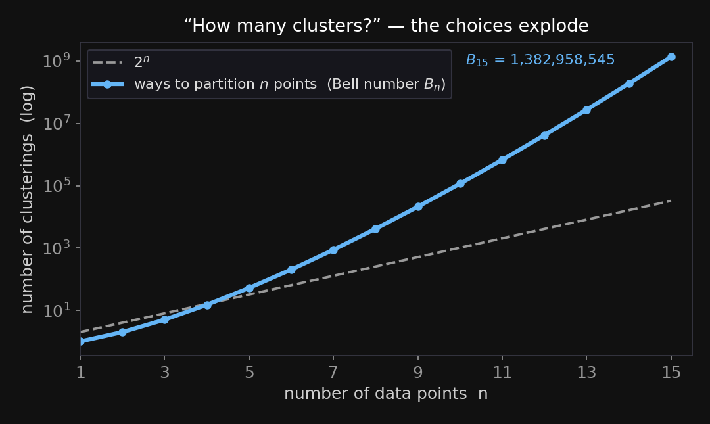{fig-align="center" width="60%"}

::: {.lang-en}
You can't just try every clustering: the number of ways to partition $n$ points (the **Bell number**) explodes — for 15 points it's already **1.4 billion**. And the "right" $K$ may grow as more data arrives.
:::

::: {.lang-ja}
全てのクラスタリングを試すことはできない：$n$点を分割する方法の数（**ベル数**）は爆発する — 15点で既に**14億**。しかも「正しい」$K$はデータが増えると大きくなりうる。
:::

::: {.notes}
Why "just search over K" fails. The number of partitions of n points — the Bell number — grows super-exponentially; at 15 points it's 1.4 billion, and real datasets are far bigger. Worse, the right K isn't fixed: more data can reveal new clusters. So we want a model where K is not a knob we set, but something inferred — and allowed to grow. That's the nonparametric move. First, watch the fixed-K model fail.
:::

## [Watch fixed-K miss a cluster]{.lang-en}[固定Kがクラスタを見逃すのを見る]{.lang-ja} {.widget-slide}

<iframe class="widget-frame" src="widgets/dpmm-kde-gmm.html"></iframe>

[Set **GMM K = 2**. The lone light bento (≈275 g) gets swallowed into the low cluster — its mean is dragged down. The **DPMM** (blue) gives it its own cluster.]{.lang-en .widget-cap}[**GMM K = 2** に設定。軽い一つの弁当（約275g）が低いクラスタに飲み込まれ、平均が下に引っ張られる。**DPMM**（青）はそれに独自のクラスタを与える。]{.lang-ja .widget-cap}

::: {.notes}
Drive Widget 1. Auto-seeded with Hamburger (~350) and Tonkatsu (~500) plus one light outlier at 275 g. Turn ON the GMM at K = 2: it has no spare cluster for the outlier, so it absorbs it into the low cluster and drags that mean down to ~340. Now point at the DPMM curve (blue): it grows a third cluster for the outlier on its own. Click to add a few more points and watch the DPMM add/merge clusters live. That self-sizing is what we'll build over the next blocks. Tease: the engine is the "Chinese Restaurant Process."
:::

# [The Chinese Restaurant Process]{.lang-en}[中華料理店過程]{.lang-ja} {.section-break background-image="../../sds-reveal/sds_frame.png" background-size="cover"}

::: {.notes}
Block 3. The CRP is the intuition engine for everything that follows — a way to put a probability distribution over partitions with no fixed number of groups. Keep the metaphor concrete.
:::

## [A law over partitions]{.lang-en}[分割の上の法則]{.lang-ja} {.smaller}

::: {.lang-en}
A restaurant with infinitely many tables; customers enter one at a time. Customer $n+1$:

- joins an occupied table $k$ with probability $\propto n_k$ (people already there),
- starts a **new** table with probability $\propto \alpha$.

That's the **Chinese Restaurant Process (CRP)** — a law over *partitions* with no fixed $K$. **$\alpha$** is the **concentration**: the appetite for new tables.
:::

::: {.lang-ja}
無限のテーブルがある料理店。客は一人ずつ入る。客 $n+1$ は：

- 既に座っている人数 $n_k$ に比例して、埋まったテーブル $k$ に座り、
- $\alpha$ に比例して**新しい**テーブルを始める。

これが**中華料理店過程（CRP）** — $K$ を固定しない*分割*の上の法則。**$\alpha$** は**集中度**：新しいテーブルへの意欲。
:::

$$P(\text{partition})\;=\;\frac{\alpha^{K}\,\prod_{k=1}^{K}(n_k-1)!}{\alpha\,(\alpha+1)\cdots(\alpha+n-1)}$$

[$K$ = occupied tables, $n_k$ = people at table $k$, $n$ = total customers. **Exchangeable** — it depends only on the block sizes, not who arrived when.]{.lang-en .dim}[$K$＝埋まったテーブル数、$n_k$＝テーブル $k$ の人数、$n$＝総客数。**交換可能** — ブロックの大きさだけに依存し、到着順に依らない。]{.lang-ja .dim}

::: {.notes}
Define the CRP precisely and name every term at first use. Infinitely many tables; customers arrive one at a time; customer n+1 joins an occupied table with probability proportional to how many people are already there (n_k), or starts a brand-new table with probability proportional to α. The result is a distribution over PARTITIONS of the customers — no K fixed in advance. α is the concentration parameter: larger α = more new tables = more clusters. Emphasize "proportional to n_k" — that's rich-get-richer, which we'll see next.
:::

## [Seat the customers — live]{.lang-en}[客を着席させる — ライブ]{.lang-ja} {.widget-slide}

<iframe class="widget-frame" src="widgets/crp-seating.html"></iframe>

[**Auto-seat** customers and watch tables appear. The bar shows the next customer's odds (∝ table size, plus NEW ∝ α). Big tables pull harder — **rich-get-richer**.]{.lang-en .widget-cap}[**Auto-seat** で客を着席させ、テーブルが現れるのを見る。バーは次の客の確率（∝テーブルの大きさ、＋NEW ∝ α）を示す。大きいテーブルほど強く引く — **金持ちはより金持ちに**。]{.lang-ja .widget-cap}

::: {.notes}
Drive Widget 3. Hit Auto-seat and narrate: the top bar is the next customer's probability, each table's slice proportional to its size, plus a NEW slice proportional to α. Watch the big tables grab most arrivals — rich-get-richer — while α occasionally spawns a fresh table. Then drag α: at α = 0.2 almost everyone piles onto one table; at α = 5 you get many small tables. So α tunes the number of clusters without ever fixing it. That "∝ n_k, new ∝ α" rule is the CRP, and it's about to become the Dirichlet process.
:::

## [Rich-get-richer, and what $\alpha$ does]{.lang-en}[金持ちはより金持ちに、そして $\alpha$ の役割]{.lang-ja}

::: {.lang-en}
- **Rich-get-richer:** big clusters attract more members (the $\propto n_k$ rule). Clusters that start big tend to stay big.
- **Small $\alpha$** → few big clusters. **Large $\alpha$** → many small clusters.
- The number of clusters grows slowly with data — about $\alpha \log n$ — it is **never fixed**.
- This *growing-but-controlled* capacity is the **nonparametric answer** to Block 1 — capacity set by the data, not chosen by us.
:::

::: {.lang-ja}
- **金持ちはより金持ちに：** 大きいクラスタほど多くの仲間を引き寄せる（$\propto n_k$ の規則）。大きく始まったクラスタは大きいままになりやすい。
- **小さい $\alpha$** → 少数の大きいクラスタ。**大きい $\alpha$** → 多数の小さいクラスタ。
- クラスタ数はデータとともにゆっくり増える — おおよそ $\alpha \log n$ — **決して固定されない**。
- この*増えるが制御された*容量こそ、第1ブロックへの**ノンパラメトリックな答え** — 容量を我々ではなくデータが決める。
:::

::: {.notes}
Consolidate the intuition before the math. Rich-get-richer is the ∝ n_k rule: big clusters attract more. α tunes granularity: small α = few big clusters, large α = many small ones. And crucially the expected number of clusters grows like α·log n — slowly, but unboundedly, with the data. K is never fixed. That property — capacity that grows with data — is exactly the nonparametric answer to Block 1's question. Now connect the CRP to the formal object: the Dirichlet process.
:::

# [From the CRP to the Dirichlet Process]{.lang-en}[CRPからディリクレ過程へ]{.lang-ja} {.section-break background-image="../../sds-reveal/sds_frame.png" background-size="cover"}

::: {.notes}
Block 4. One object — the Dirichlet process — seen through three equivalent lenses. The goal is for students to recognize the CRP, the Pólya urn, and stick-breaking as three views of the same thing, and to fix the common conflation between them.
:::

## [Three lenses on one object]{.lang-en}[一つの対象への三つの視点]{.lang-ja}

::: {.lang-en}
The **Dirichlet Process (DP)** is one object you can look at three ways:

- **CRP** — the distribution over *partitions* (customers → tables).
- **Pólya urn** — the *predictive rule*: how the next draw behaves once the random distribution is integrated out.
- **Stick-breaking** — an *explicit construction* of the random distribution itself.

Same DP; pick the lens that fits the job.
:::

::: {.lang-ja}
**ディリクレ過程（DP）**は一つの対象で、三通りに見られる：

- **CRP** — *分割*の上の分布（客 → テーブル）。
- **ポリヤの壺** — *予測規則*：ランダムな分布を積分消去した後の次の引きの振る舞い。
- **棒折り** — ランダムな分布そのものの*明示的な構成*。

同じDP。仕事に合う視点を選ぶ。
:::

::: {.notes}
Set up the three-lenses frame and promise to fix a common confusion. The Dirichlet process is ONE object. The CRP is the partition view. The Pólya urn is the predictive-rule view (what the next draw does after integrating out the random distribution). Stick-breaking is the explicit-construction view (it builds the random distribution itself). Students often conflate the Pólya urn with "the DP" — they're related but not identical, which the next slide pins down. Teh et al. (2006) is the canonical synthesis.
:::

## [Pólya urn = the DP's predictive rule]{.lang-en}[ポリヤの壺 = DPの予測規則]{.lang-ja}

::: {.lang-en}
- Draw colored balls from an urn: each draw **repeats an existing color** (∝ its count) or **invents a new color** (∝ α).
- This is **Blackwell–MacQueen (1973)** — the DP's **predictive marginal**, after integrating the random distribution $G$ out.
- It is the **same rule as the CRP**, now with a *dish* (a parameter $\theta_k$) attached to each table.
    - In the bento demo, that dish was the **mean of a Gaussian cluster** — each new table gets its own center $\theta_k$, and that table's points are noisy draws around it.
- It is *not* the DP itself — it's what you see when you **only watch the draws**.
:::

::: {.lang-ja}
- 壺から色付きの玉を引く：各引きは**既存の色を繰り返す**（個数に比例）か、**新しい色を発明する**（αに比例）。
- これが**ブラックウェル–マックイーン（1973）** — ランダムな分布 $G$ を積分消去した後の、DPの**予測周辺分布**。
- **CRPと同じ規則**で、今は各テーブルに*料理*（パラメータ $\theta_k$）が付く。
    - 弁当のデモでは、その料理は**ガウスクラスタの平均**だった — 各新テーブルは独自の中心 $\theta_k$ を持ち、そのテーブルの点はその周りのノイズ付きの引き。
- これはDP*そのものではない* — **引きだけを見た**ときに見えるもの。
:::

::: {.notes}
Fix the conflation the SP25 slides blurred. The Pólya urn (Blackwell–MacQueen 1973) is the DP's predictive marginal: draw balls, repeat an existing color ∝ its count or invent a new color ∝ α — structurally identical to the CRP with dishes attached. The key correction: this is NOT "the DP." It's what you observe when you only watch the sequence of draws, having integrated out the underlying random distribution G. The DP itself is that G — the next slide builds it explicitly via stick-breaking.
:::

## [Stick-breaking — build the distribution]{.lang-en}[棒折り — 分布を構成する]{.lang-ja} {.widget-slide}

<iframe class="widget-frame" src="widgets/stick-breaking-polya.html"></iframe>

[Take a unit stick; break off $\beta_k \sim \text{Beta}(1,\alpha)$ of what remains each time. The pieces are the cluster weights $\pi_k$. Drag **α**: small α → a few big pieces; large α → many small ones.]{.lang-en .widget-cap}[長さ1の棒を取り、毎回残りの $\beta_k \sim \text{Beta}(1,\alpha)$ を折り取る。各片がクラスタ重み $\pi_k$。**α**をドラッグ：小さいα→少数の大きな片、大きいα→多数の小さな片。]{.lang-ja .widget-cap}

::: {.notes}
Drive Widget 2. Stick-breaking (Sethuraman 1994) constructs the DP's random distribution explicitly: start with a unit stick of probability, repeatedly break off a Beta(1, α) fraction of what remains; the pieces are the mixing weights π_k. Show the top panel (the stick) and the bottom (the Pólya-urn ball fill) responding to α together — two views of the same DP(α). Small α gives a few dominant weights; large α spreads them out. The weights are stochastically decreasing — that's the long tail of rare clusters. Now state the DP formally.
:::

## [The Dirichlet Process itself]{.lang-en}[ディリクレ過程そのもの]{.lang-ja}

::: {.lang-en}
$$G \sim \mathrm{DP}(\alpha, G_0)$$

- $G$ is a **random probability distribution**; $G_0$ is the **base measure** (where clusters live); $\alpha$ the concentration.
- A draw $G$ is **almost surely discrete** — a weighted set of spikes ($\sum_k \pi_k \delta_{\theta_k}$, the stick-breaking weights at locations from $G_0$).
- **Discrete → repeats → clustering.** That spikiness is *why* the DP groups data.
:::

::: {.lang-ja}
$$G \sim \mathrm{DP}(\alpha, G_0)$$

- $G$ は**ランダムな確率分布**、$G_0$ は**基底測度**（クラスタの居場所）、$\alpha$ は集中度。
- 引き $G$ は**ほとんど確実に離散** — 重み付きのスパイクの集合（$\sum_k \pi_k \delta_{\theta_k}$、棒折り重みを $G_0$ 由来の位置に）。
- **離散 → 繰り返し → クラスタリング。** そのスパイク性こそ、DPがデータをまとめる*理由*だ。
:::

::: {.notes}
Now the formal object, kept light. G ~ DP(α, G₀): G is a random probability DISTRIBUTION; G₀ (the base measure) says where cluster parameters can live; α is concentration. The one deep fact to land: a draw G is almost surely DISCRETE — it's a set of weighted spikes (the stick-breaking weights at locations drawn from G₀). Because G is discrete, repeated draws from it land on the SAME values — and repeats ARE clusters. So the discreteness is not a technicality; it is the mechanism that makes the DP cluster. The very next slide pictures exactly this. Don't go further into measure theory; this is the payload.
:::

## [$G_0$ in → a discrete $G$ out]{.lang-en}[$G_0$ から離散な $G$ へ]{.lang-ja} {.big-figure}

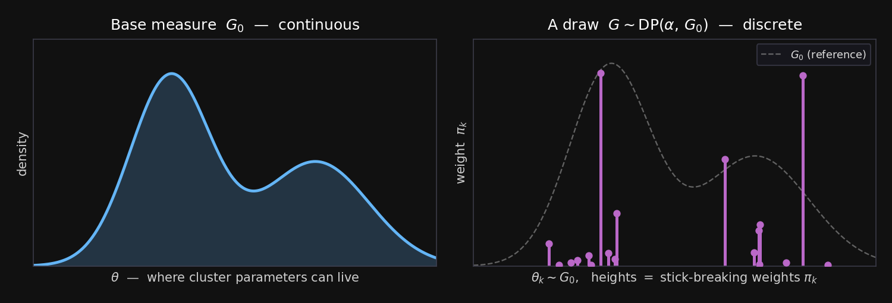{fig-align="center" width="88%"}

[Sample locations $\theta_k$ from the smooth $G_0$, then give them **stick-breaking weights** $\pi_k$. The draw $G$ is a handful of **weighted spikes** — discrete, so repeated draws collide and **cluster**.]{.lang-en .dim}[滑らかな $G_0$ から位置 $\theta_k$ を引き、**棒折り重み** $\pi_k$ を与える。引き $G$ は重み付きの**スパイク**の集まり — 離散なので引きは衝突し**クラスタ**を作る。]{.lang-ja .dim}

::: {.notes}
The picture for the previous slide. Left: the smooth base measure G₀ — a continuous density saying where cluster parameters can live. Right: ONE draw G ~ DP(α, G₀) — a handful of spikes at locations sampled from G₀, with heights given by the stick-breaking weights (the tall ones land where G₀ has mass). This is "almost surely discrete" made concrete: G is not a smooth density, it's atoms. Because it's atoms, two data points drawn through G can land on the SAME atom — that collision IS a cluster. Bigger α → more, smaller spikes (more clusters); smaller α → a few dominant ones.
:::

## [The trio, tied together]{.lang-en}[三者を結ぶ]{.lang-ja}

::: {.lang-en}
- **Stick-breaking** builds the random discrete $G$ (the weights $\pi_k$ and locations $\theta_k$).
- **CRP** is what the *partition* looks like once you draw data through $G$ and integrate $G$ out.
    - *Handwave:* do that integration over $n$ draws and you recover **exactly** the partition law $P=\dfrac{\alpha^{K}\prod_k(n_k-1)!}{\alpha(\alpha+1)\cdots(\alpha+n-1)}$ from the CRP slide.
- **Pólya urn** is the *sequential predictive rule* you get at the same time.

One DP, three faces — and we never fixed the number of clusters.
:::

::: {.lang-ja}
- **棒折り**はランダムな離散 $G$ を構成する（重み $\pi_k$ と位置 $\theta_k$）。
- **CRP**は、$G$ を通してデータを引き $G$ を積分消去したときの*分割*の姿。
    - *直感:* $n$ 個の引きでその積分を実行すると、CRPスライドの分割法則 $P=\dfrac{\alpha^{K}\prod_k(n_k-1)!}{\alpha(\alpha+1)\cdots(\alpha+n-1)}$ がちょうど復元される。
- **ポリヤの壺**は同時に得られる*逐次予測規則*。

一つのDP、三つの顔 — そしてクラスタ数を一度も固定しなかった。
:::

::: {.notes}
Synthesis — say it once, cleanly, then move on (don't re-derive). Stick-breaking builds the random discrete G. Draw data through G and integrate G out: the partition you see is the CRP, and the sequential predictive rule is the Pólya urn. One DP, three faces, and at no point did we fix the number of clusters. That's the whole point. Next we attach a likelihood and get a working clustering model.
:::

# [Dirichlet Process Mixture Models]{.lang-en}[ディリクレ過程混合モデル]{.lang-ja} {.section-break background-image="../../sds-reveal/sds_frame.png" background-size="cover"}

::: {.notes}
Block 5. Attach a Gaussian likelihood to the DP prior and you get the DPMM — the self-sizing cluster model from Widget 1. Then place it honestly among parametric and nonparametric alternatives.
:::

## [DP prior + Gaussian likelihood]{.lang-en}[DP事前分布 + ガウス尤度]{.lang-ja}

::: {.lang-en}
A **DP mixture model (DPMM)**:

1. Draw a random discrete $G \sim \mathrm{DP}(\alpha, G_0)$ — the clusters and their weights.
2. For each data point, pick a cluster from $G$ and draw the point from a **Gaussian** around that cluster's mean.

The CRP says how points share clusters; the Gaussian says what a cluster looks like. **K is inferred, not fixed.**
:::

::: {.lang-ja}
**DP混合モデル（DPMM）**：

1. ランダムな離散 $G \sim \mathrm{DP}(\alpha, G_0)$ を引く — クラスタとその重み。
2. 各データ点について、$G$ からクラスタを選び、そのクラスタの平均の周りの**ガウス分布**から点を引く。

CRPは点がどうクラスタを共有するかを、ガウスはクラスタの見た目を定める。**Kは推論され、固定されない。**
:::

::: {.notes}
The generative story, two lines: draw a random discrete G from the DP (clusters + weights), then each data point picks a cluster from G and is drawn from a Gaussian around that cluster's mean. The DP prior handles "how many clusters and how points share them"; the Gaussian likelihood handles "what a cluster looks like." The combination is the DPMM — exactly the blue curve in Widget 1, with K inferred rather than fixed. Show it doing all three models side by side next.
:::

## [DPMM vs KDE vs GMM — live]{.lang-en}[DPMM vs KDE vs GMM — ライブ]{.lang-ja} {.widget-slide}

<iframe class="widget-frame" src="widgets/dpmm-kde-gmm.html"></iframe>

[Three density models on the same clicks: **DPMM** (infers clusters), **KDE** (a bump per point, no clusters), **GMM** (you fix K). Drag DPMM's **α**; add points and watch clusters appear.]{.lang-en .widget-cap}[同じクリックに三つの密度モデル：**DPMM**（クラスタを推論）、**KDE**（点ごとの山、クラスタなし）、**GMM**（Kを固定）。DPMMの**α**をドラッグ、点を足してクラスタが現れるのを見る。]{.lang-ja .widget-cap}

::: {.notes}
Drive Widget 1 in full. Three models on the same data: the DPMM infers its own number of clusters; the KDE just drops a bump on every point (a useful density, but no notion of clusters); the GMM needs you to fix K. Drag the DPMM's α to watch its cluster count change; click to add a heavy bento at 575 and watch the DPMM spawn a new cluster while the K = 2 GMM can't. This is the payoff of the whole build-up. Then place it among the alternatives formally.
:::

## [Parametric / nonparametric / BNP]{.lang-en}[パラメトリック / ノンパラメトリック / BNP]{.lang-ja}

::: {.columns .cmp-cols}
::: {.column width="33%"}
::: {.lang-en}
::: {.cmp-head}
**Parametric**
*(GMM, fixed K)*
:::

- fixed # of parameters
- capacity set in advance
- e.g. "exactly 2 clusters"
:::
::: {.lang-ja}
::: {.cmp-head}
**パラメトリック**
*(GMM, K固定)*
:::

- パラメータ数が固定
- 容量を事前に決める
- 例「ちょうど2クラスタ」
:::
:::
::: {.column width="33%"}
::: {.lang-en}
::: {.cmp-head}
**Nonparametric**
*(KDE)*
:::

- complexity grows with data
- but **no model / no prior** — just smoothing
:::
::: {.lang-ja}
::: {.cmp-head}
**ノンパラメトリック**
*(KDE)*
:::

- 複雑さがデータとともに増える
- だが**モデルも事前分布もない** — ただの平滑化
:::
:::
::: {.column width="33%"}
::: {.lang-en}
::: {.cmp-head}
**Bayesian nonparametric**
*(DPMM)*
:::

- complexity grows with data
- **and** a generative model + prior ($\alpha$)
:::
::: {.lang-ja}
::: {.cmp-head}
**ベイズ・ノンパラメトリック**
*(DPMM)*
:::

- 複雑さがデータとともに増える
- **かつ**生成モデル + 事前分布（$\alpha$）
:::
:::
:::

::: {.notes}
The comparison slide — the one to anchor on. Parametric (fixed-K GMM): a fixed number of parameters, capacity chosen in advance. Nonparametric (KDE): capacity grows with data, but there's no generative model and no prior — it's just smoothing. Bayesian nonparametric (DPMM): capacity grows with data AND there's a generative model with a prior (α). "Nonparametric" does NOT mean "no parameters" — it means the number of parameters can grow. BNP adds the Bayesian generative structure on top. This three-way distinction is the conceptual core of the week.
:::

## [How is a DPMM actually fit?]{.lang-en}[DPMMは実際どう推定する？]{.lang-ja}

::: {.lang-en}
- **Collapsed CRP Gibbs** (Neal 2000): reseat one point at a time — exactly the "customer picks a table" rule the widget runs. Intuitive, exact-ish, slow.
- **Variational / truncated stick-breaking** (Blei & Jordan 2006): cap the clusters and optimize — the scalable default (what scikit-learn's `BayesianGaussianMixture` ships).
- Honest note: as a *clustering* tool the DPMM is now **niche** — but the DP as a *building block* is everywhere (next block).
:::

::: {.lang-ja}
- **崩壊CRPギブズ**（Neal 2000）：一点ずつ座り直す — ウィジェットが動かす「客がテーブルを選ぶ」規則そのもの。直感的でほぼ厳密、だが遅い。
- **変分／打ち切り棒折り**（Blei & Jordan 2006）：クラスタ数を上限で打ち切り最適化 — スケールする既定（scikit-learnの`BayesianGaussianMixture`が採用）。
- 正直な注記：*クラスタリング*手法としてのDPMMは今や**ニッチ** — だが*構成要素*としてのDPは至る所にある（次ブロック）。
:::

::: {.notes}
Inference, conceptually — don't derive. Two routes. Collapsed CRP Gibbs (Neal 2000): reseat one point at a time using exactly the "customer picks a table" rule — that's literally what Widget 1 runs; intuitive and nearly exact but slow. Variational / truncated stick-breaking (Blei & Jordan 2006): cap the number of clusters and optimize — the scalable default, and what scikit-learn's BayesianGaussianMixture implements. Be honest: as a clustering algorithm the DPMM is somewhat niche today (HDBSCAN etc. often win in practice). The reason it matters is as a building block — which is the next block.
:::

## [The DPMM, as a GenJAX program]{.lang-en}[DPMMをGenJAXプログラムで]{.lang-ja} {.codeslide}

::: {.columns}
::: {.column width="52%"}
```python
@gen
def dpmm(alpha, mu0, sig0, sigx):
    # stick-breaking → a prior over clusters
    betas = [beta(1., alpha) @ f"beta_{k}"
             for k in range(K)]
    pis = stick_break(betas)        # weights
    mus = [normal(mu0, sig0) @ f"mu_{k}"
           for k in range(K)]
    for i in range(N):              # each bento:
        z = categorical(pis)     @ f"z_{i}"
        x = normal(mus[z], sigx) @ f"x_{i}"
```
:::
::: {.column width="48%"}
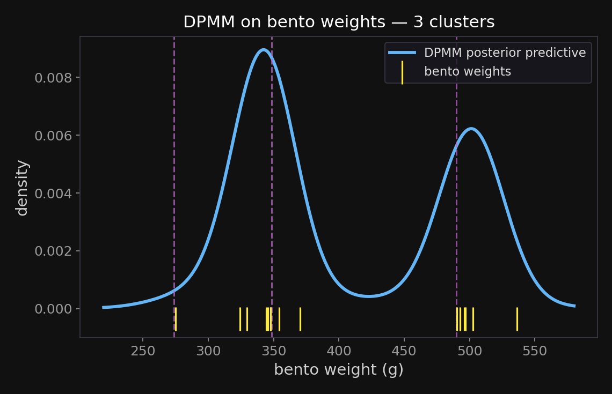{fig-align="center"}
:::
:::

[~10 lines of GenJAX *is* the model; a slice-Gibbs sampler then infers **K from the data** — **3 clusters** here, the lone **275 g** bento on its own table. Full script: `genjax_dpmm.py`.]{.lang-en .dim}[GenJAX約10行が**モデルそのもの**。スライス・ギブズが**データからK**を推論 — ここでは**3クラスタ**、孤立した**275g**は独立したテーブルに。全スクリプト：`genjax_dpmm.py`。]{.lang-ja .dim}

::: {.notes}
The "make as much as possible runnable GenJAX" payoff: the two-line generative story from earlier in the block IS, verbatim, this probabilistic program. Stick-breaking is a prior over (here truncated-K) clusters; each cluster gets a Gaussian center mu_k; each bento picks a table z_i from the stick weights and draws its weight x_i from that table's Gaussian. The "@ name" addresses each random choice so we can condition on the observed weights and run inference. The figure IS that inference — a slice-sampled Gibbs sampler discovers 3 clusters from the bento weights (Hamburger ~350 g, Tonkatsu ~500 g, and the lone 275 g outlier on its own small table); K was never fixed. The full validated script is genjax_dpmm.py, reused in the Phase-2 textbook chapter. This is the static version of what Widget 1 runs live.
:::

# [One machine, many models]{.lang-en}[一つの仕組みで多くのモデル]{.lang-ja} {.section-break background-image="../../sds-reveal/sds_frame.png" background-size="cover"}

::: {.notes}
Block 6. The real power of the DP isn't clustering bento weights — it's that "replace a finite parameter with a random measure" is a recipe that generates many models. Show it with a topic-model toy and name the feature-learning sibling.
:::

## [The building-block recipe]{.lang-en}[構成要素のレシピ]{.lang-ja}

::: {.lang-en}
The move is always the same:

> Take a model with a **finite parameter** (a fixed list of clusters / topics / features) and **replace it with a random measure** (a DP, or a cousin) so that list can **grow with the data**.

- cluster means → **DPMM** *(this lecture)*
- topics → **HDP topic models**
- features → **Indian Buffet Process**
- the **likelihood stays the same** — only the prior over "how many" changes
:::

::: {.lang-ja}
動きはいつも同じ：

> **有限パラメータ**（クラスタ／トピック／特徴の固定リスト）を持つモデルを取り、そのリストが**データとともに増える**よう**ランダム測度**（DPやその仲間）で**置き換える**。

- クラスタ平均 → **DPMM** *(今回の講義)*
- トピック → **HDPトピックモデル**
- 特徴 → **インド料理ビュッフェ過程**
- **尤度はそのまま** — 変わるのは「いくつ」の事前分布だけ
:::

::: {.notes}
The general recipe, stated once: take any model with a finite parameter — a fixed list of clusters, topics, or features — and replace that list with a random measure (a DP or a relative) so the list can grow with the data. Cluster means give the DPMM; topics give hierarchical-DP topic models; features give the Indian Buffet Process. Same move, different finite parameter. The next slides make the topic-model case concrete.
:::

## [Topics emerging from a corpus]{.lang-en}[コーパスから現れるトピック]{.lang-ja} {.big-figure}

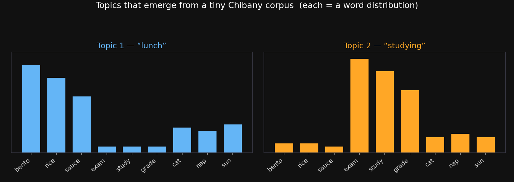{fig-align="center" width="86%"}

::: {.lang-en}
A **topic** is a distribution over words. Given a tiny corpus, the model discovers that documents mix a **"lunch"** topic (bento, rice, sauce) and a **"studying"** topic (exam, study, grade) — without being told the topics in advance.
:::

::: {.lang-ja}
**トピック**は単語上の分布。小さなコーパスから、モデルは文書が**「昼食」**トピック（弁当・ご飯・ソース）と**「勉強」**トピック（試験・勉強・成績）を混ぜていることを、事前に教えられずに発見する。
:::

::: {.notes}
Make topics concrete before naming LDA. A topic is just a distribution over words. Point at the two bars: from a tiny Chibany corpus the model recovers a "lunch" topic (bento/rice/sauce) and a "studying" topic (exam/study/grade), and each document is a mix of them — discovered, not specified. Each document is generated by repeatedly picking a topic, then a word from that topic. Now name the model and make the parametric-vs-nonparametric correction.
:::

## [LDA, and its nonparametric version]{.lang-en}[LDAとそのノンパラメトリック版]{.lang-ja}

::: {.columns}
::: {.column width="50%"}
::: {.lang-en}
**LDA** — *parametric*
(Blei, Ng & Jordan 2003)

- each document = a mix of topics
- each topic = a distribution over words
- **K (number of topics) is fixed**
- a *finite-Dirichlet* model
:::
::: {.lang-ja}
**LDA** — *パラメトリック*
（Blei, Ng & Jordan 2003）

- 各文書 = トピックの混合
- 各トピック = 単語上の分布
- **K（トピック数）は固定**
- *有限ディリクレ*モデル
:::
:::
::: {.column width="50%"}
::: {.lang-en}
**HDP-LDA** — *nonparametric*
(Teh et al. 2006)

- apply the recipe to LDA
- a shared top-level DP = a **reusable menu of topics**
- number of topics **grows with the data**
:::
::: {.lang-ja}
**HDP-LDA** — *ノンパラメトリック*
（Teh et al. 2006）

- LDAにレシピを適用
- 共有上位DP = **再利用可能なトピックのメニュー**
- トピック数が**データとともに増える**
:::
:::
:::

::: {.notes}
The precise correction — this is a spot the first delivery got fuzzy. LDA (Blei, Ng & Jordan 2003) is the workhorse topic model, but it is PARAMETRIC: K, the number of topics, is fixed up front — it's a finite-Dirichlet model. The nonparametric version is the HDP topic model (Teh et al. 2006): a hierarchical Dirichlet process where a shared top-level DP acts as a reusable menu of topics, drawn on by every document, and the number of topics grows with the data. So LDA is the finite model; HDP-LDA is where the recipe makes it nonparametric. Don't call LDA itself nonparametric.
:::

## [The feature sibling: the IBP]{.lang-en}[特徴の兄弟：IBP]{.lang-ja}

::: {.lang-en}
The DP gives each item **one** cluster. What if an item can have **many** features at once (a face has glasses *and* a hat *and* a beard)?

- The **Indian Buffet Process (IBP)** is the feature version: a prior over binary item-by-feature matrices, with the number of features **unbounded** (Griffiths & Ghahramani; the instructor's own line of work).
- Same spirit, different finite parameter. *(Cousins: HDP-HMM for sequences, Pitman–Yor for power-law vocabularies.)*
:::

::: {.lang-ja}
DPは各項目に**一つ**のクラスタを与える。項目が同時に**多くの**特徴を持てたら？（顔は眼鏡*かつ*帽子*かつ*髭を持ちうる）

- **インド料理ビュッフェ過程（IBP）**は特徴版：項目×特徴の二値行列の上の事前分布で、特徴数は**上限なし**（Griffiths & Ghahramani；担当教員自身の研究領域）。
- 同じ精神、異なる有限パラメータ。*（仲間：系列にHDP-HMM、べき則語彙にPitman–Yor。）*
:::

::: {.notes}
Compress the feature-learning thread to one slide (it used to be the whole back half). The DP assigns each item to ONE cluster; but often an item has MANY features at once — a face has glasses and a hat and a beard. The Indian Buffet Process is the feature analogue: a prior over binary item-by-feature matrices with an unbounded number of features (Griffiths & Ghahramani; this is my own research area, so ask me if you're curious). Same recipe — replace a finite feature list with a random measure. Name the cousins in passing — HDP-HMM for sequences, Pitman–Yor for power-law/Zipfian vocabularies — and move on to GPs.
:::

# [Gaussian processes & the modern tail]{.lang-en}[ガウス過程と現代的な発展]{.lang-ja} {.section-break background-image="../../sds-reveal/sds_frame.png" background-size="cover"}

::: {.notes}
Block 7. The DP put a prior over discrete things (partitions). The Gaussian process puts a prior over continuous functions — the nonparametric idea that most shaped modern ML, and the bridge to neural networks.
:::

## [A prior over functions]{.lang-en}[関数の上の事前分布]{.lang-ja} {.big-figure}

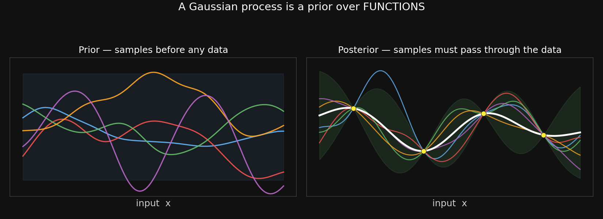{fig-align="center" width="88%"}

::: {.lang-en}
A **Gaussian process (GP)** is a prior over **functions**. Before data, samples wiggle everywhere (left). Condition on a few points and every sample must pass through them; uncertainty shrinks near data, grows far from it (right). Capacity grows with data — nonparametric, for regression.
:::

::: {.lang-ja}
**ガウス過程（GP）**は**関数**の上の事前分布。データ前は標本がいたる所で揺れる（左）。数点で条件付けると全ての標本がそれらを通り、不確実性はデータ近くで縮み、遠くで広がる（右）。容量がデータとともに増える — 回帰のためのノンパラメトリック。
:::

::: {.notes}
The GP, made visual. A Gaussian process is a prior over functions. Left panel: before data, samples wiggle freely within the prior band. Right panel: condition on four points and every posterior sample is forced through them, with uncertainty collapsing near the data and ballooning away from it. That's exactly Bayesian regression where the unknown is a whole function, not a fixed parameter vector — so capacity grows with the data. Rasmussen & Williams (2006) is the reference. Next: the kernel, and the callback to KDE.
:::

## [Kernels — the shape of "nearby"]{.lang-en}[カーネル — 「近さ」の形]{.lang-ja}

::: {.lang-en}
A GP is defined by its **kernel** $k(x,x')$ — how strongly two inputs' outputs are correlated. A common choice ties nearby inputs to similar outputs (smoothness).

Callback: this is the **same kernel idea** as the KDE bandwidth in Widget 1 — "how far does the influence of a point reach?"
:::

::: {.lang-ja}
GPは**カーネル** $k(x,x')$ で定まる — 二つの入力の出力がどれだけ強く相関するか。よくある選択は近い入力を似た出力に結ぶ（滑らかさ）。

復習：これはウィジェット1のKDEバンド幅と**同じカーネルの考え** — 「点の影響はどこまで届くか」。
:::

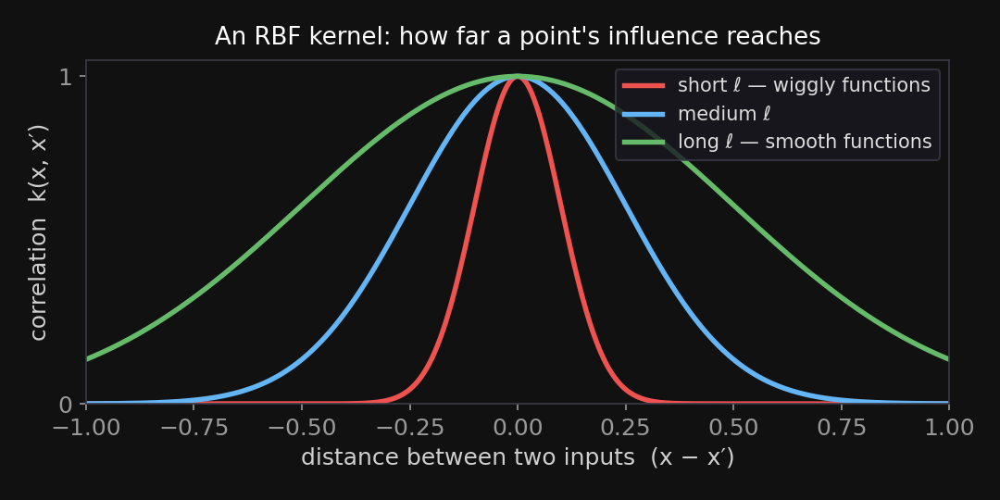{fig-align="center" width="58%"}

::: {.notes}
The kernel is the one design choice in a GP: k(x, x') sets how correlated the outputs at two inputs are, which controls smoothness and length-scale. Tie it back explicitly to the KDE bandwidth in Widget 1 — both are answering "how far does a data point's influence reach?" Students saw the bandwidth slider; this is the same idea, now defining a prior over functions. Keep it short; the meat of the modern tail is next.
:::

## [GP → neural networks]{.lang-en}[GP → ニューラルネット]{.lang-ja}

::: {.columns}
::: {.column width="50%"}
::: {.lang-en}
- **Neal (1996):** a one-layer net with infinitely many hidden units, random weights, **is exactly a GP**.
- **NNGP (Lee et al. 2018):** the same holds for *deep* nets at initialization — a deep net = a GP with a particular kernel.
:::
::: {.lang-ja}
- **Neal (1996)：** 隠れユニット無限の1層ネット（ランダム重み）は**ちょうどGP**。
- **NNGP（Lee et al. 2018）：** 同じことが*深い*ネットの初期化時にも成り立つ — 深層ネット = 特定カーネルのGP。
:::
:::
::: {.column width="50%"}
::: {.lang-en}
- **NTK (Jacot et al. 2018):** while a very wide net is *trained by gradient descent*, it behaves like a (different) fixed-kernel method.
- **NNGP** = the net *at init* (Bayesian inference is a GP); **NTK** = the net *during training*. Caveat: both omit feature learning.
:::
::: {.lang-ja}
- **NTK（Jacot et al. 2018）：** 非常に広いネットを*勾配降下で訓練*する間、（別の）固定カーネル法のように振る舞う。
- **NNGP** = *初期化時*のネット（ベイズ推論がGP）、**NTK** = *訓練中*のネット。注意：どちらも特徴学習を無視。
:::
:::
:::

::: {.notes}
The GP–NN bridge, kept precise — this is where it's easy to blur NNGP and NTK, so go slow and, for each, name what is random, what the limit is, and what it describes.

NEAL 1996 (shallow, Bayesian). A one-hidden-layer net f(x) = b + Σ_j v_j·φ(w_j·x + a_j), with iid zero-mean priors on the weights and var(v_j) = σ_v²/H. For any finite set of inputs, f is a sum of H iid terms, so by the CENTRAL LIMIT THEOREM it becomes jointly Gaussian as H → ∞ — i.e. a draw from a GP, with kernel K(x,x') = σ_b² + σ_v²·E_w[φ(w·x+a)φ(w·x'+a)] (closed form for erf → Williams 1997; ReLU → arc-cosine, Cho–Saul 2009). Punchline: a Bayesian net with infinitely many hidden units IS a GP — its function-space prior is a GP.

NNGP (Lee et al. 2018; Matthews et al. 2018) — Neal, but deep. Take an L-layer net with iid random weights (the prior = the net AT INITIALIZATION) and send EVERY hidden layer's width → ∞. The output is again a GP, with a kernel built by a layer recursion K^{(ℓ+1)} = σ_b² + σ_w²·E_{u~GP(0,K^{(ℓ)})}[φ(u(x))φ(u(x'))] (for ReLU, the arc-cosine kernel composed L times). So a wide deep net at init = a GP, and exact Bayesian posterior inference in it = GP regression with the NNGP kernel. This is the BEFORE-training / Bayesian object; it says nothing about gradient descent.

NTK (Jacot et al. 2018) — what gradient descent does. Now actually TRAIN a very wide net by GD from random init. In the infinite-width limit the weights barely move ("lazy training"), so the net is well-approximated by its first-order Taylor expansion around init — LINEAR in the parameters. Under that linearization, GD on the net = kernel regression with the Neural Tangent Kernel Θ(x,x') = ∇_θf(x;θ_0)·∇_θf(x';θ_0), which in the limit is DETERMINISTIC and CONSTANT throughout training. So training a huge net ≈ kernel ridge(-less) regression with a fixed kernel — a DIFFERENT kernel from the NNGP one (it carries every layer's gradient contribution).

The clean contrast: NNGP = the net's function-space PRIOR / Bayesian posterior (the net at init); NTK = the kernel governing GRADIENT-DESCENT TRAINING. Both are fixed-kernel, infinite-width "lazy" pictures with NO FEATURE LEARNING — the hidden representations never move. That's the gap: real finite nets adapt their features (mean-field / µP regimes — Chizat–Bach 2019, Yang–Hu 2021), which is widely believed to be why they beat their own kernel limits on hard tasks. The kernels are an exact description of the wide-net limit and a deliberately incomplete model of what makes deep learning work. Tie back to Block 1: this is the same lazy/wide-net, fixed-kernel world as our random-feature NN widget — and we'll bring it home in the closing synthesis, where it's literally the right-hand (p → ∞) end of the double-descent curve.
:::

## [Nonparametrics in today's AI]{.lang-en}[今日のAIの中のノンパラメトリクス]{.lang-ja}

::: {.lang-en}
- **Neural processes** (Garnelo et al. 2018): neural nets trained to do GP-like prediction with uncertainty, at scale.
- **Nonparametric memory:** **RAG** and **kNN-LM** (Lewis et al. 2020; Khandelwal et al. 2020) let a model **look things up** in a store that grows with data — capacity in the *data*, not the weights.
- Through-line: *let capacity grow with the data* — the idea scaling laws gesture at.
:::

::: {.lang-ja}
- **ニューラル過程**（Garnelo et al. 2018）：GPのような不確実性付き予測を大規模に行うよう訓練したニューラルネット。
- **ノンパラメトリック記憶：** **RAG** と **kNN-LM**（Lewis et al. 2020；Khandelwal et al. 2020）はデータとともに増える蓄積を**参照**させる — 容量を*重み*ではなく*データ*に。
- 一貫した筋：*容量をデータとともに増やす* — スケーリング則が示唆する考え。
:::

::: {.notes}
Bring it to the present so the idea doesn't feel historical. Neural processes (Garnelo et al. 2018): neural nets trained to produce GP-like predictions with calibrated uncertainty, but scalable. Nonparametric memory: retrieval-augmented generation (RAG) and kNN language models (Lewis et al. 2020; Khandelwal et al. 2020) let a model look up relevant items from a store that grows with the data — putting capacity in the data rather than the weights, which is literally the nonparametric idea applied to LLMs. The through-line for the whole week: let capacity grow with the data. That's the principle scaling laws gesture at without naming. Now close the loop.
:::

# [The one picture]{.lang-en}[一枚の絵]{.lang-ja} {.section-break background-image="../../sds-reveal/sds_frame.png" background-size="cover"}

::: {.notes}
Block 8. Pull the whole day into one frame and reconnect it to the Block-1 question.
:::

## [Parametric → nonparametric → BNP]{.lang-en}[パラメトリック → ノンパラメトリック → BNP]{.lang-ja}

::: {.lang-en}
- We asked: **how complex should the model be?** The Bayesian-nonparametric answer is *don't fix it — put a prior over all complexities and let the data decide.*
- **One machine** — a prior over partitions / measures / functions — reused everywhere: clusters (DPMM), topics (HDP), features (IBP), functions (GP).
- The concentration $\alpha$ (or the GP kernel) is the dial that says *how eagerly* to grow.
:::

::: {.lang-ja}
- 問いは：**モデルはどれだけ複雑であるべきか？** ベイズ・ノンパラメトリックの答えは*固定するな — すべての複雑さに事前分布を置き、データに決めさせよ*。
- **一つの仕組み** — 分割／測度／関数の上の事前分布 — があらゆる場所で再利用される：クラスタ（DPMM）、トピック（HDP）、特徴（IBP）、関数（GP）。
- 集中度 $\alpha$（やGPカーネル）が*どれだけ意欲的に*育てるかを定めるダイヤル。
:::

::: {.notes}
The closing synthesis. Reconnect to Block 1: "how complex should the model be?" The BNP answer is don't fix it — put a prior over all complexities and let the data decide. One machine — a prior over partitions, measures, or functions — reused across clusters (DPMM), topics (HDP), features (IBP), and functions (GP). The concentration α (or the GP kernel) is the single dial for how eagerly to grow. That's the unifying picture; say it slowly.
:::

## [It all comes home: one curve, the whole week]{.lang-en}[全部つながる：一本の曲線に週の全て]{.lang-ja} {.big-figure .bih}

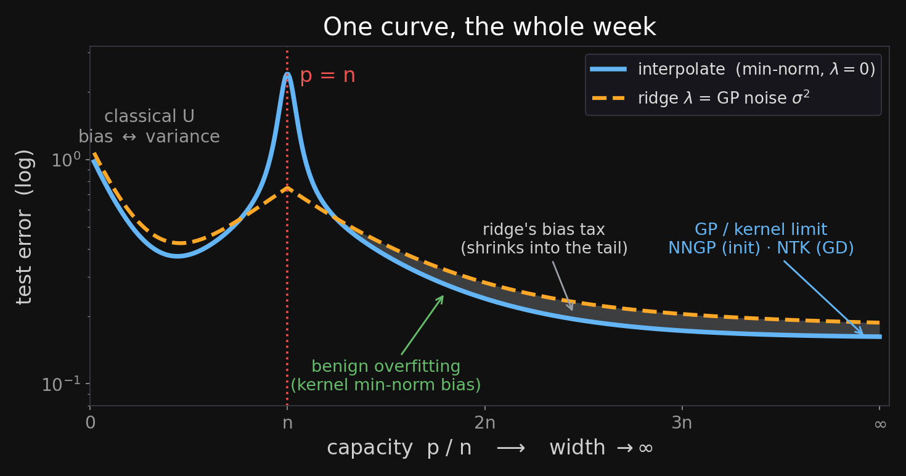{fig-align="center"}

[The grey gap is **ridge's bias tax**: a little **bias** kills the **variance** spike at $p=n$.]{.lang-en .dim}[灰色の差は**リッジのバイアス税** — わずかな**バイアス**で $p=n$ の**バリアンス**急上昇を消す。]{.lang-ja .dim}

::: {.notes}
The figure IS the synthesis — walk it left to right, naming each region by where we met it this week: the classical U (bias vs variance, Block 1); the interpolation spike at p = n; the benign second descent (min-norm bias, the double-descent coda); and the far-right p → ∞ end, which by NNGP/NTK IS a GP / kernel machine.

Be honest about the two curves — ridge / σ² is NOT a free lunch everywhere. The grey gap is its BIAS TAX: explicit shrinkage buys lower variance by adding a little bias. It pays off enormously at p = n, where the min-norm solution's variance explodes — there the dashed ridge curve is far BELOW the blue spike. And it costs almost nothing far out, because the min-norm interpolator's IMPLICIT ℓ2 bias already regularizes there — so the gap shrinks toward the tail. (Tune λ per capacity and ridge never hurts; a single fixed λ set to tame the spike is just slightly strong in the overparameterized tail.) That's the bias-variance tradeoff one more time: regularize when you're variance-limited, which is exactly near the interpolation peak. Then advance to the three-answers slide that names the ties explicitly.
:::

## [One question, three answers — the GP holds all three]{.lang-en}[一つの問い、三つの答え — GPが全てを含む]{.lang-ja}

::: {.lang-en}
- **GP = kernel ridge.** posterior mean $=k_*^\top(K+\sigma^2 I)^{-1}y$ — the noise **$\sigma^2$ *is* the ridge $\lambda$** (the explicit twin from Block 1).
- **Kernel = inductive bias.** the lengthscale sets your spot on the bias–variance curve; the **marginal likelihood** picks it → *let the data decide* (the BNP thesis).
- **Wide net = GP.** NNGP (at init) · NTK (under GD): the **second-descent floor is the kernel limit**, and benign overfitting is the kernel's min-norm bias.
- **Three answers, one question.** regularize (**ridge**) · grow capacity (**BNP**) · prior over functions (**GP**) — and the GP contains all three.
:::
::: {.lang-ja}
- **GP = カーネルリッジ。** 事後平均 $=k_*^\top(K+\sigma^2 I)^{-1}y$ — ノイズ **$\sigma^2$ がリッジ $\lambda$ そのもの**（第1部の明示的な双子）。
- **カーネル = 帰納バイアス。** 長さスケールがバイアス・バリアンス曲線上の位置を決め、**周辺尤度**が選ぶ → *データに決めさせる*（BNPの主張）。
- **広いネット = GP。** NNGP（初期化）· NTK（勾配降下）：**二度目の降下の床がカーネル極限**、良性過適合はカーネルの最小ノルム・バイアス。
- **三つの答え、一つの問い。** 正則化（**リッジ**）· 容量を増やす（**BNP**）· 関数の事前分布（**GP**）— GPが三つすべてを含む。
:::

::: {.notes}
The four ties, said slowly — each reconnects the GP to an earlier block. (1) The GP posterior mean k*(K+σ²I)⁻¹y IS kernel ridge regression with λ = σ²: the GP's observation noise is literally the ridge knob from the explicit-twin slide. (2) The kernel is the inductive bias — lengthscale = where you sit on the bias-variance curve — and the marginal likelihood (Bayesian Occam) picks it: the same "let the data decide" as Bayesian nonparametrics. (3) By NNGP/NTK an infinitely-wide net is a GP, so the second-descent floor on the previous slide is the kernel limit's test error, and benign overfitting is the kernel's min-norm bias. (4) So the three answers to "how complex?" — regularize (ridge), grow capacity (BNP), prior over functions (GP) — are one object: the GP contains all three. That's the close before the wrap-up.
:::

## [Where this leaves us]{.lang-en}[まとめ]{.lang-ja}

::: {.lang-en}
- Bias-variance is **half** the story; double descent + implicit/explicit priors complete it — and that *prior* is the thread into Bayesian nonparametrics.
- BNP: **let the model grow with the data**, under a prior with one interpretable dial.
- Next week: **contemporary ML** — where these ideas (priors, capacity, scale) meet large models.
- *Play with the four widgets — that's the homework that isn't graded.*
:::

::: {.lang-ja}
- バイアス・バリアンスは物語の**半分** — 二重降下＋暗黙／明示の事前分布が完成させ、その*事前分布*がベイズ・ノンパラメトリクスへの糸。
- BNP：**データとともにモデルを育てる** — 解釈可能なダイヤルを一つ持つ事前分布の下で。
- 来週：**現代の機械学習** — これらの考え（事前分布・容量・規模）が大規模モデルと出会う場所。
- *4つのウィジェットで遊んでみよう — 採点されない宿題。*
:::

::: {.notes}
Close. Three beats: (1) bias-variance was half the story — double descent plus implicit/explicit priors complete it, and that prior is the thread that runs into Bayesian nonparametrics; (2) BNP in one line — let the model grow with the data under a prior with one interpretable dial; (3) look ahead to the contemporary-ML weeks, where priors/capacity/scale meet large models. End by nudging them to actually open and play with the four widgets — that's the ungraded homework, and the reason the lecture was recorded. Done.
:::
