## [Housekeeping]{.lang-en}[事務連絡]{.lang-ja}

::: {.lang-en}
- **Today's paper presentation** kicks us off — then the lecture.
- **Due TONIGHT, 8 PM:** the **Reinforcement Learning** assignment **and** the **Monte Carlo** assignment.
- **Final-project presentations:** next week (Week 12, Jul 17) — bring a laptop.
- Two new widgets today — I'll drive them live, and they're linked from the slides to replay.
:::

::: {.lang-ja}
- **本日は論文発表**から始めます — その後に講義。
- **本日20:00締切：** **強化学習**課題**と**モンテカルロ課題。
- **最終プロジェクト発表：** 来週（第12週・7月17日）— ノートPCを持参。
- 本日は新しいウィジェットが2つ — ライブで操作します。スライドからリンクされています。
:::

::: {.notes}
Paper presentation first (~15 min) — the presenting student drives their own slides; this deck resumes after. Both RL and MC assignments are due tonight at 8. Final-project presentations are next week — remind them to bring laptops. Two live widgets today. Keep housekeeping to 30 seconds.
:::

## [Paper presentation]{.lang-en}[論文発表]{.lang-ja} {.section-break background-image="../../sds-reveal/sds_frame.png" background-size="cover"}

::: {.notes}
Holder slide — the presenting student takes over with their own slides (~15 min + a few min discussion). Advance past this into the recap when they finish. Timing note: this pushes the lecture ~15 min tighter than the agenda's 1:50 end; the drop-if-long candidates are the RNN slide (Block 5 — its only job is the attention cliffhanger) and the emergence "mirage" caveat (Block 6, skippable live, kept for the recording). Protect the vectors interlude, the matrices interlude, and the ICL debate.
:::

## [Agenda]{.lang-en}[本日の予定]{.lang-ja} {.agenda .dense}

- [**Where we left off** — from fixed kernels to *learned features*]{.lang-en}[**前回の続き** — 固定カーネルから*学習された特徴*へ]{.lang-ja}  [0:05]{.time}
- [**Represent I** — connectionism, distributed reps & **vectors, concretely**]{.lang-en}[**表現 I** — コネクショニズム・分散表現・**具体的なベクトル**]{.lang-ja}  [0:17]{.time}
- [**Learn I** — perceptron, gradient descent, the delta rule]{.lang-en}[**学習 I** — パーセプトロン・勾配降下・デルタ則]{.lang-ja}  [0:43]{.time}
- [**Learn II** — **matrices**, XOR, depth, and backpropagation]{.lang-en}[**学習 II** — **行列**・XOR・深さ・誤差逆伝播]{.lang-ja}  [1:01]{.time}
- [**Represent II** — architecture as prior: CNN → RNN → **attention**]{.lang-en}[**表現 II** — 事前分布としてのアーキテクチャ：CNN → RNN → **アテンション**]{.lang-ja}  [1:23]{.time}
- [**Understand** — scaling, emergence, **in-context learning**]{.lang-en}[**理解** — スケーリング・創発・**文脈内学習**]{.lang-ja}  [1:36]{.time}
- [**Where this leaves us** — one question, four answers]{.lang-en}[**まとめ** — 一つの問い、四つの答え]{.lang-ja}  [1:50]{.time}

::: {.lang-en}
[Times are lecture-clock, after the paper presentation.]{.dim}
:::
::: {.lang-ja}
[時刻は論文発表後の講義開始からの目安です。]{.dim}
:::

::: {.notes}
The spine for the day. ONE question runs through it — "where does the hypothesis space come from?" Week 10 gave three answers and stopped at "infinite-width nets are GPs with a FIXED kernel." Today is the fourth answer: LEARN the features. The three middle words — Represent, Learn, Understand — are the three questions we ask of that one machine; I'll point at the same master diagram each block. Don't linger. (Agenda times are lecture-relative; the paper presentation runs before all this.)
:::

# [Where we left off]{.lang-en}[前回の続き]{.lang-ja} {.section-break background-image="../../sds-reveal/sds_frame.png" background-size="cover"}

::: {.notes}
Block 1. Reconnect to Week 10, run two fast recap polls that bridge forward, then name the organizing frame for the whole day. Keep the section break to one breath.
:::

## [Quick poll — do nonparametric models have parameters?]{.lang-en}[小テスト — ノンパラメトリックモデルにパラメータはある？]{.lang-ja} {.poll-slide}

::: {.lang-en}
Last week: **Bayesian nonparametric** models (CRP, Dirichlet process, GPs). Do they have parameters?
:::
::: {.lang-ja}
先週：**ベイズ・ノンパラメトリック**モデル（CRP・ディリクレ過程・GP）。パラメータはある？
:::

::: {.fragment}
::: {.lang-en}
- **A.** Yes — infinitely many
- **B.** Yes — just a few
- **C.** No — it's called *non*parametric for a reason
:::
::: {.lang-ja}
- **A.** ある — 無限個
- **B.** ある — 少数だけ
- **C.** ない — だから*ノン*パラメトリック
:::
:::

::: {.notes}
Commit before reveal. Sourced from the SP25 "Intro to Bayes Nonparametrics" quiz (Q1, gf28c347…). The point of opening here: "infinitely many parameters" is exactly the mindset we need today — modern nets are wildly overparameterized, and Week 10 already showed us (via NNGP/NTK) that the infinite-width limit is a GP. Hold the answer to the next slide.
:::

## [Reveal]{.lang-en}[答え]{.lang-ja} {.poll-reveal}

[**A — infinitely many.**]{.lang-en .yellow}[**A — 無限個。**]{.lang-ja .yellow}

::: {.lang-en}
A nonparametric model doesn't *fix* how many parameters it has — it lets the number **grow with the data**. Hold that thought: today's networks are also enormous, and last week we saw the infinite-width limit *is* a Gaussian process.
:::
::: {.lang-ja}
ノンパラメトリックモデルはパラメータ数を*固定しない* — データとともに**増やす**。この発想を覚えておいて：今日のネットワークも巨大で、先週見たように無限幅の極限は*まさに*ガウス過程だった。
:::

::: {.notes}
"Nonparametric" = capacity grows with data, not "no parameters." The bridge to today: overparameterization is the norm now, and we already have a Bayesian handle on its limit (GP). One beat, move on.
:::

## [Quick poll — which is NOT parametric?]{.lang-en}[小テスト — パラメトリックでないのは？]{.lang-ja} {.poll-slide}

::: {.lang-en}
Which of these is **not** a parametric model?
:::
::: {.lang-ja}
次のうち**パラメトリックでない**のはどれ？
:::

::: {.fragment}
::: {.lang-en}
- **A.** a 3-cluster Gaussian mixture
- **B.** a single Gaussian
- **C.** a kernel / exemplar method
:::
::: {.lang-ja}
- **A.** 3クラスタのガウス混合
- **B.** 単一のガウス分布
- **C.** カーネル法・事例ベース法
:::
:::

::: {.notes}
Fast one. SP25 BNP quiz, Q3. C is correct — a kernel method keeps the data around; its "parameters" are the examples. Bridge: Week 10 ended on "a wide net trained by gradient descent behaves like a fixed-kernel method" (NTK). Today we ask what happens when the kernel is NOT fixed — when the features are learned.
:::

## [Reveal]{.lang-en}[答え]{.lang-ja} {.poll-reveal}

[**C — kernel / exemplar methods.**]{.lang-en .yellow}[**C — カーネル法・事例ベース法。**]{.lang-ja .yellow}

::: {.lang-en}
A kernel method's "parameters" *are* the stored examples. Week 10's punchline: an **infinitely wide net** trained by gradient descent behaves like a **fixed-kernel** method (the **NTK**). So the natural next question —
:::
::: {.lang-ja}
カーネル法の「パラメータ」は保存された事例*そのもの*。先週の要点：**無限幅**のネットを勾配降下で訓練すると**固定カーネル**法のように振る舞う（**NTK**）。ならば次の問いは —
:::

::: {.notes}
Land the NTK callback (accurate — Week 10 taught NNGP at init and NTK during training). Then pose the pivot the whole lecture answers: what if the kernel is not fixed? That is the one thing GPs, ridge, and BNP could not do — learn the features. Straight into the master frame.
:::

## [The question the whole course has been asking]{.lang-en}[この講義全体が問うてきたこと]{.lang-ja}

::: {.lang-en}
**Where does the hypothesis space come from?** Week 10 gave *three* answers — and all three fix the features (the kernel) in advance.

- **Penalize complexity** → ridge  ·  **grow with the data** → Bayesian nonparametrics  ·  **prior over functions** → Gaussian processes
:::
::: {.lang-ja}
**仮説空間はどこから来るのか？** 先週は*三つ*の答え — そのどれもが特徴（カーネル）を事前に固定する。

- **複雑さを罰する** → リッジ  ·  **データとともに増やす** → ベイズ・ノンパラメトリクス  ·  **関数上の事前分布** → ガウス過程
:::

::: {.fragment}
[**Today: the fourth answer — *learn the features themselves.***]{.lang-en .yellow}[**今日：四つ目の答え — *特徴そのものを学習する。***]{.lang-ja .yellow}
:::

::: {.notes}
THE naming slide. This is the frame I point back at every block — I do not re-derive it. Three answers from last week all fix the kernel; the neural-network answer is to learn it. Reveal the fourth answer as the yellow punchline. Next slide draws the master picture I'll reuse.
:::

## [One machine, three questions]{.lang-en}[一つの仕組み、三つの問い]{.lang-ja} {.big-figure}

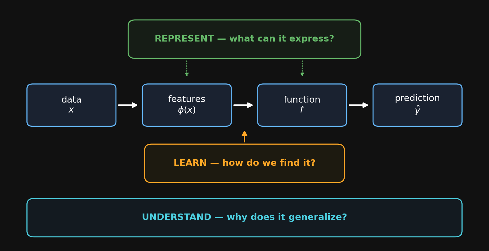{fig-align="center" width="82%"}

::: {.lang-en}
Every model today is this pipeline. We'll light up one question per block: **Represent** (what can it express?), **Learn** (how do we find it?), **Understand** (why does it generalize — and is it secretly Bayesian?).
:::
::: {.lang-ja}
今日のすべてのモデルはこのパイプライン。ブロックごとに一つの問いを点灯する：**表現**（何を表せる？）・**学習**（どう見つける？）・**理解**（なぜ汎化する — 実は密かにベイズ的？）。
:::

::: {.notes}
The master diagram. data → features → function → prediction, with three question-regions. Everything else today points here. Say it once: the neural-network idea is to make the "features" box LEARNED rather than hand-designed. Keep it tight — this is a map, not a destination.
:::

## [Our standing critic: Lake et al. 2017]{.lang-en}[常設の批評者：Lake et al. 2017]{.lang-ja}

::: {.lang-en}
This week's reading — *Building machines that learn and think like people* — is the **"what's missing from deep learning"** case. We'll keep a running **scorecard**: does each idea today address the critique, or dodge it?

- Their asks: **compositionality**, **causality**, **learning-to-learn**, **intuitive physics/psychology**.
:::
::: {.lang-ja}
今週の課題論文 — *人間のように学び考える機械をつくる* — は**「深層学習に何が欠けているか」**の主張。**採点表**を持ち歩く：今日の各アイデアはこの批判に答えるか、かわすか？

- 彼らの要求：**構成性**・**因果性**・**学習の学習**・**直観物理/心理**。
:::

[The charge isn't new: Lake et al. modernize **Fodor & Pylyshyn (1988)**, who argued neural nets lack the **systematicity** of symbolic thought — anyone who can think "John loves Mary" can also think "Mary loves John." A **2025** re-test at the end asks whether today's models close the gap.]{.lang-en .dim}[この批判は新しくない：Lake らは **Fodor & Pylyshyn (1988)** — ニューラルネットは記号的思考の**体系性**を欠くという主張 — を現代化したもの。最後に **2025年**の再検証で、今のモデルがその差を埋めたかを問う。]{.lang-ja .dim}

::: {.notes}
Set up the critical spine. Lake et al. is the required reading and the honest counterweight to hype — we teach the machinery AND ask whether it does what the critique says minds do. Name the lineage (fact-check rule): Lake et al. 2017 is the deep-learning-era restatement of the classic connectionism critique — Fodor & Pylyshyn (1988), "Connectionism and cognitive architecture," on systematicity/compositionality. I revisit this scorecard in the Represent block, the ICL block, and the close — where a 2025 multimodal re-test (Schulze Buschoff et al.) supplies fresh evidence. This is the "teach it critically" stance across a 1988 → 2017 → 2025 arc, not a rubber stamp.
:::

# [Represent I — connectionism]{.lang-en}[表現 I — コネクショニズム]{.lang-ja} {.section-break background-image="../../sds-reveal/sds_frame.png" background-size="cover"}

::: {.notes}
Block 2, REPRESENT. Point at the "features" box of the master map. The idea: cognition (and computation) as the emergent behavior of many simple units — and the payoff is distributed representations, which is what makes learned features special.
:::

## [Emergence: order from simple units]{.lang-en}[創発：単純な要素からの秩序]{.lang-ja}

::: {.columns}
::: {.column width="48%"}
::: {.lang-en}
- A **termite mound** — meters tall, ventilated, temperature-regulated — is built by thousands of termites with **no architect** and no blueprint.
- Each unit follows tiny local rules; the structure is **emergent**.
:::
::: {.lang-ja}
- **シロアリの塚** — 数メートル、換気され、温度調節される — は**設計者なし**で数千匹が作る。
- 各個体は小さな局所ルールに従い、構造は**創発する**。
:::
:::
::: {.column width="52%"}
::: {.lang-en}
**Connectionism** (Parallel Distributed Processing): model cognition as computation over **many interconnected simple units** — each unit's activity depends only on the units feeding it. Loosely neuron-inspired.
:::
::: {.lang-ja}
**コネクショニズム**（並列分散処理）：認知を**多数の相互接続された単純な要素**上の計算としてモデル化 — 各要素の活動は入力元の要素だけに依存する。ゆるくニューロンに着想。
:::
:::
:::

::: {.notes}
The emergence motivation (SP25's honeycomb/termite framing, kept — it's memorable). Define connectionism / PDP here at first use: computation over many simple interconnected units, neuron-inspired but not a neuroscience claim. McClelland/Rumelhart/Hinton 1986 is the origin. Two-column: emergence example beside the definition.
:::

## [The artificial neuron]{.lang-en}[人工ニューロン]{.lang-ja} {.big-figure}

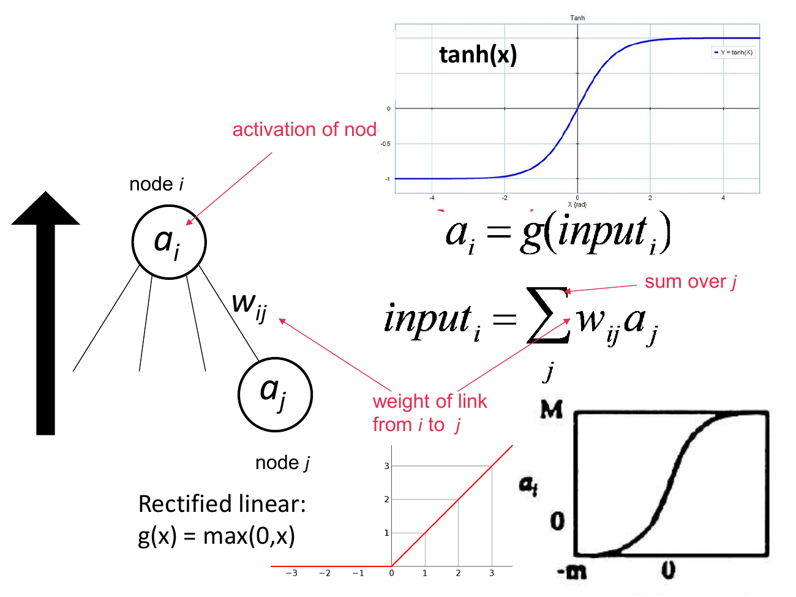{fig-align="center" width="62%"}

::: {.lang-en}
One unit: $a_i = g\!\left(\sum_j w_{ij}\, a_j\right)$ — a **weighted sum** of its inputs, squashed by an **activation function** $g$. The weights $w_{ij}$ are what the network learns.
:::
::: {.lang-ja}
一つの要素：$a_i = g\!\left(\sum_j w_{ij}\, a_j\right)$ — 入力の**重み付き和**を**活性化関数** $g$ で押しつぶす。重み $w_{ij}$ こそネットワークが学習するもの。$\sum$ は総和、$w_{ij}$ は結合重み。
:::

::: {.notes}
Define the neuron equation — first use of Σ in a while, so gloss it (weighted sum) in the JA caption and say it aloud. g = activation function; w_ij = the learned weights. This is the atom; everything scales up from here.
:::

## [Activation functions: a short history]{.lang-en}[活性化関数の小史]{.lang-ja} {.big-figure}

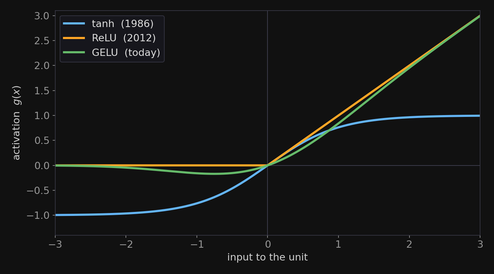{fig-align="center" width="66%"}

::: {.lang-en}
- **tanh / sigmoid** (1980s): smooth, nice derivatives — good for the early learning rules.
- **ReLU** $=\max(0,x)$ (2012–): cheap, doesn't saturate — the deep-learning workhorse.
- **GELU / SiLU** (today): smooth ReLU-like; the standard in transformers.
:::
::: {.lang-ja}
- **tanh / シグモイド**（1980年代）：滑らかで微分が扱いやすい — 初期の学習則に好適。
- **ReLU** $=\max(0,x)$（2012年〜）：安価で飽和しない — 深層学習の主力。
- **GELU / SiLU**（現在）：滑らかなReLU様 — トランスフォーマーの標準。
:::

::: {.notes}
Corrected from the SP25 spoken version (which dated Swish as "last 5 years"): just present GELU/SiLU as today's standard, no fragile dating. The nonlinearity is the whole reason depth buys anything — we'll prove that in the XOR block. g must be nonlinear or the network collapses (Block 4).
:::

## [Distributed representations]{.lang-en}[分散表現]{.lang-ja} {.big-figure}

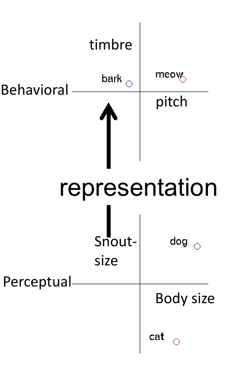{fig-align="center" width="60%"}

::: {.lang-en}
A concept isn't one node — it's a **pattern of activity across many units**. "Cat" and "dog" are nearby points in a feature space (snout size, body size → pitch, timbre).
:::
::: {.lang-ja}
概念は一つのノードではなく、**多数の要素にまたがる活動パターン**。「猫」と「犬」は特徴空間内の近い点（鼻の大きさ・体の大きさ → 音高・音色）。
:::

::: {.notes}
The deck's signature running example (SP25). A concept = a pattern, not a symbol. Two payoffs on the next slide. This is where "learned features" becomes concrete: the network discovers a space in which similar things are near each other.
:::

## [Distributed vs localist — why it matters]{.lang-en}[分散 vs 局在 — なぜ重要か]{.lang-ja}

::: {.columns}
::: {.column width="50%"}
::: {.lang-en}
**Distributed** (a pattern over units):

- **noise tolerance for free** — flip one unit, the pattern survives
- **interpolation** — points between "cat" and "dog" are meaningful
:::
::: {.lang-ja}
**分散**（要素上のパターン）：

- **ノイズ耐性が無料** — 一要素が反転してもパターンは残る
- **補間** — 「猫」と「犬」の中間点も意味を持つ
:::
:::
::: {.column width="50%"}
::: {.lang-en}
**Localist** (one node per concept):

- transparent, but **brittle**
- no natural notion of "between"

The distributed view is what makes **word embeddings** possible.
:::
::: {.lang-ja}
**局在**（概念ごとに一ノード）：

- 透明だが**脆い**
- 「中間」の自然な概念がない

分散的な見方こそが**単語埋め込み**を可能にする。
:::
:::
:::

[📋 Lake scorecard: distributed reps buy **similarity** and **interpolation** — but *not* **compositionality** by themselves.]{.lang-en .dim}[📋 Lake採点表：分散表現は**類似性**と**補間**をもたらすが、それ自体では**構成性**は得られない。]{.lang-ja .dim}

::: {.notes}
Two-column contrast (structural parallelism → columns per the visual-density rule). The payoff — word embeddings — is the bridge two slides ahead, via the vectors interlude, and to Mikolov 2013 (a presentation candidate this week). Lake scorecard #1: distributed reps give similarity and interpolation, but NOT compositionality on their own — mark that. Next: the zero-linear-algebra on-ramp — we've been SAYING "points in a space"; now we make it concrete.
:::

## [Data become vectors]{.lang-en}[データがベクトルになる]{.lang-ja} {.big-figure}

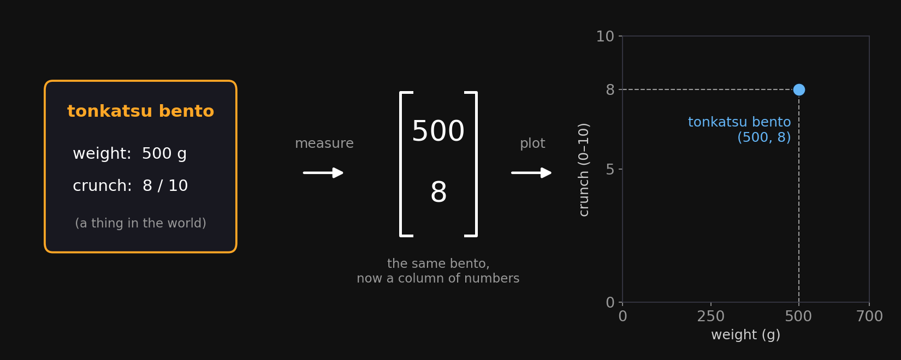{fig-align="center" width="78%"}

::: {.lang-en}
Machines only eat numbers — so **measure**: this bento weighs 500 g, crunch 8/10. The list of measurements $[500, 8]$ is a **vector**; each measurement is a **component**; the number of components is the **dimension**. A 2-D vector *is* a point on a plane — plotting data and "representing" data are the same act.
:::
::: {.lang-ja}
機械は数しか食べない — だから**測る**：この弁当は500g、サクサク度8/10。測定値のリスト $[500, 8]$ が**ベクトル**；各測定値が**成分**；成分の数が**次元**。2次元ベクトルは平面上の点*そのもの* — データを描くことと「表現する」ことは同じ行為。
:::

::: {.notes}
The zero-LA on-ramp begins (students don't have linear algebra — every concept gets a worked number and a picture; textbook prerequisite chapter: deep/vectors-and-spaces). Define vector/component/dimension on the concrete bento. Say it plainly: the cat/dog "feature space" three slides ago WAS this — we just made it honest. No Greek, no generality yet.
:::

## [Similarity is direction: the dot product]{.lang-en}[類似性は方向：内積]{.lang-ja} {.big-figure}

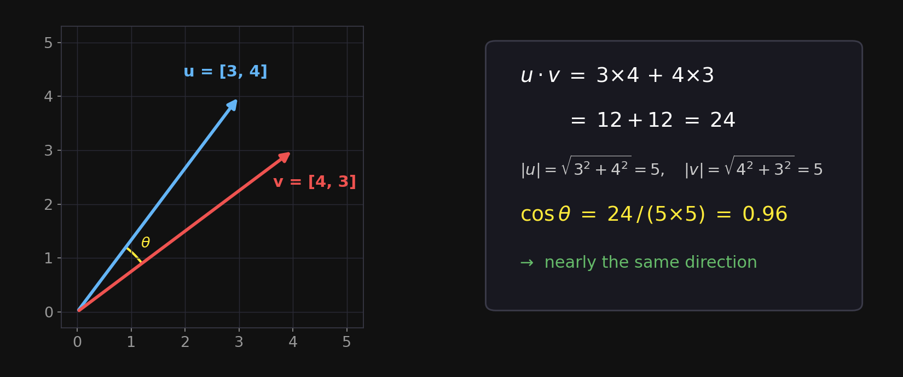{fig-align="center" width="74%"}

::: {.lang-en}
Multiply matching components, add them up: $\mathbf{u}\cdot\mathbf{v} = 3{\times}4 + 4{\times}3 = 24$ — the **dot product**. Divide by the arrows' lengths ($5 \times 5$, by Pythagoras) and you get $0.96$: **cosine similarity** — *pointing the same way* = similar. And look back: the neuron's $\sum_j w_{ij}a_j$ **is a dot product** — every unit scores *how similar its input is to its weights*.
:::
::: {.lang-ja}
対応する成分を掛けて足す：$\mathbf{u}\cdot\mathbf{v} = 3{\times}4 + 4{\times}3 = 24$ — **内積**。矢印の長さ（ピタゴラスで $5 \times 5$）で割ると $0.96$：**コサイン類似度** — *同じ方向を向く* = 似ている。そして振り返ると：ニューロンの $\sum_j w_{ij}a_j$ は**内積そのもの** — どの素子も*入力が自分の重みにどれだけ似ているか*を採点している。
:::

::: {.notes}
Fully worked arithmetic on the slide — no abstraction. Then the retro-link that makes the neuron slide click: the weighted sum IS a dot product, so a unit = a similarity detector for its weight pattern. This one sentence is the highest-leverage LA payoff in the deck. (Length/norm defined via Pythagoras in the figure caption band.)
:::

## [Drive it — bentos as vectors]{.lang-en}[操作してみる — ベクトルとしての弁当]{.lang-ja} {.widget-slide}

<iframe class="widget-frame" src="widgets/vector-space.html"></iframe>

::: {.notes}
Live widget (loads with tonkatsu-A/B preselected: arrows nearly parallel, cosine ≈ 0.99, worked arithmetic shown). Best contrast demo: tonkatsu-B vs salad (cosine ≈ 0.78 — dissimilar); middle case: tonkatsu-B vs hamburger-B (≈ 0.84). Toggle normalize for scale vs direction (mega-katsu vs tonkatsu-A: different lengths, same direction — same KIND). Teachable wart: all-positive features compress cosine upward — tonkatsu-A vs hamburger-A still reads 0.95; real systems center features first. This is the geometry all of today's models live in.
:::

## [Words as vectors: king − man + woman ≈ queen]{.lang-en}[単語をベクトルに：king − man + woman ≈ queen]{.lang-ja} {.big-figure}

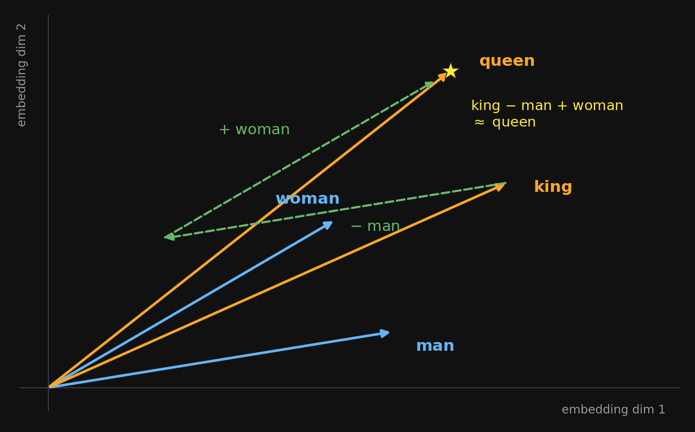{fig-align="center" width="60%"}

::: {.lang-en}
Learn a vector per word from co-occurrence (word2vec, Mikolov et al. 2013) and **analogies become arithmetic**. The features weren't designed — they were **learned**. This is the representational substrate every LLM is built on.
:::
::: {.lang-ja}
共起から単語ごとにベクトルを学習（word2vec, Mikolov et al. 2013）すると**類推が算術になる**。特徴は設計されたのではなく**学習された**。これがすべてのLLMの表現的土台。
:::

::: {.notes}
The word2vec payoff — concrete evidence that learned features capture structure hand-design would miss. Ties to Mikolov 2013 (presentation candidate). Note honestly: analogy arithmetic is real but imperfect and dataset-dependent — don't oversell. This closes REPRESENT I; next we ask how the weights are found.
:::

# [Learn I — the perceptron]{.lang-en}[学習 I — パーセプトロン]{.lang-ja} {.section-break background-image="../../sds-reveal/sds_frame.png" background-size="cover"}

::: {.notes}
Block 3, LEARN. Point at the "how do we find it?" region of the master map. Build the simplest learner (perceptron), then the universal idea underneath it: gradient descent, which we've already met as an idea in Week 10.
:::

## [The perceptron: a linear classifier]{.lang-en}[パーセプトロン：線形分類器]{.lang-ja} {.big-figure}

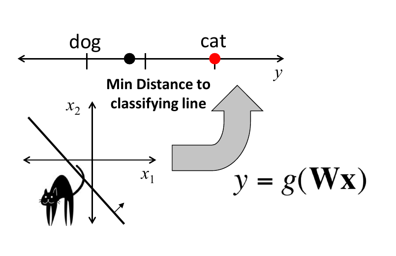{fig-align="center" width="56%"}

::: {.lang-en}
Rosenblatt (1958). Output $y = \operatorname{sign}(\mathbf{w}\cdot\mathbf{x})$ — score the input's **similarity to the weight vector** (the dot product you just met), and $\operatorname{sign}$ reports which side of the **decision line** you're on. Learning = **moving the line**.
:::
::: {.lang-ja}
Rosenblatt (1958)。出力 $y = \operatorname{sign}(\mathbf{w}\cdot\mathbf{x})$ — 入力と**重みベクトルとの類似度**（さっき学んだ内積）を採点し、$\operatorname{sign}$ が**決定線**のどちら側かを報告する。学習とは**線を動かすこと**。
:::

::: {.notes}
Perceptron as the atom-with-a-decision — now stated in the vectors-interlude vocabulary: w·x is a similarity score, the boundary is where the score crosses zero (w is the line's normal). Define sign() at first use. The learning question: how do we move the line to reduce errors? Answer = gradient descent, next.
:::

## [Error-driven learning = gradient descent]{.lang-en}[誤差駆動学習 = 勾配降下]{.lang-ja} {.big-figure}

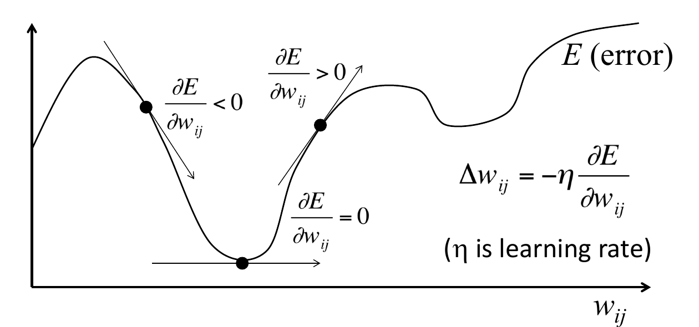{fig-align="center" width="52%"}

::: {.lang-en}
Define an **error** $E$ (how wrong the outputs are). Walk **downhill** on $E$: nudge each weight in the direction that lowers it, stop where the slope is zero. $\eta$ = **learning rate** (step size).
:::
::: {.lang-ja}
**誤差** $E$（出力がどれだけ間違っているか）を定義。$E$ の**坂を下る**：各重みを $E$ が下がる方向に少し動かし、傾きがゼロで止まる。$\eta$ = **学習率**（ステップ幅）。
:::

::: {.notes}
Gradient descent as "walk downhill on the error." Week 10 already used gradient descent as an idea (min-norm, early stopping, NTK's "trained by GD") — accurate to reference it. η is the step size. Next slide makes the callback to Q-learning's α explicit.
:::

## [You've seen this update before]{.lang-en}[この更新則は見たことがある]{.lang-ja}

::: {.columns}
::: {.column width="50%"}
::: {.lang-en}
**Q-learning (Week 8):**
$$Q \leftarrow Q + \alpha\,\big(\underbrace{\text{target} - Q}_{\text{error}}\big)$$
:::
::: {.lang-ja}
**Q学習（第8週）：**
$$Q \leftarrow Q + \alpha\,\big(\underbrace{\text{目標} - Q}_{\text{誤差}}\big)$$
:::
:::
::: {.column width="50%"}
::: {.lang-en}
**The delta rule (today):**
$$w_j \leftarrow w_j + \eta\,\underbrace{(t - y)}_{\text{error}}\,x_j$$
:::
::: {.lang-ja}
**デルタ則（今日）：**
$$w_j \leftarrow w_j + \eta\,\underbrace{(t - y)}_{\text{誤差}}\,x_j$$
:::
:::
:::

[Same shape: **new = old + (step size) × (error) × (who's responsible).**]{.lang-en}[同じ形：**新 = 旧 + （ステップ幅）×（誤差）×（誰の責任か）。**]{.lang-ja}

::: {.notes}
Verified callback: Week 8 DID teach Q(s,a) ← Q + αδ with α as the learning rate (I checked the deck). Same update shape, so η ↔ α lands honestly. The delta rule for a linear output is just this. The extra x_j is "which input was responsible" — apportioning credit, the seed of backprop's blame-apportionment. This is one beat, no build-up needed.
:::

## [Anatomy of the delta rule]{.lang-en}[デルタ則の解剖]{.lang-ja} {.big-figure}

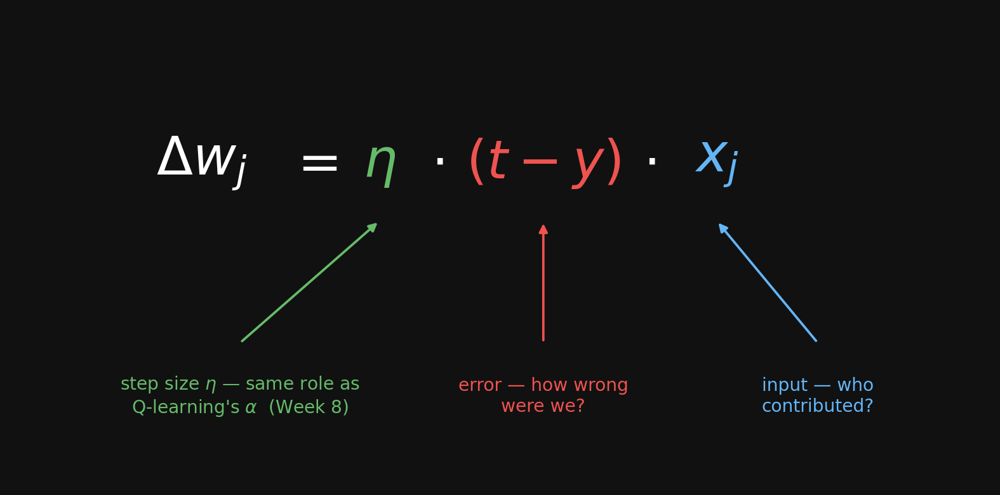{fig-align="center" width="72%"}

::: {.lang-en}
For a general activation $g$, the update also carries a $g'$ term — "correct for how fast the unit is changing." That $g'$ factor is exactly what will **propagate backward** through a deep net.
:::
::: {.lang-ja}
一般の活性化 $g$ では更新に $g'$ の項も入る — 「要素がどれだけ速く変化するかを補正」。この $g'$ 因子こそ深層ネットで**逆向きに伝播**するもの。$g'$ は $g$ の微分。$t$ は目標、$y$ は出力。$x_j$ は入力。
:::

::: {.notes}
The anatomy figure labels the three pieces. Introduce g' (derivative of the activation) here — it's the hook for backprop. Foreshadow: in a multilayer net, this g' term is what gets chained backward. Don't derive backprop yet — that's Block 4 after we motivate WHY we need layers.
:::

# [Learn II — depth & backpropagation]{.lang-en}[学習 II — 深さと誤差逆伝播]{.lang-ja} {.section-break background-image="../../sds-reveal/sds_frame.png" background-size="cover"}

::: {.notes}
Block 4. Motivate depth with XOR (the historical crisis), show why stacking linear layers is useless, resolve with nonlinearity, then backprop as blame-apportionment — and land the punchline that backprop IS automatic differentiation, introducing jax.grad (JAX's autodiff tool) here as new. NB: they have NOT used jax.grad before — the course used GenJAX's inference API, not raw gradients — so present it as a first introduction, not a callback.
:::

## [Quick poll — the limits of a straight line]{.lang-en}[小テスト — 直線の限界]{.lang-ja} {.poll-slide}

::: {.lang-en}
A single perceptron draws **one straight line**. It can learn AND and OR. Which can it **not** learn?
:::
::: {.lang-ja}
単一パーセプトロンは**一本の直線**を引く。ANDとORは学習できる。**学習できない**のは？
:::

::: {.fragment}
::: {.lang-en}
- **A.** NAND (not-and)
- **B.** XOR (exclusive-or)
- **C.** it can learn all three
:::
::: {.lang-ja}
- **A.** NAND（否定論理積）
- **B.** XOR（排他的論理和）
- **C.** 三つとも学習できる
:::
:::

::: {.notes}
Commit before reveal. New poll for SP26 (the SP25 bank has no NN questions — verified). The answer is B: XOR is not linearly separable, and that single fact nearly killed neural networks for a decade (Minsky & Papert 1969). Hold the reveal.
:::

## [Reveal]{.lang-en}[答え]{.lang-ja} {.poll-reveal}

[**B — XOR.**]{.lang-en .yellow}[**B — XOR。**]{.lang-ja .yellow}

::: {.lang-en}
No straight line separates XOR's two classes. Minsky & Papert (1969) proved it — and argued important abilities (like judging whether a shape is *connected*) need exactly this. Neural-network research went quiet for over a decade.
:::
::: {.lang-ja}
XORの2クラスを分ける直線は存在しない。Minsky & Papert (1969) がこれを証明し、重要な能力（図形が*連結*かの判断など）にはまさにこれが必要だと論じた。ニューラルネット研究は10年以上停滞した。
:::

::: {.notes}
Land the historical stakes. XOR is the canonical non-linearly-separable problem. The "connectedness" example is Minsky & Papert's own. This sets up the resolution: depth + nonlinearity. Show the separability panel next.
:::

## [Why XOR is hard]{.lang-en}[なぜXORは難しいか]{.lang-ja} {.big-figure}

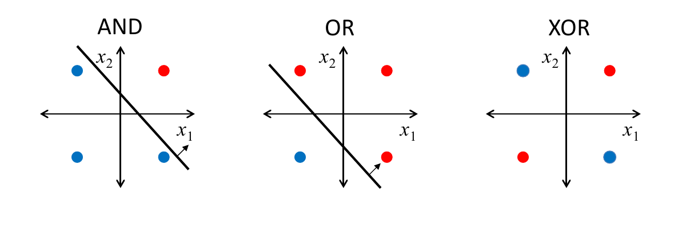{fig-align="center" width="66%"}

::: {.lang-en}
AND and OR: one line separates the classes. XOR: **no line works** — the two "true" corners are diagonal from each other.
:::
::: {.lang-ja}
ANDとOR：一本の線でクラスが分かれる。XOR：**どの線もダメ** — 二つの「真」の角が対角にある。
:::

::: {.notes}
The AND/OR/XOR panel (SP25, timeless). Make sure they see WHY: XOR's positive cases are opposite corners. Natural fix: add a layer. But — next three slides — depth alone isn't enough; you need the nonlinearity.
:::

## [One more tool: the matrix]{.lang-en}[もう一つの道具：行列]{.lang-ja} {.bigger}

::: {.lang-en}
Adding a **layer** means transforming *every* input vector at once. The machine that does that is a **matrix** — and multiplying by one is just **a dot product per row**:

$$\begin{bmatrix}2 & 0\\ 0 & 1\end{bmatrix}\begin{bmatrix}3\\ 4\end{bmatrix} = \begin{bmatrix}2{\times}3 + 0{\times}4\\ 0{\times}3 + 1{\times}4\end{bmatrix} = \begin{bmatrix}6\\ 4\end{bmatrix}$$

[The first **column** is where $[1,0]$ lands; the second is where $[0,1]$ lands — the matrix moves the whole plane.]{.dim}
:::
::: {.lang-ja}
**層**を足すとは、*すべての*入力ベクトルを一度に変換すること。それをやる機械が**行列** — 掛け算は**行ごとの内積**にすぎない：

$$\begin{bmatrix}2 & 0\\ 0 & 1\end{bmatrix}\begin{bmatrix}3\\ 4\end{bmatrix} = \begin{bmatrix}2{\times}3 + 0{\times}4\\ 0{\times}3 + 1{\times}4\end{bmatrix} = \begin{bmatrix}6\\ 4\end{bmatrix}$$

[第1**列**は $[1,0]$ の行き先、第2列は $[0,1]$ の行き先 — 行列は平面全体を動かす。]{.dim}
:::

::: {.notes}
Zero-LA on-ramp, part 2. Define matrix-vector multiplication as "a dot product per row" — reusing the one operation they now own. Work the arithmetic aloud: the example stretches the weight axis ×2. The dim line is the deep intuition (columns = where the basis arrows land) — the widget makes it tangible next. Notation lock-in: from here, W means a matrix, Wx means "transform x."
:::

## [Drive it — a matrix moves every point]{.lang-en}[操作してみる — 行列は全ての点を動かす]{.lang-ja} {.widget-slide}

<iframe class="widget-frame" src="widgets/matrix-transform.html"></iframe>

::: {.notes}
Live widget. Drag the four sliders: the grid, the unit square, and the bento points all move — one machine, every point. Hit the presets (rotate, stretch, shear). Watch the readout: e1 lands at the first column, e2 at the second. THEN press "apply ReLU" and let them see the plane FOLD onto the positive quadrant — say "hold that fold in mind; it's about to matter." That's the whole nonlinearity story, pre-loaded.
:::

## [Does stacking layers help? (1/3)]{.lang-en}[層を重ねれば解決？（1/3）]{.lang-ja} {.bigger}

::: {.lang-en}
Try two **linear** layers, one after the other:
$$\mathbf{h} = W_1\mathbf{x}, \qquad y = W_2\mathbf{h}.$$
Surely two layers can do more than one?
:::
::: {.lang-ja}
**線形**の層を2つ、続けて試す：
$$\mathbf{h} = W_1\mathbf{x}, \qquad y = W_2\mathbf{h}.$$
2層なら1層より多くを表せるはず？
:::

::: {.notes}
Build-up slide 1 of 3 (sibling slides, not fragments — this is a real derivation with three beats per the visual-density rule). Just set up the two-layer linear composition. Suspense: does depth buy anything?
:::

## [Does stacking layers help? (2/3)]{.lang-en}[層を重ねれば解決？（2/3）]{.lang-ja} {.bigger}

::: {.lang-en}
Multiply it out — two machines run in a row are **one machine** (matrix × matrix is just another matrix):
$$y = W_2(W_1\mathbf{x}) = \underbrace{(W_2 W_1)}_{\text{one matrix } W'}\,\mathbf{x} = W'\mathbf{x}.$$
:::
::: {.lang-ja}
展開すると — 続けて動かす二つの機械は**一つの機械**（行列×行列はやはり一つの行列）：
$$y = W_2(W_1\mathbf{x}) = \underbrace{(W_2 W_1)}_{\text{一つの行列 } W'}\,\mathbf{x} = W'\mathbf{x}.$$
:::

::: {.notes}
Build-up 2 of 3. The algebra: two linear layers collapse to a single linear map W' = W2 W1. Let it land visually before saying the consequence.
:::

## [Does stacking layers help? (3/3)]{.lang-en}[層を重ねれば解決？（3/3）]{.lang-ja} {.bigger}

[**Depth alone buys nothing** — it's still one straight line.]{.lang-en .yellow}[**深さだけでは何も得られない** — やはり一本の直線。]{.lang-ja .yellow}

::: {.lang-en}
The fix is the **nonlinearity**: put an activation $g$ between the layers,
$$\mathbf{h} = g(W_1\mathbf{x}),$$
and the composition can no longer collapse — **that** is why depth needs $g$.
:::
::: {.lang-ja}
解決策は**非線形性**：層の間に活性化 $g$ を挟むと
$$\mathbf{h} = g(W_1\mathbf{x}),$$
合成はもう潰れない — **これ**が深さに $g$ が必要な理由。
:::

::: {.notes}
Build-up 3 of 3 — the punchline. Stacked linear layers = one linear layer, so depth is useless WITHOUT nonlinearity. This retroactively explains why the activation function mattered (Block 2). The nonlinearity between layers is the whole ballgame. Next: it actually solves XOR, and you can drive it.
:::

## [Depth + nonlinearity solves XOR]{.lang-en}[深さ+非線形性でXORが解ける]{.lang-ja} {.big-figure}

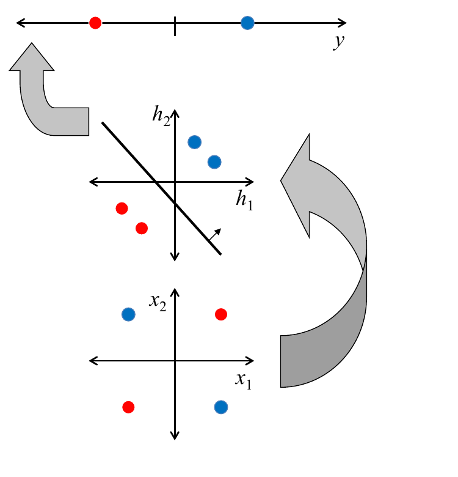{fig-align="center" width="58%"}

::: {.lang-en}
A nonlinear hidden layer **warps the space** so the two XOR classes become linearly separable — then the output layer draws its line in the warped space.
:::
::: {.lang-ja}
非線形の隠れ層が**空間を歪め**、XORの2クラスが線形分離可能になる — その後、出力層が歪んだ空間で線を引く。
:::

::: {.notes}
The space-warp intuition (SP25). Hidden units learn a new representation (learned features again!) in which the problem is easy. This is REPRESENT and LEARN meeting: the network learns features that make the function findable. Straight into the widget so they can feel it.
:::

## [Drive it — can your net learn XOR?]{.lang-en}[操作してみる — あなたのネットはXORを学べる？]{.lang-ja} {.widget-slide}

<iframe class="widget-frame" src="widgets/xor-playground.html"></iframe>

::: {.notes}
Live widget. First switch to "Linear only" and hit Train — it visibly fails (loss stalls, a point stays wrong): that's Minsky & Papert on screen. Then switch to "2 ReLU hidden units," Train, and watch the boundary bend to solve it. If time, hand-set the hidden weights with the sliders to build the solution manually. The point: the hidden layer's nonlinearity is what makes it work.
:::

## [How do we train the hidden weights? Backprop]{.lang-en}[隠れ層の重みはどう訓練する？ 誤差逆伝播]{.lang-ja} {.big-figure}

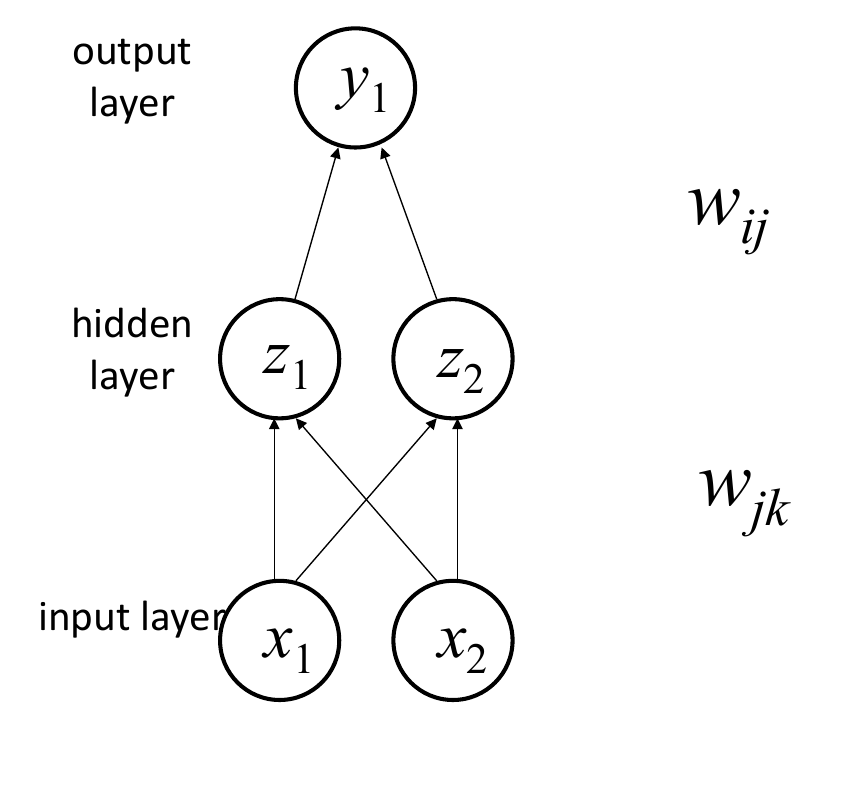{fig-align="center" width="56%"}

::: {.lang-en}
**Backpropagation** (Rumelhart, Hinton & Williams, 1986): run the input forward, measure the output error, then **apportion the blame backward** — each hidden unit's share is how much it fed into the error (that $g'$ term, chained by the chain rule). In very deep stacks those $g'$ factors multiply and can shrink toward zero — the **vanishing-gradient** problem — which is why modern nets add residual connections and normalization (Block 5).
:::
::: {.lang-ja}
**誤差逆伝播**（Rumelhart, Hinton & Williams, 1986）：入力を順伝播し、出力誤差を測り、**責任を逆向きに配分** — 各隠れ要素の取り分は、それが誤差にどれだけ寄与したか（連鎖律で連なる $g'$ の項）。非常に深い積層ではこれらの $g'$ が掛け合わさりゼロに縮みうる — **勾配消失**問題 — だから現代のネットは残差接続と正規化を加える（ブロック5）。
:::

::: {.notes}
Define backprop at first use (no prior week taught it — verified). Intuition over derivation: it's blame-apportionment via the chain rule; the g' term from Block 3 is what propagates. Name Rumelhart/Hinton/Williams 1986. Flag vanishing gradients briefly — fixed today by residual connections + normalization (the corrected modern framing, not SP25's vague version).
:::

## [Backprop is just automatic differentiation]{.lang-en}[誤差逆伝播とは自動微分にすぎない]{.lang-ja} {.smaller}

::: {.lang-en}
You've used JAX all term. Meet its autodiff tool, `jax.grad`: hand it a function, get back the function's gradient — the chain rule, automated.
:::
::: {.lang-ja}
今学期ずっとJAXを使ってきた。その自動微分ツール `jax.grad` を紹介：関数を渡すと、その関数の勾配が返る — 連鎖律の自動化。
:::

```python
import jax, jax.numpy as jnp

def loss(w, x, t):                      # a tiny network's error
    y = jnp.tanh(x @ w)                 # forward pass
    return jnp.mean((y - t) ** 2)       # squared error

grad_fn = jax.grad(loss)               # <- reverse-mode autodiff = backprop
g = grad_fn(w, x, t)                   # the gradient, one call
w = w - 0.1 * g                         # one gradient-descent step
```

::: {.lang-en}
**Reverse-mode autodiff** — what `jax.grad` computes — *is* backpropagation. Backprop is not a bespoke algorithm; it's the chain rule automated, in one call. No hand-derived update rules.
:::
::: {.lang-ja}
**逆モード自動微分** — `jax.grad` が計算するもの — が*まさに*誤差逆伝播。逆伝播は専用アルゴリズムではなく、連鎖律の自動化を一回の呼び出しで行うだけ。手計算の更新則は不要。
:::

::: {.notes}
FIRST real introduction of jax.grad — do NOT claim they've "run backprop all term." The course used GenJAX's inference API (.simulate / .importance), not jax.grad directly, so introduce it here as a new tool: it's JAX's autodiff, and reverse-mode autodiff IS backprop. The demystifying payoff: backprop isn't a separate, mysterious algorithm — it's the chain rule automated, one jax.grad call, and gradient-based inference/optimization everywhere rests on the same primitive. Don't run this as a validated cell in the deck — it's illustrative; the point is conceptual unification. Correct the SP25 error out loud: backprop is very much still how nets are trained.
:::

# [Represent II — architecture as prior]{.lang-en}[表現 II — 事前分布としてのアーキテクチャ]{.lang-ja} {.section-break background-image="../../sds-reveal/sds_frame.png" background-size="cover"}

::: {.notes}
Block 5. Back to the master map's "features" box, but now the point is: the ARCHITECTURE is an inductive bias — a prior over which features are easy to learn. CNN and RNN each bake in one assumption; attention relaxes them and gives the transformer. This is the run-up to the LLM block.
:::

## [Architecture is an inductive bias — a prior]{.lang-en}[アーキテクチャは帰納バイアス — 事前分布]{.lang-ja}

::: {.lang-en}
A fully-connected net treats every input the same. Real architectures **bake in an assumption** about the data — which is exactly a **prior** (the Bayesian word from Week 4 onward).

- **CNN:** nearby pixels matter together, and the same pattern can appear anywhere.
- **RNN:** the data is a **sequence**; process it one step at a time.
:::
::: {.lang-ja}
全結合ネットは全入力を同等に扱う。実際のアーキテクチャはデータについての**仮定を組み込む** — それはまさに**事前分布**（第4週以降のベイズの言葉）。

- **CNN：** 近くのピクセルは一緒に効き、同じパターンはどこにでも現れうる。
- **RNN：** データは**系列**；一歩ずつ処理する。
:::

::: {.notes}
The unifying claim of this block, and a callback to the whole Bayesian spine: architecture = inductive bias = prior. CNN and RNN are two priors. Frame both as "what invariance did we bake in?" This reframes deep learning inside the course's probabilistic story rather than as a separate topic.
:::

## [CNNs: bake in translation invariance]{.lang-en}[CNN：並進不変性を組み込む]{.lang-ja} {.big-figure}

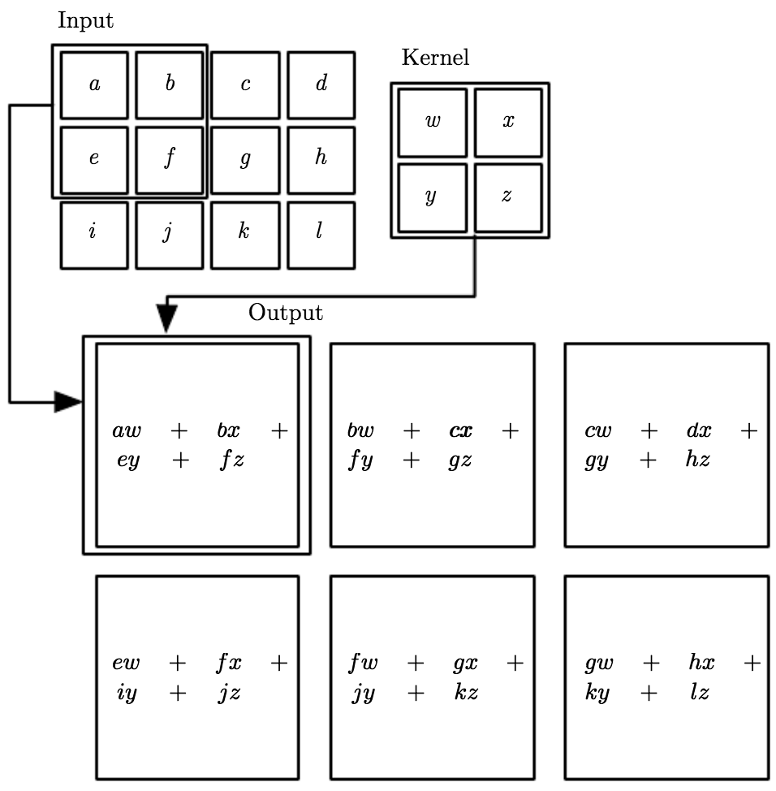{fig-align="center" width="58%"}

::: {.lang-en}
Slide one small **kernel** across the image and reuse its weights everywhere (**weight sharing**). A cat is a cat wherever it appears — **translation invariance**, built in rather than learned from scratch.
:::
::: {.lang-ja}
小さな**カーネル**を画像上で滑らせ、その重みをどこでも再利用（**重み共有**）。猫はどこに現れても猫 — **並進不変性**を、ゼロから学ぶのではなく組み込む。
:::

::: {.notes}
CNN in one slide: convolution = sliding a shared-weight kernel; the payoff is translation invariance for free. Define kernel/weight-sharing/translation-invariance at first use. If the convolution GIF salvaged, could show it, but the kernel-arithmetic figure is enough. This is a prior: "features are local and position-independent."
:::

## [RNNs: bake in sequence — but a bottleneck]{.lang-en}[RNN：系列を組み込む — だがボトルネック]{.lang-ja} {.big-figure}

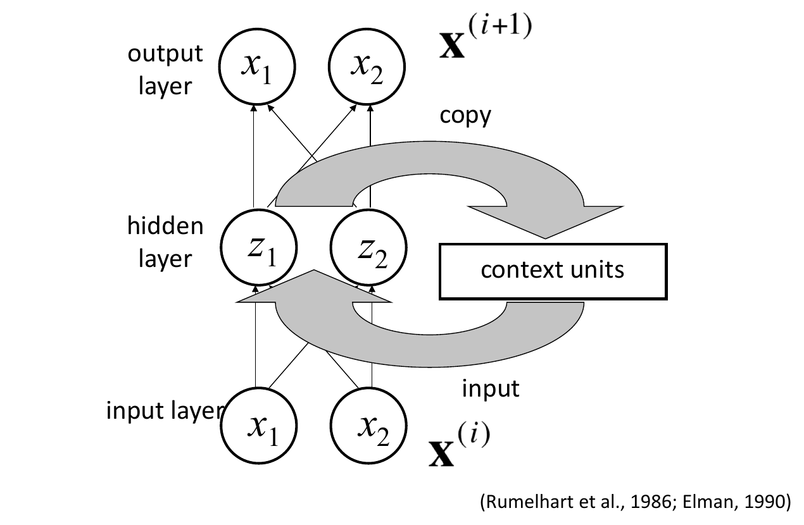{fig-align="center" width="52%"}

::: {.lang-en}
Feed the hidden state back in at each step (Elman, 1990) — the net carries a memory of what came before. But everything must squeeze through **one hidden state**, step by step: a famous **bottleneck**. RNNs learned *local* structure well and *global* structure poorly.
:::
::: {.lang-ja}
各ステップで隠れ状態を戻す（Elman, 1990）— ネットは過去の記憶を運ぶ。だが全てが**一つの隠れ状態**を一歩ずつ通らねばならない：有名な**ボトルネック**。RNNは*局所*構造をよく学び、*大域*構造を苦手とした。
:::

::: {.notes}
RNN in one slide: recurrence = a prior that the data is sequential; the cost is the sequential bottleneck (one hidden state, processed in order — slow, and long-range dependencies fade). "Local but not global" is the SP25 Mozer-music finding, compressed to its lesson. This is the cliffhanger attention resolves. (If running long, this slide is the drop candidate per the outline.)
:::

## [Attention: a soft dictionary lookup]{.lang-en}[アテンション：ソフトな辞書引き]{.lang-ja} {.big-figure}

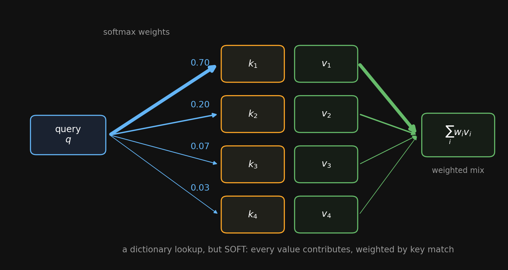{fig-align="center" width="62%"}

::: {.lang-en}
Instead of one bottleneck, let **every token look at every other token**. Each token issues a **query**; it's matched against every token's **key** — the match score is a **dot product**, the same similarity you met this morning. The **softmax** of those scores weights a blend of the **values** — the same softmax from Week 9, sharpness $\beta$ and all.
:::
::: {.lang-ja}
一つのボトルネックの代わりに、**全トークンが他の全トークンを見る**。各トークンが**クエリ**を出し、全トークンの**キー**と照合する — 一致度は**内積**、今朝学んだのと同じ類似度。そのスコアの**ソフトマックス**が**値**の混合を重み付ける — 第9週と同じソフトマックス、鋭さ $\beta$ も含めて。
:::

::: {.notes}
Attention as soft lookup. Define query/key/value at first use. THE callback that pays off Week 9: the softmax here is the same softmax/Boltzmann policy (verified — Week 9 taught softmax with rationality β). High β → hard lookup (argmax); low β → uniform blend. Every token sees every token → no sequential bottleneck. Drive the widget next.
:::

## [Drive it — attention as lookup]{.lang-en}[操作してみる — 辞書引きとしてのアテンション]{.lang-ja} {.widget-slide}

<iframe class="widget-frame" src="widgets/attention-lookup.html"></iframe>

::: {.notes}
Live widget. Click a query token, show the attention weights as bars. Then drag the sharpness β slider: at low β it's a mushy average, at high β it snaps to a single token — a hard lookup. Same knob as Week 9's rationality β. Tie back: soft, differentiable lookup is what makes attention trainable by backprop.
:::

## [The transformer: attention + MLP, stacked]{.lang-en}[トランスフォーマー：アテンション+MLP、積層]{.lang-ja} {.big-figure}

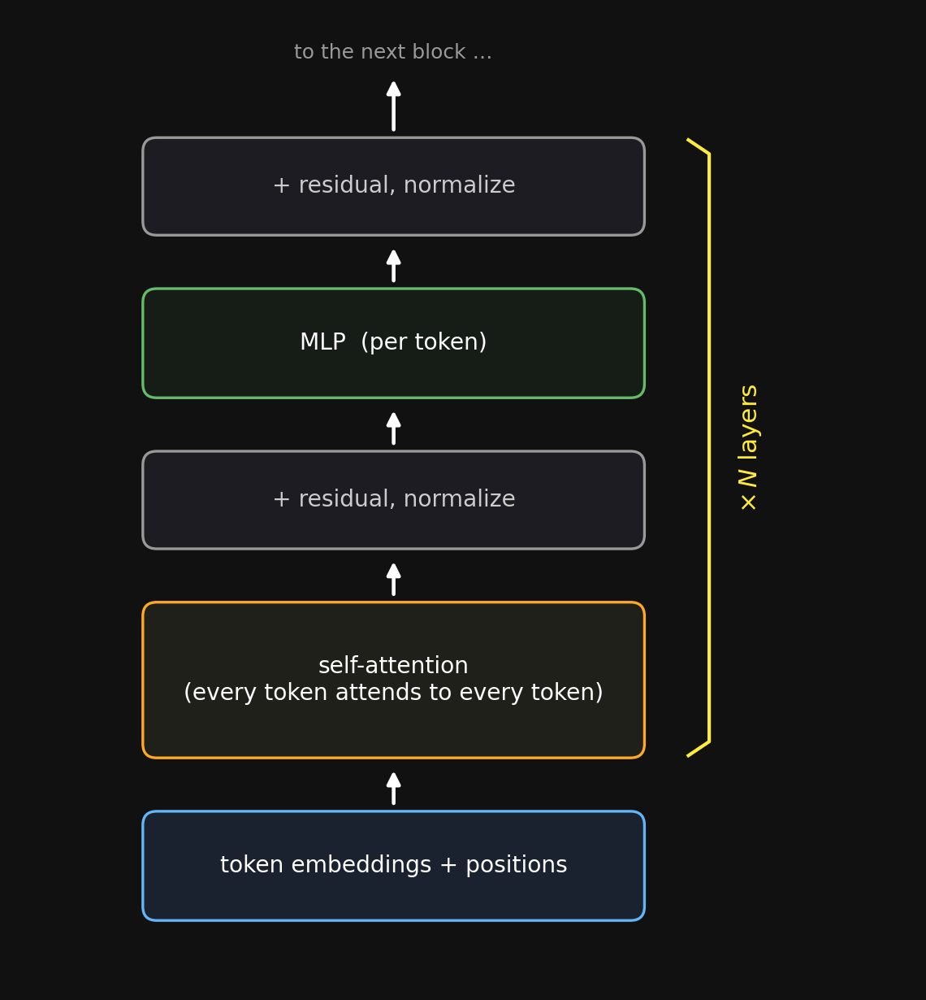{fig-align="center" width="42%"}

::: {.lang-en}
One block = **self-attention** (mix information across tokens) + a **per-token MLP** (transform each), wrapped in **residual connections** and **normalization** (the vanishing-gradient fixes). Stack $N$ of them. No recurrence, no bottleneck — this is the architecture behind every modern LLM.
:::
::: {.lang-ja}
1ブロック = **自己アテンション**（トークン間で情報を混ぜる）+ **トークンごとのMLP**（各々を変換）を、**残差接続**と**正規化**（勾配消失の対策）で包む。$N$ 個積む。再帰なし、ボトルネックなし — すべての現代LLMの背後にあるアーキテクチャ。
:::

::: {.notes}
The transformer block, assembled from parts they now know: attention (just met) + MLP (Block 4) + residual/norm (the vanishing-gradient fixes, named in the backprop slide). Emphasize what it dropped: no recurrence. This is the architecture of every LLM. Now the last block: what happens when you make it huge.
:::

# [Understand — scale, emergence, in-context learning]{.lang-en}[理解 — スケール・創発・文脈内学習]{.lang-ja} {.section-break background-image="../../sds-reveal/sds_frame.png" background-size="cover"}

::: {.notes}
Block 6, UNDERSTAND — the whole-pipeline question of the master map, and the modernization payoff. Scaling laws → emergence (with the mirage caveat) → in-context learning taught as a LIVE Bayesian debate, not settled fact. This is the block the textbook Phase D chapter is built from.
:::

## [Scaling laws: bigger is (predictably) better]{.lang-en}[スケーリング則：大きいほど（予測通り）良い]{.lang-ja} {.big-figure}

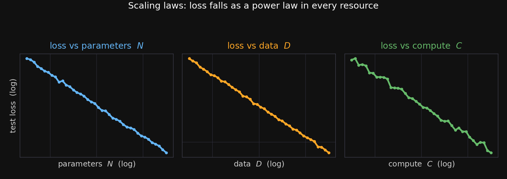{fig-align="center" width="82%"}

::: {.lang-en}
Test loss falls as a **straight line on a log-log plot** against parameters, data, and compute (Kaplan et al. 2020; Hoffmann et al. 2022). Performance is, to a surprising degree, **predictable from scale alone** — no new idea required.
:::
::: {.lang-ja}
テスト損失は、パラメータ・データ・計算量に対して**両対数プロットで直線**として下がる（Kaplan et al. 2020; Hoffmann et al. 2022）。性能は驚くほど**スケールだけから予測可能** — 新しいアイデアは不要。
:::

::: {.notes}
Scaling laws: power-law loss decrease, straight on log-log. Define log-log if needed. The striking claim: much of progress is buying scale, not new ideas — this is the compute-not-ideas point McClelland made to me in 2013, now quantified. Connects to Week 10's "scaling-laws through-line" (accurate — Week 10 mentioned it). Sets up emergence.
:::

## [Emergence — and a caveat]{.lang-en}[創発 — と注意点]{.lang-ja}

::: {.columns}
::: {.column width="52%"}
::: {.lang-en}
Some abilities appear to switch on **suddenly** past a scale threshold — arithmetic, multi-step reasoning — abilities the smaller model seemed not to have at all ("**emergent abilities**").
:::
::: {.lang-ja}
一部の能力は、あるスケール閾値を超えると**突然**現れるように見える — 算術、多段推論 — 小さいモデルには全く無かったように見えた能力（「**創発的能力**」）。
:::
:::
::: {.column width="48%"}
::: {.lang-en}
**Caveat (Schaeffer et al. 2023):** some "emergence" is a **mirage** of the metric — switch to a smoother score and the jump becomes a gentle curve. Real or measured? Still debated.
:::
::: {.lang-ja}
**注意（Schaeffer et al. 2023）：** 一部の「創発」は指標の**蜃気楼** — 滑らかな尺度に変えると、急上昇は緩やかな曲線になる。本物か測定の産物か？ 議論中。
:::
:::
:::

[📋 Lake scorecard: in-context learning is real **learning-to-learn** — adapting from a few examples — one of Lake et al.'s four asks. Whether it's *compositional* is exactly the debate on the next slide.]{.lang-en .dim}[📋 Lake採点表：文脈内学習は本物の**学習の学習** — 少数の例からの適応 — でLake らの4つの要求の一つ。それが*構成的*かは、まさに次のスライドの議論。]{.lang-ja .dim}

::: {.notes}
Emergence, taught honestly with the counter-evidence in the same breath (the "teach it critically" rule). Define emergent abilities at first use. The Schaeffer et al. mirage result is essential — do not present emergence as settled. This models the epistemic stance for the next slides on ICL. (Skippable live if short; stays for the recording.)
:::

## [In-context learning: learning without weight updates]{.lang-en}[文脈内学習：重み更新なしの学習]{.lang-ja} {.big-figure}

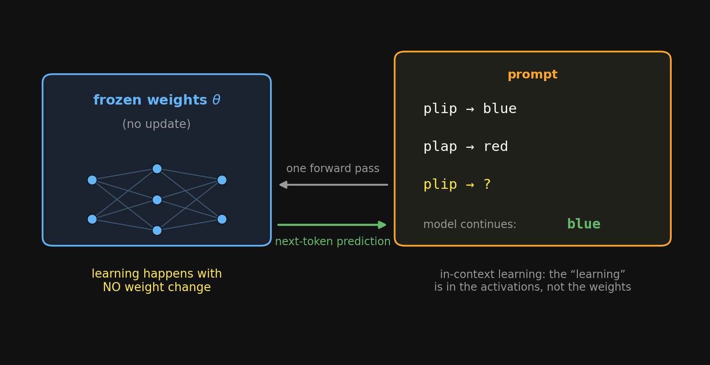{fig-align="center" width="66%"}

::: {.lang-en}
Give a **frozen** model a few examples in its prompt — *plip→blue, plap→red, plip→?* — and it continues the pattern. Nothing was retrained; the "learning" happened entirely **in the context window**.
:::
::: {.lang-ja}
**凍結**したモデルにプロンプト内でいくつか例を与える — *plip→青, plap→赤, plip→?* — とパターンを続ける。再訓練は一切なし；「学習」はすべて**文脈窓の中**で起きた。
:::

::: {.notes}
Define in-context learning at first use: the model adapts from prompt examples with NO weight update. This is genuinely strange — it looks like learning but the parameters are frozen. Poll next asks them to locate where the learning "lives," then the Bayesian lens (and its critics).
:::

## [Quick poll — where did the learning go?]{.lang-en}[小テスト — 学習はどこへ？]{.lang-ja} {.poll-slide}

::: {.lang-en}
A frozen LLM picks up a made-up rule from 3 prompt examples. Where does what-it-just-learned **live**?
:::
::: {.lang-ja}
凍結したLLMが3つのプロンプト例から作り話のルールを覚える。今学んだことは**どこにある**？
:::

::: {.fragment}
::: {.lang-en}
- **A.** in updated weights
- **B.** in the context window — weights unchanged
- **C.** in a retrieval database
:::
::: {.lang-ja}
- **A.** 更新された重みの中
- **B.** 文脈窓の中 — 重みは不変
- **C.** 検索データベースの中
:::
:::

::: {.notes}
Commit before reveal. New SP26 poll. Answer B — the weights never change; the adaptation is entirely in the activations conditioned on the prompt. That's what makes the Bayesian reading tempting: conditioning on examples, not updating parameters, looks exactly like inference. Reveal, then the debate.
:::

## [Reveal]{.lang-en}[答え]{.lang-ja} {.poll-reveal}

[**B — in the context window; the weights never change.**]{.lang-en .yellow}[**B — 文脈窓の中；重みは変わらない。**]{.lang-ja .yellow}

::: {.lang-en}
Conditioning on examples without updating parameters looks a lot like **inference**, not training. That resemblance is the basis of a striking — and **contested** — claim.
:::
::: {.lang-ja}
パラメータを更新せず例で条件付けることは、訓練というより**推論**によく似ている。この類似が、印象的で — かつ**議論のある** — 主張の根拠。
:::

::: {.notes}
Land the framing: ICL = conditioning, not gradient learning. That's the hook for the Bayesian interpretation. Next slide states the claim; the slide after gives the counter-evidence. Both on screen — this is a debate we're teaching, not a result we're endorsing.
:::

## [The Bayesian lens — and its critics]{.lang-en}[ベイズの視点 — とその批判者]{.lang-ja}

:::: {.columns}
::: {.column width="50%"}
::: {.note-card .ink}
::: {.lang-en}
**The claim — ICL $\approx$ implicit Bayes.** Pretraining fits a **prior** over latent patterns; the prompt's examples are **observations**; the continuation is the **posterior predictive**. Pretraining is *empirical Bayes* — estimating the prior itself from data. [(Xie et al. 2022; Ye et al. 2024)]{.dim}
:::
::: {.lang-ja}
**主張 — 文脈内学習 $\approx$ 暗黙のベイズ。** 事前学習は潜在パターン上の**事前分布**を当てはめ；プロンプトの例は**観測**；継続は**事後予測**。事前学習は*経験ベイズ* — 事前分布そのものをデータから推定。[(Xie et al. 2022; Ye et al. 2024)]{.dim}
:::
:::
:::
::: {.column width="50%"}
::: {.note-card .ink .warn}
::: {.lang-en}
**The pushback — the math doesn't check out.** If prompt examples are exchangeable (order shouldn't matter), the running prediction must be a **martingale**: no systematic drift as examples arrive. Real LLM predictions **violate** that. [(Falck et al. 2024)]{.dim}
:::
::: {.lang-ja}
**反論 — 数学が合わない。** 例が交換可能（順序は無関係）なら、逐次予測は**マルチンゲール**でなければならない：例が増えても系統的に漂動しない。実際のLLMの予測はそれを**破る**。[(Falck et al. 2024)]{.dim}
:::
:::
:::
::::

[The lens is *suggestive*, not settled — and it's the payoff of everything from **Week 4's hierarchical Bayes** onward.]{.lang-en .yellow}[この視点は*示唆的*であり確定ではない — そして**第4週の階層ベイズ**以降すべての成果でもある。]{.lang-ja .yellow}

::: {.notes}
THE modernization slide and the seed of textbook Phase D. Teach it as a live debate — Xie/Ye's ICL-as-Bayes formalization (pretraining ≈ empirical Bayes: optimizing marginal likelihood of sequences) AND Falck et al.'s martingale counter-evidence, both on screen. This is the honest epistemic status: a workshop-level formalization with active refutation, not a textbook fact. The callback to Week 4 hierarchical Bayes is the reason this course earns this slide — the reader has the prior/posterior-predictive machinery already. Do NOT overclaim.
:::

## [How these get aligned → next week]{.lang-en}[これらがどう整合されるか → 来週]{.lang-ja}

::: {.lang-en}
A pretrained model predicts text; making it **helpful and safe** is a second step — **RLHF** (Week 9): fit a reward model to human preferences (Bradley–Terry), then RL the policy. Same inverse-RL machinery, now aimed at values.

- **Next week (Week 12):** ethics, fairness, adversarial examples, alignment.
:::
::: {.lang-ja}
事前学習モデルはテキストを予測する；それを**有用で安全**にするのは第2段階 — **RLHF**（第9週）：人間の選好に報酬モデルを当てはめ（Bradley–Terry）、方策をRLで最適化。同じ逆強化学習の仕組みを、今度は価値に向ける。

- **来週（第12週）：** 倫理・公平性・敵対的事例・アラインメント。
:::

::: {.notes}
Bridge to Week 12 via a verified Week 9 callback (Week 9 DID teach RLHF/DPO with Bradley-Terry — checked). Pretraining gives capability; alignment (RLHF) shapes behavior; next week is the ethics/safety of that. Keeps the whole-course arc intact: IRL → RLHF → alignment.
:::

# [Where this leaves us]{.lang-en}[まとめ]{.lang-ja} {.section-break background-image="../../sds-reveal/sds_frame.png" background-size="cover"}

::: {.notes}
Block 7, the close. Return to the master map one last time with all four answers lit, settle the Lake scorecard, and hand off to Week 12. Short.
:::

## [One question, four answers]{.lang-en}[一つの問い、四つの答え]{.lang-ja} {.big-figure}

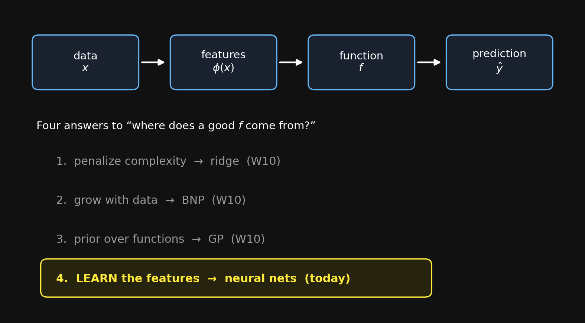{fig-align="center" width="80%"}

::: {.lang-en}
"Where does the hypothesis space come from?" — penalize complexity (**ridge**), grow with data (**BNP**), a prior over functions (**GP**), or **learn the features** (neural nets). The first three fix the kernel; the fourth learns it — and at infinite width, it circles back to a **GP** (Week 10).
:::
::: {.lang-ja}
「仮説空間はどこから来るのか？」 — 複雑さを罰する（**リッジ**）、データとともに増やす（**BNP**）、関数上の事前分布（**GP**）、または**特徴を学習する**（ニューラルネット）。最初の三つはカーネルを固定；四つ目はそれを学習 — そして無限幅では**GP**に戻る（第10週）。
:::

::: {.notes}
The closing picture — the same master map, all four answers annotated. The satisfying loop: the neural-net answer, taken to its infinite-width limit, becomes the GP answer from last week (NNGP/NTK). One coherent story across two weeks, not two separate topics. This is establish-then-reference paying off.
:::

## [Lake's scorecard, settled]{.lang-en}[Lakeの採点表、締め]{.lang-ja}

::: {.lang-en}
Back to the reading — now with 2025 evidence. Deep nets deliver **learned representations**, **similarity**, and **scale** — genuinely. What Lake et al. (2017) say is still missing: **compositional generalization** and **causal, model-based** understanding. Even meta-learned nets reach human-like systematicity only with effort (Lake & Baroni, 2023), and a 2025 re-test of **multimodal** LLMs on Lake's own domains — intuitive physics, causality, intuitive psychology — still finds them short of people (Schulze Buschoff et al., 2025).

**The honest verdict:** the 1988 → 2017 → 2025 critique still bites *and* learned features are powerful. Both are true.
:::
::: {.lang-ja}
課題論文に戻る — 2025年の証拠とともに。深層ネットは**学習された表現**・**類似性**・**スケール**を確かに提供する。Lake et al. (2017) がなお欠けていると言うもの：**構成的汎化**と**因果的・モデルベース**の理解。メタ学習ネットでさえ人間並みの体系性には努力を要し（Lake & Baroni, 2023）、2025年の**マルチモーダル**LLMの再検証 — Lake自身の領域（直観物理・因果・直観心理）で — も、なお人間に及ばないと示す（Schulze Buschoff et al., 2025）。

**正直な評価：** 1988 → 2017 → 2025 と続く批判はなお有効で*あり*、学習された特徴も強力。両方とも真。
:::

::: {.notes}
Settle the scorecard honestly — the "fact-check attributions" rule. Lake & Baroni 2023 is the right nuance (meta-learning CAN reach compositional generalization, but it's not free). The 2025 update is Schulze Buschoff et al., *Visual cognition in multimodal large language models* (Nature Machine Intelligence, Jan 2025): they tested vision-based LLMs on Lake's exact core domains — intuitive physics, causal reasoning, intuitive psychology — and found they "still fall short of human capabilities," explicitly framed as a follow-up to Lake's proposed domains. This is also this week's presentation-candidate paper, so a student may be presenting it. Don't declare a winner. The course's stance: hold both the power and the critique, now across a 1988 (Fodor & Pylyshyn) → 2017 (Lake et al.) → 2025 (Schulze Buschoff et al.) arc. This is the intellectual honesty that distinguishes this lecture from a hype reel.
:::

## [Next week & to do]{.lang-en}[来週とやること]{.lang-ja} {.agenda .smaller}

::: {.lang-en}
- **Read:** Lake et al. (2017), *Building machines that learn and think like people* — today's frame, next week's target.
- **Next week (Jul 17):** ethics, fairness, adversarial examples, alignment — **and final-project presentations**.
- **Play:** the two widgets (XOR net, attention lookup) — linked from the slides.
:::
::: {.lang-ja}
- **読む：** Lake et al. (2017), *人間のように学び考える機械をつくる* — 今日の枠組み、来週の標的。
- **来週（7月17日）：** 倫理・公平性・敵対的事例・アラインメント — **そして最終プロジェクト発表**。
- **遊ぶ：** 2つのウィジェット（XORネット、アテンション辞書引き） — スライドからリンク。
:::

::: {.notes}
Close. Point them at the reading (which we framed all lecture), preview Week 12 (ethics + presentations), and nudge them to actually open the two widgets. Done.
:::
