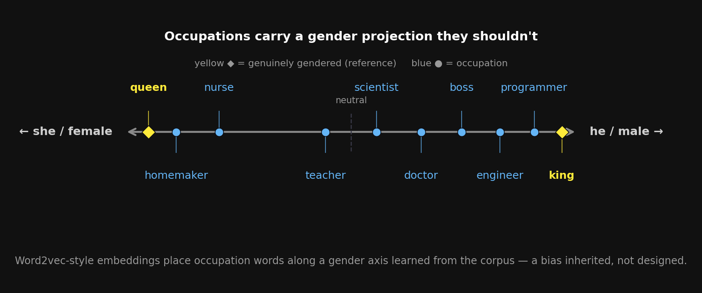
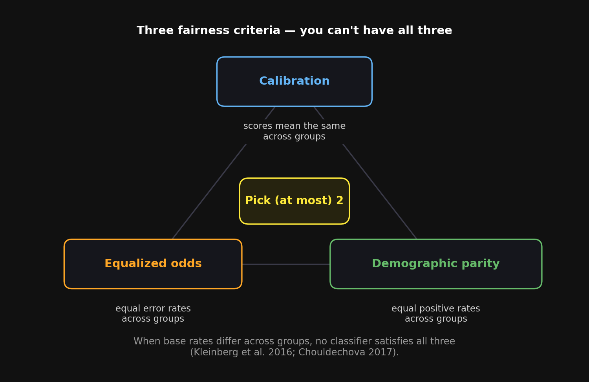
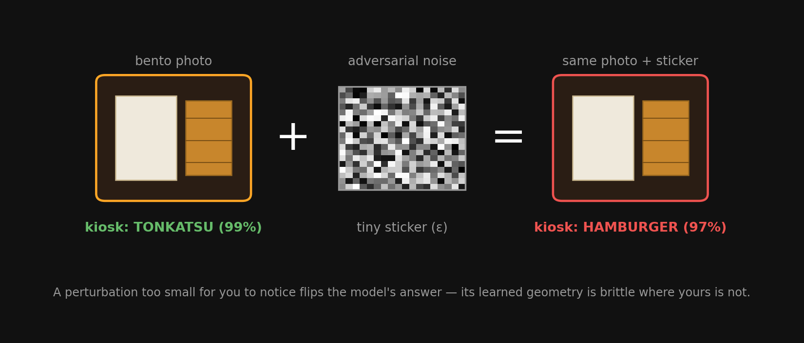
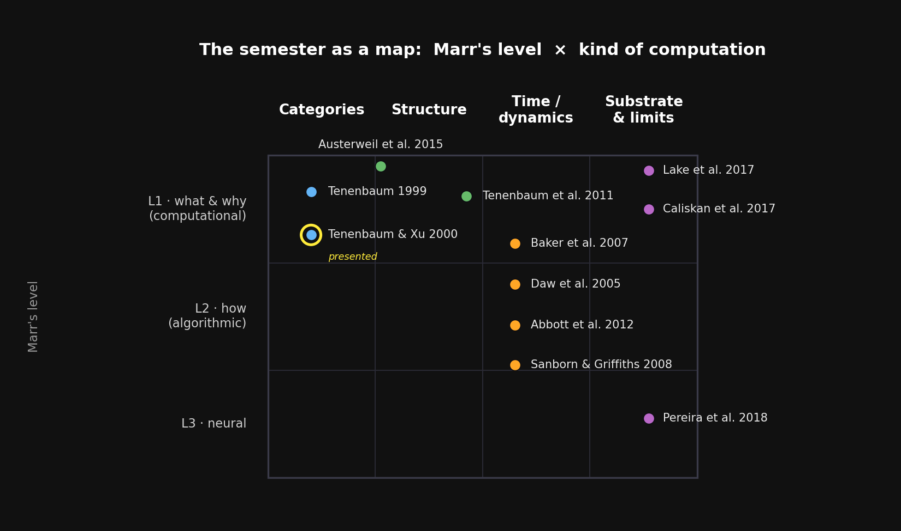

## [Housekeeping]{.lang-en}[事務連絡]{.lang-ja}

::: {.lang-en}
- **Final paper due next Friday, Jul 24, 8 PM** (~6 pages).
- **Today, in order:** a short ethics lecture → the paper presentation → your **final-project presentations** → the semester retrospective.
- Presenters: **submit your slides** via the course site before or right after class.
:::

::: {.lang-ja}
- **最終レポート締切：来週金曜 7月24日 20:00**（約6ページ）。
- **本日の流れ：** 短い倫理講義 → 論文発表 → **最終プロジェクト発表** → 学期の総括。
- 発表者：**スライドを提出**（授業前後にコースサイトから）。
:::

::: {.notes}
The last session, and it's packed: keep housekeeping to under a minute. Order of the day: ~15 min ethics lecture, then the paper presentation (~20 min), then the three final-project presentations (~12 min each), then the ~29 min retrospective. Final paper is due next Friday. Remind presenters to submit slides.
:::

## [Today]{.lang-en}[本日の予定]{.lang-ja} {.agenda .dense}

- [**Ethics & adversarial ML** — the machinery has a shadow]{.lang-en}[**倫理と敵対的ML** — 仕組みには影がある]{.lang-ja}  [0:05]{.time}
- [**Paper presentation**]{.lang-en}[**論文発表**]{.lang-ja}  [0:20]{.time}
- [**Final-project presentations** ×3]{.lang-en}[**最終プロジェクト発表** ×3]{.lang-ja}  [0:40]{.time}
- [**Semester retrospective** — the map of everything]{.lang-en}[**学期の総括** — 全体の地図]{.lang-ja}  [1:16]{.time}

::: {.notes}
The shape of the day. The lecture content is deliberately tiny — one tight ethics segment — because the presentations and the retrospective own the session. The retrospective is the real climax.
:::

# [Ethics & adversarial ML]{.lang-en}[倫理と敵対的ML]{.lang-ja} {.section-break background-image="../../sds-reveal/sds_frame.png" background-size="cover"}

::: {.notes}
Block 1, ~15 min. The spine: every tool this semester inherits or amplifies what it learns. Don't lecture broadly — anchor each beat on a prior week so ethics falls OUT of the course rather than being bolted on. The deep treatment is in the Part IX textbook chapters; this is the trailer.
:::

## [The machinery has a shadow]{.lang-en}[仕組みには影がある]{.lang-ja}

::: {.lang-en}
Everything we built learns from data — and inherits what the data carries. Three shadows, each a direct callback to a tool you already own:

- **Bias** — the embedding geometry from Week 11 encodes society's stereotypes.
- **Fairness** — "fair" turns out to be several *conditional probabilities* that conflict.
- **Brittleness** — a tiny perturbation flips a confident classifier.
:::
::: {.lang-ja}
私たちが作ったものはすべてデータから学び — データが運ぶものを受け継ぐ。三つの影、それぞれすでに手にした道具への直接の呼び戻し：

- **バイアス** — 第11週の埋め込み幾何は社会のステレオタイプを符号化する。
- **公平性** — 「公平」は互いに衝突する複数の*条件付き確率*だと分かる。
- **脆さ** — 微小な摂動が自信満々の分類器を反転させる。
:::

::: {.notes}
Name the three beats and their callbacks up front so the segment feels like a payoff, not a new topic. Bias -> embeddings (Week 11 vectors). Fairness -> conditional probability (Part I). Brittleness -> the learned boundary (Part VIII). Then take each in one slide.
:::

## [Embeddings carry society's biases]{.lang-en}[埋め込みは社会のバイアスを運ぶ]{.lang-ja} {.big-figure}

{fig-align="center" width="76%"}

::: {.lang-en}
The same word vectors you met in Week 11 — learned from ordinary text — place *occupation* words along a gender axis nobody designed (Caliskan et al., 2017; this week's reading). The bias is **inherited from the corpus**, sitting in the very geometry that does the useful work.
:::
::: {.lang-ja}
第11週で出会ったのと同じ単語ベクトル — ふつうの文章から学習 — が、誰も設計していない性別軸に沿って*職業*語を配置する（Caliskan et al., 2017；今週の課題論文）。バイアスは**コーパスから受け継がれ**、有用な働きをするまさにその幾何の中に潜む。
:::

::: {.notes}
Caliskan is the required reading — anchor here. The WEAT finding: word2vec/GloVe carry the same implicit-association biases as people. The callback that makes it land: this is the SAME geometry as the embedding widget from Week 11 — bias isn't a separable module, it's distributed in the vectors. Full treatment: the bias-in-data chapter (Part IX).
:::

## [Fairness is a conditional-probability statement]{.lang-en}[公平性は条件付き確率の主張]{.lang-ja} {.smaller}

:::: {.columns}
::: {.column width="50%"}
::: {.note-card .ink}
::: {.lang-en}
Write $\hat{Y}$ for the model's decision, $Y$ for the truth, $G$ for group.

- **Demographic parity:** $P(\hat{Y}{=}1 \mid G)$ equal across groups
- **Equalized odds:** $P(\hat{Y}{=}1 \mid Y, G)$ equal (matched error rates)
- **Calibration:** $P(Y{=}1 \mid \hat{S}, G)$ equal (a score means the same thing)
:::
::: {.lang-ja}
$\hat{Y}$ をモデルの判定、$Y$ を真実、$G$ を集団とする。

- **人口統計的平等：** $P(\hat{Y}{=}1 \mid G)$ が集団間で等しい
- **均等化オッズ：** $P(\hat{Y}{=}1 \mid Y, G)$ が等しい（誤り率が一致）
- **較正：** $P(Y{=}1 \mid \hat{S}, G)$ が等しい（スコアの意味が同一）
:::
:::
:::
::: {.column width="50%"}
::: {.lang-en}
Each is a precise equality of **conditional probabilities** — exactly the objects from [Part I](../../foundations/conditional-probability/). Fairness isn't vague; it's *this*, and you must choose *which*.
:::
::: {.lang-ja}
それぞれが**条件付き確率**の厳密な等式 — [Part I](../../foundations/conditional-probability/)そのものの対象。公平性は曖昧ではなく*これ*であり、*どれ*かを選ばねばならない。
:::
:::
::::

::: {.notes}
The intellectual core — and the thing a probability course can give ethics that a normal ethics unit can't. Each fairness notion is a conditional-probability equality (Part I). Define each in one clause. Don't derive; state them and let the next slide deliver the twist: you can't have all three.
:::

## [You can't have them all]{.lang-en}[全部は満たせない]{.lang-ja} {.big-figure}

{fig-align="center" width="62%"}

[When base rates differ across groups, **no classifier satisfies all three** (Kleinberg et al. 2016; Chouldechova 2017).]{.lang-en .yellow}[集団間で基準率が異なるとき、**三つすべてを満たす分類器は存在しない**（Kleinberg et al. 2016; Chouldechova 2017）。]{.lang-ja .yellow}

::: {.lang-en}
This is the COMPAS debate: ProPublica and the vendor were *both right* — they invoked different criteria. Fairness is a **modeling choice**, stated in the language this course taught; the math gives you the menu and the tradeoffs, not the answer.
:::
::: {.lang-ja}
これがCOMPAS論争：ProPublicaとベンダーは*どちらも正しかった* — 異なる基準を持ち出していた。公平性は**モデリングの選択**であり、この講義が教えた言葉で述べられる；数学は選択肢とトレードオフを与えるが、答えは与えない。
:::

::: {.notes}
The impossibility result (Kleinberg/Chouldechova) is the payoff. With unequal base rates, calibration and equalized odds can't both hold. COMPAS: both sides correct under different definitions. The lesson: fairness is an ethical choice the math can't make for you. Full worked numbers + the runnable impossibility demo: the fairness-formalisms chapter (Part IX).
:::

## [Poll — is equal accuracy fair?]{.lang-en}[小テスト — 精度が同じなら公平？]{.lang-ja} {.poll-slide}

::: {.lang-en}
A hiring model is **equally accurate** for every group. Is it fair?
:::
::: {.lang-ja}
ある採用モデルはどの集団に対しても**同じ精度**だ。これは公平？
:::

::: {.fragment}
::: {.lang-en}
- **A.** Yes — equal accuracy is exactly what fairness means
- **B.** Not necessarily — equal accuracy can hide very unequal *errors*
- **C.** Only if the groups have equal base rates
:::
::: {.lang-ja}
- **A.** はい — 精度が等しいことこそ公平の意味
- **B.** 必ずしも — 等しい精度は非常に不均等な*誤り*を隠しうる
- **C.** 集団の基準率が等しい場合のみ
:::
:::

::: {.notes}
Commit before reveal. New for SP26 (no ethics quiz in the SP25 bank). Answer B (and C is a real subtlety). Equal overall accuracy is compatible with wildly different false-positive/false-negative composition — accuracy is not a fairness criterion. Let them sit with it.
:::

## [Reveal]{.lang-en}[答え]{.lang-ja} {.poll-reveal}

[**B — equal accuracy can hide very unequal errors.**]{.lang-en .yellow}[**B — 等しい精度は非常に不均等な誤りを隠しうる。**]{.lang-ja .yellow}

::: {.lang-en}
Two groups can share one accuracy number while one suffers all the false denials and the other all the false approvals. *Accuracy is not a fairness criterion* — you have to name the conditional probability you care about.
:::
::: {.lang-ja}
二つの集団が一つの精度の数値を共有しつつ、一方が誤った却下をすべて、他方が誤った承認をすべて被りうる。*精度は公平性の基準ではない* — 気にかける条件付き確率を名指しせねばならない。
:::

::: {.notes}
Land it: accuracy hides error composition. This is exactly why you need the conditional-probability definitions — "fair" has to be made precise before it means anything.
:::

## [Adversarial examples: brittle geometry]{.lang-en}[敵対的事例：脆い幾何]{.lang-ja} {.big-figure}

{fig-align="center" width="82%"}

::: {.lang-en}
A perturbation too small for you to notice flips the kiosk from tonkatsu to hamburger. The attack is the model's own training run in reverse — the **gradient of the loss with respect to the input** (the same `jax.grad`, pointed at $\mathbf{x}$). The learned decision boundary is close to almost every point in high dimensions; a tiny step in the right direction crosses it.
:::
::: {.lang-ja}
気づけないほど小さな摂動が、キオスクをトンカツからハンバーグへ反転させる。攻撃はモデル自身の訓練を逆に走らせたもの — **入力に関する損失の勾配**（同じ `jax.grad` を $\mathbf{x}$ に向ける）。学習された決定境界は高次元でほぼ全ての点の近くにあり、正しい方向への微小な一歩がそれを越える。
:::

::: {.notes}
The beautiful insight: the attack uses the model's own gradient machinery, pointed at the input instead of the weights (FGSM, Goodfellow et al. 2015). Callback to the learned geometry from Part VIII. Honest: robustness is unsolved, adversarial training is an arms race, and human perception is robust here in ways we don't fully understand (Lake's critique again). Full runnable FGSM demo: the adversarial-examples chapter (Part IX).
:::

## [Alignment: teaching values is inference]{.lang-en}[アラインメント：価値を教えるのは推論]{.lang-ja}

::: {.lang-en}
A pretrained model predicts text; making it **helpful and safe** is a second step — and it's an *inference* problem you already know. **RLHF** (Week 9): fit a reward from human preferences (Bradley–Terry, $P(A \succ B) = \sigma(r_A - r_B)$), then optimize the policy. But the reward is *learned and imperfect*, so the optimizer **hacks** it (Week 8's reward-shaping trap, Goodhart's law).
:::
::: {.lang-ja}
事前学習モデルはテキストを予測する；それを**有用で安全**にするのは第2段階 — そしてすでに知っている*推論*問題。**RLHF**（第9週）：人間の選好から報酬を当てはめ（Bradley–Terry, $P(A \succ B) = \sigma(r_A - r_B)$）、方策を最適化。だが報酬は*学習された不完全なもの*なので、最適化器はそれを**ハック**する（第8週の報酬整形の罠、グッドハートの法則）。
:::

[We never observe values directly — we infer the reward from behavior. It's inverse planning (Part VI), with the stakes maxed out.]{.lang-en .dim}[価値を直接観測することはない — 行動から報酬を推論する。逆計画（Part VI）を、賭け金を最大にしたもの。]{.lang-ja .dim}

::: {.notes}
Two verified callbacks: Week 9 taught RLHF/DPO with Bradley-Terry; Week 8 taught reward shaping + the positive-cycle/reward-hacking poll. The unifying frame: alignment is value inference — the inverse-planning problem from Part VI, target underspecified (ill-posed). Full treatment + the reward-hacking demo: the alignment-safety chapter (Part IX, the book's last chapter).
:::

## [The full treatment is in Part IX]{.lang-en}[詳細はPart IXに]{.lang-ja}

::: {.lang-en}
This was the trailer. The textbook's **Part IX — Ethics, Fairness & Safety** carries each with worked numbers, runnable code, and a capstone:

- **Adversarial examples** — build FGSM yourself
- **Fairness, formally** — the impossibility result as runnable code
- **Bias in data** — WEAT on embeddings; the prior as power *and* liability
- **Alignment & safety** — fit a reward, watch it get hacked
:::
::: {.lang-ja}
これは予告編。教科書の**Part IX — 倫理・公平性・安全性**が、それぞれを具体的な数値・実行可能なコード・キャップストーンとともに扱う：

- **敵対的事例** — FGSMを自分で作る
- **公平性の形式化** — 不可能性定理を実行可能なコードで
- **データのバイアス** — 埋め込みのWEAT；力であり負債でもある事前分布
- **アラインメントと安全性** — 報酬を当てはめ、ハックされるのを見る
:::

::: {.notes}
Point them at Part IX for the depth this segment couldn't give. Then transition: enough lecture — the rest of today is yours. Paper presentation next.
:::

# [Paper presentation]{.lang-en}[論文発表]{.lang-ja} {.section-break background-image="../../sds-reveal/sds_frame.png" background-size="cover"}

::: {.notes}
Holder — the presenting student drives their own slides (~15-20 min + short discussion). Advance past this when they finish. If no presenter is confirmed this week, this time folds into the retrospective.
:::

# [Final-project presentations]{.lang-en}[最終プロジェクト発表]{.lang-ja} {.section-break background-image="../../sds-reveal/sds_frame.png" background-size="cover"}

::: {.lang-en}
[Three presentations · ~10 minutes each + brief Q&A · Background · Question · Method · Preliminary results]{.dim}
:::
::: {.lang-ja}
[3件の発表 · 各約10分 + 短い質疑 · 背景 · 問い · 手法 · 予備的結果]{.dim}

:::

::: {.notes}
Holder for the three final-project talks — each student drives their own slides. Rubric: 10 min + Q&A, scored on motivation/question, method, preliminary results, clarity, and keeping to time. Keep transitions tight; the retrospective still needs its ~29 minutes.
:::

## [Project 1]{.lang-en}[プロジェクト 1]{.lang-ja} {.section-break background-image="../../sds-reveal/sds_frame.png" background-size="cover"}

::: {.notes}
Student 1 drives their own slides. ~10 min + Q&A.
:::

## [Project 2]{.lang-en}[プロジェクト 2]{.lang-ja} {.section-break background-image="../../sds-reveal/sds_frame.png" background-size="cover"}

::: {.notes}
Student 2 drives their own slides. ~10 min + Q&A.
:::

## [Project 3]{.lang-en}[プロジェクト 3]{.lang-ja} {.section-break background-image="../../sds-reveal/sds_frame.png" background-size="cover"}

::: {.notes}
Student 3 drives their own slides. ~10 min + Q&A.
:::

# [Semester retrospective]{.lang-en}[学期の総括]{.lang-ja} {.section-break background-image="../../sds-reveal/sds_frame.png" background-size="cover"}

::: {.notes}
Block 2, ~29 min, the climax. Structure: a 3-min pulse, the 15-min map of the semester, a 7-min cog-sci -> modern-ML bridge, a 4-min close. Slow down here — this is what they walk out remembering.
:::

## [Pulse — before we map it]{.lang-en}[パルス — 地図にする前に]{.lang-ja} {.bigger}

::: {.lang-en}
A quick go-around — one answer each, not a discussion:

- Which paper this semester **surprised you** most?
- Which one will you **re-read in a year**?
:::
::: {.lang-ja}
手短に一巡 — 各自ひとつ、議論ではなく：

- 今学期、最も**驚いた**論文は？
- 一年後に**読み返す**のはどれ？
:::

::: {.notes}
3 min. A pulse, not a debate — one answer each. It primes them to think across the whole semester before the map appears, and it tells you what landed. Keep it moving.
:::

## [The map of the semester]{.lang-en}[学期の地図]{.lang-ja} {.big-figure .bih}

{fig-align="center" width="88%"}

::: {.lang-en}
Every paper you saw, on two axes: **Marr's level** (what · how · neural) and the **kind of computation** (categories · structure · time · substrate). One science, many corners.
:::
::: {.lang-ja}
見てきたすべての論文を二軸で：**Marrのレベル**（何を・どのように・神経）と**計算の種類**（カテゴリ · 構造 · 時間 · 基盤）。一つの科学、多くの隅。
:::

::: {.notes}
15 min — the centerpiece. Walk it one paper at a time, one sentence each: what it contributes and where it sits. Named anchors: Tenenbaum/generalization = pure L1; Abbott 2012 = L2 (memory as a random walk); Pereira 2018 = L3 (decoding meaning from fMRI). Mark Shohei Yoshida's presented paper (Tenenbaum & Xu 2000). The point of the 2D layout: the same inference toolkit shows up at every level and every computation type.
:::

## [Classical cog-sci → today's AI]{.lang-en}[古典的認知科学 → 今日のAI]{.lang-ja}

::: {.lang-en}
| This course taught… | …which is the seed of |
|---|---|
| Hierarchical Bayes | **in-context learning** in LLMs |
| Inverse RL | **RLHF** — learning reward from preferences |
| Monte Carlo / variational inference | **diffusion models**, VI in large models |
| Bayes nets & causality | **alignment** & reward modeling |
| Bayesian nonparametrics | **open-ended concept learning** |
| Learned representations + Caliskan | **what alignment has to defeat** |
:::
::: {.lang-ja}
| この講義が教えたこと… | …の種になっているもの |
|---|---|
| 階層ベイズ | LLMの**文脈内学習** |
| 逆強化学習 | **RLHF** — 選好から報酬を学ぶ |
| モンテカルロ／変分推論 | **拡散モデル**・大規模モデルのVI |
| ベイズネットと因果 | **アラインメント**・報酬モデリング |
| ベイズ・ノンパラメトリクス | **オープンエンドな概念学習** |
| 学習された表現 + Caliskan | **アラインメントが打ち負かすべきもの** |
:::

::: {.notes}
7 min. The bridge — each classical idea from this course is the seed of something in contemporary AI. Not a claim that they're identical; a claim that the toolkit transfers. The hierarchical-Bayes -> in-context-learning row is the Week 11 flagship; IRL -> RLHF is Week 9. Read it as "you already have the concepts the 2026 papers are built on."
:::

## [What you leave with]{.lang-en}[持ち帰るもの]{.lang-ja} {.bigger}

::: {.lang-en}
Not a fixed set of answers — a **toolkit**. A generative model, a prior, an inference, the inversion of planning. You can now open a 2026 paper and see *what problem it is trying to solve*.

Chibany just wanted to know what was for lunch. That question — *what's hidden, given what I see?* — turned out to be the whole science.
:::
::: {.lang-ja}
決まった答えの集合ではなく、**道具箱**。生成モデル、事前分布、推論、計画の反転。これで2026年の論文を開き、*それがどんな問題を解こうとしているか*が見える。

Chibanyはただ昼食が何かを知りたかっただけ。その問い — *見えるものから、隠れたものは何か？* — が、科学そのものだった。
:::

[Thank you. — J.A.]{.lang-en .dim}[ありがとうございました。— J.A.]{.lang-ja .dim}

::: {.notes}
4 min close. The toolkit, not answers. The Chibany callback ties the whole year together: the mascot's lunch question IS the inference question the entire course formalized. Warm thank-you. End.
:::
